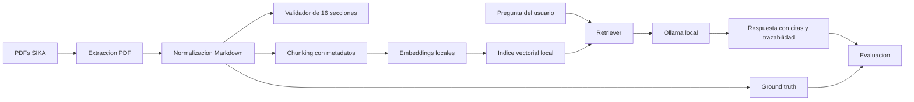
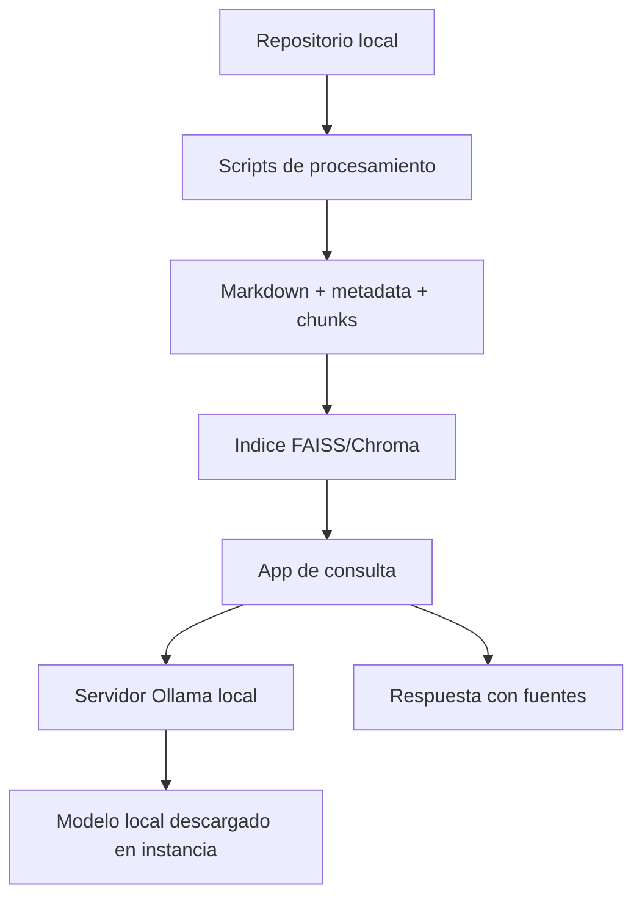

# Planteamiento del proyecto RAG sobre Fichas de Datos de Seguridad SIKA

## 1. Objetivo

Implementar un sistema RAG reproducible para consultar Fichas de Datos de Seguridad (FDS/MSDS) de productos SIKA, usando Ollama local como runtime principal. El sistema debe convertir PDFs tecnicos a Markdown estructurado, preservar trazabilidad documental y responder preguntas con evidencia tomada de los fragmentos recuperados.

El objetivo academico es maximizar la calidad de la entrega sin desviarse del enunciado. Por eso el cumplimiento obligatorio se concentrara en SIKA, que es el fabricante asignado al Grupo I, y se agregara Pintuco como fabricante adicional para demostrar escalabilidad, comparacion entre fabricantes y robustez del pipeline.

## 2. Alcance

El proyecto tendra dos niveles de alcance:

### Alcance obligatorio

- Fabricante: SIKA.
- Corpus inicial: PDFs ubicados en `Documentos - Parcial final/SIKA`.
- Tipo de documentos: Fichas de Datos de Seguridad de pinturas, esmaltes, epoxicos, uretanos y productos Sikafloor.
- Salida documental esperada: archivos `.md` con estructura verificable, metadatos y secciones normativas.

### Alcance adicional para puntos extra

- Fabricante adicional propuesto: Pintuco.
- Corpus adicional: PDFs ubicados en `Documentos - Parcial final/Pintuco`.
- Proposito: demostrar que el pipeline no esta sobreajustado a SIKA, detectar duplicados, comparar respuestas entre fabricantes y evaluar escalabilidad.

CORONA y Pintuland quedan fuera del alcance de implementacion inicial. Se podrian mencionar como corpus disponible no procesado si el tiempo no alcanza.

## 3. Requerimientos del enunciado

El sistema debe cumplir estos puntos:

- Convertir documentos PDF a Markdown.
- Preservar titulos, subtitulos, tablas, listas, notas y referencias.
- Extraer e identificar las 16 secciones normativas de cada FDS.
- Implementar RAG funcional con modelos locales o infraestructura propia.
- Documentar y justificar la estrategia de chunking.
- Permitir consultas sobre los documentos asignados.
- Mostrar trazabilidad entre respuesta, fragmento recuperado, seccion y documento fuente.
- Documentar limitaciones, errores de extraccion y mitigaciones.
- Evaluar el RAG contra un conjunto ground truth de pares pregunta-respuesta.

## 4. Arquitectura propuesta



### Arquitectura de despliegue

El repositorio local sera la fuente principal del proyecto. Ollama local sera la infraestructura principal de inferencia para reducir latencia, dependencia de red y riesgo operativo durante la demo.



Decision clave: Ollama local no se trata como API externa paga, sino como infraestructura propia ejecutando modelos locales. AWS/ngrok queda como alternativa documentada, no como dependencia de la entrega final.

## 5. Componentes tecnicos

### 5.1 Extraccion documental

Objetivo: transformar cada PDF en texto estructurado y Markdown.

Propuesta inicial:

- Usar herramientas open source en Python.
- Extraer texto base con `pypdf` y PyMuPDF.
- Extraer tablas con PyMuPDF `find_tables()` y conservarlas como tablas Markdown.
- Extraer imagenes, logos, pictogramas e iconos embebidos como assets versionables.
- Ejecutar OCR local con Tesseract (`spa+eng`) sobre imagenes extraidas.
- Asociar tablas e imagenes a secciones mediante proximidad espacial, referencias textuales o metadatos de pagina.
- Guardar por cada documento:
  - Markdown final.
  - JSON de metadatos.
  - Registro de errores de extraccion.

Salida sugerida:

```text
data/
  raw/
    sika/
  processed/
    markdown/
    metadata/
    extraction_reports/
```

### 5.2 Estructura Markdown

Cada archivo `.md` deberia tener:

- Encabezado con metadatos: producto, fabricante, fecha, codigo, archivo fuente.
- Tabla de secciones detectadas.
- Las 16 secciones normativas como encabezados principales.
- Tablas convertidas a Markdown cuando sea posible.
- Notas de trazabilidad para imagenes, tablas o bloques dudosos.

Formato minimo sugerido:

```markdown
---
fabricante: SIKA
producto: Esmalte Uretano AR Comp. B
archivo_fuente: FDS 22 - Esmalte Uretano AR Comp. B.pdf
paginas: 8
---

# Ficha de Datos de Seguridad

## Seccion 1: Identificacion de la sustancia o la mezcla y de la sociedad o la empresa

...

> Nota de trazabilidad: contenido extraido de la pagina 1 del PDF fuente.
```

### 5.3 Validacion de las 16 secciones

Se implementara un validador que revise si el Markdown contiene estas secciones:

1. Identificacion de la sustancia o mezcla y de la sociedad o empresa.
2. Identificacion de los peligros.
3. Composicion/informacion sobre los componentes.
4. Primeros auxilios.
5. Medidas de lucha contra incendios.
6. Medidas en caso de vertido accidental.
7. Manipulacion y almacenamiento.
8. Controles de exposicion/proteccion individual.
9. Propiedades fisicas y quimicas.
10. Estabilidad y reactividad.
11. Informacion toxicologica.
12. Informacion ecologica.
13. Consideraciones relativas a la eliminacion.
14. Informacion relativa al transporte.
15. Informacion reglamentaria.
16. Otra informacion.

El validador debe producir un reporte por documento con:

- Secciones encontradas.
- Secciones faltantes.
- Paginas asociadas.
- Alertas de baja confianza.

### 5.4 Chunking

Estrategia propuesta:

- Chunk principal por seccion normativa.
- Subchunk por subseccion cuando una seccion sea larga.
- Tamano objetivo: 500 a 900 tokens por chunk.
- Solapamiento: 80 a 120 tokens solo entre subchunks de la misma seccion.
- Metadatos obligatorios:
  - `document_id`
  - `producto`
  - `fabricante`
  - `archivo_fuente`
  - `seccion`
  - `pagina_inicio`
  - `pagina_fin`
  - `chunk_id`

Justificacion: las FDS ya tienen una estructura normativa fuerte. Chunkear por seccion mejora la trazabilidad y evita mezclar informacion de peligros, almacenamiento, toxicologia o transporte en un mismo fragmento.

### 5.5 RAG con Ollama local

Propuesta de alta calidad y bajo acoplamiento:

- Embeddings locales: `sentence-transformers` multilingue o modelo local compatible con Ollama.
- Vector store local: FAISS o Chroma.
- LLM: Ollama local con `qwen2.5:3b`.
- API o interfaz:
  - Opcion simple: CLI o notebook.
  - Opcion demostrable: app con Streamlit.

Configuracion recomendada:

- Mantener documentos, Markdown, chunks e indice reproducibles desde scripts.
- Mantener variables de entorno para la URL de Ollama:
  - `OLLAMA_BASE_URL=http://127.0.0.1:11434`
- Separar el modelo generativo del modelo de embeddings para poder cambiar uno sin reconstruir todo el sistema.
- Implementar un modo "sin evidencia suficiente" para evitar respuestas inventadas.

Respuesta esperada del RAG:

```text
Respuesta:
...

Fuentes:
1. Producto: ...
   Documento: ...
   Seccion: ...
   Pagina: ...
   Fragmento recuperado: ...
```

## 6. Evaluacion

Se construira un ground truth con preguntas y respuestas de referencia.

Tipos de preguntas:

- Factuales: nombre del producto, codigo, fabricante, telefono de emergencia.
- Tecnicas: controles de exposicion, EPP, propiedades fisicoquimicas.
- Seguridad: peligros, primeros auxilios, incendios, vertidos.
- Trazabilidad: en que seccion/pagina aparece determinada informacion.
- Comparativas: diferencias entre dos productos SIKA.

Formato sugerido:

```json
{
  "question": "Que equipo de proteccion personal recomienda la FDS?",
  "expected_answer": "...",
  "source_document": "...",
  "source_section": "Seccion 8",
  "source_pages": [4],
  "evaluation_criteria": ["exactitud", "trazabilidad", "no alucinacion"]
}
```

Metricas:

- Exactitud semantica.
- Recuperacion correcta del contexto.
- Coherencia tecnica.
- Calidad de trazabilidad.
- Presencia de alucinaciones.

## 7. Entregables

1. Repositorio organizado.
2. Pipeline de conversion PDF a Markdown.
3. Documentos SIKA convertidos a Markdown.
4. Reporte de validacion de secciones.
5. Sistema RAG funcional.
6. Dataset ground truth.
7. Evaluacion del RAG.
8. Informe corto con arquitectura, decisiones tecnicas, limitaciones y resultados.

## 8. Plan de ejecucion

### Fase 1: Diagnostico del corpus obligatorio y adicional

- Inventariar PDFs SIKA.
- Inventariar PDFs Pintuco como extension.
- Detectar duplicados.
- Revisar paginas, calidad de texto y necesidad de OCR.
- Elegir 2 o 3 documentos piloto.
- Elegir 1 documento piloto Pintuco para probar generalizacion.

### Fase 2: Pipeline PDF a Markdown

- Implementar extractor base.
- Normalizar encabezados de secciones.
- Preservar tablas y listas.
- Generar Markdown y metadatos.
- Producir reporte de errores.

### Fase 3: Validacion documental

- Implementar detector de 16 secciones.
- Revisar manualmente documentos piloto.
- Ajustar heuristicas.
- Ejecutar sobre todo SIKA.

### Fase 4: Indexacion y RAG con Ollama local

- Crear chunks con metadatos.
- Generar embeddings locales.
- Crear indice vectorial.
- Implementar consulta con recuperacion top-k.
- Generar respuestas con citas.
- Conectar la app local al servidor Ollama local.
- Documentar como reproducir el despliegue.

### Fase 5: Evaluacion

- Crear ground truth.
- Ejecutar preguntas contra el RAG.
- Comparar resultados.
- Registrar aciertos, errores y alucinaciones.

### Fase 6: Informe y demo

- Documentar arquitectura.
- Explicar decisiones tecnicas.
- Incluir ejemplos de Markdown.
- Mostrar consultas representativas.
- Reportar limitaciones y mitigaciones.
- Mostrar comparacion SIKA vs Pintuco como mejora adicional, sin presentar Pintuco como reemplazo del fabricante asignado.

## 8.1 Estrategia para maximizar la nota

La prioridad sera cumplir perfectamente lo obligatorio antes de ampliar alcance.

Orden de calidad:

1. SIKA completo y bien validado.
2. Trazabilidad robusta por documento, seccion, pagina y chunk.
3. Markdown legible y fiel al PDF original.
4. RAG con citas obligatorias y control de alucinaciones.
5. Evaluacion con ground truth y ejemplos comparativos.
6. Pintuco como extension de escalabilidad y comparacion.
7. Ollama local documentado como infraestructura propia reproducible.

Lo adicional solo suma si no debilita SIKA. Si el tiempo se reduce, se procesa Pintuco con una muestra representativa y se explica como extension, pero no se sacrifica la completitud del fabricante asignado.

## 9. Riesgos y mitigaciones

| Riesgo | Impacto | Mitigacion |
|---|---:|---|
| PDFs con tablas mal extraidas | Alto | Usar extractor especializado y revisar documentos piloto |
| Secciones con nombres variables | Medio | Normalizar con regex flexible |
| OCR lento en conversion masiva | Medio | Ejecutarlo localmente sobre imagenes extraidas y registrar resultados en metadata |
| Respuestas sin fuente | Alto | Obligar al generador a citar chunks recuperados |
| Alucinaciones del LLM | Alto | Responder "no encontrado" si no hay evidencia suficiente |
| Modelo local pesado | Medio | Separar retriever, embeddings y LLM para poder cambiar modelos |

## 10. Primera version minima viable

La primera version debe demostrar el flujo completo con pocos documentos:

1. Convertir 2 PDFs SIKA a Markdown.
2. Detectar sus 16 secciones.
3. Crear chunks con metadatos.
4. Indexar con embeddings locales.
5. Consultar Ollama local para generar respuestas.
6. Responder 5 preguntas con fuentes.
7. Documentar errores encontrados.

Despues de validar esta version, se escala al resto del corpus SIKA.

## 11. Version objetivo para entrega excelente

La version final buscada sera:

- 15 PDFs SIKA procesados o justificados si alguno falla por calidad del PDF.
- 21 PDFs Pintuco inventariados y una parte procesada o todos procesados si el pipeline queda estable.
- Markdown generado automaticamente con metadatos y trazabilidad.
- Reporte de validacion de secciones por documento.
- Deduplicacion documentada.
- RAG consultable por CLI, notebook o Streamlit.
- Ollama local corriendo con instrucciones de despliegue.
- Ground truth con al menos 25 preguntas:
  - 15 sobre SIKA.
  - 5 de trazabilidad.
  - 5 comparativas o de generalizacion con Pintuco.
- Informe final con arquitectura, decisiones, costos computacionales aproximados, limitaciones y resultados.

## 12. Demo interactiva

La demo se construira como una app Streamlit conectada al indice documental y a Ollama local.

### Modos de uso

1. Consulta sobre corpus preprocesado:
   - SIKA como fabricante obligatorio.
   - Pintuco como fabricante adicional.
   - Respuestas con fuentes, seccion, pagina y fragmento recuperado.

2. Ingesta dinamica por carga manual de PDFs:
   - El usuario podra subir uno o varios PDFs desde el navegador.
   - La app procesara esos PDFs con el mismo pipeline:
     - extraccion de texto,
     - conversion a Markdown,
     - deteccion de secciones,
     - generacion de chunks,
     - indexacion temporal,
     - consulta RAG.
   - Este modo servira para demostrar portabilidad y generalizacion del sistema.

### Alcance del modo de carga manual

La carga manual sera una funcionalidad de demostracion. Para evitar riesgos durante la presentacion:

- SIKA y Pintuco quedaran procesados previamente.
- Los PDFs subidos en vivo se procesaran como una coleccion temporal.
- La app mostrara advertencias si algun PDF no contiene texto extraible, tiene secciones incompletas o presenta elementos visuales sin OCR legible.
- El usuario podra consultar los PDFs subidos sin afectar el indice principal.

### Justificacion

Este modo muestra que el proyecto no depende de rutas fijas ni de documentos quemados. Tambien refuerza la arquitectura reproducible: cualquier PDF nuevo pasa por el mismo flujo de extraccion, validacion, chunking, recuperacion y generacion con trazabilidad.
