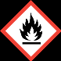
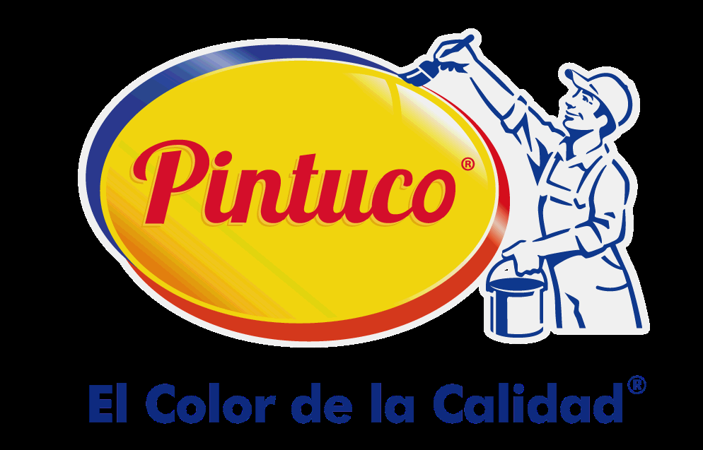
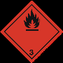

# Ficha de Datos de Seguridad - ESMALTE TOP QUALITY GRIS PLATA 1799

## Metadatos

- Fabricante: Pintuco
- Archivo fuente: `FDS 30 - ESMALTE TOP QUALITY GRIS PLATA 1799 -PINTUCO .pdf`
- Paginas: 11
- Secciones detectadas: 16 de 16
- Tablas extraidas: 47
- Imagenes extraidas: 37

## Tabla de secciones detectadas

| Seccion | Titulo normalizado | Paginas |
|---:|---|---:|
| 1 | Identificacion de la sustancia o la mezcla y de la sociedad o la empresa | 1 |
| 2 | Identificacion de los peligros | 1-2 |
| 3 | Composicion/informacion sobre los componentes | 2 |
| 4 | Primeros auxilios | 2 |
| 5 | Medidas de lucha contra incendios | 2-3 |
| 6 | Medidas en caso de vertido accidental | 3 |
| 7 | Manipulacion y almacenamiento | 3-4 |
| 8 | Controles de exposicion/proteccion individual | 4-5 |
| 9 | Propiedades fisicas y quimicas | 5-6 |
| 10 | Estabilidad y reactividad | 6 |
| 11 | Informacion toxicologica | 6-8 |
| 12 | Informacion ecologica | 8 |
| 13 | Consideraciones relativas a la eliminacion | 8 |
| 14 | Informacion relativa al transporte | 8-9 |
| 15 | Informacion reglamentaria | 9-10 |
| 16 | Otra informacion | 10-11 |

## Seccion 1: Identificacion de la sustancia o la mezcla y de la sociedad o la empresa

> Nota de trazabilidad: contenido extraido de la pagina 1 del PDF fuente `FDS 30 - ESMALTE TOP QUALITY GRIS PLATA 1799 -PINTUCO .pdf`.

1.1 Identificador SGA del producto: ESMALTE TOP QUALITY GRIS PLATA 1799
10013033

1.2 Uso recomendado del producto químico y restricciones:
Usos pertinentes: Pintura
Usos desaconsejados: Todo aquel uso no especificado en este epígrafe ni en el epígrafe 7.3
1.3 Datos sobre el proveedor:
Pintuco
Autopista Medellín Bogotá Km 37 Vía Belén Rionegro Km 1
054040 Rionegro - Antioquia - Colombia
Tfno.: 57 4 569 81 00
contacto@pintuco.com
http://www.pintuco.com

1.4 Número de teléfono para emergencias: 57 4 561 22 23

### Tablas extraidas de esta seccion

#### Tabla `pintuco__fds-30-esmalte-top-quality-gris-plata-1799-pintuco__p001_tbl01`

|Col1|SECCIÓN 1: IDENTIFICACIÓN DEL PRODUCTO|
|---|---|
|**1.1**<br>**Identificador SGA del producto:**<br>ESMALTE TOP QUALITY GRIS PLATA 1799<br>10013033<br>**1.2**<br>**Uso recomendado del producto químico y restricciones:**<br>Usos pertinentes: Pintura<br>Usos desaconsejados: Todo aquel uso no especificado en este epígrafe ni en el epígrafe 7.3<br>**1.3**<br>**Datos sobre el proveedor:**<br>Pintuco<br>Autopista Medellín Bogotá Km 37 Vía Belén Rionegro Km 1<br>054040 Rionegro - Antioquia - Colombia<br>Tfno.: 57 4 569 81 00<br>contacto@pintuco.com<br>http://www.pintuco.com<br>**1.4**<br>**Número de teléfono para emergencias:**<br>57 4 561 22 23|**1.1**<br>**Identificador SGA del producto:**<br>ESMALTE TOP QUALITY GRIS PLATA 1799<br>10013033<br>**1.2**<br>**Uso recomendado del producto químico y restricciones:**<br>Usos pertinentes: Pintura<br>Usos desaconsejados: Todo aquel uso no especificado en este epígrafe ni en el epígrafe 7.3<br>**1.3**<br>**Datos sobre el proveedor:**<br>Pintuco<br>Autopista Medellín Bogotá Km 37 Vía Belén Rionegro Km 1<br>054040 Rionegro - Antioquia - Colombia<br>Tfno.: 57 4 569 81 00<br>contacto@pintuco.com<br>http://www.pintuco.com<br>**1.4**<br>**Número de teléfono para emergencias:**<br>57 4 561 22 23|

> Nota de trazabilidad: tabla `pintuco__fds-30-esmalte-top-quality-gris-plata-1799-pintuco__p001_tbl01` extraida de la pagina 1, asociada a la Seccion 1 por proximidad espacial y metadatos de pagina.


### Imagenes extraidas de esta seccion

#### Imagen `pintuco__fds-30-esmalte-top-quality-gris-plata-1799-pintuco__p001_img01`


> Nota de trazabilidad: imagen `pintuco__fds-30-esmalte-top-quality-gris-plata-1799-pintuco__p001_img01` extraida de la pagina 1, asociada a la Seccion 1 por proximidad espacial y metadatos de pagina. Tipo detectado: imagen_embebida. Hash SHA-256: bddb1e8e26b57a44ff127f842574a5c217d8f89762e07cc89800b970482b4e01.

**Texto OCR de la imagen:**

```text
El Color de la Calidad”
```

#### Imagen `pintuco__fds-30-esmalte-top-quality-gris-plata-1799-pintuco__p001_img02`


> Nota de trazabilidad: imagen `pintuco__fds-30-esmalte-top-quality-gris-plata-1799-pintuco__p001_img02` extraida de la pagina 1, asociada a la Seccion 1 por proximidad espacial y metadatos de pagina. Tipo detectado: imagen_embebida. Hash SHA-256: bce6ad87b1221832f1455c2eeaf1966317bcdd5364f2484b119b33bf9fdf08b8.

**Texto OCR de la imagen:**

```text
El Color de la Calidad
```


## Seccion 2: Identificacion de los peligros

> Nota de trazabilidad: contenido extraido de la pagina 1 a la pagina 2 del PDF fuente `FDS 30 - ESMALTE TOP QUALITY GRIS PLATA 1799 -PINTUCO .pdf`.

2.1 Clasificación de la sustancia o de la mezcla:
SGA:
La clasificación del producto se ha realizado conforme con al decreto 1496 de 2018, por el cual se adopta el Sistema Globalmente
Armonizado de Clasificación y Etiquetado de Productos Químicos y se dictan otras disposiciones en materia de seguridad química.

Acuatico agudo. 2: Peligrosidad aguda para el medio ambiente acuático, Categoría 2, H401
Acuatico cronico. 2: Peligrosidad cronica para el medio ambiente acuático, Categoría 2, H411
Irrit. Cut. 2: Irritación cutánea, categoría 2, H315
Liq. Infl. 3: Líquidos inflamables, Categoría 3, H226
Sens. Cut. 1A: Sensibilización cutánea, Categoría 1A, H317
STOT unica 3: Toxicidad específica con efectos de somnolencia y vértigo (exposición única), Categoría 3, H336
Tox. Asp. 1: Peligro por aspiración, Categoría 1, H304

2.2 Elementos de las etiquetas del SGA, incluidos los consejos de prudencia:
SGA:
Peligro

Indicaciones de peligro:
Acuatico cronico. 2: H411 - Tóxico para los organismos acuáticos, con efectos nocivos duraderos
Irrit. Cut. 2: H315 - Provoca irritación cutánea
Liq. Infl. 3: H226 - Líquido y vapores inflamables
Sens. Cut. 1A: H317 - Puede provocar una reacción cutánea alérgica
STOT unica 3: H336 - Puede provocar somnolencia o vértigo
Tox. Asp. 1: H304 - Puede ser mortal en caso de ingestión y de penetración en las vías respiratorias

Consejos de prudencia:
P101: Si se necesita consultar a un médico, tener a mano el recipiente o la etiqueta del producto
P102: Mantener fuera del alcance de los niños
P210: Mantener alejado del calor, superficies calientes, chispas llamas al descubierto y otras fuentes de ignición. No fumar
P264: Lavarse cuidadosamente después de la manipulación
P280: Usar guantes/ropa de protección/equipo de protección para los ojos/la cara
P304+P340: EN CASO DE INHALACIÓN: Transportar a la persona al aire libre y mantenerla en una posición que le facilite la
respiración
P370+P378: En caso de incendio: Utilizar extintor de polvo ABC para la extinción
P501: Eliminar el contenido/recipiente mediante el sistema de recogida selectiva habilitado en su municipio

Sustancias que contribuyen a la clasificación
Destilados (petróleo), fracción ligera tratada con hidrógeno; Bis(2-etilhexanoato) de cobalto
2.3 Otros peligros que no conducen a una clasificación:
No relevante

Página 1/11 Emisión: 16/05/2018 Revisión: 28/01/2019 Versión: 3 (sustituye a 2)
- CONTINÚA EN LA SIGUIENTE PÁGINA -
10013033

Ficha de datos de seguridad
según Decreto 1496 de 2018

### Tablas extraidas de esta seccion

#### Tabla `pintuco__fds-30-esmalte-top-quality-gris-plata-1799-pintuco__p001_tbl02`

|Col1|SECCIÓN 2: IDENTIFICACIÓN DEL PELIGRO O PELIGROS|
|---|---|
|**2.1**<br>**Clasificación de la sustancia o de la mezcla:**<br>**SGA:**<br>La clasificación del producto se ha realizado conforme con al decreto 1496 de 2018, por el cual se adopta el Sistema Globalmente<br>Armonizado de Clasificación y Etiquetado de Productos Químicos y se dictan otras disposiciones en materia de seguridad química.<br>Acuatico agudo. 2: Peligrosidad aguda para el medio ambiente acuático, Categoría 2, H401<br>Acuatico cronico. 2: Peligrosidad cronica para el medio ambiente acuático, Categoría 2, H411<br>Irrit. Cut. 2: Irritación cutánea, categoría 2, H315<br>Liq. Infl. 3: Líquidos inflamables, Categoría 3, H226<br>Sens. Cut. 1A: Sensibilización cutánea, Categoría 1A, H317<br>STOT unica 3: Toxicidad específica con efectos de somnolencia y vértigo (exposición única), Categoría 3, H336<br>Tox. Asp. 1: Peligro por aspiración, Categoría 1, H304<br>**2.2**<br>**Elementos de las etiquetas del SGA, incluidos los consejos de prudencia:**<br>**SGA:**<br>**Peligro**<br>**Indicaciones de peligro:**<br>Acuatico cronico. 2: H411 - Tóxico para los organismos acuáticos, con efectos nocivos duraderos<br>Irrit. Cut. 2: H315 - Provoca irritación cutánea<br>Liq. Infl. 3: H226 - Líquido y vapores inflamables<br>Sens. Cut. 1A: H317 - Puede provocar una reacción cutánea alérgica<br>STOT unica 3: H336 - Puede provocar somnolencia o vértigo<br>Tox. Asp. 1: H304 - Puede ser mortal en caso de ingestión y de penetración en las vías respiratorias<br>**Consejos de prudencia:**<br>P101: Si se necesita consultar a un médico, tener a mano el recipiente o la etiqueta del producto<br>P102: Mantener fuera del alcance de los niños<br>P210: Mantener alejado del calor, superficies calientes, chispas llamas al descubierto y otras fuentes de ignición. No fumar<br>P264: Lavarse cuidadosamente después de la manipulación<br>P280: Usar guantes/ropa de protección/equipo de protección para los ojos/la cara<br>P304+P340: EN CASO DE INHALACIÓN: Transportar a la persona al aire libre y mantenerla en una posición que le facilite la<br>respiración<br>P370+P378: En caso de incendio: Utilizar extintor de polvo ABC para la extinción<br>P501: Eliminar el contenido/recipiente mediante el sistema de recogida selectiva habilitado en su municipio<br>**Sustancias que contribuyen a la clasificación**<br>Destilados (petróleo), fracción ligera tratada con hidrógeno; Bis(2-etilhexanoato) de cobalto<br>**2.3**<br>**Otros peligros que no conducen a una clasificación:**<br>No relevante|**2.1**<br>**Clasificación de la sustancia o de la mezcla:**<br>**SGA:**<br>La clasificación del producto se ha realizado conforme con al decreto 1496 de 2018, por el cual se adopta el Sistema Globalmente<br>Armonizado de Clasificación y Etiquetado de Productos Químicos y se dictan otras disposiciones en materia de seguridad química.<br>Acuatico agudo. 2: Peligrosidad aguda para el medio ambiente acuático, Categoría 2, H401<br>Acuatico cronico. 2: Peligrosidad cronica para el medio ambiente acuático, Categoría 2, H411<br>Irrit. Cut. 2: Irritación cutánea, categoría 2, H315<br>Liq. Infl. 3: Líquidos inflamables, Categoría 3, H226<br>Sens. Cut. 1A: Sensibilización cutánea, Categoría 1A, H317<br>STOT unica 3: Toxicidad específica con efectos de somnolencia y vértigo (exposición única), Categoría 3, H336<br>Tox. Asp. 1: Peligro por aspiración, Categoría 1, H304<br>**2.2**<br>**Elementos de las etiquetas del SGA, incluidos los consejos de prudencia:**<br>**SGA:**<br>**Peligro**<br>**Indicaciones de peligro:**<br>Acuatico cronico. 2: H411 - Tóxico para los organismos acuáticos, con efectos nocivos duraderos<br>Irrit. Cut. 2: H315 - Provoca irritación cutánea<br>Liq. Infl. 3: H226 - Líquido y vapores inflamables<br>Sens. Cut. 1A: H317 - Puede provocar una reacción cutánea alérgica<br>STOT unica 3: H336 - Puede provocar somnolencia o vértigo<br>Tox. Asp. 1: H304 - Puede ser mortal en caso de ingestión y de penetración en las vías respiratorias<br>**Consejos de prudencia:**<br>P101: Si se necesita consultar a un médico, tener a mano el recipiente o la etiqueta del producto<br>P102: Mantener fuera del alcance de los niños<br>P210: Mantener alejado del calor, superficies calientes, chispas llamas al descubierto y otras fuentes de ignición. No fumar<br>P264: Lavarse cuidadosamente después de la manipulación<br>P280: Usar guantes/ropa de protección/equipo de protección para los ojos/la cara<br>P304+P340: EN CASO DE INHALACIÓN: Transportar a la persona al aire libre y mantenerla en una posición que le facilite la<br>respiración<br>P370+P378: En caso de incendio: Utilizar extintor de polvo ABC para la extinción<br>P501: Eliminar el contenido/recipiente mediante el sistema de recogida selectiva habilitado en su municipio<br>**Sustancias que contribuyen a la clasificación**<br>Destilados (petróleo), fracción ligera tratada con hidrógeno; Bis(2-etilhexanoato) de cobalto<br>**2.3**<br>**Otros peligros que no conducen a una clasificación:**<br>No relevante|

> Nota de trazabilidad: tabla `pintuco__fds-30-esmalte-top-quality-gris-plata-1799-pintuco__p001_tbl02` extraida de la pagina 1, asociada a la Seccion 2 por proximidad espacial y metadatos de pagina.

#### Tabla `pintuco__fds-30-esmalte-top-quality-gris-plata-1799-pintuco__p001_tbl03`

|Emisión: 16/05/2018 Revisión: 28/01/2019 Versión: 3 (sustituye a 2)|Página 1/11|
|---|---|

> Nota de trazabilidad: tabla `pintuco__fds-30-esmalte-top-quality-gris-plata-1799-pintuco__p001_tbl03` extraida de la pagina 1, asociada a la Seccion 2 por proximidad espacial y metadatos de pagina.


### Imagenes extraidas de esta seccion

#### Imagen `pintuco__fds-30-esmalte-top-quality-gris-plata-1799-pintuco__p001_img03`


> Nota de trazabilidad: imagen `pintuco__fds-30-esmalte-top-quality-gris-plata-1799-pintuco__p001_img03` extraida de la pagina 1, asociada a la Seccion 2 por proximidad espacial y metadatos de pagina. Tipo detectado: icono_o_marca_pequena. Hash SHA-256: cb39b0eb17ae6344a9e5a7c9e225ea5e45938eb8d0b5dec2d4606989565e1a20.

**Texto OCR de la imagen:**

```text
OCR sin texto legible.
```

#### Imagen `pintuco__fds-30-esmalte-top-quality-gris-plata-1799-pintuco__p001_img04`



> Nota de trazabilidad: imagen `pintuco__fds-30-esmalte-top-quality-gris-plata-1799-pintuco__p001_img04` extraida de la pagina 1, asociada a la Seccion 2 por proximidad espacial y metadatos de pagina. Tipo detectado: icono_o_marca_pequena. Hash SHA-256: b4f630a174b0e8f931a598192596ccfa504c4a32453087131f0d8b3381b1f05e.

**Texto OCR de la imagen:**

```text
OCR sin texto legible.
```

#### Imagen `pintuco__fds-30-esmalte-top-quality-gris-plata-1799-pintuco__p001_img05`


> Nota de trazabilidad: imagen `pintuco__fds-30-esmalte-top-quality-gris-plata-1799-pintuco__p001_img05` extraida de la pagina 1, asociada a la Seccion 2 por proximidad espacial y metadatos de pagina. Tipo detectado: icono_o_marca_pequena. Hash SHA-256: c0cd36a3de038fd2f3493b95a111808bac7f7b5c98fe91fe20d3a57011016216.

**Texto OCR de la imagen:**

```text
OCR sin texto legible.
```

#### Imagen `pintuco__fds-30-esmalte-top-quality-gris-plata-1799-pintuco__p001_img06`


> Nota de trazabilidad: imagen `pintuco__fds-30-esmalte-top-quality-gris-plata-1799-pintuco__p001_img06` extraida de la pagina 1, asociada a la Seccion 2 por proximidad espacial y metadatos de pagina. Tipo detectado: icono_o_marca_pequena. Hash SHA-256: ac192854646a168e328e3812becb0a58ec1d3948f058476576d8a6550f25259e.

**Texto OCR de la imagen:**

```text
OCR sin texto legible.
```

#### Imagen `pintuco__fds-30-esmalte-top-quality-gris-plata-1799-pintuco__p001_img07`


> Nota de trazabilidad: imagen `pintuco__fds-30-esmalte-top-quality-gris-plata-1799-pintuco__p001_img07` extraida de la pagina 1, asociada a la Seccion 2 por proximidad espacial y metadatos de pagina. Tipo detectado: icono_o_marca_pequena. Hash SHA-256: 1fb30b8dd7ab22c0c19c674caf7b5c2e289000fb5fd6bc73151b687bc522acf0.

**Texto OCR de la imagen:**

```text
OCR sin texto legible.
```

#### Imagen `pintuco__fds-30-esmalte-top-quality-gris-plata-1799-pintuco__p002_img02`


> Nota de trazabilidad: imagen `pintuco__fds-30-esmalte-top-quality-gris-plata-1799-pintuco__p002_img02` extraida de la pagina 2, asociada a la Seccion 2 por proximidad espacial y metadatos de pagina. Tipo detectado: imagen_embebida. Hash SHA-256: bce6ad87b1221832f1455c2eeaf1966317bcdd5364f2484b119b33bf9fdf08b8.

**Texto OCR de la imagen:**

```text
El Color de la Calidad
```


## Seccion 3: Composicion/informacion sobre los componentes

> Nota de trazabilidad: contenido extraido de la pagina 2 del PDF fuente `FDS 30 - ESMALTE TOP QUALITY GRIS PLATA 1799 -PINTUCO .pdf`.

3.1 Sustancias:
No aplicable
3.2 Mezclas:
Descripción química: Mezcla a base de productos químicos
Componentes:
De acuerdo al Decreto 1496 de 2018, el producto presenta:
Identificación Nombre químico/clasificación Concentración

CAS:

64742-47-8

Destilados (petróleo), fracción ligera tratada con hidrógeno 25 - <50 %

CAS:

13463-67-7

Dioxido de titanio 10 - <25 %

CAS:

136-52-7

Bis(2-etilhexanoato) de cobalto <1 %

CAS:

1333-86-4

Negro de carbon <1 %
Para ampliar información sobre la peligrosidad de la sustancias consultar las secciones 8, 11, 12, 15 y 16. La clasificación respecto
Carcinogenicidad de las sustancias se ha establecido en función de las monografías de la IARC adecuandola al sistema de
clasificación SGA, para información sobre la clasificación IARC consulte la sección 11.

### Tablas extraidas de esta seccion

#### Tabla `pintuco__fds-30-esmalte-top-quality-gris-plata-1799-pintuco__p002_tbl01`

|Col1|SECCIÓN 3: COMPOSICIÓN/INFORMACIÓN SOBRE LOS COMPONENTES|
|---|---|
|**3.1**<br>**Sustancias:**<br>No aplicable<br>**3.2**<br>**Mezclas:**<br>**Descripción química:**Mezcla a base de productos químicos<br>**Componentes:**<br>De acuerdo al Decreto 1496 de 2018, el producto presenta:<br>Identificación<br>Nombre químico/clasificación<br>Concentración<br>CAS: 64742-47-8<br>**Destilados (petróleo), fracción ligera tratada con hidrógeno**<br>**25 - <50 %**<br>CAS: 13463-67-7<br>**Dioxido de titanio**<br>**10 - <25 %**<br>CAS:<br>136-52-7<br>**Bis(2-etilhexanoato) de cobalto**<br>**<1 %**<br>CAS: 1333-86-4<br>**Negro de carbon**<br>**<1 %**<br>Para ampliar información sobre la peligrosidad de la sustancias consultar las secciones 8, 11, 12, 15 y 16. La clasificación respecto<br>Carcinogenicidad de las sustancias se ha establecido en función de las monografías de la IARC adecuandola al sistema de<br>clasificación SGA, para información sobre la clasificación IARC consulte la sección 11.|**3.1**<br>**Sustancias:**<br>No aplicable<br>**3.2**<br>**Mezclas:**<br>**Descripción química:**Mezcla a base de productos químicos<br>**Componentes:**<br>De acuerdo al Decreto 1496 de 2018, el producto presenta:<br>Identificación<br>Nombre químico/clasificación<br>Concentración<br>CAS: 64742-47-8<br>**Destilados (petróleo), fracción ligera tratada con hidrógeno**<br>**25 - <50 %**<br>CAS: 13463-67-7<br>**Dioxido de titanio**<br>**10 - <25 %**<br>CAS:<br>136-52-7<br>**Bis(2-etilhexanoato) de cobalto**<br>**<1 %**<br>CAS: 1333-86-4<br>**Negro de carbon**<br>**<1 %**<br>Para ampliar información sobre la peligrosidad de la sustancias consultar las secciones 8, 11, 12, 15 y 16. La clasificación respecto<br>Carcinogenicidad de las sustancias se ha establecido en función de las monografías de la IARC adecuandola al sistema de<br>clasificación SGA, para información sobre la clasificación IARC consulte la sección 11.|

> Nota de trazabilidad: tabla `pintuco__fds-30-esmalte-top-quality-gris-plata-1799-pintuco__p002_tbl01` extraida de la pagina 2, asociada a la Seccion 3 por proximidad espacial y metadatos de pagina.

#### Tabla `pintuco__fds-30-esmalte-top-quality-gris-plata-1799-pintuco__p002_tbl02`

|Identificación|Nombre químico/clasificación|Concentración|
|---|---|---|
|CAS: 64742-47-8|**Destilados (petróleo), fracción ligera tratada con hidrógeno**|**25 - <50 %**|
|CAS: 13463-67-7|**Dioxido de titanio**|**10 - <25 %**|
|CAS:<br>136-52-7|**Bis(2-etilhexanoato) de cobalto**|**<1 %**|
|CAS: 1333-86-4|**Negro de carbon**|**<1 %**|

> Nota de trazabilidad: tabla `pintuco__fds-30-esmalte-top-quality-gris-plata-1799-pintuco__p002_tbl02` extraida de la pagina 2, asociada a la Seccion 3 por proximidad espacial y metadatos de pagina.


### Imagenes extraidas de esta seccion

#### Imagen `pintuco__fds-30-esmalte-top-quality-gris-plata-1799-pintuco__p002_img01`


> Nota de trazabilidad: imagen `pintuco__fds-30-esmalte-top-quality-gris-plata-1799-pintuco__p002_img01` extraida de la pagina 2, asociada a la Seccion 3 por proximidad espacial y metadatos de pagina. Tipo detectado: imagen_embebida. Hash SHA-256: bddb1e8e26b57a44ff127f842574a5c217d8f89762e07cc89800b970482b4e01.

**Texto OCR de la imagen:**

```text
El Color de la Calidad”
```


## Seccion 4: Primeros auxilios

> Nota de trazabilidad: contenido extraido de la pagina 2 del PDF fuente `FDS 30 - ESMALTE TOP QUALITY GRIS PLATA 1799 -PINTUCO .pdf`.

4.1 Descripción de los primeros auxilios necesarios:
Los síntomas como consecuencia de una intoxicación pueden presentarse con posterioridad a la exposición, por lo que, en caso de
duda, exposición directa al producto químico o persistencia del malestar solicitar atención médica, mostrándole la FDS de este
producto.

Por inhalación:
Sacar al afectado del lugar de exposición, suministrarle aire limpio y mantenerlo en reposo. En casos graves como parada
cardiorespiratoria, se aplicarán técnicas de respiración artificial (respiración boca a boca, masaje cardíaco, suministro de
oxígeno,etc.) requiriendo asistencia médica inmediata.

Por contacto con la piel:
Quitar la ropa y los zapatos contaminados, aclarar la piel o duchar al afectado si procede con abundante agua fría y jabón neutro. En
caso de afección importante acudir al médico. Si el producto produce quemaduras o congelación, no se debe quitar la ropa debido a
que podría empeorar la lesión producida si esta se encuentra pegada a la piel. En el caso de formarse ampollas en la piel, éstas
nunca deben reventarse ya que aumentaría el riesgo de infección.

Por contacto con los ojos:
Enjuagar los ojos con abundante agua a temperatura ambiente al menos durante 15 minutos. Evitar que el afectado se frote o cierre
los ojos. En el caso de que el accidentado use lentes de contacto, éstas deben retirarse siempre que no estén pegadas a los ojos,
de otro modo podría producirse un daño adicional. En todos los casos, después del lavado, se debe acudir al médico lo más
rápidamente posible con la FDS del producto.

Por ingestión/aspiración:
Requerir asistencia médica inmediata, mostrándole la FDS de este producto. No inducir al vómito, en el caso de que se produzca
mantener inclinada la cabeza hacia delante para evitar la aspiración. En el caso de pérdida de consciencia no administrar nada por
vía oral hasta la supervisión del médico. Enjuagar la boca y la garganta, ya que existe la posibilidad de que hayan sido afectadas en
la ingestión. Mantener al afectado en reposo.

4.2 Síntomas/efectos más importantes, agudos o retardados:
Los efectos agudos y retardados son los indicados en las secciones 2 y 11.
4.3 Indicación de la necesidad de recibir atención médica inmediata y, en su caso, de tratamiento especial:
No relevante

### Tablas extraidas de esta seccion

#### Tabla `pintuco__fds-30-esmalte-top-quality-gris-plata-1799-pintuco__p002_tbl03`

|Col1|SECCIÓN 4: PRIMEROS AUXILIOS|
|---|---|
|**4.1**<br>**Descripción de los primeros auxilios necesarios:**<br>Los síntomas como consecuencia de una intoxicación pueden presentarse con posterioridad a la exposición, por lo que, en caso de<br>duda, exposición directa al producto químico o persistencia del malestar solicitar atención médica, mostrándole la FDS de este<br>producto.<br>**Por inhalación:**<br>Sacar al afectado del lugar de exposición, suministrarle aire limpio y mantenerlo en reposo. En casos graves como parada<br>cardiorespiratoria, se aplicarán técnicas de respiración artificial (respiración boca a boca, masaje cardíaco, suministro de<br>oxígeno,etc.) requiriendo asistencia médica inmediata.<br>**Por contacto con la piel:**<br>Quitar la ropa y los zapatos contaminados, aclarar la piel o duchar al afectado si procede con abundante agua fría y jabón neutro. En<br>caso de afección importante acudir al médico. Si el producto produce quemaduras o congelación, no se debe quitar la ropa debido a<br>que podría empeorar la lesión producida si esta se encuentra pegada a la piel. En el caso de formarse ampollas en la piel, éstas<br>nunca deben reventarse ya que aumentaría el riesgo de infección.<br>**Por contacto con los ojos:**<br>Enjuagar los ojos con abundante agua a temperatura ambiente al menos durante 15 minutos. Evitar que el afectado se frote o cierre<br>los ojos. En el caso de que el accidentado use lentes de contacto, éstas deben retirarse siempre que no estén pegadas a los ojos,<br>de otro modo podría producirse un daño adicional. En todos los casos, después del lavado, se debe acudir al médico lo más<br>rápidamente posible con la FDS del producto.<br>**Por ingestión/aspiración:**<br>Requerir asistencia médica inmediata, mostrándole la FDS de este producto. No inducir al vómito, en el caso de que se produzca<br>mantener inclinada la cabeza hacia delante para evitar la aspiración. En el caso de pérdida de consciencia no administrar nada por<br>vía oral hasta la supervisión del médico. Enjuagar la boca y la garganta, ya que existe la posibilidad de que hayan sido afectadas en<br>la ingestión. Mantener al afectado en reposo.<br>**4.2**<br>**Síntomas/efectos más importantes, agudos o retardados:**<br>Los efectos agudos y retardados son los indicados en las secciones 2 y 11.<br>**4.3**<br>**Indicación de la necesidad de recibir atención médica inmediata y, en su caso, de tratamiento especial:**<br>No relevante|**4.1**<br>**Descripción de los primeros auxilios necesarios:**<br>Los síntomas como consecuencia de una intoxicación pueden presentarse con posterioridad a la exposición, por lo que, en caso de<br>duda, exposición directa al producto químico o persistencia del malestar solicitar atención médica, mostrándole la FDS de este<br>producto.<br>**Por inhalación:**<br>Sacar al afectado del lugar de exposición, suministrarle aire limpio y mantenerlo en reposo. En casos graves como parada<br>cardiorespiratoria, se aplicarán técnicas de respiración artificial (respiración boca a boca, masaje cardíaco, suministro de<br>oxígeno,etc.) requiriendo asistencia médica inmediata.<br>**Por contacto con la piel:**<br>Quitar la ropa y los zapatos contaminados, aclarar la piel o duchar al afectado si procede con abundante agua fría y jabón neutro. En<br>caso de afección importante acudir al médico. Si el producto produce quemaduras o congelación, no se debe quitar la ropa debido a<br>que podría empeorar la lesión producida si esta se encuentra pegada a la piel. En el caso de formarse ampollas en la piel, éstas<br>nunca deben reventarse ya que aumentaría el riesgo de infección.<br>**Por contacto con los ojos:**<br>Enjuagar los ojos con abundante agua a temperatura ambiente al menos durante 15 minutos. Evitar que el afectado se frote o cierre<br>los ojos. En el caso de que el accidentado use lentes de contacto, éstas deben retirarse siempre que no estén pegadas a los ojos,<br>de otro modo podría producirse un daño adicional. En todos los casos, después del lavado, se debe acudir al médico lo más<br>rápidamente posible con la FDS del producto.<br>**Por ingestión/aspiración:**<br>Requerir asistencia médica inmediata, mostrándole la FDS de este producto. No inducir al vómito, en el caso de que se produzca<br>mantener inclinada la cabeza hacia delante para evitar la aspiración. En el caso de pérdida de consciencia no administrar nada por<br>vía oral hasta la supervisión del médico. Enjuagar la boca y la garganta, ya que existe la posibilidad de que hayan sido afectadas en<br>la ingestión. Mantener al afectado en reposo.<br>**4.2**<br>**Síntomas/efectos más importantes, agudos o retardados:**<br>Los efectos agudos y retardados son los indicados en las secciones 2 y 11.<br>**4.3**<br>**Indicación de la necesidad de recibir atención médica inmediata y, en su caso, de tratamiento especial:**<br>No relevante|

> Nota de trazabilidad: tabla `pintuco__fds-30-esmalte-top-quality-gris-plata-1799-pintuco__p002_tbl03` extraida de la pagina 2, asociada a la Seccion 4 por proximidad espacial y metadatos de pagina.


## Seccion 5: Medidas de lucha contra incendios

> Nota de trazabilidad: contenido extraido de la pagina 2 a la pagina 3 del PDF fuente `FDS 30 - ESMALTE TOP QUALITY GRIS PLATA 1799 -PINTUCO .pdf`.

5.1 Medios de extinción apropiados:
Emplear preferentemente extintores de polvo polivalente (polvo ABC), alternativamente utilizar espuma física o extintores de dióxido
de carbono (CO2). NO SE RECOMIENDA emplear agua a chorro como agente de extinción.

Página 2/11 Emisión: 16/05/2018 Revisión: 28/01/2019 Versión: 3 (sustituye a 2)
- CONTINÚA EN LA SIGUIENTE PÁGINA -
10013033

Ficha de datos de seguridad
según Decreto 1496 de 2018
SECCIÓN 5: MEDIDAS DE LUCHA CONTRA INCENDIOS (continúa)
5.2 Peligros específicos del producto químico:
Como consecuencia de la combustión o descomposición térmica se generan subproductos de reacción que pueden resultar
altamente tóxicos y, consecuentemente, pueden presentar un riesgo elevado para la salud.

5.3 Medidas especiales que deben tomar los equipos de lucha contra incendios:
En función de la magnitud del incendio puede hacerse necesario el uso de ropa protectora completa y equipo de respiración
autónomo. Disponer de un mínimo de instalaciones de emergencia o elementos de actuación (mantas ignífugas, botiquín portátil,...).

Disposiciones adicionales:
Actuar conforme el Plan de Emergencia Interior y las Fichas Informativas sobre actuación ante accidentes y otras emergencias.
Suprimir cualquier fuente de ignición. En caso de incendio, refrigerar los recipientes y tanques de almacenamiento de productos
susceptibles a inflamación, explosión como consecuencia de elevadas temperaturas. Evitar el vertido de los productos empleados en
la extinción del incendio al medio acuático.

### Tablas extraidas de esta seccion

#### Tabla `pintuco__fds-30-esmalte-top-quality-gris-plata-1799-pintuco__p002_tbl04`

|Col1|SECCIÓN 5: MEDIDAS DE LUCHA CONTRA INCENDIOS|
|---|---|
|**5.1**<br>**Medios de extinción apropiados:**<br>Emplear preferentemente extintores de polvo polivalente (polvo ABC), alternativamente utilizar espuma física o extintores de dióxido<br>de carbono (CO2). NO SE RECOMIENDA emplear agua a chorro como agente de extinción.|**5.1**<br>**Medios de extinción apropiados:**<br>Emplear preferentemente extintores de polvo polivalente (polvo ABC), alternativamente utilizar espuma física o extintores de dióxido<br>de carbono (CO2). NO SE RECOMIENDA emplear agua a chorro como agente de extinción.|

> Nota de trazabilidad: tabla `pintuco__fds-30-esmalte-top-quality-gris-plata-1799-pintuco__p002_tbl04` extraida de la pagina 2, asociada a la Seccion 5 por proximidad espacial y metadatos de pagina.

#### Tabla `pintuco__fds-30-esmalte-top-quality-gris-plata-1799-pintuco__p002_tbl05`

|Emisión: 16/05/2018 Revisión: 28/01/2019 Versión: 3 (sustituye a 2)|Página 2/11|
|---|---|

> Nota de trazabilidad: tabla `pintuco__fds-30-esmalte-top-quality-gris-plata-1799-pintuco__p002_tbl05` extraida de la pagina 2, asociada a la Seccion 5 por proximidad espacial y metadatos de pagina.

#### Tabla `pintuco__fds-30-esmalte-top-quality-gris-plata-1799-pintuco__p003_tbl01`

|Col1|SECCIÓN 5: MEDIDAS DE LUCHA CONTRA INCENDIOS (continúa)|
|---|---|
|**5.2**<br>**Peligros específicos del producto químico:**<br>Como consecuencia de la combustión o descomposición térmica se generan subproductos de reacción que pueden resultar<br>altamente tóxicos y, consecuentemente, pueden presentar un riesgo elevado para la salud.<br>**5.3**<br>**Medidas especiales que deben tomar los equipos de lucha contra incendios:**<br>En función de la magnitud del incendio puede hacerse necesario el uso de ropa protectora completa y equipo de respiración<br>autónomo. Disponer de un mínimo de instalaciones de emergencia o elementos de actuación (mantas ignífugas, botiquín portátil,...).<br>**Disposiciones adicionales:**<br>Actuar conforme el Plan de Emergencia Interior y las Fichas Informativas sobre actuación ante accidentes y otras emergencias.<br>Suprimir cualquier fuente de ignición. En caso de incendio, refrigerar los recipientes y tanques de almacenamiento de productos<br>susceptibles a inflamación, explosión como consecuencia de elevadas temperaturas. Evitar el vertido de los productos empleados en<br>la extinción del incendio al medio acuático.|**5.2**<br>**Peligros específicos del producto químico:**<br>Como consecuencia de la combustión o descomposición térmica se generan subproductos de reacción que pueden resultar<br>altamente tóxicos y, consecuentemente, pueden presentar un riesgo elevado para la salud.<br>**5.3**<br>**Medidas especiales que deben tomar los equipos de lucha contra incendios:**<br>En función de la magnitud del incendio puede hacerse necesario el uso de ropa protectora completa y equipo de respiración<br>autónomo. Disponer de un mínimo de instalaciones de emergencia o elementos de actuación (mantas ignífugas, botiquín portátil,...).<br>**Disposiciones adicionales:**<br>Actuar conforme el Plan de Emergencia Interior y las Fichas Informativas sobre actuación ante accidentes y otras emergencias.<br>Suprimir cualquier fuente de ignición. En caso de incendio, refrigerar los recipientes y tanques de almacenamiento de productos<br>susceptibles a inflamación, explosión como consecuencia de elevadas temperaturas. Evitar el vertido de los productos empleados en<br>la extinción del incendio al medio acuático.|

> Nota de trazabilidad: tabla `pintuco__fds-30-esmalte-top-quality-gris-plata-1799-pintuco__p003_tbl01` extraida de la pagina 3, asociada a la Seccion 5 por proximidad espacial y metadatos de pagina.


### Imagenes extraidas de esta seccion

#### Imagen `pintuco__fds-30-esmalte-top-quality-gris-plata-1799-pintuco__p003_img01`


> Nota de trazabilidad: imagen `pintuco__fds-30-esmalte-top-quality-gris-plata-1799-pintuco__p003_img01` extraida de la pagina 3, asociada a la Seccion 5 por proximidad espacial y metadatos de pagina. Tipo detectado: imagen_embebida. Hash SHA-256: bddb1e8e26b57a44ff127f842574a5c217d8f89762e07cc89800b970482b4e01.

**Texto OCR de la imagen:**

```text
El Color de la Calidad”
```

#### Imagen `pintuco__fds-30-esmalte-top-quality-gris-plata-1799-pintuco__p003_img02`


> Nota de trazabilidad: imagen `pintuco__fds-30-esmalte-top-quality-gris-plata-1799-pintuco__p003_img02` extraida de la pagina 3, asociada a la Seccion 5 por proximidad espacial y metadatos de pagina. Tipo detectado: imagen_embebida. Hash SHA-256: bce6ad87b1221832f1455c2eeaf1966317bcdd5364f2484b119b33bf9fdf08b8.

**Texto OCR de la imagen:**

```text
El Color de la Calidad
```


## Seccion 6: Medidas en caso de vertido accidental

> Nota de trazabilidad: contenido extraido de la pagina 3 del PDF fuente `FDS 30 - ESMALTE TOP QUALITY GRIS PLATA 1799 -PINTUCO .pdf`.

6.1 Precauciones personales, equipo protector y procedimiento de emergencia:
Aislar las fugas siempre y cuando no suponga un riesgo adicional para las personas que desempeñen esta función. Evacuar la zona
y mantener a las personas sin protección alejadas. Ante el contacto potencial con el producto derramado se hace obligatorio el uso
de elementos de protección personal (ver sección 8). Evitar de manera prioritaria la formación de mezclas vapor-aire inflamables, ya
sea mediante ventilación o el uso de un agente inertizante. Suprimir cualquier fuente de ignición. Eliminar las cargas electroestáticas
mediante la interconexión de todas las superficies conductoras sobre las que se puede formar electricidad estática, y estando a su
vez el conjunto conectado a tierra.

6.2 Precauciones relativas al medio ambiente:
Evitar a toda costa cualquier tipo de vertido al medio acuático. Contener adecuadamente el producto absorbido/recogido en
recipientes herméticamente cerrados. Notificar a la autoridad competente en el caso de exposición al público en general o al
medioambiente.

6.3 Métodos y materiales para la contención y limpieza de vertidos:
Se recomienda:
Absorber el vertido mediante arena o absorbente inerte y trasladarlo a un lugar seguro. No absorber en serrín u otros absorbentes
combustibles. Para cualquier consideración relativa a la eliminación consultar la sección 13.

6.4 Referencias a otras secciones:
Ver secciones 8 y 13.

### Tablas extraidas de esta seccion

#### Tabla `pintuco__fds-30-esmalte-top-quality-gris-plata-1799-pintuco__p003_tbl02`

|Col1|SECCIÓN 6: MEDIDAS QUE DEBEN TOMARSE EN CASO DE VERTIDO ACCIDENTAL|
|---|---|
|**6.1**<br>**Precauciones personales, equipo protector y procedimiento de emergencia:**<br>Aislar las fugas siempre y cuando no suponga un riesgo adicional para las personas que desempeñen esta función. Evacuar la zona<br>y mantener a las personas sin protección alejadas. Ante el contacto potencial con el producto derramado se hace obligatorio el uso<br>de elementos de protección personal (ver sección 8). Evitar de manera prioritaria la formación de mezclas vapor-aire inflamables, ya<br>sea mediante ventilación o el uso de un agente inertizante. Suprimir cualquier fuente de ignición. Eliminar las cargas electroestáticas<br>mediante la interconexión de todas las superficies conductoras sobre las que se puede formar electricidad estática, y estando a su<br>vez el conjunto conectado a tierra.<br>**6.2**<br>**Precauciones relativas al medio ambiente:**<br>Evitar a toda costa cualquier tipo de vertido al medio acuático. Contener adecuadamente el producto absorbido/recogido en<br>recipientes herméticamente cerrados. Notificar a la autoridad competente en el caso de exposición al público en general o al<br>medioambiente.<br>**6.3**<br>**Métodos y materiales para la contención y limpieza de vertidos:**<br>Se recomienda:<br>Absorber el vertido mediante arena o absorbente inerte y trasladarlo a un lugar seguro. No absorber en serrín u otros absorbentes<br>combustibles. Para cualquier consideración relativa a la eliminación consultar la sección 13.<br>**6.4**<br>**Referencias a otras secciones:**<br>Ver secciones 8 y 13.|**6.1**<br>**Precauciones personales, equipo protector y procedimiento de emergencia:**<br>Aislar las fugas siempre y cuando no suponga un riesgo adicional para las personas que desempeñen esta función. Evacuar la zona<br>y mantener a las personas sin protección alejadas. Ante el contacto potencial con el producto derramado se hace obligatorio el uso<br>de elementos de protección personal (ver sección 8). Evitar de manera prioritaria la formación de mezclas vapor-aire inflamables, ya<br>sea mediante ventilación o el uso de un agente inertizante. Suprimir cualquier fuente de ignición. Eliminar las cargas electroestáticas<br>mediante la interconexión de todas las superficies conductoras sobre las que se puede formar electricidad estática, y estando a su<br>vez el conjunto conectado a tierra.<br>**6.2**<br>**Precauciones relativas al medio ambiente:**<br>Evitar a toda costa cualquier tipo de vertido al medio acuático. Contener adecuadamente el producto absorbido/recogido en<br>recipientes herméticamente cerrados. Notificar a la autoridad competente en el caso de exposición al público en general o al<br>medioambiente.<br>**6.3**<br>**Métodos y materiales para la contención y limpieza de vertidos:**<br>Se recomienda:<br>Absorber el vertido mediante arena o absorbente inerte y trasladarlo a un lugar seguro. No absorber en serrín u otros absorbentes<br>combustibles. Para cualquier consideración relativa a la eliminación consultar la sección 13.<br>**6.4**<br>**Referencias a otras secciones:**<br>Ver secciones 8 y 13.|

> Nota de trazabilidad: tabla `pintuco__fds-30-esmalte-top-quality-gris-plata-1799-pintuco__p003_tbl02` extraida de la pagina 3, asociada a la Seccion 6 por proximidad espacial y metadatos de pagina.


## Seccion 7: Manipulacion y almacenamiento

> Nota de trazabilidad: contenido extraido de la pagina 3 a la pagina 4 del PDF fuente `FDS 30 - ESMALTE TOP QUALITY GRIS PLATA 1799 -PINTUCO .pdf`.

7.1 Precauciones que se deben tomar para garantizar una manipulación segura:
A.- Precauciones generales
Cumplir con la legislación vigente en materia de prevención de riesgos laborales. Mantener los recipientes herméticamente
cerrados. Controlar los derrames y residuos, eliminándolos con métodos seguros (sección 6). Evitar el vertido libre desde el
recipiente. Mantener orden y limpieza donde se manipulen productos peligrosos.

B.- Recomendaciones técnicas para la prevención de incendios y explosiones.
Trasvasar en lugares bien ventilados, preferentemente mediante extracción localizada. Controlar totalmente los focos de ignición
(teléfonos móviles, chispas,…) y ventilar en las operaciones de limpieza. Evitar la existencia de atmósferas peligrosas en el
interior de recipientes, aplicando en lo posible sistemas de inertización. Trasvasar a velocidades lentas para evitar la generación
de cargas electroestáticas. Ante la posibilidad de existencia de cargas electroestáticas: asegurar una perfecta conexión
equipotencial, utilizar siempre tomas de tierras, no emplear ropa de trabajo de fibras acrílicas, empleando preferiblemente ropa de
algodón y calzado conductor. Cumplir con los requisitos esenciales de seguridad para equipos y con las disposiciones mínimas
para la protección de la seguridad y salud de los trabajadores. Consultar la sección 10 sobre condiciones y materias que deben
evitarse.

C.- Recomendaciones técnicas para prevenir riesgos ergonómicos y toxicológicos.
Para control de exposición consultar la sección 8. No comer, beber ni fumar en las zonas de trabajo; lavarse las manos después
de cada utilización, y despojarse de prendas de vestir y equipos de protección contaminados antes de entrar en las zonas para
comer.

D.- Recomendaciones técnicas para prevenir riesgos medioambientales
Debido a la peligrosidad de este producto para el medio ambiente se recomienda manipularlo dentro de un área que disponga de
barreras de control de la contaminación en caso de vertido, así como disponer de material absorbente en las proximidades del
mismo

Página 3/11 Emisión: 16/05/2018 Revisión: 28/01/2019 Versión: 3 (sustituye a 2)
- CONTINÚA EN LA SIGUIENTE PÁGINA -
10013033

Ficha de datos de seguridad
según Decreto 1496 de 2018
SECCIÓN 7: MANIPULACIÓN Y ALMACENAMIENTO (continúa)
7.2 Condiciones de almacenamiento seguro, incluidas cualesquiera incompatibilidades:
A.- Medidas técnicas de almacenamiento
B.- Condiciones generales de almacenamiento.
Evitar fuentes de calor, radiación, electricidad estática y el contacto con alimentos. Para información adicional ver epígrafe 10.5
7.3 Usos específicos finales:
Salvo las indicaciones ya especificadas no es preciso realizar ninguna recomendación especial en cuanto a los usos de este
producto.

Tª mínima: 5 ºC
Tª máxima: 30 ºC
Tiempo máximo: 18 meses

### Tablas extraidas de esta seccion

#### Tabla `pintuco__fds-30-esmalte-top-quality-gris-plata-1799-pintuco__p003_tbl03`

|Col1|SECCIÓN 7: MANIPULACIÓN Y ALMACENAMIENTO|
|---|---|
|**7.1**<br>**Precauciones que se deben tomar para garantizar una manipulación segura:**<br>A.- Precauciones generales<br>Cumplir con la legislación vigente en materia de prevención de riesgos laborales. Mantener los recipientes herméticamente<br>cerrados. Controlar los derrames y residuos, eliminándolos con métodos seguros (sección 6). Evitar el vertido libre desde el<br>recipiente. Mantener orden y limpieza donde se manipulen productos peligrosos.<br>B.- Recomendaciones técnicas para la prevención de incendios y explosiones.<br>Trasvasar en lugares bien ventilados, preferentemente mediante extracción localizada. Controlar totalmente los focos de ignición<br>(teléfonos móviles, chispas,…) y ventilar en las operaciones de limpieza. Evitar la existencia de atmósferas peligrosas en el<br>interior de recipientes, aplicando en lo posible sistemas de inertización. Trasvasar a velocidades lentas para evitar la generación<br>de cargas electroestáticas. Ante la posibilidad de existencia de cargas electroestáticas: asegurar una perfecta conexión<br>equipotencial, utilizar siempre tomas de tierras, no emplear ropa de trabajo de fibras acrílicas, empleando preferiblemente ropa de<br>algodón y calzado conductor. Cumplir con los requisitos esenciales de seguridad para equipos  y con las disposiciones mínimas<br>para la protección de la seguridad y salud de los trabajadores. Consultar la sección 10 sobre condiciones y materias que deben<br>evitarse.<br>C.- Recomendaciones técnicas para prevenir riesgos ergonómicos y toxicológicos.<br>Para control de exposición consultar la sección  8. No comer, beber ni fumar en las zonas de trabajo; lavarse las manos después<br>de cada utilización, y despojarse de prendas de vestir y equipos de protección contaminados antes de entrar en las zonas para<br>comer.<br>D.- Recomendaciones técnicas para prevenir riesgos medioambientales<br>Debido a la peligrosidad de este producto para el medio ambiente se recomienda manipularlo dentro de un área que disponga de<br>barreras de control de la contaminación en caso de vertido, así como disponer de material absorbente en las proximidades del<br>mismo|**7.1**<br>**Precauciones que se deben tomar para garantizar una manipulación segura:**<br>A.- Precauciones generales<br>Cumplir con la legislación vigente en materia de prevención de riesgos laborales. Mantener los recipientes herméticamente<br>cerrados. Controlar los derrames y residuos, eliminándolos con métodos seguros (sección 6). Evitar el vertido libre desde el<br>recipiente. Mantener orden y limpieza donde se manipulen productos peligrosos.<br>B.- Recomendaciones técnicas para la prevención de incendios y explosiones.<br>Trasvasar en lugares bien ventilados, preferentemente mediante extracción localizada. Controlar totalmente los focos de ignición<br>(teléfonos móviles, chispas,…) y ventilar en las operaciones de limpieza. Evitar la existencia de atmósferas peligrosas en el<br>interior de recipientes, aplicando en lo posible sistemas de inertización. Trasvasar a velocidades lentas para evitar la generación<br>de cargas electroestáticas. Ante la posibilidad de existencia de cargas electroestáticas: asegurar una perfecta conexión<br>equipotencial, utilizar siempre tomas de tierras, no emplear ropa de trabajo de fibras acrílicas, empleando preferiblemente ropa de<br>algodón y calzado conductor. Cumplir con los requisitos esenciales de seguridad para equipos  y con las disposiciones mínimas<br>para la protección de la seguridad y salud de los trabajadores. Consultar la sección 10 sobre condiciones y materias que deben<br>evitarse.<br>C.- Recomendaciones técnicas para prevenir riesgos ergonómicos y toxicológicos.<br>Para control de exposición consultar la sección  8. No comer, beber ni fumar en las zonas de trabajo; lavarse las manos después<br>de cada utilización, y despojarse de prendas de vestir y equipos de protección contaminados antes de entrar en las zonas para<br>comer.<br>D.- Recomendaciones técnicas para prevenir riesgos medioambientales<br>Debido a la peligrosidad de este producto para el medio ambiente se recomienda manipularlo dentro de un área que disponga de<br>barreras de control de la contaminación en caso de vertido, así como disponer de material absorbente en las proximidades del<br>mismo|

> Nota de trazabilidad: tabla `pintuco__fds-30-esmalte-top-quality-gris-plata-1799-pintuco__p003_tbl03` extraida de la pagina 3, asociada a la Seccion 7 por proximidad espacial y metadatos de pagina.

#### Tabla `pintuco__fds-30-esmalte-top-quality-gris-plata-1799-pintuco__p004_tbl01`

|Col1|SECCIÓN 7: MANIPULACIÓN Y ALMACENAMIENTO (continúa)|
|---|---|
|**7.2**<br>**Condiciones de almacenamiento seguro, incluidas cualesquiera incompatibilidades:**<br>A.- Medidas técnicas de almacenamiento<br>B.- Condiciones generales de almacenamiento.<br>Evitar fuentes de calor, radiación, electricidad estática y el contacto con alimentos. Para información adicional ver epígrafe 10.5<br>**7.3**<br>**Usos específicos finales:**<br>Salvo las indicaciones ya especificadas no es preciso realizar ninguna recomendación especial en cuanto a los usos de este<br>producto.<br>Tª mínima:<br>5 ºC<br>Tª máxima:<br>30 ºC<br>Tiempo máximo:<br>18 meses|**7.2**<br>**Condiciones de almacenamiento seguro, incluidas cualesquiera incompatibilidades:**<br>A.- Medidas técnicas de almacenamiento<br>B.- Condiciones generales de almacenamiento.<br>Evitar fuentes de calor, radiación, electricidad estática y el contacto con alimentos. Para información adicional ver epígrafe 10.5<br>**7.3**<br>**Usos específicos finales:**<br>Salvo las indicaciones ya especificadas no es preciso realizar ninguna recomendación especial en cuanto a los usos de este<br>producto.<br>Tª mínima:<br>5 ºC<br>Tª máxima:<br>30 ºC<br>Tiempo máximo:<br>18 meses|

> Nota de trazabilidad: tabla `pintuco__fds-30-esmalte-top-quality-gris-plata-1799-pintuco__p004_tbl01` extraida de la pagina 4, asociada a la Seccion 7 por proximidad espacial y metadatos de pagina.


### Imagenes extraidas de esta seccion

#### Imagen `pintuco__fds-30-esmalte-top-quality-gris-plata-1799-pintuco__p004_img01`


> Nota de trazabilidad: imagen `pintuco__fds-30-esmalte-top-quality-gris-plata-1799-pintuco__p004_img01` extraida de la pagina 4, asociada a la Seccion 7 por proximidad espacial y metadatos de pagina. Tipo detectado: imagen_embebida. Hash SHA-256: bddb1e8e26b57a44ff127f842574a5c217d8f89762e07cc89800b970482b4e01.

**Texto OCR de la imagen:**

```text
El Color de la Calidad”
```

#### Imagen `pintuco__fds-30-esmalte-top-quality-gris-plata-1799-pintuco__p004_img02`


> Nota de trazabilidad: imagen `pintuco__fds-30-esmalte-top-quality-gris-plata-1799-pintuco__p004_img02` extraida de la pagina 4, asociada a la Seccion 7 por proximidad espacial y metadatos de pagina. Tipo detectado: imagen_embebida. Hash SHA-256: bce6ad87b1221832f1455c2eeaf1966317bcdd5364f2484b119b33bf9fdf08b8.

**Texto OCR de la imagen:**

```text
El Color de la Calidad
```


## Seccion 8: Controles de exposicion/proteccion individual

> Nota de trazabilidad: contenido extraido de la pagina 4 a la pagina 5 del PDF fuente `FDS 30 - ESMALTE TOP QUALITY GRIS PLATA 1799 -PINTUCO .pdf`.

8.1 Parámetros de control:
Sustancias cuyos valores límite de exposición profesional han de controlarse en el ambiente de trabajo (ACGIH):
Identificación Valores límite ambientales
Dioxido de titanio TLV-TWA 10 mg/m³
CAS: 13463-67-7 TLV-STEL

Negro de carbon TLV-TWA 3 mg/m³
CAS: 1333-86-4 TLV-STEL

8.2 Controles técnicos apropiados:
A.- Medidas de protección individual, como equipo de protección personal (EPP)
Como medida de prevención se recomienda la utilización de equipos de protección individual básicos. Para más información
sobre los equipos de protección individual (almacenamiento, uso, limpieza, mantenimiento, clase de protección,…) consultar el
folleto informativo facilitado por el fabricante del EPP. Las indicaciones contenidas en este punto se refieren al producto puro. Las
medidas de protección para el producto diluido podrán variar en función de su grado de dilución, uso, método de aplicación, etc.
Para determinar la obligación de instalación de duchas de emergencia y/o lavaojos en los almacenes se tendrá en cuenta la
normativa referente al almacenamiento de productos químicos aplicable en cada caso. Para más información ver epígrafes 7.1 y
7.2.
Toda la información aquí incluida es una recomendación siendo necesario su concreción por parte de los servicios de prevención
de riesgos laborales al desconocer las medidas de prevención adicionales que la empresa pudiese disponer.

B.- Protección respiratoria.
Pictograma EPP Observaciones

Proteccion
obligatoria del las
vias respiratorias
Máscara con filtro para gases y vapores Reemplazar cuando se detecte olor o sabor del contaminante en el interior de la
máscara o adaptador facial. Cuando el contaminante no tiene buenas propiedades
de aviso se recomienda el uso de equipos aislantes.

C.- Protección específica de las manos.
Pictograma EPP Observaciones

Proteccion
obligatoria de la
manos
Guantes de protección Reemplazar los guantes ante cualquier indicio de deterioro. Para periodos de
exposición prolongados al producto para usuarios profesionales/industriales se hace
recomendable la utilización de guantes de protección quimica

Dado que el producto es una mezcla de diferentes materiales, la resistencia del material de los guantes no se puede calcular de
antemano con total fiabilidad y por lo tanto tiene que ser controlados antes de su aplicación.

D.- Protección ocular y facial
Pictograma EPP Observaciones

Proteccion
obligatoria de la cara
Gafas de seguridad contra salpicaduras y/o
proyecciones
Limpiar a diario y desinfectar periódicamente de acuerdo a las instrucciones del
fabricante. Se recomienda su uso en caso de riesgo de salpicaduras.

Página 4/11 Emisión: 16/05/2018 Revisión: 28/01/2019 Versión: 3 (sustituye a 2)
- CONTINÚA EN LA SIGUIENTE PÁGINA -
10013033

Ficha de datos de seguridad
según Decreto 1496 de 2018
SECCIÓN 8: CONTROLES DE EXPOSICIÓN/PROTECCIÓN PERSONAL (continúa)
E.- Protección corporal
Pictograma EPP Observaciones

Proteccion
obligatoria del
cuerpo
Prenda de proteccion antiestática e ignífuga Protección limitada frente a llama.

Proteccion
obligatoria de los
pies
Calzado de seguridad con propiedades
antiestáticas y resistencia al calor
Reemplazar las botas ante cualquier indicio de deterioro.
F.- Medidas complementarias de emergencia
Medida de emergencia Normas Medida de emergencia Normas

Ducha de emergencia

ANSI Z358-1
ISO 3864-1:2002

Lavaojos

DIN 12 899
ISO 3864-1:2002

Controles de la exposición del medio ambiente:
En virtud de la legislación comunitaria de protección del medio ambiente se recomienda evitar el vertido tanto del producto como de
su envase al medio ambiente. Para información adicional ver epígrafe 7.1.D

### Tablas extraidas de esta seccion

#### Tabla `pintuco__fds-30-esmalte-top-quality-gris-plata-1799-pintuco__p003_tbl04`

|Emisión: 16/05/2018 Revisión: 28/01/2019 Versión: 3 (sustituye a 2)|Página 3/11|
|---|---|

> Nota de trazabilidad: tabla `pintuco__fds-30-esmalte-top-quality-gris-plata-1799-pintuco__p003_tbl04` extraida de la pagina 3, asociada a la Seccion 8 por proximidad espacial y metadatos de pagina.

#### Tabla `pintuco__fds-30-esmalte-top-quality-gris-plata-1799-pintuco__p004_tbl02`

|Col1|SECCIÓN 8: CONTROLES DE EXPOSICIÓN/PROTECCIÓN PERSONAL|
|---|---|
|**8.1**<br>**Parámetros de control:**<br>Sustancias cuyos valores límite de exposición profesional han de controlarse en el ambiente de trabajo (ACGIH):<br>Identificación<br>Valores límite ambientales<br>Dioxido de titanio<br>TLV-TWA<br>10 mg/m³<br>CAS: 13463-67-7<br>TLV-STEL<br>Negro de carbon<br>TLV-TWA<br>3 mg/m³<br>CAS: 1333-86-4<br>TLV-STEL<br>**8.2**<br>**Controles técnicos apropiados:**<br>A.- Medidas de protección individual, como equipo de protección personal (EPP)<br>Como medida de prevención se recomienda la utilización de equipos de protección individual básicos. Para más información<br>sobre los equipos de protección individual (almacenamiento, uso, limpieza, mantenimiento, clase de protección,…) consultar el<br>folleto informativo facilitado por el fabricante del EPP. Las indicaciones contenidas en este punto se refieren al producto puro. Las<br>medidas de protección para el producto diluido podrán variar en función de su grado de dilución, uso, método de aplicación, etc.<br>Para determinar la obligación de instalación de duchas de emergencia y/o lavaojos en los almacenes se tendrá en cuenta la<br>normativa referente al almacenamiento de productos químicos aplicable en cada caso. Para más información ver epígrafes 7.1 y<br>7.2.<br>Toda la información aquí incluida es una recomendación siendo necesario su concreción por parte de los servicios de prevención<br>de riesgos laborales al desconocer las medidas de prevención adicionales que la empresa pudiese disponer.<br>B.- Protección respiratoria.<br>Pictograma<br>EPP<br>Observaciones<br>Proteccion<br>obligatoria del las<br>vias respiratorias<br>Máscara con filtro para gases y vapores<br>Reemplazar cuando se detecte olor o sabor del contaminante en el interior de la<br>máscara o adaptador facial. Cuando el contaminante no tiene buenas propiedades<br>de aviso se recomienda el uso de equipos aislantes.<br>C.- Protección específica de las manos.<br>Pictograma<br>EPP<br>Observaciones<br>Proteccion<br>obligatoria de la<br>manos<br>Guantes de protección<br>Reemplazar los guantes ante cualquier indicio de deterioro. Para periodos de<br>exposición prolongados al producto para usuarios profesionales/industriales se hace<br>recomendable la utilización de guantes de protección quimica<br>Dado que el producto es una mezcla de diferentes materiales, la resistencia del material de los guantes no se puede calcular de<br>antemano con total fiabilidad y por lo tanto tiene que ser controlados antes de su aplicación.<br>D.- Protección ocular y facial<br>Pictograma<br>EPP<br>Observaciones<br>Proteccion<br>obligatoria de la cara<br>Gafas de seguridad contra salpicaduras y/o<br>proyecciones<br>Limpiar a diario y desinfectar periódicamente de acuerdo a las instrucciones del<br>fabricante. Se recomienda su uso en caso de riesgo de salpicaduras.|**8.1**<br>**Parámetros de control:**<br>Sustancias cuyos valores límite de exposición profesional han de controlarse en el ambiente de trabajo (ACGIH):<br>Identificación<br>Valores límite ambientales<br>Dioxido de titanio<br>TLV-TWA<br>10 mg/m³<br>CAS: 13463-67-7<br>TLV-STEL<br>Negro de carbon<br>TLV-TWA<br>3 mg/m³<br>CAS: 1333-86-4<br>TLV-STEL<br>**8.2**<br>**Controles técnicos apropiados:**<br>A.- Medidas de protección individual, como equipo de protección personal (EPP)<br>Como medida de prevención se recomienda la utilización de equipos de protección individual básicos. Para más información<br>sobre los equipos de protección individual (almacenamiento, uso, limpieza, mantenimiento, clase de protección,…) consultar el<br>folleto informativo facilitado por el fabricante del EPP. Las indicaciones contenidas en este punto se refieren al producto puro. Las<br>medidas de protección para el producto diluido podrán variar en función de su grado de dilución, uso, método de aplicación, etc.<br>Para determinar la obligación de instalación de duchas de emergencia y/o lavaojos en los almacenes se tendrá en cuenta la<br>normativa referente al almacenamiento de productos químicos aplicable en cada caso. Para más información ver epígrafes 7.1 y<br>7.2.<br>Toda la información aquí incluida es una recomendación siendo necesario su concreción por parte de los servicios de prevención<br>de riesgos laborales al desconocer las medidas de prevención adicionales que la empresa pudiese disponer.<br>B.- Protección respiratoria.<br>Pictograma<br>EPP<br>Observaciones<br>Proteccion<br>obligatoria del las<br>vias respiratorias<br>Máscara con filtro para gases y vapores<br>Reemplazar cuando se detecte olor o sabor del contaminante en el interior de la<br>máscara o adaptador facial. Cuando el contaminante no tiene buenas propiedades<br>de aviso se recomienda el uso de equipos aislantes.<br>C.- Protección específica de las manos.<br>Pictograma<br>EPP<br>Observaciones<br>Proteccion<br>obligatoria de la<br>manos<br>Guantes de protección<br>Reemplazar los guantes ante cualquier indicio de deterioro. Para periodos de<br>exposición prolongados al producto para usuarios profesionales/industriales se hace<br>recomendable la utilización de guantes de protección quimica<br>Dado que el producto es una mezcla de diferentes materiales, la resistencia del material de los guantes no se puede calcular de<br>antemano con total fiabilidad y por lo tanto tiene que ser controlados antes de su aplicación.<br>D.- Protección ocular y facial<br>Pictograma<br>EPP<br>Observaciones<br>Proteccion<br>obligatoria de la cara<br>Gafas de seguridad contra salpicaduras y/o<br>proyecciones<br>Limpiar a diario y desinfectar periódicamente de acuerdo a las instrucciones del<br>fabricante. Se recomienda su uso en caso de riesgo de salpicaduras.|

> Nota de trazabilidad: tabla `pintuco__fds-30-esmalte-top-quality-gris-plata-1799-pintuco__p004_tbl02` extraida de la pagina 4, asociada a la Seccion 8 por proximidad espacial y metadatos de pagina.

#### Tabla `pintuco__fds-30-esmalte-top-quality-gris-plata-1799-pintuco__p004_tbl03`

|Identificación|Valores límite ambientales|Col3|Col4|
|---|---|---|---|
|Dioxido de titanio<br>CAS: 13463-67-7|TLV-TWA||10 mg/m³|
|Dioxido de titanio<br>CAS: 13463-67-7|TLV-STEL|||
|Negro de carbon<br>CAS: 1333-86-4|TLV-TWA||3 mg/m³|
|Negro de carbon<br>CAS: 1333-86-4|TLV-STEL|||

> Nota de trazabilidad: tabla `pintuco__fds-30-esmalte-top-quality-gris-plata-1799-pintuco__p004_tbl03` extraida de la pagina 4, asociada a la Seccion 8 por proximidad espacial y metadatos de pagina.

#### Tabla `pintuco__fds-30-esmalte-top-quality-gris-plata-1799-pintuco__p004_tbl04`

|Pictograma|EPP|Observaciones|
|---|---|---|
|Proteccion<br>obligatoria del las<br>vias respiratorias|Máscara con filtro para gases y vapores|Reemplazar cuando se detecte olor o sabor del contaminante en el interior de la<br>máscara o adaptador facial. Cuando el contaminante no tiene buenas propiedades<br>de aviso se recomienda el uso de equipos aislantes.|

> Nota de trazabilidad: tabla `pintuco__fds-30-esmalte-top-quality-gris-plata-1799-pintuco__p004_tbl04` extraida de la pagina 4, asociada a la Seccion 8 por proximidad espacial y metadatos de pagina.

#### Tabla `pintuco__fds-30-esmalte-top-quality-gris-plata-1799-pintuco__p004_tbl05`

|Pictograma|EPP|Observaciones|
|---|---|---|
|Proteccion<br>obligatoria de la<br>manos|Guantes de protección|Reemplazar los guantes ante cualquier indicio de deterioro. Para periodos de<br>exposición prolongados al producto para usuarios profesionales/industriales se hace<br>recomendable la utilización de guantes de protección quimica|

> Nota de trazabilidad: tabla `pintuco__fds-30-esmalte-top-quality-gris-plata-1799-pintuco__p004_tbl05` extraida de la pagina 4, asociada a la Seccion 8 por proximidad espacial y metadatos de pagina.

#### Tabla `pintuco__fds-30-esmalte-top-quality-gris-plata-1799-pintuco__p004_tbl06`

|Pictograma|EPP|Observaciones|
|---|---|---|
|Proteccion<br>obligatoria de la cara|Gafas de seguridad contra salpicaduras y/o<br>proyecciones|Limpiar a diario y desinfectar periódicamente de acuerdo a las instrucciones del<br>fabricante. Se recomienda su uso en caso de riesgo de salpicaduras.|

> Nota de trazabilidad: tabla `pintuco__fds-30-esmalte-top-quality-gris-plata-1799-pintuco__p004_tbl06` extraida de la pagina 4, asociada a la Seccion 8 por proximidad espacial y metadatos de pagina.

#### Tabla `pintuco__fds-30-esmalte-top-quality-gris-plata-1799-pintuco__p004_tbl07`

|Emisión: 16/05/2018 Revisión: 28/01/2019 Versión: 3 (sustituye a 2)|Página 4/11|
|---|---|

> Nota de trazabilidad: tabla `pintuco__fds-30-esmalte-top-quality-gris-plata-1799-pintuco__p004_tbl07` extraida de la pagina 4, asociada a la Seccion 8 por proximidad espacial y metadatos de pagina.

#### Tabla `pintuco__fds-30-esmalte-top-quality-gris-plata-1799-pintuco__p005_tbl01`

|Col1|SECCIÓN 8: CONTROLES DE EXPOSICIÓN/PROTECCIÓN PERSONAL (continúa)|
|---|---|
|E.- Protección corporal<br>Pictograma<br>EPP<br>Observaciones<br>Proteccion<br>obligatoria del<br>cuerpo<br>Prenda de proteccion antiestática e ignífuga<br>Protección limitada frente a llama.<br>Proteccion<br>obligatoria de los<br>pies<br>Calzado de seguridad con propiedades<br>antiestáticas y resistencia al calor<br>Reemplazar las botas ante cualquier indicio de deterioro.<br>F.- Medidas complementarias de emergencia<br>Medida de emergencia<br>Normas<br>Medida de emergencia<br>Normas<br>Ducha de emergencia<br>ANSI Z358-1<br>ISO 3864-1:2002<br>Lavaojos<br>DIN 12 899<br>ISO 3864-1:2002<br>**Controles de la exposición del medio ambiente:**<br>En virtud de la legislación comunitaria de protección del medio ambiente se recomienda evitar el vertido tanto del producto como de<br>su envase al medio ambiente. Para información adicional ver epígrafe 7.1.D|E.- Protección corporal<br>Pictograma<br>EPP<br>Observaciones<br>Proteccion<br>obligatoria del<br>cuerpo<br>Prenda de proteccion antiestática e ignífuga<br>Protección limitada frente a llama.<br>Proteccion<br>obligatoria de los<br>pies<br>Calzado de seguridad con propiedades<br>antiestáticas y resistencia al calor<br>Reemplazar las botas ante cualquier indicio de deterioro.<br>F.- Medidas complementarias de emergencia<br>Medida de emergencia<br>Normas<br>Medida de emergencia<br>Normas<br>Ducha de emergencia<br>ANSI Z358-1<br>ISO 3864-1:2002<br>Lavaojos<br>DIN 12 899<br>ISO 3864-1:2002<br>**Controles de la exposición del medio ambiente:**<br>En virtud de la legislación comunitaria de protección del medio ambiente se recomienda evitar el vertido tanto del producto como de<br>su envase al medio ambiente. Para información adicional ver epígrafe 7.1.D|

> Nota de trazabilidad: tabla `pintuco__fds-30-esmalte-top-quality-gris-plata-1799-pintuco__p005_tbl01` extraida de la pagina 5, asociada a la Seccion 8 por proximidad espacial y metadatos de pagina.

#### Tabla `pintuco__fds-30-esmalte-top-quality-gris-plata-1799-pintuco__p005_tbl02`

|Pictograma|EPP|Observaciones|
|---|---|---|
|Proteccion<br>obligatoria del<br>cuerpo|Prenda de proteccion antiestática e ignífuga|Protección limitada frente a llama.|
|Proteccion<br>obligatoria de los<br>pies|Calzado de seguridad con propiedades<br>antiestáticas y resistencia al calor|Reemplazar las botas ante cualquier indicio de deterioro.|

> Nota de trazabilidad: tabla `pintuco__fds-30-esmalte-top-quality-gris-plata-1799-pintuco__p005_tbl02` extraida de la pagina 5, asociada a la Seccion 8 por proximidad espacial y metadatos de pagina.

#### Tabla `pintuco__fds-30-esmalte-top-quality-gris-plata-1799-pintuco__p005_tbl03`

|Medida de emergencia|Normas|Medida de emergencia|Normas|
|---|---|---|---|
|Ducha de emergencia|ANSI Z358-1<br>ISO 3864-1:2002|Lavaojos|DIN 12 899<br>ISO 3864-1:2002|

> Nota de trazabilidad: tabla `pintuco__fds-30-esmalte-top-quality-gris-plata-1799-pintuco__p005_tbl03` extraida de la pagina 5, asociada a la Seccion 8 por proximidad espacial y metadatos de pagina.


### Imagenes extraidas de esta seccion

#### Imagen `pintuco__fds-30-esmalte-top-quality-gris-plata-1799-pintuco__p004_img03`


> Nota de trazabilidad: imagen `pintuco__fds-30-esmalte-top-quality-gris-plata-1799-pintuco__p004_img03` extraida de la pagina 4, asociada a la Seccion 8 por proximidad espacial y metadatos de pagina. Tipo detectado: imagen_embebida. Hash SHA-256: eefe682968cef407740824687a0221be002be05d5819aa2e7bb989220663873b.

**Texto OCR de la imagen:**

```text
OCR sin texto legible.
```

#### Imagen `pintuco__fds-30-esmalte-top-quality-gris-plata-1799-pintuco__p004_img04`


> Nota de trazabilidad: imagen `pintuco__fds-30-esmalte-top-quality-gris-plata-1799-pintuco__p004_img04` extraida de la pagina 4, asociada a la Seccion 8 por proximidad espacial y metadatos de pagina. Tipo detectado: imagen_embebida. Hash SHA-256: 65d83ae5e891ea322204529c6a9b43ee1fa7dea5cd49b4c58690c5e189e1022f.

**Texto OCR de la imagen:**

```text
OCR sin texto legible.
```

#### Imagen `pintuco__fds-30-esmalte-top-quality-gris-plata-1799-pintuco__p004_img05`


> Nota de trazabilidad: imagen `pintuco__fds-30-esmalte-top-quality-gris-plata-1799-pintuco__p004_img05` extraida de la pagina 4, asociada a la Seccion 8 por proximidad espacial y metadatos de pagina. Tipo detectado: imagen_embebida. Hash SHA-256: 7fc2cd4f6b34386c3786d7b40a83103a8209359293fb4e8b580529c2bdd47242.

**Texto OCR de la imagen:**

```text
OCR sin texto legible.
```

#### Imagen `pintuco__fds-30-esmalte-top-quality-gris-plata-1799-pintuco__p005_img01`


> Nota de trazabilidad: imagen `pintuco__fds-30-esmalte-top-quality-gris-plata-1799-pintuco__p005_img01` extraida de la pagina 5, asociada a la Seccion 8 por proximidad espacial y metadatos de pagina. Tipo detectado: imagen_embebida. Hash SHA-256: bddb1e8e26b57a44ff127f842574a5c217d8f89762e07cc89800b970482b4e01.

**Texto OCR de la imagen:**

```text
El Color de la Calidad”
```

#### Imagen `pintuco__fds-30-esmalte-top-quality-gris-plata-1799-pintuco__p005_img02`


> Nota de trazabilidad: imagen `pintuco__fds-30-esmalte-top-quality-gris-plata-1799-pintuco__p005_img02` extraida de la pagina 5, asociada a la Seccion 8 por proximidad espacial y metadatos de pagina. Tipo detectado: imagen_embebida. Hash SHA-256: bce6ad87b1221832f1455c2eeaf1966317bcdd5364f2484b119b33bf9fdf08b8.

**Texto OCR de la imagen:**

```text
El Color de la Calidad
```

#### Imagen `pintuco__fds-30-esmalte-top-quality-gris-plata-1799-pintuco__p005_img03`


> Nota de trazabilidad: imagen `pintuco__fds-30-esmalte-top-quality-gris-plata-1799-pintuco__p005_img03` extraida de la pagina 5, asociada a la Seccion 8 por proximidad espacial y metadatos de pagina. Tipo detectado: imagen_embebida. Hash SHA-256: 781ce1365d0ab1b6ba4b47d08e7f2d93aec04b90b4a9cf28dfd2c993a3b09756.

**Texto OCR de la imagen:**

```text
OCR sin texto legible.
```

#### Imagen `pintuco__fds-30-esmalte-top-quality-gris-plata-1799-pintuco__p005_img04`


> Nota de trazabilidad: imagen `pintuco__fds-30-esmalte-top-quality-gris-plata-1799-pintuco__p005_img04` extraida de la pagina 5, asociada a la Seccion 8 por proximidad espacial y metadatos de pagina. Tipo detectado: imagen_embebida. Hash SHA-256: cca20439de93d911de4b72b72356839148611fe9152190395c9a281212c48634.

**Texto OCR de la imagen:**

```text
OCR sin texto legible.
```

#### Imagen `pintuco__fds-30-esmalte-top-quality-gris-plata-1799-pintuco__p005_img05`


> Nota de trazabilidad: imagen `pintuco__fds-30-esmalte-top-quality-gris-plata-1799-pintuco__p005_img05` extraida de la pagina 5, asociada a la Seccion 8 por proximidad espacial y metadatos de pagina. Tipo detectado: icono_o_marca_pequena. Hash SHA-256: cf31b35c11117ea1be5fbf950341b2d629884013d0e0b7f84e35477d72dbc879.

**Texto OCR de la imagen:**

```text
OCR sin texto legible.
```

#### Imagen `pintuco__fds-30-esmalte-top-quality-gris-plata-1799-pintuco__p005_img06`


> Nota de trazabilidad: imagen `pintuco__fds-30-esmalte-top-quality-gris-plata-1799-pintuco__p005_img06` extraida de la pagina 5, asociada a la Seccion 8 por proximidad espacial y metadatos de pagina. Tipo detectado: icono_o_marca_pequena. Hash SHA-256: 0200b7e88b33e2510e09367448421de87398925c549d1f22efb2ba2213384a93.

**Texto OCR de la imagen:**

```text
OCR sin texto legible.
```


## Seccion 9: Propiedades fisicas y quimicas

> Nota de trazabilidad: contenido extraido de la pagina 5 a la pagina 6 del PDF fuente `FDS 30 - ESMALTE TOP QUALITY GRIS PLATA 1799 -PINTUCO .pdf`.

9.1 Información de propiedades físicas y químicas básicas:
Para completar la información ver la ficha técnica/hoja de especificaciones del producto.
Aspecto físico:
Estado físico a 20 ºC: Líquido
Aspecto: Característico
Color: Característico
Olor: Característico
Umbral olfativo: No relevante *
Volatilidad:
Temperatura de ebullición a presión atmosférica: 231 ºC
Presión de vapor a 20 ºC: 17 Pa
Presión de vapor a 50 ºC: 0,88 (0,12 kPa)
Tasa de evaporación a 20 ºC: No relevante *
Caracterización del producto:
Densidad a 20 ºC: 1044,4 kg/m³
Densidad relativa a 20 ºC: 1,033 - 1,059
Viscosidad dinámica a 20 ºC: No relevante *
Viscosidad cinemática a 20 ºC: No relevante *
Viscosidad cinemática a 40 ºC: <20,5 cSt
Concentración: No relevante *
pH: No relevante *
Densidad de vapor a 20 ºC: No relevante *
Coeficiente de reparto n-octanol/agua a 20 ºC: No relevante *
Solubilidad en agua a 20 ºC: No relevante *
*No relevante debido a la naturaleza del producto, no aportando información característica de su peligrosidad.

Página 5/11 Emisión: 16/05/2018 Revisión: 28/01/2019 Versión: 3 (sustituye a 2)
- CONTINÚA EN LA SIGUIENTE PÁGINA -
10013033

Ficha de datos de seguridad
según Decreto 1496 de 2018
SECCIÓN 9: PROPIEDADES FÍSICAS Y QUÍMICAS Y CARACTERÍSTICAS DE SEGURIDAD (continúa)
Propiedad de solubilidad: No relevante *
Temperatura de descomposición: No relevante *
Punto de fusión/punto de congelación: No relevante *
Propiedades explosivas: No relevante *
Propiedades comburentes: No relevante *
Inflamabilidad:
Punto de inflamación: 42 ºC
Inflamabilidad (sólido, gas): No relevante *
Temperatura de auto-inflamación: 200 ºC
Límite de inflamabilidad inferior: No determinado
Límite de inflamabilidad superior: No determinado
Explosividad:
Límite inferior de explosividad: No relevante *
Límite superior de explosividad: No relevante *
9.2 Información adicional:
Tensión superficial a 20 ºC: No relevante *
Índice de refracción: No relevante *
*No relevante debido a la naturaleza del producto, no aportando información característica de su peligrosidad.

### Tablas extraidas de esta seccion

#### Tabla `pintuco__fds-30-esmalte-top-quality-gris-plata-1799-pintuco__p005_tbl04`

|Col1|SECCIÓN 9: PROPIEDADES FÍSICAS Y QUÍMICAS Y CARACTERÍSTICAS DE SEGURIDAD|
|---|---|
|**9.1**<br>**Información de propiedades físicas y químicas básicas:**<br>Para completar la información ver la ficha técnica/hoja de especificaciones del producto.<br>**Aspecto físico:**<br>Estado físico a 20 ºC:<br>Líquido<br>Aspecto:<br>Característico<br>Color:<br>Característico<br>Olor:<br>Característico<br>Umbral olfativo:<br>No relevante *<br>**Volatilidad:**<br>Temperatura de ebullición a presión atmosférica:<br>231 ºC<br>Presión de vapor a 20 ºC:<br>17 Pa<br>Presión de vapor a 50 ºC:<br>0,88  (0,12 kPa)<br>Tasa de evaporación a 20 ºC:<br>No relevante *<br>**Caracterización del producto:**<br>Densidad a 20 ºC:<br>1044,4 kg/m³<br>Densidad relativa a 20 ºC:<br>1,033 - 1,059<br>Viscosidad dinámica a 20 ºC:<br>No relevante *<br>Viscosidad cinemática a 20 ºC:<br>No relevante *<br>Viscosidad cinemática a 40 ºC:<br><20,5 cSt<br>Concentración:<br>No relevante *<br>pH:<br>No relevante *<br>Densidad de vapor a 20 ºC:<br>No relevante *<br>Coeficiente de reparto n-octanol/agua a 20 ºC:<br>No relevante *<br>Solubilidad en agua a 20 ºC:<br>No relevante *<br>*No relevante debido a la naturaleza del producto, no aportando información característica de su peligrosidad.|**9.1**<br>**Información de propiedades físicas y químicas básicas:**<br>Para completar la información ver la ficha técnica/hoja de especificaciones del producto.<br>**Aspecto físico:**<br>Estado físico a 20 ºC:<br>Líquido<br>Aspecto:<br>Característico<br>Color:<br>Característico<br>Olor:<br>Característico<br>Umbral olfativo:<br>No relevante *<br>**Volatilidad:**<br>Temperatura de ebullición a presión atmosférica:<br>231 ºC<br>Presión de vapor a 20 ºC:<br>17 Pa<br>Presión de vapor a 50 ºC:<br>0,88  (0,12 kPa)<br>Tasa de evaporación a 20 ºC:<br>No relevante *<br>**Caracterización del producto:**<br>Densidad a 20 ºC:<br>1044,4 kg/m³<br>Densidad relativa a 20 ºC:<br>1,033 - 1,059<br>Viscosidad dinámica a 20 ºC:<br>No relevante *<br>Viscosidad cinemática a 20 ºC:<br>No relevante *<br>Viscosidad cinemática a 40 ºC:<br><20,5 cSt<br>Concentración:<br>No relevante *<br>pH:<br>No relevante *<br>Densidad de vapor a 20 ºC:<br>No relevante *<br>Coeficiente de reparto n-octanol/agua a 20 ºC:<br>No relevante *<br>Solubilidad en agua a 20 ºC:<br>No relevante *<br>*No relevante debido a la naturaleza del producto, no aportando información característica de su peligrosidad.|

> Nota de trazabilidad: tabla `pintuco__fds-30-esmalte-top-quality-gris-plata-1799-pintuco__p005_tbl04` extraida de la pagina 5, asociada a la Seccion 9 por proximidad espacial y metadatos de pagina.

#### Tabla `pintuco__fds-30-esmalte-top-quality-gris-plata-1799-pintuco__p005_tbl05`

|Emisión: 16/05/2018 Revisión: 28/01/2019 Versión: 3 (sustituye a 2)|Página 5/11|
|---|---|

> Nota de trazabilidad: tabla `pintuco__fds-30-esmalte-top-quality-gris-plata-1799-pintuco__p005_tbl05` extraida de la pagina 5, asociada a la Seccion 9 por proximidad espacial y metadatos de pagina.

#### Tabla `pintuco__fds-30-esmalte-top-quality-gris-plata-1799-pintuco__p006_tbl01`

|Col1|SECCIÓN 9: PROPIEDADES FÍSICAS Y QUÍMICAS Y CARACTERÍSTICAS DE SEGURIDAD (continúa)|
|---|---|
|Propiedad de solubilidad:<br>No relevante *<br>Temperatura de descomposición:<br>No relevante *<br>Punto de fusión/punto de congelación:<br>No relevante *<br>Propiedades explosivas:<br>No relevante *<br>Propiedades comburentes:<br>No relevante *<br>**Inflamabilidad:**<br>Punto de inflamación:<br>42 ºC<br>Inflamabilidad (sólido, gas):<br>No relevante *<br>Temperatura de auto-inflamación:<br>200 ºC<br>Límite de inflamabilidad inferior:<br>No determinado<br>Límite de inflamabilidad superior:<br>No determinado<br>**Explosividad:**<br>Límite inferior de explosividad:<br>No relevante *<br>Límite superior de explosividad:<br>No relevante *<br>**9.2**<br>**Información adicional:**<br>Tensión superficial a 20 ºC:<br>No relevante *<br>Índice de refracción:<br>No relevante *<br>*No relevante debido a la naturaleza del producto, no aportando información característica de su peligrosidad.|Propiedad de solubilidad:<br>No relevante *<br>Temperatura de descomposición:<br>No relevante *<br>Punto de fusión/punto de congelación:<br>No relevante *<br>Propiedades explosivas:<br>No relevante *<br>Propiedades comburentes:<br>No relevante *<br>**Inflamabilidad:**<br>Punto de inflamación:<br>42 ºC<br>Inflamabilidad (sólido, gas):<br>No relevante *<br>Temperatura de auto-inflamación:<br>200 ºC<br>Límite de inflamabilidad inferior:<br>No determinado<br>Límite de inflamabilidad superior:<br>No determinado<br>**Explosividad:**<br>Límite inferior de explosividad:<br>No relevante *<br>Límite superior de explosividad:<br>No relevante *<br>**9.2**<br>**Información adicional:**<br>Tensión superficial a 20 ºC:<br>No relevante *<br>Índice de refracción:<br>No relevante *<br>*No relevante debido a la naturaleza del producto, no aportando información característica de su peligrosidad.|

> Nota de trazabilidad: tabla `pintuco__fds-30-esmalte-top-quality-gris-plata-1799-pintuco__p006_tbl01` extraida de la pagina 6, asociada a la Seccion 9 por proximidad espacial y metadatos de pagina.


### Imagenes extraidas de esta seccion

#### Imagen `pintuco__fds-30-esmalte-top-quality-gris-plata-1799-pintuco__p006_img01`


> Nota de trazabilidad: imagen `pintuco__fds-30-esmalte-top-quality-gris-plata-1799-pintuco__p006_img01` extraida de la pagina 6, asociada a la Seccion 9 por proximidad espacial y metadatos de pagina. Tipo detectado: imagen_embebida. Hash SHA-256: bddb1e8e26b57a44ff127f842574a5c217d8f89762e07cc89800b970482b4e01.

**Texto OCR de la imagen:**

```text
El Color de la Calidad”
```

#### Imagen `pintuco__fds-30-esmalte-top-quality-gris-plata-1799-pintuco__p006_img02`


> Nota de trazabilidad: imagen `pintuco__fds-30-esmalte-top-quality-gris-plata-1799-pintuco__p006_img02` extraida de la pagina 6, asociada a la Seccion 9 por proximidad espacial y metadatos de pagina. Tipo detectado: imagen_embebida. Hash SHA-256: bce6ad87b1221832f1455c2eeaf1966317bcdd5364f2484b119b33bf9fdf08b8.

**Texto OCR de la imagen:**

```text
El Color de la Calidad
```


## Seccion 10: Estabilidad y reactividad

> Nota de trazabilidad: contenido extraido de la pagina 6 del PDF fuente `FDS 30 - ESMALTE TOP QUALITY GRIS PLATA 1799 -PINTUCO .pdf`.

10.1 Reactividad:
No se esperan reacciones peligrosas si se cumplen las instrucciones técnicas de almacenamiento de productos químicos. Ver
sección 7.

10.2 Estabilidad química:
Estable químicamente bajo las condiciones indicadas de almacenamiento, manipulación y uso.
10.3 Posibilidad de reacciones peligrosas:
Bajo las condiciones indicadas no se esperan reacciones peligrosas que puedan producir una presión o temperaturas excesivas.
10.4 Condiciones que deben evitarse:
Aplicables para manipulación y almacenamiento a temperatura ambiente:
Choque y fricción Contacto con el aire Calentamiento Luz Solar Humedad
No aplicable No aplicable Riesgo de inflamación Evitar incidencia directa No aplicable

10.5 Materiales incompatibles:
Ácidos Agua Materias comburentes Materias combustibles Otros
Evitar ácidos fuertes No aplicable Evitar incidencia directa No aplicable Evitar alcalis o bases fuertes

10.6 Productos de descomposición peligrosos:
Ver epígrafe 10.3, 10.4 y 10.5 para conocer los productos de descomposición específicamente. En dependencia de las condiciones
de descomposición, como consecuencia de la misma pueden liberarse mezclas complejas de sustancias químicas: dióxido de
carbono (CO2), monóxido de carbono y otros compuestos orgánicos.

### Tablas extraidas de esta seccion

#### Tabla `pintuco__fds-30-esmalte-top-quality-gris-plata-1799-pintuco__p006_tbl02`

|Col1|SECCIÓN 10: ESTABILIDAD Y REACTIVIDAD|
|---|---|
|**10.1**<br>**Reactividad:**<br>No se esperan reacciones peligrosas si se cumplen las instrucciones técnicas de almacenamiento de productos químicos. Ver<br>sección 7.<br>**10.2**<br>**Estabilidad química:**<br>Estable químicamente bajo las condiciones indicadas de almacenamiento, manipulación y uso.<br>**10.3**<br>**Posibilidad de reacciones peligrosas:**<br>Bajo las condiciones indicadas no se esperan reacciones peligrosas que puedan producir una presión o temperaturas excesivas.<br>**10.4**<br>**Condiciones que deben evitarse:**<br>Aplicables para manipulación y almacenamiento a temperatura ambiente:<br>Choque y fricción<br>Contacto con el aire<br>Calentamiento<br>Luz Solar<br>Humedad<br>No aplicable<br>No aplicable<br>Riesgo de inflamación<br>Evitar incidencia directa<br>No aplicable<br>**10.5**<br>**Materiales incompatibles:**<br>Ácidos<br>Agua<br>Materias comburentes<br>Materias combustibles<br>Otros<br>Evitar ácidos fuertes<br>No aplicable<br>Evitar incidencia directa<br>No aplicable<br>Evitar alcalis o bases fuertes<br>**10.6**<br>**Productos de descomposición peligrosos:**<br>Ver epígrafe 10.3, 10.4 y 10.5 para conocer los productos de descomposición específicamente. En dependencia de las condiciones<br>de descomposición, como consecuencia de la misma pueden liberarse mezclas complejas de sustancias químicas: dióxido de<br>carbono (CO2), monóxido de carbono y otros compuestos orgánicos.|**10.1**<br>**Reactividad:**<br>No se esperan reacciones peligrosas si se cumplen las instrucciones técnicas de almacenamiento de productos químicos. Ver<br>sección 7.<br>**10.2**<br>**Estabilidad química:**<br>Estable químicamente bajo las condiciones indicadas de almacenamiento, manipulación y uso.<br>**10.3**<br>**Posibilidad de reacciones peligrosas:**<br>Bajo las condiciones indicadas no se esperan reacciones peligrosas que puedan producir una presión o temperaturas excesivas.<br>**10.4**<br>**Condiciones que deben evitarse:**<br>Aplicables para manipulación y almacenamiento a temperatura ambiente:<br>Choque y fricción<br>Contacto con el aire<br>Calentamiento<br>Luz Solar<br>Humedad<br>No aplicable<br>No aplicable<br>Riesgo de inflamación<br>Evitar incidencia directa<br>No aplicable<br>**10.5**<br>**Materiales incompatibles:**<br>Ácidos<br>Agua<br>Materias comburentes<br>Materias combustibles<br>Otros<br>Evitar ácidos fuertes<br>No aplicable<br>Evitar incidencia directa<br>No aplicable<br>Evitar alcalis o bases fuertes<br>**10.6**<br>**Productos de descomposición peligrosos:**<br>Ver epígrafe 10.3, 10.4 y 10.5 para conocer los productos de descomposición específicamente. En dependencia de las condiciones<br>de descomposición, como consecuencia de la misma pueden liberarse mezclas complejas de sustancias químicas: dióxido de<br>carbono (CO2), monóxido de carbono y otros compuestos orgánicos.|

> Nota de trazabilidad: tabla `pintuco__fds-30-esmalte-top-quality-gris-plata-1799-pintuco__p006_tbl02` extraida de la pagina 6, asociada a la Seccion 10 por proximidad espacial y metadatos de pagina.

#### Tabla `pintuco__fds-30-esmalte-top-quality-gris-plata-1799-pintuco__p006_tbl03`

|Choque y fricción|Contacto con el aire|Calentamiento|Luz Solar|Humedad|
|---|---|---|---|---|
|No aplicable|No aplicable|Riesgo de inflamación|Evitar incidencia directa|No aplicable|

> Nota de trazabilidad: tabla `pintuco__fds-30-esmalte-top-quality-gris-plata-1799-pintuco__p006_tbl03` extraida de la pagina 6, asociada a la Seccion 10 por proximidad espacial y metadatos de pagina.

#### Tabla `pintuco__fds-30-esmalte-top-quality-gris-plata-1799-pintuco__p006_tbl04`

|Ácidos|Agua|Materias comburentes|Materias combustibles|Otros|
|---|---|---|---|---|
|Evitar ácidos fuertes|No aplicable|Evitar incidencia directa|No aplicable|Evitar alcalis o bases fuertes|

> Nota de trazabilidad: tabla `pintuco__fds-30-esmalte-top-quality-gris-plata-1799-pintuco__p006_tbl04` extraida de la pagina 6, asociada a la Seccion 10 por proximidad espacial y metadatos de pagina.


## Seccion 11: Informacion toxicologica

> Nota de trazabilidad: contenido extraido de la pagina 6 a la pagina 8 del PDF fuente `FDS 30 - ESMALTE TOP QUALITY GRIS PLATA 1799 -PINTUCO .pdf`.

11.1 Información sobre las posibles vías de exposición:
No se dispone de datos experimentales del producto en si mismos relativos a las propiedades toxicológicas
Efectos peligrosos para la salud:
En caso de exposición repetitiva, prolongada o a concentraciones superiores a las establecidas por los límites de exposición
profesionales, pueden producirse efectos adversos para la salud en función de la vía de exposición:

A- Ingestión (efecto agudo):

Página 6/11 Emisión: 16/05/2018 Revisión: 28/01/2019 Versión: 3 (sustituye a 2)
- CONTINÚA EN LA SIGUIENTE PÁGINA -
10013033

Ficha de datos de seguridad
según Decreto 1496 de 2018
SECCIÓN 11: INFORMACIÓN TOXICOLÓGICA (continúa)
- Toxicidad aguda: A la vista de los datos disponibles, no se cumplen los criterios de clasificación, no presentando sustancias
clasificadas como peligrosas por ingestión. Para más información ver sección 3.
- Corrosividad/Irritabilidad: La ingesta de una dosis considerable puede originar irritación de garganta, dolor abdominal, náuseas
y vómitos.

B- Inhalación (efecto agudo):
- Toxicidad aguda: A la vista de los datos disponibles, no se cumplen los criterios de clasificación, no presentando sustancias
clasificadas como peligrosas por inhalación. Para más información ver sección 3.
- Corrosividad/Irritabilidad: A la vista de los datos disponibles, no se cumplen los criterios de clasificación, no presentando
sustancias clasificadas como peligrosas por este efecto. Para más información ver sección 3.

C- Contacto con la piel y los ojos (efecto agudo):
- Contacto con la piel: Produce inflamación cutánea.
- Contacto con los ojos: A la vista de los datos disponibles, no se cumplen los criterios de clasificación. Para más información
ver sección 3.

D- Efectos CMR (carcinogenicidad, mutagenicidad y toxicidad para la reproducción):
- Carcinogenicidad: No se cumplen criterios de clasificación. Para más información sobre posibles efectos específicos sobre la
salud ver sección 2.
IARC: Dioxido de titanio (2B); Negro de carbon (2B)
- Mutagenicidad: A la vista de los datos disponibles, no se cumplen los criterios de clasificación, no presentando sustancias
clasificadas como peligrosas por este efecto. Para más información ver sección 3.
- Toxicidad para la reproducción: A la vista de los datos disponibles, no se cumplen los criterios de clasificación. Para más
información ver sección 3.

E- Efectos de sensibilización:
- Respiratoria: A la vista de los datos disponibles, no se cumplen los criterios de clasificación, no presentando sustancias
clasificadas como peligrosas con efectos sensibilizantes. Para más información ver secciónes 2, 3 y 15.
- Cutánea: El contacto prolongado con la piel puede derivar en episodios de dermatitis alérgicas de contacto.

F- Toxicidad específica en determinados órganos (STOT)-exposición única:
Una exposición a altas concentraciones pueden motivar depresión del sistema nervioso central ocasionando dolor de cabeza,
mareos, vértigos, nauseas, vómitos, confusión y en caso de afección grave, pérdida de conciencia.

G- Toxicidad específica en determinados órganos (STOT)-exposición repetida:
- Toxicidad específica en determinados órganos (STOT)-exposición repetida: A la vista de los datos disponibles, no se cumplen
los criterios de clasificación, no presentando sustancias clasificadas como peligrosas por este efecto. Para más información ver
sección 3.
- Piel: A la vista de los datos disponibles, no se cumplen los criterios de clasificación, no presentando sustancias clasificadas
como peligrosas por este efecto. Para más información ver sección 3.

H- Peligro por aspiración:
La ingesta de una dosis considerable puede producir daño pulmonar.
Información adicional:
CAS 13463-67-7 Dióxido de Titanio: IARC lista esta sustancia como un posible carcinógeno humano (grupo 2B), indicando que hay
suficientes evidencias para considerarlo carcinógeno en animales pero insuficientes para considerarlo como carcinógeno para seres
humanos.
La monografía de IARC para esta sustancia indica que no hay exposición significativa al dióxido de titanio durante el uso normal de
productos en los que dióxido de titanio está unido permanentemente a otros materiales, tales como pinturas (Ref: Monografía IARC,
Vol. 93, 2010).
El lijado repetido de las superficies de película seca puede producir riesgo de sobreexposición al polvo dependiendo de la duración y
nivel de lijado, para evitarla deben tomarse las medidas de protección adecuadas.
CAS 1333-86-4 Negro de Carbón: IARC lista esta sustancia como un posible carcinógeno humano (grupo 2B), indicando que hay
suficientes evidencias para considerarlo carcinógeno en animales pero insuficientes para considerarlo como carcinógeno para seres
humanos.
La monografía de IARC para esta sustancia indica que la exposición al negro de carbón no se produce durante el uso normal de
productos en los que el negro de carbón está unido a otros materiales, tales como caucho, tintas o pinturas (Ref: Monografía IARC,
Vol. 93, 2010).
El lijado repetido de las superficies de película seca puede producir riesgo de sobreexposición al polvo dependiendo de la duración y
nivel de lijado, para evitarla deben tomarse las medidas de protección adecuadas.

Información toxicológica específica de las sustancias:
Identificación Toxicidad aguda Género
Dioxido de titanio DL50 oral 10000 mg/kg Rata
CAS: 13463-67-7 DL50 cutánea 10000 mg/kg Conejo
CL50 inhalación No relevante

Página 7/11 Emisión: 16/05/2018 Revisión: 28/01/2019 Versión: 3 (sustituye a 2)
- CONTINÚA EN LA SIGUIENTE PÁGINA -
10013033

Ficha de datos de seguridad
según Decreto 1496 de 2018

### Tablas extraidas de esta seccion

#### Tabla `pintuco__fds-30-esmalte-top-quality-gris-plata-1799-pintuco__p006_tbl05`

|Col1|SECCIÓN 11: INFORMACIÓN TOXICOLÓGICA|
|---|---|
|**11.1**<br>**Información sobre las posibles vías de exposición:**<br>No se dispone de datos experimentales del producto en si mismos relativos a las propiedades toxicológicas<br>**Efectos peligrosos para la salud:**<br>En caso de exposición repetitiva, prolongada o a concentraciones superiores a las establecidas por los límites de exposición<br>profesionales, pueden producirse efectos adversos para la salud en función de la vía de exposición:<br>A- Ingestión (efecto agudo):|**11.1**<br>**Información sobre las posibles vías de exposición:**<br>No se dispone de datos experimentales del producto en si mismos relativos a las propiedades toxicológicas<br>**Efectos peligrosos para la salud:**<br>En caso de exposición repetitiva, prolongada o a concentraciones superiores a las establecidas por los límites de exposición<br>profesionales, pueden producirse efectos adversos para la salud en función de la vía de exposición:<br>A- Ingestión (efecto agudo):|

> Nota de trazabilidad: tabla `pintuco__fds-30-esmalte-top-quality-gris-plata-1799-pintuco__p006_tbl05` extraida de la pagina 6, asociada a la Seccion 11 por proximidad espacial y metadatos de pagina.

#### Tabla `pintuco__fds-30-esmalte-top-quality-gris-plata-1799-pintuco__p006_tbl06`

|Emisión: 16/05/2018 Revisión: 28/01/2019 Versión: 3 (sustituye a 2)|Página 6/11|
|---|---|

> Nota de trazabilidad: tabla `pintuco__fds-30-esmalte-top-quality-gris-plata-1799-pintuco__p006_tbl06` extraida de la pagina 6, asociada a la Seccion 11 por proximidad espacial y metadatos de pagina.

#### Tabla `pintuco__fds-30-esmalte-top-quality-gris-plata-1799-pintuco__p007_tbl01`

|Col1|SECCIÓN 11: INFORMACIÓN TOXICOLÓGICA (continúa)|
|---|---|
|-   Toxicidad aguda: A la vista de los datos disponibles, no se cumplen los criterios de clasificación, no presentando sustancias<br>clasificadas como peligrosas por ingestión. Para más información ver sección 3.<br>-   Corrosividad/Irritabilidad: La ingesta de una dosis considerable puede originar irritación de garganta, dolor abdominal, náuseas<br>y vómitos.<br>B- Inhalación (efecto agudo):<br>-   Toxicidad aguda: A la vista de los datos disponibles, no se cumplen los criterios de clasificación, no presentando sustancias<br>clasificadas como peligrosas por inhalación. Para más información ver sección 3.<br>-   Corrosividad/Irritabilidad: A la vista de los datos disponibles, no se cumplen los criterios de clasificación, no presentando<br>sustancias clasificadas como peligrosas por este efecto. Para más información ver sección 3.<br>C- Contacto con la piel y los ojos (efecto agudo):<br>-   Contacto con la piel: Produce inflamación cutánea.<br>-   Contacto con los ojos: A la vista de los datos disponibles, no se cumplen los criterios de clasificación. Para más información<br>ver sección 3.<br>D- Efectos CMR (carcinogenicidad, mutagenicidad y toxicidad para la reproducción):<br>-   Carcinogenicidad: No se cumplen criterios de clasificación. Para más información sobre posibles efectos específicos sobre la<br>salud ver sección 2.<br>  IARC: Dioxido de titanio (2B); Negro de carbon (2B)<br>-   Mutagenicidad: A la vista de los datos disponibles, no se cumplen los criterios de clasificación, no presentando sustancias<br>clasificadas como peligrosas por este efecto. Para más información ver sección 3.<br>-   Toxicidad para la reproducción: A la vista de los datos disponibles, no se cumplen los criterios de clasificación. Para más<br>información ver sección 3.<br>E- Efectos de sensibilización:<br>-   Respiratoria: A la vista de los datos disponibles, no se cumplen los criterios de clasificación, no presentando sustancias<br>clasificadas como peligrosas con efectos sensibilizantes. Para más información ver secciónes 2, 3 y 15.<br>-   Cutánea: El contacto prolongado con la piel puede derivar en episodios de dermatitis alérgicas de contacto.<br>F- Toxicidad específica en determinados órganos (STOT)-exposición única:<br>Una exposición a altas concentraciones pueden motivar depresión del sistema nervioso central ocasionando dolor de cabeza,<br>mareos, vértigos, nauseas, vómitos, confusión y en caso de afección grave, pérdida de conciencia.<br>G- Toxicidad específica en determinados órganos (STOT)-exposición repetida:<br>-   Toxicidad específica en determinados órganos (STOT)-exposición repetida: A la vista de los datos disponibles, no se cumplen<br>los criterios de clasificación, no presentando sustancias clasificadas como peligrosas por este efecto. Para más información ver<br>sección 3.<br>-   Piel: A la vista de los datos disponibles, no se cumplen los criterios de clasificación, no presentando sustancias clasificadas<br>como peligrosas por este efecto. Para más información ver sección 3.<br>H- Peligro por aspiración:<br>La ingesta de una dosis considerable puede producir daño pulmonar.<br>**Información adicional:**<br>CAS 13463-67-7 Dióxido de Titanio: IARC lista esta sustancia como un posible carcinógeno humano (grupo 2B), indicando que hay<br>suficientes evidencias para considerarlo carcinógeno en animales pero insuficientes para considerarlo como carcinógeno para seres<br>humanos.<br>La monografía de IARC para esta sustancia indica que no hay exposición significativa al dióxido de titanio durante el uso normal de<br>productos en los que dióxido de titanio está unido permanentemente a otros materiales, tales como pinturas (Ref: Monografía IARC,<br>Vol. 93, 2010).<br>El lijado repetido de las superficies de película seca puede producir riesgo de sobreexposición al polvo dependiendo de la duración y<br>nivel de lijado, para evitarla deben tomarse las medidas de protección adecuadas.<br>CAS 1333-86-4 Negro de Carbón: IARC lista esta sustancia como un posible carcinógeno humano (grupo 2B), indicando que hay<br>suficientes evidencias para considerarlo carcinógeno en animales pero insuficientes para considerarlo como carcinógeno para seres<br>humanos.<br>La monografía de IARC para esta sustancia indica que la exposición al negro de carbón no se produce durante el uso normal de<br>productos en los que el negro de carbón está unido a otros materiales, tales como caucho, tintas o pinturas (Ref: Monografía IARC,<br>Vol. 93, 2010).<br>El lijado repetido de las superficies de película seca puede producir riesgo de sobreexposición al polvo dependiendo de la duración y<br>nivel de lijado, para evitarla deben tomarse las medidas de protección adecuadas.<br>**Información toxicológica específica de las sustancias:**<br>Identificación<br>Toxicidad aguda<br>Género<br>Dioxido de titanio<br>DL50 oral<br>10000 mg/kg<br>Rata<br>CAS: 13463-67-7<br>DL50 cutánea<br>10000 mg/kg<br>Conejo<br>CL50 inhalación<br>No relevante|-   Toxicidad aguda: A la vista de los datos disponibles, no se cumplen los criterios de clasificación, no presentando sustancias<br>clasificadas como peligrosas por ingestión. Para más información ver sección 3.<br>-   Corrosividad/Irritabilidad: La ingesta de una dosis considerable puede originar irritación de garganta, dolor abdominal, náuseas<br>y vómitos.<br>B- Inhalación (efecto agudo):<br>-   Toxicidad aguda: A la vista de los datos disponibles, no se cumplen los criterios de clasificación, no presentando sustancias<br>clasificadas como peligrosas por inhalación. Para más información ver sección 3.<br>-   Corrosividad/Irritabilidad: A la vista de los datos disponibles, no se cumplen los criterios de clasificación, no presentando<br>sustancias clasificadas como peligrosas por este efecto. Para más información ver sección 3.<br>C- Contacto con la piel y los ojos (efecto agudo):<br>-   Contacto con la piel: Produce inflamación cutánea.<br>-   Contacto con los ojos: A la vista de los datos disponibles, no se cumplen los criterios de clasificación. Para más información<br>ver sección 3.<br>D- Efectos CMR (carcinogenicidad, mutagenicidad y toxicidad para la reproducción):<br>-   Carcinogenicidad: No se cumplen criterios de clasificación. Para más información sobre posibles efectos específicos sobre la<br>salud ver sección 2.<br>  IARC: Dioxido de titanio (2B); Negro de carbon (2B)<br>-   Mutagenicidad: A la vista de los datos disponibles, no se cumplen los criterios de clasificación, no presentando sustancias<br>clasificadas como peligrosas por este efecto. Para más información ver sección 3.<br>-   Toxicidad para la reproducción: A la vista de los datos disponibles, no se cumplen los criterios de clasificación. Para más<br>información ver sección 3.<br>E- Efectos de sensibilización:<br>-   Respiratoria: A la vista de los datos disponibles, no se cumplen los criterios de clasificación, no presentando sustancias<br>clasificadas como peligrosas con efectos sensibilizantes. Para más información ver secciónes 2, 3 y 15.<br>-   Cutánea: El contacto prolongado con la piel puede derivar en episodios de dermatitis alérgicas de contacto.<br>F- Toxicidad específica en determinados órganos (STOT)-exposición única:<br>Una exposición a altas concentraciones pueden motivar depresión del sistema nervioso central ocasionando dolor de cabeza,<br>mareos, vértigos, nauseas, vómitos, confusión y en caso de afección grave, pérdida de conciencia.<br>G- Toxicidad específica en determinados órganos (STOT)-exposición repetida:<br>-   Toxicidad específica en determinados órganos (STOT)-exposición repetida: A la vista de los datos disponibles, no se cumplen<br>los criterios de clasificación, no presentando sustancias clasificadas como peligrosas por este efecto. Para más información ver<br>sección 3.<br>-   Piel: A la vista de los datos disponibles, no se cumplen los criterios de clasificación, no presentando sustancias clasificadas<br>como peligrosas por este efecto. Para más información ver sección 3.<br>H- Peligro por aspiración:<br>La ingesta de una dosis considerable puede producir daño pulmonar.<br>**Información adicional:**<br>CAS 13463-67-7 Dióxido de Titanio: IARC lista esta sustancia como un posible carcinógeno humano (grupo 2B), indicando que hay<br>suficientes evidencias para considerarlo carcinógeno en animales pero insuficientes para considerarlo como carcinógeno para seres<br>humanos.<br>La monografía de IARC para esta sustancia indica que no hay exposición significativa al dióxido de titanio durante el uso normal de<br>productos en los que dióxido de titanio está unido permanentemente a otros materiales, tales como pinturas (Ref: Monografía IARC,<br>Vol. 93, 2010).<br>El lijado repetido de las superficies de película seca puede producir riesgo de sobreexposición al polvo dependiendo de la duración y<br>nivel de lijado, para evitarla deben tomarse las medidas de protección adecuadas.<br>CAS 1333-86-4 Negro de Carbón: IARC lista esta sustancia como un posible carcinógeno humano (grupo 2B), indicando que hay<br>suficientes evidencias para considerarlo carcinógeno en animales pero insuficientes para considerarlo como carcinógeno para seres<br>humanos.<br>La monografía de IARC para esta sustancia indica que la exposición al negro de carbón no se produce durante el uso normal de<br>productos en los que el negro de carbón está unido a otros materiales, tales como caucho, tintas o pinturas (Ref: Monografía IARC,<br>Vol. 93, 2010).<br>El lijado repetido de las superficies de película seca puede producir riesgo de sobreexposición al polvo dependiendo de la duración y<br>nivel de lijado, para evitarla deben tomarse las medidas de protección adecuadas.<br>**Información toxicológica específica de las sustancias:**<br>Identificación<br>Toxicidad aguda<br>Género<br>Dioxido de titanio<br>DL50 oral<br>10000 mg/kg<br>Rata<br>CAS: 13463-67-7<br>DL50 cutánea<br>10000 mg/kg<br>Conejo<br>CL50 inhalación<br>No relevante|

> Nota de trazabilidad: tabla `pintuco__fds-30-esmalte-top-quality-gris-plata-1799-pintuco__p007_tbl01` extraida de la pagina 7, asociada a la Seccion 11 por proximidad espacial y metadatos de pagina.

#### Tabla `pintuco__fds-30-esmalte-top-quality-gris-plata-1799-pintuco__p007_tbl02`

|Identificación|Toxicidad aguda|Col3|Género|
|---|---|---|---|
|Dioxido de titanio<br>CAS: 13463-67-7|DL50 oral|10000 mg/kg|Rata|
|Dioxido de titanio<br>CAS: 13463-67-7|DL50 cutánea|10000 mg/kg|Conejo|
|Dioxido de titanio<br>CAS: 13463-67-7|CL50 inhalación|No relevante||

> Nota de trazabilidad: tabla `pintuco__fds-30-esmalte-top-quality-gris-plata-1799-pintuco__p007_tbl02` extraida de la pagina 7, asociada a la Seccion 11 por proximidad espacial y metadatos de pagina.

#### Tabla `pintuco__fds-30-esmalte-top-quality-gris-plata-1799-pintuco__p007_tbl03`

|Emisión: 16/05/2018 Revisión: 28/01/2019 Versión: 3 (sustituye a 2)|Página 7/11|
|---|---|

> Nota de trazabilidad: tabla `pintuco__fds-30-esmalte-top-quality-gris-plata-1799-pintuco__p007_tbl03` extraida de la pagina 7, asociada a la Seccion 11 por proximidad espacial y metadatos de pagina.


### Imagenes extraidas de esta seccion

#### Imagen `pintuco__fds-30-esmalte-top-quality-gris-plata-1799-pintuco__p007_img01`



> Nota de trazabilidad: imagen `pintuco__fds-30-esmalte-top-quality-gris-plata-1799-pintuco__p007_img01` extraida de la pagina 7, asociada a la Seccion 11 por proximidad espacial y metadatos de pagina. Tipo detectado: imagen_embebida. Hash SHA-256: bddb1e8e26b57a44ff127f842574a5c217d8f89762e07cc89800b970482b4e01.

**Texto OCR de la imagen:**

```text
El Color de la Calidad”
```

#### Imagen `pintuco__fds-30-esmalte-top-quality-gris-plata-1799-pintuco__p007_img02`


> Nota de trazabilidad: imagen `pintuco__fds-30-esmalte-top-quality-gris-plata-1799-pintuco__p007_img02` extraida de la pagina 7, asociada a la Seccion 11 por proximidad espacial y metadatos de pagina. Tipo detectado: imagen_embebida. Hash SHA-256: bce6ad87b1221832f1455c2eeaf1966317bcdd5364f2484b119b33bf9fdf08b8.

**Texto OCR de la imagen:**

```text
El Color de la Calidad
```

#### Imagen `pintuco__fds-30-esmalte-top-quality-gris-plata-1799-pintuco__p008_img02`


> Nota de trazabilidad: imagen `pintuco__fds-30-esmalte-top-quality-gris-plata-1799-pintuco__p008_img02` extraida de la pagina 8, asociada a la Seccion 11 por proximidad espacial y metadatos de pagina. Tipo detectado: imagen_embebida. Hash SHA-256: bce6ad87b1221832f1455c2eeaf1966317bcdd5364f2484b119b33bf9fdf08b8.

**Texto OCR de la imagen:**

```text
El Color de la Calidad
```


## Seccion 12: Informacion ecologica

> Nota de trazabilidad: contenido extraido de la pagina 8 del PDF fuente `FDS 30 - ESMALTE TOP QUALITY GRIS PLATA 1799 -PINTUCO .pdf`.

No se disponen de datos experimentales de la mezcla en sí misma relativos a las propiedades ecotoxicológicas.
12.1 Toxicidad:
Identificación Toxicidad aguda Especie Género
Destilados (petróleo), fracción ligera tratada con hidrógeno CL50 1 - 10 mg/L (96 h) Pez
CAS: 64742-47-8 CE50 1 - 10 mg/L Crustáceo
CE50 1 - 10 mg/L Alga

Bis(2-etilhexanoato) de cobalto CL50 0,1 - 1 mg/L (96 h) Pez
CAS: 136-52-7 CE50 0,1 - 1 mg/L Crustáceo
CE50 0,1 - 1 mg/L Alga

Negro de carbon CL50 1000 mg/L (96 h) Brachydanio rerio Pez
CAS: 1333-86-4 CE50 5600 mg/L (24 h) Daphnia magna Crustáceo
CE50 No relevante

12.2 Persistencia y degradabilidad:
No disponible
12.3 Potencial de bioacumulación:
Identificación Potencial de bioacumulación
Destilados (petróleo), fracción ligera tratada con hidrógeno BCF 130
CAS: 64742-47-8 Log POW 3,3
Potencial Alto

12.4 Movilidad en el suelo:
No determinado
12.5 Resultados de la valoración PBT y mPmB:
No aplicable
12.6 Otros efectos adversos:
No descritos

### Tablas extraidas de esta seccion

#### Tabla `pintuco__fds-30-esmalte-top-quality-gris-plata-1799-pintuco__p008_tbl01`

|Col1|SECCIÓN 12: INFORMACIÓN ECOTOXICOLÓGICA|
|---|---|
|No se disponen de datos experimentales de la mezcla en sí misma relativos a las propiedades ecotoxicológicas.<br>**12.1**<br>**Toxicidad:**<br>Identificación<br>Toxicidad aguda<br>Especie<br>Género<br>Destilados (petróleo), fracción ligera tratada con hidrógeno<br>CL50<br>1 - 10 mg/L (96 h)<br>Pez<br>CAS: 64742-47-8<br>CE50<br>1 - 10 mg/L<br>Crustáceo<br>CE50<br>1 - 10 mg/L<br>Alga<br>Bis(2-etilhexanoato) de cobalto<br>CL50<br>0,1 - 1 mg/L (96 h)<br>Pez<br>CAS: 136-52-7<br>CE50<br>0,1 - 1 mg/L<br>Crustáceo<br>CE50<br>0,1 - 1 mg/L<br>Alga<br>Negro de carbon<br>CL50<br>1000 mg/L (96 h)<br>Brachydanio rerio<br>Pez<br>CAS: 1333-86-4<br>CE50<br>5600 mg/L (24 h)<br>Daphnia magna<br>Crustáceo<br>CE50<br>No relevante<br>**12.2**<br>**Persistencia y degradabilidad:**<br>No disponible<br>**12.3**<br>**Potencial de bioacumulación:**<br>Identificación<br>Potencial de bioacumulación<br>Destilados (petróleo), fracción ligera tratada con hidrógeno<br>BCF<br>130<br>CAS: 64742-47-8<br>Log POW<br>3,3<br>Potencial<br>Alto<br>**12.4**<br>**Movilidad en el suelo:**<br>No determinado<br>**12.5**<br>**Resultados de la valoración PBT y mPmB:**<br>No aplicable<br>**12.6**<br>**Otros efectos adversos:**<br>No descritos|No se disponen de datos experimentales de la mezcla en sí misma relativos a las propiedades ecotoxicológicas.<br>**12.1**<br>**Toxicidad:**<br>Identificación<br>Toxicidad aguda<br>Especie<br>Género<br>Destilados (petróleo), fracción ligera tratada con hidrógeno<br>CL50<br>1 - 10 mg/L (96 h)<br>Pez<br>CAS: 64742-47-8<br>CE50<br>1 - 10 mg/L<br>Crustáceo<br>CE50<br>1 - 10 mg/L<br>Alga<br>Bis(2-etilhexanoato) de cobalto<br>CL50<br>0,1 - 1 mg/L (96 h)<br>Pez<br>CAS: 136-52-7<br>CE50<br>0,1 - 1 mg/L<br>Crustáceo<br>CE50<br>0,1 - 1 mg/L<br>Alga<br>Negro de carbon<br>CL50<br>1000 mg/L (96 h)<br>Brachydanio rerio<br>Pez<br>CAS: 1333-86-4<br>CE50<br>5600 mg/L (24 h)<br>Daphnia magna<br>Crustáceo<br>CE50<br>No relevante<br>**12.2**<br>**Persistencia y degradabilidad:**<br>No disponible<br>**12.3**<br>**Potencial de bioacumulación:**<br>Identificación<br>Potencial de bioacumulación<br>Destilados (petróleo), fracción ligera tratada con hidrógeno<br>BCF<br>130<br>CAS: 64742-47-8<br>Log POW<br>3,3<br>Potencial<br>Alto<br>**12.4**<br>**Movilidad en el suelo:**<br>No determinado<br>**12.5**<br>**Resultados de la valoración PBT y mPmB:**<br>No aplicable<br>**12.6**<br>**Otros efectos adversos:**<br>No descritos|

> Nota de trazabilidad: tabla `pintuco__fds-30-esmalte-top-quality-gris-plata-1799-pintuco__p008_tbl01` extraida de la pagina 8, asociada a la Seccion 12 por proximidad espacial y metadatos de pagina.

#### Tabla `pintuco__fds-30-esmalte-top-quality-gris-plata-1799-pintuco__p008_tbl02`

|Identificación|Toxicidad aguda|Col3|Especie|Género|
|---|---|---|---|---|
|Destilados (petróleo), fracción ligera tratada con hidrógeno<br>CAS: 64742-47-8|CL50|1 - 10 mg/L (96 h)||Pez|
|Destilados (petróleo), fracción ligera tratada con hidrógeno<br>CAS: 64742-47-8|CE50|1 - 10 mg/L||Crustáceo|
|Destilados (petróleo), fracción ligera tratada con hidrógeno<br>CAS: 64742-47-8|CE50|1 - 10 mg/L||Alga|
|Bis(2-etilhexanoato) de cobalto<br>CAS: 136-52-7|CL50|0,1 - 1 mg/L (96 h)||Pez|
|Bis(2-etilhexanoato) de cobalto<br>CAS: 136-52-7|CE50|0,1 - 1 mg/L||Crustáceo|
|Bis(2-etilhexanoato) de cobalto<br>CAS: 136-52-7|CE50|0,1 - 1 mg/L||Alga|
|Negro de carbon<br>CAS: 1333-86-4|CL50|1000 mg/L (96 h)|Brachydanio rerio|Pez|
|Negro de carbon<br>CAS: 1333-86-4|CE50|5600 mg/L (24 h)|Daphnia magna|Crustáceo|
|Negro de carbon<br>CAS: 1333-86-4|CE50|No relevante|||

> Nota de trazabilidad: tabla `pintuco__fds-30-esmalte-top-quality-gris-plata-1799-pintuco__p008_tbl02` extraida de la pagina 8, asociada a la Seccion 12 por proximidad espacial y metadatos de pagina.

#### Tabla `pintuco__fds-30-esmalte-top-quality-gris-plata-1799-pintuco__p008_tbl03`

|Identificación|Potencial de bioacumulación|Col3|
|---|---|---|
|Destilados (petróleo), fracción ligera tratada con hidrógeno<br>CAS: 64742-47-8|BCF|130|
|Destilados (petróleo), fracción ligera tratada con hidrógeno<br>CAS: 64742-47-8|Log POW|3,3|
|Destilados (petróleo), fracción ligera tratada con hidrógeno<br>CAS: 64742-47-8|Potencial|Alto|

> Nota de trazabilidad: tabla `pintuco__fds-30-esmalte-top-quality-gris-plata-1799-pintuco__p008_tbl03` extraida de la pagina 8, asociada a la Seccion 12 por proximidad espacial y metadatos de pagina.


### Imagenes extraidas de esta seccion

#### Imagen `pintuco__fds-30-esmalte-top-quality-gris-plata-1799-pintuco__p008_img01`


> Nota de trazabilidad: imagen `pintuco__fds-30-esmalte-top-quality-gris-plata-1799-pintuco__p008_img01` extraida de la pagina 8, asociada a la Seccion 12 por proximidad espacial y metadatos de pagina. Tipo detectado: imagen_embebida. Hash SHA-256: bddb1e8e26b57a44ff127f842574a5c217d8f89762e07cc89800b970482b4e01.

**Texto OCR de la imagen:**

```text
El Color de la Calidad”
```


## Seccion 13: Consideraciones relativas a la eliminacion

> Nota de trazabilidad: contenido extraido de la pagina 8 del PDF fuente `FDS 30 - ESMALTE TOP QUALITY GRIS PLATA 1799 -PINTUCO .pdf`.

13.1 Métodos de eliminación:
Gestión del residuo (eliminación y valorización):
Consultar al gestor de residuos autorizado las operaciones de valorización y eliminación. En el caso de que el envase haya estado en
contacto directo con el producto se gestionará del mismo modo que el propio producto, en caso contrario se gestionará como residuo
no peligroso. Se desaconseja su vertido a cursos de agua. Ver epígrafe 6.2.

Disposiciones legislativas relacionadas con la gestión de residuos:
Legislación relacionada con la gestión de residuos:
Decreto 4741 de 2005, Por el cual se reglamenta parcialmente la prevención y el manejo de los residuos o desechos peligrosos
generados en el marco de la gestión integral

### Tablas extraidas de esta seccion

#### Tabla `pintuco__fds-30-esmalte-top-quality-gris-plata-1799-pintuco__p008_tbl04`

|Col1|SECCIÓN 13: INFORMACIÓN RELATIVA A LA ELIMINACIÓN DE LOS PRODUCTOS|
|---|---|
|**13.1**<br>**Métodos de eliminación:**<br>**Gestión del residuo (eliminación y valorización):**<br>Consultar al gestor de residuos autorizado las operaciones de valorización y eliminación. En el caso de que el envase haya estado en<br>contacto directo con el producto se gestionará del mismo modo que el propio producto, en caso contrario se gestionará como residuo<br>no peligroso. Se desaconseja su vertido a cursos de agua. Ver epígrafe 6.2.<br>**Disposiciones legislativas relacionadas con la gestión de residuos:**<br>Legislación relacionada con la gestión de residuos:<br>Decreto 4741 de 2005, Por el cual se reglamenta parcialmente la prevención y el manejo de los residuos o desechos peligrosos<br>generados en el marco de la gestión integral|**13.1**<br>**Métodos de eliminación:**<br>**Gestión del residuo (eliminación y valorización):**<br>Consultar al gestor de residuos autorizado las operaciones de valorización y eliminación. En el caso de que el envase haya estado en<br>contacto directo con el producto se gestionará del mismo modo que el propio producto, en caso contrario se gestionará como residuo<br>no peligroso. Se desaconseja su vertido a cursos de agua. Ver epígrafe 6.2.<br>**Disposiciones legislativas relacionadas con la gestión de residuos:**<br>Legislación relacionada con la gestión de residuos:<br>Decreto 4741 de 2005, Por el cual se reglamenta parcialmente la prevención y el manejo de los residuos o desechos peligrosos<br>generados en el marco de la gestión integral|

> Nota de trazabilidad: tabla `pintuco__fds-30-esmalte-top-quality-gris-plata-1799-pintuco__p008_tbl04` extraida de la pagina 8, asociada a la Seccion 13 por proximidad espacial y metadatos de pagina.


## Seccion 14: Informacion relativa al transporte

> Nota de trazabilidad: contenido extraido de la pagina 8 a la pagina 9 del PDF fuente `FDS 30 - ESMALTE TOP QUALITY GRIS PLATA 1799 -PINTUCO .pdf`.

Transporte terrestre de mercancías peligrosas:
En aplicación a la norma técnica colombiana 1692:

Página 8/11 Emisión: 16/05/2018 Revisión: 28/01/2019 Versión: 3 (sustituye a 2)
- CONTINÚA EN LA SIGUIENTE PÁGINA -
10013033

Ficha de datos de seguridad
según Decreto 1496 de 2018
SECCIÓN 14: INFORMACIÓN RELATIVA AL TRANSPORTE (continúa)

14.6
14.4
14.3
14.2
14.1
ver epígrafe 9 Propiedades físico-químicas:
III Grupo de embalaje/envasado si
se aplica:
3 Etiquetas:
3 Clase(s) relativas al transporte:
PINTURA Designación oficial de
transporte de las Naciones
Unidas:
Número ONU: UN1263
Riesgos ambientales: Sí 14.5
Transporte a granel con
arreglo al anexo II de MARPOL
73/78 y al Código IBC:
No relevante 14.7
Precauciones especiales para el usuario

Transporte marítimo de mercancías peligrosas:
En aplicación al IMDG 38-16:

14.6
14.4
14.3
14.2
14.1
ver epígrafe 9 Propiedades físico-químicas:
III Grupo de embalaje/envasado si
se aplica:
3 Etiquetas:
3 Clase(s) relativas al transporte:
PINTURA Designación oficial de
transporte de las Naciones
Unidas:
Número ONU: UN1263
Riesgos ambientales: Sí 14.5
Transporte a granel con
arreglo al anexo II de MARPOL
73/78 y al Código IBC:
No relevante 14.7
Precauciones especiales para el usuario

Transporte aéreo de mercancías peligrosas:
En aplicación al IATA/OACI 2018:

14.6
14.4
14.3
14.2
14.1
ver epígrafe 9 Propiedades físico-químicas:
III Grupo de embalaje/envasado si
se aplica:
3 Etiquetas:
3 Clase(s) relativas al transporte:
PINTURA Designación oficial de
transporte de las Naciones
Unidas:
Número ONU: UN1263
Riesgos ambientales: Sí 14.5
Transporte a granel con
arreglo al anexo II de MARPOL
73/78 y al Código IBC:
No relevante 14.7
Precauciones especiales para el usuario

### Tablas extraidas de esta seccion

#### Tabla `pintuco__fds-30-esmalte-top-quality-gris-plata-1799-pintuco__p008_tbl05`

|Col1|SECCIÓN 14: INFORMACIÓN RELATIVA AL TRANSPORTE|
|---|---|
|**Transporte terrestre de mercancías peligrosas:**<br>En aplicación a la norma técnica colombiana 1692:|**Transporte terrestre de mercancías peligrosas:**<br>En aplicación a la norma técnica colombiana 1692:|

> Nota de trazabilidad: tabla `pintuco__fds-30-esmalte-top-quality-gris-plata-1799-pintuco__p008_tbl05` extraida de la pagina 8, asociada a la Seccion 14 por proximidad espacial y metadatos de pagina.

#### Tabla `pintuco__fds-30-esmalte-top-quality-gris-plata-1799-pintuco__p008_tbl06`

|Emisión: 16/05/2018 Revisión: 28/01/2019 Versión: 3 (sustituye a 2)|Página 8/11|
|---|---|

> Nota de trazabilidad: tabla `pintuco__fds-30-esmalte-top-quality-gris-plata-1799-pintuco__p008_tbl06` extraida de la pagina 8, asociada a la Seccion 14 por proximidad espacial y metadatos de pagina.

#### Tabla `pintuco__fds-30-esmalte-top-quality-gris-plata-1799-pintuco__p009_tbl01`

|Col1|SECCIÓN 14: INFORMACIÓN RELATIVA AL TRANSPORTE (continúa)|
|---|---|
|**14.6**<br>**14.4**<br>**14.3**<br>**14.2**<br>**14.1**<br>ver epígrafe 9<br>Propiedades físico-químicas:<br>III<br>**Grupo de embalaje/envasado si**<br>**se aplica:**<br>3 <br>Etiquetas:<br>3 <br>**Clase(s) relativas al transporte:**<br>PINTURA<br>**Designación oficial de**<br>**transporte de las Naciones**<br>**Unidas:**<br>**Número ONU:**<br>UN1263<br>**Riesgos ambientales:**<br>Sí<br>**14.5**<br>**Transporte a granel con**<br>**arreglo al anexo II de MARPOL**<br>**73/78 y al Código IBC:**<br>No relevante<br>**14.7**<br>**Precauciones especiales para el usuario**<br>**Transporte marítimo de mercancías peligrosas:**<br>En aplicación al IMDG 38-16:<br>**14.6**<br>**14.4**<br>**14.3**<br>**14.2**<br>**14.1**<br>ver epígrafe 9<br>Propiedades físico-químicas:<br>III<br>**Grupo de embalaje/envasado si**<br>**se aplica:**<br>3 <br>Etiquetas:<br>3 <br>**Clase(s) relativas al transporte:**<br>PINTURA<br>**Designación oficial de**<br>**transporte de las Naciones**<br>**Unidas:**<br>**Número ONU:**<br>UN1263<br>**Riesgos ambientales:**<br>Sí<br>**14.5**<br>**Transporte a granel con**<br>**arreglo al anexo II de MARPOL**<br>**73/78 y al Código IBC:**<br>No relevante<br>**14.7**<br>**Precauciones especiales para el usuario**<br>**Transporte aéreo de mercancías peligrosas:**<br>En aplicación al IATA/OACI 2018:<br>**14.6**<br>**14.4**<br>**14.3**<br>**14.2**<br>**14.1**<br>ver epígrafe 9<br>Propiedades físico-químicas:<br>III<br>**Grupo de embalaje/envasado si**<br>**se aplica:**<br>3 <br>Etiquetas:<br>3 <br>**Clase(s) relativas al transporte:**<br>PINTURA<br>**Designación oficial de**<br>**transporte de las Naciones**<br>**Unidas:**<br>**Número ONU:**<br>UN1263<br>**Riesgos ambientales:**<br>Sí<br>**14.5**<br>**Transporte a granel con**<br>**arreglo al anexo II de MARPOL**<br>**73/78 y al Código IBC:**<br>No relevante<br>**14.7**<br>**Precauciones especiales para el usuario**|**14.6**<br>**14.4**<br>**14.3**<br>**14.2**<br>**14.1**<br>ver epígrafe 9<br>Propiedades físico-químicas:<br>III<br>**Grupo de embalaje/envasado si**<br>**se aplica:**<br>3 <br>Etiquetas:<br>3 <br>**Clase(s) relativas al transporte:**<br>PINTURA<br>**Designación oficial de**<br>**transporte de las Naciones**<br>**Unidas:**<br>**Número ONU:**<br>UN1263<br>**Riesgos ambientales:**<br>Sí<br>**14.5**<br>**Transporte a granel con**<br>**arreglo al anexo II de MARPOL**<br>**73/78 y al Código IBC:**<br>No relevante<br>**14.7**<br>**Precauciones especiales para el usuario**<br>**Transporte marítimo de mercancías peligrosas:**<br>En aplicación al IMDG 38-16:<br>**14.6**<br>**14.4**<br>**14.3**<br>**14.2**<br>**14.1**<br>ver epígrafe 9<br>Propiedades físico-químicas:<br>III<br>**Grupo de embalaje/envasado si**<br>**se aplica:**<br>3 <br>Etiquetas:<br>3 <br>**Clase(s) relativas al transporte:**<br>PINTURA<br>**Designación oficial de**<br>**transporte de las Naciones**<br>**Unidas:**<br>**Número ONU:**<br>UN1263<br>**Riesgos ambientales:**<br>Sí<br>**14.5**<br>**Transporte a granel con**<br>**arreglo al anexo II de MARPOL**<br>**73/78 y al Código IBC:**<br>No relevante<br>**14.7**<br>**Precauciones especiales para el usuario**<br>**Transporte aéreo de mercancías peligrosas:**<br>En aplicación al IATA/OACI 2018:<br>**14.6**<br>**14.4**<br>**14.3**<br>**14.2**<br>**14.1**<br>ver epígrafe 9<br>Propiedades físico-químicas:<br>III<br>**Grupo de embalaje/envasado si**<br>**se aplica:**<br>3 <br>Etiquetas:<br>3 <br>**Clase(s) relativas al transporte:**<br>PINTURA<br>**Designación oficial de**<br>**transporte de las Naciones**<br>**Unidas:**<br>**Número ONU:**<br>UN1263<br>**Riesgos ambientales:**<br>Sí<br>**14.5**<br>**Transporte a granel con**<br>**arreglo al anexo II de MARPOL**<br>**73/78 y al Código IBC:**<br>No relevante<br>**14.7**<br>**Precauciones especiales para el usuario**|

> Nota de trazabilidad: tabla `pintuco__fds-30-esmalte-top-quality-gris-plata-1799-pintuco__p009_tbl01` extraida de la pagina 9, asociada a la Seccion 14 por proximidad espacial y metadatos de pagina.


### Imagenes extraidas de esta seccion

#### Imagen `pintuco__fds-30-esmalte-top-quality-gris-plata-1799-pintuco__p009_img01`


> Nota de trazabilidad: imagen `pintuco__fds-30-esmalte-top-quality-gris-plata-1799-pintuco__p009_img01` extraida de la pagina 9, asociada a la Seccion 14 por proximidad espacial y metadatos de pagina. Tipo detectado: imagen_embebida. Hash SHA-256: bddb1e8e26b57a44ff127f842574a5c217d8f89762e07cc89800b970482b4e01.

**Texto OCR de la imagen:**

```text
El Color de la Calidad”
```

#### Imagen `pintuco__fds-30-esmalte-top-quality-gris-plata-1799-pintuco__p009_img02`


> Nota de trazabilidad: imagen `pintuco__fds-30-esmalte-top-quality-gris-plata-1799-pintuco__p009_img02` extraida de la pagina 9, asociada a la Seccion 14 por proximidad espacial y metadatos de pagina. Tipo detectado: imagen_embebida. Hash SHA-256: bce6ad87b1221832f1455c2eeaf1966317bcdd5364f2484b119b33bf9fdf08b8.

**Texto OCR de la imagen:**

```text
El Color de la Calidad
```

#### Imagen `pintuco__fds-30-esmalte-top-quality-gris-plata-1799-pintuco__p009_img03`



> Nota de trazabilidad: imagen `pintuco__fds-30-esmalte-top-quality-gris-plata-1799-pintuco__p009_img03` extraida de la pagina 9, asociada a la Seccion 14 por proximidad espacial y metadatos de pagina. Tipo detectado: imagen_embebida. Hash SHA-256: f834a66b9dc63f2fc87174ef0d38438a40d85ceca0c9c1c288a9f14fff798c51.

**Texto OCR de la imagen:**

```text
OCR sin texto legible.
```

#### Imagen `pintuco__fds-30-esmalte-top-quality-gris-plata-1799-pintuco__p009_img04`


> Nota de trazabilidad: imagen `pintuco__fds-30-esmalte-top-quality-gris-plata-1799-pintuco__p009_img04` extraida de la pagina 9, asociada a la Seccion 14 por proximidad espacial y metadatos de pagina. Tipo detectado: icono_o_marca_pequena. Hash SHA-256: 6496a1031d2382197a44da8537f750ed81c4c9b70f64d10323f80fbcf57b3078.

**Texto OCR de la imagen:**

```text
OCR sin texto legible.
```

#### Imagen `pintuco__fds-30-esmalte-top-quality-gris-plata-1799-pintuco__p009_img05`


> Nota de trazabilidad: imagen `pintuco__fds-30-esmalte-top-quality-gris-plata-1799-pintuco__p009_img05` extraida de la pagina 9, asociada a la Seccion 14 por proximidad espacial y metadatos de pagina. Tipo detectado: imagen_embebida. Hash SHA-256: 9173ef81f478c7a6d28ea95540be44ab6c22e485e2f26185297adc168486d069.

**Texto OCR de la imagen:**

```text
OCR sin texto legible.
```


## Seccion 15: Informacion reglamentaria

> Nota de trazabilidad: contenido extraido de la pagina 9 a la pagina 10 del PDF fuente `FDS 30 - ESMALTE TOP QUALITY GRIS PLATA 1799 -PINTUCO .pdf`.

NTP (National Toxicology Program): No relevante
Disposiciones particulares en materia de protección de las personas o el medio ambiente:
Se recomienda emplear la información recopilada en esta hoja de datos de seguridad de materiales como datos de entrada en una
evaluación de riesgos de las circunstancias locales con el objeto de establecer las medidas necesarias de prevención de riesgos para
el manejo, utilización, almacenamiento y eliminación de este producto.

15.1 Disposiciones específicas sobre seguridad, salud y medio ambiente para el producto de que se trate:

Página 9/11 Emisión: 16/05/2018 Revisión: 28/01/2019 Versión: 3 (sustituye a 2)
- CONTINÚA EN LA SIGUIENTE PÁGINA -
10013033

Ficha de datos de seguridad
según Decreto 1496 de 2018
SECCIÓN 15: INFORMACIÓN SOBRE LA REGLAMENTACIÓN (continúa)
Otras legislaciones:
Resolución 0312 de 2019 - por la cual se definen los Estándares Mínimos del Sistema de Gestión de Seguridad y Salud en el Trabajo
SG-SST.
CONPES 3868 - Política de gestión del riesgo asociado al uso de sustancias químicas.
Decreto 1079 de 2015 - decreto único reglamentario del sector transporte
NTC 1692 -Transporte de mercancías peligrosas. Definiciones, clasificación, marcado, etiquetado y rotulado
NTC 4532- Transporte de mercancías peligrosas. Tarjetas de emergencia para transporte de materiales. Elaboración
Decreto número 4741 de 2005
Decreto 1299 de 2008 -Reglamenta departamento de gestión ambiental de empresas a nivel industrial estado
Decreto 321 de 1999 - Adopta el Plan Nacional de Contingencia contra derrames de hidrocarburos, derivados y sustancias nocivas.
NTC 4702 - 1 -Embalaje y Envases para Transporte de Mercancías Peligrosas Clase 1. Explosivos
NTC 4702 - 2 - Embalaje y Envases para Transporte de Mercancías Peligrosas Clase 2. Gases
NTC 4702 - 3 - Embalaje y Envases para Transporte de Mercancías Peligrosas Clase 3. Líquidos Inflamables
NTC 4702 - 4 - Embalaje y Envases para Transporte de Mercancías Peligrosas Clase 4. Sólidos Inflamables, Sustancias que
presentan riesgo de combustión espontánea, sustancias que en contacto con el agua desprenden gases inflamables.
NTC 4702 - 5 - Embalaje y Envases para Transporte de Mercancías Peligrosas Clase 5. Sustancias Comburentes y Peróxidos
Orgánicos
NTC 4702 - 6 - Embalaje y Envases para Transporte de Mercancías Peligrosas Clase 6. Sustancias Tóxicas e Infecciosas
NTC 4702 - 8 - Embalaje y Envases para Transporte de Mercancías Peligrosas Clase 8. Sustancias Corrosivas
NTC 4702 - 9 - Embalaje y Envases para Transporte de Mercancías Peligrosas Clase 9. Sustancias Peligrosas varias

### Tablas extraidas de esta seccion

#### Tabla `pintuco__fds-30-esmalte-top-quality-gris-plata-1799-pintuco__p009_tbl02`

|Col1|SECCIÓN 15: INFORMACIÓN SOBRE LA REGLAMENTACIÓN|
|---|---|
|NTP (National Toxicology Program): No relevante<br>**Disposiciones particulares en materia de protección de las personas o el medio ambiente:**<br>Se recomienda emplear la información recopilada en esta hoja de datos de seguridad de materiales como datos de entrada en una<br>evaluación de riesgos de las circunstancias locales con el objeto de establecer las medidas necesarias de prevención de riesgos para<br>el manejo, utilización, almacenamiento y eliminación de este producto.<br>**15.1**<br>**Disposiciones específicas sobre seguridad, salud y medio ambiente para el producto de que se trate:**|NTP (National Toxicology Program): No relevante<br>**Disposiciones particulares en materia de protección de las personas o el medio ambiente:**<br>Se recomienda emplear la información recopilada en esta hoja de datos de seguridad de materiales como datos de entrada en una<br>evaluación de riesgos de las circunstancias locales con el objeto de establecer las medidas necesarias de prevención de riesgos para<br>el manejo, utilización, almacenamiento y eliminación de este producto.<br>**15.1**<br>**Disposiciones específicas sobre seguridad, salud y medio ambiente para el producto de que se trate:**|

> Nota de trazabilidad: tabla `pintuco__fds-30-esmalte-top-quality-gris-plata-1799-pintuco__p009_tbl02` extraida de la pagina 9, asociada a la Seccion 15 por proximidad espacial y metadatos de pagina.

#### Tabla `pintuco__fds-30-esmalte-top-quality-gris-plata-1799-pintuco__p009_tbl03`

|Emisión: 16/05/2018 Revisión: 28/01/2019 Versión: 3 (sustituye a 2)|Página 9/11|
|---|---|

> Nota de trazabilidad: tabla `pintuco__fds-30-esmalte-top-quality-gris-plata-1799-pintuco__p009_tbl03` extraida de la pagina 9, asociada a la Seccion 15 por proximidad espacial y metadatos de pagina.

#### Tabla `pintuco__fds-30-esmalte-top-quality-gris-plata-1799-pintuco__p010_tbl01`

|Col1|SECCIÓN 15: INFORMACIÓN SOBRE LA REGLAMENTACIÓN (continúa)|
|---|---|
|**Otras legislaciones:**<br>Resolución 0312 de 2019 - por la cual se definen los Estándares Mínimos del Sistema de Gestión de Seguridad y Salud en el Trabajo<br>SG-SST.<br>CONPES 3868 - Política de gestión del riesgo asociado al uso de sustancias químicas.<br>Decreto 1079 de 2015 - decreto único reglamentario del sector transporte<br>NTC 1692 -Transporte de mercancías peligrosas. Definiciones, clasificación, marcado, etiquetado y rotulado<br>NTC 4532- Transporte de mercancías peligrosas. Tarjetas de emergencia para transporte de materiales. Elaboración<br>Decreto número 4741 de 2005<br>Decreto 1299 de 2008 -Reglamenta departamento de gestión ambiental de empresas a nivel industrial estado<br>Decreto 321 de 1999  - Adopta el Plan Nacional de Contingencia contra derrames de hidrocarburos, derivados y sustancias nocivas.<br>NTC 4702 - 1 -Embalaje y Envases para Transporte de Mercancías Peligrosas Clase 1. Explosivos<br>NTC 4702 - 2 - Embalaje y Envases para Transporte de Mercancías Peligrosas Clase 2. Gases<br>NTC 4702 - 3 - Embalaje y Envases para Transporte de Mercancías Peligrosas Clase 3. Líquidos Inflamables<br>NTC 4702 - 4 - Embalaje y Envases para Transporte de Mercancías Peligrosas Clase 4. Sólidos Inflamables, Sustancias que<br>presentan riesgo de combustión espontánea, sustancias que en contacto con el agua desprenden gases inflamables.<br>NTC 4702 - 5 - Embalaje y Envases para Transporte de Mercancías Peligrosas Clase 5. Sustancias Comburentes y Peróxidos<br>Orgánicos<br>NTC 4702 - 6 - Embalaje y Envases para Transporte de Mercancías Peligrosas Clase 6. Sustancias Tóxicas e Infecciosas<br>NTC 4702 - 8 - Embalaje y Envases para Transporte de Mercancías Peligrosas Clase 8. Sustancias Corrosivas<br>NTC 4702 - 9 - Embalaje y Envases para Transporte de Mercancías Peligrosas Clase 9. Sustancias Peligrosas varias|**Otras legislaciones:**<br>Resolución 0312 de 2019 - por la cual se definen los Estándares Mínimos del Sistema de Gestión de Seguridad y Salud en el Trabajo<br>SG-SST.<br>CONPES 3868 - Política de gestión del riesgo asociado al uso de sustancias químicas.<br>Decreto 1079 de 2015 - decreto único reglamentario del sector transporte<br>NTC 1692 -Transporte de mercancías peligrosas. Definiciones, clasificación, marcado, etiquetado y rotulado<br>NTC 4532- Transporte de mercancías peligrosas. Tarjetas de emergencia para transporte de materiales. Elaboración<br>Decreto número 4741 de 2005<br>Decreto 1299 de 2008 -Reglamenta departamento de gestión ambiental de empresas a nivel industrial estado<br>Decreto 321 de 1999  - Adopta el Plan Nacional de Contingencia contra derrames de hidrocarburos, derivados y sustancias nocivas.<br>NTC 4702 - 1 -Embalaje y Envases para Transporte de Mercancías Peligrosas Clase 1. Explosivos<br>NTC 4702 - 2 - Embalaje y Envases para Transporte de Mercancías Peligrosas Clase 2. Gases<br>NTC 4702 - 3 - Embalaje y Envases para Transporte de Mercancías Peligrosas Clase 3. Líquidos Inflamables<br>NTC 4702 - 4 - Embalaje y Envases para Transporte de Mercancías Peligrosas Clase 4. Sólidos Inflamables, Sustancias que<br>presentan riesgo de combustión espontánea, sustancias que en contacto con el agua desprenden gases inflamables.<br>NTC 4702 - 5 - Embalaje y Envases para Transporte de Mercancías Peligrosas Clase 5. Sustancias Comburentes y Peróxidos<br>Orgánicos<br>NTC 4702 - 6 - Embalaje y Envases para Transporte de Mercancías Peligrosas Clase 6. Sustancias Tóxicas e Infecciosas<br>NTC 4702 - 8 - Embalaje y Envases para Transporte de Mercancías Peligrosas Clase 8. Sustancias Corrosivas<br>NTC 4702 - 9 - Embalaje y Envases para Transporte de Mercancías Peligrosas Clase 9. Sustancias Peligrosas varias|

> Nota de trazabilidad: tabla `pintuco__fds-30-esmalte-top-quality-gris-plata-1799-pintuco__p010_tbl01` extraida de la pagina 10, asociada a la Seccion 15 por proximidad espacial y metadatos de pagina.


### Imagenes extraidas de esta seccion

#### Imagen `pintuco__fds-30-esmalte-top-quality-gris-plata-1799-pintuco__p010_img01`


> Nota de trazabilidad: imagen `pintuco__fds-30-esmalte-top-quality-gris-plata-1799-pintuco__p010_img01` extraida de la pagina 10, asociada a la Seccion 15 por proximidad espacial y metadatos de pagina. Tipo detectado: imagen_embebida. Hash SHA-256: bddb1e8e26b57a44ff127f842574a5c217d8f89762e07cc89800b970482b4e01.

**Texto OCR de la imagen:**

```text
El Color de la Calidad”
```

#### Imagen `pintuco__fds-30-esmalte-top-quality-gris-plata-1799-pintuco__p010_img02`


> Nota de trazabilidad: imagen `pintuco__fds-30-esmalte-top-quality-gris-plata-1799-pintuco__p010_img02` extraida de la pagina 10, asociada a la Seccion 15 por proximidad espacial y metadatos de pagina. Tipo detectado: imagen_embebida. Hash SHA-256: bce6ad87b1221832f1455c2eeaf1966317bcdd5364f2484b119b33bf9fdf08b8.

**Texto OCR de la imagen:**

```text
El Color de la Calidad
```


## Seccion 16: Otra informacion

> Nota de trazabilidad: contenido extraido de la pagina 10 a la pagina 11 del PDF fuente `FDS 30 - ESMALTE TOP QUALITY GRIS PLATA 1799 -PINTUCO .pdf`.

Legislación aplicable a fichas de datos de seguridad:
Esta hoja de datos de seguridad de materiales se ha desarrollado de acuerdo a la norma técnica colombiana NTC 4435:2010
Textos de las frases legislativas contempladas en la sección 2:
H315: Provoca irritación cutánea
H336: Puede provocar somnolencia o vértigo
H411: Tóxico para los organismos acuáticos, con efectos nocivos duraderos
H401: Tóxico para los organismos acuáticos
H317: Puede provocar una reacción cutánea alérgica
H304: Puede ser mortal en caso de ingestión y de penetración en las vías respiratorias
H226: Líquido y vapores inflamables

Textos de las frases legislativas contempladas en la sección 3:
Las frases indicadas no se refieren al producto en sí, son sólo a título informativo y hacen referencia a los componentes individuales
que aparecen en la sección 3

SGA:
Acuatico agudo. 1: H400 - Muy tóxico para los organismos acuáticos
Acuatico agudo. 2: H401 - Tóxico para los organismos acuáticos
Acuatico cronico. 2: H411 - Tóxico para los organismos acuáticos, con efectos nocivos duraderos
Acuatico cronico. 3: H412 - Nocivo para los organismos acuáticos, con efectos nocivos duraderos
Irrit. Cut. 2: H315 - Provoca irritación cutánea
Irrit. oc. 2: H319 - Provoca irritación ocular grave
Liq. Infl. 3: H226 - Líquido y vapores inflamables
Sens. Cut. 1A: H317 - Puede provocar una reacción cutánea alérgica
STOT unica 3: H336 - Puede provocar somnolencia o vértigo
Tox. Asp. 1: H304 - Puede ser mortal en caso de ingestión y de penetración en las vías respiratorias

Consejos relativos a la formación:
Se recomienda formación mínima en materia de prevención de riesgos laborales al personal que va a manipular este producto, con la
finalidad de facilitar la comprensión e interpretación de esta hoja de datos de seguridad de materiales, así como del etiquetado del
producto.

Principales fuentes bibliográficas:
Instituto Colombiano de Normas Técnicas y Certificación (ICONTEC)
IARC:Agencia Internacional para la Investigación sobre Cáncer
OSHA:Occupational Safety and Health Administration, U.S Department of Labor
NTP:National Toxicology Program
TOXNET: Toxicology data network

Abreviaturas y acrónimos:

Página 10/11 Emisión: 16/05/2018 Revisión: 28/01/2019 Versión: 3 (sustituye a 2)
- CONTINÚA EN LA SIGUIENTE PÁGINA -
10013033

Ficha de datos de seguridad
según Decreto 1496 de 2018
SECCIÓN 16: OTRAS INFORMACIONES (continúa)

IMDG: Código Marítimo Internacional de Mercancías Peligrosas
IATA: Asociación Internacional de Transporte Aéreo
OACI: Organización de Aviación Civil Internacional
DQO:Demanda Quimica de oxígeno
DBO5:Demanda biológica de oxígeno a los 5 días
BCF: factor de bioconcentración
DL50: dosis letal 50
CL50: concentración letal 50
EC50: concentración efectiva 50
Log POW: logaritmo coeficiente partición octanol-agua
Koc: coeficiente de partición del carbono orgánico

La información contenida en esta ficha de datos de seguridad está f undamentada en fuentes, conocimientos técnicos y legislación vigente a nivel europeo y estatal, no pudiendo garantizar la
exactitud de la misma. Esta información no es posible considerarla como una garantía de las propiedades del producto, se trat a simplemente de una descripción en cuanto a los requerimientos
en materia de seguridad. La metodología y condiciones de trabajo de los usuarios de este producto se encuentran fuera de nues tro conocimiento y control, siendo siempre responsabilidad última
del usuario tomar las medidas necesarias para adecuarse a las exigencias legislativas en cuanto a manipulación, almacenamiento, uso y e liminación de productos químicos. La información de
esta ficha de datos de seguridad de materiales únicamente se refiere a este producto, el cual no debe emplearse con fines distintos a los que se especifican.
Página 11/11 Emisión: 16/05/2018 Revisión: 28/01/2019 Versión: 3 (sustituye a 2)
FIN DE LA FICHA DE DATOS DE SEGURIDAD

### Tablas extraidas de esta seccion

#### Tabla `pintuco__fds-30-esmalte-top-quality-gris-plata-1799-pintuco__p010_tbl02`

|Col1|SECCIÓN 16: OTRAS INFORMACIONES|
|---|---|
|**Legislación aplicable a fichas de datos de seguridad:**<br>Esta hoja de datos de seguridad de materiales se ha desarrollado de acuerdo a la norma técnica colombiana NTC 4435:2010<br>**Textos de las frases legislativas contempladas en la sección 2:**<br>H315: Provoca irritación cutánea<br>H336: Puede provocar somnolencia o vértigo<br>H411: Tóxico para los organismos acuáticos, con efectos nocivos duraderos<br>H401: Tóxico para los organismos acuáticos<br>H317: Puede provocar una reacción cutánea alérgica<br>H304: Puede ser mortal en caso de ingestión y de penetración en las vías respiratorias<br>H226: Líquido y vapores inflamables<br>**Textos de las frases legislativas contempladas en la sección 3:**<br>Las frases indicadas no se refieren al producto en sí, son sólo a título informativo y hacen referencia a los componentes individuales<br>que aparecen en la sección 3<br>**SGA:**<br>Acuatico agudo. 1: H400 - Muy tóxico para los organismos acuáticos<br>Acuatico agudo. 2: H401 - Tóxico para los organismos acuáticos<br>Acuatico cronico. 2: H411 - Tóxico para los organismos acuáticos, con efectos nocivos duraderos<br>Acuatico cronico. 3: H412 - Nocivo para los organismos acuáticos, con efectos nocivos duraderos<br>Irrit. Cut. 2: H315 - Provoca irritación cutánea<br>Irrit. oc. 2: H319 - Provoca irritación ocular grave<br>Liq. Infl. 3: H226 - Líquido y vapores inflamables<br>Sens. Cut. 1A: H317 - Puede provocar una reacción cutánea alérgica<br>STOT unica 3: H336 - Puede provocar somnolencia o vértigo<br>Tox. Asp. 1: H304 - Puede ser mortal en caso de ingestión y de penetración en las vías respiratorias<br>**Consejos relativos a la formación:**<br>Se recomienda formación mínima en materia de prevención de riesgos laborales al personal que va a manipular este producto, con la<br>finalidad de facilitar la comprensión e interpretación de esta hoja de datos de seguridad de materiales, así como del etiquetado del<br>producto.<br>**Principales fuentes bibliográficas:**<br>Instituto Colombiano de Normas Técnicas y Certificación (ICONTEC)<br>IARC:Agencia Internacional para la Investigación sobre Cáncer<br>OSHA:Occupational Safety and Health Administration, U.S Department of Labor<br>NTP:National Toxicology Program<br>TOXNET: Toxicology data network<br>**Abreviaturas y acrónimos:**|**Legislación aplicable a fichas de datos de seguridad:**<br>Esta hoja de datos de seguridad de materiales se ha desarrollado de acuerdo a la norma técnica colombiana NTC 4435:2010<br>**Textos de las frases legislativas contempladas en la sección 2:**<br>H315: Provoca irritación cutánea<br>H336: Puede provocar somnolencia o vértigo<br>H411: Tóxico para los organismos acuáticos, con efectos nocivos duraderos<br>H401: Tóxico para los organismos acuáticos<br>H317: Puede provocar una reacción cutánea alérgica<br>H304: Puede ser mortal en caso de ingestión y de penetración en las vías respiratorias<br>H226: Líquido y vapores inflamables<br>**Textos de las frases legislativas contempladas en la sección 3:**<br>Las frases indicadas no se refieren al producto en sí, son sólo a título informativo y hacen referencia a los componentes individuales<br>que aparecen en la sección 3<br>**SGA:**<br>Acuatico agudo. 1: H400 - Muy tóxico para los organismos acuáticos<br>Acuatico agudo. 2: H401 - Tóxico para los organismos acuáticos<br>Acuatico cronico. 2: H411 - Tóxico para los organismos acuáticos, con efectos nocivos duraderos<br>Acuatico cronico. 3: H412 - Nocivo para los organismos acuáticos, con efectos nocivos duraderos<br>Irrit. Cut. 2: H315 - Provoca irritación cutánea<br>Irrit. oc. 2: H319 - Provoca irritación ocular grave<br>Liq. Infl. 3: H226 - Líquido y vapores inflamables<br>Sens. Cut. 1A: H317 - Puede provocar una reacción cutánea alérgica<br>STOT unica 3: H336 - Puede provocar somnolencia o vértigo<br>Tox. Asp. 1: H304 - Puede ser mortal en caso de ingestión y de penetración en las vías respiratorias<br>**Consejos relativos a la formación:**<br>Se recomienda formación mínima en materia de prevención de riesgos laborales al personal que va a manipular este producto, con la<br>finalidad de facilitar la comprensión e interpretación de esta hoja de datos de seguridad de materiales, así como del etiquetado del<br>producto.<br>**Principales fuentes bibliográficas:**<br>Instituto Colombiano de Normas Técnicas y Certificación (ICONTEC)<br>IARC:Agencia Internacional para la Investigación sobre Cáncer<br>OSHA:Occupational Safety and Health Administration, U.S Department of Labor<br>NTP:National Toxicology Program<br>TOXNET: Toxicology data network<br>**Abreviaturas y acrónimos:**|

> Nota de trazabilidad: tabla `pintuco__fds-30-esmalte-top-quality-gris-plata-1799-pintuco__p010_tbl02` extraida de la pagina 10, asociada a la Seccion 16 por proximidad espacial y metadatos de pagina.

#### Tabla `pintuco__fds-30-esmalte-top-quality-gris-plata-1799-pintuco__p010_tbl03`

|Emisión: 16/05/2018 Revisión: 28/01/2019 Versión: 3 (sustituye a 2)|Página 10/11|
|---|---|

> Nota de trazabilidad: tabla `pintuco__fds-30-esmalte-top-quality-gris-plata-1799-pintuco__p010_tbl03` extraida de la pagina 10, asociada a la Seccion 16 por proximidad espacial y metadatos de pagina.

#### Tabla `pintuco__fds-30-esmalte-top-quality-gris-plata-1799-pintuco__p011_tbl01`

|Col1|SECCIÓN 16: OTRAS INFORMACIONES (continúa)|
|---|---|
|IMDG: Código Marítimo Internacional de Mercancías Peligrosas<br>IATA: Asociación Internacional de Transporte Aéreo<br>OACI: Organización de Aviación Civil Internacional<br>DQO:Demanda Quimica de oxígeno<br>DBO5:Demanda biológica de oxígeno a los 5 días<br>BCF: factor de bioconcentración<br>DL50: dosis letal 50<br>CL50: concentración letal 50<br>EC50: concentración efectiva 50<br>Log POW: logaritmo coeficiente partición octanol-agua<br>Koc: coeficiente de partición del carbono orgánico|IMDG: Código Marítimo Internacional de Mercancías Peligrosas<br>IATA: Asociación Internacional de Transporte Aéreo<br>OACI: Organización de Aviación Civil Internacional<br>DQO:Demanda Quimica de oxígeno<br>DBO5:Demanda biológica de oxígeno a los 5 días<br>BCF: factor de bioconcentración<br>DL50: dosis letal 50<br>CL50: concentración letal 50<br>EC50: concentración efectiva 50<br>Log POW: logaritmo coeficiente partición octanol-agua<br>Koc: coeficiente de partición del carbono orgánico|

> Nota de trazabilidad: tabla `pintuco__fds-30-esmalte-top-quality-gris-plata-1799-pintuco__p011_tbl01` extraida de la pagina 11, asociada a la Seccion 16 por proximidad espacial y metadatos de pagina.

#### Tabla `pintuco__fds-30-esmalte-top-quality-gris-plata-1799-pintuco__p011_tbl02`

|La información contenida en esta ficha de datos de seguridad está fundamentada en fuentes, conocimientos técnicos y legislación vigente a nivel europeo y estatal, no pudiendo garantizar la<br>exactitud de la misma. Esta información no es posible considerarla como una garantía de las propiedades del producto, se trata simplemente de una descripción en cuanto a los requerimientos<br>en materia de seguridad. La metodología y condiciones de trabajo de los usuarios de este producto se encuentran fuera de nuestro conocimiento y control, siendo siempre responsabilidad última<br>del usuario tomar las medidas necesarias para adecuarse a las exigencias legislativas en cuanto a manipulación, almacenamiento, uso y eliminación de productos químicos. La información de<br>esta ficha de datos de seguridad de materiales únicamente se refiere a este producto, el cual no debe emplearse con fines distintos a los que se especifican.|Col2|
|---|---|
|FIN DE LA FICHA DE DATOS DE SEGURIDAD|FIN DE LA FICHA DE DATOS DE SEGURIDAD|
|Emisión: 16/05/2018            Revisión: 28/01/2019            Versión: 3 (sustituye a 2)|**Página 11/11**|

> Nota de trazabilidad: tabla `pintuco__fds-30-esmalte-top-quality-gris-plata-1799-pintuco__p011_tbl02` extraida de la pagina 11, asociada a la Seccion 16 por proximidad espacial y metadatos de pagina.


### Imagenes extraidas de esta seccion

#### Imagen `pintuco__fds-30-esmalte-top-quality-gris-plata-1799-pintuco__p011_img01`


> Nota de trazabilidad: imagen `pintuco__fds-30-esmalte-top-quality-gris-plata-1799-pintuco__p011_img01` extraida de la pagina 11, asociada a la Seccion 16 por proximidad espacial y metadatos de pagina. Tipo detectado: imagen_embebida. Hash SHA-256: bddb1e8e26b57a44ff127f842574a5c217d8f89762e07cc89800b970482b4e01.

**Texto OCR de la imagen:**

```text
El Color de la Calidad”
```

#### Imagen `pintuco__fds-30-esmalte-top-quality-gris-plata-1799-pintuco__p011_img02`


> Nota de trazabilidad: imagen `pintuco__fds-30-esmalte-top-quality-gris-plata-1799-pintuco__p011_img02` extraida de la pagina 11, asociada a la Seccion 16 por proximidad espacial y metadatos de pagina. Tipo detectado: imagen_embebida. Hash SHA-256: bce6ad87b1221832f1455c2eeaf1966317bcdd5364f2484b119b33bf9fdf08b8.

**Texto OCR de la imagen:**

```text
El Color de la Calidad
```
