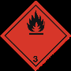

# Ficha de Datos de Seguridad - PINTULACA ROJO CLARO 7587

## Metadatos

- Fabricante: Pintuco
- Archivo fuente: `FDS 34 - PINTULACA ROJO CLARO 7587 - PINTUCO .pdf`
- Paginas: 15
- Secciones detectadas: 16 de 16
- Tablas extraidas: 61
- Imagenes extraidas: 44

## Tabla de secciones detectadas

| Seccion | Titulo normalizado | Paginas |
|---:|---|---:|
| 1 | Identificacion de la sustancia o la mezcla y de la sociedad o la empresa | 1 |
| 2 | Identificacion de los peligros | 1 |
| 3 | Composicion/informacion sobre los componentes | 1-2 |
| 4 | Primeros auxilios | 2-3 |
| 5 | Medidas de lucha contra incendios | 3 |
| 6 | Medidas en caso de vertido accidental | 3 |
| 7 | Manipulacion y almacenamiento | 3-4 |
| 8 | Controles de exposicion/proteccion individual | 4-6 |
| 9 | Propiedades fisicas y quimicas | 6-7 |
| 10 | Estabilidad y reactividad | 7 |
| 11 | Informacion toxicologica | 7-9 |
| 12 | Informacion ecologica | 9-12 |
| 13 | Consideraciones relativas a la eliminacion | 12 |
| 14 | Informacion relativa al transporte | 12-13 |
| 15 | Informacion reglamentaria | 13-14 |
| 16 | Otra informacion | 14-15 |

## Seccion 1: Identificacion de la sustancia o la mezcla y de la sociedad o la empresa

> Nota de trazabilidad: contenido extraido de la pagina 1 del PDF fuente `FDS 34 - PINTULACA ROJO CLARO 7587 - PINTUCO .pdf`.

1.1 Identificador SGA del producto: PINTULACA ROJO CLARO 7587
10014742

1.2 Uso recomendado del producto químico y restricciones:
Usos pertinentes: Pintura industrial. Uso exclusivo usuario profesional.
Usos desaconsejados: Todo aquel uso no especificado en este epígrafe ni en el epígrafe 7.3
1.3 Datos sobre el proveedor:
Pintuco
Autopista Medellín Bogotá Km 37 Vía Belén Rionegro Km 1
054040 Rionegro - Antioquia - Colombia
Tfno.: 57 4 569 81 00
contacto@pintuco.com
http://www.pintuco.com

1.4 Número de teléfono para emergencias: 57 4 561 22 23

### Tablas extraidas de esta seccion

#### Tabla `pintuco__fds-34-pintulaca-rojo-claro-7587-pintuco__p001_tbl01`

|Col1|SECCIÓN 1: IDENTIFICACIÓN DEL PRODUCTO|
|---|---|
|**1.1**<br>**Identificador SGA del producto:**<br>PINTULACA ROJO CLARO 7587<br>10014742<br>**1.2**<br>**Uso recomendado del producto químico y restricciones:**<br>Usos pertinentes: Pintura industrial. Uso exclusivo usuario profesional.<br>Usos desaconsejados: Todo aquel uso no especificado en este epígrafe ni en el epígrafe 7.3<br>**1.3**<br>**Datos sobre el proveedor:**<br>Pintuco<br>Autopista Medellín Bogotá Km 37 Vía Belén Rionegro Km 1<br>054040 Rionegro - Antioquia - Colombia<br>Tfno.: 57 4 569 81 00<br>contacto@pintuco.com<br>http://www.pintuco.com<br>**1.4**<br>**Número de teléfono para emergencias:**<br>57 4 561 22 23|**1.1**<br>**Identificador SGA del producto:**<br>PINTULACA ROJO CLARO 7587<br>10014742<br>**1.2**<br>**Uso recomendado del producto químico y restricciones:**<br>Usos pertinentes: Pintura industrial. Uso exclusivo usuario profesional.<br>Usos desaconsejados: Todo aquel uso no especificado en este epígrafe ni en el epígrafe 7.3<br>**1.3**<br>**Datos sobre el proveedor:**<br>Pintuco<br>Autopista Medellín Bogotá Km 37 Vía Belén Rionegro Km 1<br>054040 Rionegro - Antioquia - Colombia<br>Tfno.: 57 4 569 81 00<br>contacto@pintuco.com<br>http://www.pintuco.com<br>**1.4**<br>**Número de teléfono para emergencias:**<br>57 4 561 22 23|

> Nota de trazabilidad: tabla `pintuco__fds-34-pintulaca-rojo-claro-7587-pintuco__p001_tbl01` extraida de la pagina 1, asociada a la Seccion 1 por proximidad espacial y metadatos de pagina.


### Imagenes extraidas de esta seccion

#### Imagen `pintuco__fds-34-pintulaca-rojo-claro-7587-pintuco__p001_img01`


> Nota de trazabilidad: imagen `pintuco__fds-34-pintulaca-rojo-claro-7587-pintuco__p001_img01` extraida de la pagina 1, asociada a la Seccion 1 por proximidad espacial y metadatos de pagina. Tipo detectado: imagen_embebida. Hash SHA-256: bddb1e8e26b57a44ff127f842574a5c217d8f89762e07cc89800b970482b4e01.

**Texto OCR de la imagen:**

```text
El Color de la Calidad”
```

#### Imagen `pintuco__fds-34-pintulaca-rojo-claro-7587-pintuco__p001_img02`


> Nota de trazabilidad: imagen `pintuco__fds-34-pintulaca-rojo-claro-7587-pintuco__p001_img02` extraida de la pagina 1, asociada a la Seccion 1 por proximidad espacial y metadatos de pagina. Tipo detectado: imagen_embebida. Hash SHA-256: bce6ad87b1221832f1455c2eeaf1966317bcdd5364f2484b119b33bf9fdf08b8.

**Texto OCR de la imagen:**

```text
El Color de la Calidad
```


## Seccion 2: Identificacion de los peligros

> Nota de trazabilidad: contenido extraido de la pagina 1 del PDF fuente `FDS 34 - PINTULACA ROJO CLARO 7587 - PINTUCO .pdf`.

2.1 Clasificación de la sustancia o de la mezcla:
SGA:
La clasificación del producto se ha realizado conforme con al decreto 1496 de 2018, por el cual se adopta el Sistema Globalmente
Armonizado de Clasificación y Etiquetado de Productos Químicos y se dictan otras disposiciones en materia de seguridad química.

Acuatico agudo. 3: Peligrosidad aguda para el medio ambiente acuático, Categoría 3, H402
Acuatico cronico. 3: Peligrosidad crónica para el medio ambiente acuático, Categoría 3, H412
Irrit. Cut. 2: Irritación cutánea, categoría 2, H315
Irrit. oc. 2: Irritación ocular, categoría 2, H319
Liq. Infl. 2: Líquidos inflamables, Categoría 2, H225
Repr. 1A: Tóxico para la reproducción, Categoría 1A, H360
Tox. Agud. 4: Toxicidad aguda por inhalación, Categoría 4, H332

2.2 Elementos de las etiquetas del SGA, incluidos los consejos de prudencia:
SGA:
Peligro

Indicaciones de peligro:
Acuatico cronico. 3: H412 - Nocivo para los organismos acuáticos, con efectos nocivos duraderos
Irrit. Cut. 2: H315 - Provoca irritación cutánea
Irrit. oc. 2: H319 - Provoca irritación ocular grave
Liq. Infl. 2: H225 - Líquido y vapores muy inflamables
Repr. 1A: H360 - Puede perjudicar la fertilidad o dañar al feto
Tox. Agud. 4: H332 - Nocivo si se inhala

Consejos de prudencia:
P210: Mantener alejado del calor, superficies calientes, chispas llamas al descubierto y otras fuentes de ignición. No fumar
P280: Usar guantes/ropa de protección/equipo de protección para los ojos/la cara
P302+P352: EN CASO DE CONTACTO CON LA PIEL: Lavar con abundante agua
P304+P340: EN CASO DE INHALACIÓN: Transportar a la persona al aire libre y mantenerla en una posición que le facilite la
respiración
P305+P351+P338: EN CASO DE CONTACTO CON LOS OJOS: Enjuagar con agua cuidadosamente durante varios minutos. Quitar
las lentes de contacto cuando estén presentes y pueda hacerse con facilidad. Proseguir con el lavado
P308+P313: EN CASO DE exposición demostrada o supuesta: consultar a un médico
P370+P378: En caso de incendio: Utilizar extintor de polvo ABC para la extinción
P501: Eliminar el contenido/recipiente de acuerdo con la normativa sobre residuos peligrosos o envases y residuos de envases
respectivamente

2.3 Otros peligros que no conducen a una clasificación:
No relevante

### Tablas extraidas de esta seccion

#### Tabla `pintuco__fds-34-pintulaca-rojo-claro-7587-pintuco__p001_tbl02`

|Col1|SECCIÓN 2: IDENTIFICACIÓN DEL PELIGRO O PELIGROS|
|---|---|
|**2.1**<br>**Clasificación de la sustancia o de la mezcla:**<br>**SGA:**<br>La clasificación del producto se ha realizado conforme con al decreto 1496 de 2018, por el cual se adopta el Sistema Globalmente<br>Armonizado de Clasificación y Etiquetado de Productos Químicos y se dictan otras disposiciones en materia de seguridad química.<br>Acuatico agudo. 3: Peligrosidad aguda para el medio ambiente acuático, Categoría 3, H402<br>Acuatico cronico. 3: Peligrosidad crónica para el medio ambiente acuático, Categoría 3, H412<br>Irrit. Cut. 2: Irritación cutánea, categoría 2, H315<br>Irrit. oc. 2: Irritación ocular, categoría 2, H319<br>Liq. Infl. 2: Líquidos inflamables, Categoría 2, H225<br>Repr. 1A: Tóxico para la reproducción, Categoría 1A, H360<br>Tox. Agud. 4: Toxicidad aguda por inhalación, Categoría 4, H332<br>**2.2**<br>**Elementos de las etiquetas del SGA, incluidos los consejos de prudencia:**<br>**SGA:**<br>**Peligro**<br>**Indicaciones de peligro:**<br>Acuatico cronico. 3: H412 - Nocivo para los organismos acuáticos, con efectos nocivos duraderos<br>Irrit. Cut. 2: H315 - Provoca irritación cutánea<br>Irrit. oc. 2: H319 - Provoca irritación ocular grave<br>Liq. Infl. 2: H225 - Líquido y vapores muy inflamables<br>Repr. 1A: H360 - Puede perjudicar la fertilidad o dañar al feto<br>Tox. Agud. 4: H332 - Nocivo si se inhala<br>**Consejos de prudencia:**<br>P210: Mantener alejado del calor, superficies calientes, chispas llamas al descubierto y otras fuentes de ignición. No fumar<br>P280: Usar guantes/ropa de protección/equipo de protección para los ojos/la cara<br>P302+P352: EN CASO DE CONTACTO CON LA PIEL: Lavar con abundante agua<br>P304+P340: EN CASO DE INHALACIÓN: Transportar a la persona al aire libre y mantenerla en una posición que le facilite la<br>respiración<br>P305+P351+P338: EN CASO DE CONTACTO CON LOS OJOS: Enjuagar con agua cuidadosamente durante varios minutos. Quitar<br>las lentes de contacto cuando estén presentes y pueda hacerse con facilidad. Proseguir con el lavado<br>P308+P313: EN CASO DE exposición demostrada o supuesta: consultar a un médico<br>P370+P378: En caso de incendio: Utilizar extintor de polvo ABC para la extinción<br>P501: Eliminar el contenido/recipiente de acuerdo con la normativa sobre residuos peligrosos o envases y residuos de envases<br>respectivamente<br>**2.3**<br>**Otros peligros que no conducen a una clasificación:**<br>No relevante|**2.1**<br>**Clasificación de la sustancia o de la mezcla:**<br>**SGA:**<br>La clasificación del producto se ha realizado conforme con al decreto 1496 de 2018, por el cual se adopta el Sistema Globalmente<br>Armonizado de Clasificación y Etiquetado de Productos Químicos y se dictan otras disposiciones en materia de seguridad química.<br>Acuatico agudo. 3: Peligrosidad aguda para el medio ambiente acuático, Categoría 3, H402<br>Acuatico cronico. 3: Peligrosidad crónica para el medio ambiente acuático, Categoría 3, H412<br>Irrit. Cut. 2: Irritación cutánea, categoría 2, H315<br>Irrit. oc. 2: Irritación ocular, categoría 2, H319<br>Liq. Infl. 2: Líquidos inflamables, Categoría 2, H225<br>Repr. 1A: Tóxico para la reproducción, Categoría 1A, H360<br>Tox. Agud. 4: Toxicidad aguda por inhalación, Categoría 4, H332<br>**2.2**<br>**Elementos de las etiquetas del SGA, incluidos los consejos de prudencia:**<br>**SGA:**<br>**Peligro**<br>**Indicaciones de peligro:**<br>Acuatico cronico. 3: H412 - Nocivo para los organismos acuáticos, con efectos nocivos duraderos<br>Irrit. Cut. 2: H315 - Provoca irritación cutánea<br>Irrit. oc. 2: H319 - Provoca irritación ocular grave<br>Liq. Infl. 2: H225 - Líquido y vapores muy inflamables<br>Repr. 1A: H360 - Puede perjudicar la fertilidad o dañar al feto<br>Tox. Agud. 4: H332 - Nocivo si se inhala<br>**Consejos de prudencia:**<br>P210: Mantener alejado del calor, superficies calientes, chispas llamas al descubierto y otras fuentes de ignición. No fumar<br>P280: Usar guantes/ropa de protección/equipo de protección para los ojos/la cara<br>P302+P352: EN CASO DE CONTACTO CON LA PIEL: Lavar con abundante agua<br>P304+P340: EN CASO DE INHALACIÓN: Transportar a la persona al aire libre y mantenerla en una posición que le facilite la<br>respiración<br>P305+P351+P338: EN CASO DE CONTACTO CON LOS OJOS: Enjuagar con agua cuidadosamente durante varios minutos. Quitar<br>las lentes de contacto cuando estén presentes y pueda hacerse con facilidad. Proseguir con el lavado<br>P308+P313: EN CASO DE exposición demostrada o supuesta: consultar a un médico<br>P370+P378: En caso de incendio: Utilizar extintor de polvo ABC para la extinción<br>P501: Eliminar el contenido/recipiente de acuerdo con la normativa sobre residuos peligrosos o envases y residuos de envases<br>respectivamente<br>**2.3**<br>**Otros peligros que no conducen a una clasificación:**<br>No relevante|

> Nota de trazabilidad: tabla `pintuco__fds-34-pintulaca-rojo-claro-7587-pintuco__p001_tbl02` extraida de la pagina 1, asociada a la Seccion 2 por proximidad espacial y metadatos de pagina.


### Imagenes extraidas de esta seccion

#### Imagen `pintuco__fds-34-pintulaca-rojo-claro-7587-pintuco__p001_img03`


> Nota de trazabilidad: imagen `pintuco__fds-34-pintulaca-rojo-claro-7587-pintuco__p001_img03` extraida de la pagina 1, asociada a la Seccion 2 por proximidad espacial y metadatos de pagina. Tipo detectado: icono_o_marca_pequena. Hash SHA-256: cb39b0eb17ae6344a9e5a7c9e225ea5e45938eb8d0b5dec2d4606989565e1a20.

**Texto OCR de la imagen:**

```text
OCR sin texto legible.
```

#### Imagen `pintuco__fds-34-pintulaca-rojo-claro-7587-pintuco__p001_img04`


> Nota de trazabilidad: imagen `pintuco__fds-34-pintulaca-rojo-claro-7587-pintuco__p001_img04` extraida de la pagina 1, asociada a la Seccion 2 por proximidad espacial y metadatos de pagina. Tipo detectado: icono_o_marca_pequena. Hash SHA-256: b4f630a174b0e8f931a598192596ccfa504c4a32453087131f0d8b3381b1f05e.

**Texto OCR de la imagen:**

```text
OCR sin texto legible.
```

#### Imagen `pintuco__fds-34-pintulaca-rojo-claro-7587-pintuco__p001_img05`


> Nota de trazabilidad: imagen `pintuco__fds-34-pintulaca-rojo-claro-7587-pintuco__p001_img05` extraida de la pagina 1, asociada a la Seccion 2 por proximidad espacial y metadatos de pagina. Tipo detectado: icono_o_marca_pequena. Hash SHA-256: c0cd36a3de038fd2f3493b95a111808bac7f7b5c98fe91fe20d3a57011016216.

**Texto OCR de la imagen:**

```text
OCR sin texto legible.
```

#### Imagen `pintuco__fds-34-pintulaca-rojo-claro-7587-pintuco__p001_img06`


> Nota de trazabilidad: imagen `pintuco__fds-34-pintulaca-rojo-claro-7587-pintuco__p001_img06` extraida de la pagina 1, asociada a la Seccion 2 por proximidad espacial y metadatos de pagina. Tipo detectado: icono_o_marca_pequena. Hash SHA-256: 08972b81b787e6985cdae162d2672201981639becdf9934b04be343bf43fedbf.

**Texto OCR de la imagen:**

```text
OCR sin texto legible.
```


## Seccion 3: Composicion/informacion sobre los componentes

> Nota de trazabilidad: contenido extraido de la pagina 1 a la pagina 2 del PDF fuente `FDS 34 - PINTULACA ROJO CLARO 7587 - PINTUCO .pdf`.

Página 1/15 Emisión: 16/05/2018 Revisión: 28/01/2019 Versión: 3 (sustituye a 2)
- CONTINÚA EN LA SIGUIENTE PÁGINA -
10014742

Ficha de datos de seguridad
según Decreto 1496 de 2018
SECCIÓN 3: COMPOSICIÓN/INFORMACIÓN SOBRE LOS COMPONENTES (continúa)
3.1 Sustancias:
No aplicable
3.2 Mezclas:
Descripción química: Mezcla a base de productos químicos
Componentes:
De acuerdo al Decreto 1496 de 2018, el producto presenta:
Identificación Nombre químico/clasificación Concentración

CAS:

1330-20-7

Xileno
10 - <25 %

CAS:

141-78-6

Acetato de etilo
10 - <25 %

CAS:

110-19-0

Acetato de isobutilo
2.5 - <10 %

CAS:

12656-85-8

Rojo de cromato molibdato sulfato de plomo
2.5 - <10 %

CAS:

64-17-5

Etanol
2.5 - <10 %

CAS:

117-81-7

Ftalato de bis(2-etilhexilo)
2.5 - <10 %

CAS:

111-76-2

2-butoxietanol
2.5 - <10 %

CAS:

67-63-0

Propan-2-ol 2.5 - <10 %

CAS:

108-38-3

m-xileno 2.5 - <10 %

CAS:

108-88-3

Tolueno
2.5 - <10 %

CAS:

78-83-1

2-metilpropan-1-ol
1 - <2.5 %

CAS:

78-93-3

Butanona 1 - <2.5 %

CAS:

64742-88-7

Nafta disolvente (petróleo), fracción alifática intermedia
1 - <2.5 %

CAS:

100-41-4

Etilbenceno
<1 %
Para ampliar información sobre la peligrosidad de la sustancias consultar las secciones 8, 11, 12, 15 y 16. La clasificación respecto
Carcinogenicidad de las sustancias se ha establecido en función de las monografías de la IARC adecuandola al sistema de
clasificación SGA, para información sobre la clasificación IARC consulte la sección 11.

### Tablas extraidas de esta seccion

#### Tabla `pintuco__fds-34-pintulaca-rojo-claro-7587-pintuco__p001_tbl03`

|Col1|SECCIÓN 3: COMPOSICIÓN/INFORMACIÓN SOBRE LOS COMPONENTES|
|---|---|
|||

> Nota de trazabilidad: tabla `pintuco__fds-34-pintulaca-rojo-claro-7587-pintuco__p001_tbl03` extraida de la pagina 1, asociada a la Seccion 3 por proximidad espacial y metadatos de pagina.

#### Tabla `pintuco__fds-34-pintulaca-rojo-claro-7587-pintuco__p001_tbl04`

|Emisión: 16/05/2018 Revisión: 28/01/2019 Versión: 3 (sustituye a 2)|Página 1/15|
|---|---|

> Nota de trazabilidad: tabla `pintuco__fds-34-pintulaca-rojo-claro-7587-pintuco__p001_tbl04` extraida de la pagina 1, asociada a la Seccion 3 por proximidad espacial y metadatos de pagina.

#### Tabla `pintuco__fds-34-pintulaca-rojo-claro-7587-pintuco__p002_tbl01`

|Col1|SECCIÓN 3: COMPOSICIÓN/INFORMACIÓN SOBRE LOS COMPONENTES (continúa)|
|---|---|
|**3.1**<br>**Sustancias:**<br>No aplicable<br>**3.2**<br>**Mezclas:**<br>**Descripción química:**Mezcla a base de productos químicos<br>**Componentes:**<br>De acuerdo al Decreto 1496 de 2018, el producto presenta:<br>Identificación<br>Nombre químico/clasificación<br>Concentración<br>CAS: 1330-20-7<br>**Xileno**<br>**10 - <25 %**<br>CAS: 141-78-6<br>**Acetato de etilo**<br>**10 - <25 %**<br>CAS: 110-19-0<br>**Acetato de isobutilo**<br>**2.5 - <10 %**<br>CAS: 12656-85-8<br>**Rojo de cromato molibdato sulfato de plomo**<br>**2.5 - <10 %**<br>CAS:<br>64-17-5<br>**Etanol**<br>**2.5 - <10 %**<br>CAS:<br>117-81-7<br>**Ftalato de bis(2-etilhexilo)**<br>**2.5 - <10 %**<br>CAS: 111-76-2<br>**2-butoxietanol**<br>**2.5 - <10 %**<br>CAS:<br>67-63-0<br>**Propan-2-ol**<br>**2.5 - <10 %**<br>CAS:<br>108-38-3<br>**m-xileno**<br>**2.5 - <10 %**<br>CAS:<br>108-88-3<br>**Tolueno**<br>**2.5 - <10 %**<br>CAS:<br>78-83-1<br>**2-metilpropan-1-ol**<br>**1 - <2.5 %**<br>CAS:<br>78-93-3<br>**Butanona**<br>**1 - <2.5 %**<br>CAS: 64742-88-7<br>**Nafta disolvente (petróleo), fracción alifática intermedia**<br>**1 - <2.5 %**<br>CAS:<br>100-41-4<br>**Etilbenceno**<br>**<1 %**<br>Para ampliar información sobre la peligrosidad de la sustancias consultar las secciones 8, 11, 12, 15 y 16. La clasificación respecto<br>Carcinogenicidad de las sustancias se ha establecido en función de las monografías de la IARC adecuandola al sistema de<br>clasificación SGA, para información sobre la clasificación IARC consulte la sección 11.|**3.1**<br>**Sustancias:**<br>No aplicable<br>**3.2**<br>**Mezclas:**<br>**Descripción química:**Mezcla a base de productos químicos<br>**Componentes:**<br>De acuerdo al Decreto 1496 de 2018, el producto presenta:<br>Identificación<br>Nombre químico/clasificación<br>Concentración<br>CAS: 1330-20-7<br>**Xileno**<br>**10 - <25 %**<br>CAS: 141-78-6<br>**Acetato de etilo**<br>**10 - <25 %**<br>CAS: 110-19-0<br>**Acetato de isobutilo**<br>**2.5 - <10 %**<br>CAS: 12656-85-8<br>**Rojo de cromato molibdato sulfato de plomo**<br>**2.5 - <10 %**<br>CAS:<br>64-17-5<br>**Etanol**<br>**2.5 - <10 %**<br>CAS:<br>117-81-7<br>**Ftalato de bis(2-etilhexilo)**<br>**2.5 - <10 %**<br>CAS: 111-76-2<br>**2-butoxietanol**<br>**2.5 - <10 %**<br>CAS:<br>67-63-0<br>**Propan-2-ol**<br>**2.5 - <10 %**<br>CAS:<br>108-38-3<br>**m-xileno**<br>**2.5 - <10 %**<br>CAS:<br>108-88-3<br>**Tolueno**<br>**2.5 - <10 %**<br>CAS:<br>78-83-1<br>**2-metilpropan-1-ol**<br>**1 - <2.5 %**<br>CAS:<br>78-93-3<br>**Butanona**<br>**1 - <2.5 %**<br>CAS: 64742-88-7<br>**Nafta disolvente (petróleo), fracción alifática intermedia**<br>**1 - <2.5 %**<br>CAS:<br>100-41-4<br>**Etilbenceno**<br>**<1 %**<br>Para ampliar información sobre la peligrosidad de la sustancias consultar las secciones 8, 11, 12, 15 y 16. La clasificación respecto<br>Carcinogenicidad de las sustancias se ha establecido en función de las monografías de la IARC adecuandola al sistema de<br>clasificación SGA, para información sobre la clasificación IARC consulte la sección 11.|

> Nota de trazabilidad: tabla `pintuco__fds-34-pintulaca-rojo-claro-7587-pintuco__p002_tbl01` extraida de la pagina 2, asociada a la Seccion 3 por proximidad espacial y metadatos de pagina.

#### Tabla `pintuco__fds-34-pintulaca-rojo-claro-7587-pintuco__p002_tbl02`

|Identificación|Nombre químico/clasificación|Concentración|
|---|---|---|
|CAS: 1330-20-7|**Xileno**|**10 - <25 %**|
|CAS: 141-78-6|**Acetato de etilo**|**10 - <25 %**|
|CAS: 110-19-0|**Acetato de isobutilo**|**2.5 - <10 %**|
|CAS: 12656-85-8|**Rojo de cromato molibdato sulfato de plomo**|**2.5 - <10 %**|
|CAS:<br>64-17-5|**Etanol**|**2.5 - <10 %**|
|CAS:<br>117-81-7|**Ftalato de bis(2-etilhexilo)**|**2.5 - <10 %**|
|CAS: 111-76-2|**2-butoxietanol**|**2.5 - <10 %**|
|CAS:<br>67-63-0|**Propan-2-ol**|**2.5 - <10 %**|
|CAS:<br>108-38-3|**m-xileno**|**2.5 - <10 %**|
|CAS:<br>108-88-3|**Tolueno**|**2.5 - <10 %**|
|CAS:<br>78-83-1|**2-metilpropan-1-ol**|**1 - <2.5 %**|
|CAS:<br>78-93-3|**Butanona**|**1 - <2.5 %**|
|CAS: 64742-88-7|**Nafta disolvente (petróleo), fracción alifática intermedia**|**1 - <2.5 %**|
|CAS:<br>100-41-4|**Etilbenceno**|**<1 %**|

> Nota de trazabilidad: tabla `pintuco__fds-34-pintulaca-rojo-claro-7587-pintuco__p002_tbl02` extraida de la pagina 2, asociada a la Seccion 3 por proximidad espacial y metadatos de pagina.


### Imagenes extraidas de esta seccion

#### Imagen `pintuco__fds-34-pintulaca-rojo-claro-7587-pintuco__p002_img01`


> Nota de trazabilidad: imagen `pintuco__fds-34-pintulaca-rojo-claro-7587-pintuco__p002_img01` extraida de la pagina 2, asociada a la Seccion 3 por proximidad espacial y metadatos de pagina. Tipo detectado: imagen_embebida. Hash SHA-256: bddb1e8e26b57a44ff127f842574a5c217d8f89762e07cc89800b970482b4e01.

**Texto OCR de la imagen:**

```text
El Color de la Calidad”
```

#### Imagen `pintuco__fds-34-pintulaca-rojo-claro-7587-pintuco__p002_img02`


> Nota de trazabilidad: imagen `pintuco__fds-34-pintulaca-rojo-claro-7587-pintuco__p002_img02` extraida de la pagina 2, asociada a la Seccion 3 por proximidad espacial y metadatos de pagina. Tipo detectado: imagen_embebida. Hash SHA-256: bce6ad87b1221832f1455c2eeaf1966317bcdd5364f2484b119b33bf9fdf08b8.

**Texto OCR de la imagen:**

```text
El Color de la Calidad
```


## Seccion 4: Primeros auxilios

> Nota de trazabilidad: contenido extraido de la pagina 2 a la pagina 3 del PDF fuente `FDS 34 - PINTULACA ROJO CLARO 7587 - PINTUCO .pdf`.

4.1 Descripción de los primeros auxilios necesarios:
Los síntomas como consecuencia de una intoxicación pueden presentarse con posterioridad a la exposición, por lo que, en caso de
duda, exposición directa al producto químico o persistencia del malestar solicitar atención médica, mostrándole la FDS de este
producto.

Por inhalación:
Sacar al afectado del lugar de exposición, suministrarle aire limpio y mantenerlo en reposo. En casos graves como parada
cardiorespiratoria, se aplicarán técnicas de respiración artificial (respiración boca a boca, masaje cardíaco, suministro de
oxígeno,etc.) requiriendo asistencia médica inmediata.

Por contacto con la piel:
Quitar la ropa y los zapatos contaminados, aclarar la piel o duchar al afectado si procede con abundante agua fría y jabón neutro. En
caso de afección importante acudir al médico. Si el producto produce quemaduras o congelación, no se debe quitar la ropa debido a
que podría empeorar la lesión producida si esta se encuentra pegada a la piel. En el caso de formarse ampollas en la piel, éstas
nunca deben reventarse ya que aumentaría el riesgo de infección.

Por contacto con los ojos:

Página 2/15 Emisión: 16/05/2018 Revisión: 28/01/2019 Versión: 3 (sustituye a 2)
- CONTINÚA EN LA SIGUIENTE PÁGINA -
10014742

Ficha de datos de seguridad
según Decreto 1496 de 2018
SECCIÓN 4: PRIMEROS AUXILIOS (continúa)
Enjuagar los ojos con abundante agua a temperatura ambiente al menos durante 15 minutos. Evitar que el afectado se frote o cierre
los ojos. En el caso de que el accidentado use lentes de contacto, éstas deben retirarse siempre que no estén pegadas a los ojos,
de otro modo podría producirse un daño adicional. En todos los casos, después del lavado, se debe acudir al médico lo más
rápidamente posible con la FDS del producto.

Por ingestión/aspiración:
No inducir al vómito, en el caso de que se produzca mantener inclinada la cabeza hacia delante para evitar la aspiración. Mantener
al afectado en reposo. Enjuagar la boca y la garganta, ya que existe la posibilidad de que hayan sido afectadas en la ingestión.

4.2 Síntomas/efectos más importantes, agudos o retardados:
Los efectos agudos y retardados son los indicados en las secciones 2 y 11.
4.3 Indicación de la necesidad de recibir atención médica inmediata y, en su caso, de tratamiento especial:
No relevante

### Tablas extraidas de esta seccion

#### Tabla `pintuco__fds-34-pintulaca-rojo-claro-7587-pintuco__p002_tbl03`

|Col1|SECCIÓN 4: PRIMEROS AUXILIOS|Col3|
|---|---|---|
|**4.1**<br>**Descripción de los primeros auxilios necesarios:**<br>Los síntomas como consecuencia de una intoxicación pueden presentarse con posterioridad a la exposición, por lo que, en caso de<br>duda, exposición directa al producto químico o persistencia del malestar solicitar atención médica, mostrándole la FDS de este<br>producto.<br>**Por inhalación:**<br>Sacar al afectado del lugar de exposición, suministrarle aire limpio y mantenerlo en reposo. En casos graves como parada<br>cardiorespiratoria, se aplicarán técnicas de respiración artificial (respiración boca a boca, masaje cardíaco, suministro de<br>oxígeno,etc.) requiriendo asistencia médica inmediata.<br>**Por contacto con la piel:**<br>Quitar la ropa y los zapatos contaminados, aclarar la piel o duchar al afectado si procede con abundante agua fría y jabón neutro. En<br>caso de afección importante acudir al médico. Si el producto produce quemaduras o congelación, no se debe quitar la ropa debido a<br>que podría empeorar la lesión producida si esta se encuentra pegada a la piel. En el caso de formarse ampollas en la piel, éstas<br>nunca deben reventarse ya que aumentaría el riesgo de infección.<br>**Por contacto con los ojos:**|**4.1**<br>**Descripción de los primeros auxilios necesarios:**<br>Los síntomas como consecuencia de una intoxicación pueden presentarse con posterioridad a la exposición, por lo que, en caso de<br>duda, exposición directa al producto químico o persistencia del malestar solicitar atención médica, mostrándole la FDS de este<br>producto.<br>**Por inhalación:**<br>Sacar al afectado del lugar de exposición, suministrarle aire limpio y mantenerlo en reposo. En casos graves como parada<br>cardiorespiratoria, se aplicarán técnicas de respiración artificial (respiración boca a boca, masaje cardíaco, suministro de<br>oxígeno,etc.) requiriendo asistencia médica inmediata.<br>**Por contacto con la piel:**<br>Quitar la ropa y los zapatos contaminados, aclarar la piel o duchar al afectado si procede con abundante agua fría y jabón neutro. En<br>caso de afección importante acudir al médico. Si el producto produce quemaduras o congelación, no se debe quitar la ropa debido a<br>que podría empeorar la lesión producida si esta se encuentra pegada a la piel. En el caso de formarse ampollas en la piel, éstas<br>nunca deben reventarse ya que aumentaría el riesgo de infección.<br>**Por contacto con los ojos:**|**4.1**<br>**Descripción de los primeros auxilios necesarios:**<br>Los síntomas como consecuencia de una intoxicación pueden presentarse con posterioridad a la exposición, por lo que, en caso de<br>duda, exposición directa al producto químico o persistencia del malestar solicitar atención médica, mostrándole la FDS de este<br>producto.<br>**Por inhalación:**<br>Sacar al afectado del lugar de exposición, suministrarle aire limpio y mantenerlo en reposo. En casos graves como parada<br>cardiorespiratoria, se aplicarán técnicas de respiración artificial (respiración boca a boca, masaje cardíaco, suministro de<br>oxígeno,etc.) requiriendo asistencia médica inmediata.<br>**Por contacto con la piel:**<br>Quitar la ropa y los zapatos contaminados, aclarar la piel o duchar al afectado si procede con abundante agua fría y jabón neutro. En<br>caso de afección importante acudir al médico. Si el producto produce quemaduras o congelación, no se debe quitar la ropa debido a<br>que podría empeorar la lesión producida si esta se encuentra pegada a la piel. En el caso de formarse ampollas en la piel, éstas<br>nunca deben reventarse ya que aumentaría el riesgo de infección.<br>**Por contacto con los ojos:**|
|- CONTINÚA EN LA SIGUIENTE PÁGINA -|- CONTINÚA EN LA SIGUIENTE PÁGINA -|- CONTINÚA EN LA SIGUIENTE PÁGINA -|
|Emisión: 16/05/2018            Revisión: 28/01/2019            Versión: 3 (sustituye a 2)|Emisión: 16/05/2018            Revisión: 28/01/2019            Versión: 3 (sustituye a 2)|**Página 2/15**|

> Nota de trazabilidad: tabla `pintuco__fds-34-pintulaca-rojo-claro-7587-pintuco__p002_tbl03` extraida de la pagina 2, asociada a la Seccion 4 por proximidad espacial y metadatos de pagina.

#### Tabla `pintuco__fds-34-pintulaca-rojo-claro-7587-pintuco__p003_tbl01`

|Col1|SECCIÓN 4: PRIMEROS AUXILIOS (continúa)|
|---|---|
|Enjuagar los ojos con abundante agua a temperatura ambiente al menos durante 15 minutos. Evitar que el afectado se frote o cierre<br>los ojos. En el caso de que el accidentado use lentes de contacto, éstas deben retirarse siempre que no estén pegadas a los ojos,<br>de otro modo podría producirse un daño adicional. En todos los casos, después del lavado, se debe acudir al médico lo más<br>rápidamente posible con la FDS del producto.<br>**Por ingestión/aspiración:**<br>No inducir al vómito, en el caso de que se produzca mantener inclinada la cabeza hacia delante para evitar la aspiración. Mantener<br>al afectado en reposo. Enjuagar la boca y la garganta, ya que existe la posibilidad de que hayan sido afectadas en la ingestión.<br>**4.2**<br>**Síntomas/efectos más importantes, agudos o retardados:**<br>Los efectos agudos y retardados son los indicados en las secciones 2 y 11.<br>**4.3**<br>**Indicación de la necesidad de recibir atención médica inmediata y, en su caso, de tratamiento especial:**<br>No relevante|Enjuagar los ojos con abundante agua a temperatura ambiente al menos durante 15 minutos. Evitar que el afectado se frote o cierre<br>los ojos. En el caso de que el accidentado use lentes de contacto, éstas deben retirarse siempre que no estén pegadas a los ojos,<br>de otro modo podría producirse un daño adicional. En todos los casos, después del lavado, se debe acudir al médico lo más<br>rápidamente posible con la FDS del producto.<br>**Por ingestión/aspiración:**<br>No inducir al vómito, en el caso de que se produzca mantener inclinada la cabeza hacia delante para evitar la aspiración. Mantener<br>al afectado en reposo. Enjuagar la boca y la garganta, ya que existe la posibilidad de que hayan sido afectadas en la ingestión.<br>**4.2**<br>**Síntomas/efectos más importantes, agudos o retardados:**<br>Los efectos agudos y retardados son los indicados en las secciones 2 y 11.<br>**4.3**<br>**Indicación de la necesidad de recibir atención médica inmediata y, en su caso, de tratamiento especial:**<br>No relevante|

> Nota de trazabilidad: tabla `pintuco__fds-34-pintulaca-rojo-claro-7587-pintuco__p003_tbl01` extraida de la pagina 3, asociada a la Seccion 4 por proximidad espacial y metadatos de pagina.


### Imagenes extraidas de esta seccion

#### Imagen `pintuco__fds-34-pintulaca-rojo-claro-7587-pintuco__p003_img01`


> Nota de trazabilidad: imagen `pintuco__fds-34-pintulaca-rojo-claro-7587-pintuco__p003_img01` extraida de la pagina 3, asociada a la Seccion 4 por proximidad espacial y metadatos de pagina. Tipo detectado: imagen_embebida. Hash SHA-256: bddb1e8e26b57a44ff127f842574a5c217d8f89762e07cc89800b970482b4e01.

**Texto OCR de la imagen:**

```text
El Color de la Calidad”
```

#### Imagen `pintuco__fds-34-pintulaca-rojo-claro-7587-pintuco__p003_img02`


> Nota de trazabilidad: imagen `pintuco__fds-34-pintulaca-rojo-claro-7587-pintuco__p003_img02` extraida de la pagina 3, asociada a la Seccion 4 por proximidad espacial y metadatos de pagina. Tipo detectado: imagen_embebida. Hash SHA-256: bce6ad87b1221832f1455c2eeaf1966317bcdd5364f2484b119b33bf9fdf08b8.

**Texto OCR de la imagen:**

```text
El Color de la Calidad
```


## Seccion 5: Medidas de lucha contra incendios

> Nota de trazabilidad: contenido extraido de la pagina 3 del PDF fuente `FDS 34 - PINTULACA ROJO CLARO 7587 - PINTUCO .pdf`.

5.1 Medios de extinción apropiados:
Emplear preferentemente extintores de polvo polivalente (polvo ABC), alternativamente utilizar espuma física o extintores de dióxido
de carbono (CO2). NO SE RECOMIENDA emplear agua a chorro como agente de extinción.

5.2 Peligros específicos del producto químico:
Como consecuencia de la combustión o descomposición térmica se generan subproductos de reacción que pueden resultar
altamente tóxicos y, consecuentemente, pueden presentar un riesgo elevado para la salud.

5.3 Medidas especiales que deben tomar los equipos de lucha contra incendios:
En función de la magnitud del incendio puede hacerse necesario el uso de ropa protectora completa y equipo de respiración
autónomo. Disponer de un mínimo de instalaciones de emergencia o elementos de actuación (mantas ignífugas, botiquín portátil,...).

Disposiciones adicionales:
Actuar conforme el Plan de Emergencia Interior y las Fichas Informativas sobre actuación ante accidentes y otras emergencias.
Suprimir cualquier fuente de ignición. En caso de incendio, refrigerar los recipientes y tanques de almacenamiento de productos
susceptibles a inflamación, explosión como consecuencia de elevadas temperaturas. Evitar el vertido de los productos empleados en
la extinción del incendio al medio acuático.

### Tablas extraidas de esta seccion

#### Tabla `pintuco__fds-34-pintulaca-rojo-claro-7587-pintuco__p003_tbl02`

|Col1|SECCIÓN 5: MEDIDAS DE LUCHA CONTRA INCENDIOS|
|---|---|
|**5.1**<br>**Medios de extinción apropiados:**<br>Emplear preferentemente extintores de polvo polivalente (polvo ABC), alternativamente utilizar espuma física o extintores de dióxido<br>de carbono (CO2). NO SE RECOMIENDA emplear agua a chorro como agente de extinción.<br>**5.2**<br>**Peligros específicos del producto químico:**<br>Como consecuencia de la combustión o descomposición térmica se generan subproductos de reacción que pueden resultar<br>altamente tóxicos y, consecuentemente, pueden presentar un riesgo elevado para la salud.<br>**5.3**<br>**Medidas especiales que deben tomar los equipos de lucha contra incendios:**<br>En función de la magnitud del incendio puede hacerse necesario el uso de ropa protectora completa y equipo de respiración<br>autónomo. Disponer de un mínimo de instalaciones de emergencia o elementos de actuación (mantas ignífugas, botiquín portátil,...).<br>**Disposiciones adicionales:**<br>Actuar conforme el Plan de Emergencia Interior y las Fichas Informativas sobre actuación ante accidentes y otras emergencias.<br>Suprimir cualquier fuente de ignición. En caso de incendio, refrigerar los recipientes y tanques de almacenamiento de productos<br>susceptibles a inflamación, explosión como consecuencia de elevadas temperaturas. Evitar el vertido de los productos empleados en<br>la extinción del incendio al medio acuático.|**5.1**<br>**Medios de extinción apropiados:**<br>Emplear preferentemente extintores de polvo polivalente (polvo ABC), alternativamente utilizar espuma física o extintores de dióxido<br>de carbono (CO2). NO SE RECOMIENDA emplear agua a chorro como agente de extinción.<br>**5.2**<br>**Peligros específicos del producto químico:**<br>Como consecuencia de la combustión o descomposición térmica se generan subproductos de reacción que pueden resultar<br>altamente tóxicos y, consecuentemente, pueden presentar un riesgo elevado para la salud.<br>**5.3**<br>**Medidas especiales que deben tomar los equipos de lucha contra incendios:**<br>En función de la magnitud del incendio puede hacerse necesario el uso de ropa protectora completa y equipo de respiración<br>autónomo. Disponer de un mínimo de instalaciones de emergencia o elementos de actuación (mantas ignífugas, botiquín portátil,...).<br>**Disposiciones adicionales:**<br>Actuar conforme el Plan de Emergencia Interior y las Fichas Informativas sobre actuación ante accidentes y otras emergencias.<br>Suprimir cualquier fuente de ignición. En caso de incendio, refrigerar los recipientes y tanques de almacenamiento de productos<br>susceptibles a inflamación, explosión como consecuencia de elevadas temperaturas. Evitar el vertido de los productos empleados en<br>la extinción del incendio al medio acuático.|

> Nota de trazabilidad: tabla `pintuco__fds-34-pintulaca-rojo-claro-7587-pintuco__p003_tbl02` extraida de la pagina 3, asociada a la Seccion 5 por proximidad espacial y metadatos de pagina.


## Seccion 6: Medidas en caso de vertido accidental

> Nota de trazabilidad: contenido extraido de la pagina 3 del PDF fuente `FDS 34 - PINTULACA ROJO CLARO 7587 - PINTUCO .pdf`.

6.1 Precauciones personales, equipo protector y procedimiento de emergencia:
Aislar las fugas siempre y cuando no suponga un riesgo adicional para las personas que desempeñen esta función. Evacuar la zona
y mantener a las personas sin protección alejadas. Ante el contacto potencial con el producto derramado se hace obligatorio el uso
de elementos de protección personal (ver sección 8). Evitar de manera prioritaria la formación de mezclas vapor-aire inflamables, ya
sea mediante ventilación o el uso de un agente inertizante. Suprimir cualquier fuente de ignición. Eliminar las cargas electroestáticas
mediante la interconexión de todas las superficies conductoras sobre las que se puede formar electricidad estática, y estando a su
vez el conjunto conectado a tierra.

6.2 Precauciones relativas al medio ambiente:
Evitar a toda costa cualquier tipo de vertido al medio acuático. Contener adecuadamente el producto absorbido/recogido en
recipientes herméticamente cerrados. Notificar a la autoridad competente en el caso de exposición al público en general o al
medioambiente.

6.3 Métodos y materiales para la contención y limpieza de vertidos:
Se recomienda:
Absorber el vertido mediante arena o absorbente inerte y trasladarlo a un lugar seguro. No absorber en serrín u otros absorbentes
combustibles. Para cualquier consideración relativa a la eliminación consultar la sección 13.

6.4 Referencias a otras secciones:
Ver secciones 8 y 13.

### Tablas extraidas de esta seccion

#### Tabla `pintuco__fds-34-pintulaca-rojo-claro-7587-pintuco__p003_tbl03`

|Col1|SECCIÓN 6: MEDIDAS QUE DEBEN TOMARSE EN CASO DE VERTIDO ACCIDENTAL|
|---|---|
|**6.1**<br>**Precauciones personales, equipo protector y procedimiento de emergencia:**<br>Aislar las fugas siempre y cuando no suponga un riesgo adicional para las personas que desempeñen esta función. Evacuar la zona<br>y mantener a las personas sin protección alejadas. Ante el contacto potencial con el producto derramado se hace obligatorio el uso<br>de elementos de protección personal (ver sección 8). Evitar de manera prioritaria la formación de mezclas vapor-aire inflamables, ya<br>sea mediante ventilación o el uso de un agente inertizante. Suprimir cualquier fuente de ignición. Eliminar las cargas electroestáticas<br>mediante la interconexión de todas las superficies conductoras sobre las que se puede formar electricidad estática, y estando a su<br>vez el conjunto conectado a tierra.<br>**6.2**<br>**Precauciones relativas al medio ambiente:**<br>Evitar a toda costa cualquier tipo de vertido al medio acuático. Contener adecuadamente el producto absorbido/recogido en<br>recipientes herméticamente cerrados. Notificar a la autoridad competente en el caso de exposición al público en general o al<br>medioambiente.<br>**6.3**<br>**Métodos y materiales para la contención y limpieza de vertidos:**<br>Se recomienda:<br>Absorber el vertido mediante arena o absorbente inerte y trasladarlo a un lugar seguro. No absorber en serrín u otros absorbentes<br>combustibles. Para cualquier consideración relativa a la eliminación consultar la sección 13.<br>**6.4**<br>**Referencias a otras secciones:**<br>Ver secciones 8 y 13.|**6.1**<br>**Precauciones personales, equipo protector y procedimiento de emergencia:**<br>Aislar las fugas siempre y cuando no suponga un riesgo adicional para las personas que desempeñen esta función. Evacuar la zona<br>y mantener a las personas sin protección alejadas. Ante el contacto potencial con el producto derramado se hace obligatorio el uso<br>de elementos de protección personal (ver sección 8). Evitar de manera prioritaria la formación de mezclas vapor-aire inflamables, ya<br>sea mediante ventilación o el uso de un agente inertizante. Suprimir cualquier fuente de ignición. Eliminar las cargas electroestáticas<br>mediante la interconexión de todas las superficies conductoras sobre las que se puede formar electricidad estática, y estando a su<br>vez el conjunto conectado a tierra.<br>**6.2**<br>**Precauciones relativas al medio ambiente:**<br>Evitar a toda costa cualquier tipo de vertido al medio acuático. Contener adecuadamente el producto absorbido/recogido en<br>recipientes herméticamente cerrados. Notificar a la autoridad competente en el caso de exposición al público en general o al<br>medioambiente.<br>**6.3**<br>**Métodos y materiales para la contención y limpieza de vertidos:**<br>Se recomienda:<br>Absorber el vertido mediante arena o absorbente inerte y trasladarlo a un lugar seguro. No absorber en serrín u otros absorbentes<br>combustibles. Para cualquier consideración relativa a la eliminación consultar la sección 13.<br>**6.4**<br>**Referencias a otras secciones:**<br>Ver secciones 8 y 13.|

> Nota de trazabilidad: tabla `pintuco__fds-34-pintulaca-rojo-claro-7587-pintuco__p003_tbl03` extraida de la pagina 3, asociada a la Seccion 6 por proximidad espacial y metadatos de pagina.


## Seccion 7: Manipulacion y almacenamiento

> Nota de trazabilidad: contenido extraido de la pagina 3 a la pagina 4 del PDF fuente `FDS 34 - PINTULACA ROJO CLARO 7587 - PINTUCO .pdf`.

7.1 Precauciones que se deben tomar para garantizar una manipulación segura:
A.- Precauciones generales

Página 3/15 Emisión: 16/05/2018 Revisión: 28/01/2019 Versión: 3 (sustituye a 2)
- CONTINÚA EN LA SIGUIENTE PÁGINA -
10014742

Ficha de datos de seguridad
según Decreto 1496 de 2018
SECCIÓN 7: MANIPULACIÓN Y ALMACENAMIENTO (continúa)
Cumplir con la legislación vigente en materia de prevención de riesgos laborales. Mantener los recipientes herméticamente
cerrados. Controlar los derrames y residuos, eliminándolos con métodos seguros (sección 6). Evitar el vertido libre desde el
recipiente. Mantener orden y limpieza donde se manipulen productos peligrosos.

B.- Recomendaciones técnicas para la prevención de incendios y explosiones.
Trasvasar en lugares bien ventilados, preferentemente mediante extracción localizada. Controlar totalmente los focos de ignición
(teléfonos móviles, chispas,…) y ventilar en las operaciones de limpieza. Evitar la existencia de atmósferas peligrosas en el
interior de recipientes, aplicando en lo posible sistemas de inertización. Trasvasar a velocidades lentas para evitar la generación
de cargas electroestáticas. Ante la posibilidad de existencia de cargas electroestáticas: asegurar una perfecta conexión
equipotencial, utilizar siempre tomas de tierras, no emplear ropa de trabajo de fibras acrílicas, empleando preferiblemente ropa de
algodón y calzado conductor. Cumplir con los requisitos esenciales de seguridad para equipos y con las disposiciones mínimas
para la protección de la seguridad y salud de los trabajadores. Consultar la sección 10 sobre condiciones y materias que deben
evitarse.

C.- Recomendaciones técnicas para prevenir riesgos ergonómicos y toxicológicos.
LAS MUJERES EMBARAZADAS NO DEBEN EXPONERSE A ESTE PRODUCTO. Manipular en lugares fijos que reúnan las
debidas condiciones de seguridad (duchas de emergencia y lavaojos en las proximidades), empleando equipos de protección
personal, en especial de cara y manos (ver sección 8). Limitar los trasvases manuales a recipientes de pequeñas cantidad. No
comer, beber ni fumar en las zonas de trabajo; lavarse las manos después de cada utilización, y despojarse de prendas de vestir
y equipos de protección contaminados antes de entrar en las zonas para comer.

D.- Recomendaciones técnicas para prevenir riesgos medioambientales
Debido a la peligrosidad de este producto para el medio ambiente se recomienda manipularlo dentro de un área que disponga de
barreras de control de la contaminación en caso de vertido, así como disponer de material absorbente en las proximidades del
mismo

7.2 Condiciones de almacenamiento seguro, incluidas cualesquiera incompatibilidades:
A.- Medidas técnicas de almacenamiento
B.- Condiciones generales de almacenamiento.
Evitar fuentes de calor, radiación, electricidad estática y el contacto con alimentos. Para información adicional ver epígrafe 10.5
7.3 Usos específicos finales:
Salvo las indicaciones ya especificadas no es preciso realizar ninguna recomendación especial en cuanto a los usos de este
producto.

Tª mínima: 5 ºC
Tª máxima: 30 ºC
Tiempo máximo: 18 meses

### Tablas extraidas de esta seccion

#### Tabla `pintuco__fds-34-pintulaca-rojo-claro-7587-pintuco__p003_tbl04`

|Col1|SECCIÓN 7: MANIPULACIÓN Y ALMACENAMIENTO|
|---|---|
|**7.1**<br>**Precauciones que se deben tomar para garantizar una manipulación segura:**<br>A.- Precauciones generales|**7.1**<br>**Precauciones que se deben tomar para garantizar una manipulación segura:**<br>A.- Precauciones generales|

> Nota de trazabilidad: tabla `pintuco__fds-34-pintulaca-rojo-claro-7587-pintuco__p003_tbl04` extraida de la pagina 3, asociada a la Seccion 7 por proximidad espacial y metadatos de pagina.

#### Tabla `pintuco__fds-34-pintulaca-rojo-claro-7587-pintuco__p003_tbl05`

|Emisión: 16/05/2018 Revisión: 28/01/2019 Versión: 3 (sustituye a 2)|Página 3/15|
|---|---|

> Nota de trazabilidad: tabla `pintuco__fds-34-pintulaca-rojo-claro-7587-pintuco__p003_tbl05` extraida de la pagina 3, asociada a la Seccion 7 por proximidad espacial y metadatos de pagina.

#### Tabla `pintuco__fds-34-pintulaca-rojo-claro-7587-pintuco__p004_tbl01`

|Col1|SECCIÓN 7: MANIPULACIÓN Y ALMACENAMIENTO (continúa)|
|---|---|
|Cumplir con la legislación vigente en materia de prevención de riesgos laborales. Mantener los recipientes herméticamente<br>cerrados. Controlar los derrames y residuos, eliminándolos con métodos seguros (sección 6). Evitar el vertido libre desde el<br>recipiente. Mantener orden y limpieza donde se manipulen productos peligrosos.<br>B.- Recomendaciones técnicas para la prevención de incendios y explosiones.<br>Trasvasar en lugares bien ventilados, preferentemente mediante extracción localizada. Controlar totalmente los focos de ignición<br>(teléfonos móviles, chispas,…) y ventilar en las operaciones de limpieza. Evitar la existencia de atmósferas peligrosas en el<br>interior de recipientes, aplicando en lo posible sistemas de inertización. Trasvasar a velocidades lentas para evitar la generación<br>de cargas electroestáticas. Ante la posibilidad de existencia de cargas electroestáticas: asegurar una perfecta conexión<br>equipotencial, utilizar siempre tomas de tierras, no emplear ropa de trabajo de fibras acrílicas, empleando preferiblemente ropa de<br>algodón y calzado conductor. Cumplir con los requisitos esenciales de seguridad para equipos  y con las disposiciones mínimas<br>para la protección de la seguridad y salud de los trabajadores. Consultar la sección 10 sobre condiciones y materias que deben<br>evitarse.<br>C.- Recomendaciones técnicas para prevenir riesgos ergonómicos y toxicológicos.<br>LAS MUJERES EMBARAZADAS NO DEBEN EXPONERSE A ESTE PRODUCTO.  Manipular en lugares fijos que reúnan las<br>debidas condiciones de seguridad (duchas de emergencia y lavaojos en las proximidades), empleando equipos de protección<br>personal, en especial de cara y manos (ver sección 8). Limitar los trasvases manuales a recipientes de pequeñas cantidad. No<br>comer, beber ni fumar en las zonas de trabajo; lavarse las manos después de cada utilización, y despojarse de prendas de vestir<br>y equipos de protección contaminados antes de entrar en las zonas para comer.<br>D.- Recomendaciones técnicas para prevenir riesgos medioambientales<br>Debido a la peligrosidad de este producto para el medio ambiente se recomienda manipularlo dentro de un área que disponga de<br>barreras de control de la contaminación en caso de vertido, así como disponer de material absorbente en las proximidades del<br>mismo<br>**7.2**<br>**Condiciones de almacenamiento seguro, incluidas cualesquiera incompatibilidades:**<br>A.- Medidas técnicas de almacenamiento<br>B.- Condiciones generales de almacenamiento.<br>Evitar fuentes de calor, radiación, electricidad estática y el contacto con alimentos. Para información adicional ver epígrafe 10.5<br>**7.3**<br>**Usos específicos finales:**<br>Salvo las indicaciones ya especificadas no es preciso realizar ninguna recomendación especial en cuanto a los usos de este<br>producto.<br>Tª mínima:<br>5 ºC<br>Tª máxima:<br>30 ºC<br>Tiempo máximo:<br>18 meses|Cumplir con la legislación vigente en materia de prevención de riesgos laborales. Mantener los recipientes herméticamente<br>cerrados. Controlar los derrames y residuos, eliminándolos con métodos seguros (sección 6). Evitar el vertido libre desde el<br>recipiente. Mantener orden y limpieza donde se manipulen productos peligrosos.<br>B.- Recomendaciones técnicas para la prevención de incendios y explosiones.<br>Trasvasar en lugares bien ventilados, preferentemente mediante extracción localizada. Controlar totalmente los focos de ignición<br>(teléfonos móviles, chispas,…) y ventilar en las operaciones de limpieza. Evitar la existencia de atmósferas peligrosas en el<br>interior de recipientes, aplicando en lo posible sistemas de inertización. Trasvasar a velocidades lentas para evitar la generación<br>de cargas electroestáticas. Ante la posibilidad de existencia de cargas electroestáticas: asegurar una perfecta conexión<br>equipotencial, utilizar siempre tomas de tierras, no emplear ropa de trabajo de fibras acrílicas, empleando preferiblemente ropa de<br>algodón y calzado conductor. Cumplir con los requisitos esenciales de seguridad para equipos  y con las disposiciones mínimas<br>para la protección de la seguridad y salud de los trabajadores. Consultar la sección 10 sobre condiciones y materias que deben<br>evitarse.<br>C.- Recomendaciones técnicas para prevenir riesgos ergonómicos y toxicológicos.<br>LAS MUJERES EMBARAZADAS NO DEBEN EXPONERSE A ESTE PRODUCTO.  Manipular en lugares fijos que reúnan las<br>debidas condiciones de seguridad (duchas de emergencia y lavaojos en las proximidades), empleando equipos de protección<br>personal, en especial de cara y manos (ver sección 8). Limitar los trasvases manuales a recipientes de pequeñas cantidad. No<br>comer, beber ni fumar en las zonas de trabajo; lavarse las manos después de cada utilización, y despojarse de prendas de vestir<br>y equipos de protección contaminados antes de entrar en las zonas para comer.<br>D.- Recomendaciones técnicas para prevenir riesgos medioambientales<br>Debido a la peligrosidad de este producto para el medio ambiente se recomienda manipularlo dentro de un área que disponga de<br>barreras de control de la contaminación en caso de vertido, así como disponer de material absorbente en las proximidades del<br>mismo<br>**7.2**<br>**Condiciones de almacenamiento seguro, incluidas cualesquiera incompatibilidades:**<br>A.- Medidas técnicas de almacenamiento<br>B.- Condiciones generales de almacenamiento.<br>Evitar fuentes de calor, radiación, electricidad estática y el contacto con alimentos. Para información adicional ver epígrafe 10.5<br>**7.3**<br>**Usos específicos finales:**<br>Salvo las indicaciones ya especificadas no es preciso realizar ninguna recomendación especial en cuanto a los usos de este<br>producto.<br>Tª mínima:<br>5 ºC<br>Tª máxima:<br>30 ºC<br>Tiempo máximo:<br>18 meses|

> Nota de trazabilidad: tabla `pintuco__fds-34-pintulaca-rojo-claro-7587-pintuco__p004_tbl01` extraida de la pagina 4, asociada a la Seccion 7 por proximidad espacial y metadatos de pagina.


### Imagenes extraidas de esta seccion

#### Imagen `pintuco__fds-34-pintulaca-rojo-claro-7587-pintuco__p004_img02`


> Nota de trazabilidad: imagen `pintuco__fds-34-pintulaca-rojo-claro-7587-pintuco__p004_img02` extraida de la pagina 4, asociada a la Seccion 7 por proximidad espacial y metadatos de pagina. Tipo detectado: imagen_embebida. Hash SHA-256: bce6ad87b1221832f1455c2eeaf1966317bcdd5364f2484b119b33bf9fdf08b8.

**Texto OCR de la imagen:**

```text
El Color de la Calidad
```


## Seccion 8: Controles de exposicion/proteccion individual

> Nota de trazabilidad: contenido extraido de la pagina 4 a la pagina 6 del PDF fuente `FDS 34 - PINTULACA ROJO CLARO 7587 - PINTUCO .pdf`.

8.1 Parámetros de control:
Sustancias cuyos valores límite de exposición profesional han de controlarse en el ambiente de trabajo (ACGIH):
Identificación Valores límite ambientales
Xileno TLV-TWA 100 ppm
CAS: 1330-20-7 TLV-STEL 150 ppm

Acetato de etilo TLV-TWA 150 ppm
CAS: 141-78-6 TLV-STEL

Acetato de isobutilo TLV-TWA 150 ppm
CAS: 110-19-0 TLV-STEL

Etanol TLV-TWA
CAS: 64-17-5 TLV-STEL 1000 ppm

Ftalato de bis(2-etilhexilo) TLV-TWA 5 mg/m³
CAS: 117-81-7 TLV-STEL

2-butoxietanol TLV-TWA 20 ppm
CAS: 111-76-2 TLV-STEL

Propan-2-ol TLV-TWA 200 ppm
CAS: 67-63-0 TLV-STEL 400 ppm

Tolueno TLV-TWA 20 ppm
CAS: 108-88-3 TLV-STEL

2-metilpropan-1-ol TLV-TWA 50 ppm
CAS: 78-83-1 TLV-STEL

Butanona TLV-TWA 50 ppm
CAS: 78-93-3 TLV-STEL 100 ppm

Etilbenceno TLV-TWA 20 ppm

Página 4/15 Emisión: 16/05/2018 Revisión: 28/01/2019 Versión: 3 (sustituye a 2)
- CONTINÚA EN LA SIGUIENTE PÁGINA -
10014742

Ficha de datos de seguridad
según Decreto 1496 de 2018
SECCIÓN 8: CONTROLES DE EXPOSICIÓN/PROTECCIÓN PERSONAL (continúa)
Identificación Valores límite ambientales
CAS: 100-41-4 TLV-STEL

8.2 Controles técnicos apropiados:
A.- Medidas de protección individual, como equipo de protección personal (EPP)
Como medida de prevención se recomienda la utilización de equipos de protección individual básicos. Para más información
sobre los equipos de protección individual (almacenamiento, uso, limpieza, mantenimiento, clase de protección,…) consultar el
folleto informativo facilitado por el fabricante del EPP. Las indicaciones contenidas en este punto se refieren al producto puro. Las
medidas de protección para el producto diluido podrán variar en función de su grado de dilución, uso, método de aplicación, etc.
Para determinar la obligación de instalación de duchas de emergencia y/o lavaojos en los almacenes se tendrá en cuenta la
normativa referente al almacenamiento de productos químicos aplicable en cada caso. Para más información ver epígrafes 7.1 y
7.2.
Toda la información aquí incluida es una recomendación siendo necesario su concreción por parte de los servicios de prevención
de riesgos laborales al desconocer las medidas de prevención adicionales que la empresa pudiese disponer.

B.- Protección respiratoria.
Pictograma EPP Observaciones

Proteccion
obligatoria del las
vias respiratorias
Máscara con filtro para gases y vapores Reemplazar cuando se detecte olor o sabor del contaminante en el interior de la
máscara o adaptador facial. Cuando el contaminante no tiene buenas propiedades
de aviso se recomienda el uso de equipos aislantes.

C.- Protección específica de las manos.
Pictograma EPP Observaciones

Proteccion
obligatoria de la
manos
Guantes de protección química El tiempo de paso (Breakthrough Time) indicado por el fabricante ha de ser superior
al del tiempo de uso del producto. No emplear cremas protectoras despues del
contacto del producto con la piel.

Dado que el producto es una mezcla de diferentes materiales, la resistencia del material de los guantes no se puede calcular de
antemano con total fiabilidad y por lo tanto tiene que ser controlados antes de su aplicación.

D.- Protección ocular y facial
Pictograma EPP Observaciones

Proteccion
obligatoria de la cara
Gafas de seguridad Limpiar a diario y desinfectar periódicamente de acuerdo a las instrucciones del
fabricante. Se recomienda su uso en caso de riesgo de salpicaduras.

E.- Protección corporal
Pictograma EPP Observaciones

Proteccion
obligatoria del
cuerpo
Prenda de protección frente a riesgos químicos,
antiestática e ignífuga
Uso exclusivo en el trabajo. Limpiar periódicamente de acuerdo a las instrucciones
del fabricante.

Proteccion
obligatoria de los
pies
Calzado de seguridad contra riesgo químico, con
propiedades antiestáticas y resistencia al calor
Reemplazar las botas ante cualquier indicio de deterioro.
F.- Medidas complementarias de emergencia

Página 5/15 Emisión: 16/05/2018 Revisión: 28/01/2019 Versión: 3 (sustituye a 2)
- CONTINÚA EN LA SIGUIENTE PÁGINA -
10014742

Ficha de datos de seguridad
según Decreto 1496 de 2018
SECCIÓN 8: CONTROLES DE EXPOSICIÓN/PROTECCIÓN PERSONAL (continúa)
Medida de emergencia Normas Medida de emergencia Normas

Ducha de emergencia

ANSI Z358-1
ISO 3864-1:2011, ISO 3864-4:2011

Lavaojos

DIN 12 899
ISO 3864-1:2011, ISO 3864-4:2011

Controles de la exposición del medio ambiente:
En virtud de la legislación comunitaria de protección del medio ambiente se recomienda evitar el vertido tanto del producto como de
su envase al medio ambiente. Para información adicional ver epígrafe 7.1.D

### Tablas extraidas de esta seccion

#### Tabla `pintuco__fds-34-pintulaca-rojo-claro-7587-pintuco__p004_tbl02`

|Col1|SECCIÓN 8: CONTROLES DE EXPOSICIÓN/PROTECCIÓN PERSONAL|
|---|---|
|**8.1**<br>**Parámetros de control:**<br>Sustancias cuyos valores límite de exposición profesional han de controlarse en el ambiente de trabajo (ACGIH):<br>Identificación<br>Valores límite ambientales<br>Xileno<br>TLV-TWA<br>100 ppm<br>CAS: 1330-20-7<br>TLV-STEL<br>150ppm <br>Acetato de etilo<br>TLV-TWA<br>150 ppm<br>CAS: 141-78-6<br>TLV-STEL<br>Acetato de isobutilo<br>TLV-TWA<br>150 ppm<br>CAS: 110-19-0<br>TLV-STEL<br>Etanol<br>TLV-TWA<br>CAS: 64-17-5<br>TLV-STEL<br>1000ppm <br>Ftalato de bis(2-etilhexilo)<br>TLV-TWA<br>5 mg/m³<br>CAS: 117-81-7<br>TLV-STEL<br>2-butoxietanol<br>TLV-TWA<br>20 ppm<br>CAS: 111-76-2<br>TLV-STEL<br>Propan-2-ol<br>TLV-TWA<br>200 ppm<br>CAS: 67-63-0<br>TLV-STEL<br>400ppm <br>Tolueno<br>TLV-TWA<br>20 ppm<br>CAS: 108-88-3<br>TLV-STEL<br>2-metilpropan-1-ol<br>TLV-TWA<br>50 ppm<br>CAS: 78-83-1<br>TLV-STEL<br>Butanona<br>TLV-TWA<br>50 ppm<br>CAS: 78-93-3<br>TLV-STEL<br>100ppm <br>Etilbenceno<br>TLV-TWA<br>20 ppm|**8.1**<br>**Parámetros de control:**<br>Sustancias cuyos valores límite de exposición profesional han de controlarse en el ambiente de trabajo (ACGIH):<br>Identificación<br>Valores límite ambientales<br>Xileno<br>TLV-TWA<br>100 ppm<br>CAS: 1330-20-7<br>TLV-STEL<br>150ppm <br>Acetato de etilo<br>TLV-TWA<br>150 ppm<br>CAS: 141-78-6<br>TLV-STEL<br>Acetato de isobutilo<br>TLV-TWA<br>150 ppm<br>CAS: 110-19-0<br>TLV-STEL<br>Etanol<br>TLV-TWA<br>CAS: 64-17-5<br>TLV-STEL<br>1000ppm <br>Ftalato de bis(2-etilhexilo)<br>TLV-TWA<br>5 mg/m³<br>CAS: 117-81-7<br>TLV-STEL<br>2-butoxietanol<br>TLV-TWA<br>20 ppm<br>CAS: 111-76-2<br>TLV-STEL<br>Propan-2-ol<br>TLV-TWA<br>200 ppm<br>CAS: 67-63-0<br>TLV-STEL<br>400ppm <br>Tolueno<br>TLV-TWA<br>20 ppm<br>CAS: 108-88-3<br>TLV-STEL<br>2-metilpropan-1-ol<br>TLV-TWA<br>50 ppm<br>CAS: 78-83-1<br>TLV-STEL<br>Butanona<br>TLV-TWA<br>50 ppm<br>CAS: 78-93-3<br>TLV-STEL<br>100ppm <br>Etilbenceno<br>TLV-TWA<br>20 ppm|

> Nota de trazabilidad: tabla `pintuco__fds-34-pintulaca-rojo-claro-7587-pintuco__p004_tbl02` extraida de la pagina 4, asociada a la Seccion 8 por proximidad espacial y metadatos de pagina.

#### Tabla `pintuco__fds-34-pintulaca-rojo-claro-7587-pintuco__p004_tbl03`

|Identificación|Valores límite ambientales|Col3|Col4|
|---|---|---|---|
|Xileno<br>CAS: 1330-20-7|TLV-TWA|100 ppm||
|Xileno<br>CAS: 1330-20-7|TLV-STEL|150ppm||
|Acetato de etilo<br>CAS: 141-78-6|TLV-TWA|150 ppm||
|Acetato de etilo<br>CAS: 141-78-6|TLV-STEL|||
|Acetato de isobutilo<br>CAS: 110-19-0|TLV-TWA|150 ppm||
|Acetato de isobutilo<br>CAS: 110-19-0|TLV-STEL|||
|Etanol<br>CAS: 64-17-5|TLV-TWA|||
|Etanol<br>CAS: 64-17-5|TLV-STEL|1000ppm||
|Ftalato de bis(2-etilhexilo)<br>CAS: 117-81-7|TLV-TWA||5 mg/m³|
|Ftalato de bis(2-etilhexilo)<br>CAS: 117-81-7|TLV-STEL|||
|2-butoxietanol<br>CAS: 111-76-2|TLV-TWA|20 ppm||
|2-butoxietanol<br>CAS: 111-76-2|TLV-STEL|||
|Propan-2-ol<br>CAS: 67-63-0|TLV-TWA|200 ppm||
|Propan-2-ol<br>CAS: 67-63-0|TLV-STEL|400ppm||
|Tolueno<br>CAS: 108-88-3|TLV-TWA|20 ppm||
|Tolueno<br>CAS: 108-88-3|TLV-STEL|||
|2-metilpropan-1-ol<br>CAS: 78-83-1|TLV-TWA|50 ppm||
|2-metilpropan-1-ol<br>CAS: 78-83-1|TLV-STEL|||
|Butanona<br>CAS: 78-93-3|TLV-TWA|50 ppm||
|Butanona<br>CAS: 78-93-3|TLV-STEL|100ppm||
|Butanona<br>CAS: 78-93-3|TLV-TWA|20 ppm||

> Nota de trazabilidad: tabla `pintuco__fds-34-pintulaca-rojo-claro-7587-pintuco__p004_tbl03` extraida de la pagina 4, asociada a la Seccion 8 por proximidad espacial y metadatos de pagina.

#### Tabla `pintuco__fds-34-pintulaca-rojo-claro-7587-pintuco__p004_tbl04`

|Emisión: 16/05/2018 Revisión: 28/01/2019 Versión: 3 (sustituye a 2)|Página 4/15|
|---|---|

> Nota de trazabilidad: tabla `pintuco__fds-34-pintulaca-rojo-claro-7587-pintuco__p004_tbl04` extraida de la pagina 4, asociada a la Seccion 8 por proximidad espacial y metadatos de pagina.

#### Tabla `pintuco__fds-34-pintulaca-rojo-claro-7587-pintuco__p005_tbl01`

|Col1|SECCIÓN 8: CONTROLES DE EXPOSICIÓN/PROTECCIÓN PERSONAL (continúa)|
|---|---|
|Identificación<br>Valores límite ambientales<br>CAS: 100-41-4<br>TLV-STEL<br>**8.2**<br>**Controles técnicos apropiados:**<br>A.- Medidas de protección individual, como equipo de protección personal (EPP)<br>Como medida de prevención se recomienda la utilización de equipos de protección individual básicos. Para más información<br>sobre los equipos de protección individual (almacenamiento, uso, limpieza, mantenimiento, clase de protección,…) consultar el<br>folleto informativo facilitado por el fabricante del EPP. Las indicaciones contenidas en este punto se refieren al producto puro. Las<br>medidas de protección para el producto diluido podrán variar en función de su grado de dilución, uso, método de aplicación, etc.<br>Para determinar la obligación de instalación de duchas de emergencia y/o lavaojos en los almacenes se tendrá en cuenta la<br>normativa referente al almacenamiento de productos químicos aplicable en cada caso. Para más información ver epígrafes 7.1 y<br>7.2.<br>Toda la información aquí incluida es una recomendación siendo necesario su concreción por parte de los servicios de prevención<br>de riesgos laborales al desconocer las medidas de prevención adicionales que la empresa pudiese disponer.<br>B.- Protección respiratoria.<br>Pictograma<br>EPP<br>Observaciones<br>Proteccion<br>obligatoria del las<br>vias respiratorias<br>Máscara con filtro para gases y vapores<br>Reemplazar cuando se detecte olor o sabor del contaminante en el interior de la<br>máscara o adaptador facial. Cuando el contaminante no tiene buenas propiedades<br>de aviso se recomienda el uso de equipos aislantes.<br>C.- Protección específica de las manos.<br>Pictograma<br>EPP<br>Observaciones<br>Proteccion<br>obligatoria de la<br>manos<br>Guantes de protección química<br>El tiempo de paso (Breakthrough Time) indicado por el fabricante ha de ser superior<br>al del tiempo de uso del producto. No emplear cremas protectoras despues del<br>contacto del producto con la piel.<br>Dado que el producto es una mezcla de diferentes materiales, la resistencia del material de los guantes no se puede calcular de<br>antemano con total fiabilidad y por lo tanto tiene que ser controlados antes de su aplicación.<br>D.- Protección ocular y facial<br>Pictograma<br>EPP<br>Observaciones<br>Proteccion<br>obligatoria de la cara<br>Gafas de seguridad<br>Limpiar a diario y desinfectar periódicamente de acuerdo a las instrucciones del<br>fabricante. Se recomienda su uso en caso de riesgo de salpicaduras.<br>E.- Protección corporal<br>Pictograma<br>EPP<br>Observaciones<br>Proteccion<br>obligatoria del<br>cuerpo<br>Prenda de protección frente a riesgos químicos,<br>antiestática e ignífuga<br>Uso exclusivo en el trabajo. Limpiar periódicamente de acuerdo a las instrucciones<br>del fabricante.<br>Proteccion<br>obligatoria de los<br>pies<br>Calzado de seguridad contra riesgo químico, con<br>propiedades antiestáticas y resistencia al calor<br>Reemplazar las botas ante cualquier indicio de deterioro.<br>F.- Medidas complementarias de emergencia|Identificación<br>Valores límite ambientales<br>CAS: 100-41-4<br>TLV-STEL<br>**8.2**<br>**Controles técnicos apropiados:**<br>A.- Medidas de protección individual, como equipo de protección personal (EPP)<br>Como medida de prevención se recomienda la utilización de equipos de protección individual básicos. Para más información<br>sobre los equipos de protección individual (almacenamiento, uso, limpieza, mantenimiento, clase de protección,…) consultar el<br>folleto informativo facilitado por el fabricante del EPP. Las indicaciones contenidas en este punto se refieren al producto puro. Las<br>medidas de protección para el producto diluido podrán variar en función de su grado de dilución, uso, método de aplicación, etc.<br>Para determinar la obligación de instalación de duchas de emergencia y/o lavaojos en los almacenes se tendrá en cuenta la<br>normativa referente al almacenamiento de productos químicos aplicable en cada caso. Para más información ver epígrafes 7.1 y<br>7.2.<br>Toda la información aquí incluida es una recomendación siendo necesario su concreción por parte de los servicios de prevención<br>de riesgos laborales al desconocer las medidas de prevención adicionales que la empresa pudiese disponer.<br>B.- Protección respiratoria.<br>Pictograma<br>EPP<br>Observaciones<br>Proteccion<br>obligatoria del las<br>vias respiratorias<br>Máscara con filtro para gases y vapores<br>Reemplazar cuando se detecte olor o sabor del contaminante en el interior de la<br>máscara o adaptador facial. Cuando el contaminante no tiene buenas propiedades<br>de aviso se recomienda el uso de equipos aislantes.<br>C.- Protección específica de las manos.<br>Pictograma<br>EPP<br>Observaciones<br>Proteccion<br>obligatoria de la<br>manos<br>Guantes de protección química<br>El tiempo de paso (Breakthrough Time) indicado por el fabricante ha de ser superior<br>al del tiempo de uso del producto. No emplear cremas protectoras despues del<br>contacto del producto con la piel.<br>Dado que el producto es una mezcla de diferentes materiales, la resistencia del material de los guantes no se puede calcular de<br>antemano con total fiabilidad y por lo tanto tiene que ser controlados antes de su aplicación.<br>D.- Protección ocular y facial<br>Pictograma<br>EPP<br>Observaciones<br>Proteccion<br>obligatoria de la cara<br>Gafas de seguridad<br>Limpiar a diario y desinfectar periódicamente de acuerdo a las instrucciones del<br>fabricante. Se recomienda su uso en caso de riesgo de salpicaduras.<br>E.- Protección corporal<br>Pictograma<br>EPP<br>Observaciones<br>Proteccion<br>obligatoria del<br>cuerpo<br>Prenda de protección frente a riesgos químicos,<br>antiestática e ignífuga<br>Uso exclusivo en el trabajo. Limpiar periódicamente de acuerdo a las instrucciones<br>del fabricante.<br>Proteccion<br>obligatoria de los<br>pies<br>Calzado de seguridad contra riesgo químico, con<br>propiedades antiestáticas y resistencia al calor<br>Reemplazar las botas ante cualquier indicio de deterioro.<br>F.- Medidas complementarias de emergencia|

> Nota de trazabilidad: tabla `pintuco__fds-34-pintulaca-rojo-claro-7587-pintuco__p005_tbl01` extraida de la pagina 5, asociada a la Seccion 8 por proximidad espacial y metadatos de pagina.

#### Tabla `pintuco__fds-34-pintulaca-rojo-claro-7587-pintuco__p005_tbl02`

|Identificación|Valores límite ambientales|Col3|Col4|
|---|---|---|---|
|CAS: 100-41-4|TLV-STEL|||

> Nota de trazabilidad: tabla `pintuco__fds-34-pintulaca-rojo-claro-7587-pintuco__p005_tbl02` extraida de la pagina 5, asociada a la Seccion 8 por proximidad espacial y metadatos de pagina.

#### Tabla `pintuco__fds-34-pintulaca-rojo-claro-7587-pintuco__p005_tbl03`

|Pictograma|EPP|Observaciones|
|---|---|---|
|Proteccion<br>obligatoria del las<br>vias respiratorias|Máscara con filtro para gases y vapores|Reemplazar cuando se detecte olor o sabor del contaminante en el interior de la<br>máscara o adaptador facial. Cuando el contaminante no tiene buenas propiedades<br>de aviso se recomienda el uso de equipos aislantes.|

> Nota de trazabilidad: tabla `pintuco__fds-34-pintulaca-rojo-claro-7587-pintuco__p005_tbl03` extraida de la pagina 5, asociada a la Seccion 8 por proximidad espacial y metadatos de pagina.

#### Tabla `pintuco__fds-34-pintulaca-rojo-claro-7587-pintuco__p005_tbl04`

|Pictograma|EPP|Observaciones|
|---|---|---|
|Proteccion<br>obligatoria de la<br>manos|Guantes de protección química|El tiempo de paso (Breakthrough Time) indicado por el fabricante ha de ser superior<br>al del tiempo de uso del producto. No emplear cremas protectoras despues del<br>contacto del producto con la piel.|

> Nota de trazabilidad: tabla `pintuco__fds-34-pintulaca-rojo-claro-7587-pintuco__p005_tbl04` extraida de la pagina 5, asociada a la Seccion 8 por proximidad espacial y metadatos de pagina.

#### Tabla `pintuco__fds-34-pintulaca-rojo-claro-7587-pintuco__p005_tbl05`

|Pictograma|EPP|Observaciones|
|---|---|---|
|Proteccion<br>obligatoria de la cara|Gafas de seguridad|Limpiar a diario y desinfectar periódicamente de acuerdo a las instrucciones del<br>fabricante. Se recomienda su uso en caso de riesgo de salpicaduras.|

> Nota de trazabilidad: tabla `pintuco__fds-34-pintulaca-rojo-claro-7587-pintuco__p005_tbl05` extraida de la pagina 5, asociada a la Seccion 8 por proximidad espacial y metadatos de pagina.

#### Tabla `pintuco__fds-34-pintulaca-rojo-claro-7587-pintuco__p005_tbl06`

|Pictograma|EPP|Observaciones|
|---|---|---|
|Proteccion<br>obligatoria del<br>cuerpo|Prenda de protección frente a riesgos químicos,<br>antiestática e ignífuga|Uso exclusivo en el trabajo. Limpiar periódicamente de acuerdo a las instrucciones<br>del fabricante.|
|Proteccion<br>obligatoria de los<br>pies|Calzado de seguridad contra riesgo químico, con<br>propiedades antiestáticas y resistencia al calor|<br>Reemplazar las botas ante cualquier indicio de deterioro.|

> Nota de trazabilidad: tabla `pintuco__fds-34-pintulaca-rojo-claro-7587-pintuco__p005_tbl06` extraida de la pagina 5, asociada a la Seccion 8 por proximidad espacial y metadatos de pagina.

#### Tabla `pintuco__fds-34-pintulaca-rojo-claro-7587-pintuco__p005_tbl07`

|Emisión: 16/05/2018 Revisión: 28/01/2019 Versión: 3 (sustituye a 2)|Página 5/15|
|---|---|

> Nota de trazabilidad: tabla `pintuco__fds-34-pintulaca-rojo-claro-7587-pintuco__p005_tbl07` extraida de la pagina 5, asociada a la Seccion 8 por proximidad espacial y metadatos de pagina.

#### Tabla `pintuco__fds-34-pintulaca-rojo-claro-7587-pintuco__p006_tbl01`

|Col1|SECCIÓN 8: CONTROLES DE EXPOSICIÓN/PROTECCIÓN PERSONAL (continúa)|
|---|---|
|Medida de emergencia<br>Normas<br>Medida de emergencia<br>Normas<br>Ducha de emergencia<br>ANSI Z358-1<br>ISO 3864-1:2011, ISO 3864-4:2011<br>Lavaojos<br>DIN 12 899<br>ISO 3864-1:2011, ISO 3864-4:2011<br>**Controles de la exposición del medio ambiente:**<br>En virtud de la legislación comunitaria de protección del medio ambiente se recomienda evitar el vertido tanto del producto como de<br>su envase al medio ambiente. Para información adicional ver epígrafe 7.1.D|Medida de emergencia<br>Normas<br>Medida de emergencia<br>Normas<br>Ducha de emergencia<br>ANSI Z358-1<br>ISO 3864-1:2011, ISO 3864-4:2011<br>Lavaojos<br>DIN 12 899<br>ISO 3864-1:2011, ISO 3864-4:2011<br>**Controles de la exposición del medio ambiente:**<br>En virtud de la legislación comunitaria de protección del medio ambiente se recomienda evitar el vertido tanto del producto como de<br>su envase al medio ambiente. Para información adicional ver epígrafe 7.1.D|

> Nota de trazabilidad: tabla `pintuco__fds-34-pintulaca-rojo-claro-7587-pintuco__p006_tbl01` extraida de la pagina 6, asociada a la Seccion 8 por proximidad espacial y metadatos de pagina.

#### Tabla `pintuco__fds-34-pintulaca-rojo-claro-7587-pintuco__p006_tbl02`

|Medida de emergencia|Normas|Medida de emergencia|Normas|
|---|---|---|---|
|Ducha de emergencia|ANSI Z358-1<br>ISO 3864-1:2011, ISO 3864-4:2011|Lavaojos|DIN 12 899<br>ISO 3864-1:2011, ISO 3864-4:2011|

> Nota de trazabilidad: tabla `pintuco__fds-34-pintulaca-rojo-claro-7587-pintuco__p006_tbl02` extraida de la pagina 6, asociada a la Seccion 8 por proximidad espacial y metadatos de pagina.


### Imagenes extraidas de esta seccion

#### Imagen `pintuco__fds-34-pintulaca-rojo-claro-7587-pintuco__p005_img01`


> Nota de trazabilidad: imagen `pintuco__fds-34-pintulaca-rojo-claro-7587-pintuco__p005_img01` extraida de la pagina 5, asociada a la Seccion 8 por proximidad espacial y metadatos de pagina. Tipo detectado: imagen_embebida. Hash SHA-256: bddb1e8e26b57a44ff127f842574a5c217d8f89762e07cc89800b970482b4e01.

**Texto OCR de la imagen:**

```text
El Color de la Calidad”
```

#### Imagen `pintuco__fds-34-pintulaca-rojo-claro-7587-pintuco__p005_img02`


> Nota de trazabilidad: imagen `pintuco__fds-34-pintulaca-rojo-claro-7587-pintuco__p005_img02` extraida de la pagina 5, asociada a la Seccion 8 por proximidad espacial y metadatos de pagina. Tipo detectado: imagen_embebida. Hash SHA-256: bce6ad87b1221832f1455c2eeaf1966317bcdd5364f2484b119b33bf9fdf08b8.

**Texto OCR de la imagen:**

```text
El Color de la Calidad
```

#### Imagen `pintuco__fds-34-pintulaca-rojo-claro-7587-pintuco__p005_img03`


> Nota de trazabilidad: imagen `pintuco__fds-34-pintulaca-rojo-claro-7587-pintuco__p005_img03` extraida de la pagina 5, asociada a la Seccion 8 por proximidad espacial y metadatos de pagina. Tipo detectado: imagen_embebida. Hash SHA-256: ea303fa0bb81a3c6c52060ac642f98a2628fa342b229242f4a3858983932f6cd.

**Texto OCR de la imagen:**

```text
OCR sin texto legible.
```

#### Imagen `pintuco__fds-34-pintulaca-rojo-claro-7587-pintuco__p005_img04`


> Nota de trazabilidad: imagen `pintuco__fds-34-pintulaca-rojo-claro-7587-pintuco__p005_img04` extraida de la pagina 5, asociada a la Seccion 8 por proximidad espacial y metadatos de pagina. Tipo detectado: imagen_embebida. Hash SHA-256: 65d83ae5e891ea322204529c6a9b43ee1fa7dea5cd49b4c58690c5e189e1022f.

**Texto OCR de la imagen:**

```text
OCR sin texto legible.
```

#### Imagen `pintuco__fds-34-pintulaca-rojo-claro-7587-pintuco__p005_img05`


> Nota de trazabilidad: imagen `pintuco__fds-34-pintulaca-rojo-claro-7587-pintuco__p005_img05` extraida de la pagina 5, asociada a la Seccion 8 por proximidad espacial y metadatos de pagina. Tipo detectado: imagen_embebida. Hash SHA-256: 8aa5c5663ddd9a4057d5ba961e6bec3ba8ac11e0c0ac7e5a8605b8362ef052f2.

**Texto OCR de la imagen:**

```text
OCR sin texto legible.
```

#### Imagen `pintuco__fds-34-pintulaca-rojo-claro-7587-pintuco__p005_img06`


> Nota de trazabilidad: imagen `pintuco__fds-34-pintulaca-rojo-claro-7587-pintuco__p005_img06` extraida de la pagina 5, asociada a la Seccion 8 por proximidad espacial y metadatos de pagina. Tipo detectado: imagen_embebida. Hash SHA-256: f447fbd0c5c2e74e3d16d742abfd258b76b55843f88c4007b05092b60a2cfa01.

**Texto OCR de la imagen:**

```text
OCR sin texto legible.
```

#### Imagen `pintuco__fds-34-pintulaca-rojo-claro-7587-pintuco__p005_img07`


> Nota de trazabilidad: imagen `pintuco__fds-34-pintulaca-rojo-claro-7587-pintuco__p005_img07` extraida de la pagina 5, asociada a la Seccion 8 por proximidad espacial y metadatos de pagina. Tipo detectado: imagen_embebida. Hash SHA-256: d6b4fca3f3c2c8daaa741bb3b983f7928ab2d80b4c8eadaa4a445a4c0a335ddd.

**Texto OCR de la imagen:**

```text
OCR sin texto legible.
```

#### Imagen `pintuco__fds-34-pintulaca-rojo-claro-7587-pintuco__p006_img01`


> Nota de trazabilidad: imagen `pintuco__fds-34-pintulaca-rojo-claro-7587-pintuco__p006_img01` extraida de la pagina 6, asociada a la Seccion 8 por proximidad espacial y metadatos de pagina. Tipo detectado: imagen_embebida. Hash SHA-256: bddb1e8e26b57a44ff127f842574a5c217d8f89762e07cc89800b970482b4e01.

**Texto OCR de la imagen:**

```text
El Color de la Calidad”
```

#### Imagen `pintuco__fds-34-pintulaca-rojo-claro-7587-pintuco__p006_img02`


> Nota de trazabilidad: imagen `pintuco__fds-34-pintulaca-rojo-claro-7587-pintuco__p006_img02` extraida de la pagina 6, asociada a la Seccion 8 por proximidad espacial y metadatos de pagina. Tipo detectado: imagen_embebida. Hash SHA-256: bce6ad87b1221832f1455c2eeaf1966317bcdd5364f2484b119b33bf9fdf08b8.

**Texto OCR de la imagen:**

```text
El Color de la Calidad
```

#### Imagen `pintuco__fds-34-pintulaca-rojo-claro-7587-pintuco__p006_img03`


> Nota de trazabilidad: imagen `pintuco__fds-34-pintulaca-rojo-claro-7587-pintuco__p006_img03` extraida de la pagina 6, asociada a la Seccion 8 por proximidad espacial y metadatos de pagina. Tipo detectado: icono_o_marca_pequena. Hash SHA-256: de2ca0e1c4c893775683cefbbaac6993ee5b70114ab6cc8d5db1ff57234be74d.

**Texto OCR de la imagen:**

```text
OCR sin texto legible.
```

#### Imagen `pintuco__fds-34-pintulaca-rojo-claro-7587-pintuco__p006_img04`


> Nota de trazabilidad: imagen `pintuco__fds-34-pintulaca-rojo-claro-7587-pintuco__p006_img04` extraida de la pagina 6, asociada a la Seccion 8 por proximidad espacial y metadatos de pagina. Tipo detectado: icono_o_marca_pequena. Hash SHA-256: 82f17e00794c2e243a7fb15f96cfa951c1e3ff23845066dda00d2ca13fe47c0c.

**Texto OCR de la imagen:**

```text
OCR sin texto legible.
```


## Seccion 9: Propiedades fisicas y quimicas

> Nota de trazabilidad: contenido extraido de la pagina 6 a la pagina 7 del PDF fuente `FDS 34 - PINTULACA ROJO CLARO 7587 - PINTUCO .pdf`.

9.1 Información de propiedades físicas y químicas básicas:
Para completar la información ver la ficha técnica/hoja de especificaciones del producto.
Aspecto físico:
Estado físico a 20 ºC: Líquido
Aspecto: Característico
Color: Característico
Olor: Característico
Umbral olfativo: No relevante *
Volatilidad:
Temperatura de ebullición a presión atmosférica: 111 ºC
Presión de vapor a 20 ºC: 3957 Pa
Presión de vapor a 50 ºC: 17062,59 Pa (17,06 kPa)
Tasa de evaporación a 20 ºC: No relevante *
Caracterización del producto:
Densidad a 20 ºC: 1007,8 kg/m³
Densidad relativa a 20 ºC: 1,004 - 1,03
Viscosidad dinámica a 20 ºC: No relevante *
Viscosidad cinemática a 20 ºC: No relevante *
Viscosidad cinemática a 40 ºC: No relevante *
Concentración: No relevante *
pH: No relevante *
Densidad de vapor a 20 ºC: No relevante *
Coeficiente de reparto n-octanol/agua a 20 ºC: No relevante *
Solubilidad en agua a 20 ºC: No relevante *
Propiedad de solubilidad: No relevante *
Temperatura de descomposición: No relevante *
Punto de fusión/punto de congelación: No relevante *
Propiedades explosivas: No relevante *
Propiedades comburentes: No relevante *
Inflamabilidad:
Punto de inflamación: 20 ºC
Inflamabilidad (sólido, gas): No relevante *
Temperatura de auto-inflamación: 230 ºC
Límite de inflamabilidad inferior: No determinado
Límite de inflamabilidad superior: No determinado
Explosividad:
*No relevante debido a la naturaleza del producto, no aportando información característica de su peligrosidad.

Página 6/15 Emisión: 16/05/2018 Revisión: 28/01/2019 Versión: 3 (sustituye a 2)
- CONTINÚA EN LA SIGUIENTE PÁGINA -
10014742

Ficha de datos de seguridad
según Decreto 1496 de 2018
SECCIÓN 9: PROPIEDADES FÍSICAS Y QUÍMICAS Y CARACTERÍSTICAS DE SEGURIDAD (continúa)

Límite inferior de explosividad: No relevante *
Límite superior de explosividad: No relevante *
9.2 Información adicional:
Tensión superficial a 20 ºC: No relevante *
Índice de refracción: No relevante *
*No relevante debido a la naturaleza del producto, no aportando información característica de su peligrosidad.

### Tablas extraidas de esta seccion

#### Tabla `pintuco__fds-34-pintulaca-rojo-claro-7587-pintuco__p006_tbl03`

|Col1|SECCIÓN 9: PROPIEDADES FÍSICAS Y QUÍMICAS Y CARACTERÍSTICAS DE SEGURIDAD|Col3|
|---|---|---|
|**9.1**<br>**Información de propiedades físicas y químicas básicas:**<br>Para completar la información ver la ficha técnica/hoja de especificaciones del producto.<br>**Aspecto físico:**<br>Estado físico a 20 ºC:<br>Líquido<br>Aspecto:<br>Característico<br>Color:<br>Característico<br>Olor:<br>Característico<br>Umbral olfativo:<br>No relevante *<br>**Volatilidad:**<br>Temperatura de ebullición a presión atmosférica:<br>111 ºC<br>Presión de vapor a 20 ºC:<br>3957 Pa<br>Presión de vapor a 50 ºC:<br>17062,59 Pa  (17,06 kPa)<br>Tasa de evaporación a 20 ºC:<br>No relevante *<br>**Caracterización del producto:**<br>Densidad a 20 ºC:<br>1007,8 kg/m³<br>Densidad relativa a 20 ºC:<br>1,004 - 1,03<br>Viscosidad dinámica a 20 ºC:<br>No relevante *<br>Viscosidad cinemática a 20 ºC:<br>No relevante *<br>Viscosidad cinemática a 40 ºC:<br>No relevante *<br>Concentración:<br>No relevante *<br>pH:<br>No relevante *<br>Densidad de vapor a 20 ºC:<br>No relevante *<br>Coeficiente de reparto n-octanol/agua a 20 ºC:<br>No relevante *<br>Solubilidad en agua a 20 ºC:<br>No relevante *<br>Propiedad de solubilidad:<br>No relevante *<br>Temperatura de descomposición:<br>No relevante *<br>Punto de fusión/punto de congelación:<br>No relevante *<br>Propiedades explosivas:<br>No relevante *<br>Propiedades comburentes:<br>No relevante *<br>**Inflamabilidad:**<br>Punto de inflamación:<br>20 ºC<br>Inflamabilidad (sólido, gas):<br>No relevante *<br>Temperatura de auto-inflamación:<br>230 ºC<br>Límite de inflamabilidad inferior:<br>No determinado<br>Límite de inflamabilidad superior:<br>No determinado<br>**Explosividad:**<br>*No relevante debido a la naturaleza del producto, no aportando información característica de su peligrosidad.|**9.1**<br>**Información de propiedades físicas y químicas básicas:**<br>Para completar la información ver la ficha técnica/hoja de especificaciones del producto.<br>**Aspecto físico:**<br>Estado físico a 20 ºC:<br>Líquido<br>Aspecto:<br>Característico<br>Color:<br>Característico<br>Olor:<br>Característico<br>Umbral olfativo:<br>No relevante *<br>**Volatilidad:**<br>Temperatura de ebullición a presión atmosférica:<br>111 ºC<br>Presión de vapor a 20 ºC:<br>3957 Pa<br>Presión de vapor a 50 ºC:<br>17062,59 Pa  (17,06 kPa)<br>Tasa de evaporación a 20 ºC:<br>No relevante *<br>**Caracterización del producto:**<br>Densidad a 20 ºC:<br>1007,8 kg/m³<br>Densidad relativa a 20 ºC:<br>1,004 - 1,03<br>Viscosidad dinámica a 20 ºC:<br>No relevante *<br>Viscosidad cinemática a 20 ºC:<br>No relevante *<br>Viscosidad cinemática a 40 ºC:<br>No relevante *<br>Concentración:<br>No relevante *<br>pH:<br>No relevante *<br>Densidad de vapor a 20 ºC:<br>No relevante *<br>Coeficiente de reparto n-octanol/agua a 20 ºC:<br>No relevante *<br>Solubilidad en agua a 20 ºC:<br>No relevante *<br>Propiedad de solubilidad:<br>No relevante *<br>Temperatura de descomposición:<br>No relevante *<br>Punto de fusión/punto de congelación:<br>No relevante *<br>Propiedades explosivas:<br>No relevante *<br>Propiedades comburentes:<br>No relevante *<br>**Inflamabilidad:**<br>Punto de inflamación:<br>20 ºC<br>Inflamabilidad (sólido, gas):<br>No relevante *<br>Temperatura de auto-inflamación:<br>230 ºC<br>Límite de inflamabilidad inferior:<br>No determinado<br>Límite de inflamabilidad superior:<br>No determinado<br>**Explosividad:**<br>*No relevante debido a la naturaleza del producto, no aportando información característica de su peligrosidad.|**9.1**<br>**Información de propiedades físicas y químicas básicas:**<br>Para completar la información ver la ficha técnica/hoja de especificaciones del producto.<br>**Aspecto físico:**<br>Estado físico a 20 ºC:<br>Líquido<br>Aspecto:<br>Característico<br>Color:<br>Característico<br>Olor:<br>Característico<br>Umbral olfativo:<br>No relevante *<br>**Volatilidad:**<br>Temperatura de ebullición a presión atmosférica:<br>111 ºC<br>Presión de vapor a 20 ºC:<br>3957 Pa<br>Presión de vapor a 50 ºC:<br>17062,59 Pa  (17,06 kPa)<br>Tasa de evaporación a 20 ºC:<br>No relevante *<br>**Caracterización del producto:**<br>Densidad a 20 ºC:<br>1007,8 kg/m³<br>Densidad relativa a 20 ºC:<br>1,004 - 1,03<br>Viscosidad dinámica a 20 ºC:<br>No relevante *<br>Viscosidad cinemática a 20 ºC:<br>No relevante *<br>Viscosidad cinemática a 40 ºC:<br>No relevante *<br>Concentración:<br>No relevante *<br>pH:<br>No relevante *<br>Densidad de vapor a 20 ºC:<br>No relevante *<br>Coeficiente de reparto n-octanol/agua a 20 ºC:<br>No relevante *<br>Solubilidad en agua a 20 ºC:<br>No relevante *<br>Propiedad de solubilidad:<br>No relevante *<br>Temperatura de descomposición:<br>No relevante *<br>Punto de fusión/punto de congelación:<br>No relevante *<br>Propiedades explosivas:<br>No relevante *<br>Propiedades comburentes:<br>No relevante *<br>**Inflamabilidad:**<br>Punto de inflamación:<br>20 ºC<br>Inflamabilidad (sólido, gas):<br>No relevante *<br>Temperatura de auto-inflamación:<br>230 ºC<br>Límite de inflamabilidad inferior:<br>No determinado<br>Límite de inflamabilidad superior:<br>No determinado<br>**Explosividad:**<br>*No relevante debido a la naturaleza del producto, no aportando información característica de su peligrosidad.|
|- CONTINÚA EN LA SIGUIENTE PÁGINA -|- CONTINÚA EN LA SIGUIENTE PÁGINA -|- CONTINÚA EN LA SIGUIENTE PÁGINA -|
|Emisión: 16/05/2018            Revisión: 28/01/2019            Versión: 3 (sustituye a 2)|Emisión: 16/05/2018            Revisión: 28/01/2019            Versión: 3 (sustituye a 2)|**Página 6/15**|

> Nota de trazabilidad: tabla `pintuco__fds-34-pintulaca-rojo-claro-7587-pintuco__p006_tbl03` extraida de la pagina 6, asociada a la Seccion 9 por proximidad espacial y metadatos de pagina.

#### Tabla `pintuco__fds-34-pintulaca-rojo-claro-7587-pintuco__p007_tbl01`

|Col1|SECCIÓN 9: PROPIEDADES FÍSICAS Y QUÍMICAS Y CARACTERÍSTICAS DE SEGURIDAD (continúa)|
|---|---|
|Límite inferior de explosividad:<br>No relevante *<br>Límite superior de explosividad:<br>No relevante *<br>**9.2**<br>**Información adicional:**<br>Tensión superficial a 20 ºC:<br>No relevante *<br>Índice de refracción:<br>No relevante *<br>*No relevante debido a la naturaleza del producto, no aportando información característica de su peligrosidad.|Límite inferior de explosividad:<br>No relevante *<br>Límite superior de explosividad:<br>No relevante *<br>**9.2**<br>**Información adicional:**<br>Tensión superficial a 20 ºC:<br>No relevante *<br>Índice de refracción:<br>No relevante *<br>*No relevante debido a la naturaleza del producto, no aportando información característica de su peligrosidad.|

> Nota de trazabilidad: tabla `pintuco__fds-34-pintulaca-rojo-claro-7587-pintuco__p007_tbl01` extraida de la pagina 7, asociada a la Seccion 9 por proximidad espacial y metadatos de pagina.


### Imagenes extraidas de esta seccion

#### Imagen `pintuco__fds-34-pintulaca-rojo-claro-7587-pintuco__p007_img02`


> Nota de trazabilidad: imagen `pintuco__fds-34-pintulaca-rojo-claro-7587-pintuco__p007_img02` extraida de la pagina 7, asociada a la Seccion 9 por proximidad espacial y metadatos de pagina. Tipo detectado: imagen_embebida. Hash SHA-256: bce6ad87b1221832f1455c2eeaf1966317bcdd5364f2484b119b33bf9fdf08b8.

**Texto OCR de la imagen:**

```text
El Color de la Calidad
```


## Seccion 10: Estabilidad y reactividad

> Nota de trazabilidad: contenido extraido de la pagina 7 del PDF fuente `FDS 34 - PINTULACA ROJO CLARO 7587 - PINTUCO .pdf`.

10.1 Reactividad:
No se esperan reacciones peligrosas si se cumplen las instrucciones técnicas de almacenamiento de productos químicos. Ver
sección 7.

10.2 Estabilidad química:
Estable químicamente bajo las condiciones indicadas de almacenamiento, manipulación y uso.
10.3 Posibilidad de reacciones peligrosas:
Bajo las condiciones indicadas no se esperan reacciones peligrosas que puedan producir una presión o temperaturas excesivas.
10.4 Condiciones que deben evitarse:
Aplicables para manipulación y almacenamiento a temperatura ambiente:
Choque y fricción Contacto con el aire Calentamiento Luz Solar Humedad
No aplicable No aplicable Riesgo de inflamación Evitar incidencia directa No aplicable

10.5 Materiales incompatibles:
Ácidos Agua Materias comburentes Materias combustibles Otros
Evitar ácidos fuertes No aplicable Evitar incidencia directa No aplicable Evitar alcalis o bases fuertes

10.6 Productos de descomposición peligrosos:
Ver epígrafe 10.3, 10.4 y 10.5 para conocer los productos de descomposición específicamente. En dependencia de las condiciones
de descomposición, como consecuencia de la misma pueden liberarse mezclas complejas de sustancias químicas: dióxido de
carbono (CO2), monóxido de carbono y otros compuestos orgánicos.

### Tablas extraidas de esta seccion

#### Tabla `pintuco__fds-34-pintulaca-rojo-claro-7587-pintuco__p007_tbl02`

|Col1|SECCIÓN 10: ESTABILIDAD Y REACTIVIDAD|
|---|---|
|**10.1**<br>**Reactividad:**<br>No se esperan reacciones peligrosas si se cumplen las instrucciones técnicas de almacenamiento de productos químicos. Ver<br>sección 7.<br>**10.2**<br>**Estabilidad química:**<br>Estable químicamente bajo las condiciones indicadas de almacenamiento, manipulación y uso.<br>**10.3**<br>**Posibilidad de reacciones peligrosas:**<br>Bajo las condiciones indicadas no se esperan reacciones peligrosas que puedan producir una presión o temperaturas excesivas.<br>**10.4**<br>**Condiciones que deben evitarse:**<br>Aplicables para manipulación y almacenamiento a temperatura ambiente:<br>Choque y fricción<br>Contacto con el aire<br>Calentamiento<br>Luz Solar<br>Humedad<br>No aplicable<br>No aplicable<br>Riesgo de inflamación<br>Evitar incidencia directa<br>No aplicable<br>**10.5**<br>**Materiales incompatibles:**<br>Ácidos<br>Agua<br>Materias comburentes<br>Materias combustibles<br>Otros<br>Evitar ácidos fuertes<br>No aplicable<br>Evitar incidencia directa<br>No aplicable<br>Evitar alcalis o bases fuertes<br>**10.6**<br>**Productos de descomposición peligrosos:**<br>Ver epígrafe 10.3, 10.4 y 10.5 para conocer los productos de descomposición específicamente. En dependencia de las condiciones<br>de descomposición, como consecuencia de la misma pueden liberarse mezclas complejas de sustancias químicas: dióxido de<br>carbono (CO2), monóxido de carbono y otros compuestos orgánicos.|**10.1**<br>**Reactividad:**<br>No se esperan reacciones peligrosas si se cumplen las instrucciones técnicas de almacenamiento de productos químicos. Ver<br>sección 7.<br>**10.2**<br>**Estabilidad química:**<br>Estable químicamente bajo las condiciones indicadas de almacenamiento, manipulación y uso.<br>**10.3**<br>**Posibilidad de reacciones peligrosas:**<br>Bajo las condiciones indicadas no se esperan reacciones peligrosas que puedan producir una presión o temperaturas excesivas.<br>**10.4**<br>**Condiciones que deben evitarse:**<br>Aplicables para manipulación y almacenamiento a temperatura ambiente:<br>Choque y fricción<br>Contacto con el aire<br>Calentamiento<br>Luz Solar<br>Humedad<br>No aplicable<br>No aplicable<br>Riesgo de inflamación<br>Evitar incidencia directa<br>No aplicable<br>**10.5**<br>**Materiales incompatibles:**<br>Ácidos<br>Agua<br>Materias comburentes<br>Materias combustibles<br>Otros<br>Evitar ácidos fuertes<br>No aplicable<br>Evitar incidencia directa<br>No aplicable<br>Evitar alcalis o bases fuertes<br>**10.6**<br>**Productos de descomposición peligrosos:**<br>Ver epígrafe 10.3, 10.4 y 10.5 para conocer los productos de descomposición específicamente. En dependencia de las condiciones<br>de descomposición, como consecuencia de la misma pueden liberarse mezclas complejas de sustancias químicas: dióxido de<br>carbono (CO2), monóxido de carbono y otros compuestos orgánicos.|

> Nota de trazabilidad: tabla `pintuco__fds-34-pintulaca-rojo-claro-7587-pintuco__p007_tbl02` extraida de la pagina 7, asociada a la Seccion 10 por proximidad espacial y metadatos de pagina.

#### Tabla `pintuco__fds-34-pintulaca-rojo-claro-7587-pintuco__p007_tbl03`

|Choque y fricción|Contacto con el aire|Calentamiento|Luz Solar|Humedad|
|---|---|---|---|---|
|No aplicable|No aplicable|Riesgo de inflamación|Evitar incidencia directa|No aplicable|

> Nota de trazabilidad: tabla `pintuco__fds-34-pintulaca-rojo-claro-7587-pintuco__p007_tbl03` extraida de la pagina 7, asociada a la Seccion 10 por proximidad espacial y metadatos de pagina.

#### Tabla `pintuco__fds-34-pintulaca-rojo-claro-7587-pintuco__p007_tbl04`

|Ácidos|Agua|Materias comburentes|Materias combustibles|Otros|
|---|---|---|---|---|
|Evitar ácidos fuertes|No aplicable|Evitar incidencia directa|No aplicable|Evitar alcalis o bases fuertes|

> Nota de trazabilidad: tabla `pintuco__fds-34-pintulaca-rojo-claro-7587-pintuco__p007_tbl04` extraida de la pagina 7, asociada a la Seccion 10 por proximidad espacial y metadatos de pagina.


### Imagenes extraidas de esta seccion

#### Imagen `pintuco__fds-34-pintulaca-rojo-claro-7587-pintuco__p004_img01`


> Nota de trazabilidad: imagen `pintuco__fds-34-pintulaca-rojo-claro-7587-pintuco__p004_img01` extraida de la pagina 4, asociada a la Seccion 10 por proximidad espacial y metadatos de pagina. Tipo detectado: imagen_embebida. Hash SHA-256: bddb1e8e26b57a44ff127f842574a5c217d8f89762e07cc89800b970482b4e01.

**Texto OCR de la imagen:**

```text
El Color de la Calidad”
```

#### Imagen `pintuco__fds-34-pintulaca-rojo-claro-7587-pintuco__p007_img01`


> Nota de trazabilidad: imagen `pintuco__fds-34-pintulaca-rojo-claro-7587-pintuco__p007_img01` extraida de la pagina 7, asociada a la Seccion 10 por proximidad espacial y metadatos de pagina. Tipo detectado: imagen_embebida. Hash SHA-256: bddb1e8e26b57a44ff127f842574a5c217d8f89762e07cc89800b970482b4e01.

**Texto OCR de la imagen:**

```text
El Color de la Calidad”
```


## Seccion 11: Informacion toxicologica

> Nota de trazabilidad: contenido extraido de la pagina 7 a la pagina 9 del PDF fuente `FDS 34 - PINTULACA ROJO CLARO 7587 - PINTUCO .pdf`.

11.1 Información sobre las posibles vías de exposición:
No se dispone de datos experimentales del producto en si mismos relativos a las propiedades toxicológicas
Contiene glicoles, posibilidad de efectos peligrosos para la salud, por lo que se recomienda no respirar sus vapores prolongadamente
Efectos peligrosos para la salud:
En caso de exposición repetitiva, prolongada o a concentraciones superiores a las establecidas por los límites de exposición
profesionales, pueden producirse efectos adversos para la salud en función de la vía de exposición:

A- Ingestión (efecto agudo):
- Toxicidad aguda: A la vista de los datos disponibles, no se cumplen los criterios de clasificación. Para más información ver
sección 3.
- Corrosividad/Irritabilidad: La ingesta de una dosis considerable puede originar irritación de garganta, dolor abdominal, náuseas
y vómitos.

B- Inhalación (efecto agudo):
- Toxicidad aguda: Una exposición a altas concentraciones pueden motivar depresión del sistema nervioso central ocasionando
dolor de cabeza, mareos, vértigos, nauseas, vómitos, confusión y en caso de afección grave, pérdida de conciencia.
- Corrosividad/Irritabilidad: A la vista de los datos disponibles, no se cumplen los criterios de clasificación. Para más información
ver sección 3.

C- Contacto con la piel y los ojos (efecto agudo):
- Contacto con la piel: Produce inflamación cutánea.
- Contacto con los ojos: Produce lesiones oculares tras contacto.

Página 7/15 Emisión: 16/05/2018 Revisión: 28/01/2019 Versión: 3 (sustituye a 2)
- CONTINÚA EN LA SIGUIENTE PÁGINA -
10014742

Ficha de datos de seguridad
según Decreto 1496 de 2018
SECCIÓN 11: INFORMACIÓN TOXICOLÓGICA (continúa)
D- Efectos CMR (carcinogenicidad, mutagenicidad y toxicidad para la reproducción):
- Carcinogenicidad: A la vista de los datos disponibles, no se cumplen los criterios de clasificación. Para más información ver
sección 3.
IARC: Xileno (3); Ftalato de bis(2-etilhexilo) (2B); Propan-2-ol (3); 2-butoxietanol (3); Tolueno (3); Etilbenceno (2B); Rojo de
cromato molibdato sulfato de plomo (2A)
- Mutagenicidad: A la vista de los datos disponibles, no se cumplen los criterios de clasificación, no presentando sustancias
clasificadas como peligrosas por este efecto. Para más información ver sección 3.
- Toxicidad para la reproducción: Puede perjudicar la fertilidad o dañar al feto

E- Efectos de sensibilización:
- Respiratoria: A la vista de los datos disponibles, no se cumplen los criterios de clasificación, no presentando sustancias
clasificadas como peligrosas con efectos sensibilizantes. Para más información ver secciones 2, 3 y 15.
- Cutánea: A la vista de los datos disponibles, no se cumplen los criterios de clasificación, no presentando sustancias
clasificadas como peligrosas por este efecto. Para más información ver sección 3.

F- Toxicidad específica en determinados órganos (STOT)-exposición única:
A la vista de los datos disponibles, no se cumplen los criterios de clasificación. Para más información ver sección 3.
G- Toxicidad específica en determinados órganos (STOT)-exposición repetida:
- Toxicidad específica en determinados órganos (STOT)-exposición repetida: A la vista de los datos disponibles, no se cumplen
los criterios de clasificación. Para más información ver sección 3.
- Piel: A la vista de los datos disponibles, no se cumplen los criterios de clasificación, no presentando sustancias clasificadas
como peligrosas por este efecto. Para más información ver sección 3.

H- Peligro por aspiración:
A la vista de los datos disponibles, no se cumplen los criterios de clasificación. Para más información ver sección 3.
Información adicional:

CAS 100-41-4 Etilbenceno: El etilbenceno presente en el producto es un componente del Xileno. El etilbenceno es un componente
importante de los xilenos técnicos, la toxicología de estos productos fue revisada (WHO, 1997), IARC ha evaluado a los Xilenos
como no clasificables en cuanto a su carcinogenicidad a los humanos (Grupo 3) (IARC, 1999) (Ref: Monografía IARC, Vol. 77, 2000;
Vol. 71, 1999).

Información toxicológica específica de las sustancias:
Identificación Toxicidad aguda Género
Xileno DL50 oral 2100 mg/kg Rata
CAS: 1330-20-7 DL50 cutánea 1100 mg/kg (ATEi) Rata
CL50 inhalación 11 mg/L (4 h) (ATEi)

2-metilpropan-1-ol DL50 oral 3350 mg/kg Rata
CAS: 78-83-1 DL50 cutánea 2460 mg/kg Conejo
CL50 inhalación 24,6 mg/L (4 h) Rata

Ftalato de bis(2-etilhexilo) DL50 oral 29998 mg/kg Rata
CAS: 117-81-7 DL50 cutánea 24500 mg/kg Conejo
CL50 inhalación 10,62 mg/L (4 h) Rata

Etanol DL50 oral 6200 mg/kg Rata
CAS: 64-17-5 DL50 cutánea 20000 mg/kg Conejo
CL50 inhalación 124,7 mg/L (4 h) Rata

Propan-2-ol DL50 oral 5280 mg/kg Rata
CAS: 67-63-0 DL50 cutánea 12800 mg/kg Rata
CL50 inhalación 72,6 mg/L (4 h) Rata

Acetato de etilo DL50 oral 4100 mg/kg Rata
CAS: 141-78-6 DL50 cutánea 20000 mg/kg Conejo
CL50 inhalación No relevante

Página 8/15 Emisión: 16/05/2018 Revisión: 28/01/2019 Versión: 3 (sustituye a 2)
- CONTINÚA EN LA SIGUIENTE PÁGINA -
10014742

Ficha de datos de seguridad
según Decreto 1496 de 2018
SECCIÓN 11: INFORMACIÓN TOXICOLÓGICA (continúa)
Identificación Toxicidad aguda Género
Acetato de isobutilo DL50 oral 13413 mg/kg Rata
CAS: 110-19-0 DL50 cutánea 17400 mg/kg Conejo
CL50 inhalación No relevante

2-butoxietanol DL50 oral 1414 mg/kg Rata
CAS: 111-76-2 DL50 cutánea 1060 mg/kg Conejo
CL50 inhalación 11 mg/L (4 h) Rata

Butanona DL50 oral 4000 mg/kg Rata
CAS: 78-93-3 DL50 cutánea 6400 mg/kg Conejo
CL50 inhalación 23,5 mg/L (4 h) Rata

Tolueno DL50 oral 5580 mg/kg Rata
CAS: 108-88-3 DL50 cutánea 12124 mg/kg Rata
CL50 inhalación 28,1 mg/L (4 h) Rata

m-xileno DL50 oral 1590 mg/kg Ratón
CAS: 108-38-3 DL50 cutánea 1100 mg/kg (ATEi)
CL50 inhalación 11 mg/L (4 h) (ATEi)

Nafta disolvente (petróleo), fracción alifática intermedia DL50 oral 5100 mg/kg Rata
CAS: 64742-88-7 DL50 cutánea No relevante
CL50 inhalación No relevante

Rojo de cromato molibdato sulfato de plomo DL50 oral 5100 mg/kg Rata
CAS: 12656-85-8 DL50 cutánea No relevante
CL50 inhalación No relevante

Etilbenceno DL50 oral 3500 mg/kg Rata
CAS: 100-41-4 DL50 cutánea 15354 mg/kg Conejo
CL50 inhalación 17,2 mg/L (4 h) Rata

### Tablas extraidas de esta seccion

#### Tabla `pintuco__fds-34-pintulaca-rojo-claro-7587-pintuco__p007_tbl05`

|Col1|SECCIÓN 11: INFORMACIÓN TOXICOLÓGICA|
|---|---|
|**11.1**<br>**Información sobre las posibles vías de exposición:**<br>No se dispone de datos experimentales del producto en si mismos relativos a las propiedades toxicológicas<br>Contiene glicoles, posibilidad de efectos peligrosos para la salud, por lo que se recomienda no respirar sus vapores prolongadamente<br>**Efectos peligrosos para la salud:**<br>En caso de exposición repetitiva, prolongada o a concentraciones superiores a las establecidas por los límites de exposición<br>profesionales, pueden producirse efectos adversos para la salud en función de la vía de exposición:<br>A- Ingestión (efecto agudo):<br>-   Toxicidad aguda: A la vista de los datos disponibles, no se cumplen los criterios de clasificación. Para más información ver<br>sección 3.<br>-   Corrosividad/Irritabilidad: La ingesta de una dosis considerable puede originar irritación de garganta, dolor abdominal, náuseas<br>y vómitos.<br>B- Inhalación (efecto agudo):<br>-   Toxicidad aguda: Una exposición a altas concentraciones pueden motivar depresión del sistema nervioso central ocasionando<br>dolor de cabeza, mareos, vértigos, nauseas, vómitos, confusión y en caso de afección grave, pérdida de conciencia.<br>-   Corrosividad/Irritabilidad: A la vista de los datos disponibles, no se cumplen los criterios de clasificación. Para más información<br>ver sección 3.<br>C- Contacto con la piel y los ojos (efecto agudo):<br>-   Contacto con la piel: Produce inflamación cutánea.<br>-   Contacto con los ojos: Produce lesiones oculares tras contacto.|**11.1**<br>**Información sobre las posibles vías de exposición:**<br>No se dispone de datos experimentales del producto en si mismos relativos a las propiedades toxicológicas<br>Contiene glicoles, posibilidad de efectos peligrosos para la salud, por lo que se recomienda no respirar sus vapores prolongadamente<br>**Efectos peligrosos para la salud:**<br>En caso de exposición repetitiva, prolongada o a concentraciones superiores a las establecidas por los límites de exposición<br>profesionales, pueden producirse efectos adversos para la salud en función de la vía de exposición:<br>A- Ingestión (efecto agudo):<br>-   Toxicidad aguda: A la vista de los datos disponibles, no se cumplen los criterios de clasificación. Para más información ver<br>sección 3.<br>-   Corrosividad/Irritabilidad: La ingesta de una dosis considerable puede originar irritación de garganta, dolor abdominal, náuseas<br>y vómitos.<br>B- Inhalación (efecto agudo):<br>-   Toxicidad aguda: Una exposición a altas concentraciones pueden motivar depresión del sistema nervioso central ocasionando<br>dolor de cabeza, mareos, vértigos, nauseas, vómitos, confusión y en caso de afección grave, pérdida de conciencia.<br>-   Corrosividad/Irritabilidad: A la vista de los datos disponibles, no se cumplen los criterios de clasificación. Para más información<br>ver sección 3.<br>C- Contacto con la piel y los ojos (efecto agudo):<br>-   Contacto con la piel: Produce inflamación cutánea.<br>-   Contacto con los ojos: Produce lesiones oculares tras contacto.|

> Nota de trazabilidad: tabla `pintuco__fds-34-pintulaca-rojo-claro-7587-pintuco__p007_tbl05` extraida de la pagina 7, asociada a la Seccion 11 por proximidad espacial y metadatos de pagina.

#### Tabla `pintuco__fds-34-pintulaca-rojo-claro-7587-pintuco__p007_tbl06`

|Emisión: 16/05/2018 Revisión: 28/01/2019 Versión: 3 (sustituye a 2)|Página 7/15|
|---|---|

> Nota de trazabilidad: tabla `pintuco__fds-34-pintulaca-rojo-claro-7587-pintuco__p007_tbl06` extraida de la pagina 7, asociada a la Seccion 11 por proximidad espacial y metadatos de pagina.

#### Tabla `pintuco__fds-34-pintulaca-rojo-claro-7587-pintuco__p008_tbl01`

|Col1|SECCIÓN 11: INFORMACIÓN TOXICOLÓGICA (continúa)|
|---|---|
|D- Efectos CMR (carcinogenicidad, mutagenicidad y toxicidad para la reproducción):<br>-   Carcinogenicidad: A la vista de los datos disponibles, no se cumplen los criterios de clasificación. Para más información ver<br>sección 3.<br>  IARC: Xileno (3); Ftalato de bis(2-etilhexilo) (2B); Propan-2-ol (3); 2-butoxietanol (3); Tolueno (3); Etilbenceno (2B); Rojo de<br>cromato molibdato sulfato de plomo (2A)<br>-   Mutagenicidad: A la vista de los datos disponibles, no se cumplen los criterios de clasificación, no presentando sustancias<br>clasificadas como peligrosas por este efecto. Para más información ver sección 3.<br>-   Toxicidad para la reproducción: Puede perjudicar la fertilidad o dañar al feto<br>E- Efectos de sensibilización:<br>-   Respiratoria: A la vista de los datos disponibles, no se cumplen los criterios de clasificación, no presentando sustancias<br>clasificadas como peligrosas con efectos sensibilizantes. Para más información ver secciones 2, 3 y 15.<br>-   Cutánea: A la vista de los datos disponibles, no se cumplen los criterios de clasificación, no presentando sustancias<br>clasificadas como peligrosas por este efecto. Para más información ver sección 3.<br>F- Toxicidad específica en determinados órganos (STOT)-exposición única:<br>A la vista de los datos disponibles, no se cumplen los criterios de clasificación. Para más información ver sección 3.<br>G- Toxicidad específica en determinados órganos (STOT)-exposición repetida:<br>-   Toxicidad específica en determinados órganos (STOT)-exposición repetida: A la vista de los datos disponibles, no se cumplen<br>los criterios de clasificación. Para más información ver sección 3.<br>-   Piel: A la vista de los datos disponibles, no se cumplen los criterios de clasificación, no presentando sustancias clasificadas<br>como peligrosas por este efecto. Para más información ver sección 3.<br>H- Peligro por aspiración:<br>A la vista de los datos disponibles, no se cumplen los criterios de clasificación. Para más información ver sección 3.<br>**Información adicional:**<br>CAS 100-41-4 Etilbenceno: El etilbenceno presente en el producto es un componente del Xileno. El etilbenceno es un componente<br>importante de los xilenos técnicos, la toxicología de estos productos fue revisada (WHO, 1997), IARC ha evaluado a los Xilenos<br>como no clasificables en cuanto a su carcinogenicidad a los humanos (Grupo 3) (IARC, 1999) (Ref: Monografía IARC, Vol. 77, 2000;<br>Vol. 71, 1999).<br>**Información toxicológica específica de las sustancias:**<br>Identificación<br>Toxicidad aguda<br>Género<br>Xileno<br>DL50 oral<br>2100 mg/kg<br>Rata<br>CAS: 1330-20-7<br>DL50 cutánea<br>1100 mg/kg (ATEi)<br>Rata<br>CL50 inhalación<br>11 mg/L (4 h) (ATEi)<br>2-metilpropan-1-ol<br>DL50 oral<br>3350 mg/kg<br>Rata<br>CAS: 78-83-1<br>DL50 cutánea<br>2460 mg/kg<br>Conejo<br>CL50 inhalación<br>24,6 mg/L (4 h)<br>Rata<br>Ftalato de bis(2-etilhexilo)<br>DL50 oral<br>29998 mg/kg<br>Rata<br>CAS: 117-81-7<br>DL50 cutánea<br>24500 mg/kg<br>Conejo<br>CL50 inhalación<br>10,62 mg/L (4 h)<br>Rata<br>Etanol<br>DL50 oral<br>6200 mg/kg<br>Rata<br>CAS: 64-17-5<br>DL50 cutánea<br>20000 mg/kg<br>Conejo<br>CL50 inhalación<br>124,7 mg/L (4 h)<br>Rata<br>Propan-2-ol<br>DL50 oral<br>5280 mg/kg<br>Rata<br>CAS: 67-63-0<br>DL50 cutánea<br>12800 mg/kg<br>Rata<br>CL50 inhalación<br>72,6 mg/L (4 h)<br>Rata<br>Acetato de etilo<br>DL50 oral<br>4100 mg/kg<br>Rata<br>CAS: 141-78-6<br>DL50 cutánea<br>20000 mg/kg<br>Conejo<br>CL50 inhalación<br>No relevante|D- Efectos CMR (carcinogenicidad, mutagenicidad y toxicidad para la reproducción):<br>-   Carcinogenicidad: A la vista de los datos disponibles, no se cumplen los criterios de clasificación. Para más información ver<br>sección 3.<br>  IARC: Xileno (3); Ftalato de bis(2-etilhexilo) (2B); Propan-2-ol (3); 2-butoxietanol (3); Tolueno (3); Etilbenceno (2B); Rojo de<br>cromato molibdato sulfato de plomo (2A)<br>-   Mutagenicidad: A la vista de los datos disponibles, no se cumplen los criterios de clasificación, no presentando sustancias<br>clasificadas como peligrosas por este efecto. Para más información ver sección 3.<br>-   Toxicidad para la reproducción: Puede perjudicar la fertilidad o dañar al feto<br>E- Efectos de sensibilización:<br>-   Respiratoria: A la vista de los datos disponibles, no se cumplen los criterios de clasificación, no presentando sustancias<br>clasificadas como peligrosas con efectos sensibilizantes. Para más información ver secciones 2, 3 y 15.<br>-   Cutánea: A la vista de los datos disponibles, no se cumplen los criterios de clasificación, no presentando sustancias<br>clasificadas como peligrosas por este efecto. Para más información ver sección 3.<br>F- Toxicidad específica en determinados órganos (STOT)-exposición única:<br>A la vista de los datos disponibles, no se cumplen los criterios de clasificación. Para más información ver sección 3.<br>G- Toxicidad específica en determinados órganos (STOT)-exposición repetida:<br>-   Toxicidad específica en determinados órganos (STOT)-exposición repetida: A la vista de los datos disponibles, no se cumplen<br>los criterios de clasificación. Para más información ver sección 3.<br>-   Piel: A la vista de los datos disponibles, no se cumplen los criterios de clasificación, no presentando sustancias clasificadas<br>como peligrosas por este efecto. Para más información ver sección 3.<br>H- Peligro por aspiración:<br>A la vista de los datos disponibles, no se cumplen los criterios de clasificación. Para más información ver sección 3.<br>**Información adicional:**<br>CAS 100-41-4 Etilbenceno: El etilbenceno presente en el producto es un componente del Xileno. El etilbenceno es un componente<br>importante de los xilenos técnicos, la toxicología de estos productos fue revisada (WHO, 1997), IARC ha evaluado a los Xilenos<br>como no clasificables en cuanto a su carcinogenicidad a los humanos (Grupo 3) (IARC, 1999) (Ref: Monografía IARC, Vol. 77, 2000;<br>Vol. 71, 1999).<br>**Información toxicológica específica de las sustancias:**<br>Identificación<br>Toxicidad aguda<br>Género<br>Xileno<br>DL50 oral<br>2100 mg/kg<br>Rata<br>CAS: 1330-20-7<br>DL50 cutánea<br>1100 mg/kg (ATEi)<br>Rata<br>CL50 inhalación<br>11 mg/L (4 h) (ATEi)<br>2-metilpropan-1-ol<br>DL50 oral<br>3350 mg/kg<br>Rata<br>CAS: 78-83-1<br>DL50 cutánea<br>2460 mg/kg<br>Conejo<br>CL50 inhalación<br>24,6 mg/L (4 h)<br>Rata<br>Ftalato de bis(2-etilhexilo)<br>DL50 oral<br>29998 mg/kg<br>Rata<br>CAS: 117-81-7<br>DL50 cutánea<br>24500 mg/kg<br>Conejo<br>CL50 inhalación<br>10,62 mg/L (4 h)<br>Rata<br>Etanol<br>DL50 oral<br>6200 mg/kg<br>Rata<br>CAS: 64-17-5<br>DL50 cutánea<br>20000 mg/kg<br>Conejo<br>CL50 inhalación<br>124,7 mg/L (4 h)<br>Rata<br>Propan-2-ol<br>DL50 oral<br>5280 mg/kg<br>Rata<br>CAS: 67-63-0<br>DL50 cutánea<br>12800 mg/kg<br>Rata<br>CL50 inhalación<br>72,6 mg/L (4 h)<br>Rata<br>Acetato de etilo<br>DL50 oral<br>4100 mg/kg<br>Rata<br>CAS: 141-78-6<br>DL50 cutánea<br>20000 mg/kg<br>Conejo<br>CL50 inhalación<br>No relevante|

> Nota de trazabilidad: tabla `pintuco__fds-34-pintulaca-rojo-claro-7587-pintuco__p008_tbl01` extraida de la pagina 8, asociada a la Seccion 11 por proximidad espacial y metadatos de pagina.

#### Tabla `pintuco__fds-34-pintulaca-rojo-claro-7587-pintuco__p008_tbl02`

|Identificación|Toxicidad aguda|Col3|Género|
|---|---|---|---|
|Xileno<br>CAS: 1330-20-7|DL50 oral|2100 mg/kg|Rata|
|Xileno<br>CAS: 1330-20-7|DL50 cutánea|1100 mg/kg (ATEi)|Rata|
|Xileno<br>CAS: 1330-20-7|CL50 inhalación|11 mg/L (4 h) (ATEi)||
|2-metilpropan-1-ol<br>CAS: 78-83-1|DL50 oral|3350 mg/kg|Rata|
|2-metilpropan-1-ol<br>CAS: 78-83-1|DL50 cutánea|2460 mg/kg|Conejo|
|2-metilpropan-1-ol<br>CAS: 78-83-1|CL50 inhalación|24,6 mg/L (4 h)|Rata|
|Ftalato de bis(2-etilhexilo)<br>CAS: 117-81-7|DL50 oral|29998 mg/kg|Rata|
|Ftalato de bis(2-etilhexilo)<br>CAS: 117-81-7|DL50 cutánea|24500 mg/kg|Conejo|
|Ftalato de bis(2-etilhexilo)<br>CAS: 117-81-7|CL50 inhalación|10,62 mg/L (4 h)|Rata|
|Etanol<br>CAS: 64-17-5|DL50 oral|6200 mg/kg|Rata|
|Etanol<br>CAS: 64-17-5|DL50 cutánea|20000 mg/kg|Conejo|
|Etanol<br>CAS: 64-17-5|CL50 inhalación|124,7 mg/L (4 h)|Rata|
|Propan-2-ol<br>CAS: 67-63-0|DL50 oral|5280 mg/kg|Rata|
|Propan-2-ol<br>CAS: 67-63-0|DL50 cutánea|12800 mg/kg|Rata|
|Propan-2-ol<br>CAS: 67-63-0|CL50 inhalación|72,6 mg/L (4 h)|Rata|
|Acetato de etilo<br>CAS: 141-78-6|DL50 oral|4100 mg/kg|Rata|
|Acetato de etilo<br>CAS: 141-78-6|DL50 cutánea|20000 mg/kg|Conejo|
|Acetato de etilo<br>CAS: 141-78-6|CL50 inhalación|No relevante||

> Nota de trazabilidad: tabla `pintuco__fds-34-pintulaca-rojo-claro-7587-pintuco__p008_tbl02` extraida de la pagina 8, asociada a la Seccion 11 por proximidad espacial y metadatos de pagina.

#### Tabla `pintuco__fds-34-pintulaca-rojo-claro-7587-pintuco__p008_tbl03`

|Emisión: 16/05/2018 Revisión: 28/01/2019 Versión: 3 (sustituye a 2)|Página 8/15|
|---|---|

> Nota de trazabilidad: tabla `pintuco__fds-34-pintulaca-rojo-claro-7587-pintuco__p008_tbl03` extraida de la pagina 8, asociada a la Seccion 11 por proximidad espacial y metadatos de pagina.

#### Tabla `pintuco__fds-34-pintulaca-rojo-claro-7587-pintuco__p009_tbl01`

|Col1|SECCIÓN 11: INFORMACIÓN TOXICOLÓGICA (continúa)|
|---|---|
|Identificación<br>Toxicidad aguda<br>Género<br>Acetato de isobutilo<br>DL50 oral<br>13413 mg/kg<br>Rata<br>CAS: 110-19-0<br>DL50 cutánea<br>17400 mg/kg<br>Conejo<br>CL50 inhalación<br>No relevante<br>2-butoxietanol<br>DL50 oral<br>1414 mg/kg<br>Rata<br>CAS: 111-76-2<br>DL50 cutánea<br>1060 mg/kg<br>Conejo<br>CL50 inhalación<br>11 mg/L (4 h)<br>Rata<br>Butanona<br>DL50 oral<br>4000 mg/kg<br>Rata<br>CAS: 78-93-3<br>DL50 cutánea<br>6400 mg/kg<br>Conejo<br>CL50 inhalación<br>23,5 mg/L (4 h)<br>Rata<br>Tolueno<br>DL50 oral<br>5580 mg/kg<br>Rata<br>CAS: 108-88-3<br>DL50 cutánea<br>12124 mg/kg<br>Rata<br>CL50 inhalación<br>28,1 mg/L (4 h)<br>Rata<br>m-xileno<br>DL50 oral<br>1590 mg/kg<br>Ratón<br>CAS: 108-38-3<br>DL50 cutánea<br>1100 mg/kg (ATEi)<br>CL50 inhalación<br>11 mg/L (4 h) (ATEi)<br>Nafta disolvente (petróleo), fracción alifática intermedia<br>DL50 oral<br>5100 mg/kg<br>Rata<br>CAS: 64742-88-7<br>DL50 cutánea<br>No relevante<br>CL50 inhalación<br>No relevante<br>Rojo de cromato molibdato sulfato de plomo<br>DL50 oral<br>5100 mg/kg<br>Rata<br>CAS: 12656-85-8<br>DL50 cutánea<br>No relevante<br>CL50 inhalación<br>No relevante<br>Etilbenceno<br>DL50 oral<br>3500 mg/kg<br>Rata<br>CAS: 100-41-4<br>DL50 cutánea<br>15354 mg/kg<br>Conejo<br>CL50 inhalación<br>17,2 mg/L (4 h)<br>Rata|Identificación<br>Toxicidad aguda<br>Género<br>Acetato de isobutilo<br>DL50 oral<br>13413 mg/kg<br>Rata<br>CAS: 110-19-0<br>DL50 cutánea<br>17400 mg/kg<br>Conejo<br>CL50 inhalación<br>No relevante<br>2-butoxietanol<br>DL50 oral<br>1414 mg/kg<br>Rata<br>CAS: 111-76-2<br>DL50 cutánea<br>1060 mg/kg<br>Conejo<br>CL50 inhalación<br>11 mg/L (4 h)<br>Rata<br>Butanona<br>DL50 oral<br>4000 mg/kg<br>Rata<br>CAS: 78-93-3<br>DL50 cutánea<br>6400 mg/kg<br>Conejo<br>CL50 inhalación<br>23,5 mg/L (4 h)<br>Rata<br>Tolueno<br>DL50 oral<br>5580 mg/kg<br>Rata<br>CAS: 108-88-3<br>DL50 cutánea<br>12124 mg/kg<br>Rata<br>CL50 inhalación<br>28,1 mg/L (4 h)<br>Rata<br>m-xileno<br>DL50 oral<br>1590 mg/kg<br>Ratón<br>CAS: 108-38-3<br>DL50 cutánea<br>1100 mg/kg (ATEi)<br>CL50 inhalación<br>11 mg/L (4 h) (ATEi)<br>Nafta disolvente (petróleo), fracción alifática intermedia<br>DL50 oral<br>5100 mg/kg<br>Rata<br>CAS: 64742-88-7<br>DL50 cutánea<br>No relevante<br>CL50 inhalación<br>No relevante<br>Rojo de cromato molibdato sulfato de plomo<br>DL50 oral<br>5100 mg/kg<br>Rata<br>CAS: 12656-85-8<br>DL50 cutánea<br>No relevante<br>CL50 inhalación<br>No relevante<br>Etilbenceno<br>DL50 oral<br>3500 mg/kg<br>Rata<br>CAS: 100-41-4<br>DL50 cutánea<br>15354 mg/kg<br>Conejo<br>CL50 inhalación<br>17,2 mg/L (4 h)<br>Rata|

> Nota de trazabilidad: tabla `pintuco__fds-34-pintulaca-rojo-claro-7587-pintuco__p009_tbl01` extraida de la pagina 9, asociada a la Seccion 11 por proximidad espacial y metadatos de pagina.

#### Tabla `pintuco__fds-34-pintulaca-rojo-claro-7587-pintuco__p009_tbl02`

|Identificación|Toxicidad aguda|Col3|Género|
|---|---|---|---|
|Acetato de isobutilo<br>CAS: 110-19-0|DL50 oral|13413 mg/kg|Rata|
|Acetato de isobutilo<br>CAS: 110-19-0|DL50 cutánea|17400 mg/kg|Conejo|
|Acetato de isobutilo<br>CAS: 110-19-0|CL50 inhalación|No relevante||
|2-butoxietanol<br>CAS: 111-76-2|DL50 oral|1414 mg/kg|Rata|
|2-butoxietanol<br>CAS: 111-76-2|DL50 cutánea|1060 mg/kg|Conejo|
|2-butoxietanol<br>CAS: 111-76-2|CL50 inhalación|11 mg/L (4 h)|Rata|
|Butanona<br>CAS: 78-93-3|DL50 oral|4000 mg/kg|Rata|
|Butanona<br>CAS: 78-93-3|DL50 cutánea|6400 mg/kg|Conejo|
|Butanona<br>CAS: 78-93-3|CL50 inhalación|23,5 mg/L (4 h)|Rata|
|Tolueno<br>CAS: 108-88-3|DL50 oral|5580 mg/kg|Rata|
|Tolueno<br>CAS: 108-88-3|DL50 cutánea|12124 mg/kg|Rata|
|Tolueno<br>CAS: 108-88-3|CL50 inhalación|28,1 mg/L (4 h)|Rata|
|m-xileno<br>CAS: 108-38-3|DL50 oral|1590 mg/kg|Ratón|
|m-xileno<br>CAS: 108-38-3|DL50 cutánea|1100 mg/kg (ATEi)||
|m-xileno<br>CAS: 108-38-3|CL50 inhalación|11 mg/L (4 h) (ATEi)||
|Nafta disolvente (petróleo), fracción alifática intermedia<br>CAS: 64742-88-7|DL50 oral|5100 mg/kg|Rata|
|Nafta disolvente (petróleo), fracción alifática intermedia<br>CAS: 64742-88-7|DL50 cutánea|No relevante||
|Nafta disolvente (petróleo), fracción alifática intermedia<br>CAS: 64742-88-7|CL50 inhalación|No relevante||
|Rojo de cromato molibdato sulfato de plomo<br>CAS: 12656-85-8|DL50 oral|5100 mg/kg|Rata|
|Rojo de cromato molibdato sulfato de plomo<br>CAS: 12656-85-8|DL50 cutánea|No relevante||
|Rojo de cromato molibdato sulfato de plomo<br>CAS: 12656-85-8|CL50 inhalación|No relevante||
|Etilbenceno<br>CAS: 100-41-4|DL50 oral|3500 mg/kg|Rata|
|Etilbenceno<br>CAS: 100-41-4|DL50 cutánea|15354 mg/kg|Conejo|
|Etilbenceno<br>CAS: 100-41-4|CL50 inhalación|17,2 mg/L (4 h)|Rata|

> Nota de trazabilidad: tabla `pintuco__fds-34-pintulaca-rojo-claro-7587-pintuco__p009_tbl02` extraida de la pagina 9, asociada a la Seccion 11 por proximidad espacial y metadatos de pagina.


### Imagenes extraidas de esta seccion

#### Imagen `pintuco__fds-34-pintulaca-rojo-claro-7587-pintuco__p008_img01`


> Nota de trazabilidad: imagen `pintuco__fds-34-pintulaca-rojo-claro-7587-pintuco__p008_img01` extraida de la pagina 8, asociada a la Seccion 11 por proximidad espacial y metadatos de pagina. Tipo detectado: imagen_embebida. Hash SHA-256: bddb1e8e26b57a44ff127f842574a5c217d8f89762e07cc89800b970482b4e01.

**Texto OCR de la imagen:**

```text
El Color de la Calidad”
```

#### Imagen `pintuco__fds-34-pintulaca-rojo-claro-7587-pintuco__p008_img02`


> Nota de trazabilidad: imagen `pintuco__fds-34-pintulaca-rojo-claro-7587-pintuco__p008_img02` extraida de la pagina 8, asociada a la Seccion 11 por proximidad espacial y metadatos de pagina. Tipo detectado: imagen_embebida. Hash SHA-256: bce6ad87b1221832f1455c2eeaf1966317bcdd5364f2484b119b33bf9fdf08b8.

**Texto OCR de la imagen:**

```text
El Color de la Calidad
```

#### Imagen `pintuco__fds-34-pintulaca-rojo-claro-7587-pintuco__p009_img01`


> Nota de trazabilidad: imagen `pintuco__fds-34-pintulaca-rojo-claro-7587-pintuco__p009_img01` extraida de la pagina 9, asociada a la Seccion 11 por proximidad espacial y metadatos de pagina. Tipo detectado: imagen_embebida. Hash SHA-256: bddb1e8e26b57a44ff127f842574a5c217d8f89762e07cc89800b970482b4e01.

**Texto OCR de la imagen:**

```text
El Color de la Calidad”
```

#### Imagen `pintuco__fds-34-pintulaca-rojo-claro-7587-pintuco__p009_img02`


> Nota de trazabilidad: imagen `pintuco__fds-34-pintulaca-rojo-claro-7587-pintuco__p009_img02` extraida de la pagina 9, asociada a la Seccion 11 por proximidad espacial y metadatos de pagina. Tipo detectado: imagen_embebida. Hash SHA-256: bce6ad87b1221832f1455c2eeaf1966317bcdd5364f2484b119b33bf9fdf08b8.

**Texto OCR de la imagen:**

```text
El Color de la Calidad
```


## Seccion 12: Informacion ecologica

> Nota de trazabilidad: contenido extraido de la pagina 9 a la pagina 12 del PDF fuente `FDS 34 - PINTULACA ROJO CLARO 7587 - PINTUCO .pdf`.

No se disponen de datos experimentales de la mezcla en sí misma relativos a las propiedades ecotoxicológicas.
12.1 Toxicidad:
Identificación Toxicidad aguda Especie Género
Xileno CL50 13,5 mg/L (96 h) Oncorhynchus mykiss Pez
CAS: 1330-20-7 CE50 3,4 mg/L (48 h) Ceriodaphnia dubia Crustáceo
CE50 10 mg/L (72 h) Skeletonema costatum Alga

Acetato de etilo CL50 230 mg/L (96 h) Pimephales promelas Pez
CAS: 141-78-6 CE50 717 mg/L (48 h) Daphnia magna Crustáceo
CE50 3300 mg/L (48 h) Scenedesmus subspicatus Alga

Acetato de isobutilo CL50 120 mg/L (48 h) Leuciscus idus Pez
CAS: 110-19-0 CE50 168 mg/L (24 h) Daphnia magna Crustáceo
CE50 80 mg/L (8 h) Scenedesmus quadricauda Alga

Rojo de cromato molibdato sulfato de plomo CL50 0,1 - 1 mg/L (96 h) Pez
CAS: 12656-85-8 CE50 0,1 - 1 mg/L Crustáceo
CE50 0,1 - 1 mg/L Alga

Etanol CL50 11000 mg/L (96 h) Alburnus alburnus Pez
CAS: 64-17-5 CE50 9268 mg/L (48 h) Daphnia magna Crustáceo
CE50 1450 mg/L (192 h) Microcystis aeruginosa Alga

Ftalato de bis(2-etilhexilo) CL50 7,5 mg/L (96 h) Pimephales promelas Pez
CAS: 117-81-7 CE50 9,4 mg/L (48 h) Daphnia magna Crustáceo
CE50 100 mg/L (96 h) Gymnodinium breve Alga

2-butoxietanol CL50 1490 mg/L (96 h) Lepomis macrochirus Pez
CAS: 111-76-2 CE50 1815 mg/L (48 h) Daphnia magna Crustáceo
CE50 911 mg/L (72 h) Pseudokirchneriella subcapitata Alga

Página 9/15 Emisión: 16/05/2018 Revisión: 28/01/2019 Versión: 3 (sustituye a 2)
- CONTINÚA EN LA SIGUIENTE PÁGINA -
10014742

Ficha de datos de seguridad
según Decreto 1496 de 2018
SECCIÓN 12: INFORMACIÓN ECOTOXICOLÓGICA (continúa)
Identificación Toxicidad aguda Especie Género
Propan-2-ol CL50 9640 mg/L (96 h) Pimephales promelas Pez
CAS: 67-63-0 CE50 13299 mg/L (48 h) Daphnia magna Crustáceo
CE50 1000 mg/L (72 h) Scenedesmus subspicatus Alga

m-xileno CL50 16 mg/L (96 h) Carassius auratus Pez
CAS: 108-38-3 CE50 9,56 mg/L (48 h) Daphnia magna Crustáceo
CE50 No relevante

Tolueno CL50 13 mg/L (96 h) Carassius auratus Pez
CAS: 108-88-3 CE50 11,5 mg/L (48 h) Daphnia magna Crustáceo
CE50 125 mg/L (48 h) Scenedesmus subspicatus Alga

2-metilpropan-1-ol CL50 2030 mg/L (96 h) Carassius auratus Pez
CAS: 78-83-1 CE50 1439 mg/L (48 h) Daphnia magna Crustáceo
CE50 1250 mg/L (48 h) Scenedesmus subspicatus Alga

Butanona CL50 3220 mg/L (96 h) Pimephales promelas Pez
CAS: 78-93-3 CE50 5091 mg/L (48 h) Daphnia magna Crustáceo
CE50 4300 mg/L (168 h) Scenedesmus quadricauda Alga

Etilbenceno CL50 42,3 mg/L (96 h) Pimephales promelas Pez
CAS: 100-41-4 CE50 75 mg/L (48 h) Daphnia magna Crustáceo
CE50 63 mg/L (3 h) Chlorella vulgaris Alga

12.2 Persistencia y degradabilidad:
Identificación Degradabilidad Biodegradabilidad
Xileno DBO5 No relevante Concentración No relevante
CAS: 1330-20-7 DQO No relevante Periodo 28 días
DBO5/DQO No relevante % Biodegradado 88 %

Acetato de etilo DBO5 1.36 g O2/g Concentración 100 mg/L
CAS: 141-78-6 DQO 1.69 g O2/g Periodo 14 días
DBO5/DQO 0.81 % Biodegradado 83 %

Acetato de isobutilo DBO5 No relevante Concentración No relevante
CAS: 110-19-0 DQO No relevante Periodo 20 días
DBO5/DQO No relevante % Biodegradado 81 %

Etanol DBO5 No relevante Concentración 100 mg/L
CAS: 64-17-5 DQO No relevante Periodo 14 días
DBO5/DQO 0.57 % Biodegradado 89 %

Ftalato de bis(2-etilhexilo) DBO5 No relevante Concentración 100 mg/L
CAS: 117-81-7 DQO No relevante Periodo 28 días
DBO5/DQO No relevante % Biodegradado 69 %

2-butoxietanol DBO5 0.71 g O2/g Concentración 100 mg/L
CAS: 111-76-2 DQO 2.2 g O2/g Periodo 14 días
DBO5/DQO 0.32 % Biodegradado 96 %

Propan-2-ol DBO5 1.19 g O2/g Concentración 100 mg/L
CAS: 67-63-0 DQO 2.23 g O2/g Periodo 14 días
DBO5/DQO 0.53 % Biodegradado 86 %

Tolueno DBO5 2.5 g O2/g Concentración 100 mg/L
CAS: 108-88-3 DQO No relevante Periodo 14 días
DBO5/DQO No relevante % Biodegradado 100 %

2-metilpropan-1-ol DBO5 0.4 g O2/g Concentración 100 mg/L
CAS: 78-83-1 DQO 2.41 g O2/g Periodo 14 días
DBO5/DQO 0.17 % Biodegradado 90 %

Butanona DBO5 2.03 g O2/g Concentración No relevante
CAS: 78-93-3 DQO 2.31 g O2/g Periodo 20 días
DBO5/DQO 0.88 % Biodegradado 89 %

Etilbenceno DBO5 No relevante Concentración 100 mg/L
CAS: 100-41-4 DQO No relevante Periodo 14 días
DBO5/DQO No relevante % Biodegradado 90 %

Página 10/15 Emisión: 16/05/2018 Revisión: 28/01/2019 Versión: 3 (sustituye a 2)
- CONTINÚA EN LA SIGUIENTE PÁGINA -
10014742

Ficha de datos de seguridad
según Decreto 1496 de 2018
SECCIÓN 12: INFORMACIÓN ECOTOXICOLÓGICA (continúa)
12.3 Potencial de bioacumulación:
Identificación Potencial de bioacumulación
Xileno BCF 9
CAS: 1330-20-7 Log POW 2,77
Potencial Bajo

Acetato de etilo BCF 30
CAS: 141-78-6 Log POW 0,73
Potencial Moderado

Acetato de isobutilo BCF 10
CAS: 110-19-0 Log POW 1,78
Potencial Bajo

Etanol BCF 3
CAS: 64-17-5 Log POW -0,31
Potencial Bajo

Ftalato de bis(2-etilhexilo) BCF 14
CAS: 117-81-7 Log POW 8
Potencial Bajo

2-butoxietanol BCF 3
CAS: 111-76-2 Log POW 0,83
Potencial Bajo

Propan-2-ol BCF 3
CAS: 67-63-0 Log POW 0,05
Potencial Bajo

m-xileno BCF 15
CAS: 108-38-3 Log POW 3,2
Potencial Bajo

Tolueno BCF 13
CAS: 108-88-3 Log POW 2,73
Potencial Bajo

2-metilpropan-1-ol BCF 3
CAS: 78-83-1 Log POW 0,76
Potencial Bajo

Butanona BCF 3
CAS: 78-93-3 Log POW 0,29
Potencial Bajo

Etilbenceno BCF 1
CAS: 100-41-4 Log POW 3,15
Potencial Bajo

12.4 Movilidad en el suelo:
Identificación Absorción/Desorción Volatilidad
Xileno Koc 202 Henry 524,86 Pa·m³/mol
CAS: 1330-20-7 Conclusión Moderado Suelo seco Sí
Tensión superficial No relevante Suelo húmedo Sí

Acetato de etilo Koc 59 Henry 13,58 Pa·m³/mol
CAS: 141-78-6 Conclusión Muy Alto Suelo seco Sí
Tensión superficial 2,324E-2 N/m (25 ºC) Suelo húmedo Sí

Acetato de isobutilo Koc No relevante Henry No relevante
CAS: 110-19-0 Conclusión No relevante Suelo seco No relevante
Tensión superficial 2,297E-2 N/m (25 ºC) Suelo húmedo No relevante

Etanol Koc 1 Henry 4,61E-1 Pa·m³/mol
CAS: 64-17-5 Conclusión Muy Alto Suelo seco Sí
Tensión superficial 2,339E-2 N/m (25 ºC) Suelo húmedo Sí

Página 11/15 Emisión: 16/05/2018 Revisión: 28/01/2019 Versión: 3 (sustituye a 2)
- CONTINÚA EN LA SIGUIENTE PÁGINA -
10014742

Ficha de datos de seguridad
según Decreto 1496 de 2018
SECCIÓN 12: INFORMACIÓN ECOTOXICOLÓGICA (continúa)
Identificación Absorción/Desorción Volatilidad
2-butoxietanol Koc 8 Henry 1,621E-1 Pa·m³/mol
CAS: 111-76-2 Conclusión Muy Alto Suelo seco No
Tensión superficial 2,729E-2 N/m (25 ºC) Suelo húmedo Sí

Propan-2-ol Koc 1,5 Henry 8,207E-1 Pa·m³/mol
CAS: 67-63-0 Conclusión Muy Alto Suelo seco Sí
Tensión superficial 2,24E-2 N/m (25 ºC) Suelo húmedo Sí

m-xileno Koc 182 Henry 790,34 Pa·m³/mol
CAS: 108-38-3 Conclusión Moderado Suelo seco Sí
Tensión superficial 2,826E-2 N/m (25 ºC) Suelo húmedo Sí

Tolueno Koc 178 Henry 672,8 Pa·m³/mol
CAS: 108-88-3 Conclusión Moderado Suelo seco Sí
Tensión superficial 2,793E-2 N/m (25 ºC) Suelo húmedo Sí

2-metilpropan-1-ol Koc No relevante Henry No relevante
CAS: 78-83-1 Conclusión No relevante Suelo seco No relevante
Tensión superficial 2,378E-2 N/m (25 ºC) Suelo húmedo No relevante

Butanona Koc 30 Henry 5,77 Pa·m³/mol
CAS: 78-93-3 Conclusión Muy Alto Suelo seco Sí
Tensión superficial 2,396E-2 N/m (25 ºC) Suelo húmedo Sí

Etilbenceno Koc 520 Henry 798,44 Pa·m³/mol
CAS: 100-41-4 Conclusión Moderado Suelo seco Sí
Tensión superficial 2,859E-2 N/m (25 ºC) Suelo húmedo Sí

12.5 Resultados de la valoración PBT y mPmB:
No aplicable
12.6 Otros efectos adversos:
No descritos

### Tablas extraidas de esta seccion

#### Tabla `pintuco__fds-34-pintulaca-rojo-claro-7587-pintuco__p009_tbl03`

|Col1|SECCIÓN 12: INFORMACIÓN ECOTOXICOLÓGICA|
|---|---|
|No se disponen de datos experimentales de la mezcla en sí misma relativos a las propiedades ecotoxicológicas.<br>**12.1**<br>**Toxicidad:**<br>Identificación<br>Toxicidad aguda<br>Especie<br>Género<br>Xileno<br>CL50<br>13,5 mg/L (96 h)<br>Oncorhynchus mykiss<br>Pez<br>CAS: 1330-20-7<br>CE50<br>3,4 mg/L (48 h)<br>Ceriodaphnia dubia<br>Crustáceo<br>CE50<br>10 mg/L (72 h)<br>Skeletonema costatum<br>Alga<br>Acetato de etilo<br>CL50<br>230 mg/L (96 h)<br>Pimephales promelas<br>Pez<br>CAS: 141-78-6<br>CE50<br>717 mg/L (48 h)<br>Daphnia magna<br>Crustáceo<br>CE50<br>3300 mg/L (48 h)<br>Scenedesmus subspicatus<br>Alga<br>Acetato de isobutilo<br>CL50<br>120 mg/L (48 h)<br>Leuciscus idus<br>Pez<br>CAS: 110-19-0<br>CE50<br>168 mg/L (24 h)<br>Daphnia magna<br>Crustáceo<br>CE50<br>80 mg/L (8 h)<br>Scenedesmus quadricauda<br>Alga<br>Rojo de cromato molibdato sulfato de plomo<br>CL50<br>0,1 - 1 mg/L (96 h)<br>Pez<br>CAS: 12656-85-8<br>CE50<br>0,1 - 1 mg/L<br>Crustáceo<br>CE50<br>0,1 - 1 mg/L<br>Alga<br>Etanol<br>CL50<br>11000 mg/L (96 h)<br>Alburnus alburnus<br>Pez<br>CAS: 64-17-5<br>CE50<br>9268 mg/L (48 h)<br>Daphnia magna<br>Crustáceo<br>CE50<br>1450 mg/L (192 h)<br>Microcystis aeruginosa<br>Alga<br>Ftalato de bis(2-etilhexilo)<br>CL50<br>7,5 mg/L (96 h)<br>Pimephales promelas<br>Pez<br>CAS: 117-81-7<br>CE50<br>9,4 mg/L (48 h)<br>Daphnia magna<br>Crustáceo<br>CE50<br>100 mg/L (96 h)<br>Gymnodinium breve<br>Alga<br>2-butoxietanol<br>CL50<br>1490 mg/L (96 h)<br>Lepomis macrochirus<br>Pez<br>CAS: 111-76-2<br>CE50<br>1815 mg/L (48 h)<br>Daphnia magna<br>Crustáceo<br>CE50<br>911 mg/L (72 h)<br>Pseudokirchneriella subcapitata<br>Alga|No se disponen de datos experimentales de la mezcla en sí misma relativos a las propiedades ecotoxicológicas.<br>**12.1**<br>**Toxicidad:**<br>Identificación<br>Toxicidad aguda<br>Especie<br>Género<br>Xileno<br>CL50<br>13,5 mg/L (96 h)<br>Oncorhynchus mykiss<br>Pez<br>CAS: 1330-20-7<br>CE50<br>3,4 mg/L (48 h)<br>Ceriodaphnia dubia<br>Crustáceo<br>CE50<br>10 mg/L (72 h)<br>Skeletonema costatum<br>Alga<br>Acetato de etilo<br>CL50<br>230 mg/L (96 h)<br>Pimephales promelas<br>Pez<br>CAS: 141-78-6<br>CE50<br>717 mg/L (48 h)<br>Daphnia magna<br>Crustáceo<br>CE50<br>3300 mg/L (48 h)<br>Scenedesmus subspicatus<br>Alga<br>Acetato de isobutilo<br>CL50<br>120 mg/L (48 h)<br>Leuciscus idus<br>Pez<br>CAS: 110-19-0<br>CE50<br>168 mg/L (24 h)<br>Daphnia magna<br>Crustáceo<br>CE50<br>80 mg/L (8 h)<br>Scenedesmus quadricauda<br>Alga<br>Rojo de cromato molibdato sulfato de plomo<br>CL50<br>0,1 - 1 mg/L (96 h)<br>Pez<br>CAS: 12656-85-8<br>CE50<br>0,1 - 1 mg/L<br>Crustáceo<br>CE50<br>0,1 - 1 mg/L<br>Alga<br>Etanol<br>CL50<br>11000 mg/L (96 h)<br>Alburnus alburnus<br>Pez<br>CAS: 64-17-5<br>CE50<br>9268 mg/L (48 h)<br>Daphnia magna<br>Crustáceo<br>CE50<br>1450 mg/L (192 h)<br>Microcystis aeruginosa<br>Alga<br>Ftalato de bis(2-etilhexilo)<br>CL50<br>7,5 mg/L (96 h)<br>Pimephales promelas<br>Pez<br>CAS: 117-81-7<br>CE50<br>9,4 mg/L (48 h)<br>Daphnia magna<br>Crustáceo<br>CE50<br>100 mg/L (96 h)<br>Gymnodinium breve<br>Alga<br>2-butoxietanol<br>CL50<br>1490 mg/L (96 h)<br>Lepomis macrochirus<br>Pez<br>CAS: 111-76-2<br>CE50<br>1815 mg/L (48 h)<br>Daphnia magna<br>Crustáceo<br>CE50<br>911 mg/L (72 h)<br>Pseudokirchneriella subcapitata<br>Alga|

> Nota de trazabilidad: tabla `pintuco__fds-34-pintulaca-rojo-claro-7587-pintuco__p009_tbl03` extraida de la pagina 9, asociada a la Seccion 12 por proximidad espacial y metadatos de pagina.

#### Tabla `pintuco__fds-34-pintulaca-rojo-claro-7587-pintuco__p009_tbl04`

|Identificación|Toxicidad aguda|Col3|Especie|Género|
|---|---|---|---|---|
|Xileno<br>CAS: 1330-20-7|CL50|13,5 mg/L (96 h)|Oncorhynchus mykiss|Pez|
|Xileno<br>CAS: 1330-20-7|CE50|3,4 mg/L (48 h)|Ceriodaphnia dubia|Crustáceo|
|Xileno<br>CAS: 1330-20-7|CE50|10 mg/L (72 h)|Skeletonema costatum|Alga|
|Acetato de etilo<br>CAS: 141-78-6|CL50|230 mg/L (96 h)|Pimephales promelas|Pez|
|Acetato de etilo<br>CAS: 141-78-6|CE50|717 mg/L (48 h)|Daphnia magna|Crustáceo|
|Acetato de etilo<br>CAS: 141-78-6|CE50|3300 mg/L (48 h)|Scenedesmus subspicatus|Alga|
|Acetato de isobutilo<br>CAS: 110-19-0|CL50|120 mg/L (48 h)|Leuciscus idus|Pez|
|Acetato de isobutilo<br>CAS: 110-19-0|CE50|168 mg/L (24 h)|Daphnia magna|Crustáceo|
|Acetato de isobutilo<br>CAS: 110-19-0|CE50|80 mg/L (8 h)|Scenedesmus quadricauda|Alga|
|Rojo de cromato molibdato sulfato de plomo<br>CAS: 12656-85-8|CL50|0,1 - 1 mg/L (96 h)||Pez|
|Rojo de cromato molibdato sulfato de plomo<br>CAS: 12656-85-8|CE50|0,1 - 1 mg/L||Crustáceo|
|Rojo de cromato molibdato sulfato de plomo<br>CAS: 12656-85-8|CE50|0,1 - 1 mg/L||Alga|
|Etanol<br>CAS: 64-17-5|CL50|11000 mg/L (96 h)|Alburnus alburnus|Pez|
|Etanol<br>CAS: 64-17-5|CE50|9268 mg/L (48 h)|Daphnia magna|Crustáceo|
|Etanol<br>CAS: 64-17-5|CE50|1450 mg/L (192 h)|Microcystis aeruginosa|Alga|
|Ftalato de bis(2-etilhexilo)<br>CAS: 117-81-7|CL50|7,5 mg/L (96 h)|Pimephales promelas|Pez|
|Ftalato de bis(2-etilhexilo)<br>CAS: 117-81-7|CE50|9,4 mg/L (48 h)|Daphnia magna|Crustáceo|
|Ftalato de bis(2-etilhexilo)<br>CAS: 117-81-7|CE50|100 mg/L (96 h)|Gymnodinium breve|Alga|
|2-butoxietanol<br>CAS: 111-76-2|CL50|1490 mg/L (96 h)|Lepomis macrochirus|Pez|
|2-butoxietanol<br>CAS: 111-76-2|CE50|1815 mg/L (48 h)|Daphnia magna|Crustáceo|
|2-butoxietanol<br>CAS: 111-76-2|CE50|911 mg/L (72 h)|Pseudokirchneriella subcapitata|Alga|
||||||

> Nota de trazabilidad: tabla `pintuco__fds-34-pintulaca-rojo-claro-7587-pintuco__p009_tbl04` extraida de la pagina 9, asociada a la Seccion 12 por proximidad espacial y metadatos de pagina.

#### Tabla `pintuco__fds-34-pintulaca-rojo-claro-7587-pintuco__p009_tbl05`

|Emisión: 16/05/2018 Revisión: 28/01/2019 Versión: 3 (sustituye a 2)|Página 9/15|
|---|---|

> Nota de trazabilidad: tabla `pintuco__fds-34-pintulaca-rojo-claro-7587-pintuco__p009_tbl05` extraida de la pagina 9, asociada a la Seccion 12 por proximidad espacial y metadatos de pagina.

#### Tabla `pintuco__fds-34-pintulaca-rojo-claro-7587-pintuco__p010_tbl01`

|Col1|SECCIÓN 12: INFORMACIÓN ECOTOXICOLÓGICA (continúa)|
|---|---|
|Identificación<br>Toxicidad aguda<br>Especie<br>Género<br>Propan-2-ol<br>CL50<br>9640 mg/L (96 h)<br>Pimephales promelas<br>Pez<br>CAS: 67-63-0<br>CE50<br>13299 mg/L (48 h)<br>Daphnia magna<br>Crustáceo<br>CE50<br>1000 mg/L (72 h)<br>Scenedesmus subspicatus<br>Alga<br>m-xileno<br>CL50<br>16 mg/L (96 h)<br>Carassius auratus<br>Pez<br>CAS: 108-38-3<br>CE50<br>9,56 mg/L (48 h)<br>Daphnia magna<br>Crustáceo<br>CE50<br>No relevante<br>Tolueno<br>CL50<br>13 mg/L (96 h)<br>Carassius auratus<br>Pez<br>CAS: 108-88-3<br>CE50<br>11,5 mg/L (48 h)<br>Daphnia magna<br>Crustáceo<br>CE50<br>125 mg/L (48 h)<br>Scenedesmus subspicatus<br>Alga<br>2-metilpropan-1-ol<br>CL50<br>2030 mg/L (96 h)<br>Carassius auratus<br>Pez<br>CAS: 78-83-1<br>CE50<br>1439 mg/L (48 h)<br>Daphnia magna<br>Crustáceo<br>CE50<br>1250 mg/L (48 h)<br>Scenedesmus subspicatus<br>Alga<br>Butanona<br>CL50<br>3220 mg/L (96 h)<br>Pimephales promelas<br>Pez<br>CAS: 78-93-3<br>CE50<br>5091 mg/L (48 h)<br>Daphnia magna<br>Crustáceo<br>CE50<br>4300 mg/L (168 h)<br>Scenedesmus quadricauda<br>Alga<br>Etilbenceno<br>CL50<br>42,3 mg/L (96 h)<br>Pimephales promelas<br>Pez<br>CAS: 100-41-4<br>CE50<br>75 mg/L (48 h)<br>Daphnia magna<br>Crustáceo<br>CE50<br>63 mg/L (3 h)<br>Chlorella vulgaris<br>Alga<br>**12.2**<br>**Persistencia y degradabilidad:**<br>Identificación<br>Degradabilidad<br>Biodegradabilidad<br>Xileno<br>DBO5<br>No relevante<br>Concentración<br>No relevante<br>CAS: 1330-20-7<br>DQO<br>No relevante<br>Periodo<br>28 días<br>DBO5/DQO<br>No relevante<br>% Biodegradado<br>88 %<br>Acetato de etilo<br>DBO5<br>1.36 g O2/g<br>Concentración<br>100 mg/L<br>CAS: 141-78-6<br>DQO<br>1.69 g O2/g<br>Periodo<br>14 días<br>DBO5/DQO<br>0.81<br>% Biodegradado<br>83 %<br>Acetato de isobutilo<br>DBO5<br>No relevante<br>Concentración<br>No relevante<br>CAS: 110-19-0<br>DQO<br>No relevante<br>Periodo<br>20 días<br>DBO5/DQO<br>No relevante<br>% Biodegradado<br>81 %<br>Etanol<br>DBO5<br>No relevante<br>Concentración<br>100 mg/L<br>CAS: 64-17-5<br>DQO<br>No relevante<br>Periodo<br>14 días<br>DBO5/DQO<br>0.57<br>% Biodegradado<br>89 %<br>Ftalato de bis(2-etilhexilo)<br>DBO5<br>No relevante<br>Concentración<br>100 mg/L<br>CAS: 117-81-7<br>DQO<br>No relevante<br>Periodo<br>28 días<br>DBO5/DQO<br>No relevante<br>% Biodegradado<br>69 %<br>2-butoxietanol<br>DBO5<br>0.71 g O2/g<br>Concentración<br>100 mg/L<br>CAS: 111-76-2<br>DQO<br>2.2 g O2/g<br>Periodo<br>14 días<br>DBO5/DQO<br>0.32<br>% Biodegradado<br>96 %<br>Propan-2-ol<br>DBO5<br>1.19 g O2/g<br>Concentración<br>100 mg/L<br>CAS: 67-63-0<br>DQO<br>2.23 g O2/g<br>Periodo<br>14 días<br>DBO5/DQO<br>0.53<br>% Biodegradado<br>86 %<br>Tolueno<br>DBO5<br>2.5 g O2/g<br>Concentración<br>100 mg/L<br>CAS: 108-88-3<br>DQO<br>No relevante<br>Periodo<br>14 días<br>DBO5/DQO<br>No relevante<br>% Biodegradado<br>100 %<br>2-metilpropan-1-ol<br>DBO5<br>0.4 g O2/g<br>Concentración<br>100 mg/L<br>CAS: 78-83-1<br>DQO<br>2.41 g O2/g<br>Periodo<br>14 días<br>DBO5/DQO<br>0.17<br>% Biodegradado<br>90 %<br>Butanona<br>DBO5<br>2.03 g O2/g<br>Concentración<br>No relevante<br>CAS: 78-93-3<br>DQO<br>2.31 g O2/g<br>Periodo<br>20 días<br>DBO5/DQO<br>0.88<br>% Biodegradado<br>89 %<br>Etilbenceno<br>DBO5<br>No relevante<br>Concentración<br>100 mg/L<br>CAS: 100-41-4<br>DQO<br>No relevante<br>Periodo<br>14 días<br>DBO5/DQO<br>No relevante<br>% Biodegradado<br>90 %|Identificación<br>Toxicidad aguda<br>Especie<br>Género<br>Propan-2-ol<br>CL50<br>9640 mg/L (96 h)<br>Pimephales promelas<br>Pez<br>CAS: 67-63-0<br>CE50<br>13299 mg/L (48 h)<br>Daphnia magna<br>Crustáceo<br>CE50<br>1000 mg/L (72 h)<br>Scenedesmus subspicatus<br>Alga<br>m-xileno<br>CL50<br>16 mg/L (96 h)<br>Carassius auratus<br>Pez<br>CAS: 108-38-3<br>CE50<br>9,56 mg/L (48 h)<br>Daphnia magna<br>Crustáceo<br>CE50<br>No relevante<br>Tolueno<br>CL50<br>13 mg/L (96 h)<br>Carassius auratus<br>Pez<br>CAS: 108-88-3<br>CE50<br>11,5 mg/L (48 h)<br>Daphnia magna<br>Crustáceo<br>CE50<br>125 mg/L (48 h)<br>Scenedesmus subspicatus<br>Alga<br>2-metilpropan-1-ol<br>CL50<br>2030 mg/L (96 h)<br>Carassius auratus<br>Pez<br>CAS: 78-83-1<br>CE50<br>1439 mg/L (48 h)<br>Daphnia magna<br>Crustáceo<br>CE50<br>1250 mg/L (48 h)<br>Scenedesmus subspicatus<br>Alga<br>Butanona<br>CL50<br>3220 mg/L (96 h)<br>Pimephales promelas<br>Pez<br>CAS: 78-93-3<br>CE50<br>5091 mg/L (48 h)<br>Daphnia magna<br>Crustáceo<br>CE50<br>4300 mg/L (168 h)<br>Scenedesmus quadricauda<br>Alga<br>Etilbenceno<br>CL50<br>42,3 mg/L (96 h)<br>Pimephales promelas<br>Pez<br>CAS: 100-41-4<br>CE50<br>75 mg/L (48 h)<br>Daphnia magna<br>Crustáceo<br>CE50<br>63 mg/L (3 h)<br>Chlorella vulgaris<br>Alga<br>**12.2**<br>**Persistencia y degradabilidad:**<br>Identificación<br>Degradabilidad<br>Biodegradabilidad<br>Xileno<br>DBO5<br>No relevante<br>Concentración<br>No relevante<br>CAS: 1330-20-7<br>DQO<br>No relevante<br>Periodo<br>28 días<br>DBO5/DQO<br>No relevante<br>% Biodegradado<br>88 %<br>Acetato de etilo<br>DBO5<br>1.36 g O2/g<br>Concentración<br>100 mg/L<br>CAS: 141-78-6<br>DQO<br>1.69 g O2/g<br>Periodo<br>14 días<br>DBO5/DQO<br>0.81<br>% Biodegradado<br>83 %<br>Acetato de isobutilo<br>DBO5<br>No relevante<br>Concentración<br>No relevante<br>CAS: 110-19-0<br>DQO<br>No relevante<br>Periodo<br>20 días<br>DBO5/DQO<br>No relevante<br>% Biodegradado<br>81 %<br>Etanol<br>DBO5<br>No relevante<br>Concentración<br>100 mg/L<br>CAS: 64-17-5<br>DQO<br>No relevante<br>Periodo<br>14 días<br>DBO5/DQO<br>0.57<br>% Biodegradado<br>89 %<br>Ftalato de bis(2-etilhexilo)<br>DBO5<br>No relevante<br>Concentración<br>100 mg/L<br>CAS: 117-81-7<br>DQO<br>No relevante<br>Periodo<br>28 días<br>DBO5/DQO<br>No relevante<br>% Biodegradado<br>69 %<br>2-butoxietanol<br>DBO5<br>0.71 g O2/g<br>Concentración<br>100 mg/L<br>CAS: 111-76-2<br>DQO<br>2.2 g O2/g<br>Periodo<br>14 días<br>DBO5/DQO<br>0.32<br>% Biodegradado<br>96 %<br>Propan-2-ol<br>DBO5<br>1.19 g O2/g<br>Concentración<br>100 mg/L<br>CAS: 67-63-0<br>DQO<br>2.23 g O2/g<br>Periodo<br>14 días<br>DBO5/DQO<br>0.53<br>% Biodegradado<br>86 %<br>Tolueno<br>DBO5<br>2.5 g O2/g<br>Concentración<br>100 mg/L<br>CAS: 108-88-3<br>DQO<br>No relevante<br>Periodo<br>14 días<br>DBO5/DQO<br>No relevante<br>% Biodegradado<br>100 %<br>2-metilpropan-1-ol<br>DBO5<br>0.4 g O2/g<br>Concentración<br>100 mg/L<br>CAS: 78-83-1<br>DQO<br>2.41 g O2/g<br>Periodo<br>14 días<br>DBO5/DQO<br>0.17<br>% Biodegradado<br>90 %<br>Butanona<br>DBO5<br>2.03 g O2/g<br>Concentración<br>No relevante<br>CAS: 78-93-3<br>DQO<br>2.31 g O2/g<br>Periodo<br>20 días<br>DBO5/DQO<br>0.88<br>% Biodegradado<br>89 %<br>Etilbenceno<br>DBO5<br>No relevante<br>Concentración<br>100 mg/L<br>CAS: 100-41-4<br>DQO<br>No relevante<br>Periodo<br>14 días<br>DBO5/DQO<br>No relevante<br>% Biodegradado<br>90 %|

> Nota de trazabilidad: tabla `pintuco__fds-34-pintulaca-rojo-claro-7587-pintuco__p010_tbl01` extraida de la pagina 10, asociada a la Seccion 12 por proximidad espacial y metadatos de pagina.

#### Tabla `pintuco__fds-34-pintulaca-rojo-claro-7587-pintuco__p010_tbl02`

|Identificación|Toxicidad aguda|Col3|Especie|Género|
|---|---|---|---|---|
|Propan-2-ol<br>CAS: 67-63-0|CL50|9640 mg/L (96 h)|Pimephales promelas|Pez|
|Propan-2-ol<br>CAS: 67-63-0|CE50|13299 mg/L (48 h)|Daphnia magna|Crustáceo|
|Propan-2-ol<br>CAS: 67-63-0|CE50|1000 mg/L (72 h)|Scenedesmus subspicatus|Alga|
|m-xileno<br>CAS: 108-38-3|CL50|16 mg/L (96 h)|Carassius auratus|Pez|
|m-xileno<br>CAS: 108-38-3|CE50|9,56 mg/L (48 h)|Daphnia magna|Crustáceo|
|m-xileno<br>CAS: 108-38-3|CE50|No relevante|||
|Tolueno<br>CAS: 108-88-3|CL50|13 mg/L (96 h)|Carassius auratus|Pez|
|Tolueno<br>CAS: 108-88-3|CE50|11,5 mg/L (48 h)|Daphnia magna|Crustáceo|
|Tolueno<br>CAS: 108-88-3|CE50|125 mg/L (48 h)|Scenedesmus subspicatus|Alga|
|2-metilpropan-1-ol<br>CAS: 78-83-1|CL50|2030 mg/L (96 h)|Carassius auratus|Pez|
|2-metilpropan-1-ol<br>CAS: 78-83-1|CE50|1439 mg/L (48 h)|Daphnia magna|Crustáceo|
|2-metilpropan-1-ol<br>CAS: 78-83-1|CE50|1250 mg/L (48 h)|Scenedesmus subspicatus|Alga|
|Butanona<br>CAS: 78-93-3|CL50|3220 mg/L (96 h)|Pimephales promelas|Pez|
|Butanona<br>CAS: 78-93-3|CE50|5091 mg/L (48 h)|Daphnia magna|Crustáceo|
|Butanona<br>CAS: 78-93-3|CE50|4300 mg/L (168 h)|Scenedesmus quadricauda|Alga|
|Etilbenceno<br>CAS: 100-41-4|CL50|42,3 mg/L (96 h)|Pimephales promelas|Pez|
|Etilbenceno<br>CAS: 100-41-4|CE50|75 mg/L (48 h)|Daphnia magna|Crustáceo|
|Etilbenceno<br>CAS: 100-41-4|CE50|63 mg/L (3 h)|Chlorella vulgaris|Alga|

> Nota de trazabilidad: tabla `pintuco__fds-34-pintulaca-rojo-claro-7587-pintuco__p010_tbl02` extraida de la pagina 10, asociada a la Seccion 12 por proximidad espacial y metadatos de pagina.

#### Tabla `pintuco__fds-34-pintulaca-rojo-claro-7587-pintuco__p010_tbl03`

|Identificación|Degradabilidad|Col3|Biodegradabilidad|Col5|
|---|---|---|---|---|
|Xileno<br>CAS: 1330-20-7|DBO5|No relevante|Concentración|No relevante|
|Xileno<br>CAS: 1330-20-7|DQO|No relevante|Periodo|28 días|
|Xileno<br>CAS: 1330-20-7|DBO5/DQO|No relevante|% Biodegradado|88 %|
|Acetato de etilo<br>CAS: 141-78-6|DBO5|1.36 g O2/g|Concentración|100 mg/L|
|Acetato de etilo<br>CAS: 141-78-6|DQO|1.69 g O2/g|Periodo|14 días|
|Acetato de etilo<br>CAS: 141-78-6|DBO5/DQO|0.81|% Biodegradado|83 %|
|Acetato de isobutilo<br>CAS: 110-19-0|DBO5|No relevante|Concentración|No relevante|
|Acetato de isobutilo<br>CAS: 110-19-0|DQO|No relevante|Periodo|20 días|
|Acetato de isobutilo<br>CAS: 110-19-0|DBO5/DQO|No relevante|% Biodegradado|81 %|
|Etanol<br>CAS: 64-17-5|DBO5|No relevante|Concentración|100 mg/L|
|Etanol<br>CAS: 64-17-5|DQO|No relevante|Periodo|14 días|
|Etanol<br>CAS: 64-17-5|DBO5/DQO|0.57|% Biodegradado|89 %|
|Ftalato de bis(2-etilhexilo)<br>CAS: 117-81-7|DBO5|No relevante|Concentración|100 mg/L|
|Ftalato de bis(2-etilhexilo)<br>CAS: 117-81-7|DQO|No relevante|Periodo|28 días|
|Ftalato de bis(2-etilhexilo)<br>CAS: 117-81-7|DBO5/DQO|No relevante|% Biodegradado|69 %|
|2-butoxietanol<br>CAS: 111-76-2|DBO5|0.71 g O2/g|Concentración|100 mg/L|
|2-butoxietanol<br>CAS: 111-76-2|DQO|2.2 g O2/g|Periodo|14 días|
|2-butoxietanol<br>CAS: 111-76-2|DBO5/DQO|0.32|% Biodegradado|96 %|
|Propan-2-ol<br>CAS: 67-63-0|DBO5|1.19 g O2/g|Concentración|100 mg/L|
|Propan-2-ol<br>CAS: 67-63-0|DQO|2.23 g O2/g|Periodo|14 días|
|Propan-2-ol<br>CAS: 67-63-0|DBO5/DQO|0.53|% Biodegradado|86 %|
|Tolueno<br>CAS: 108-88-3|DBO5|2.5 g O2/g|Concentración|100 mg/L|
|Tolueno<br>CAS: 108-88-3|DQO|No relevante|Periodo|14 días|
|Tolueno<br>CAS: 108-88-3|DBO5/DQO|No relevante|% Biodegradado|100 %|
|2-metilpropan-1-ol<br>CAS: 78-83-1|DBO5|0.4 g O2/g|Concentración|100 mg/L|
|2-metilpropan-1-ol<br>CAS: 78-83-1|DQO|2.41 g O2/g|Periodo|14 días|
|2-metilpropan-1-ol<br>CAS: 78-83-1|DBO5/DQO|0.17|% Biodegradado|90 %|
|Butanona<br>CAS: 78-93-3|DBO5|2.03 g O2/g|Concentración|No relevante|
|Butanona<br>CAS: 78-93-3|DQO|2.31 g O2/g|Periodo|20 días|
|Butanona<br>CAS: 78-93-3|DBO5/DQO|0.88|% Biodegradado|89 %|
|Etilbenceno<br>CAS: 100-41-4|DBO5|No relevante|Concentración|100 mg/L|
|Etilbenceno<br>CAS: 100-41-4|DQO|No relevante|Periodo|14 días|
|Etilbenceno<br>CAS: 100-41-4|DBO5/DQO|No relevante|% Biodegradado|90 %|

> Nota de trazabilidad: tabla `pintuco__fds-34-pintulaca-rojo-claro-7587-pintuco__p010_tbl03` extraida de la pagina 10, asociada a la Seccion 12 por proximidad espacial y metadatos de pagina.

#### Tabla `pintuco__fds-34-pintulaca-rojo-claro-7587-pintuco__p010_tbl04`

|Emisión: 16/05/2018 Revisión: 28/01/2019 Versión: 3 (sustituye a 2)|Página 10/15|
|---|---|

> Nota de trazabilidad: tabla `pintuco__fds-34-pintulaca-rojo-claro-7587-pintuco__p010_tbl04` extraida de la pagina 10, asociada a la Seccion 12 por proximidad espacial y metadatos de pagina.

#### Tabla `pintuco__fds-34-pintulaca-rojo-claro-7587-pintuco__p011_tbl01`

|Col1|SECCIÓN 12: INFORMACIÓN ECOTOXICOLÓGICA (continúa)|
|---|---|
|**12.3**<br>**Potencial de bioacumulación:**<br>Identificación<br>Potencial de bioacumulación<br>Xileno<br>BCF<br>9 <br>CAS: 1330-20-7<br>Log POW<br>2,77<br>Potencial<br>Bajo<br>Acetato de etilo<br>BCF<br>30<br>CAS: 141-78-6<br>Log POW<br>0,73<br>Potencial<br>Moderado<br>Acetato de isobutilo<br>BCF<br>10<br>CAS: 110-19-0<br>Log POW<br>1,78<br>Potencial<br>Bajo<br>Etanol<br>BCF<br>3 <br>CAS: 64-17-5<br>Log POW<br>-0,31<br>Potencial<br>Bajo<br>Ftalato de bis(2-etilhexilo)<br>BCF<br>14<br>CAS: 117-81-7<br>Log POW<br>8 <br>Potencial<br>Bajo<br>2-butoxietanol<br>BCF<br>3 <br>CAS: 111-76-2<br>Log POW<br>0,83<br>Potencial<br>Bajo<br>Propan-2-ol<br>BCF<br>3 <br>CAS: 67-63-0<br>Log POW<br>0,05<br>Potencial<br>Bajo<br>m-xileno<br>BCF<br>15<br>CAS: 108-38-3<br>Log POW<br>3,2<br>Potencial<br>Bajo<br>Tolueno<br>BCF<br>13<br>CAS: 108-88-3<br>Log POW<br>2,73<br>Potencial<br>Bajo<br>2-metilpropan-1-ol<br>BCF<br>3 <br>CAS: 78-83-1<br>Log POW<br>0,76<br>Potencial<br>Bajo<br>Butanona<br>BCF<br>3 <br>CAS: 78-93-3<br>Log POW<br>0,29<br>Potencial<br>Bajo<br>Etilbenceno<br>BCF<br>1 <br>CAS: 100-41-4<br>Log POW<br>3,15<br>Potencial<br>Bajo<br>**12.4**<br>**Movilidad en el suelo:**<br>Identificación<br>Absorción/Desorción<br>Volatilidad<br>Xileno<br>Koc<br>202<br>Henry<br>524,86 Pa·m³/mol<br>CAS: 1330-20-7<br>Conclusión<br>Moderado<br>Suelo seco<br>Sí<br>Tensión superficial<br>No relevante<br>Suelo húmedo<br>Sí<br>Acetato de etilo<br>Koc<br>59<br>Henry<br>13,58 Pa·m³/mol<br>CAS: 141-78-6<br>Conclusión<br>Muy Alto<br>Suelo seco<br>Sí<br>Tensión superficial<br>2,324E-2 N/m  (25 ºC)<br>Suelo húmedo<br>Sí<br>Acetato de isobutilo<br>Koc<br>No relevante<br>Henry<br>No relevante<br>CAS: 110-19-0<br>Conclusión<br>No relevante<br>Suelo seco<br>No relevante<br>Tensión superficial<br>2,297E-2 N/m  (25 ºC)<br>Suelo húmedo<br>No relevante<br>Etanol<br>Koc<br>1 <br>Henry<br>4,61E-1 Pa·m³/mol<br>CAS: 64-17-5<br>Conclusión<br>Muy Alto<br>Suelo seco<br>Sí<br>Tensión superficial<br>2,339E-2 N/m  (25 ºC)<br>Suelo húmedo<br>Sí|**12.3**<br>**Potencial de bioacumulación:**<br>Identificación<br>Potencial de bioacumulación<br>Xileno<br>BCF<br>9 <br>CAS: 1330-20-7<br>Log POW<br>2,77<br>Potencial<br>Bajo<br>Acetato de etilo<br>BCF<br>30<br>CAS: 141-78-6<br>Log POW<br>0,73<br>Potencial<br>Moderado<br>Acetato de isobutilo<br>BCF<br>10<br>CAS: 110-19-0<br>Log POW<br>1,78<br>Potencial<br>Bajo<br>Etanol<br>BCF<br>3 <br>CAS: 64-17-5<br>Log POW<br>-0,31<br>Potencial<br>Bajo<br>Ftalato de bis(2-etilhexilo)<br>BCF<br>14<br>CAS: 117-81-7<br>Log POW<br>8 <br>Potencial<br>Bajo<br>2-butoxietanol<br>BCF<br>3 <br>CAS: 111-76-2<br>Log POW<br>0,83<br>Potencial<br>Bajo<br>Propan-2-ol<br>BCF<br>3 <br>CAS: 67-63-0<br>Log POW<br>0,05<br>Potencial<br>Bajo<br>m-xileno<br>BCF<br>15<br>CAS: 108-38-3<br>Log POW<br>3,2<br>Potencial<br>Bajo<br>Tolueno<br>BCF<br>13<br>CAS: 108-88-3<br>Log POW<br>2,73<br>Potencial<br>Bajo<br>2-metilpropan-1-ol<br>BCF<br>3 <br>CAS: 78-83-1<br>Log POW<br>0,76<br>Potencial<br>Bajo<br>Butanona<br>BCF<br>3 <br>CAS: 78-93-3<br>Log POW<br>0,29<br>Potencial<br>Bajo<br>Etilbenceno<br>BCF<br>1 <br>CAS: 100-41-4<br>Log POW<br>3,15<br>Potencial<br>Bajo<br>**12.4**<br>**Movilidad en el suelo:**<br>Identificación<br>Absorción/Desorción<br>Volatilidad<br>Xileno<br>Koc<br>202<br>Henry<br>524,86 Pa·m³/mol<br>CAS: 1330-20-7<br>Conclusión<br>Moderado<br>Suelo seco<br>Sí<br>Tensión superficial<br>No relevante<br>Suelo húmedo<br>Sí<br>Acetato de etilo<br>Koc<br>59<br>Henry<br>13,58 Pa·m³/mol<br>CAS: 141-78-6<br>Conclusión<br>Muy Alto<br>Suelo seco<br>Sí<br>Tensión superficial<br>2,324E-2 N/m  (25 ºC)<br>Suelo húmedo<br>Sí<br>Acetato de isobutilo<br>Koc<br>No relevante<br>Henry<br>No relevante<br>CAS: 110-19-0<br>Conclusión<br>No relevante<br>Suelo seco<br>No relevante<br>Tensión superficial<br>2,297E-2 N/m  (25 ºC)<br>Suelo húmedo<br>No relevante<br>Etanol<br>Koc<br>1 <br>Henry<br>4,61E-1 Pa·m³/mol<br>CAS: 64-17-5<br>Conclusión<br>Muy Alto<br>Suelo seco<br>Sí<br>Tensión superficial<br>2,339E-2 N/m  (25 ºC)<br>Suelo húmedo<br>Sí|

> Nota de trazabilidad: tabla `pintuco__fds-34-pintulaca-rojo-claro-7587-pintuco__p011_tbl01` extraida de la pagina 11, asociada a la Seccion 12 por proximidad espacial y metadatos de pagina.

#### Tabla `pintuco__fds-34-pintulaca-rojo-claro-7587-pintuco__p011_tbl02`

|Identificación|Potencial de bioacumulación|Col3|
|---|---|---|
|Xileno<br>CAS: 1330-20-7|BCF|9|
|Xileno<br>CAS: 1330-20-7|Log POW|2,77|
|Xileno<br>CAS: 1330-20-7|Potencial|Bajo|
|Acetato de etilo<br>CAS: 141-78-6|BCF|30|
|Acetato de etilo<br>CAS: 141-78-6|Log POW|0,73|
|Acetato de etilo<br>CAS: 141-78-6|Potencial|Moderado|
|Acetato de isobutilo<br>CAS: 110-19-0|BCF|10|
|Acetato de isobutilo<br>CAS: 110-19-0|Log POW|1,78|
|Acetato de isobutilo<br>CAS: 110-19-0|Potencial|Bajo|
|Etanol<br>CAS: 64-17-5|BCF|3|
|Etanol<br>CAS: 64-17-5|Log POW|-0,31|
|Etanol<br>CAS: 64-17-5|Potencial|Bajo|
|Ftalato de bis(2-etilhexilo)<br>CAS: 117-81-7|BCF|14|
|Ftalato de bis(2-etilhexilo)<br>CAS: 117-81-7|Log POW|8|
|Ftalato de bis(2-etilhexilo)<br>CAS: 117-81-7|Potencial|Bajo|
|2-butoxietanol<br>CAS: 111-76-2|BCF|3|
|2-butoxietanol<br>CAS: 111-76-2|Log POW|0,83|
|2-butoxietanol<br>CAS: 111-76-2|Potencial|Bajo|
|Propan-2-ol<br>CAS: 67-63-0|BCF|3|
|Propan-2-ol<br>CAS: 67-63-0|Log POW|0,05|
|Propan-2-ol<br>CAS: 67-63-0|Potencial|Bajo|
|m-xileno<br>CAS: 108-38-3|BCF|15|
|m-xileno<br>CAS: 108-38-3|Log POW|3,2|
|m-xileno<br>CAS: 108-38-3|Potencial|Bajo|
|Tolueno<br>CAS: 108-88-3|BCF|13|
|Tolueno<br>CAS: 108-88-3|Log POW|2,73|
|Tolueno<br>CAS: 108-88-3|Potencial|Bajo|
|2-metilpropan-1-ol<br>CAS: 78-83-1|BCF|3|
|2-metilpropan-1-ol<br>CAS: 78-83-1|Log POW|0,76|
|2-metilpropan-1-ol<br>CAS: 78-83-1|Potencial|Bajo|
|Butanona<br>CAS: 78-93-3|BCF|3|
|Butanona<br>CAS: 78-93-3|Log POW|0,29|
|Butanona<br>CAS: 78-93-3|Potencial|Bajo|
|Etilbenceno<br>CAS: 100-41-4|BCF|1|
|Etilbenceno<br>CAS: 100-41-4|Log POW|3,15|
|Etilbenceno<br>CAS: 100-41-4|Potencial|Bajo|

> Nota de trazabilidad: tabla `pintuco__fds-34-pintulaca-rojo-claro-7587-pintuco__p011_tbl02` extraida de la pagina 11, asociada a la Seccion 12 por proximidad espacial y metadatos de pagina.

#### Tabla `pintuco__fds-34-pintulaca-rojo-claro-7587-pintuco__p011_tbl03`

|Identificación|Absorción/Desorción|Col3|Volatilidad|Col5|
|---|---|---|---|---|
|Xileno<br>CAS: 1330-20-7|Koc|202|Henry|524,86 Pa·m³/mol|
|Xileno<br>CAS: 1330-20-7|Conclusión|Moderado|Suelo seco|Sí|
|Xileno<br>CAS: 1330-20-7|Tensión superficial|No relevante|Suelo húmedo|Sí|
|Acetato de etilo<br>CAS: 141-78-6|Koc|59|Henry|13,58 Pa·m³/mol|
|Acetato de etilo<br>CAS: 141-78-6|Conclusión|Muy Alto|Suelo seco|Sí|
|Acetato de etilo<br>CAS: 141-78-6|Tensión superficial|2,324E-2 N/m  (25 ºC)|Suelo húmedo|Sí|
|Acetato de isobutilo<br>CAS: 110-19-0|Koc|No relevante|Henry|No relevante|
|Acetato de isobutilo<br>CAS: 110-19-0|Conclusión|No relevante|Suelo seco|No relevante|
|Acetato de isobutilo<br>CAS: 110-19-0|Tensión superficial|2,297E-2 N/m  (25 ºC)|Suelo húmedo|No relevante|
|Etanol<br>CAS: 64-17-5|Koc|1|Henry|4,61E-1 Pa·m³/mol|
|Etanol<br>CAS: 64-17-5|Conclusión|Muy Alto|Suelo seco|Sí|
|Etanol<br>CAS: 64-17-5|Tensión superficial|2,339E-2 N/m  (25 ºC)|Suelo húmedo|Sí|
||||||

> Nota de trazabilidad: tabla `pintuco__fds-34-pintulaca-rojo-claro-7587-pintuco__p011_tbl03` extraida de la pagina 11, asociada a la Seccion 12 por proximidad espacial y metadatos de pagina.

#### Tabla `pintuco__fds-34-pintulaca-rojo-claro-7587-pintuco__p011_tbl04`

|Emisión: 16/05/2018 Revisión: 28/01/2019 Versión: 3 (sustituye a 2)|Página 11/15|
|---|---|

> Nota de trazabilidad: tabla `pintuco__fds-34-pintulaca-rojo-claro-7587-pintuco__p011_tbl04` extraida de la pagina 11, asociada a la Seccion 12 por proximidad espacial y metadatos de pagina.

#### Tabla `pintuco__fds-34-pintulaca-rojo-claro-7587-pintuco__p012_tbl01`

|Col1|SECCIÓN 12: INFORMACIÓN ECOTOXICOLÓGICA (continúa)|
|---|---|
|Identificación<br>Absorción/Desorción<br>Volatilidad<br>2-butoxietanol<br>Koc<br>8 <br>Henry<br>1,621E-1 Pa·m³/mol<br>CAS: 111-76-2<br>Conclusión<br>Muy Alto<br>Suelo seco<br>No<br>Tensión superficial<br>2,729E-2 N/m  (25 ºC)<br>Suelo húmedo<br>Sí<br>Propan-2-ol<br>Koc<br>1,5<br>Henry<br>8,207E-1 Pa·m³/mol<br>CAS: 67-63-0<br>Conclusión<br>Muy Alto<br>Suelo seco<br>Sí<br>Tensión superficial<br>2,24E-2 N/m  (25 ºC)<br>Suelo húmedo<br>Sí<br>m-xileno<br>Koc<br>182<br>Henry<br>790,34 Pa·m³/mol<br>CAS: 108-38-3<br>Conclusión<br>Moderado<br>Suelo seco<br>Sí<br>Tensión superficial<br>2,826E-2 N/m  (25 ºC)<br>Suelo húmedo<br>Sí<br>Tolueno<br>Koc<br>178<br>Henry<br>672,8 Pa·m³/mol<br>CAS: 108-88-3<br>Conclusión<br>Moderado<br>Suelo seco<br>Sí<br>Tensión superficial<br>2,793E-2 N/m  (25 ºC)<br>Suelo húmedo<br>Sí<br>2-metilpropan-1-ol<br>Koc<br>No relevante<br>Henry<br>No relevante<br>CAS: 78-83-1<br>Conclusión<br>No relevante<br>Suelo seco<br>No relevante<br>Tensión superficial<br>2,378E-2 N/m  (25 ºC)<br>Suelo húmedo<br>No relevante<br>Butanona<br>Koc<br>30<br>Henry<br>5,77 Pa·m³/mol<br>CAS: 78-93-3<br>Conclusión<br>Muy Alto<br>Suelo seco<br>Sí<br>Tensión superficial<br>2,396E-2 N/m  (25 ºC)<br>Suelo húmedo<br>Sí<br>Etilbenceno<br>Koc<br>520<br>Henry<br>798,44 Pa·m³/mol<br>CAS: 100-41-4<br>Conclusión<br>Moderado<br>Suelo seco<br>Sí<br>Tensión superficial<br>2,859E-2 N/m  (25 ºC)<br>Suelo húmedo<br>Sí<br>**12.5**<br>**Resultados de la valoración PBT y mPmB:**<br>No aplicable<br>**12.6**<br>**Otros efectos adversos:**<br>No descritos|Identificación<br>Absorción/Desorción<br>Volatilidad<br>2-butoxietanol<br>Koc<br>8 <br>Henry<br>1,621E-1 Pa·m³/mol<br>CAS: 111-76-2<br>Conclusión<br>Muy Alto<br>Suelo seco<br>No<br>Tensión superficial<br>2,729E-2 N/m  (25 ºC)<br>Suelo húmedo<br>Sí<br>Propan-2-ol<br>Koc<br>1,5<br>Henry<br>8,207E-1 Pa·m³/mol<br>CAS: 67-63-0<br>Conclusión<br>Muy Alto<br>Suelo seco<br>Sí<br>Tensión superficial<br>2,24E-2 N/m  (25 ºC)<br>Suelo húmedo<br>Sí<br>m-xileno<br>Koc<br>182<br>Henry<br>790,34 Pa·m³/mol<br>CAS: 108-38-3<br>Conclusión<br>Moderado<br>Suelo seco<br>Sí<br>Tensión superficial<br>2,826E-2 N/m  (25 ºC)<br>Suelo húmedo<br>Sí<br>Tolueno<br>Koc<br>178<br>Henry<br>672,8 Pa·m³/mol<br>CAS: 108-88-3<br>Conclusión<br>Moderado<br>Suelo seco<br>Sí<br>Tensión superficial<br>2,793E-2 N/m  (25 ºC)<br>Suelo húmedo<br>Sí<br>2-metilpropan-1-ol<br>Koc<br>No relevante<br>Henry<br>No relevante<br>CAS: 78-83-1<br>Conclusión<br>No relevante<br>Suelo seco<br>No relevante<br>Tensión superficial<br>2,378E-2 N/m  (25 ºC)<br>Suelo húmedo<br>No relevante<br>Butanona<br>Koc<br>30<br>Henry<br>5,77 Pa·m³/mol<br>CAS: 78-93-3<br>Conclusión<br>Muy Alto<br>Suelo seco<br>Sí<br>Tensión superficial<br>2,396E-2 N/m  (25 ºC)<br>Suelo húmedo<br>Sí<br>Etilbenceno<br>Koc<br>520<br>Henry<br>798,44 Pa·m³/mol<br>CAS: 100-41-4<br>Conclusión<br>Moderado<br>Suelo seco<br>Sí<br>Tensión superficial<br>2,859E-2 N/m  (25 ºC)<br>Suelo húmedo<br>Sí<br>**12.5**<br>**Resultados de la valoración PBT y mPmB:**<br>No aplicable<br>**12.6**<br>**Otros efectos adversos:**<br>No descritos|

> Nota de trazabilidad: tabla `pintuco__fds-34-pintulaca-rojo-claro-7587-pintuco__p012_tbl01` extraida de la pagina 12, asociada a la Seccion 12 por proximidad espacial y metadatos de pagina.

#### Tabla `pintuco__fds-34-pintulaca-rojo-claro-7587-pintuco__p012_tbl02`

|Identificación|Absorción/Desorción|Col3|Volatilidad|Col5|
|---|---|---|---|---|
|2-butoxietanol<br>CAS: 111-76-2|Koc|8|Henry|1,621E-1 Pa·m³/mol|
|2-butoxietanol<br>CAS: 111-76-2|Conclusión|Muy Alto|Suelo seco|No|
|2-butoxietanol<br>CAS: 111-76-2|Tensión superficial|2,729E-2 N/m  (25 ºC)|Suelo húmedo|Sí|
|Propan-2-ol<br>CAS: 67-63-0|Koc|1,5|Henry|8,207E-1 Pa·m³/mol|
|Propan-2-ol<br>CAS: 67-63-0|Conclusión|Muy Alto|Suelo seco|Sí|
|Propan-2-ol<br>CAS: 67-63-0|Tensión superficial|2,24E-2 N/m  (25 ºC)|Suelo húmedo|Sí|
|m-xileno<br>CAS: 108-38-3|Koc|182|Henry|790,34 Pa·m³/mol|
|m-xileno<br>CAS: 108-38-3|Conclusión|Moderado|Suelo seco|Sí|
|m-xileno<br>CAS: 108-38-3|Tensión superficial|2,826E-2 N/m  (25 ºC)|Suelo húmedo|Sí|
|Tolueno<br>CAS: 108-88-3|Koc|178|Henry|672,8 Pa·m³/mol|
|Tolueno<br>CAS: 108-88-3|Conclusión|Moderado|Suelo seco|Sí|
|Tolueno<br>CAS: 108-88-3|Tensión superficial|2,793E-2 N/m  (25 ºC)|Suelo húmedo|Sí|
|2-metilpropan-1-ol<br>CAS: 78-83-1|Koc|No relevante|Henry|No relevante|
|2-metilpropan-1-ol<br>CAS: 78-83-1|Conclusión|No relevante|Suelo seco|No relevante|
|2-metilpropan-1-ol<br>CAS: 78-83-1|Tensión superficial|2,378E-2 N/m  (25 ºC)|Suelo húmedo|No relevante|
|Butanona<br>CAS: 78-93-3|Koc|30|Henry|5,77 Pa·m³/mol|
|Butanona<br>CAS: 78-93-3|Conclusión|Muy Alto|Suelo seco|Sí|
|Butanona<br>CAS: 78-93-3|Tensión superficial|2,396E-2 N/m  (25 ºC)|Suelo húmedo|Sí|
|Etilbenceno<br>CAS: 100-41-4|Koc|520|Henry|798,44 Pa·m³/mol|
|Etilbenceno<br>CAS: 100-41-4|Conclusión|Moderado|Suelo seco|Sí|
|Etilbenceno<br>CAS: 100-41-4|Tensión superficial|2,859E-2 N/m  (25 ºC)|Suelo húmedo|Sí|

> Nota de trazabilidad: tabla `pintuco__fds-34-pintulaca-rojo-claro-7587-pintuco__p012_tbl02` extraida de la pagina 12, asociada a la Seccion 12 por proximidad espacial y metadatos de pagina.


### Imagenes extraidas de esta seccion

#### Imagen `pintuco__fds-34-pintulaca-rojo-claro-7587-pintuco__p010_img01`


> Nota de trazabilidad: imagen `pintuco__fds-34-pintulaca-rojo-claro-7587-pintuco__p010_img01` extraida de la pagina 10, asociada a la Seccion 12 por proximidad espacial y metadatos de pagina. Tipo detectado: imagen_embebida. Hash SHA-256: bddb1e8e26b57a44ff127f842574a5c217d8f89762e07cc89800b970482b4e01.

**Texto OCR de la imagen:**

```text
El Color de la Calidad”
```

#### Imagen `pintuco__fds-34-pintulaca-rojo-claro-7587-pintuco__p010_img02`


> Nota de trazabilidad: imagen `pintuco__fds-34-pintulaca-rojo-claro-7587-pintuco__p010_img02` extraida de la pagina 10, asociada a la Seccion 12 por proximidad espacial y metadatos de pagina. Tipo detectado: imagen_embebida. Hash SHA-256: bce6ad87b1221832f1455c2eeaf1966317bcdd5364f2484b119b33bf9fdf08b8.

**Texto OCR de la imagen:**

```text
El Color de la Calidad
```

#### Imagen `pintuco__fds-34-pintulaca-rojo-claro-7587-pintuco__p011_img01`


> Nota de trazabilidad: imagen `pintuco__fds-34-pintulaca-rojo-claro-7587-pintuco__p011_img01` extraida de la pagina 11, asociada a la Seccion 12 por proximidad espacial y metadatos de pagina. Tipo detectado: imagen_embebida. Hash SHA-256: bddb1e8e26b57a44ff127f842574a5c217d8f89762e07cc89800b970482b4e01.

**Texto OCR de la imagen:**

```text
El Color de la Calidad”
```

#### Imagen `pintuco__fds-34-pintulaca-rojo-claro-7587-pintuco__p011_img02`


> Nota de trazabilidad: imagen `pintuco__fds-34-pintulaca-rojo-claro-7587-pintuco__p011_img02` extraida de la pagina 11, asociada a la Seccion 12 por proximidad espacial y metadatos de pagina. Tipo detectado: imagen_embebida. Hash SHA-256: bce6ad87b1221832f1455c2eeaf1966317bcdd5364f2484b119b33bf9fdf08b8.

**Texto OCR de la imagen:**

```text
El Color de la Calidad
```

#### Imagen `pintuco__fds-34-pintulaca-rojo-claro-7587-pintuco__p012_img01`


> Nota de trazabilidad: imagen `pintuco__fds-34-pintulaca-rojo-claro-7587-pintuco__p012_img01` extraida de la pagina 12, asociada a la Seccion 12 por proximidad espacial y metadatos de pagina. Tipo detectado: imagen_embebida. Hash SHA-256: bddb1e8e26b57a44ff127f842574a5c217d8f89762e07cc89800b970482b4e01.

**Texto OCR de la imagen:**

```text
El Color de la Calidad”
```

#### Imagen `pintuco__fds-34-pintulaca-rojo-claro-7587-pintuco__p012_img02`


> Nota de trazabilidad: imagen `pintuco__fds-34-pintulaca-rojo-claro-7587-pintuco__p012_img02` extraida de la pagina 12, asociada a la Seccion 12 por proximidad espacial y metadatos de pagina. Tipo detectado: imagen_embebida. Hash SHA-256: bce6ad87b1221832f1455c2eeaf1966317bcdd5364f2484b119b33bf9fdf08b8.

**Texto OCR de la imagen:**

```text
El Color de la Calidad
```


## Seccion 13: Consideraciones relativas a la eliminacion

> Nota de trazabilidad: contenido extraido de la pagina 12 del PDF fuente `FDS 34 - PINTULACA ROJO CLARO 7587 - PINTUCO .pdf`.

13.1 Métodos de eliminación:
Gestión del residuo (eliminación y valorización):
Consultar al gestor de residuos autorizado las operaciones de valorización y eliminación. En el caso de que el envase haya estado en
contacto directo con el producto se gestionará del mismo modo que el propio producto, en caso contrario se gestionará como residuo
no peligroso. Se desaconseja su vertido a cursos de agua. Ver epígrafe 6.2.

Disposiciones legislativas relacionadas con la gestión de residuos:
Legislación relacionada con la gestión de residuos:
Decreto 4741 de 2005, Por el cual se reglamenta parcialmente la prevención y el manejo de los residuos o desechos peligrosos
generados en el marco de la gestión integral

### Tablas extraidas de esta seccion

#### Tabla `pintuco__fds-34-pintulaca-rojo-claro-7587-pintuco__p012_tbl03`

|Col1|SECCIÓN 13: INFORMACIÓN RELATIVA A LA ELIMINACIÓN DE LOS PRODUCTOS|
|---|---|
|**13.1**<br>**Métodos de eliminación:**<br>**Gestión del residuo (eliminación y valorización):**<br>Consultar al gestor de residuos autorizado las operaciones de valorización y eliminación. En el caso de que el envase haya estado en<br>contacto directo con el producto se gestionará del mismo modo que el propio producto, en caso contrario se gestionará como residuo<br>no peligroso. Se desaconseja su vertido a cursos de agua. Ver epígrafe 6.2.<br>**Disposiciones legislativas relacionadas con la gestión de residuos:**<br>Legislación relacionada con la gestión de residuos:<br>Decreto 4741 de 2005, Por el cual se reglamenta parcialmente la prevención y el manejo de los residuos o desechos peligrosos<br>generados en el marco de la gestión integral|**13.1**<br>**Métodos de eliminación:**<br>**Gestión del residuo (eliminación y valorización):**<br>Consultar al gestor de residuos autorizado las operaciones de valorización y eliminación. En el caso de que el envase haya estado en<br>contacto directo con el producto se gestionará del mismo modo que el propio producto, en caso contrario se gestionará como residuo<br>no peligroso. Se desaconseja su vertido a cursos de agua. Ver epígrafe 6.2.<br>**Disposiciones legislativas relacionadas con la gestión de residuos:**<br>Legislación relacionada con la gestión de residuos:<br>Decreto 4741 de 2005, Por el cual se reglamenta parcialmente la prevención y el manejo de los residuos o desechos peligrosos<br>generados en el marco de la gestión integral|

> Nota de trazabilidad: tabla `pintuco__fds-34-pintulaca-rojo-claro-7587-pintuco__p012_tbl03` extraida de la pagina 12, asociada a la Seccion 13 por proximidad espacial y metadatos de pagina.


## Seccion 14: Informacion relativa al transporte

> Nota de trazabilidad: contenido extraido de la pagina 12 a la pagina 13 del PDF fuente `FDS 34 - PINTULACA ROJO CLARO 7587 - PINTUCO .pdf`.

Transporte terrestre de mercancías peligrosas:
En aplicación a la norma técnica colombiana 1692:

Página 12/15 Emisión: 16/05/2018 Revisión: 28/01/2019 Versión: 3 (sustituye a 2)
- CONTINÚA EN LA SIGUIENTE PÁGINA -
10014742

Ficha de datos de seguridad
según Decreto 1496 de 2018
SECCIÓN 14: INFORMACIÓN RELATIVA AL TRANSPORTE (continúa)

14.6
14.4
14.3
14.2
14.1
ver epígrafe 9 Propiedades físico-químicas:
II Grupo de embalaje/envasado si
se aplica:
3 Etiquetas:
3 Clase(s) relativas al transporte:
PINTURA Designación oficial de
transporte de las Naciones
Unidas:
Número ONU: UN1263
Riesgos ambientales: Sí 14.5
Transporte a granel con
arreglo al anexo II de MARPOL
73/78 y al Código IBC:
No relevante 14.7
Precauciones especiales para el usuario

Transporte marítimo de mercancías peligrosas:
En aplicación al IMDG 38-16:

14.6
14.4
14.3
14.2
14.1
ver epígrafe 9 Propiedades físico-químicas:
II Grupo de embalaje/envasado si
se aplica:
3 Etiquetas:
3 Clase(s) relativas al transporte:
PINTURA Designación oficial de
transporte de las Naciones
Unidas:
Número ONU: UN1263
Riesgos ambientales: Sí 14.5
Transporte a granel con
arreglo al anexo II de MARPOL
73/78 y al Código IBC:
No relevante 14.7
Precauciones especiales para el usuario

Transporte aéreo de mercancías peligrosas:
En aplicación al IATA/OACI 2019:

14.6
14.4
14.3
14.2
14.1
ver epígrafe 9 Propiedades físico-químicas:
II Grupo de embalaje/envasado si
se aplica:
3 Etiquetas:
3 Clase(s) relativas al transporte:
PINTURA Designación oficial de
transporte de las Naciones
Unidas:
Número ONU: UN1263
Riesgos ambientales: Sí 14.5
Transporte a granel con
arreglo al anexo II de MARPOL
73/78 y al Código IBC:
No relevante 14.7
Precauciones especiales para el usuario

### Tablas extraidas de esta seccion

#### Tabla `pintuco__fds-34-pintulaca-rojo-claro-7587-pintuco__p012_tbl04`

|Col1|SECCIÓN 14: INFORMACIÓN RELATIVA AL TRANSPORTE|
|---|---|
|**Transporte terrestre de mercancías peligrosas:**<br>En aplicación a la norma técnica colombiana 1692:|**Transporte terrestre de mercancías peligrosas:**<br>En aplicación a la norma técnica colombiana 1692:|

> Nota de trazabilidad: tabla `pintuco__fds-34-pintulaca-rojo-claro-7587-pintuco__p012_tbl04` extraida de la pagina 12, asociada a la Seccion 14 por proximidad espacial y metadatos de pagina.

#### Tabla `pintuco__fds-34-pintulaca-rojo-claro-7587-pintuco__p012_tbl05`

|Emisión: 16/05/2018 Revisión: 28/01/2019 Versión: 3 (sustituye a 2)|Página 12/15|
|---|---|

> Nota de trazabilidad: tabla `pintuco__fds-34-pintulaca-rojo-claro-7587-pintuco__p012_tbl05` extraida de la pagina 12, asociada a la Seccion 14 por proximidad espacial y metadatos de pagina.

#### Tabla `pintuco__fds-34-pintulaca-rojo-claro-7587-pintuco__p013_tbl01`

|Col1|SECCIÓN 14: INFORMACIÓN RELATIVA AL TRANSPORTE (continúa)|
|---|---|
|**14.6**<br>**14.4**<br>**14.3**<br>**14.2**<br>**14.1**<br>ver epígrafe 9<br>Propiedades físico-químicas:<br>II<br>**Grupo de embalaje/envasado si**<br>**se aplica:**<br>3 <br>Etiquetas:<br>3 <br>**Clase(s) relativas al transporte:**<br>PINTURA<br>**Designación oficial de**<br>**transporte de las Naciones**<br>**Unidas:**<br>**Número ONU:**<br>UN1263<br>**Riesgos ambientales:**<br>Sí<br>**14.5**<br>**Transporte a granel con**<br>**arreglo al anexo II de MARPOL**<br>**73/78 y al Código IBC:**<br>No relevante<br>**14.7**<br>**Precauciones especiales para el usuario**<br>**Transporte marítimo de mercancías peligrosas:**<br>En aplicación al IMDG 38-16:<br>**14.6**<br>**14.4**<br>**14.3**<br>**14.2**<br>**14.1**<br>ver epígrafe 9<br>Propiedades físico-químicas:<br>II<br>**Grupo de embalaje/envasado si**<br>**se aplica:**<br>3 <br>Etiquetas:<br>3 <br>**Clase(s) relativas al transporte:**<br>PINTURA<br>**Designación oficial de**<br>**transporte de las Naciones**<br>**Unidas:**<br>**Número ONU:**<br>UN1263<br>**Riesgos ambientales:**<br>Sí<br>**14.5**<br>**Transporte a granel con**<br>**arreglo al anexo II de MARPOL**<br>**73/78 y al Código IBC:**<br>No relevante<br>**14.7**<br>**Precauciones especiales para el usuario**<br>**Transporte aéreo de mercancías peligrosas:**<br>En aplicación al IATA/OACI 2019:<br>**14.6**<br>**14.4**<br>**14.3**<br>**14.2**<br>**14.1**<br>ver epígrafe 9<br>Propiedades físico-químicas:<br>II<br>**Grupo de embalaje/envasado si**<br>**se aplica:**<br>3 <br>Etiquetas:<br>3 <br>**Clase(s) relativas al transporte:**<br>PINTURA<br>**Designación oficial de**<br>**transporte de las Naciones**<br>**Unidas:**<br>**Número ONU:**<br>UN1263<br>**Riesgos ambientales:**<br>Sí<br>**14.5**<br>**Transporte a granel con**<br>**arreglo al anexo II de MARPOL**<br>**73/78 y al Código IBC:**<br>No relevante<br>**14.7**<br>**Precauciones especiales para el usuario**|**14.6**<br>**14.4**<br>**14.3**<br>**14.2**<br>**14.1**<br>ver epígrafe 9<br>Propiedades físico-químicas:<br>II<br>**Grupo de embalaje/envasado si**<br>**se aplica:**<br>3 <br>Etiquetas:<br>3 <br>**Clase(s) relativas al transporte:**<br>PINTURA<br>**Designación oficial de**<br>**transporte de las Naciones**<br>**Unidas:**<br>**Número ONU:**<br>UN1263<br>**Riesgos ambientales:**<br>Sí<br>**14.5**<br>**Transporte a granel con**<br>**arreglo al anexo II de MARPOL**<br>**73/78 y al Código IBC:**<br>No relevante<br>**14.7**<br>**Precauciones especiales para el usuario**<br>**Transporte marítimo de mercancías peligrosas:**<br>En aplicación al IMDG 38-16:<br>**14.6**<br>**14.4**<br>**14.3**<br>**14.2**<br>**14.1**<br>ver epígrafe 9<br>Propiedades físico-químicas:<br>II<br>**Grupo de embalaje/envasado si**<br>**se aplica:**<br>3 <br>Etiquetas:<br>3 <br>**Clase(s) relativas al transporte:**<br>PINTURA<br>**Designación oficial de**<br>**transporte de las Naciones**<br>**Unidas:**<br>**Número ONU:**<br>UN1263<br>**Riesgos ambientales:**<br>Sí<br>**14.5**<br>**Transporte a granel con**<br>**arreglo al anexo II de MARPOL**<br>**73/78 y al Código IBC:**<br>No relevante<br>**14.7**<br>**Precauciones especiales para el usuario**<br>**Transporte aéreo de mercancías peligrosas:**<br>En aplicación al IATA/OACI 2019:<br>**14.6**<br>**14.4**<br>**14.3**<br>**14.2**<br>**14.1**<br>ver epígrafe 9<br>Propiedades físico-químicas:<br>II<br>**Grupo de embalaje/envasado si**<br>**se aplica:**<br>3 <br>Etiquetas:<br>3 <br>**Clase(s) relativas al transporte:**<br>PINTURA<br>**Designación oficial de**<br>**transporte de las Naciones**<br>**Unidas:**<br>**Número ONU:**<br>UN1263<br>**Riesgos ambientales:**<br>Sí<br>**14.5**<br>**Transporte a granel con**<br>**arreglo al anexo II de MARPOL**<br>**73/78 y al Código IBC:**<br>No relevante<br>**14.7**<br>**Precauciones especiales para el usuario**|

> Nota de trazabilidad: tabla `pintuco__fds-34-pintulaca-rojo-claro-7587-pintuco__p013_tbl01` extraida de la pagina 13, asociada a la Seccion 14 por proximidad espacial y metadatos de pagina.


### Imagenes extraidas de esta seccion

#### Imagen `pintuco__fds-34-pintulaca-rojo-claro-7587-pintuco__p013_img01`


> Nota de trazabilidad: imagen `pintuco__fds-34-pintulaca-rojo-claro-7587-pintuco__p013_img01` extraida de la pagina 13, asociada a la Seccion 14 por proximidad espacial y metadatos de pagina. Tipo detectado: imagen_embebida. Hash SHA-256: bddb1e8e26b57a44ff127f842574a5c217d8f89762e07cc89800b970482b4e01.

**Texto OCR de la imagen:**

```text
El Color de la Calidad”
```

#### Imagen `pintuco__fds-34-pintulaca-rojo-claro-7587-pintuco__p013_img02`


> Nota de trazabilidad: imagen `pintuco__fds-34-pintulaca-rojo-claro-7587-pintuco__p013_img02` extraida de la pagina 13, asociada a la Seccion 14 por proximidad espacial y metadatos de pagina. Tipo detectado: imagen_embebida. Hash SHA-256: bce6ad87b1221832f1455c2eeaf1966317bcdd5364f2484b119b33bf9fdf08b8.

**Texto OCR de la imagen:**

```text
El Color de la Calidad
```

#### Imagen `pintuco__fds-34-pintulaca-rojo-claro-7587-pintuco__p013_img03`


> Nota de trazabilidad: imagen `pintuco__fds-34-pintulaca-rojo-claro-7587-pintuco__p013_img03` extraida de la pagina 13, asociada a la Seccion 14 por proximidad espacial y metadatos de pagina. Tipo detectado: imagen_embebida. Hash SHA-256: f834a66b9dc63f2fc87174ef0d38438a40d85ceca0c9c1c288a9f14fff798c51.

**Texto OCR de la imagen:**

```text
OCR sin texto legible.
```

#### Imagen `pintuco__fds-34-pintulaca-rojo-claro-7587-pintuco__p013_img04`


> Nota de trazabilidad: imagen `pintuco__fds-34-pintulaca-rojo-claro-7587-pintuco__p013_img04` extraida de la pagina 13, asociada a la Seccion 14 por proximidad espacial y metadatos de pagina. Tipo detectado: icono_o_marca_pequena. Hash SHA-256: 6496a1031d2382197a44da8537f750ed81c4c9b70f64d10323f80fbcf57b3078.

**Texto OCR de la imagen:**

```text
OCR sin texto legible.
```

#### Imagen `pintuco__fds-34-pintulaca-rojo-claro-7587-pintuco__p013_img05`



> Nota de trazabilidad: imagen `pintuco__fds-34-pintulaca-rojo-claro-7587-pintuco__p013_img05` extraida de la pagina 13, asociada a la Seccion 14 por proximidad espacial y metadatos de pagina. Tipo detectado: imagen_embebida. Hash SHA-256: 9173ef81f478c7a6d28ea95540be44ab6c22e485e2f26185297adc168486d069.

**Texto OCR de la imagen:**

```text
OCR sin texto legible.
```


## Seccion 15: Informacion reglamentaria

> Nota de trazabilidad: contenido extraido de la pagina 13 a la pagina 14 del PDF fuente `FDS 34 - PINTULACA ROJO CLARO 7587 - PINTUCO .pdf`.

NTP (National Toxicology Program): Rojo de cromato molibdato sulfato de plomo ; Ftalato de bis(2-etilhexilo)
Disposiciones particulares en materia de protección de las personas o el medio ambiente:
Se recomienda emplear la información recopilada en esta hoja de datos de seguridad de materiales como datos de entrada en una
evaluación de riesgos de las circunstancias locales con el objeto de establecer las medidas necesarias de prevención de riesgos para
el manejo, utilización, almacenamiento y eliminación de este producto.

15.1 Disposiciones específicas sobre seguridad, salud y medio ambiente para el producto de que se trate:

Página 13/15 Emisión: 16/05/2018 Revisión: 28/01/2019 Versión: 3 (sustituye a 2)
- CONTINÚA EN LA SIGUIENTE PÁGINA -
10014742

Ficha de datos de seguridad
según Decreto 1496 de 2018
SECCIÓN 15: INFORMACIÓN SOBRE LA REGLAMENTACIÓN (continúa)
Otras legislaciones:
Resolución 0312 de 2019 – Nuevos estándares mínimos del SG-SST
CONPES 3868 - Política de gestión del riesgo asociado al uso de sustancias químicas.
Decreto 1079 de 2015 - decreto único reglamentario del sector transporte
NTC 1692 -Transporte de mercancías peligrosas. Definiciones, clasificación, marcado, etiquetado y rotulado
NTC 4532- Transporte de mercancías peligrosas. Tarjetas de emergencia para transporte de materiales. Elaboración
Decreto número 4741 de 2005
Decreto 1299 de 2008 -Reglamenta departamento de gestión ambiental de empresas a nivel industrial estado
Decreto 321 de 1999 - Adopta el Plan Nacional de Contingencia contra derrames de hidrocarburos, derivados y sustancias nocivas.
NTC 4702 - 1 -Embalaje y Envases para Transporte de Mercancías Peligrosas Clase 1. Explosivos
NTC 4702 - 2 - Embalaje y Envases para Transporte de Mercancías Peligrosas Clase 2. Gases
NTC 4702 - 3 - Embalaje y Envases para Transporte de Mercancías Peligrosas Clase 3. Líquidos Inflamables
NTC 4702 - 4 - Embalaje y Envases para Transporte de Mercancías Peligrosas Clase 4. Sólidos Inflamables, Sustancias que
presentan riesgo de combustión espontánea, sustancias que en contacto con el agua desprenden gases inflamables.
NTC 4702 - 5 - Embalaje y Envases para Transporte de Mercancías Peligrosas Clase 5. Sustancias Comburentes y Peróxidos
Orgánicos
NTC 4702 - 6 - Embalaje y Envases para Transporte de Mercancías Peligrosas Clase 6. Sustancias Tóxicas e Infecciosas
NTC 4702 - 8 - Embalaje y Envases para Transporte de Mercancías Peligrosas Clase 8. Sustancias Corrosivas
NTC 4702 - 9 - Embalaje y Envases para Transporte de Mercancías Peligrosas Clase 9. Sustancias Peligrosas varias

### Tablas extraidas de esta seccion

#### Tabla `pintuco__fds-34-pintulaca-rojo-claro-7587-pintuco__p013_tbl02`

|Col1|SECCIÓN 15: INFORMACIÓN SOBRE LA REGLAMENTACIÓN|
|---|---|
|NTP (National Toxicology Program): Rojo de cromato molibdato sulfato de plomo ; Ftalato de bis(2-etilhexilo)<br>**Disposiciones particulares en materia de protección de las personas o el medio ambiente:**<br>Se recomienda emplear la información recopilada en esta hoja de datos de seguridad de materiales como datos de entrada en una<br>evaluación de riesgos de las circunstancias locales con el objeto de establecer las medidas necesarias de prevención de riesgos para<br>el manejo, utilización, almacenamiento y eliminación de este producto.<br>**15.1**<br>**Disposiciones específicas sobre seguridad, salud y medio ambiente para el producto de que se trate:**|NTP (National Toxicology Program): Rojo de cromato molibdato sulfato de plomo ; Ftalato de bis(2-etilhexilo)<br>**Disposiciones particulares en materia de protección de las personas o el medio ambiente:**<br>Se recomienda emplear la información recopilada en esta hoja de datos de seguridad de materiales como datos de entrada en una<br>evaluación de riesgos de las circunstancias locales con el objeto de establecer las medidas necesarias de prevención de riesgos para<br>el manejo, utilización, almacenamiento y eliminación de este producto.<br>**15.1**<br>**Disposiciones específicas sobre seguridad, salud y medio ambiente para el producto de que se trate:**|

> Nota de trazabilidad: tabla `pintuco__fds-34-pintulaca-rojo-claro-7587-pintuco__p013_tbl02` extraida de la pagina 13, asociada a la Seccion 15 por proximidad espacial y metadatos de pagina.

#### Tabla `pintuco__fds-34-pintulaca-rojo-claro-7587-pintuco__p013_tbl03`

|Emisión: 16/05/2018 Revisión: 28/01/2019 Versión: 3 (sustituye a 2)|Página 13/15|
|---|---|

> Nota de trazabilidad: tabla `pintuco__fds-34-pintulaca-rojo-claro-7587-pintuco__p013_tbl03` extraida de la pagina 13, asociada a la Seccion 15 por proximidad espacial y metadatos de pagina.

#### Tabla `pintuco__fds-34-pintulaca-rojo-claro-7587-pintuco__p014_tbl01`

|Col1|SECCIÓN 15: INFORMACIÓN SOBRE LA REGLAMENTACIÓN (continúa)|
|---|---|
|**Otras legislaciones:**<br>Resolución 0312 de 2019 – Nuevos estándares mínimos del SG-SST<br>CONPES 3868 - Política de gestión del riesgo asociado al uso de sustancias químicas.<br>Decreto 1079 de 2015 - decreto único reglamentario del sector transporte<br>NTC 1692 -Transporte de mercancías peligrosas. Definiciones, clasificación, marcado, etiquetado y rotulado<br>NTC 4532- Transporte de mercancías peligrosas. Tarjetas de emergencia para transporte de materiales. Elaboración<br>Decreto número 4741 de 2005<br>Decreto 1299 de 2008 -Reglamenta departamento de gestión ambiental de empresas a nivel industrial estado<br>Decreto 321 de 1999  - Adopta el Plan Nacional de Contingencia contra derrames de hidrocarburos, derivados y sustancias nocivas.<br>NTC 4702 - 1 -Embalaje y Envases para Transporte de Mercancías Peligrosas Clase 1. Explosivos<br>NTC 4702 - 2 - Embalaje y Envases para Transporte de Mercancías Peligrosas Clase 2. Gases<br>NTC 4702 - 3 - Embalaje y Envases para Transporte de Mercancías Peligrosas Clase 3. Líquidos Inflamables<br>NTC 4702 - 4 - Embalaje y Envases para Transporte de Mercancías Peligrosas Clase 4. Sólidos Inflamables, Sustancias que<br>presentan riesgo de combustión espontánea, sustancias que en contacto con el agua desprenden gases inflamables.<br>NTC 4702 - 5 - Embalaje y Envases para Transporte de Mercancías Peligrosas Clase 5. Sustancias Comburentes y Peróxidos<br>Orgánicos<br>NTC 4702 - 6 - Embalaje y Envases para Transporte de Mercancías Peligrosas Clase 6. Sustancias Tóxicas e Infecciosas<br>NTC 4702 - 8 - Embalaje y Envases para Transporte de Mercancías Peligrosas Clase 8. Sustancias Corrosivas<br>NTC 4702 - 9 - Embalaje y Envases para Transporte de Mercancías Peligrosas Clase 9. Sustancias Peligrosas varias|**Otras legislaciones:**<br>Resolución 0312 de 2019 – Nuevos estándares mínimos del SG-SST<br>CONPES 3868 - Política de gestión del riesgo asociado al uso de sustancias químicas.<br>Decreto 1079 de 2015 - decreto único reglamentario del sector transporte<br>NTC 1692 -Transporte de mercancías peligrosas. Definiciones, clasificación, marcado, etiquetado y rotulado<br>NTC 4532- Transporte de mercancías peligrosas. Tarjetas de emergencia para transporte de materiales. Elaboración<br>Decreto número 4741 de 2005<br>Decreto 1299 de 2008 -Reglamenta departamento de gestión ambiental de empresas a nivel industrial estado<br>Decreto 321 de 1999  - Adopta el Plan Nacional de Contingencia contra derrames de hidrocarburos, derivados y sustancias nocivas.<br>NTC 4702 - 1 -Embalaje y Envases para Transporte de Mercancías Peligrosas Clase 1. Explosivos<br>NTC 4702 - 2 - Embalaje y Envases para Transporte de Mercancías Peligrosas Clase 2. Gases<br>NTC 4702 - 3 - Embalaje y Envases para Transporte de Mercancías Peligrosas Clase 3. Líquidos Inflamables<br>NTC 4702 - 4 - Embalaje y Envases para Transporte de Mercancías Peligrosas Clase 4. Sólidos Inflamables, Sustancias que<br>presentan riesgo de combustión espontánea, sustancias que en contacto con el agua desprenden gases inflamables.<br>NTC 4702 - 5 - Embalaje y Envases para Transporte de Mercancías Peligrosas Clase 5. Sustancias Comburentes y Peróxidos<br>Orgánicos<br>NTC 4702 - 6 - Embalaje y Envases para Transporte de Mercancías Peligrosas Clase 6. Sustancias Tóxicas e Infecciosas<br>NTC 4702 - 8 - Embalaje y Envases para Transporte de Mercancías Peligrosas Clase 8. Sustancias Corrosivas<br>NTC 4702 - 9 - Embalaje y Envases para Transporte de Mercancías Peligrosas Clase 9. Sustancias Peligrosas varias|

> Nota de trazabilidad: tabla `pintuco__fds-34-pintulaca-rojo-claro-7587-pintuco__p014_tbl01` extraida de la pagina 14, asociada a la Seccion 15 por proximidad espacial y metadatos de pagina.


### Imagenes extraidas de esta seccion

#### Imagen `pintuco__fds-34-pintulaca-rojo-claro-7587-pintuco__p014_img01`


> Nota de trazabilidad: imagen `pintuco__fds-34-pintulaca-rojo-claro-7587-pintuco__p014_img01` extraida de la pagina 14, asociada a la Seccion 15 por proximidad espacial y metadatos de pagina. Tipo detectado: imagen_embebida. Hash SHA-256: bddb1e8e26b57a44ff127f842574a5c217d8f89762e07cc89800b970482b4e01.

**Texto OCR de la imagen:**

```text
El Color de la Calidad”
```

#### Imagen `pintuco__fds-34-pintulaca-rojo-claro-7587-pintuco__p014_img02`


> Nota de trazabilidad: imagen `pintuco__fds-34-pintulaca-rojo-claro-7587-pintuco__p014_img02` extraida de la pagina 14, asociada a la Seccion 15 por proximidad espacial y metadatos de pagina. Tipo detectado: imagen_embebida. Hash SHA-256: bce6ad87b1221832f1455c2eeaf1966317bcdd5364f2484b119b33bf9fdf08b8.

**Texto OCR de la imagen:**

```text
El Color de la Calidad
```


## Seccion 16: Otra informacion

> Nota de trazabilidad: contenido extraido de la pagina 14 a la pagina 15 del PDF fuente `FDS 34 - PINTULACA ROJO CLARO 7587 - PINTUCO .pdf`.

Legislación aplicable a fichas de datos de seguridad:
Esta hoja de datos de seguridad de materiales se ha desarrollado de acuerdo a la norma técnica colombiana NTC 4435:2010
Textos de las frases legislativas contempladas en la sección 2:
H402: Nocivo para los organismos acuáticos
H412: Nocivo para los organismos acuáticos, con efectos nocivos duraderos
H319: Provoca irritación ocular grave
H225: Líquido y vapores muy inflamables
H360: Puede perjudicar la fertilidad o dañar al feto
H315: Provoca irritación cutánea
H332: Nocivo si se inhala

Textos de las frases legislativas contempladas en la sección 3:
Las frases indicadas no se refieren al producto en sí, son sólo a título informativo y hacen referencia a los componentes individuales
que aparecen en la sección 3

SGA:
Acuatico agudo. 3: H402 - Nocivo para los organismos acuáticos
Acuatico crónico. 3: H412 - Nocivo para los organismos acuáticos, con efectos nocivos duraderos
Irrit. Cut. 2: H315 - Provoca irritación cutánea
Irrit. Cut. 3: H316 - Provoca una leve irritación cutánea
Irrit. oc. 2: H319 - Provoca irritación ocular grave
Liq. Infl. 2: H225 - Líquido y vapores muy inflamables
Liq. Infl. 3: H226 - Líquido y vapores inflamables
Liq. Infl. 4: H227 - Líquido combustible
Repr. 1A: H360 - Puede perjudicar la fertilidad o dañar al feto
Repr. 1B: H360 - Puede perjudicar la fertilidad o dañar al feto
Repr. 2: H361 - Susceptible de perjudicar la fertilidad o dañar al feto
STOT única 3: H335 - Puede irritar las vías respiratorias
STOT única 3: H336 - Puede provocar somnolencia o vértigo
Tox. Agud. 4: H302+H312+H332 - Nocivo en caso de ingestión, en contacto con la piel o si se inhala
Tox. Agud. 5: H303 - Puede ser nocivo en caso de ingestión
Tox. Agud. 5: H313 - Puede ser nocivo en contacto con la piel

Consejos relativos a la formación:
Se recomienda formación mínima en materia de prevención de riesgos laborales al personal que va a manipular este producto, con la
finalidad de facilitar la comprensión e interpretación de esta hoja de datos de seguridad de materiales, así como del etiquetado del
producto.

Principales fuentes bibliográficas:

Página 14/15 Emisión: 16/05/2018 Revisión: 28/01/2019 Versión: 3 (sustituye a 2)
- CONTINÚA EN LA SIGUIENTE PÁGINA -
10014742

Ficha de datos de seguridad
según Decreto 1496 de 2018
SECCIÓN 16: OTRAS INFORMACIONES (continúa)
Instituto Colombiano de Normas Técnicas y Certificación (ICONTEC)
IARC:Agencia Internacional para la Investigación sobre Cáncer
OSHA:Occupational Safety and Health Administration, U.S Department of Labor
NTP:National Toxicology Program
TOXNET: Toxicology data network

Abreviaturas y acrónimos:

IMDG: Código Marítimo Internacional de Mercancías Peligrosas
IATA: Asociación Internacional de Transporte Aéreo
OACI: Organización de Aviación Civil Internacional
DQO:Demanda Quimica de oxígeno
DBO5:Demanda biológica de oxígeno a los 5 días
BCF: factor de bioconcentración
DL50: dosis letal 50
CL50: concentración letal 50
EC50: concentración efectiva 50
Log POW: logaritmo coeficiente partición octanol-agua
Koc: coeficiente de partición del carbono orgánico

La información contenida en esta ficha de datos de seguridad está fundamentada en fuentes, conocimientos técnic os y legislación vigente a nivel europeo y estatal, no pudiendo garantizar la
exactitud de la misma. Esta información no es posible considerarla como una garantía de las propiedades del producto, se trat a simplemente de una descripción en cuanto a los requ erimientos
en materia de seguridad. La metodología y condiciones de trabajo de los usuarios de este producto se encuentran fuera de nues tro conocimiento y control, siendo siempre responsabilidad última
del usuario tomar las medidas necesarias para adecuars e a las exigencias legislativas en cuanto a manipulación, almacenamiento, uso y eliminación de productos químicos. La informa ción de
esta ficha de datos de seguridad de materiales únicamente se refiere a este producto, el cual no debe emplearse con fines distintos a los que se especifican.
Página 15/15 Emisión: 16/05/2018 Revisión: 28/01/2019 Versión: 3 (sustituye a 2)
FIN DE LA FICHA DE DATOS DE SEGURIDAD

### Tablas extraidas de esta seccion

#### Tabla `pintuco__fds-34-pintulaca-rojo-claro-7587-pintuco__p014_tbl02`

|Col1|SECCIÓN 16: OTRAS INFORMACIONES|
|---|---|
|**Legislación aplicable a fichas de datos de seguridad:**<br>Esta hoja de datos de seguridad de materiales se ha desarrollado de acuerdo a la norma técnica colombiana NTC 4435:2010<br>**Textos de las frases legislativas contempladas en la sección 2:**<br>H402: Nocivo para los organismos acuáticos<br>H412: Nocivo para los organismos acuáticos, con efectos nocivos duraderos<br>H319: Provoca irritación ocular grave<br>H225: Líquido y vapores muy inflamables<br>H360: Puede perjudicar la fertilidad o dañar al feto<br>H315: Provoca irritación cutánea<br>H332: Nocivo si se inhala<br>**Textos de las frases legislativas contempladas en la sección 3:**<br>Las frases indicadas no se refieren al producto en sí, son sólo a título informativo y hacen referencia a los componentes individuales<br>que aparecen en la sección 3<br>**SGA:**<br>Acuatico agudo. 3: H402 - Nocivo para los organismos acuáticos<br>Acuatico crónico. 3: H412 - Nocivo para los organismos acuáticos, con efectos nocivos duraderos<br>Irrit. Cut. 2: H315 - Provoca irritación cutánea<br>Irrit. Cut. 3: H316 - Provoca una leve irritación cutánea<br>Irrit. oc. 2: H319 - Provoca irritación ocular grave<br>Liq. Infl. 2: H225 - Líquido y vapores muy inflamables<br>Liq. Infl. 3: H226 - Líquido y vapores inflamables<br>Liq. Infl. 4: H227 - Líquido combustible<br>Repr. 1A: H360 - Puede perjudicar la fertilidad o dañar al feto<br>Repr. 1B: H360 - Puede perjudicar la fertilidad o dañar al feto<br>Repr. 2: H361 - Susceptible de perjudicar la fertilidad o dañar al feto<br>STOT única 3: H335 - Puede irritar las vías respiratorias<br>STOT única 3: H336 - Puede provocar somnolencia o vértigo<br>Tox. Agud. 4: H302+H312+H332 - Nocivo en caso de ingestión, en contacto con la piel o si se inhala<br>Tox. Agud. 5: H303 - Puede ser nocivo en caso de ingestión<br>Tox. Agud. 5: H313 - Puede ser nocivo en contacto con la piel<br>**Consejos relativos a la formación:**<br>Se recomienda formación mínima en materia de prevención de riesgos laborales al personal que va a manipular este producto, con la<br>finalidad de facilitar la comprensión e interpretación de esta hoja de datos de seguridad de materiales, así como del etiquetado del<br>producto.<br>**Principales fuentes bibliográficas:**|**Legislación aplicable a fichas de datos de seguridad:**<br>Esta hoja de datos de seguridad de materiales se ha desarrollado de acuerdo a la norma técnica colombiana NTC 4435:2010<br>**Textos de las frases legislativas contempladas en la sección 2:**<br>H402: Nocivo para los organismos acuáticos<br>H412: Nocivo para los organismos acuáticos, con efectos nocivos duraderos<br>H319: Provoca irritación ocular grave<br>H225: Líquido y vapores muy inflamables<br>H360: Puede perjudicar la fertilidad o dañar al feto<br>H315: Provoca irritación cutánea<br>H332: Nocivo si se inhala<br>**Textos de las frases legislativas contempladas en la sección 3:**<br>Las frases indicadas no se refieren al producto en sí, son sólo a título informativo y hacen referencia a los componentes individuales<br>que aparecen en la sección 3<br>**SGA:**<br>Acuatico agudo. 3: H402 - Nocivo para los organismos acuáticos<br>Acuatico crónico. 3: H412 - Nocivo para los organismos acuáticos, con efectos nocivos duraderos<br>Irrit. Cut. 2: H315 - Provoca irritación cutánea<br>Irrit. Cut. 3: H316 - Provoca una leve irritación cutánea<br>Irrit. oc. 2: H319 - Provoca irritación ocular grave<br>Liq. Infl. 2: H225 - Líquido y vapores muy inflamables<br>Liq. Infl. 3: H226 - Líquido y vapores inflamables<br>Liq. Infl. 4: H227 - Líquido combustible<br>Repr. 1A: H360 - Puede perjudicar la fertilidad o dañar al feto<br>Repr. 1B: H360 - Puede perjudicar la fertilidad o dañar al feto<br>Repr. 2: H361 - Susceptible de perjudicar la fertilidad o dañar al feto<br>STOT única 3: H335 - Puede irritar las vías respiratorias<br>STOT única 3: H336 - Puede provocar somnolencia o vértigo<br>Tox. Agud. 4: H302+H312+H332 - Nocivo en caso de ingestión, en contacto con la piel o si se inhala<br>Tox. Agud. 5: H303 - Puede ser nocivo en caso de ingestión<br>Tox. Agud. 5: H313 - Puede ser nocivo en contacto con la piel<br>**Consejos relativos a la formación:**<br>Se recomienda formación mínima en materia de prevención de riesgos laborales al personal que va a manipular este producto, con la<br>finalidad de facilitar la comprensión e interpretación de esta hoja de datos de seguridad de materiales, así como del etiquetado del<br>producto.<br>**Principales fuentes bibliográficas:**|

> Nota de trazabilidad: tabla `pintuco__fds-34-pintulaca-rojo-claro-7587-pintuco__p014_tbl02` extraida de la pagina 14, asociada a la Seccion 16 por proximidad espacial y metadatos de pagina.

#### Tabla `pintuco__fds-34-pintulaca-rojo-claro-7587-pintuco__p014_tbl03`

|Emisión: 16/05/2018 Revisión: 28/01/2019 Versión: 3 (sustituye a 2)|Página 14/15|
|---|---|

> Nota de trazabilidad: tabla `pintuco__fds-34-pintulaca-rojo-claro-7587-pintuco__p014_tbl03` extraida de la pagina 14, asociada a la Seccion 16 por proximidad espacial y metadatos de pagina.

#### Tabla `pintuco__fds-34-pintulaca-rojo-claro-7587-pintuco__p015_tbl01`

|Col1|SECCIÓN 16: OTRAS INFORMACIONES (continúa)|
|---|---|
|Instituto Colombiano de Normas Técnicas y Certificación (ICONTEC)<br>IARC:Agencia Internacional para la Investigación sobre Cáncer<br>OSHA:Occupational Safety and Health Administration, U.S Department of Labor<br>NTP:National Toxicology Program<br>TOXNET: Toxicology data network<br>**Abreviaturas y acrónimos:**<br>IMDG: Código Marítimo Internacional de Mercancías Peligrosas<br>IATA: Asociación Internacional de Transporte Aéreo<br>OACI: Organización de Aviación Civil Internacional<br>DQO:Demanda Quimica de oxígeno<br>DBO5:Demanda biológica de oxígeno a los 5 días<br>BCF: factor de bioconcentración<br>DL50: dosis letal 50<br>CL50: concentración letal 50<br>EC50: concentración efectiva 50<br>Log POW: logaritmo coeficiente partición octanol-agua<br>Koc: coeficiente de partición del carbono orgánico|Instituto Colombiano de Normas Técnicas y Certificación (ICONTEC)<br>IARC:Agencia Internacional para la Investigación sobre Cáncer<br>OSHA:Occupational Safety and Health Administration, U.S Department of Labor<br>NTP:National Toxicology Program<br>TOXNET: Toxicology data network<br>**Abreviaturas y acrónimos:**<br>IMDG: Código Marítimo Internacional de Mercancías Peligrosas<br>IATA: Asociación Internacional de Transporte Aéreo<br>OACI: Organización de Aviación Civil Internacional<br>DQO:Demanda Quimica de oxígeno<br>DBO5:Demanda biológica de oxígeno a los 5 días<br>BCF: factor de bioconcentración<br>DL50: dosis letal 50<br>CL50: concentración letal 50<br>EC50: concentración efectiva 50<br>Log POW: logaritmo coeficiente partición octanol-agua<br>Koc: coeficiente de partición del carbono orgánico|

> Nota de trazabilidad: tabla `pintuco__fds-34-pintulaca-rojo-claro-7587-pintuco__p015_tbl01` extraida de la pagina 15, asociada a la Seccion 16 por proximidad espacial y metadatos de pagina.

#### Tabla `pintuco__fds-34-pintulaca-rojo-claro-7587-pintuco__p015_tbl02`

|La información contenida en esta ficha de datos de seguridad está fundamentada en fuentes, conocimientos técnicos y legislación vigente a nivel europeo y estatal, no pudiendo garantizar la<br>exactitud de la misma. Esta información no es posible considerarla como una garantía de las propiedades del producto, se trata simplemente de una descripción en cuanto a los requerimientos<br>en materia de seguridad. La metodología y condiciones de trabajo de los usuarios de este producto se encuentran fuera de nuestro conocimiento y control, siendo siempre responsabilidad última<br>del usuario tomar las medidas necesarias para adecuarse a las exigencias legislativas en cuanto a manipulación, almacenamiento, uso y eliminación de productos químicos. La información de<br>esta ficha de datos de seguridad de materiales únicamente se refiere a este producto, el cual no debe emplearse con fines distintos a los que se especifican.|Col2|
|---|---|
|FIN DE LA FICHA DE DATOS DE SEGURIDAD|FIN DE LA FICHA DE DATOS DE SEGURIDAD|
|Emisión: 16/05/2018            Revisión: 28/01/2019            Versión: 3 (sustituye a 2)|**Página 15/15**|

> Nota de trazabilidad: tabla `pintuco__fds-34-pintulaca-rojo-claro-7587-pintuco__p015_tbl02` extraida de la pagina 15, asociada a la Seccion 16 por proximidad espacial y metadatos de pagina.


### Imagenes extraidas de esta seccion

#### Imagen `pintuco__fds-34-pintulaca-rojo-claro-7587-pintuco__p015_img01`


> Nota de trazabilidad: imagen `pintuco__fds-34-pintulaca-rojo-claro-7587-pintuco__p015_img01` extraida de la pagina 15, asociada a la Seccion 16 por proximidad espacial y metadatos de pagina. Tipo detectado: imagen_embebida. Hash SHA-256: bddb1e8e26b57a44ff127f842574a5c217d8f89762e07cc89800b970482b4e01.

**Texto OCR de la imagen:**

```text
El Color de la Calidad”
```

#### Imagen `pintuco__fds-34-pintulaca-rojo-claro-7587-pintuco__p015_img02`


> Nota de trazabilidad: imagen `pintuco__fds-34-pintulaca-rojo-claro-7587-pintuco__p015_img02` extraida de la pagina 15, asociada a la Seccion 16 por proximidad espacial y metadatos de pagina. Tipo detectado: imagen_embebida. Hash SHA-256: bce6ad87b1221832f1455c2eeaf1966317bcdd5364f2484b119b33bf9fdf08b8.

**Texto OCR de la imagen:**

```text
El Color de la Calidad
```
