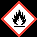
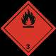

# Ficha de Datos de Seguridad - PINTURA EPOXICA BASE SOLVENTE BLANCO 13580

## Metadatos

- Fabricante: Pintuco
- Archivo fuente: `FDS 50 - PINTURA EPOXICA BASE SOLVENTE BLANCO 13580 - PINTUCO .pdf`
- Paginas: 14
- Secciones detectadas: 16 de 16
- Tablas extraidas: 61
- Imagenes extraidas: 40

## Tabla de secciones detectadas

| Seccion | Titulo normalizado | Paginas |
|---:|---|---:|
| 1 | Identificacion de la sustancia o la mezcla y de la sociedad o la empresa | 1 |
| 2 | Identificacion de los peligros | 1-2 |
| 3 | Composicion/informacion sobre los componentes | 2 |
| 4 | Primeros auxilios | 2 |
| 5 | Medidas de lucha contra incendios | 2-3 |
| 6 | Medidas en caso de vertido accidental | 3 |
| 7 | Manipulacion y almacenamiento | 3-4 |
| 8 | Controles de exposicion/proteccion individual | 4-6 |
| 9 | Propiedades fisicas y quimicas | 6-7 |
| 10 | Estabilidad y reactividad | 7 |
| 11 | Informacion toxicologica | 7-9 |
| 12 | Informacion ecologica | 9-11 |
| 13 | Consideraciones relativas a la eliminacion | 11 |
| 14 | Informacion relativa al transporte | 11-12 |
| 15 | Informacion reglamentaria | 12-13 |
| 16 | Otra informacion | 13-14 |

## Seccion 1: Identificacion de la sustancia o la mezcla y de la sociedad o la empresa

> Nota de trazabilidad: contenido extraido de la pagina 1 del PDF fuente `FDS 50 - PINTURA EPOXICA BASE SOLVENTE BLANCO 13580 - PINTUCO .pdf`.

1.1 Identificador SGA del producto: PINTURA EPOXICA BASE SOLVENTE BLANCO 13580
10014492

Otros medios de identificación:
No relevante
1.2 Uso recomendado del producto químico y restricciones:
Usos pertinentes: Pintura. Uso exclusivo usuario profesional.
Usos desaconsejados: Todo aquel uso no especificado en este epígrafe ni en el epígrafe 7.3
1.3 Datos sobre el proveedor:
Pintuco
Autopista Medellín Bogotá Km 37 Vía Belén Rionegro Km 1
054040 Rionegro - Antioquia - Colombia
Tfno.: 57 4 569 81 00
contacto@pintuco.com
http://www.pintuco.com

1.4 Número de teléfono para emergencias: CISTEMA SURA Colombia al 018000 51 14 14, fuera de Colombia (0574) 4444578

### Tablas extraidas de esta seccion

#### Tabla `pintuco__fds-50-pintura-epoxica-base-solvente-blanco-13580-pintuco__p001_tbl01`

|Col1|SECCIÓN 1: IDENTIFICACIÓN DEL PRODUCTO|
|---|---|
|**1.1**<br>**Identificador SGA del producto:**<br>PINTURA EPOXICA BASE SOLVENTE BLANCO 13580<br>10014492<br>**Otros medios de identificación:**<br>No relevante<br>**1.2**<br>**Uso recomendado del producto químico y restricciones:**<br>Usos pertinentes: Pintura. Uso exclusivo usuario profesional.<br>Usos desaconsejados: Todo aquel uso no especificado en este epígrafe ni en el epígrafe 7.3<br>**1.3**<br>**Datos sobre el proveedor:**<br>Pintuco<br>Autopista Medellín Bogotá Km 37 Vía Belén Rionegro Km 1<br>054040 Rionegro - Antioquia - Colombia<br>Tfno.: 57 4 569 81 00<br>contacto@pintuco.com<br>http://www.pintuco.com<br>**1.4**<br>**Número de teléfono para emergencias:**<br>CISTEMA SURA Colombia al 018000 51 14 14, fuera de Colombia (0574) 4444578|**1.1**<br>**Identificador SGA del producto:**<br>PINTURA EPOXICA BASE SOLVENTE BLANCO 13580<br>10014492<br>**Otros medios de identificación:**<br>No relevante<br>**1.2**<br>**Uso recomendado del producto químico y restricciones:**<br>Usos pertinentes: Pintura. Uso exclusivo usuario profesional.<br>Usos desaconsejados: Todo aquel uso no especificado en este epígrafe ni en el epígrafe 7.3<br>**1.3**<br>**Datos sobre el proveedor:**<br>Pintuco<br>Autopista Medellín Bogotá Km 37 Vía Belén Rionegro Km 1<br>054040 Rionegro - Antioquia - Colombia<br>Tfno.: 57 4 569 81 00<br>contacto@pintuco.com<br>http://www.pintuco.com<br>**1.4**<br>**Número de teléfono para emergencias:**<br>CISTEMA SURA Colombia al 018000 51 14 14, fuera de Colombia (0574) 4444578|

> Nota de trazabilidad: tabla `pintuco__fds-50-pintura-epoxica-base-solvente-blanco-13580-pintuco__p001_tbl01` extraida de la pagina 1, asociada a la Seccion 1 por proximidad espacial y metadatos de pagina.


### Imagenes extraidas de esta seccion

#### Imagen `pintuco__fds-50-pintura-epoxica-base-solvente-blanco-13580-pintuco__p001_img01`


> Nota de trazabilidad: imagen `pintuco__fds-50-pintura-epoxica-base-solvente-blanco-13580-pintuco__p001_img01` extraida de la pagina 1, asociada a la Seccion 1 por proximidad espacial y metadatos de pagina. Tipo detectado: imagen_embebida. Hash SHA-256: bddb1e8e26b57a44ff127f842574a5c217d8f89762e07cc89800b970482b4e01.

**Texto OCR de la imagen:**

```text
El Color de la Calidad”
```

#### Imagen `pintuco__fds-50-pintura-epoxica-base-solvente-blanco-13580-pintuco__p001_img02`


> Nota de trazabilidad: imagen `pintuco__fds-50-pintura-epoxica-base-solvente-blanco-13580-pintuco__p001_img02` extraida de la pagina 1, asociada a la Seccion 1 por proximidad espacial y metadatos de pagina. Tipo detectado: pictograma_o_simbolo. Hash SHA-256: 692175bde6fe67c001feba5ee26846e8c483c1ccdfac57bd7bc43b26842fcae8.

**Texto OCR de la imagen:**

```text
OCR sin texto legible.
```


## Seccion 2: Identificacion de los peligros

> Nota de trazabilidad: contenido extraido de la pagina 1 a la pagina 2 del PDF fuente `FDS 50 - PINTURA EPOXICA BASE SOLVENTE BLANCO 13580 - PINTUCO .pdf`.

2.1 Clasificación de la sustancia o de la mezcla:
SGA:
La clasificación del producto se ha realizado conforme con al decreto 1496 de 2018 y la Resolución 773 de 2021, por el cual se
adopta el Sistema Globalmente Armonizado de Clasificación y Etiquetado de Productos Químicos y se dictan otras disposiciones en
materia de seguridad química.

Irrit. Cut. 2: Irritación cutánea, categoría 2, H315
Irrit. oc. 2: Irritación ocular, categoría 2, H319
Liq. Infl. 3: Líquidos inflamables, Categoría 3, H226
Sens. Cut. 1: Sensibilización cutánea, Categoría 1, H317
Tox. Agud. 4: Toxicidad aguda por inhalación, Categoría 4, H332
Tox. Agud. 5: Toxicidad aguda por ingestión, Categoría 5, H303

2.2 Elementos de las etiquetas del SGA, incluidos los consejos de prudencia:
SGA:
Atención

Indicaciones de peligro:
Irrit. Cut. 2: H315 - Provoca irritación cutánea.
Irrit. oc. 2: H319 - Provoca irritación ocular grave.
Liq. Infl. 3: H226 - Líquido y vapores inflamables.
Sens. Cut. 1: H317 - Puede provocar una reacción cutánea alérgica.
Tox. Agud. 4: H332 - Nocivo si se inhala.
Tox. Agud. 5: H303 - Puede ser nocivo en caso de ingestión.

Consejos de prudencia:
P210: Mantener alejado del calor, superficies calientes, chispas llamas al descubierto y otras fuentes de ignición. No fumar.
P280: Usar guantes de protección/equipo de protección para la cara/ropa de protección/protección respiratoria/calzado de
protección.
P302+P352: EN CASO DE CONTACTO CON LA PIEL: Lavar con abundante agua.
P304+P340: EN CASO DE INHALACIÓN: Transportar a la persona al aire libre y mantenerla en una posición que le facilite la
respiración.
P305+P351+P338: EN CASO DE CONTACTO CON LOS OJOS: Enjuagar con agua cuidadosamente durante varios minutos. Quitar
las lentes de contacto cuando estén presentes y pueda hacerse con facilidad. Proseguir con el lavado.
P370+P378: En caso de incendio: Utilizar extintor de polvo ABC para la extinción.
P403+P235: Almacenar en un lugar bien ventilado. Mantener fresco.
P501: Eliminar el contenido/recipiente de acuerdo con la normativa sobre residuos peligrosos o envases y residuos de envases
respectivamente.

2.3 Otros peligros que no conducen a una clasificación:
No relevante

Página 1/14 Emisión: 20/09/2021 Versión: 1
- CONTINÚA EN LA SIGUIENTE PÁGINA -
10014492

Ficha de datos de seguridad
según Decreto 1496 de 2018 y Resolución 773 de 2021

### Tablas extraidas de esta seccion

#### Tabla `pintuco__fds-50-pintura-epoxica-base-solvente-blanco-13580-pintuco__p001_tbl02`

|Col1|SECCIÓN 2: IDENTIFICACIÓN DEL PELIGRO O PELIGROS|
|---|---|
|**2.1**<br>**Clasificación de la sustancia o de la mezcla:**<br>**SGA:**<br>La clasificación del producto se ha realizado conforme con al decreto 1496 de 2018 y la Resolución 773 de 2021, por el cual se<br>adopta el Sistema Globalmente Armonizado de Clasificación y Etiquetado de Productos Químicos y se dictan otras disposiciones en<br>materia de seguridad química.<br>Irrit. Cut. 2: Irritación cutánea, categoría 2, H315<br>Irrit. oc. 2: Irritación ocular, categoría 2, H319<br>Liq. Infl. 3: Líquidos inflamables, Categoría 3, H226<br>Sens. Cut. 1: Sensibilización cutánea, Categoría 1, H317<br>Tox. Agud. 4: Toxicidad aguda por inhalación, Categoría 4, H332<br>Tox. Agud. 5: Toxicidad aguda por ingestión, Categoría 5, H303<br>**2.2**<br>**Elementos de las etiquetas del SGA, incluidos los consejos de prudencia:**<br>**SGA:**<br>**Atención**<br>**Indicaciones de peligro:**<br>Irrit. Cut. 2: H315 - Provoca irritación cutánea.<br>Irrit. oc. 2: H319 - Provoca irritación ocular grave.<br>Liq. Infl. 3: H226 - Líquido y vapores inflamables.<br>Sens. Cut. 1: H317 - Puede provocar una reacción cutánea alérgica.<br>Tox. Agud. 4: H332 - Nocivo si se inhala.<br>Tox. Agud. 5: H303 - Puede ser nocivo en caso de ingestión.<br>**Consejos de prudencia:**<br>P210: Mantener alejado del calor, superficies calientes, chispas llamas al descubierto y otras fuentes de ignición. No fumar.<br>P280: Usar guantes de protección/equipo de protección para la cara/ropa de protección/protección respiratoria/calzado de<br>protección.<br>P302+P352: EN CASO DE CONTACTO CON LA PIEL: Lavar con abundante agua.<br>P304+P340: EN CASO DE INHALACIÓN: Transportar a la persona al aire libre y mantenerla en una posición que le facilite la<br>respiración.<br>P305+P351+P338: EN CASO DE CONTACTO CON LOS OJOS: Enjuagar con agua cuidadosamente durante varios minutos. Quitar<br>las lentes de contacto cuando estén presentes y pueda hacerse con facilidad. Proseguir con el lavado.<br>P370+P378: En caso de incendio: Utilizar extintor de polvo ABC para la extinción.<br>P403+P235: Almacenar en un lugar bien ventilado. Mantener fresco.<br>P501: Eliminar el contenido/recipiente de acuerdo con la normativa sobre residuos peligrosos o envases y residuos de envases<br>respectivamente.<br>**2.3**<br>**Otros peligros que no conducen a una clasificación:**<br>No relevante|**2.1**<br>**Clasificación de la sustancia o de la mezcla:**<br>**SGA:**<br>La clasificación del producto se ha realizado conforme con al decreto 1496 de 2018 y la Resolución 773 de 2021, por el cual se<br>adopta el Sistema Globalmente Armonizado de Clasificación y Etiquetado de Productos Químicos y se dictan otras disposiciones en<br>materia de seguridad química.<br>Irrit. Cut. 2: Irritación cutánea, categoría 2, H315<br>Irrit. oc. 2: Irritación ocular, categoría 2, H319<br>Liq. Infl. 3: Líquidos inflamables, Categoría 3, H226<br>Sens. Cut. 1: Sensibilización cutánea, Categoría 1, H317<br>Tox. Agud. 4: Toxicidad aguda por inhalación, Categoría 4, H332<br>Tox. Agud. 5: Toxicidad aguda por ingestión, Categoría 5, H303<br>**2.2**<br>**Elementos de las etiquetas del SGA, incluidos los consejos de prudencia:**<br>**SGA:**<br>**Atención**<br>**Indicaciones de peligro:**<br>Irrit. Cut. 2: H315 - Provoca irritación cutánea.<br>Irrit. oc. 2: H319 - Provoca irritación ocular grave.<br>Liq. Infl. 3: H226 - Líquido y vapores inflamables.<br>Sens. Cut. 1: H317 - Puede provocar una reacción cutánea alérgica.<br>Tox. Agud. 4: H332 - Nocivo si se inhala.<br>Tox. Agud. 5: H303 - Puede ser nocivo en caso de ingestión.<br>**Consejos de prudencia:**<br>P210: Mantener alejado del calor, superficies calientes, chispas llamas al descubierto y otras fuentes de ignición. No fumar.<br>P280: Usar guantes de protección/equipo de protección para la cara/ropa de protección/protección respiratoria/calzado de<br>protección.<br>P302+P352: EN CASO DE CONTACTO CON LA PIEL: Lavar con abundante agua.<br>P304+P340: EN CASO DE INHALACIÓN: Transportar a la persona al aire libre y mantenerla en una posición que le facilite la<br>respiración.<br>P305+P351+P338: EN CASO DE CONTACTO CON LOS OJOS: Enjuagar con agua cuidadosamente durante varios minutos. Quitar<br>las lentes de contacto cuando estén presentes y pueda hacerse con facilidad. Proseguir con el lavado.<br>P370+P378: En caso de incendio: Utilizar extintor de polvo ABC para la extinción.<br>P403+P235: Almacenar en un lugar bien ventilado. Mantener fresco.<br>P501: Eliminar el contenido/recipiente de acuerdo con la normativa sobre residuos peligrosos o envases y residuos de envases<br>respectivamente.<br>**2.3**<br>**Otros peligros que no conducen a una clasificación:**<br>No relevante|

> Nota de trazabilidad: tabla `pintuco__fds-50-pintura-epoxica-base-solvente-blanco-13580-pintuco__p001_tbl02` extraida de la pagina 1, asociada a la Seccion 2 por proximidad espacial y metadatos de pagina.

#### Tabla `pintuco__fds-50-pintura-epoxica-base-solvente-blanco-13580-pintuco__p001_tbl03`

|Emisión: 20/09/2021 Versión: 1|Página 1/14|
|---|---|

> Nota de trazabilidad: tabla `pintuco__fds-50-pintura-epoxica-base-solvente-blanco-13580-pintuco__p001_tbl03` extraida de la pagina 1, asociada a la Seccion 2 por proximidad espacial y metadatos de pagina.


### Imagenes extraidas de esta seccion

#### Imagen `pintuco__fds-50-pintura-epoxica-base-solvente-blanco-13580-pintuco__p001_img03`


> Nota de trazabilidad: imagen `pintuco__fds-50-pintura-epoxica-base-solvente-blanco-13580-pintuco__p001_img03` extraida de la pagina 1, asociada a la Seccion 2 por proximidad espacial y metadatos de pagina. Tipo detectado: icono_o_marca_pequena. Hash SHA-256: cb39b0eb17ae6344a9e5a7c9e225ea5e45938eb8d0b5dec2d4606989565e1a20.

**Texto OCR de la imagen:**

```text
OCR sin texto legible.
```

#### Imagen `pintuco__fds-50-pintura-epoxica-base-solvente-blanco-13580-pintuco__p001_img04`



> Nota de trazabilidad: imagen `pintuco__fds-50-pintura-epoxica-base-solvente-blanco-13580-pintuco__p001_img04` extraida de la pagina 1, asociada a la Seccion 2 por proximidad espacial y metadatos de pagina. Tipo detectado: icono_o_marca_pequena. Hash SHA-256: 3c11ecdf506e6468cf177565866eda8f1a3f37da38f6b682d3ddfd8a873822af.

**Texto OCR de la imagen:**

```text
OCR sin texto legible.
```

#### Imagen `pintuco__fds-50-pintura-epoxica-base-solvente-blanco-13580-pintuco__p001_img05`


> Nota de trazabilidad: imagen `pintuco__fds-50-pintura-epoxica-base-solvente-blanco-13580-pintuco__p001_img05` extraida de la pagina 1, asociada a la Seccion 2 por proximidad espacial y metadatos de pagina. Tipo detectado: icono_o_marca_pequena. Hash SHA-256: 9b726e637fc294e21e529ec76c96a35807ffdd725d9350ad19d3f0cd060f0df3.

**Texto OCR de la imagen:**

```text
OCR sin texto legible.
```

#### Imagen `pintuco__fds-50-pintura-epoxica-base-solvente-blanco-13580-pintuco__p002_img02`


> Nota de trazabilidad: imagen `pintuco__fds-50-pintura-epoxica-base-solvente-blanco-13580-pintuco__p002_img02` extraida de la pagina 2, asociada a la Seccion 2 por proximidad espacial y metadatos de pagina. Tipo detectado: pictograma_o_simbolo. Hash SHA-256: 692175bde6fe67c001feba5ee26846e8c483c1ccdfac57bd7bc43b26842fcae8.

**Texto OCR de la imagen:**

```text
OCR sin texto legible.
```


## Seccion 3: Composicion/informacion sobre los componentes

> Nota de trazabilidad: contenido extraido de la pagina 2 del PDF fuente `FDS 50 - PINTURA EPOXICA BASE SOLVENTE BLANCO 13580 - PINTUCO .pdf`.

3.1 Sustancias:
No aplicable
3.2 Mezclas:
Descripción química: Mezcla a base de productos químicos
Componentes:
De acuerdo al Decreto 1496 de 2018 y la Resolución 773 de 2021, el producto presenta:
Identificación Nombre químico/clasificación Concentración
CAS: 25036-25-3

Copolimero epoxy epicloridrina/Bisfenol A (700 < MW < 1100) 10 - <25 %
CAS: 1330-20-7

Xileno 10 - <25 %
CAS: 13463-67-7

Dioxido de titanio 2.5 - <10 %
CAS: 111-76-2

2-butoxietanol 2.5 - <10 %
CAS: 78-83-1

2-Metilpropan-1-ol 2.5 - <10 %
CAS: 100-41-4

Etilbenceno 2.5 - <10 %
Para ampliar información sobre la peligrosidad de las sustancias consultar las secciones 11, 12 y 16. La clasificación respecto
Carcinogenicidad de las sustancias se ha establecido en función de las monografías de la IARC adecuándola al sistema de
clasificación SGA, para información sobre la clasificación IARC consulte la sección 11.

### Tablas extraidas de esta seccion

#### Tabla `pintuco__fds-50-pintura-epoxica-base-solvente-blanco-13580-pintuco__p002_tbl01`

|Col1|SECCIÓN 3: COMPOSICIÓN/INFORMACIÓN SOBRE LOS COMPONENTES|
|---|---|
|**3.1**<br>**Sustancias:**<br>No aplicable<br>**3.2**<br>**Mezclas:**<br>**Descripción química:**Mezcla a base de productos químicos<br>**Componentes:**<br>De acuerdo al Decreto 1496 de 2018 y la Resolución 773 de 2021, el producto presenta:<br>Identificación<br>Nombre químico/clasificación<br>Concentración<br>CAS:<br>25036-25-3<br>**Copolimero epoxy epicloridrina/Bisfenol A (700 < MW < 1100)**<br>**10 - <25 %**<br>CAS:<br>1330-20-7<br>**Xileno**<br>**10 - <25 %**<br>CAS:<br>13463-67-7<br>**Dioxido de titanio**<br>**2.5 - <10 %**<br>CAS:<br>111-76-2<br>**2-butoxietanol**<br>**2.5 - <10 %**<br>CAS:<br>78-83-1<br>**2-Metilpropan-1-ol**<br>**2.5 - <10 %**<br>CAS:<br>100-41-4<br>**Etilbenceno**<br>**2.5 - <10 %**<br>Para ampliar información sobre la peligrosidad de las sustancias consultar las secciones 11, 12 y 16. La clasificación respecto<br>Carcinogenicidad de las sustancias se ha establecido en función de las monografías de la IARC adecuándola al sistema de<br>clasificación SGA, para información sobre la clasificación IARC consulte la sección 11.|**3.1**<br>**Sustancias:**<br>No aplicable<br>**3.2**<br>**Mezclas:**<br>**Descripción química:**Mezcla a base de productos químicos<br>**Componentes:**<br>De acuerdo al Decreto 1496 de 2018 y la Resolución 773 de 2021, el producto presenta:<br>Identificación<br>Nombre químico/clasificación<br>Concentración<br>CAS:<br>25036-25-3<br>**Copolimero epoxy epicloridrina/Bisfenol A (700 < MW < 1100)**<br>**10 - <25 %**<br>CAS:<br>1330-20-7<br>**Xileno**<br>**10 - <25 %**<br>CAS:<br>13463-67-7<br>**Dioxido de titanio**<br>**2.5 - <10 %**<br>CAS:<br>111-76-2<br>**2-butoxietanol**<br>**2.5 - <10 %**<br>CAS:<br>78-83-1<br>**2-Metilpropan-1-ol**<br>**2.5 - <10 %**<br>CAS:<br>100-41-4<br>**Etilbenceno**<br>**2.5 - <10 %**<br>Para ampliar información sobre la peligrosidad de las sustancias consultar las secciones 11, 12 y 16. La clasificación respecto<br>Carcinogenicidad de las sustancias se ha establecido en función de las monografías de la IARC adecuándola al sistema de<br>clasificación SGA, para información sobre la clasificación IARC consulte la sección 11.|

> Nota de trazabilidad: tabla `pintuco__fds-50-pintura-epoxica-base-solvente-blanco-13580-pintuco__p002_tbl01` extraida de la pagina 2, asociada a la Seccion 3 por proximidad espacial y metadatos de pagina.

#### Tabla `pintuco__fds-50-pintura-epoxica-base-solvente-blanco-13580-pintuco__p002_tbl02`

|Identificación|Nombre químico/clasificación|Concentración|
|---|---|---|
|CAS:<br>25036-25-3|**Copolimero epoxy epicloridrina/Bisfenol A (700 < MW < 1100)**|**10 - <25 %**|
|CAS:<br>1330-20-7|**Xileno**|**10 - <25 %**|
|CAS:<br>13463-67-7|**Dioxido de titanio**|**2.5 - <10 %**|
|CAS:<br>111-76-2|**2-butoxietanol**|**2.5 - <10 %**|
|CAS:<br>78-83-1|**2-Metilpropan-1-ol**|**2.5 - <10 %**|
|CAS:<br>100-41-4|**Etilbenceno**|**2.5 - <10 %**|

> Nota de trazabilidad: tabla `pintuco__fds-50-pintura-epoxica-base-solvente-blanco-13580-pintuco__p002_tbl02` extraida de la pagina 2, asociada a la Seccion 3 por proximidad espacial y metadatos de pagina.

#### Tabla `pintuco__fds-50-pintura-epoxica-base-solvente-blanco-13580-pintuco__p008_tbl02`

|Identificación|Toxicidad aguda|Col3|Género|
|---|---|---|---|
|Etilbenceno<br>CAS: 100-41-4|DL50 oral|3500 mg/kg|Rata|
|Etilbenceno<br>CAS: 100-41-4|DL50 cutánea|15354 mg/kg|Conejo|
|Etilbenceno<br>CAS: 100-41-4|CL50 inhalación|17,2 mg/L (4 h)|Rata|

> Nota de trazabilidad: tabla `pintuco__fds-50-pintura-epoxica-base-solvente-blanco-13580-pintuco__p008_tbl02` extraida de la pagina 8, asociada a la Seccion 3 por proximidad espacial y metadatos de pagina.

#### Tabla `pintuco__fds-50-pintura-epoxica-base-solvente-blanco-13580-pintuco__p008_tbl03`

|Emisión: 20/09/2021 Versión: 1|Página 8/14|
|---|---|

> Nota de trazabilidad: tabla `pintuco__fds-50-pintura-epoxica-base-solvente-blanco-13580-pintuco__p008_tbl03` extraida de la pagina 8, asociada a la Seccion 3 por proximidad espacial y metadatos de pagina.


### Imagenes extraidas de esta seccion

#### Imagen `pintuco__fds-50-pintura-epoxica-base-solvente-blanco-13580-pintuco__p002_img01`


> Nota de trazabilidad: imagen `pintuco__fds-50-pintura-epoxica-base-solvente-blanco-13580-pintuco__p002_img01` extraida de la pagina 2, asociada a la Seccion 3 por proximidad espacial y metadatos de pagina. Tipo detectado: imagen_embebida. Hash SHA-256: bddb1e8e26b57a44ff127f842574a5c217d8f89762e07cc89800b970482b4e01.

**Texto OCR de la imagen:**

```text
El Color de la Calidad”
```

#### Imagen `pintuco__fds-50-pintura-epoxica-base-solvente-blanco-13580-pintuco__p008_img01`


> Nota de trazabilidad: imagen `pintuco__fds-50-pintura-epoxica-base-solvente-blanco-13580-pintuco__p008_img01` extraida de la pagina 8, asociada a la Seccion 3 por proximidad espacial y metadatos de pagina. Tipo detectado: imagen_embebida. Hash SHA-256: bddb1e8e26b57a44ff127f842574a5c217d8f89762e07cc89800b970482b4e01.

**Texto OCR de la imagen:**

```text
El Color de la Calidad”
```


## Seccion 4: Primeros auxilios

> Nota de trazabilidad: contenido extraido de la pagina 2 del PDF fuente `FDS 50 - PINTURA EPOXICA BASE SOLVENTE BLANCO 13580 - PINTUCO .pdf`.

4.1 Descripción de los primeros auxilios necesarios:
Los síntomas como consecuencia de una intoxicación pueden presentarse con posterioridad a la exposición, por lo que, en caso de
duda, exposición directa al producto químico o persistencia del malestar solicitar atención médica, mostrándole la FDS de este
producto.

Por inhalación:
Sacar al afectado del lugar de exposición, suministrarle aire limpio y mantenerlo en reposo. En casos graves como parada
cardiorespiratoria, se aplicarán técnicas de respiración artificial (respiración boca a boca, masaje cardíaco, suministro de oxígeno,
etc.) requiriendo asistencia médica inmediata.

Por contacto con la piel:
Quitar la ropa y los zapatos contaminados, aclarar la piel o duchar al afectado si procede con abundante agua fría y jabón neutro. En
caso de afección importante acudir al médico. Si el producto produce quemaduras o congelación, no se debe quitar la ropa debido a
que podría empeorar la lesión producida si esta se encuentra pegada a la piel. En el caso de formarse ampollas en la piel, éstas
nunca deben reventarse ya que aumentaría el riesgo de infección.

Por contacto con los ojos:
Enjuagar los ojos con abundante agua a temperatura ambiente al menos durante 15 minutos. Evitar que el afectado se frote o cierre
los ojos. En el caso de que el accidentado use lentes de contacto, éstas deben retirarse siempre que no estén pegadas a los ojos,
de otro modo podría producirse un daño adicional. En todos los casos, después del lavado, se debe acudir al médico lo más
rápidamente posible con la FDS del producto.

Por ingestión/aspiración:
No inducir al vómito, en el caso de que se produzca mantener inclinada la cabeza hacia delante para evitar la aspiración. Mantener
al afectado en reposo. Enjuagar la boca y la garganta, ya que existe la posibilidad de que hayan sido afectadas en la ingestión.

4.2 Síntomas/efectos más importantes, agudos o retardados:
Los efectos agudos y retardados son los indicados en las secciones 2 y 11 de la FDS.
4.3 Indicación de la necesidad de recibir atención médica inmediata y, en su caso, de tratamiento especial:
No relevante

### Tablas extraidas de esta seccion

#### Tabla `pintuco__fds-50-pintura-epoxica-base-solvente-blanco-13580-pintuco__p002_tbl03`

|Col1|SECCIÓN 4: PRIMEROS AUXILIOS|
|---|---|
|**4.1**<br>**Descripción de los primeros auxilios necesarios:**<br>Los síntomas como consecuencia de una intoxicación pueden presentarse con posterioridad a la exposición, por lo que, en caso de<br>duda, exposición directa al producto químico o persistencia del malestar solicitar atención médica, mostrándole la FDS de este<br>producto.<br>**Por inhalación:**<br>Sacar al afectado del lugar de exposición, suministrarle aire limpio y mantenerlo en reposo. En casos graves como parada<br>cardiorespiratoria, se aplicarán técnicas de respiración artificial (respiración boca a boca, masaje cardíaco, suministro de oxígeno,<br>etc.) requiriendo asistencia médica inmediata.<br>**Por contacto con la piel:**<br>Quitar la ropa y los zapatos contaminados, aclarar la piel o duchar al afectado si procede con abundante agua fría y jabón neutro. En<br>caso de afección importante acudir al médico. Si el producto produce quemaduras o congelación, no se debe quitar la ropa debido a<br>que podría empeorar la lesión producida si esta se encuentra pegada a la piel. En el caso de formarse ampollas en la piel, éstas<br>nunca deben reventarse ya que aumentaría el riesgo de infección.<br>**Por contacto con los ojos:**<br>Enjuagar los ojos con abundante agua a temperatura ambiente al menos durante 15 minutos. Evitar que el afectado se frote o cierre<br>los ojos. En el caso de que el accidentado use lentes de contacto, éstas deben retirarse siempre que no estén pegadas a los ojos,<br>de otro modo podría producirse un daño adicional. En todos los casos, después del lavado, se debe acudir al médico lo más<br>rápidamente posible con la FDS del producto.<br>**Por ingestión/aspiración:**<br>No inducir al vómito, en el caso de que se produzca mantener inclinada la cabeza hacia delante para evitar la aspiración. Mantener<br>al afectado en reposo. Enjuagar la boca y la garganta, ya que existe la posibilidad de que hayan sido afectadas en la ingestión.<br>**4.2**<br>**Síntomas/efectos más importantes, agudos o retardados:**<br>Los efectos agudos y retardados son los indicados en las secciones 2 y 11 de la FDS.<br>**4.3**<br>**Indicación de la necesidad de recibir atención médica inmediata y, en su caso, de tratamiento especial:**<br>No relevante|**4.1**<br>**Descripción de los primeros auxilios necesarios:**<br>Los síntomas como consecuencia de una intoxicación pueden presentarse con posterioridad a la exposición, por lo que, en caso de<br>duda, exposición directa al producto químico o persistencia del malestar solicitar atención médica, mostrándole la FDS de este<br>producto.<br>**Por inhalación:**<br>Sacar al afectado del lugar de exposición, suministrarle aire limpio y mantenerlo en reposo. En casos graves como parada<br>cardiorespiratoria, se aplicarán técnicas de respiración artificial (respiración boca a boca, masaje cardíaco, suministro de oxígeno,<br>etc.) requiriendo asistencia médica inmediata.<br>**Por contacto con la piel:**<br>Quitar la ropa y los zapatos contaminados, aclarar la piel o duchar al afectado si procede con abundante agua fría y jabón neutro. En<br>caso de afección importante acudir al médico. Si el producto produce quemaduras o congelación, no se debe quitar la ropa debido a<br>que podría empeorar la lesión producida si esta se encuentra pegada a la piel. En el caso de formarse ampollas en la piel, éstas<br>nunca deben reventarse ya que aumentaría el riesgo de infección.<br>**Por contacto con los ojos:**<br>Enjuagar los ojos con abundante agua a temperatura ambiente al menos durante 15 minutos. Evitar que el afectado se frote o cierre<br>los ojos. En el caso de que el accidentado use lentes de contacto, éstas deben retirarse siempre que no estén pegadas a los ojos,<br>de otro modo podría producirse un daño adicional. En todos los casos, después del lavado, se debe acudir al médico lo más<br>rápidamente posible con la FDS del producto.<br>**Por ingestión/aspiración:**<br>No inducir al vómito, en el caso de que se produzca mantener inclinada la cabeza hacia delante para evitar la aspiración. Mantener<br>al afectado en reposo. Enjuagar la boca y la garganta, ya que existe la posibilidad de que hayan sido afectadas en la ingestión.<br>**4.2**<br>**Síntomas/efectos más importantes, agudos o retardados:**<br>Los efectos agudos y retardados son los indicados en las secciones 2 y 11 de la FDS.<br>**4.3**<br>**Indicación de la necesidad de recibir atención médica inmediata y, en su caso, de tratamiento especial:**<br>No relevante|

> Nota de trazabilidad: tabla `pintuco__fds-50-pintura-epoxica-base-solvente-blanco-13580-pintuco__p002_tbl03` extraida de la pagina 2, asociada a la Seccion 4 por proximidad espacial y metadatos de pagina.


## Seccion 5: Medidas de lucha contra incendios

> Nota de trazabilidad: contenido extraido de la pagina 2 a la pagina 3 del PDF fuente `FDS 50 - PINTURA EPOXICA BASE SOLVENTE BLANCO 13580 - PINTUCO .pdf`.

Página 2/14 Emisión: 20/09/2021 Versión: 1
- CONTINÚA EN LA SIGUIENTE PÁGINA -
10014492

Ficha de datos de seguridad
según Decreto 1496 de 2018 y Resolución 773 de 2021
SECCIÓN 5: MEDIDAS DE LUCHA CONTRA INCENDIOS (continúa)
5.1 Medios de extinción apropiados:
Medios de extinción apropiados:
Emplear preferentemente extintores de polvo polivalente (polvo ABC), alternativamente utilizar espuma física o extintores de dióxido
de carbono (CO2).

Medios de extinción no apropiados:
NO SE RECOMIENDA emplear agua a chorro como agente de extinción.
5.2 Peligros específicos del producto químico:
Como consecuencia de la combustión o descomposición térmica se generan subproductos de reacción que pueden resultar
altamente tóxicos y, consecuentemente, pueden presentar un riesgo elevado para la salud.

5.3 Medidas especiales que deben tomar los equipos de lucha contra incendios:
En función de la magnitud del incendio puede hacerse necesario el uso de ropa protectora completa y equipo de respiración
autónomo. Disponer de un mínimo de instalaciones de emergencia o elementos de actuación (mantas ignífugas, botiquín portátil,...).

Disposiciones adicionales:
Actuar conforme el Plan de Emergencia Interior y las Fichas Informativas sobre actuación ante accidentes y otras emergencias.
Suprimir cualquier fuente de ignición. En caso de incendio, refrigerar los recipientes y tanques de almacenamiento de productos
susceptibles a inflamación, explosión como consecuencia de elevadas temperaturas. Evitar el vertido de los productos empleados en
la extinción del incendio al medio acuático.

### Tablas extraidas de esta seccion

#### Tabla `pintuco__fds-50-pintura-epoxica-base-solvente-blanco-13580-pintuco__p002_tbl04`

|Col1|SECCIÓN 5: MEDIDAS DE LUCHA CONTRA INCENDIOS|
|---|---|
|||

> Nota de trazabilidad: tabla `pintuco__fds-50-pintura-epoxica-base-solvente-blanco-13580-pintuco__p002_tbl04` extraida de la pagina 2, asociada a la Seccion 5 por proximidad espacial y metadatos de pagina.

#### Tabla `pintuco__fds-50-pintura-epoxica-base-solvente-blanco-13580-pintuco__p002_tbl05`

|Emisión: 20/09/2021 Versión: 1|Página 2/14|
|---|---|

> Nota de trazabilidad: tabla `pintuco__fds-50-pintura-epoxica-base-solvente-blanco-13580-pintuco__p002_tbl05` extraida de la pagina 2, asociada a la Seccion 5 por proximidad espacial y metadatos de pagina.

#### Tabla `pintuco__fds-50-pintura-epoxica-base-solvente-blanco-13580-pintuco__p003_tbl01`

|Col1|SECCIÓN 5: MEDIDAS DE LUCHA CONTRA INCENDIOS (continúa)|
|---|---|
|**5.1**<br>**Medios de extinción apropiados:**<br>**Medios de extinción apropiados:**<br>Emplear preferentemente extintores de polvo polivalente (polvo ABC), alternativamente utilizar espuma física o extintores de dióxido<br>de carbono (CO2).<br>**Medios de extinción no apropiados:**<br>NO SE RECOMIENDA emplear agua a chorro como agente de extinción.<br>**5.2**<br>**Peligros específicos del producto químico:**<br>Como consecuencia de la combustión o descomposición térmica se generan subproductos de reacción que pueden resultar<br>altamente tóxicos y, consecuentemente, pueden presentar un riesgo elevado para la salud.<br>**5.3**<br>**Medidas especiales que deben tomar los equipos de lucha contra incendios:**<br>En función de la magnitud del incendio puede hacerse necesario el uso de ropa protectora completa y equipo de respiración<br>autónomo. Disponer de un mínimo de instalaciones de emergencia o elementos de actuación (mantas ignífugas, botiquín portátil,...).<br>**Disposiciones adicionales:**<br>Actuar conforme el Plan de Emergencia Interior y las Fichas Informativas sobre actuación ante accidentes y otras emergencias.<br>Suprimir cualquier fuente de ignición. En caso de incendio, refrigerar los recipientes y tanques de almacenamiento de productos<br>susceptibles a inflamación, explosión como consecuencia de elevadas temperaturas. Evitar el vertido de los productos empleados en<br>la extinción del incendio al medio acuático.|**5.1**<br>**Medios de extinción apropiados:**<br>**Medios de extinción apropiados:**<br>Emplear preferentemente extintores de polvo polivalente (polvo ABC), alternativamente utilizar espuma física o extintores de dióxido<br>de carbono (CO2).<br>**Medios de extinción no apropiados:**<br>NO SE RECOMIENDA emplear agua a chorro como agente de extinción.<br>**5.2**<br>**Peligros específicos del producto químico:**<br>Como consecuencia de la combustión o descomposición térmica se generan subproductos de reacción que pueden resultar<br>altamente tóxicos y, consecuentemente, pueden presentar un riesgo elevado para la salud.<br>**5.3**<br>**Medidas especiales que deben tomar los equipos de lucha contra incendios:**<br>En función de la magnitud del incendio puede hacerse necesario el uso de ropa protectora completa y equipo de respiración<br>autónomo. Disponer de un mínimo de instalaciones de emergencia o elementos de actuación (mantas ignífugas, botiquín portátil,...).<br>**Disposiciones adicionales:**<br>Actuar conforme el Plan de Emergencia Interior y las Fichas Informativas sobre actuación ante accidentes y otras emergencias.<br>Suprimir cualquier fuente de ignición. En caso de incendio, refrigerar los recipientes y tanques de almacenamiento de productos<br>susceptibles a inflamación, explosión como consecuencia de elevadas temperaturas. Evitar el vertido de los productos empleados en<br>la extinción del incendio al medio acuático.|

> Nota de trazabilidad: tabla `pintuco__fds-50-pintura-epoxica-base-solvente-blanco-13580-pintuco__p003_tbl01` extraida de la pagina 3, asociada a la Seccion 5 por proximidad espacial y metadatos de pagina.


### Imagenes extraidas de esta seccion

#### Imagen `pintuco__fds-50-pintura-epoxica-base-solvente-blanco-13580-pintuco__p003_img01`


> Nota de trazabilidad: imagen `pintuco__fds-50-pintura-epoxica-base-solvente-blanco-13580-pintuco__p003_img01` extraida de la pagina 3, asociada a la Seccion 5 por proximidad espacial y metadatos de pagina. Tipo detectado: imagen_embebida. Hash SHA-256: bddb1e8e26b57a44ff127f842574a5c217d8f89762e07cc89800b970482b4e01.

**Texto OCR de la imagen:**

```text
El Color de la Calidad”
```

#### Imagen `pintuco__fds-50-pintura-epoxica-base-solvente-blanco-13580-pintuco__p003_img02`


> Nota de trazabilidad: imagen `pintuco__fds-50-pintura-epoxica-base-solvente-blanco-13580-pintuco__p003_img02` extraida de la pagina 3, asociada a la Seccion 5 por proximidad espacial y metadatos de pagina. Tipo detectado: pictograma_o_simbolo. Hash SHA-256: 692175bde6fe67c001feba5ee26846e8c483c1ccdfac57bd7bc43b26842fcae8.

**Texto OCR de la imagen:**

```text
OCR sin texto legible.
```


## Seccion 6: Medidas en caso de vertido accidental

> Nota de trazabilidad: contenido extraido de la pagina 3 del PDF fuente `FDS 50 - PINTURA EPOXICA BASE SOLVENTE BLANCO 13580 - PINTUCO .pdf`.

6.1 Precauciones personales, equipo protector y procedimiento de emergencia:
Para el personal que no forma parte de los servicios de emergencia:
Aislar las fugas siempre y cuando no suponga un riesgo adicional para las personas que desempeñen esta función. Evacuar la zona
y mantener a las personas sin protección alejadas. Ante el contacto potencial con el producto derramado se hace obligatorio el uso
de elementos de protección personal (ver sección 8 de la FDS). Evitar de manera prioritaria la formación de mezclas vapor-aire
inflamables, ya sea mediante ventilación o el uso de un agente inertizante. Suprimir cualquier fuente de ignición. Eliminar las cargas
electroestáticas mediante la interconexión de todas las superficies conductoras sobre las que se puede formar electricidad estática, y
estando a su vez el conjunto conectado a tierra.

Para el personal de emergencia:
Ver sección 8 de la FDS.
6.2 Precauciones relativas al medio ambiente:
Producto no clasificado como peligroso para el medioambiente. Mantener el producto alejado de los desagües y de las aguas
superficiales y subterráneas.

6.3 Métodos y materiales para la contención y limpieza de vertidos:
Se recomienda:
Absorber el vertido mediante arena o absorbente inerte y trasladarlo a un lugar seguro. No absorber en serrín u otros absorbentes
combustibles. Para cualquier consideración relativa a la eliminación consultar la sección 13 de la FDS.

6.4 Referencias a otras secciones:
Ver secciones 8 y 13.

### Tablas extraidas de esta seccion

#### Tabla `pintuco__fds-50-pintura-epoxica-base-solvente-blanco-13580-pintuco__p003_tbl02`

|Col1|SECCIÓN 6: MEDIDAS QUE DEBEN TOMARSE EN CASO DE VERTIDO ACCIDENTAL|
|---|---|
|**6.1**<br>**Precauciones personales, equipo protector y procedimiento de emergencia:**<br>**Para el personal que no forma parte de los servicios de emergencia:**<br>Aislar las fugas siempre y cuando no suponga un riesgo adicional para las personas que desempeñen esta función. Evacuar la zona<br>y mantener a las personas sin protección alejadas. Ante el contacto potencial con el producto derramado se hace obligatorio el uso<br>de elementos de protección personal (ver sección 8 de la FDS). Evitar de manera prioritaria la formación de mezclas vapor-aire<br>inflamables, ya sea mediante ventilación o el uso de un agente inertizante. Suprimir cualquier fuente de ignición. Eliminar las cargas<br>electroestáticas mediante la interconexión de todas las superficies conductoras sobre las que se puede formar electricidad estática, y<br>estando a su vez el conjunto conectado a tierra.<br>**Para el personal de emergencia:**<br>Ver sección 8 de la FDS.<br>**6.2**<br>**Precauciones relativas al medio ambiente:**<br>Producto no clasificado como peligroso para el medioambiente. Mantener el producto alejado de los desagües y de las aguas<br>superficiales y subterráneas.<br>**6.3**<br>**Métodos y materiales para la contención y limpieza de vertidos:**<br>Se recomienda:<br>Absorber el vertido mediante arena o absorbente inerte y trasladarlo a un lugar seguro. No absorber en serrín u otros absorbentes<br>combustibles. Para cualquier consideración relativa a la eliminación consultar la sección 13 de la FDS.<br>**6.4**<br>**Referencias a otras secciones:**<br>Ver secciones 8 y 13.|**6.1**<br>**Precauciones personales, equipo protector y procedimiento de emergencia:**<br>**Para el personal que no forma parte de los servicios de emergencia:**<br>Aislar las fugas siempre y cuando no suponga un riesgo adicional para las personas que desempeñen esta función. Evacuar la zona<br>y mantener a las personas sin protección alejadas. Ante el contacto potencial con el producto derramado se hace obligatorio el uso<br>de elementos de protección personal (ver sección 8 de la FDS). Evitar de manera prioritaria la formación de mezclas vapor-aire<br>inflamables, ya sea mediante ventilación o el uso de un agente inertizante. Suprimir cualquier fuente de ignición. Eliminar las cargas<br>electroestáticas mediante la interconexión de todas las superficies conductoras sobre las que se puede formar electricidad estática, y<br>estando a su vez el conjunto conectado a tierra.<br>**Para el personal de emergencia:**<br>Ver sección 8 de la FDS.<br>**6.2**<br>**Precauciones relativas al medio ambiente:**<br>Producto no clasificado como peligroso para el medioambiente. Mantener el producto alejado de los desagües y de las aguas<br>superficiales y subterráneas.<br>**6.3**<br>**Métodos y materiales para la contención y limpieza de vertidos:**<br>Se recomienda:<br>Absorber el vertido mediante arena o absorbente inerte y trasladarlo a un lugar seguro. No absorber en serrín u otros absorbentes<br>combustibles. Para cualquier consideración relativa a la eliminación consultar la sección 13 de la FDS.<br>**6.4**<br>**Referencias a otras secciones:**<br>Ver secciones 8 y 13.|

> Nota de trazabilidad: tabla `pintuco__fds-50-pintura-epoxica-base-solvente-blanco-13580-pintuco__p003_tbl02` extraida de la pagina 3, asociada a la Seccion 6 por proximidad espacial y metadatos de pagina.

#### Tabla `pintuco__fds-50-pintura-epoxica-base-solvente-blanco-13580-pintuco__p003_tbl04`

|Emisión: 20/09/2021 Versión: 1|Página 3/14|
|---|---|

> Nota de trazabilidad: tabla `pintuco__fds-50-pintura-epoxica-base-solvente-blanco-13580-pintuco__p003_tbl04` extraida de la pagina 3, asociada a la Seccion 6 por proximidad espacial y metadatos de pagina.


## Seccion 7: Manipulacion y almacenamiento

> Nota de trazabilidad: contenido extraido de la pagina 3 a la pagina 4 del PDF fuente `FDS 50 - PINTURA EPOXICA BASE SOLVENTE BLANCO 13580 - PINTUCO .pdf`.

7.1 Precauciones que se deben tomar para garantizar una manipulación segura:
A.- Precauciones generales
Cumplir con la legislación vigente en materia de prevención de riesgos laborales. Mantener los recipientes herméticamente
cerrados. Controlar los derrames y residuos, eliminándolos con métodos seguros (sección 6 de la FDS). Evitar el vertido libre
desde el recipiente. Mantener orden y limpieza donde se manipulen productos peligrosos.

B.- Recomendaciones técnicas para la prevención de incendios y explosiones.

Página 3/14 Emisión: 20/09/2021 Versión: 1
- CONTINÚA EN LA SIGUIENTE PÁGINA -
10014492

Ficha de datos de seguridad
según Decreto 1496 de 2018 y Resolución 773 de 2021
SECCIÓN 7: MANIPULACIÓN Y ALMACENAMIENTO (continúa)
Trasvasar en lugares bien ventilados, preferentemente mediante extracción localizada. Controlar totalmente los focos de ignición
(teléfonos móviles, chispas,…) y ventilar en las operaciones de limpieza. Evitar la existencia de atmósferas peligrosas en el
interior de recipientes, aplicando en lo posible sistemas de inertización. Trasvasar a velocidades lentas para evitar la generación
de cargas electroestáticas. Ante la posibilidad de existencia de cargas electroestáticas: asegurar una perfecta conexión
equipotencial, utilizar siempre tomas de tierras, no emplear ropa de trabajo de fibras acrílicas, empleando preferiblemente ropa de
algodón y calzado conductor. Cumplir con los requisitos esenciales de seguridad para equipos y con las disposiciones mínimas
para la protección de la seguridad y salud de los trabajadores. Consultar la sección 10 de la FDS sobre condiciones y materias
que deben evitarse.

C.- Recomendaciones técnicas para prevenir riesgos ergonómicos y toxicológicos.
Para control de exposición consultar la sección 8 de la FDS. No comer, beber ni fumar en las zonas de trabajo
lavarse las manos después de cada utilización, y despojarse de prendas de vestir y equipos de protección contaminados antes
de entrar en las zonas para comer.

D.- Recomendaciones técnicas para prevenir riesgos medioambientales
Se recomienda disponer de material absorbente en las proximidades del producto (ver epígrafe 6.3 de la FDS para mayor
información)

7.2 Condiciones de almacenamiento seguro, incluidas cualesquiera incompatibilidades:
A.- Medidas técnicas de almacenamiento
B.- Condiciones generales de almacenamiento.
Evitar fuentes de calor, radiación, electricidad estática y el contacto con alimentos. Para información adicional ver epígrafe 10.5
7.3 Usos específicos finales:
Salvo las indicaciones ya especificadas no es preciso realizar ninguna recomendación especial en cuanto a los usos de este
producto.

Temperatura mínima: 5 ºC
Temperatura máxima: 30 ºC
Tiempo máximo: 18 meses

### Tablas extraidas de esta seccion

#### Tabla `pintuco__fds-50-pintura-epoxica-base-solvente-blanco-13580-pintuco__p003_tbl03`

|Col1|SECCIÓN 7: MANIPULACIÓN Y ALMACENAMIENTO|
|---|---|
|**7.1**<br>**Precauciones que se deben tomar para garantizar una manipulación segura:**<br>A.- Precauciones generales<br>Cumplir con la legislación vigente en materia de prevención de riesgos laborales. Mantener los recipientes herméticamente<br>cerrados. Controlar los derrames y residuos, eliminándolos con métodos seguros (sección 6 de la FDS). Evitar el vertido libre<br>desde el recipiente. Mantener orden y limpieza donde se manipulen productos peligrosos.<br>B.- Recomendaciones técnicas para la prevención de incendios y explosiones.|**7.1**<br>**Precauciones que se deben tomar para garantizar una manipulación segura:**<br>A.- Precauciones generales<br>Cumplir con la legislación vigente en materia de prevención de riesgos laborales. Mantener los recipientes herméticamente<br>cerrados. Controlar los derrames y residuos, eliminándolos con métodos seguros (sección 6 de la FDS). Evitar el vertido libre<br>desde el recipiente. Mantener orden y limpieza donde se manipulen productos peligrosos.<br>B.- Recomendaciones técnicas para la prevención de incendios y explosiones.|

> Nota de trazabilidad: tabla `pintuco__fds-50-pintura-epoxica-base-solvente-blanco-13580-pintuco__p003_tbl03` extraida de la pagina 3, asociada a la Seccion 7 por proximidad espacial y metadatos de pagina.

#### Tabla `pintuco__fds-50-pintura-epoxica-base-solvente-blanco-13580-pintuco__p004_tbl01`

|Col1|SECCIÓN 7: MANIPULACIÓN Y ALMACENAMIENTO (continúa)|
|---|---|
|Trasvasar en lugares bien ventilados, preferentemente mediante extracción localizada. Controlar totalmente los focos de ignición<br>(teléfonos móviles, chispas,…) y ventilar en las operaciones de limpieza. Evitar la existencia de atmósferas peligrosas en el<br>interior de recipientes, aplicando en lo posible sistemas de inertización. Trasvasar a velocidades lentas para evitar la generación<br>de cargas electroestáticas. Ante la posibilidad de existencia de cargas electroestáticas: asegurar una perfecta conexión<br>equipotencial, utilizar siempre tomas de tierras, no emplear ropa de trabajo de fibras acrílicas, empleando preferiblemente ropa de<br>algodón y calzado conductor. Cumplir con los requisitos esenciales de seguridad para equipos  y con las disposiciones mínimas<br>para la protección de la seguridad y salud de los trabajadores. Consultar la sección 10 de la FDS sobre condiciones y materias<br>que deben evitarse.<br>C.- Recomendaciones técnicas para prevenir riesgos ergonómicos y toxicológicos.<br>Para control de exposición consultar la sección 8 de la FDS. No comer, beber ni fumar en las zonas de trabajo<br>lavarse las manos después de cada utilización, y despojarse de prendas de vestir y equipos de protección contaminados antes<br>de entrar en las zonas para comer.<br>D.- Recomendaciones técnicas para prevenir riesgos medioambientales<br>Se recomienda disponer de material absorbente en las proximidades del producto (ver epígrafe 6.3 de la FDS para mayor<br>información)<br>**7.2**<br>**Condiciones de almacenamiento seguro, incluidas cualesquiera incompatibilidades:**<br>A.- Medidas técnicas de almacenamiento<br>B.- Condiciones generales de almacenamiento.<br>Evitar fuentes de calor, radiación, electricidad estática y el contacto con alimentos. Para información adicional ver epígrafe 10.5<br>**7.3**<br>**Usos específicos finales:**<br>Salvo las indicaciones ya especificadas no es preciso realizar ninguna recomendación especial en cuanto a los usos de este<br>producto.<br>Temperatura mínima:<br>5 ºC<br>Temperatura máxima:<br>30 ºC<br>Tiempo máximo:<br>18 meses|Trasvasar en lugares bien ventilados, preferentemente mediante extracción localizada. Controlar totalmente los focos de ignición<br>(teléfonos móviles, chispas,…) y ventilar en las operaciones de limpieza. Evitar la existencia de atmósferas peligrosas en el<br>interior de recipientes, aplicando en lo posible sistemas de inertización. Trasvasar a velocidades lentas para evitar la generación<br>de cargas electroestáticas. Ante la posibilidad de existencia de cargas electroestáticas: asegurar una perfecta conexión<br>equipotencial, utilizar siempre tomas de tierras, no emplear ropa de trabajo de fibras acrílicas, empleando preferiblemente ropa de<br>algodón y calzado conductor. Cumplir con los requisitos esenciales de seguridad para equipos  y con las disposiciones mínimas<br>para la protección de la seguridad y salud de los trabajadores. Consultar la sección 10 de la FDS sobre condiciones y materias<br>que deben evitarse.<br>C.- Recomendaciones técnicas para prevenir riesgos ergonómicos y toxicológicos.<br>Para control de exposición consultar la sección 8 de la FDS. No comer, beber ni fumar en las zonas de trabajo<br>lavarse las manos después de cada utilización, y despojarse de prendas de vestir y equipos de protección contaminados antes<br>de entrar en las zonas para comer.<br>D.- Recomendaciones técnicas para prevenir riesgos medioambientales<br>Se recomienda disponer de material absorbente en las proximidades del producto (ver epígrafe 6.3 de la FDS para mayor<br>información)<br>**7.2**<br>**Condiciones de almacenamiento seguro, incluidas cualesquiera incompatibilidades:**<br>A.- Medidas técnicas de almacenamiento<br>B.- Condiciones generales de almacenamiento.<br>Evitar fuentes de calor, radiación, electricidad estática y el contacto con alimentos. Para información adicional ver epígrafe 10.5<br>**7.3**<br>**Usos específicos finales:**<br>Salvo las indicaciones ya especificadas no es preciso realizar ninguna recomendación especial en cuanto a los usos de este<br>producto.<br>Temperatura mínima:<br>5 ºC<br>Temperatura máxima:<br>30 ºC<br>Tiempo máximo:<br>18 meses|

> Nota de trazabilidad: tabla `pintuco__fds-50-pintura-epoxica-base-solvente-blanco-13580-pintuco__p004_tbl01` extraida de la pagina 4, asociada a la Seccion 7 por proximidad espacial y metadatos de pagina.

#### Tabla `pintuco__fds-50-pintura-epoxica-base-solvente-blanco-13580-pintuco__p007_tbl03`

|Choque y fricción|Contacto con el aire|Calentamiento|Luz Solar|Humedad|
|---|---|---|---|---|
|No aplicable|No aplicable|Riesgo de inflamación|Evitar incidencia directa|No aplicable|

> Nota de trazabilidad: tabla `pintuco__fds-50-pintura-epoxica-base-solvente-blanco-13580-pintuco__p007_tbl03` extraida de la pagina 7, asociada a la Seccion 7 por proximidad espacial y metadatos de pagina.

#### Tabla `pintuco__fds-50-pintura-epoxica-base-solvente-blanco-13580-pintuco__p007_tbl04`

|Ácidos|Agua|Materias comburentes|Materias combustibles|Otros|
|---|---|---|---|---|
|Evitar ácidos fuertes|No aplicable|Evitar incidencia directa|No aplicable|Evitar álcalis o bases fuertes|

> Nota de trazabilidad: tabla `pintuco__fds-50-pintura-epoxica-base-solvente-blanco-13580-pintuco__p007_tbl04` extraida de la pagina 7, asociada a la Seccion 7 por proximidad espacial y metadatos de pagina.


### Imagenes extraidas de esta seccion

#### Imagen `pintuco__fds-50-pintura-epoxica-base-solvente-blanco-13580-pintuco__p004_img02`


> Nota de trazabilidad: imagen `pintuco__fds-50-pintura-epoxica-base-solvente-blanco-13580-pintuco__p004_img02` extraida de la pagina 4, asociada a la Seccion 7 por proximidad espacial y metadatos de pagina. Tipo detectado: pictograma_o_simbolo. Hash SHA-256: 692175bde6fe67c001feba5ee26846e8c483c1ccdfac57bd7bc43b26842fcae8.

**Texto OCR de la imagen:**

```text
OCR sin texto legible.
```


## Seccion 8: Controles de exposicion/proteccion individual

> Nota de trazabilidad: contenido extraido de la pagina 4 a la pagina 6 del PDF fuente `FDS 50 - PINTURA EPOXICA BASE SOLVENTE BLANCO 13580 - PINTUCO .pdf`.

8.1 Parámetros de control:
Sustancias cuyos valores límite de exposición profesional han de controlarse en el ambiente de trabajo:
OSHA (Tablas Z):
Identificación Valores límite ambientales
Xileno 8-hour TWA PEL 100 ppm 435 mg/m³
CAS: 1330-20-7 Ceiling Values - TWA
PEL

Dioxido de titanio 8-hour TWA PEL 15 mg/m³
CAS: 13463-67-7 Ceiling Values - TWA
PEL

2-butoxietanol 8-hour TWA PEL 50 ppm 240 mg/m³
CAS: 111-76-2 Ceiling Values - TWA
PEL

2-Metilpropan-1-ol 8-hour TWA PEL 100 ppm 300 mg/m³
CAS: 78-83-1 Ceiling Values - TWA
PEL

Etilbenceno 8-hour TWA PEL 100 ppm 435 mg/m³
CAS: 100-41-4 Ceiling Values - TWA
PEL

ACGIH:
Identificación Valores límite ambientales
Xileno TLV-TWA 100 ppm
CAS: 1330-20-7 TLV-STEL 150 ppm

Dioxido de titanio TLV-TWA 10 mg/m³
CAS: 13463-67-7 TLV-STEL

2-butoxietanol TLV-TWA 20 ppm
CAS: 111-76-2 TLV-STEL

2-Metilpropan-1-ol TLV-TWA 50 ppm
CAS: 78-83-1 TLV-STEL

Etilbenceno TLV-TWA 20 ppm
CAS: 100-41-4 TLV-STEL

Página 4/14 Emisión: 20/09/2021 Versión: 1
- CONTINÚA EN LA SIGUIENTE PÁGINA -
10014492

Ficha de datos de seguridad
según Decreto 1496 de 2018 y Resolución 773 de 2021
SECCIÓN 8: CONTROLES DE EXPOSICIÓN/PROTECCIÓN PERSONAL (continúa)
Valores límite biológicos:
Indices de exposición biológicos (BEIs®) - ACGIH
Identificación BEIs® Determinante Momento de muestreo
Xileno
CAS: 1330-20-7
1500 mg/g (Creatinina) Ácidos metilhipúricos
en orina
Fin del turno

2-butoxietanol
CAS: 111-76-2
200 mg/g (Creatinina) Ácido butoxiacético
(BAA) en la orina
Fin del turno

Etilbenceno
CAS: 100-41-4
150 mg/g (Creatinina) Suma de ácido
mandélico y ácido
fenilglioxílico en la orina
Fin del turno

8.2 Controles técnicos apropiados:
A.- Medidas de protección individual, como equipo de protección personal (EPP)
Realizar la identificación de los peligros y la valoración de los riesgos de acuerdo a la Guia técnica colombiana GTC 45. Como
medida de prevención se recomienda la utilización de equipos de protección individual básicos. Para más información sobre los
equipos de protección individual (almacenamiento, uso, limpieza, mantenimiento, clase de protección,…) consultar el folleto
informativo facilitado por el fabricante del EPP. Las indicaciones contenidas en este punto se refieren al producto puro. Las
medidas de protección para el producto diluido podrán variar en función de su grado de dilución, uso, método de aplicación, etc.
Para determinar la obligación de instalación de duchas de emergencia y/o lavaojos en los almacenes se tendrá en cuenta la
normativa referente al almacenamiento de productos químicos aplicable en cada caso. Para más información ver epígrafes 7.1 y
7.2 de la FDS.
Toda la información aquí incluida es una recomendación siendo necesario su concreción por parte de los servicios de prevención
de riesgos laborales al desconocer las medidas de prevención adicionales que la empresa pudiese disponer.

B.- Protección respiratoria.
Pictograma EPP Observaciones

Protección
obligatoria de las
vías respiratorias
Máscara con filtros para gases y vapores NOMATIVIDAD APLICABLE: NTC 1584, NTC 1589, NTC 3851 y NTC 1728.
Reemplazar cuando se detecte olor o sabor del contaminante en el interior de la
máscara o adaptador facial. Cuando el contaminante no tiene buenas propiedades
de aviso se recomienda el uso de equipos aislantes.

C.- Protección específica de las manos.
Pictograma EPP Observaciones

Protección
obligatoria de la
manos
Guantes de protección química (Material:
Polietileno de baja densidad lineal (LLPDE),
Tiempo de penetración: > 480 min, Espesor:
0,062 mm)
NORMATIVIDAD APLICABLE: NTC 3398, EN 374 y EN420. Reemplazar los guantes
ante cualquier indicio de deterioro.

Dado que el producto es una mezcla de diferentes materiales, la resistencia del material de los guantes no se puede calcular de
antemano con total fiabilidad y por lo tanto tiene que ser controlados antes de su aplicación.

D.- Protección ocular y facial
Pictograma EPP Observaciones

Protección
obligatoria de la cara
Gafas de seguridad NORMATIVIDAD APLICABLE: NTC 1825, NTC 1826 y ANSI Z87.1. Limpiar a diario
y desinfectar periódicamente de acuerdo a las instrucciones del fabricante. Se
recomienda su uso en caso de riesgo de salpicaduras.

E.- Protección corporal
Pictograma EPP Observaciones

Protección
obligatoria del
cuerpo
Prenda de protección frente a riesgos químicos,
antiestática e ignífuga
NORMATIVIDAD APLICABLE: EN ISO 13688 y EN 14605. Uso exclusivo en el
trabajo. Limpiar periódicamente de acuerdo a las instrucciones del fabricante.

Página 5/14 Emisión: 20/09/2021 Versión: 1
- CONTINÚA EN LA SIGUIENTE PÁGINA -
10014492

Ficha de datos de seguridad
según Decreto 1496 de 2018 y Resolución 773 de 2021
SECCIÓN 8: CONTROLES DE EXPOSICIÓN/PROTECCIÓN PERSONAL (continúa)
Pictograma EPP Observaciones

Protección
obligatoria de los
pies
Calzado de seguridad contra riesgo químico, con
propiedades antiestáticas y resistencia al calor
NORMATIVIDAD APLICABLE: NTC-ISO 20345, NTC-ISO 20344 y NTC 2257.
Reemplazar las botas ante cualquier indicio de deterioro.

F.- Medidas complementarias de emergencia
Medida de emergencia Normas Medida de emergencia Normas

Ducha de emergencia
ANSI Z358-1
ISO 3864-1:2011, ISO 3864-4:2011

Lavaojos
DIN 12 899
ISO 3864-1:2011, ISO 3864-4:2011

Controles de la exposición del medio ambiente:
Se recomienda evitar el vertido tanto del producto como de su envase al medio ambiente. Para información adicional ver epígrafe
7.1.D de la FDS.

### Tablas extraidas de esta seccion

#### Tabla `pintuco__fds-50-pintura-epoxica-base-solvente-blanco-13580-pintuco__p004_tbl02`

|Col1|SECCIÓN 8: CONTROLES DE EXPOSICIÓN/PROTECCIÓN PERSONAL|
|---|---|
|**8.1**<br>**Parámetros de control:**<br>Sustancias cuyos valores límite de exposición profesional han de controlarse en el ambiente de trabajo:<br>OSHA (Tablas Z):<br>Identificación<br>Valores límite ambientales<br>Xileno<br>8-hour TWA PEL<br>100ppm <br>435 mg/m³<br>CAS: 1330-20-7<br>Ceiling Values - TWA<br>PEL<br>Dioxido de titanio<br>8-hour TWA PEL<br>15 mg/m³<br>CAS: 13463-67-7<br>Ceiling Values - TWA<br>PEL<br>2-butoxietanol<br>8-hour TWA PEL<br>50 ppm<br>240 mg/m³<br>CAS: 111-76-2<br>Ceiling Values - TWA<br>PEL<br>2-Metilpropan-1-ol<br>8-hour TWA PEL<br>100 ppm<br>300 mg/m³<br>CAS: 78-83-1<br>Ceiling Values - TWA<br>PEL<br>Etilbenceno<br>8-hour TWA PEL<br>100 ppm<br>435 mg/m³<br>CAS: 100-41-4<br>Ceiling Values - TWA<br>PEL<br>ACGIH:<br>Identificación<br>Valores límite ambientales<br>Xileno<br>TLV-TWA<br>100ppm <br>CAS: 1330-20-7<br>TLV-STEL<br>150 ppm<br>Dioxido de titanio<br>TLV-TWA<br>10 mg/m³<br>CAS: 13463-67-7<br>TLV-STEL<br>2-butoxietanol<br>TLV-TWA<br>20ppm <br>CAS: 111-76-2<br>TLV-STEL<br>2-Metilpropan-1-ol<br>TLV-TWA<br>50ppm <br>CAS: 78-83-1<br>TLV-STEL<br>Etilbenceno<br>TLV-TWA<br>20ppm <br>CAS: 100-41-4<br>TLV-STEL|**8.1**<br>**Parámetros de control:**<br>Sustancias cuyos valores límite de exposición profesional han de controlarse en el ambiente de trabajo:<br>OSHA (Tablas Z):<br>Identificación<br>Valores límite ambientales<br>Xileno<br>8-hour TWA PEL<br>100ppm <br>435 mg/m³<br>CAS: 1330-20-7<br>Ceiling Values - TWA<br>PEL<br>Dioxido de titanio<br>8-hour TWA PEL<br>15 mg/m³<br>CAS: 13463-67-7<br>Ceiling Values - TWA<br>PEL<br>2-butoxietanol<br>8-hour TWA PEL<br>50 ppm<br>240 mg/m³<br>CAS: 111-76-2<br>Ceiling Values - TWA<br>PEL<br>2-Metilpropan-1-ol<br>8-hour TWA PEL<br>100 ppm<br>300 mg/m³<br>CAS: 78-83-1<br>Ceiling Values - TWA<br>PEL<br>Etilbenceno<br>8-hour TWA PEL<br>100 ppm<br>435 mg/m³<br>CAS: 100-41-4<br>Ceiling Values - TWA<br>PEL<br>ACGIH:<br>Identificación<br>Valores límite ambientales<br>Xileno<br>TLV-TWA<br>100ppm <br>CAS: 1330-20-7<br>TLV-STEL<br>150 ppm<br>Dioxido de titanio<br>TLV-TWA<br>10 mg/m³<br>CAS: 13463-67-7<br>TLV-STEL<br>2-butoxietanol<br>TLV-TWA<br>20ppm <br>CAS: 111-76-2<br>TLV-STEL<br>2-Metilpropan-1-ol<br>TLV-TWA<br>50ppm <br>CAS: 78-83-1<br>TLV-STEL<br>Etilbenceno<br>TLV-TWA<br>20ppm <br>CAS: 100-41-4<br>TLV-STEL|

> Nota de trazabilidad: tabla `pintuco__fds-50-pintura-epoxica-base-solvente-blanco-13580-pintuco__p004_tbl02` extraida de la pagina 4, asociada a la Seccion 8 por proximidad espacial y metadatos de pagina.

#### Tabla `pintuco__fds-50-pintura-epoxica-base-solvente-blanco-13580-pintuco__p004_tbl03`

|Identificación|Valores límite ambientales|Col3|Col4|
|---|---|---|---|
|Xileno<br>CAS: 1330-20-7|8-hour TWA PEL|100ppm|435 mg/m³|
|Xileno<br>CAS: 1330-20-7|Ceiling Values - TWA|||
|Xileno<br>CAS: 1330-20-7|PEL|PEL|PEL|
|Dioxido de titanio<br>CAS: 13463-67-7|8-hour TWA PEL||15 mg/m³|
|Dioxido de titanio<br>CAS: 13463-67-7|Ceiling Values - TWA|||
|Dioxido de titanio<br>CAS: 13463-67-7|PEL|PEL|PEL|
|2-butoxietanol<br>CAS: 111-76-2|8-hour TWA PEL|50 ppm|240 mg/m³|
|2-butoxietanol<br>CAS: 111-76-2|Ceiling Values - TWA|||
|2-butoxietanol<br>CAS: 111-76-2|PEL|PEL|PEL|
|2-Metilpropan-1-ol<br>CAS: 78-83-1|8-hour TWA PEL|100 ppm|300 mg/m³|
|2-Metilpropan-1-ol<br>CAS: 78-83-1|Ceiling Values - TWA|||
|2-Metilpropan-1-ol<br>CAS: 78-83-1|PEL|PEL|PEL|
|Etilbenceno<br>CAS: 100-41-4|8-hour TWA PEL|100 ppm|435 mg/m³|
|Etilbenceno<br>CAS: 100-41-4|Ceiling Values - TWA|||
|Etilbenceno<br>CAS: 100-41-4|PEL|PEL|PEL|

> Nota de trazabilidad: tabla `pintuco__fds-50-pintura-epoxica-base-solvente-blanco-13580-pintuco__p004_tbl03` extraida de la pagina 4, asociada a la Seccion 8 por proximidad espacial y metadatos de pagina.

#### Tabla `pintuco__fds-50-pintura-epoxica-base-solvente-blanco-13580-pintuco__p004_tbl04`

|Identificación|Valores límite ambientales|Col3|Col4|
|---|---|---|---|
|Xileno<br>CAS: 1330-20-7|TLV-TWA|100ppm||
|Xileno<br>CAS: 1330-20-7|TLV-STEL|150 ppm||
|Dioxido de titanio<br>CAS: 13463-67-7|TLV-TWA||10 mg/m³|
|Dioxido de titanio<br>CAS: 13463-67-7|TLV-STEL|||
|2-butoxietanol<br>CAS: 111-76-2|TLV-TWA|20ppm||
|2-butoxietanol<br>CAS: 111-76-2|TLV-STEL|||
|2-Metilpropan-1-ol<br>CAS: 78-83-1|TLV-TWA|50ppm||
|2-Metilpropan-1-ol<br>CAS: 78-83-1|TLV-STEL|||
|Etilbenceno<br>CAS: 100-41-4|TLV-TWA|20ppm||
|Etilbenceno<br>CAS: 100-41-4|TLV-STEL|||

> Nota de trazabilidad: tabla `pintuco__fds-50-pintura-epoxica-base-solvente-blanco-13580-pintuco__p004_tbl04` extraida de la pagina 4, asociada a la Seccion 8 por proximidad espacial y metadatos de pagina.

#### Tabla `pintuco__fds-50-pintura-epoxica-base-solvente-blanco-13580-pintuco__p004_tbl05`

|Emisión: 20/09/2021 Versión: 1|Página 4/14|
|---|---|

> Nota de trazabilidad: tabla `pintuco__fds-50-pintura-epoxica-base-solvente-blanco-13580-pintuco__p004_tbl05` extraida de la pagina 4, asociada a la Seccion 8 por proximidad espacial y metadatos de pagina.

#### Tabla `pintuco__fds-50-pintura-epoxica-base-solvente-blanco-13580-pintuco__p005_tbl01`

|Col1|SECCIÓN 8: CONTROLES DE EXPOSICIÓN/PROTECCIÓN PERSONAL (continúa)|
|---|---|
|**Valores límite biológicos:**<br>Indices de exposición biológicos (BEIs®) - ACGIH<br>Identificación<br>BEIs®<br>Determinante<br>Momento de muestreo<br>Xileno<br>CAS: 1330-20-7<br>1500 mg/g (Creatinina)<br>Ácidos metilhipúricos<br>en orina<br>Fin del turno<br>2-butoxietanol<br>CAS: 111-76-2<br>200 mg/g (Creatinina)<br>Ácido butoxiacético<br>(BAA) en la orina<br>Fin del turno<br>Etilbenceno<br>CAS: 100-41-4<br>150 mg/g (Creatinina)<br>Suma de ácido<br>mandélico y ácido<br>fenilglioxílico en la orina<br>Fin del turno<br>**8.2**<br>**Controles técnicos apropiados:**<br>A.- Medidas de protección individual, como equipo de protección personal (EPP)<br>Realizar la identificación de los peligros y la valoración de los riesgos de acuerdo a la Guia técnica colombiana GTC 45. Como<br>medida de prevención se recomienda la utilización de equipos de protección individual básicos. Para más información sobre los<br>equipos de protección individual (almacenamiento, uso, limpieza, mantenimiento, clase de protección,…) consultar el folleto<br>informativo facilitado por el fabricante del EPP. Las indicaciones contenidas en este punto se refieren al producto puro. Las<br>medidas de protección para el producto diluido podrán variar en función de su grado de dilución, uso, método de aplicación, etc.<br>Para determinar la obligación de instalación de duchas de emergencia y/o lavaojos en los almacenes se tendrá en cuenta la<br>normativa referente al almacenamiento de productos químicos aplicable en cada caso. Para más información ver epígrafes 7.1 y<br>7.2 de la FDS.<br>Toda la información aquí incluida es una recomendación siendo necesario su concreción por parte de los servicios de prevención<br>de riesgos laborales al desconocer las medidas de prevención adicionales que la empresa pudiese disponer.<br>B.- Protección respiratoria.<br>Pictograma<br>EPP<br>Observaciones<br>Protección<br>obligatoria de las<br>vías respiratorias<br>Máscara con filtros para gases y vapores<br>NOMATIVIDAD APLICABLE: NTC 1584, NTC 1589, NTC 3851 y NTC 1728.<br>Reemplazar cuando se detecte olor o sabor del contaminante en el interior de la<br>máscara o adaptador facial. Cuando el contaminante no tiene buenas propiedades<br>de aviso se recomienda el uso de equipos aislantes.<br>C.- Protección específica de las manos.<br>Pictograma<br>EPP<br>Observaciones<br>Protección<br>obligatoria de la<br>manos<br>Guantes de protección química (Material:<br>Polietileno de baja densidad lineal (LLPDE),<br>Tiempo de penetración: > 480 min, Espesor:<br>0,062 mm)<br>NORMATIVIDAD APLICABLE: NTC 3398, EN 374 y EN420. Reemplazar los guantes<br>ante cualquier indicio de deterioro.<br>Dado que el producto es una mezcla de diferentes materiales, la resistencia del material de los guantes no se puede calcular de<br>antemano con total fiabilidad y por lo tanto tiene que ser controlados antes de su aplicación.<br>D.- Protección ocular y facial<br>Pictograma<br>EPP<br>Observaciones<br>Protección<br>obligatoria de la cara<br>Gafas de seguridad<br>NORMATIVIDAD APLICABLE: NTC 1825, NTC 1826 y ANSI Z87.1. Limpiar a diario<br>y desinfectar periódicamente de acuerdo a las instrucciones del fabricante. Se<br>recomienda su uso en caso de riesgo de salpicaduras.<br>E.- Protección corporal<br>Pictograma<br>EPP<br>Observaciones<br>Protección<br>obligatoria del<br>cuerpo<br>Prenda de protección frente a riesgos químicos,<br>antiestática e ignífuga<br>NORMATIVIDAD APLICABLE: EN ISO 13688 y EN 14605. Uso exclusivo en el<br>trabajo. Limpiar periódicamente de acuerdo a las instrucciones del fabricante.|**Valores límite biológicos:**<br>Indices de exposición biológicos (BEIs®) - ACGIH<br>Identificación<br>BEIs®<br>Determinante<br>Momento de muestreo<br>Xileno<br>CAS: 1330-20-7<br>1500 mg/g (Creatinina)<br>Ácidos metilhipúricos<br>en orina<br>Fin del turno<br>2-butoxietanol<br>CAS: 111-76-2<br>200 mg/g (Creatinina)<br>Ácido butoxiacético<br>(BAA) en la orina<br>Fin del turno<br>Etilbenceno<br>CAS: 100-41-4<br>150 mg/g (Creatinina)<br>Suma de ácido<br>mandélico y ácido<br>fenilglioxílico en la orina<br>Fin del turno<br>**8.2**<br>**Controles técnicos apropiados:**<br>A.- Medidas de protección individual, como equipo de protección personal (EPP)<br>Realizar la identificación de los peligros y la valoración de los riesgos de acuerdo a la Guia técnica colombiana GTC 45. Como<br>medida de prevención se recomienda la utilización de equipos de protección individual básicos. Para más información sobre los<br>equipos de protección individual (almacenamiento, uso, limpieza, mantenimiento, clase de protección,…) consultar el folleto<br>informativo facilitado por el fabricante del EPP. Las indicaciones contenidas en este punto se refieren al producto puro. Las<br>medidas de protección para el producto diluido podrán variar en función de su grado de dilución, uso, método de aplicación, etc.<br>Para determinar la obligación de instalación de duchas de emergencia y/o lavaojos en los almacenes se tendrá en cuenta la<br>normativa referente al almacenamiento de productos químicos aplicable en cada caso. Para más información ver epígrafes 7.1 y<br>7.2 de la FDS.<br>Toda la información aquí incluida es una recomendación siendo necesario su concreción por parte de los servicios de prevención<br>de riesgos laborales al desconocer las medidas de prevención adicionales que la empresa pudiese disponer.<br>B.- Protección respiratoria.<br>Pictograma<br>EPP<br>Observaciones<br>Protección<br>obligatoria de las<br>vías respiratorias<br>Máscara con filtros para gases y vapores<br>NOMATIVIDAD APLICABLE: NTC 1584, NTC 1589, NTC 3851 y NTC 1728.<br>Reemplazar cuando se detecte olor o sabor del contaminante en el interior de la<br>máscara o adaptador facial. Cuando el contaminante no tiene buenas propiedades<br>de aviso se recomienda el uso de equipos aislantes.<br>C.- Protección específica de las manos.<br>Pictograma<br>EPP<br>Observaciones<br>Protección<br>obligatoria de la<br>manos<br>Guantes de protección química (Material:<br>Polietileno de baja densidad lineal (LLPDE),<br>Tiempo de penetración: > 480 min, Espesor:<br>0,062 mm)<br>NORMATIVIDAD APLICABLE: NTC 3398, EN 374 y EN420. Reemplazar los guantes<br>ante cualquier indicio de deterioro.<br>Dado que el producto es una mezcla de diferentes materiales, la resistencia del material de los guantes no se puede calcular de<br>antemano con total fiabilidad y por lo tanto tiene que ser controlados antes de su aplicación.<br>D.- Protección ocular y facial<br>Pictograma<br>EPP<br>Observaciones<br>Protección<br>obligatoria de la cara<br>Gafas de seguridad<br>NORMATIVIDAD APLICABLE: NTC 1825, NTC 1826 y ANSI Z87.1. Limpiar a diario<br>y desinfectar periódicamente de acuerdo a las instrucciones del fabricante. Se<br>recomienda su uso en caso de riesgo de salpicaduras.<br>E.- Protección corporal<br>Pictograma<br>EPP<br>Observaciones<br>Protección<br>obligatoria del<br>cuerpo<br>Prenda de protección frente a riesgos químicos,<br>antiestática e ignífuga<br>NORMATIVIDAD APLICABLE: EN ISO 13688 y EN 14605. Uso exclusivo en el<br>trabajo. Limpiar periódicamente de acuerdo a las instrucciones del fabricante.|

> Nota de trazabilidad: tabla `pintuco__fds-50-pintura-epoxica-base-solvente-blanco-13580-pintuco__p005_tbl01` extraida de la pagina 5, asociada a la Seccion 8 por proximidad espacial y metadatos de pagina.

#### Tabla `pintuco__fds-50-pintura-epoxica-base-solvente-blanco-13580-pintuco__p005_tbl02`

|Identificación|BEIs®|Determinante|Momento de muestreo|
|---|---|---|---|
|Xileno<br>CAS: 1330-20-7|1500 mg/g (Creatinina)|Ácidos metilhipúricos<br>en orina|Fin del turno|
|2-butoxietanol<br>CAS: 111-76-2|200 mg/g (Creatinina)|Ácido butoxiacético<br>(BAA) en la orina|Fin del turno|
|Etilbenceno<br>CAS: 100-41-4|150 mg/g (Creatinina)|Suma de ácido<br>mandélico y ácido<br>fenilglioxílico en la orina|Fin del turno|

> Nota de trazabilidad: tabla `pintuco__fds-50-pintura-epoxica-base-solvente-blanco-13580-pintuco__p005_tbl02` extraida de la pagina 5, asociada a la Seccion 8 por proximidad espacial y metadatos de pagina.

#### Tabla `pintuco__fds-50-pintura-epoxica-base-solvente-blanco-13580-pintuco__p005_tbl03`

|Pictograma|EPP|Observaciones|
|---|---|---|
|Protección<br>obligatoria de las<br>vías respiratorias|Máscara con filtros para gases y vapores|NOMATIVIDAD APLICABLE: NTC 1584, NTC 1589, NTC 3851 y NTC 1728.<br>Reemplazar cuando se detecte olor o sabor del contaminante en el interior de la<br>máscara o adaptador facial. Cuando el contaminante no tiene buenas propiedades<br>de aviso se recomienda el uso de equipos aislantes.|

> Nota de trazabilidad: tabla `pintuco__fds-50-pintura-epoxica-base-solvente-blanco-13580-pintuco__p005_tbl03` extraida de la pagina 5, asociada a la Seccion 8 por proximidad espacial y metadatos de pagina.

#### Tabla `pintuco__fds-50-pintura-epoxica-base-solvente-blanco-13580-pintuco__p005_tbl04`

|Pictograma|EPP|Observaciones|
|---|---|---|
|Protección<br>obligatoria de la<br>manos|Guantes de protección química (Material:<br>Polietileno de baja densidad lineal (LLPDE),<br>Tiempo de penetración: > 480 min, Espesor:<br>0,062 mm)|NORMATIVIDAD APLICABLE: NTC 3398, EN 374 y EN420. Reemplazar los guantes<br>ante cualquier indicio de deterioro.|

> Nota de trazabilidad: tabla `pintuco__fds-50-pintura-epoxica-base-solvente-blanco-13580-pintuco__p005_tbl04` extraida de la pagina 5, asociada a la Seccion 8 por proximidad espacial y metadatos de pagina.

#### Tabla `pintuco__fds-50-pintura-epoxica-base-solvente-blanco-13580-pintuco__p005_tbl05`

|Pictograma|EPP|Observaciones|
|---|---|---|
|Protección<br>obligatoria de la cara|Gafas de seguridad|NORMATIVIDAD APLICABLE: NTC 1825, NTC 1826 y ANSI Z87.1. Limpiar a diario<br>y desinfectar periódicamente de acuerdo a las instrucciones del fabricante. Se<br>recomienda su uso en caso de riesgo de salpicaduras.|

> Nota de trazabilidad: tabla `pintuco__fds-50-pintura-epoxica-base-solvente-blanco-13580-pintuco__p005_tbl05` extraida de la pagina 5, asociada a la Seccion 8 por proximidad espacial y metadatos de pagina.

#### Tabla `pintuco__fds-50-pintura-epoxica-base-solvente-blanco-13580-pintuco__p005_tbl06`

|Pictograma|EPP|Observaciones|
|---|---|---|
|Protección<br>obligatoria del<br>cuerpo|Prenda de protección frente a riesgos químicos,<br>antiestática e ignífuga|NORMATIVIDAD APLICABLE: EN ISO 13688 y EN 14605. Uso exclusivo en el<br>trabajo. Limpiar periódicamente de acuerdo a las instrucciones del fabricante.|

> Nota de trazabilidad: tabla `pintuco__fds-50-pintura-epoxica-base-solvente-blanco-13580-pintuco__p005_tbl06` extraida de la pagina 5, asociada a la Seccion 8 por proximidad espacial y metadatos de pagina.

#### Tabla `pintuco__fds-50-pintura-epoxica-base-solvente-blanco-13580-pintuco__p005_tbl07`

|Emisión: 20/09/2021 Versión: 1|Página 5/14|
|---|---|

> Nota de trazabilidad: tabla `pintuco__fds-50-pintura-epoxica-base-solvente-blanco-13580-pintuco__p005_tbl07` extraida de la pagina 5, asociada a la Seccion 8 por proximidad espacial y metadatos de pagina.

#### Tabla `pintuco__fds-50-pintura-epoxica-base-solvente-blanco-13580-pintuco__p006_tbl01`

|Col1|SECCIÓN 8: CONTROLES DE EXPOSICIÓN/PROTECCIÓN PERSONAL (continúa)|
|---|---|
|Pictograma<br>EPP<br>Observaciones<br>Protección<br>obligatoria de los<br>pies<br>Calzado de seguridad contra riesgo químico, con<br>propiedades antiestáticas y resistencia al calor<br>NORMATIVIDAD APLICABLE: NTC-ISO 20345, NTC-ISO 20344 y NTC 2257.<br>Reemplazar las botas ante cualquier indicio de deterioro.<br>F.- Medidas complementarias de emergencia<br>Medida de emergencia<br>Normas<br>Medida de emergencia<br>Normas<br>Ducha de emergencia<br>ANSI Z358-1<br>ISO 3864-1:2011, ISO 3864-4:2011<br>Lavaojos<br>DIN 12 899<br>ISO 3864-1:2011, ISO 3864-4:2011<br>**Controles de la exposición del medio ambiente:**<br>Se recomienda evitar el vertido tanto del producto como de su envase al medio ambiente. Para información adicional ver epígrafe<br>7.1.D de la FDS.|Pictograma<br>EPP<br>Observaciones<br>Protección<br>obligatoria de los<br>pies<br>Calzado de seguridad contra riesgo químico, con<br>propiedades antiestáticas y resistencia al calor<br>NORMATIVIDAD APLICABLE: NTC-ISO 20345, NTC-ISO 20344 y NTC 2257.<br>Reemplazar las botas ante cualquier indicio de deterioro.<br>F.- Medidas complementarias de emergencia<br>Medida de emergencia<br>Normas<br>Medida de emergencia<br>Normas<br>Ducha de emergencia<br>ANSI Z358-1<br>ISO 3864-1:2011, ISO 3864-4:2011<br>Lavaojos<br>DIN 12 899<br>ISO 3864-1:2011, ISO 3864-4:2011<br>**Controles de la exposición del medio ambiente:**<br>Se recomienda evitar el vertido tanto del producto como de su envase al medio ambiente. Para información adicional ver epígrafe<br>7.1.D de la FDS.|

> Nota de trazabilidad: tabla `pintuco__fds-50-pintura-epoxica-base-solvente-blanco-13580-pintuco__p006_tbl01` extraida de la pagina 6, asociada a la Seccion 8 por proximidad espacial y metadatos de pagina.

#### Tabla `pintuco__fds-50-pintura-epoxica-base-solvente-blanco-13580-pintuco__p006_tbl02`

|Pictograma|EPP|Observaciones|
|---|---|---|
|Protección<br>obligatoria de los<br>pies|Calzado de seguridad contra riesgo químico, con<br>propiedades antiestáticas y resistencia al calor|<br>NORMATIVIDAD APLICABLE: NTC-ISO 20345, NTC-ISO 20344 y NTC 2257.<br>Reemplazar las botas ante cualquier indicio de deterioro.|

> Nota de trazabilidad: tabla `pintuco__fds-50-pintura-epoxica-base-solvente-blanco-13580-pintuco__p006_tbl02` extraida de la pagina 6, asociada a la Seccion 8 por proximidad espacial y metadatos de pagina.

#### Tabla `pintuco__fds-50-pintura-epoxica-base-solvente-blanco-13580-pintuco__p006_tbl03`

|Medida de emergencia|Normas|Medida de emergencia|Normas|
|---|---|---|---|
|Ducha de emergencia|ANSI Z358-1<br>ISO 3864-1:2011, ISO 3864-4:2011|Lavaojos|DIN 12 899<br>ISO 3864-1:2011, ISO 3864-4:2011|

> Nota de trazabilidad: tabla `pintuco__fds-50-pintura-epoxica-base-solvente-blanco-13580-pintuco__p006_tbl03` extraida de la pagina 6, asociada a la Seccion 8 por proximidad espacial y metadatos de pagina.


### Imagenes extraidas de esta seccion

#### Imagen `pintuco__fds-50-pintura-epoxica-base-solvente-blanco-13580-pintuco__p004_img01`


> Nota de trazabilidad: imagen `pintuco__fds-50-pintura-epoxica-base-solvente-blanco-13580-pintuco__p004_img01` extraida de la pagina 4, asociada a la Seccion 8 por proximidad espacial y metadatos de pagina. Tipo detectado: imagen_embebida. Hash SHA-256: bddb1e8e26b57a44ff127f842574a5c217d8f89762e07cc89800b970482b4e01.

**Texto OCR de la imagen:**

```text
El Color de la Calidad”
```

#### Imagen `pintuco__fds-50-pintura-epoxica-base-solvente-blanco-13580-pintuco__p005_img01`


> Nota de trazabilidad: imagen `pintuco__fds-50-pintura-epoxica-base-solvente-blanco-13580-pintuco__p005_img01` extraida de la pagina 5, asociada a la Seccion 8 por proximidad espacial y metadatos de pagina. Tipo detectado: imagen_embebida. Hash SHA-256: bddb1e8e26b57a44ff127f842574a5c217d8f89762e07cc89800b970482b4e01.

**Texto OCR de la imagen:**

```text
El Color de la Calidad”
```

#### Imagen `pintuco__fds-50-pintura-epoxica-base-solvente-blanco-13580-pintuco__p005_img02`


> Nota de trazabilidad: imagen `pintuco__fds-50-pintura-epoxica-base-solvente-blanco-13580-pintuco__p005_img02` extraida de la pagina 5, asociada a la Seccion 8 por proximidad espacial y metadatos de pagina. Tipo detectado: pictograma_o_simbolo. Hash SHA-256: 692175bde6fe67c001feba5ee26846e8c483c1ccdfac57bd7bc43b26842fcae8.

**Texto OCR de la imagen:**

```text
OCR sin texto legible.
```

#### Imagen `pintuco__fds-50-pintura-epoxica-base-solvente-blanco-13580-pintuco__p005_img03`


> Nota de trazabilidad: imagen `pintuco__fds-50-pintura-epoxica-base-solvente-blanco-13580-pintuco__p005_img03` extraida de la pagina 5, asociada a la Seccion 8 por proximidad espacial y metadatos de pagina. Tipo detectado: icono_o_marca_pequena. Hash SHA-256: ae5617a688003a07aa237ba19032370feb67714dc77249798d02217529c1a4d7.

**Texto OCR de la imagen:**

```text
OCR sin texto legible.
```

#### Imagen `pintuco__fds-50-pintura-epoxica-base-solvente-blanco-13580-pintuco__p005_img04`


> Nota de trazabilidad: imagen `pintuco__fds-50-pintura-epoxica-base-solvente-blanco-13580-pintuco__p005_img04` extraida de la pagina 5, asociada a la Seccion 8 por proximidad espacial y metadatos de pagina. Tipo detectado: icono_o_marca_pequena. Hash SHA-256: 37eb9ac9b053bad7603f6e8d2af1738914ce382a4c0489fbd4761442d7ef4f94.

**Texto OCR de la imagen:**

```text
OCR sin texto legible.
```

#### Imagen `pintuco__fds-50-pintura-epoxica-base-solvente-blanco-13580-pintuco__p005_img05`


> Nota de trazabilidad: imagen `pintuco__fds-50-pintura-epoxica-base-solvente-blanco-13580-pintuco__p005_img05` extraida de la pagina 5, asociada a la Seccion 8 por proximidad espacial y metadatos de pagina. Tipo detectado: icono_o_marca_pequena. Hash SHA-256: 9c550a0941e7873feb3a438747b098784f5902e430009ba4acd1202810836514.

**Texto OCR de la imagen:**

```text
OCR sin texto legible.
```

#### Imagen `pintuco__fds-50-pintura-epoxica-base-solvente-blanco-13580-pintuco__p005_img06`


> Nota de trazabilidad: imagen `pintuco__fds-50-pintura-epoxica-base-solvente-blanco-13580-pintuco__p005_img06` extraida de la pagina 5, asociada a la Seccion 8 por proximidad espacial y metadatos de pagina. Tipo detectado: icono_o_marca_pequena. Hash SHA-256: 6b1bbf8aa0a7f03eb8d447c4f4acc3792d22d5120192e4a9a4f331c88b9c2b5f.

**Texto OCR de la imagen:**

```text
OCR sin texto legible.
```

#### Imagen `pintuco__fds-50-pintura-epoxica-base-solvente-blanco-13580-pintuco__p006_img01`


> Nota de trazabilidad: imagen `pintuco__fds-50-pintura-epoxica-base-solvente-blanco-13580-pintuco__p006_img01` extraida de la pagina 6, asociada a la Seccion 8 por proximidad espacial y metadatos de pagina. Tipo detectado: imagen_embebida. Hash SHA-256: bddb1e8e26b57a44ff127f842574a5c217d8f89762e07cc89800b970482b4e01.

**Texto OCR de la imagen:**

```text
El Color de la Calidad”
```

#### Imagen `pintuco__fds-50-pintura-epoxica-base-solvente-blanco-13580-pintuco__p006_img02`


> Nota de trazabilidad: imagen `pintuco__fds-50-pintura-epoxica-base-solvente-blanco-13580-pintuco__p006_img02` extraida de la pagina 6, asociada a la Seccion 8 por proximidad espacial y metadatos de pagina. Tipo detectado: pictograma_o_simbolo. Hash SHA-256: 692175bde6fe67c001feba5ee26846e8c483c1ccdfac57bd7bc43b26842fcae8.

**Texto OCR de la imagen:**

```text
OCR sin texto legible.
```

#### Imagen `pintuco__fds-50-pintura-epoxica-base-solvente-blanco-13580-pintuco__p006_img03`


> Nota de trazabilidad: imagen `pintuco__fds-50-pintura-epoxica-base-solvente-blanco-13580-pintuco__p006_img03` extraida de la pagina 6, asociada a la Seccion 8 por proximidad espacial y metadatos de pagina. Tipo detectado: icono_o_marca_pequena. Hash SHA-256: 464bf6ecea0bf34cbacb5b2f5283b9bfc90b47ed25f5539033ca229871840b52.

**Texto OCR de la imagen:**

```text
OCR sin texto legible.
```

#### Imagen `pintuco__fds-50-pintura-epoxica-base-solvente-blanco-13580-pintuco__p006_img04`


> Nota de trazabilidad: imagen `pintuco__fds-50-pintura-epoxica-base-solvente-blanco-13580-pintuco__p006_img04` extraida de la pagina 6, asociada a la Seccion 8 por proximidad espacial y metadatos de pagina. Tipo detectado: icono_o_marca_pequena. Hash SHA-256: 9b9306a94535260ca19f54601ae2982f6e6065ce7cfd7507021194c226fae61f.

**Texto OCR de la imagen:**

```text
Si
```

#### Imagen `pintuco__fds-50-pintura-epoxica-base-solvente-blanco-13580-pintuco__p006_img05`


> Nota de trazabilidad: imagen `pintuco__fds-50-pintura-epoxica-base-solvente-blanco-13580-pintuco__p006_img05` extraida de la pagina 6, asociada a la Seccion 8 por proximidad espacial y metadatos de pagina. Tipo detectado: icono_o_marca_pequena. Hash SHA-256: 9046e7e57e5228a9c5aefd5dba540d8de5f54d7445111c0a27dab84364d8d228.

**Texto OCR de la imagen:**

```text
OCR sin texto legible.
```


## Seccion 9: Propiedades fisicas y quimicas

> Nota de trazabilidad: contenido extraido de la pagina 6 a la pagina 7 del PDF fuente `FDS 50 - PINTURA EPOXICA BASE SOLVENTE BLANCO 13580 - PINTUCO .pdf`.

9.1 Información de propiedades físicas y químicas básicas:
Para completar la información ver la ficha técnica/hoja de especificaciones del producto.
Aspecto físico:
Estado físico a 20 ºC: Líquido
Aspecto: Viscoso
Color:

Blanco
Olor: Aromático
Umbral olfativo: No relevante *
Volatilidad:
Temperatura de ebullición a presión atmosférica: 65 - 171 ºC
Presión de vapor a 20 ºC: 1234 Pa
Presión de vapor a 50 ºC: 6323,22 Pa (6,32 kPa)
Tasa de evaporación a 20 ºC: No relevante *
Caracterización del producto:
Densidad a 20 ºC: 1464,6 kg/m³
Densidad relativa a 20 ºC: 1,487 - 1,514
Viscosidad dinámica a 20 ºC: No relevante *
Viscosidad cinemática a 20 ºC: No relevante *
Viscosidad cinemática a 40 ºC: >20,5 mm²/s
Concentración: No relevante *
pH: No relevante *
Densidad de vapor a 20 ºC: No relevante *
Coeficiente de reparto n-octanol/agua a 20 ºC: No relevante *
Solubilidad en agua a 20 ºC: No relevante *
Propiedad de solubilidad: No relevante *
Temperatura de descomposición: No relevante *
Punto de fusión/punto de congelación: No relevante *
Inflamabilidad:
Punto de inflamación: 23 ºC
*No relevante debido a la naturaleza del producto, no aportando información característica de su peligrosidad.

Página 6/14 Emisión: 20/09/2021 Versión: 1
- CONTINÚA EN LA SIGUIENTE PÁGINA -
10014492

Ficha de datos de seguridad
según Decreto 1496 de 2018 y Resolución 773 de 2021
SECCIÓN 9: PROPIEDADES FÍSICAS Y QUÍMICAS Y CARACTERÍSTICAS DE SEGURIDAD (continúa)
Inflamabilidad (sólido, gas): No relevante *
Temperatura de auto-inflamación: 238 ºC
Límite de inflamabilidad inferior: No determinado
Límite de inflamabilidad superior: No determinado
Características de las partículas:
Diámetro medio equivalente: No aplicable
9.2 Información adicional:
Información relativa a las clases de peligro físico:
Propiedades explosivas: No relevante *
Propiedades comburentes: No relevante *
Corrosivos para los metales: No relevante *
Calor de combustión: No relevante *
Aerosoles-porcentaje total (en masa) de componentes
inflamables:
No relevante *
Otras características de seguridad:
Tensión superficial a 20 ºC: No relevante *
Índice de refracción: No relevante *
*No relevante debido a la naturaleza del producto, no aportando información característica de su peligrosidad.

### Tablas extraidas de esta seccion

#### Tabla `pintuco__fds-50-pintura-epoxica-base-solvente-blanco-13580-pintuco__p006_tbl04`

|Col1|SECCIÓN 9: PROPIEDADES FÍSICAS Y QUÍMICAS Y CARACTERÍSTICAS DE SEGURIDAD|
|---|---|
|**9.1**<br>**Información de propiedades físicas y químicas básicas:**<br>Para completar la información ver la ficha técnica/hoja de especificaciones del producto.<br>**Aspecto físico:**<br>Estado físico a 20 ºC:<br>Líquido<br>Aspecto:<br>Viscoso<br>Color:<br>Blanco<br>Olor:<br>Aromático<br>Umbral olfativo:<br>No relevante *<br>**Volatilidad:**<br>Temperatura de ebullición a presión atmosférica:<br>65 - 171 ºC<br>Presión de vapor a 20 ºC:<br>1234 Pa<br>Presión de vapor a 50 ºC:<br>6323,22 Pa  (6,32 kPa)<br>Tasa de evaporación a 20 ºC:<br>No relevante *<br>**Caracterización del producto:**<br>Densidad a 20 ºC:<br>1464,6 kg/m³<br>Densidad relativa a 20 ºC:<br>1,487 - 1,514<br>Viscosidad dinámica a 20 ºC:<br>No relevante *<br>Viscosidad cinemática a 20 ºC:<br>No relevante *<br>Viscosidad cinemática a 40 ºC:<br>>20,5 mm²/s<br>Concentración:<br>No relevante *<br>pH:<br>No relevante *<br>Densidad de vapor a 20 ºC:<br>No relevante *<br>Coeficiente de reparto n-octanol/agua a 20 ºC:<br>No relevante *<br>Solubilidad en agua a 20 ºC:<br>No relevante *<br>Propiedad de solubilidad:<br>No relevante *<br>Temperatura de descomposición:<br>No relevante *<br>Punto de fusión/punto de congelación:<br>No relevante *<br>**Inflamabilidad:**<br>Punto de inflamación:<br>23 ºC<br>*No relevante debido a la naturaleza del producto, no aportando información característica de su peligrosidad.|**9.1**<br>**Información de propiedades físicas y químicas básicas:**<br>Para completar la información ver la ficha técnica/hoja de especificaciones del producto.<br>**Aspecto físico:**<br>Estado físico a 20 ºC:<br>Líquido<br>Aspecto:<br>Viscoso<br>Color:<br>Blanco<br>Olor:<br>Aromático<br>Umbral olfativo:<br>No relevante *<br>**Volatilidad:**<br>Temperatura de ebullición a presión atmosférica:<br>65 - 171 ºC<br>Presión de vapor a 20 ºC:<br>1234 Pa<br>Presión de vapor a 50 ºC:<br>6323,22 Pa  (6,32 kPa)<br>Tasa de evaporación a 20 ºC:<br>No relevante *<br>**Caracterización del producto:**<br>Densidad a 20 ºC:<br>1464,6 kg/m³<br>Densidad relativa a 20 ºC:<br>1,487 - 1,514<br>Viscosidad dinámica a 20 ºC:<br>No relevante *<br>Viscosidad cinemática a 20 ºC:<br>No relevante *<br>Viscosidad cinemática a 40 ºC:<br>>20,5 mm²/s<br>Concentración:<br>No relevante *<br>pH:<br>No relevante *<br>Densidad de vapor a 20 ºC:<br>No relevante *<br>Coeficiente de reparto n-octanol/agua a 20 ºC:<br>No relevante *<br>Solubilidad en agua a 20 ºC:<br>No relevante *<br>Propiedad de solubilidad:<br>No relevante *<br>Temperatura de descomposición:<br>No relevante *<br>Punto de fusión/punto de congelación:<br>No relevante *<br>**Inflamabilidad:**<br>Punto de inflamación:<br>23 ºC<br>*No relevante debido a la naturaleza del producto, no aportando información característica de su peligrosidad.|

> Nota de trazabilidad: tabla `pintuco__fds-50-pintura-epoxica-base-solvente-blanco-13580-pintuco__p006_tbl04` extraida de la pagina 6, asociada a la Seccion 9 por proximidad espacial y metadatos de pagina.

#### Tabla `pintuco__fds-50-pintura-epoxica-base-solvente-blanco-13580-pintuco__p006_tbl05`

|Emisión: 20/09/2021 Versión: 1|Página 6/14|
|---|---|

> Nota de trazabilidad: tabla `pintuco__fds-50-pintura-epoxica-base-solvente-blanco-13580-pintuco__p006_tbl05` extraida de la pagina 6, asociada a la Seccion 9 por proximidad espacial y metadatos de pagina.

#### Tabla `pintuco__fds-50-pintura-epoxica-base-solvente-blanco-13580-pintuco__p007_tbl01`

|Col1|SECCIÓN 9: PROPIEDADES FÍSICAS Y QUÍMICAS Y CARACTERÍSTICAS DE SEGURIDAD (continúa)|
|---|---|
|Inflamabilidad (sólido, gas):<br>No relevante *<br>Temperatura de auto-inflamación:<br>238 ºC<br>Límite de inflamabilidad inferior:<br>No determinado<br>Límite de inflamabilidad superior:<br>No determinado<br>**Características de las partículas:**<br>Diámetro medio equivalente:<br>No aplicable<br>**9.2**<br>**Información adicional:**<br>**Información relativa a las clases de peligro físico:**<br>Propiedades explosivas:<br>No relevante *<br>Propiedades comburentes:<br>No relevante *<br>Corrosivos para los metales:<br>No relevante *<br>Calor de combustión:<br>No relevante *<br>Aerosoles-porcentaje total (en masa) de componentes<br>inflamables:<br>No relevante *<br>**Otras características de seguridad:**<br>Tensión superficial a 20 ºC:<br>No relevante *<br>Índice de refracción:<br>No relevante *<br>*No relevante debido a la naturaleza del producto, no aportando información característica de su peligrosidad.|Inflamabilidad (sólido, gas):<br>No relevante *<br>Temperatura de auto-inflamación:<br>238 ºC<br>Límite de inflamabilidad inferior:<br>No determinado<br>Límite de inflamabilidad superior:<br>No determinado<br>**Características de las partículas:**<br>Diámetro medio equivalente:<br>No aplicable<br>**9.2**<br>**Información adicional:**<br>**Información relativa a las clases de peligro físico:**<br>Propiedades explosivas:<br>No relevante *<br>Propiedades comburentes:<br>No relevante *<br>Corrosivos para los metales:<br>No relevante *<br>Calor de combustión:<br>No relevante *<br>Aerosoles-porcentaje total (en masa) de componentes<br>inflamables:<br>No relevante *<br>**Otras características de seguridad:**<br>Tensión superficial a 20 ºC:<br>No relevante *<br>Índice de refracción:<br>No relevante *<br>*No relevante debido a la naturaleza del producto, no aportando información característica de su peligrosidad.|

> Nota de trazabilidad: tabla `pintuco__fds-50-pintura-epoxica-base-solvente-blanco-13580-pintuco__p007_tbl01` extraida de la pagina 7, asociada a la Seccion 9 por proximidad espacial y metadatos de pagina.


### Imagenes extraidas de esta seccion

#### Imagen `pintuco__fds-50-pintura-epoxica-base-solvente-blanco-13580-pintuco__p007_img01`


> Nota de trazabilidad: imagen `pintuco__fds-50-pintura-epoxica-base-solvente-blanco-13580-pintuco__p007_img01` extraida de la pagina 7, asociada a la Seccion 9 por proximidad espacial y metadatos de pagina. Tipo detectado: imagen_embebida. Hash SHA-256: bddb1e8e26b57a44ff127f842574a5c217d8f89762e07cc89800b970482b4e01.

**Texto OCR de la imagen:**

```text
El Color de la Calidad”
```

#### Imagen `pintuco__fds-50-pintura-epoxica-base-solvente-blanco-13580-pintuco__p007_img02`


> Nota de trazabilidad: imagen `pintuco__fds-50-pintura-epoxica-base-solvente-blanco-13580-pintuco__p007_img02` extraida de la pagina 7, asociada a la Seccion 9 por proximidad espacial y metadatos de pagina. Tipo detectado: pictograma_o_simbolo. Hash SHA-256: 692175bde6fe67c001feba5ee26846e8c483c1ccdfac57bd7bc43b26842fcae8.

**Texto OCR de la imagen:**

```text
OCR sin texto legible.
```


## Seccion 10: Estabilidad y reactividad

> Nota de trazabilidad: contenido extraido de la pagina 7 del PDF fuente `FDS 50 - PINTURA EPOXICA BASE SOLVENTE BLANCO 13580 - PINTUCO .pdf`.

10.1 Reactividad:
No se esperan reacciones peligrosas si se cumplen las instrucciones técnicas de almacenamiento de productos químicos. Ver
sección 7 de la FDS para mayor información.

10.2 Estabilidad química:
Estable químicamente bajo las condiciones indicadas de almacenamiento, manipulación y uso.
10.3 Posibilidad de reacciones peligrosas:
Bajo las condiciones indicadas no se esperan reacciones peligrosas ni polimerización peligrosa que puedan producir una presión o
temperaturas excesivas.

10.4 Condiciones que deben evitarse:
Aplicables para manipulación y almacenamiento a temperatura ambiente:
Choque y fricción Contacto con el aire Calentamiento Luz Solar Humedad
No aplicable No aplicable Riesgo de inflamación Evitar incidencia directa No aplicable

10.5 Materiales incompatibles:
Ácidos Agua Materias comburentes Materias combustibles Otros
Evitar ácidos fuertes No aplicable Evitar incidencia directa No aplicable Evitar álcalis o bases fuertes

10.6 Productos de descomposición peligrosos:
Ver epígrafe 10.3, 10.4 y 10.5 de la FDS para conocer los productos de descomposición específicamente. En dependencia de las
condiciones de descomposición, como consecuencia de la misma pueden liberarse mezclas complejas de sustancias químicas:
dióxido de carbono (CO2), monóxido de carbono y otros compuestos orgánicos.

### Tablas extraidas de esta seccion

#### Tabla `pintuco__fds-50-pintura-epoxica-base-solvente-blanco-13580-pintuco__p007_tbl02`

|Col1|SECCIÓN 10: ESTABILIDAD Y REACTIVIDAD|
|---|---|
|**10.1**<br>**Reactividad:**<br>No se esperan reacciones peligrosas si se cumplen las instrucciones técnicas de almacenamiento de productos químicos. Ver<br>sección 7 de la FDS para mayor información.<br>**10.2**<br>**Estabilidad química:**<br>Estable químicamente bajo las condiciones indicadas de almacenamiento, manipulación y uso.<br>**10.3**<br>**Posibilidad de reacciones peligrosas:**<br>Bajo las condiciones indicadas no se esperan reacciones peligrosas ni polimerización peligrosa que puedan producir una presión o<br>temperaturas excesivas.<br>**10.4**<br>**Condiciones que deben evitarse:**<br>Aplicables para manipulación y almacenamiento a temperatura ambiente:<br>Choque y fricción<br>Contacto con el aire<br>Calentamiento<br>Luz Solar<br>Humedad<br>No aplicable<br>No aplicable<br>Riesgo de inflamación<br>Evitar incidencia directa<br>No aplicable<br>**10.5**<br>**Materiales incompatibles:**<br>Ácidos<br>Agua<br>Materias comburentes<br>Materias combustibles<br>Otros<br>Evitar ácidos fuertes<br>No aplicable<br>Evitar incidencia directa<br>No aplicable<br>Evitar álcalis o bases fuertes<br>**10.6**<br>**Productos de descomposición peligrosos:**<br>Ver epígrafe 10.3, 10.4 y 10.5 de la FDS para conocer los productos de descomposición específicamente. En dependencia de las<br>condiciones de descomposición, como consecuencia de la misma pueden liberarse mezclas complejas de sustancias químicas:<br>dióxido de carbono (CO2), monóxido de carbono y otros compuestos orgánicos.|**10.1**<br>**Reactividad:**<br>No se esperan reacciones peligrosas si se cumplen las instrucciones técnicas de almacenamiento de productos químicos. Ver<br>sección 7 de la FDS para mayor información.<br>**10.2**<br>**Estabilidad química:**<br>Estable químicamente bajo las condiciones indicadas de almacenamiento, manipulación y uso.<br>**10.3**<br>**Posibilidad de reacciones peligrosas:**<br>Bajo las condiciones indicadas no se esperan reacciones peligrosas ni polimerización peligrosa que puedan producir una presión o<br>temperaturas excesivas.<br>**10.4**<br>**Condiciones que deben evitarse:**<br>Aplicables para manipulación y almacenamiento a temperatura ambiente:<br>Choque y fricción<br>Contacto con el aire<br>Calentamiento<br>Luz Solar<br>Humedad<br>No aplicable<br>No aplicable<br>Riesgo de inflamación<br>Evitar incidencia directa<br>No aplicable<br>**10.5**<br>**Materiales incompatibles:**<br>Ácidos<br>Agua<br>Materias comburentes<br>Materias combustibles<br>Otros<br>Evitar ácidos fuertes<br>No aplicable<br>Evitar incidencia directa<br>No aplicable<br>Evitar álcalis o bases fuertes<br>**10.6**<br>**Productos de descomposición peligrosos:**<br>Ver epígrafe 10.3, 10.4 y 10.5 de la FDS para conocer los productos de descomposición específicamente. En dependencia de las<br>condiciones de descomposición, como consecuencia de la misma pueden liberarse mezclas complejas de sustancias químicas:<br>dióxido de carbono (CO2), monóxido de carbono y otros compuestos orgánicos.|

> Nota de trazabilidad: tabla `pintuco__fds-50-pintura-epoxica-base-solvente-blanco-13580-pintuco__p007_tbl02` extraida de la pagina 7, asociada a la Seccion 10 por proximidad espacial y metadatos de pagina.


## Seccion 11: Informacion toxicologica

> Nota de trazabilidad: contenido extraido de la pagina 7 a la pagina 9 del PDF fuente `FDS 50 - PINTURA EPOXICA BASE SOLVENTE BLANCO 13580 - PINTUCO .pdf`.

11.1 Información sobre las posibles vías de exposición:
No se dispone de datos experimentales del producto en sí mismo relativos a las propiedades toxicológicas
Contiene glicoles, posibilidad de efectos peligrosos para la salud, por lo que se recomienda no respirar sus vapores prolongadamente
Efectos peligrosos para la salud:
En caso de exposición repetitiva, prolongada o a concentraciones superiores a las establecidas por los límites de exposición
profesionales, pueden producirse efectos adversos para la salud en función de la vía de exposición:

Página 7/14 Emisión: 20/09/2021 Versión: 1
- CONTINÚA EN LA SIGUIENTE PÁGINA -
10014492

Ficha de datos de seguridad
según Decreto 1496 de 2018 y Resolución 773 de 2021
SECCIÓN 11: INFORMACIÓN TOXICOLÓGICA (continúa)
A- Ingestión (efecto agudo):
- Toxicidad aguda: La ingesta de una dosis considerable puede originar irritación de garganta, dolor abdominal, náuseas y
vómitos.
- Corrosividad/Irritabilidad: La ingesta de una dosis considerable puede originar irritación de garganta, dolor abdominal, náuseas
y vómitos.

B- Inhalación (efecto agudo):
- Toxicidad aguda: Una exposición a altas concentraciones pueden motivar depresión del sistema nervioso central ocasionando
dolor de cabeza, mareos, vértigos, nauseas, vómitos, confusión y en caso de afección grave, pérdida de conciencia.
- Corrosividad/Irritabilidad: A la vista de los datos disponibles, no se cumplen los criterios de clasificación. Para más información
ver sección 3 de la FDS.

C- Contacto con la piel y los ojos (efecto agudo):
- Contacto con la piel: Produce inflamación cutánea.
- Contacto con los ojos: Produce lesiones oculares tras contacto.

D- Efectos CMR (carcinogenicidad, mutagenicidad y toxicidad para la reproducción):
- Carcinogenicidad: A la vista de los datos disponibles, no se cumplen los criterios de clasificación. Para más información ver
sección 3 de la FDS.
IARC: Metilbenceno (2B); Xileno (3); Dióxido de titanio (2B); 2-butoxietanol (3)
- Mutagenicidad: A la vista de los datos disponibles, no se cumplen los criterios de clasificación, no presentando sustancias
clasificadas como peligrosas por este efecto. Para más información ver sección 3 de la FDS.
- Toxicidad para la reproducción: A la vista de los datos disponibles, no se cumplen los criterios de clasificación, no presentando
sustancias clasificadas como peligrosas por este efecto. Para más información ver sección 3 de la FDS.

E- Efectos de sensibilización:
- Respiratoria: A la vista de los datos disponibles, no se cumplen los criterios de clasificación, no presentando sustancias
clasificadas como peligrosas con efectos sensibilizantes. Para más información ver secciones 2, 3 y 15 de la FDS.
- Cutánea: El contacto prolongado con la piel puede derivar en episodios de dermatitis alérgicas de contacto.

F- Toxicidad específica en determinados órganos (STOT)-exposición única:
A la vista de los datos disponibles, no se cumplen los criterios de clasificación. Para más información ver sección 3 de la FDS.
G- Toxicidad específica en determinados órganos (STOT)-exposición repetida:
- Toxicidad específica en determinados órganos (STOT)-exposición repetida: A la vista de los datos disponibles, no se cumplen
los criterios de clasificación, no presentando sustancias clasificadas como peligrosas por este efecto. Para más información ver
sección 3 de la FDS.
- Piel: A la vista de los datos disponibles, no se cumplen los criterios de clasificación, no presentando sustancias clasificadas
como peligrosas por este efecto. Para más información ver sección 3 de la FDS.

H- Peligro por aspiración:
A la vista de los datos disponibles, no se cumplen los criterios de clasificación, no presentando sustancias clasificadas como
peligrosas por este efecto. Para más información ver sección 3 de la FDS.

Información adicional:
CAS 13463-67-7 Dióxido de Titanio: IARC lista esta sustancia como un posible carcinógeno humano (grupo 2B), indicando que hay
suficientes evidencias para considerarlo carcinógeno en animales pero insuficientes para considerarlo como carcinógeno para seres
humanos.
La monografía de IARC para esta sustancia indica que no hay exposición significativa al dióxido de titanio durante el uso normal de
productos en los que dióxido de titanio está unido permanentemente a otros materiales, tales como pinturas (Ref: Monografía IARC,
Vol. 93, 2010).
El lijado repetido de las superficies de película seca puede producir riesgo de sobreexposición al polvo dependiendo de la duración y
nivel de lijado, para evitarla deben tomarse las medidas de protección adecuadas.
CAS 100-41-4 Etilbenceno: El etilbenceno presente en el producto es un componente del Xileno. El etilbenceno es un componente
importante de los xilenos técnicos, la toxicología de estos productos fue revisada (WHO, 1997), IARC ha evaluado a los Xilenos
como no clasificables en cuanto a su carcinogenicidad a los humanos (Grupo 3) (IARC, 1999) (Ref: Monografía IARC, Vol. 77, 2000;
Vol. 71, 1999).

Información toxicológica específica de las sustancias:
Identificación Toxicidad aguda Género
Etilbenceno DL50 oral 3500 mg/kg Rata
CAS: 100-41-4 DL50 cutánea 15354 mg/kg Conejo
CL50 inhalación 17,2 mg/L (4 h) Rata

Página 8/14 Emisión: 20/09/2021 Versión: 1
- CONTINÚA EN LA SIGUIENTE PÁGINA -
10014492

Ficha de datos de seguridad
según Decreto 1496 de 2018 y Resolución 773 de 2021
SECCIÓN 11: INFORMACIÓN TOXICOLÓGICA (continúa)
Identificación Toxicidad aguda Género
Xileno DL50 oral 2100 mg/kg Rata
CAS: 1330-20-7 DL50 cutánea 1100 mg/kg Rata
CL50 inhalación 11 mg/L (4 h) (ATEi)

2-Metilpropan-1-ol DL50 oral 3350 mg/kg Rata
CAS: 78-83-1 DL50 cutánea 2460 mg/kg Conejo
CL50 inhalación 24,6 mg/L (4 h) Rata

Dioxido de titanio DL50 oral 10000 mg/kg Rata
CAS: 13463-67-7 DL50 cutánea 10000 mg/kg Conejo
CL50 inhalación No relevante

2-butoxietanol DL50 oral 1200 mg/kg Rata
CAS: 111-76-2 DL50 cutánea 3000 mg/kg Conejo
CL50 inhalación 11 mg/L (4 h) (ATEi)

### Tablas extraidas de esta seccion

#### Tabla `pintuco__fds-50-pintura-epoxica-base-solvente-blanco-13580-pintuco__p007_tbl05`

|Col1|SECCIÓN 11: INFORMACIÓN TOXICOLÓGICA|
|---|---|
|**11.1**<br>**Información sobre las posibles vías de exposición:**<br>No se dispone de datos experimentales del producto en sí mismo relativos a las propiedades toxicológicas<br>Contiene glicoles, posibilidad de efectos peligrosos para la salud, por lo que se recomienda no respirar sus vapores prolongadamente<br>**Efectos peligrosos para la salud:**<br>En caso de exposición repetitiva, prolongada o a concentraciones superiores a las establecidas por los límites de exposición<br>profesionales, pueden producirse efectos adversos para la salud en función de la vía de exposición:|**11.1**<br>**Información sobre las posibles vías de exposición:**<br>No se dispone de datos experimentales del producto en sí mismo relativos a las propiedades toxicológicas<br>Contiene glicoles, posibilidad de efectos peligrosos para la salud, por lo que se recomienda no respirar sus vapores prolongadamente<br>**Efectos peligrosos para la salud:**<br>En caso de exposición repetitiva, prolongada o a concentraciones superiores a las establecidas por los límites de exposición<br>profesionales, pueden producirse efectos adversos para la salud en función de la vía de exposición:|

> Nota de trazabilidad: tabla `pintuco__fds-50-pintura-epoxica-base-solvente-blanco-13580-pintuco__p007_tbl05` extraida de la pagina 7, asociada a la Seccion 11 por proximidad espacial y metadatos de pagina.

#### Tabla `pintuco__fds-50-pintura-epoxica-base-solvente-blanco-13580-pintuco__p007_tbl06`

|Emisión: 20/09/2021 Versión: 1|Página 7/14|
|---|---|

> Nota de trazabilidad: tabla `pintuco__fds-50-pintura-epoxica-base-solvente-blanco-13580-pintuco__p007_tbl06` extraida de la pagina 7, asociada a la Seccion 11 por proximidad espacial y metadatos de pagina.

#### Tabla `pintuco__fds-50-pintura-epoxica-base-solvente-blanco-13580-pintuco__p008_tbl01`

|Col1|SECCIÓN 11: INFORMACIÓN TOXICOLÓGICA (continúa)|
|---|---|
|A- Ingestión (efecto agudo):<br>-   Toxicidad aguda: La ingesta de una dosis considerable puede originar irritación de garganta, dolor abdominal, náuseas y<br>vómitos.<br>-   Corrosividad/Irritabilidad: La ingesta de una dosis considerable puede originar irritación de garganta, dolor abdominal, náuseas<br>y vómitos.<br>B- Inhalación (efecto agudo):<br>-   Toxicidad aguda: Una exposición a altas concentraciones pueden motivar depresión del sistema nervioso central ocasionando<br>dolor de cabeza, mareos, vértigos, nauseas, vómitos, confusión y en caso de afección grave, pérdida de conciencia.<br>-   Corrosividad/Irritabilidad: A la vista de los datos disponibles, no se cumplen los criterios de clasificación. Para más información<br>ver sección 3 de la FDS.<br>C- Contacto con la piel y los ojos (efecto agudo):<br>-   Contacto con la piel: Produce inflamación cutánea.<br>-   Contacto con los ojos: Produce lesiones oculares tras contacto.<br>D- Efectos CMR (carcinogenicidad, mutagenicidad y toxicidad para la reproducción):<br>-   Carcinogenicidad: A la vista de los datos disponibles, no se cumplen los criterios de clasificación. Para más información ver<br>sección 3 de la FDS.<br>  IARC: Metilbenceno (2B); Xileno (3); Dióxido de titanio  (2B); 2-butoxietanol (3)<br>-   Mutagenicidad: A la vista de los datos disponibles, no se cumplen los criterios de clasificación, no presentando sustancias<br>clasificadas como peligrosas por este efecto. Para más información ver sección 3 de la FDS.<br>-   Toxicidad para la reproducción: A la vista de los datos disponibles, no se cumplen los criterios de clasificación, no presentando<br>sustancias clasificadas como peligrosas por este efecto. Para más información ver sección 3 de la FDS.<br>E- Efectos de sensibilización:<br>-   Respiratoria: A la vista de los datos disponibles, no se cumplen los criterios de clasificación, no presentando sustancias<br>clasificadas como peligrosas con efectos sensibilizantes. Para más información ver secciones 2, 3 y 15 de la FDS.<br>-   Cutánea: El contacto prolongado con la piel puede derivar en episodios de dermatitis alérgicas de contacto.<br>F- Toxicidad específica en determinados órganos (STOT)-exposición única:<br>A la vista de los datos disponibles, no se cumplen los criterios de clasificación. Para más información ver sección 3 de la FDS.<br>G- Toxicidad específica en determinados órganos (STOT)-exposición repetida:<br>-   Toxicidad específica en determinados órganos (STOT)-exposición repetida: A la vista de los datos disponibles, no se cumplen<br>los criterios de clasificación, no presentando sustancias clasificadas como peligrosas por este efecto. Para más información ver<br>sección 3 de la FDS.<br>-   Piel: A la vista de los datos disponibles, no se cumplen los criterios de clasificación, no presentando sustancias clasificadas<br>como peligrosas por este efecto. Para más información ver sección 3 de la FDS.<br>H- Peligro por aspiración:<br>A la vista de los datos disponibles, no se cumplen los criterios de clasificación, no presentando sustancias clasificadas como<br>peligrosas por este efecto. Para más información ver sección 3 de la FDS.<br>**Información adicional:**<br>CAS 13463-67-7 Dióxido de Titanio: IARC lista esta sustancia como un posible carcinógeno humano (grupo 2B), indicando que hay<br>suficientes evidencias para considerarlo carcinógeno en animales pero insuficientes para considerarlo como carcinógeno para seres<br>humanos.<br>La monografía de IARC para esta sustancia indica que no hay exposición significativa al dióxido de titanio durante el uso normal de<br>productos en los que dióxido de titanio está unido permanentemente a otros materiales, tales como pinturas (Ref: Monografía IARC,<br>Vol. 93, 2010).<br>El lijado repetido de las superficies de película seca puede producir riesgo de sobreexposición al polvo dependiendo de la duración y<br>nivel de lijado, para evitarla deben tomarse las medidas de protección adecuadas.<br>CAS 100-41-4 Etilbenceno: El etilbenceno presente en el producto es un componente del Xileno. El etilbenceno es un componente<br>importante de los xilenos técnicos, la toxicología de estos productos fue revisada (WHO, 1997), IARC ha evaluado a los Xilenos<br>como no clasificables en cuanto a su carcinogenicidad a los humanos (Grupo 3) (IARC, 1999) (Ref: Monografía IARC, Vol. 77, 2000;<br>Vol. 71, 1999).<br>**Información toxicológica específica de las sustancias:**<br>Identificación<br>Toxicidad aguda<br>Género<br>Etilbenceno<br>DL50 oral<br>3500 mg/kg<br>Rata<br>CAS: 100-41-4<br>DL50 cutánea<br>15354 mg/kg<br>Conejo<br>CL50 inhalación<br>17,2 mg/L (4 h)<br>Rata|A- Ingestión (efecto agudo):<br>-   Toxicidad aguda: La ingesta de una dosis considerable puede originar irritación de garganta, dolor abdominal, náuseas y<br>vómitos.<br>-   Corrosividad/Irritabilidad: La ingesta de una dosis considerable puede originar irritación de garganta, dolor abdominal, náuseas<br>y vómitos.<br>B- Inhalación (efecto agudo):<br>-   Toxicidad aguda: Una exposición a altas concentraciones pueden motivar depresión del sistema nervioso central ocasionando<br>dolor de cabeza, mareos, vértigos, nauseas, vómitos, confusión y en caso de afección grave, pérdida de conciencia.<br>-   Corrosividad/Irritabilidad: A la vista de los datos disponibles, no se cumplen los criterios de clasificación. Para más información<br>ver sección 3 de la FDS.<br>C- Contacto con la piel y los ojos (efecto agudo):<br>-   Contacto con la piel: Produce inflamación cutánea.<br>-   Contacto con los ojos: Produce lesiones oculares tras contacto.<br>D- Efectos CMR (carcinogenicidad, mutagenicidad y toxicidad para la reproducción):<br>-   Carcinogenicidad: A la vista de los datos disponibles, no se cumplen los criterios de clasificación. Para más información ver<br>sección 3 de la FDS.<br>  IARC: Metilbenceno (2B); Xileno (3); Dióxido de titanio  (2B); 2-butoxietanol (3)<br>-   Mutagenicidad: A la vista de los datos disponibles, no se cumplen los criterios de clasificación, no presentando sustancias<br>clasificadas como peligrosas por este efecto. Para más información ver sección 3 de la FDS.<br>-   Toxicidad para la reproducción: A la vista de los datos disponibles, no se cumplen los criterios de clasificación, no presentando<br>sustancias clasificadas como peligrosas por este efecto. Para más información ver sección 3 de la FDS.<br>E- Efectos de sensibilización:<br>-   Respiratoria: A la vista de los datos disponibles, no se cumplen los criterios de clasificación, no presentando sustancias<br>clasificadas como peligrosas con efectos sensibilizantes. Para más información ver secciones 2, 3 y 15 de la FDS.<br>-   Cutánea: El contacto prolongado con la piel puede derivar en episodios de dermatitis alérgicas de contacto.<br>F- Toxicidad específica en determinados órganos (STOT)-exposición única:<br>A la vista de los datos disponibles, no se cumplen los criterios de clasificación. Para más información ver sección 3 de la FDS.<br>G- Toxicidad específica en determinados órganos (STOT)-exposición repetida:<br>-   Toxicidad específica en determinados órganos (STOT)-exposición repetida: A la vista de los datos disponibles, no se cumplen<br>los criterios de clasificación, no presentando sustancias clasificadas como peligrosas por este efecto. Para más información ver<br>sección 3 de la FDS.<br>-   Piel: A la vista de los datos disponibles, no se cumplen los criterios de clasificación, no presentando sustancias clasificadas<br>como peligrosas por este efecto. Para más información ver sección 3 de la FDS.<br>H- Peligro por aspiración:<br>A la vista de los datos disponibles, no se cumplen los criterios de clasificación, no presentando sustancias clasificadas como<br>peligrosas por este efecto. Para más información ver sección 3 de la FDS.<br>**Información adicional:**<br>CAS 13463-67-7 Dióxido de Titanio: IARC lista esta sustancia como un posible carcinógeno humano (grupo 2B), indicando que hay<br>suficientes evidencias para considerarlo carcinógeno en animales pero insuficientes para considerarlo como carcinógeno para seres<br>humanos.<br>La monografía de IARC para esta sustancia indica que no hay exposición significativa al dióxido de titanio durante el uso normal de<br>productos en los que dióxido de titanio está unido permanentemente a otros materiales, tales como pinturas (Ref: Monografía IARC,<br>Vol. 93, 2010).<br>El lijado repetido de las superficies de película seca puede producir riesgo de sobreexposición al polvo dependiendo de la duración y<br>nivel de lijado, para evitarla deben tomarse las medidas de protección adecuadas.<br>CAS 100-41-4 Etilbenceno: El etilbenceno presente en el producto es un componente del Xileno. El etilbenceno es un componente<br>importante de los xilenos técnicos, la toxicología de estos productos fue revisada (WHO, 1997), IARC ha evaluado a los Xilenos<br>como no clasificables en cuanto a su carcinogenicidad a los humanos (Grupo 3) (IARC, 1999) (Ref: Monografía IARC, Vol. 77, 2000;<br>Vol. 71, 1999).<br>**Información toxicológica específica de las sustancias:**<br>Identificación<br>Toxicidad aguda<br>Género<br>Etilbenceno<br>DL50 oral<br>3500 mg/kg<br>Rata<br>CAS: 100-41-4<br>DL50 cutánea<br>15354 mg/kg<br>Conejo<br>CL50 inhalación<br>17,2 mg/L (4 h)<br>Rata|

> Nota de trazabilidad: tabla `pintuco__fds-50-pintura-epoxica-base-solvente-blanco-13580-pintuco__p008_tbl01` extraida de la pagina 8, asociada a la Seccion 11 por proximidad espacial y metadatos de pagina.

#### Tabla `pintuco__fds-50-pintura-epoxica-base-solvente-blanco-13580-pintuco__p009_tbl01`

|Col1|SECCIÓN 11: INFORMACIÓN TOXICOLÓGICA (continúa)|
|---|---|
|Identificación<br>Toxicidad aguda<br>Género<br>Xileno<br>DL50 oral<br>2100 mg/kg<br>Rata<br>CAS: 1330-20-7<br>DL50 cutánea<br>1100 mg/kg<br>Rata<br>CL50 inhalación<br>11 mg/L (4 h) (ATEi)<br>2-Metilpropan-1-ol<br>DL50 oral<br>3350 mg/kg<br>Rata<br>CAS: 78-83-1<br>DL50 cutánea<br>2460 mg/kg<br>Conejo<br>CL50 inhalación<br>24,6 mg/L (4 h)<br>Rata<br>Dioxido de titanio<br>DL50 oral<br>10000 mg/kg<br>Rata<br>CAS: 13463-67-7<br>DL50 cutánea<br>10000 mg/kg<br>Conejo<br>CL50 inhalación<br>No relevante<br>2-butoxietanol<br>DL50 oral<br>1200 mg/kg<br>Rata<br>CAS: 111-76-2<br>DL50 cutánea<br>3000 mg/kg<br>Conejo<br>CL50 inhalación<br>11 mg/L (4 h) (ATEi)|Identificación<br>Toxicidad aguda<br>Género<br>Xileno<br>DL50 oral<br>2100 mg/kg<br>Rata<br>CAS: 1330-20-7<br>DL50 cutánea<br>1100 mg/kg<br>Rata<br>CL50 inhalación<br>11 mg/L (4 h) (ATEi)<br>2-Metilpropan-1-ol<br>DL50 oral<br>3350 mg/kg<br>Rata<br>CAS: 78-83-1<br>DL50 cutánea<br>2460 mg/kg<br>Conejo<br>CL50 inhalación<br>24,6 mg/L (4 h)<br>Rata<br>Dioxido de titanio<br>DL50 oral<br>10000 mg/kg<br>Rata<br>CAS: 13463-67-7<br>DL50 cutánea<br>10000 mg/kg<br>Conejo<br>CL50 inhalación<br>No relevante<br>2-butoxietanol<br>DL50 oral<br>1200 mg/kg<br>Rata<br>CAS: 111-76-2<br>DL50 cutánea<br>3000 mg/kg<br>Conejo<br>CL50 inhalación<br>11 mg/L (4 h) (ATEi)|

> Nota de trazabilidad: tabla `pintuco__fds-50-pintura-epoxica-base-solvente-blanco-13580-pintuco__p009_tbl01` extraida de la pagina 9, asociada a la Seccion 11 por proximidad espacial y metadatos de pagina.

#### Tabla `pintuco__fds-50-pintura-epoxica-base-solvente-blanco-13580-pintuco__p009_tbl02`

|Identificación|Toxicidad aguda|Col3|Género|
|---|---|---|---|
|Xileno<br>CAS: 1330-20-7|DL50 oral|2100 mg/kg|Rata|
|Xileno<br>CAS: 1330-20-7|DL50 cutánea|1100 mg/kg|Rata|
|Xileno<br>CAS: 1330-20-7|CL50 inhalación|11 mg/L (4 h) (ATEi)||
|2-Metilpropan-1-ol<br>CAS: 78-83-1|DL50 oral|3350 mg/kg|Rata|
|2-Metilpropan-1-ol<br>CAS: 78-83-1|DL50 cutánea|2460 mg/kg|Conejo|
|2-Metilpropan-1-ol<br>CAS: 78-83-1|CL50 inhalación|24,6 mg/L (4 h)|Rata|
|Dioxido de titanio<br>CAS: 13463-67-7|DL50 oral|10000 mg/kg|Rata|
|Dioxido de titanio<br>CAS: 13463-67-7|DL50 cutánea|10000 mg/kg|Conejo|
|Dioxido de titanio<br>CAS: 13463-67-7|CL50 inhalación|No relevante||
|2-butoxietanol<br>CAS: 111-76-2|DL50 oral|1200 mg/kg|Rata|
|2-butoxietanol<br>CAS: 111-76-2|DL50 cutánea|3000 mg/kg|Conejo|
|2-butoxietanol<br>CAS: 111-76-2|CL50 inhalación|11 mg/L (4 h) (ATEi)||

> Nota de trazabilidad: tabla `pintuco__fds-50-pintura-epoxica-base-solvente-blanco-13580-pintuco__p009_tbl02` extraida de la pagina 9, asociada a la Seccion 11 por proximidad espacial y metadatos de pagina.


### Imagenes extraidas de esta seccion

#### Imagen `pintuco__fds-50-pintura-epoxica-base-solvente-blanco-13580-pintuco__p008_img02`


> Nota de trazabilidad: imagen `pintuco__fds-50-pintura-epoxica-base-solvente-blanco-13580-pintuco__p008_img02` extraida de la pagina 8, asociada a la Seccion 11 por proximidad espacial y metadatos de pagina. Tipo detectado: pictograma_o_simbolo. Hash SHA-256: 692175bde6fe67c001feba5ee26846e8c483c1ccdfac57bd7bc43b26842fcae8.

**Texto OCR de la imagen:**

```text
OCR sin texto legible.
```

#### Imagen `pintuco__fds-50-pintura-epoxica-base-solvente-blanco-13580-pintuco__p009_img01`


> Nota de trazabilidad: imagen `pintuco__fds-50-pintura-epoxica-base-solvente-blanco-13580-pintuco__p009_img01` extraida de la pagina 9, asociada a la Seccion 11 por proximidad espacial y metadatos de pagina. Tipo detectado: imagen_embebida. Hash SHA-256: bddb1e8e26b57a44ff127f842574a5c217d8f89762e07cc89800b970482b4e01.

**Texto OCR de la imagen:**

```text
El Color de la Calidad”
```

#### Imagen `pintuco__fds-50-pintura-epoxica-base-solvente-blanco-13580-pintuco__p009_img02`


> Nota de trazabilidad: imagen `pintuco__fds-50-pintura-epoxica-base-solvente-blanco-13580-pintuco__p009_img02` extraida de la pagina 9, asociada a la Seccion 11 por proximidad espacial y metadatos de pagina. Tipo detectado: pictograma_o_simbolo. Hash SHA-256: 692175bde6fe67c001feba5ee26846e8c483c1ccdfac57bd7bc43b26842fcae8.

**Texto OCR de la imagen:**

```text
OCR sin texto legible.
```


## Seccion 12: Informacion ecologica

> Nota de trazabilidad: contenido extraido de la pagina 9 a la pagina 11 del PDF fuente `FDS 50 - PINTURA EPOXICA BASE SOLVENTE BLANCO 13580 - PINTUCO .pdf`.

No se disponen de datos experimentales de la mezcla en sí misma relativos a las propiedades ecotoxicológicas.
12.1 Toxicidad:
Toxicidad aguda:
Identificación Concentración Especie Género
2-butoxietanol CL50 1490 mg/L (96 h) Lepomis macrochirus Pez
CAS: 111-76-2 CE50 1815 mg/L (48 h) Daphnia magna Crustáceo
CE50 911 mg/L (72 h) Pseudokirchneriella subcapitata Alga

2-Metilpropan-1-ol CL50 2030 mg/L (96 h) Carassius auratus Pez
CAS: 78-83-1 CE50 1439 mg/L (48 h) Daphnia magna Crustáceo
CE50 1250 mg/L (48 h) Scenedesmus subspicatus Alga

Etilbenceno CL50 42,3 mg/L (96 h) Pimephales promelas Pez
CAS: 100-41-4 CE50 75 mg/L (48 h) Daphnia magna Crustáceo
CE50 63 mg/L (3 h) Chlorella vulgaris Alga

Toxicidad a largo plazo:
Identificación Concentración Especie Género
Xileno NOEC 1,3 mg/L Oncorhynchus mykiss Pez
CAS: 1330-20-7 NOEC 1,17 mg/L Ceriodaphnia dubia Crustáceo

2-butoxietanol NOEC 100 mg/L Danio rerio Pez
CAS: 111-76-2 NOEC 100 mg/L Daphnia magna Crustáceo

Página 9/14 Emisión: 20/09/2021 Versión: 1
- CONTINÚA EN LA SIGUIENTE PÁGINA -
10014492

Ficha de datos de seguridad
según Decreto 1496 de 2018 y Resolución 773 de 2021
SECCIÓN 12: INFORMACIÓN ECOTOXICOLÓGICA (continúa)
Identificación Concentración Especie Género
2-Metilpropan-1-ol NOEC No relevante
CAS: 78-83-1 NOEC 20 mg/L Daphnia magna Crustáceo

Etilbenceno NOEC No relevante
CAS: 100-41-4 NOEC 0,96 mg/L Ceriodaphnia dubia Crustáceo

12.2 Persistencia y degradabilidad:
Identificación Degradabilidad Biodegradabilidad
Xileno DBO5 No relevante Concentración No relevante
CAS: 1330-20-7 DQO No relevante Periodo 28 días
DBO5/DQO No relevante % Biodegradado 88 %

2-butoxietanol DBO5 0,71 g O2/g Concentración 100 mg/L
CAS: 111-76-2 DQO 2,2 g O2/g Periodo 14 días
DBO5/DQO 0,32 % Biodegradado 96 %

2-Metilpropan-1-ol DBO5 0,4 g O2/g Concentración 100 mg/L
CAS: 78-83-1 DQO 2,41 g O2/g Periodo 14 días
DBO5/DQO 0,17 % Biodegradado 90 %

Etilbenceno DBO5 No relevante Concentración 100 mg/L
CAS: 100-41-4 DQO No relevante Periodo 14 días
DBO5/DQO No relevante % Biodegradado 90 %

12.3 Potencial de bioacumulación:
Identificación Potencial de bioacumulación
Xileno BCF 9
CAS: 1330-20-7 Log POW 2,77
Potencial Bajo

2-butoxietanol BCF 3
CAS: 111-76-2 Log POW 0,83
Potencial Bajo

2-Metilpropan-1-ol BCF 3
CAS: 78-83-1 Log POW 0,76
Potencial Bajo

Etilbenceno BCF 1
CAS: 100-41-4 Log POW 3,15
Potencial Bajo

12.4 Movilidad en el suelo:

Página 10/14 Emisión: 20/09/2021 Versión: 1
- CONTINÚA EN LA SIGUIENTE PÁGINA -
10014492

Ficha de datos de seguridad
según Decreto 1496 de 2018 y Resolución 773 de 2021
SECCIÓN 12: INFORMACIÓN ECOTOXICOLÓGICA (continúa)
Identificación Absorción/Desorción Volatilidad
Xileno Koc 202 Henry 524,86 Pa·m³/mol
CAS: 1330-20-7 Conclusión Moderado Suelo seco Sí
Tensión superficial No relevante Suelo húmedo Sí

2-butoxietanol Koc 8 Henry 1,621E-1 Pa·m³/mol
CAS: 111-76-2 Conclusión Muy Alto Suelo seco No
Tensión superficial 2,729E-2 N/m (25 ºC) Suelo húmedo Sí

2-Metilpropan-1-ol Koc No relevante Henry No relevante
CAS: 78-83-1 Conclusión No relevante Suelo seco No relevante
Tensión superficial 2,378E-2 N/m (25 ºC) Suelo húmedo No relevante

Etilbenceno Koc 520 Henry 798,44 Pa·m³/mol
CAS: 100-41-4 Conclusión Moderado Suelo seco Sí
Tensión superficial 2,859E-2 N/m (25 ºC) Suelo húmedo Sí

12.5 Resultados de la valoración PBT y mPmB:
No aplicable
12.6 Otros efectos adversos:
No descritos

### Tablas extraidas de esta seccion

#### Tabla `pintuco__fds-50-pintura-epoxica-base-solvente-blanco-13580-pintuco__p009_tbl03`

|Col1|SECCIÓN 12: INFORMACIÓN ECOTOXICOLÓGICA|
|---|---|
|No se disponen de datos experimentales de la mezcla en sí misma relativos a las propiedades ecotoxicológicas.<br>**12.1**<br>**Toxicidad:**<br>**Toxicidad aguda:**<br>Identificación<br>Concentración<br>Especie<br>Género<br>2-butoxietanol<br>CL50<br>1490 mg/L (96 h)<br>Lepomis macrochirus<br>Pez<br>CAS: 111-76-2<br>CE50<br>1815 mg/L (48 h)<br>Daphnia magna<br>Crustáceo<br>CE50<br>911 mg/L (72 h)<br>Pseudokirchneriella subcapitata<br>Alga<br>2-Metilpropan-1-ol<br>CL50<br>2030 mg/L (96 h)<br>Carassius auratus<br>Pez<br>CAS: 78-83-1<br>CE50<br>1439 mg/L (48 h)<br>Daphnia magna<br>Crustáceo<br>CE50<br>1250 mg/L (48 h)<br>Scenedesmus subspicatus<br>Alga<br>Etilbenceno<br>CL50<br>42,3 mg/L (96 h)<br>Pimephales promelas<br>Pez<br>CAS: 100-41-4<br>CE50<br>75 mg/L (48 h)<br>Daphnia magna<br>Crustáceo<br>CE50<br>63 mg/L (3 h)<br>Chlorella vulgaris<br>Alga<br>**Toxicidad a largo plazo:**<br>Identificación<br>Concentración<br>Especie<br>Género<br>Xileno<br>NOEC<br>1,3 mg/L<br>Oncorhynchus mykiss<br>Pez<br>CAS: 1330-20-7<br>NOEC<br>1,17 mg/L<br>Ceriodaphnia dubia<br>Crustáceo<br>2-butoxietanol<br>NOEC<br>100 mg/L<br>Danio rerio<br>Pez<br>CAS: 111-76-2<br>NOEC<br>100 mg/L<br>Daphnia magna<br>Crustáceo|No se disponen de datos experimentales de la mezcla en sí misma relativos a las propiedades ecotoxicológicas.<br>**12.1**<br>**Toxicidad:**<br>**Toxicidad aguda:**<br>Identificación<br>Concentración<br>Especie<br>Género<br>2-butoxietanol<br>CL50<br>1490 mg/L (96 h)<br>Lepomis macrochirus<br>Pez<br>CAS: 111-76-2<br>CE50<br>1815 mg/L (48 h)<br>Daphnia magna<br>Crustáceo<br>CE50<br>911 mg/L (72 h)<br>Pseudokirchneriella subcapitata<br>Alga<br>2-Metilpropan-1-ol<br>CL50<br>2030 mg/L (96 h)<br>Carassius auratus<br>Pez<br>CAS: 78-83-1<br>CE50<br>1439 mg/L (48 h)<br>Daphnia magna<br>Crustáceo<br>CE50<br>1250 mg/L (48 h)<br>Scenedesmus subspicatus<br>Alga<br>Etilbenceno<br>CL50<br>42,3 mg/L (96 h)<br>Pimephales promelas<br>Pez<br>CAS: 100-41-4<br>CE50<br>75 mg/L (48 h)<br>Daphnia magna<br>Crustáceo<br>CE50<br>63 mg/L (3 h)<br>Chlorella vulgaris<br>Alga<br>**Toxicidad a largo plazo:**<br>Identificación<br>Concentración<br>Especie<br>Género<br>Xileno<br>NOEC<br>1,3 mg/L<br>Oncorhynchus mykiss<br>Pez<br>CAS: 1330-20-7<br>NOEC<br>1,17 mg/L<br>Ceriodaphnia dubia<br>Crustáceo<br>2-butoxietanol<br>NOEC<br>100 mg/L<br>Danio rerio<br>Pez<br>CAS: 111-76-2<br>NOEC<br>100 mg/L<br>Daphnia magna<br>Crustáceo|

> Nota de trazabilidad: tabla `pintuco__fds-50-pintura-epoxica-base-solvente-blanco-13580-pintuco__p009_tbl03` extraida de la pagina 9, asociada a la Seccion 12 por proximidad espacial y metadatos de pagina.

#### Tabla `pintuco__fds-50-pintura-epoxica-base-solvente-blanco-13580-pintuco__p009_tbl04`

|Identificación|Concentración|Col3|Especie|Género|
|---|---|---|---|---|
|2-butoxietanol<br>CAS: 111-76-2|CL50|1490 mg/L (96 h)|Lepomis macrochirus|Pez|
|2-butoxietanol<br>CAS: 111-76-2|CE50|1815 mg/L (48 h)|Daphnia magna|Crustáceo|
|2-butoxietanol<br>CAS: 111-76-2|CE50|911 mg/L (72 h)|Pseudokirchneriella subcapitata|Alga|
|2-Metilpropan-1-ol<br>CAS: 78-83-1|CL50|2030 mg/L (96 h)|Carassius auratus|Pez|
|2-Metilpropan-1-ol<br>CAS: 78-83-1|CE50|1439 mg/L (48 h)|Daphnia magna|Crustáceo|
|2-Metilpropan-1-ol<br>CAS: 78-83-1|CE50|1250 mg/L (48 h)|Scenedesmus subspicatus|Alga|
|Etilbenceno<br>CAS: 100-41-4|CL50|42,3 mg/L (96 h)|Pimephales promelas|Pez|
|Etilbenceno<br>CAS: 100-41-4|CE50|75 mg/L (48 h)|Daphnia magna|Crustáceo|
|Etilbenceno<br>CAS: 100-41-4|CE50|63 mg/L (3 h)|Chlorella vulgaris|Alga|
|**Toxicidad a largo plazo:**|**Toxicidad a largo plazo:**|**Toxicidad a largo plazo:**|**Toxicidad a largo plazo:**|**Toxicidad a largo plazo:**|
|Identificación|Concentración|Concentración|Especie|Género|
|Xileno<br>CAS: 1330-20-7|NOEC|1,3 mg/L|Oncorhynchus mykiss|Pez|
|Xileno<br>CAS: 1330-20-7|NOEC|1,17 mg/L|Ceriodaphnia dubia|Crustáceo|
|2-butoxietanol<br>CAS: 111-76-2|NOEC|100 mg/L|Danio rerio|Pez|
|2-butoxietanol<br>CAS: 111-76-2|NOEC|100 mg/L|Daphnia magna|Crustáceo|
||||||

> Nota de trazabilidad: tabla `pintuco__fds-50-pintura-epoxica-base-solvente-blanco-13580-pintuco__p009_tbl04` extraida de la pagina 9, asociada a la Seccion 12 por proximidad espacial y metadatos de pagina.

#### Tabla `pintuco__fds-50-pintura-epoxica-base-solvente-blanco-13580-pintuco__p009_tbl05`

|Emisión: 20/09/2021 Versión: 1|Página 9/14|
|---|---|

> Nota de trazabilidad: tabla `pintuco__fds-50-pintura-epoxica-base-solvente-blanco-13580-pintuco__p009_tbl05` extraida de la pagina 9, asociada a la Seccion 12 por proximidad espacial y metadatos de pagina.

#### Tabla `pintuco__fds-50-pintura-epoxica-base-solvente-blanco-13580-pintuco__p010_tbl01`

|Col1|SECCIÓN 12: INFORMACIÓN ECOTOXICOLÓGICA (continúa)|
|---|---|
|Identificación<br>Concentración<br>Especie<br>Género<br>2-Metilpropan-1-ol<br>NOEC<br>No relevante<br>CAS: 78-83-1<br>NOEC<br>20 mg/L<br>Daphnia magna<br>Crustáceo<br>Etilbenceno<br>NOEC<br>No relevante<br>CAS: 100-41-4<br>NOEC<br>0,96 mg/L<br>Ceriodaphnia dubia<br>Crustáceo<br>**12.2**<br>**Persistencia y degradabilidad:**<br>Identificación<br>Degradabilidad<br>Biodegradabilidad<br>Xileno<br>DBO5<br>No relevante<br>Concentración<br>No relevante<br>CAS: 1330-20-7<br>DQO<br>No relevante<br>Periodo<br>28 días<br>DBO5/DQO<br>No relevante<br>% Biodegradado<br>88 %<br>2-butoxietanol<br>DBO5<br>0,71 g O2/g<br>Concentración<br>100 mg/L<br>CAS: 111-76-2<br>DQO<br>2,2 g O2/g<br>Periodo<br>14 días<br>DBO5/DQO<br>0,32<br>% Biodegradado<br>96 %<br>2-Metilpropan-1-ol<br>DBO5<br>0,4 g O2/g<br>Concentración<br>100 mg/L<br>CAS: 78-83-1<br>DQO<br>2,41 g O2/g<br>Periodo<br>14 días<br>DBO5/DQO<br>0,17<br>% Biodegradado<br>90 %<br>Etilbenceno<br>DBO5<br>No relevante<br>Concentración<br>100 mg/L<br>CAS: 100-41-4<br>DQO<br>No relevante<br>Periodo<br>14 días<br>DBO5/DQO<br>No relevante<br>% Biodegradado<br>90 %<br>**12.3**<br>**Potencial de bioacumulación:**<br>Identificación<br>Potencial de bioacumulación<br>Xileno<br>BCF<br>9 <br>CAS: 1330-20-7<br>Log POW<br>2,77<br>Potencial<br>Bajo<br>2-butoxietanol<br>BCF<br>3 <br>CAS: 111-76-2<br>Log POW<br>0,83<br>Potencial<br>Bajo<br>2-Metilpropan-1-ol<br>BCF<br>3 <br>CAS: 78-83-1<br>Log POW<br>0,76<br>Potencial<br>Bajo<br>Etilbenceno<br>BCF<br>1 <br>CAS: 100-41-4<br>Log POW<br>3,15<br>Potencial<br>Bajo<br>**12.4**<br>**Movilidad en el suelo:**|Identificación<br>Concentración<br>Especie<br>Género<br>2-Metilpropan-1-ol<br>NOEC<br>No relevante<br>CAS: 78-83-1<br>NOEC<br>20 mg/L<br>Daphnia magna<br>Crustáceo<br>Etilbenceno<br>NOEC<br>No relevante<br>CAS: 100-41-4<br>NOEC<br>0,96 mg/L<br>Ceriodaphnia dubia<br>Crustáceo<br>**12.2**<br>**Persistencia y degradabilidad:**<br>Identificación<br>Degradabilidad<br>Biodegradabilidad<br>Xileno<br>DBO5<br>No relevante<br>Concentración<br>No relevante<br>CAS: 1330-20-7<br>DQO<br>No relevante<br>Periodo<br>28 días<br>DBO5/DQO<br>No relevante<br>% Biodegradado<br>88 %<br>2-butoxietanol<br>DBO5<br>0,71 g O2/g<br>Concentración<br>100 mg/L<br>CAS: 111-76-2<br>DQO<br>2,2 g O2/g<br>Periodo<br>14 días<br>DBO5/DQO<br>0,32<br>% Biodegradado<br>96 %<br>2-Metilpropan-1-ol<br>DBO5<br>0,4 g O2/g<br>Concentración<br>100 mg/L<br>CAS: 78-83-1<br>DQO<br>2,41 g O2/g<br>Periodo<br>14 días<br>DBO5/DQO<br>0,17<br>% Biodegradado<br>90 %<br>Etilbenceno<br>DBO5<br>No relevante<br>Concentración<br>100 mg/L<br>CAS: 100-41-4<br>DQO<br>No relevante<br>Periodo<br>14 días<br>DBO5/DQO<br>No relevante<br>% Biodegradado<br>90 %<br>**12.3**<br>**Potencial de bioacumulación:**<br>Identificación<br>Potencial de bioacumulación<br>Xileno<br>BCF<br>9 <br>CAS: 1330-20-7<br>Log POW<br>2,77<br>Potencial<br>Bajo<br>2-butoxietanol<br>BCF<br>3 <br>CAS: 111-76-2<br>Log POW<br>0,83<br>Potencial<br>Bajo<br>2-Metilpropan-1-ol<br>BCF<br>3 <br>CAS: 78-83-1<br>Log POW<br>0,76<br>Potencial<br>Bajo<br>Etilbenceno<br>BCF<br>1 <br>CAS: 100-41-4<br>Log POW<br>3,15<br>Potencial<br>Bajo<br>**12.4**<br>**Movilidad en el suelo:**|

> Nota de trazabilidad: tabla `pintuco__fds-50-pintura-epoxica-base-solvente-blanco-13580-pintuco__p010_tbl01` extraida de la pagina 10, asociada a la Seccion 12 por proximidad espacial y metadatos de pagina.

#### Tabla `pintuco__fds-50-pintura-epoxica-base-solvente-blanco-13580-pintuco__p010_tbl02`

|Identificación|Concentración|Col3|Especie|Género|
|---|---|---|---|---|
|2-Metilpropan-1-ol<br>CAS: 78-83-1|NOEC|No relevante|||
|2-Metilpropan-1-ol<br>CAS: 78-83-1|NOEC|20 mg/L|Daphnia magna|Crustáceo|
|Etilbenceno<br>CAS: 100-41-4|NOEC|No relevante|||
|Etilbenceno<br>CAS: 100-41-4|NOEC|0,96 mg/L|Ceriodaphnia dubia|Crustáceo|

> Nota de trazabilidad: tabla `pintuco__fds-50-pintura-epoxica-base-solvente-blanco-13580-pintuco__p010_tbl02` extraida de la pagina 10, asociada a la Seccion 12 por proximidad espacial y metadatos de pagina.

#### Tabla `pintuco__fds-50-pintura-epoxica-base-solvente-blanco-13580-pintuco__p010_tbl03`

|Identificación|Degradabilidad|Col3|Biodegradabilidad|Col5|
|---|---|---|---|---|
|Xileno<br>CAS: 1330-20-7|DBO5|No relevante|Concentración|No relevante|
|Xileno<br>CAS: 1330-20-7|DQO|No relevante|Periodo|28 días|
|Xileno<br>CAS: 1330-20-7|DBO5/DQO|No relevante|% Biodegradado|88 %|
|2-butoxietanol<br>CAS: 111-76-2|DBO5|0,71 g O2/g|Concentración|100 mg/L|
|2-butoxietanol<br>CAS: 111-76-2|DQO|2,2 g O2/g|Periodo|14 días|
|2-butoxietanol<br>CAS: 111-76-2|DBO5/DQO|0,32|% Biodegradado|96 %|
|2-Metilpropan-1-ol<br>CAS: 78-83-1|DBO5|0,4 g O2/g|Concentración|100 mg/L|
|2-Metilpropan-1-ol<br>CAS: 78-83-1|DQO|2,41 g O2/g|Periodo|14 días|
|2-Metilpropan-1-ol<br>CAS: 78-83-1|DBO5/DQO|0,17|% Biodegradado|90 %|
|Etilbenceno<br>CAS: 100-41-4|DBO5|No relevante|Concentración|100 mg/L|
|Etilbenceno<br>CAS: 100-41-4|DQO|No relevante|Periodo|14 días|
|Etilbenceno<br>CAS: 100-41-4|DBO5/DQO|No relevante|% Biodegradado|90 %|

> Nota de trazabilidad: tabla `pintuco__fds-50-pintura-epoxica-base-solvente-blanco-13580-pintuco__p010_tbl03` extraida de la pagina 10, asociada a la Seccion 12 por proximidad espacial y metadatos de pagina.

#### Tabla `pintuco__fds-50-pintura-epoxica-base-solvente-blanco-13580-pintuco__p010_tbl04`

|Identificación|Potencial de bioacumulación|Col3|
|---|---|---|
|Xileno<br>CAS: 1330-20-7|BCF|9|
|Xileno<br>CAS: 1330-20-7|Log POW|2,77|
|Xileno<br>CAS: 1330-20-7|Potencial|Bajo|
|2-butoxietanol<br>CAS: 111-76-2|BCF|3|
|2-butoxietanol<br>CAS: 111-76-2|Log POW|0,83|
|2-butoxietanol<br>CAS: 111-76-2|Potencial|Bajo|
|2-Metilpropan-1-ol<br>CAS: 78-83-1|BCF|3|
|2-Metilpropan-1-ol<br>CAS: 78-83-1|Log POW|0,76|
|2-Metilpropan-1-ol<br>CAS: 78-83-1|Potencial|Bajo|
|Etilbenceno<br>CAS: 100-41-4|BCF|1|
|Etilbenceno<br>CAS: 100-41-4|Log POW|3,15|
|Etilbenceno<br>CAS: 100-41-4|Potencial|Bajo|

> Nota de trazabilidad: tabla `pintuco__fds-50-pintura-epoxica-base-solvente-blanco-13580-pintuco__p010_tbl04` extraida de la pagina 10, asociada a la Seccion 12 por proximidad espacial y metadatos de pagina.

#### Tabla `pintuco__fds-50-pintura-epoxica-base-solvente-blanco-13580-pintuco__p010_tbl05`

|Emisión: 20/09/2021 Versión: 1|Página 10/14|
|---|---|

> Nota de trazabilidad: tabla `pintuco__fds-50-pintura-epoxica-base-solvente-blanco-13580-pintuco__p010_tbl05` extraida de la pagina 10, asociada a la Seccion 12 por proximidad espacial y metadatos de pagina.

#### Tabla `pintuco__fds-50-pintura-epoxica-base-solvente-blanco-13580-pintuco__p011_tbl01`

|Col1|SECCIÓN 12: INFORMACIÓN ECOTOXICOLÓGICA (continúa)|
|---|---|
|Identificación<br>Absorción/Desorción<br>Volatilidad<br>Xileno<br>Koc<br>202<br>Henry<br>524,86 Pa·m³/mol<br>CAS: 1330-20-7<br>Conclusión<br>Moderado<br>Suelo seco<br>Sí<br>Tensión superficial<br>No relevante<br>Suelo húmedo<br>Sí<br>2-butoxietanol<br>Koc<br>8 <br>Henry<br>1,621E-1 Pa·m³/mol<br>CAS: 111-76-2<br>Conclusión<br>Muy Alto<br>Suelo seco<br>No<br>Tensión superficial<br>2,729E-2 N/m  (25 ºC)<br>Suelo húmedo<br>Sí<br>2-Metilpropan-1-ol<br>Koc<br>No relevante<br>Henry<br>No relevante<br>CAS: 78-83-1<br>Conclusión<br>No relevante<br>Suelo seco<br>No relevante<br>Tensión superficial<br>2,378E-2 N/m  (25 ºC)<br>Suelo húmedo<br>No relevante<br>Etilbenceno<br>Koc<br>520<br>Henry<br>798,44 Pa·m³/mol<br>CAS: 100-41-4<br>Conclusión<br>Moderado<br>Suelo seco<br>Sí<br>Tensión superficial<br>2,859E-2 N/m  (25 ºC)<br>Suelo húmedo<br>Sí<br>**12.5**<br>**Resultados de la valoración PBT y mPmB:**<br>No aplicable<br>**12.6**<br>**Otros efectos adversos:**<br>No descritos|Identificación<br>Absorción/Desorción<br>Volatilidad<br>Xileno<br>Koc<br>202<br>Henry<br>524,86 Pa·m³/mol<br>CAS: 1330-20-7<br>Conclusión<br>Moderado<br>Suelo seco<br>Sí<br>Tensión superficial<br>No relevante<br>Suelo húmedo<br>Sí<br>2-butoxietanol<br>Koc<br>8 <br>Henry<br>1,621E-1 Pa·m³/mol<br>CAS: 111-76-2<br>Conclusión<br>Muy Alto<br>Suelo seco<br>No<br>Tensión superficial<br>2,729E-2 N/m  (25 ºC)<br>Suelo húmedo<br>Sí<br>2-Metilpropan-1-ol<br>Koc<br>No relevante<br>Henry<br>No relevante<br>CAS: 78-83-1<br>Conclusión<br>No relevante<br>Suelo seco<br>No relevante<br>Tensión superficial<br>2,378E-2 N/m  (25 ºC)<br>Suelo húmedo<br>No relevante<br>Etilbenceno<br>Koc<br>520<br>Henry<br>798,44 Pa·m³/mol<br>CAS: 100-41-4<br>Conclusión<br>Moderado<br>Suelo seco<br>Sí<br>Tensión superficial<br>2,859E-2 N/m  (25 ºC)<br>Suelo húmedo<br>Sí<br>**12.5**<br>**Resultados de la valoración PBT y mPmB:**<br>No aplicable<br>**12.6**<br>**Otros efectos adversos:**<br>No descritos|

> Nota de trazabilidad: tabla `pintuco__fds-50-pintura-epoxica-base-solvente-blanco-13580-pintuco__p011_tbl01` extraida de la pagina 11, asociada a la Seccion 12 por proximidad espacial y metadatos de pagina.

#### Tabla `pintuco__fds-50-pintura-epoxica-base-solvente-blanco-13580-pintuco__p011_tbl02`

|Identificación|Absorción/Desorción|Col3|Volatilidad|Col5|
|---|---|---|---|---|
|Xileno<br>CAS: 1330-20-7|Koc|202|Henry|524,86 Pa·m³/mol|
|Xileno<br>CAS: 1330-20-7|Conclusión|Moderado|Suelo seco|Sí|
|Xileno<br>CAS: 1330-20-7|Tensión superficial|No relevante|Suelo húmedo|Sí|
|2-butoxietanol<br>CAS: 111-76-2|Koc|8|Henry|1,621E-1 Pa·m³/mol|
|2-butoxietanol<br>CAS: 111-76-2|Conclusión|Muy Alto|Suelo seco|No|
|2-butoxietanol<br>CAS: 111-76-2|Tensión superficial|2,729E-2 N/m  (25 ºC)|Suelo húmedo|Sí|
|2-Metilpropan-1-ol<br>CAS: 78-83-1|Koc|No relevante|Henry|No relevante|
|2-Metilpropan-1-ol<br>CAS: 78-83-1|Conclusión|No relevante|Suelo seco|No relevante|
|2-Metilpropan-1-ol<br>CAS: 78-83-1|Tensión superficial|2,378E-2 N/m  (25 ºC)|Suelo húmedo|No relevante|
|Etilbenceno<br>CAS: 100-41-4|Koc|520|Henry|798,44 Pa·m³/mol|
|Etilbenceno<br>CAS: 100-41-4|Conclusión|Moderado|Suelo seco|Sí|
|Etilbenceno<br>CAS: 100-41-4|Tensión superficial|2,859E-2 N/m  (25 ºC)|Suelo húmedo|Sí|

> Nota de trazabilidad: tabla `pintuco__fds-50-pintura-epoxica-base-solvente-blanco-13580-pintuco__p011_tbl02` extraida de la pagina 11, asociada a la Seccion 12 por proximidad espacial y metadatos de pagina.


### Imagenes extraidas de esta seccion

#### Imagen `pintuco__fds-50-pintura-epoxica-base-solvente-blanco-13580-pintuco__p010_img01`


> Nota de trazabilidad: imagen `pintuco__fds-50-pintura-epoxica-base-solvente-blanco-13580-pintuco__p010_img01` extraida de la pagina 10, asociada a la Seccion 12 por proximidad espacial y metadatos de pagina. Tipo detectado: imagen_embebida. Hash SHA-256: bddb1e8e26b57a44ff127f842574a5c217d8f89762e07cc89800b970482b4e01.

**Texto OCR de la imagen:**

```text
El Color de la Calidad”
```

#### Imagen `pintuco__fds-50-pintura-epoxica-base-solvente-blanco-13580-pintuco__p010_img02`


> Nota de trazabilidad: imagen `pintuco__fds-50-pintura-epoxica-base-solvente-blanco-13580-pintuco__p010_img02` extraida de la pagina 10, asociada a la Seccion 12 por proximidad espacial y metadatos de pagina. Tipo detectado: pictograma_o_simbolo. Hash SHA-256: 692175bde6fe67c001feba5ee26846e8c483c1ccdfac57bd7bc43b26842fcae8.

**Texto OCR de la imagen:**

```text
OCR sin texto legible.
```

#### Imagen `pintuco__fds-50-pintura-epoxica-base-solvente-blanco-13580-pintuco__p011_img01`


> Nota de trazabilidad: imagen `pintuco__fds-50-pintura-epoxica-base-solvente-blanco-13580-pintuco__p011_img01` extraida de la pagina 11, asociada a la Seccion 12 por proximidad espacial y metadatos de pagina. Tipo detectado: imagen_embebida. Hash SHA-256: bddb1e8e26b57a44ff127f842574a5c217d8f89762e07cc89800b970482b4e01.

**Texto OCR de la imagen:**

```text
El Color de la Calidad”
```

#### Imagen `pintuco__fds-50-pintura-epoxica-base-solvente-blanco-13580-pintuco__p011_img02`


> Nota de trazabilidad: imagen `pintuco__fds-50-pintura-epoxica-base-solvente-blanco-13580-pintuco__p011_img02` extraida de la pagina 11, asociada a la Seccion 12 por proximidad espacial y metadatos de pagina. Tipo detectado: pictograma_o_simbolo. Hash SHA-256: 692175bde6fe67c001feba5ee26846e8c483c1ccdfac57bd7bc43b26842fcae8.

**Texto OCR de la imagen:**

```text
OCR sin texto legible.
```


## Seccion 13: Consideraciones relativas a la eliminacion

> Nota de trazabilidad: contenido extraido de la pagina 11 del PDF fuente `FDS 50 - PINTURA EPOXICA BASE SOLVENTE BLANCO 13580 - PINTUCO .pdf`.

13.1 Métodos de eliminación:
Gestión del residuo (eliminación y valorización):
Consultar al gestor de residuos autorizado las operaciones de valorización y eliminación. En el caso de que el envase haya estado en
contacto directo con el producto se gestionará del mismo modo que el propio producto, en caso contrario se gestionará como residuo
no peligroso. Se desaconseja su vertido a cursos de agua. Ver epígrafe 6.2.

Disposiciones legislativas relacionadas con la gestión de residuos:
Legislación relacionada con la gestión de residuos:
Decreto 1076 de 2015 (Decreto único reglamentario del Sector Ambiente y Desarrollo Sostenible)

### Tablas extraidas de esta seccion

#### Tabla `pintuco__fds-50-pintura-epoxica-base-solvente-blanco-13580-pintuco__p011_tbl03`

|Col1|SECCIÓN 13: INFORMACIÓN RELATIVA A LA ELIMINACIÓN DE LOS PRODUCTOS|
|---|---|
|**13.1**<br>**Métodos de eliminación:**<br>**Gestión del residuo (eliminación y valorización):**<br>Consultar al gestor de residuos autorizado las operaciones de valorización y eliminación. En el caso de que el envase haya estado en<br>contacto directo con el producto se gestionará del mismo modo que el propio producto, en caso contrario se gestionará como residuo<br>no peligroso. Se desaconseja su vertido a cursos de agua. Ver epígrafe 6.2.<br>**Disposiciones legislativas relacionadas con la gestión de residuos:**<br>Legislación relacionada con la gestión de residuos:<br>Decreto 1076 de 2015 (Decreto único reglamentario del Sector Ambiente y Desarrollo Sostenible)|**13.1**<br>**Métodos de eliminación:**<br>**Gestión del residuo (eliminación y valorización):**<br>Consultar al gestor de residuos autorizado las operaciones de valorización y eliminación. En el caso de que el envase haya estado en<br>contacto directo con el producto se gestionará del mismo modo que el propio producto, en caso contrario se gestionará como residuo<br>no peligroso. Se desaconseja su vertido a cursos de agua. Ver epígrafe 6.2.<br>**Disposiciones legislativas relacionadas con la gestión de residuos:**<br>Legislación relacionada con la gestión de residuos:<br>Decreto 1076 de 2015 (Decreto único reglamentario del Sector Ambiente y Desarrollo Sostenible)|

> Nota de trazabilidad: tabla `pintuco__fds-50-pintura-epoxica-base-solvente-blanco-13580-pintuco__p011_tbl03` extraida de la pagina 11, asociada a la Seccion 13 por proximidad espacial y metadatos de pagina.


## Seccion 14: Informacion relativa al transporte

> Nota de trazabilidad: contenido extraido de la pagina 11 a la pagina 12 del PDF fuente `FDS 50 - PINTURA EPOXICA BASE SOLVENTE BLANCO 13580 - PINTUCO .pdf`.

Transporte terrestre de mercancías peligrosas:
En aplicación a la norma técnica colombiana 1692:

14.6
14.4
14.3
14.2
14.1
Ver sección 9 Propiedades físico-químicas:
III Grupo de embalaje/envasado si
se aplica:
3 Etiquetas:
3 Clase(s) relativas al transporte:
PINTURA Designación oficial de
transporte de las Naciones
Unidas:
Número ONU: UN1263
Riesgos ambientales: No 14.5
Transporte a granel con
arreglo al anexo II de MARPOL
73/78 y al Código IBC:
No relevante 14.7
Precauciones especiales para el usuario

Transporte marítimo de mercancías peligrosas:
En aplicación al IMDG 39-18:

Página 11/14 Emisión: 20/09/2021 Versión: 1
- CONTINÚA EN LA SIGUIENTE PÁGINA -
10014492

Ficha de datos de seguridad
según Decreto 1496 de 2018 y Resolución 773 de 2021
SECCIÓN 14: INFORMACIÓN RELATIVA AL TRANSPORTE (continúa)

Cantidades limitadas: 5 L
Transporte a granel con
arreglo al anexo II de MARPOL
73/78 y al Código IBC:
No relevante 14.7
Precauciones especiales para el usuario
Contaminante marino: No 14.5
F-E, S-E Códigos FEm:
14.6
14.4
14.3
14.2
14.1
Etiquetas:
Designación oficial de
transporte de las Naciones
Unidas:
Grupo de embalaje/envasado si
se aplica:
Clase(s) relativas al transporte:
Número ONU:
Disposiciones especiales:
Propiedades físico-químicas:
UN1263
3
III
3
PINTURA
223, 955, 163, 367
Ver sección 9
No relevante Grupo de segregación:

Transporte aéreo de mercancías peligrosas:
En aplicación al IATA/OACI 2021:

14.6
14.4
14.3
14.2
14.1
Ver sección 9 Propiedades físico-químicas:
III Grupo de embalaje/envasado si
se aplica:
3 Etiquetas:
3 Clase(s) relativas al transporte:
PINTURA Designación oficial de
transporte de las Naciones
Unidas:
Número ONU: UN1263
Riesgos ambientales: No 14.5
Transporte a granel con
arreglo al anexo II de MARPOL
73/78 y al Código IBC:
No relevante 14.7
Precauciones especiales para el usuario

### Tablas extraidas de esta seccion

#### Tabla `pintuco__fds-50-pintura-epoxica-base-solvente-blanco-13580-pintuco__p011_tbl04`

|Col1|SECCIÓN 14: INFORMACIÓN RELATIVA AL TRANSPORTE|
|---|---|
|**Transporte terrestre de mercancías peligrosas:**<br>En aplicación a la norma técnica colombiana 1692:<br>**14.6**<br>**14.4**<br>**14.3**<br>**14.2**<br>**14.1**<br>Ver sección 9<br>Propiedades físico-químicas:<br>III<br>**Grupo de embalaje/envasado si**<br>**se aplica:**<br>3 <br>Etiquetas:<br>3 <br>**Clase(s) relativas al transporte:**<br>PINTURA<br>**Designación oficial de**<br>**transporte de las Naciones**<br>**Unidas:**<br>**Número ONU:**<br>UN1263<br>**Riesgos ambientales:**<br>No<br>**14.5**<br>**Transporte a granel con**<br>**arreglo al anexo II de MARPOL**<br>**73/78 y al Código IBC:**<br>No relevante<br>**14.7**<br>**Precauciones especiales para el usuario**<br>**Transporte marítimo de mercancías peligrosas:**<br>En aplicación al IMDG 39-18:|**Transporte terrestre de mercancías peligrosas:**<br>En aplicación a la norma técnica colombiana 1692:<br>**14.6**<br>**14.4**<br>**14.3**<br>**14.2**<br>**14.1**<br>Ver sección 9<br>Propiedades físico-químicas:<br>III<br>**Grupo de embalaje/envasado si**<br>**se aplica:**<br>3 <br>Etiquetas:<br>3 <br>**Clase(s) relativas al transporte:**<br>PINTURA<br>**Designación oficial de**<br>**transporte de las Naciones**<br>**Unidas:**<br>**Número ONU:**<br>UN1263<br>**Riesgos ambientales:**<br>No<br>**14.5**<br>**Transporte a granel con**<br>**arreglo al anexo II de MARPOL**<br>**73/78 y al Código IBC:**<br>No relevante<br>**14.7**<br>**Precauciones especiales para el usuario**<br>**Transporte marítimo de mercancías peligrosas:**<br>En aplicación al IMDG 39-18:|

> Nota de trazabilidad: tabla `pintuco__fds-50-pintura-epoxica-base-solvente-blanco-13580-pintuco__p011_tbl04` extraida de la pagina 11, asociada a la Seccion 14 por proximidad espacial y metadatos de pagina.

#### Tabla `pintuco__fds-50-pintura-epoxica-base-solvente-blanco-13580-pintuco__p011_tbl05`

|Emisión: 20/09/2021 Versión: 1|Página 11/14|
|---|---|

> Nota de trazabilidad: tabla `pintuco__fds-50-pintura-epoxica-base-solvente-blanco-13580-pintuco__p011_tbl05` extraida de la pagina 11, asociada a la Seccion 14 por proximidad espacial y metadatos de pagina.

#### Tabla `pintuco__fds-50-pintura-epoxica-base-solvente-blanco-13580-pintuco__p012_tbl01`

|Col1|SECCIÓN 14: INFORMACIÓN RELATIVA AL TRANSPORTE (continúa)|
|---|---|
|Cantidades limitadas:<br>5 L<br>**Transporte a granel con**<br>**arreglo al anexo II de MARPOL**<br>**73/78 y al Código IBC:**<br>No relevante<br>**14.7**<br>**Precauciones especiales para el usuario**<br>**Contaminante marino:**<br>No<br>**14.5**<br>F-E, S-E<br>Códigos FEm:<br>**14.6**<br>**14.4**<br>**14.3**<br>**14.2**<br>**14.1**<br>Etiquetas:<br>**Designación oficial de**<br>**transporte de las Naciones**<br>**Unidas:**<br>**Grupo de embalaje/envasado si**<br>**se aplica:**<br>**Clase(s) relativas al transporte:**<br>**Número ONU:**<br>Disposiciones especiales:<br>Propiedades físico-químicas:<br>UN1263<br>3 <br>III<br>3 <br>PINTURA<br>223, 955, 163, 367<br>Ver sección 9<br>No relevante<br>Grupo de segregación:<br>**Transporte aéreo de mercancías peligrosas:**<br>En aplicación al IATA/OACI 2021:<br>**14.6**<br>**14.4**<br>**14.3**<br>**14.2**<br>**14.1**<br>Ver sección 9<br>Propiedades físico-químicas:<br>III<br>**Grupo de embalaje/envasado si**<br>**se aplica:**<br>3 <br>Etiquetas:<br>3 <br>**Clase(s) relativas al transporte:**<br>PINTURA<br>**Designación oficial de**<br>**transporte de las Naciones**<br>**Unidas:**<br>**Número ONU:**<br>UN1263<br>**Riesgos ambientales:**<br>No<br>**14.5**<br>**Transporte a granel con**<br>**arreglo al anexo II de MARPOL**<br>**73/78 y al Código IBC:**<br>No relevante<br>**14.7**<br>**Precauciones especiales para el usuario**|Cantidades limitadas:<br>5 L<br>**Transporte a granel con**<br>**arreglo al anexo II de MARPOL**<br>**73/78 y al Código IBC:**<br>No relevante<br>**14.7**<br>**Precauciones especiales para el usuario**<br>**Contaminante marino:**<br>No<br>**14.5**<br>F-E, S-E<br>Códigos FEm:<br>**14.6**<br>**14.4**<br>**14.3**<br>**14.2**<br>**14.1**<br>Etiquetas:<br>**Designación oficial de**<br>**transporte de las Naciones**<br>**Unidas:**<br>**Grupo de embalaje/envasado si**<br>**se aplica:**<br>**Clase(s) relativas al transporte:**<br>**Número ONU:**<br>Disposiciones especiales:<br>Propiedades físico-químicas:<br>UN1263<br>3 <br>III<br>3 <br>PINTURA<br>223, 955, 163, 367<br>Ver sección 9<br>No relevante<br>Grupo de segregación:<br>**Transporte aéreo de mercancías peligrosas:**<br>En aplicación al IATA/OACI 2021:<br>**14.6**<br>**14.4**<br>**14.3**<br>**14.2**<br>**14.1**<br>Ver sección 9<br>Propiedades físico-químicas:<br>III<br>**Grupo de embalaje/envasado si**<br>**se aplica:**<br>3 <br>Etiquetas:<br>3 <br>**Clase(s) relativas al transporte:**<br>PINTURA<br>**Designación oficial de**<br>**transporte de las Naciones**<br>**Unidas:**<br>**Número ONU:**<br>UN1263<br>**Riesgos ambientales:**<br>No<br>**14.5**<br>**Transporte a granel con**<br>**arreglo al anexo II de MARPOL**<br>**73/78 y al Código IBC:**<br>No relevante<br>**14.7**<br>**Precauciones especiales para el usuario**|

> Nota de trazabilidad: tabla `pintuco__fds-50-pintura-epoxica-base-solvente-blanco-13580-pintuco__p012_tbl01` extraida de la pagina 12, asociada a la Seccion 14 por proximidad espacial y metadatos de pagina.


### Imagenes extraidas de esta seccion

#### Imagen `pintuco__fds-50-pintura-epoxica-base-solvente-blanco-13580-pintuco__p011_img03`


> Nota de trazabilidad: imagen `pintuco__fds-50-pintura-epoxica-base-solvente-blanco-13580-pintuco__p011_img03` extraida de la pagina 11, asociada a la Seccion 14 por proximidad espacial y metadatos de pagina. Tipo detectado: icono_o_marca_pequena. Hash SHA-256: 7dfc24ef4ecc0552b1d284c85f259fe46b48745dbd92629cab73f388cfc0a9d5.

**Texto OCR de la imagen:**

```text
OCR sin texto legible.
```

#### Imagen `pintuco__fds-50-pintura-epoxica-base-solvente-blanco-13580-pintuco__p012_img01`


> Nota de trazabilidad: imagen `pintuco__fds-50-pintura-epoxica-base-solvente-blanco-13580-pintuco__p012_img01` extraida de la pagina 12, asociada a la Seccion 14 por proximidad espacial y metadatos de pagina. Tipo detectado: imagen_embebida. Hash SHA-256: bddb1e8e26b57a44ff127f842574a5c217d8f89762e07cc89800b970482b4e01.

**Texto OCR de la imagen:**

```text
El Color de la Calidad”
```

#### Imagen `pintuco__fds-50-pintura-epoxica-base-solvente-blanco-13580-pintuco__p012_img02`


> Nota de trazabilidad: imagen `pintuco__fds-50-pintura-epoxica-base-solvente-blanco-13580-pintuco__p012_img02` extraida de la pagina 12, asociada a la Seccion 14 por proximidad espacial y metadatos de pagina. Tipo detectado: pictograma_o_simbolo. Hash SHA-256: 692175bde6fe67c001feba5ee26846e8c483c1ccdfac57bd7bc43b26842fcae8.

**Texto OCR de la imagen:**

```text
OCR sin texto legible.
```

#### Imagen `pintuco__fds-50-pintura-epoxica-base-solvente-blanco-13580-pintuco__p012_img03`



> Nota de trazabilidad: imagen `pintuco__fds-50-pintura-epoxica-base-solvente-blanco-13580-pintuco__p012_img03` extraida de la pagina 12, asociada a la Seccion 14 por proximidad espacial y metadatos de pagina. Tipo detectado: icono_o_marca_pequena. Hash SHA-256: 7dfc24ef4ecc0552b1d284c85f259fe46b48745dbd92629cab73f388cfc0a9d5.

**Texto OCR de la imagen:**

```text
OCR sin texto legible.
```


## Seccion 15: Informacion reglamentaria

> Nota de trazabilidad: contenido extraido de la pagina 12 a la pagina 13 del PDF fuente `FDS 50 - PINTURA EPOXICA BASE SOLVENTE BLANCO 13580 - PINTUCO .pdf`.

NTP (National Toxicology Program): No relevante
Disposiciones particulares en materia de protección de las personas o el medio ambiente:
Se recomienda emplear la información recopilada en esta hoja de datos de seguridad de materiales como datos de entrada en una
evaluación de riesgos de las circunstancias locales con el objeto de establecer las medidas necesarias de prevención de riesgos para
el manejo, utilización, almacenamiento y eliminación de este producto.

Otras legislaciones:
15.1 Disposiciones específicas sobre seguridad, salud y medio ambiente para el producto de que se trate:

Página 12/14 Emisión: 20/09/2021 Versión: 1
- CONTINÚA EN LA SIGUIENTE PÁGINA -
10014492

Ficha de datos de seguridad
según Decreto 1496 de 2018 y Resolución 773 de 2021
SECCIÓN 15: INFORMACIÓN SOBRE LA REGLAMENTACIÓN (continúa)
Resolución 0312 de 2019 – Nuevos estándares mínimos del SG-SST
CONPES 3868 - Política de gestión del riesgo asociado al uso de sustancias químicas.
Decreto 1079 de 2015 - Decreto único reglamentario del sector transporte
NTC 1692 -Transporte de mercancías peligrosas. Definiciones, clasificación, marcado, etiquetado y rotulado
NTC 4532- Transporte de mercancías peligrosas. Tarjetas de emergencia para transporte de materiales. Elaboración
Decreto número 4741 de 2005
Decreto 1299 de 2008 -Reglamenta departamento de gestión ambiental de empresas a nivel industrial estado
Decreto 321 de 1999 - Adopta el Plan Nacional de Contingencia contra derrames de hidrocarburos, derivados y sustancias nocivas.
NTC 4702 - 1 -Embalaje y Envases para Transporte de Mercancías Peligrosas Clase 1. Explosivos
NTC 4702 - 2 - Embalaje y Envases para Transporte de Mercancías Peligrosas Clase 2. Gases
NTC 4702 - 3 - Embalaje y Envases para Transporte de Mercancías Peligrosas Clase 3. Líquidos Inflamables
NTC 4702 - 4 - Embalaje y Envases para Transporte de Mercancías Peligrosas Clase 4. Sólidos Inflamables, Sustancias que
presentan riesgo de combustión espontánea, sustancias que en contacto con el agua desprenden gases inflamables.
NTC 4702 - 5 - Embalaje y Envases para Transporte de Mercancías Peligrosas Clase 5. Sustancias Comburentes y Peróxidos
Orgánicos
NTC 4702 - 6 - Embalaje y Envases para Transporte de Mercancías Peligrosas Clase 6. Sustancias Tóxicas e Infecciosas
NTC 4702 - 8 - Embalaje y Envases para Transporte de Mercancías Peligrosas Clase 8. Sustancias Corrosivas
NTC 4702 - 9 - Embalaje y Envases para Transporte de Mercancías Peligrosas Clase 9. Sustancias Peligrosas varias
Ley 2041 de 2020 - Por medio de la cual se garantiza el derecho de las personas a desarrollarse física e intelectualmente en un
ambiente libre de plomo, fijando límites para su contenido en productos comercializados en el país.
Resolución 0773 de 2021 – Por la cual se definen las acciones que deben desarrollar los empleadores para la aplicación del SGA de
Clasificación y Etiquetado de Producto Químicos en los lugares de trabajo y se dictan otras disposiciones en materia de seguridad
química.

### Tablas extraidas de esta seccion

#### Tabla `pintuco__fds-50-pintura-epoxica-base-solvente-blanco-13580-pintuco__p012_tbl02`

|Col1|SECCIÓN 15: INFORMACIÓN SOBRE LA REGLAMENTACIÓN|
|---|---|
|NTP (National Toxicology Program): No relevante<br>**Disposiciones particulares en materia de protección de las personas o el medio ambiente:**<br>Se recomienda emplear la información recopilada en esta hoja de datos de seguridad de materiales como datos de entrada en una<br>evaluación de riesgos de las circunstancias locales con el objeto de establecer las medidas necesarias de prevención de riesgos para<br>el manejo, utilización, almacenamiento y eliminación de este producto.<br>**Otras legislaciones:**<br>**15.1**<br>**Disposiciones específicas sobre seguridad, salud y medio ambiente para el producto de que se trate:**|NTP (National Toxicology Program): No relevante<br>**Disposiciones particulares en materia de protección de las personas o el medio ambiente:**<br>Se recomienda emplear la información recopilada en esta hoja de datos de seguridad de materiales como datos de entrada en una<br>evaluación de riesgos de las circunstancias locales con el objeto de establecer las medidas necesarias de prevención de riesgos para<br>el manejo, utilización, almacenamiento y eliminación de este producto.<br>**Otras legislaciones:**<br>**15.1**<br>**Disposiciones específicas sobre seguridad, salud y medio ambiente para el producto de que se trate:**|

> Nota de trazabilidad: tabla `pintuco__fds-50-pintura-epoxica-base-solvente-blanco-13580-pintuco__p012_tbl02` extraida de la pagina 12, asociada a la Seccion 15 por proximidad espacial y metadatos de pagina.

#### Tabla `pintuco__fds-50-pintura-epoxica-base-solvente-blanco-13580-pintuco__p012_tbl03`

|Emisión: 20/09/2021 Versión: 1|Página 12/14|
|---|---|

> Nota de trazabilidad: tabla `pintuco__fds-50-pintura-epoxica-base-solvente-blanco-13580-pintuco__p012_tbl03` extraida de la pagina 12, asociada a la Seccion 15 por proximidad espacial y metadatos de pagina.

#### Tabla `pintuco__fds-50-pintura-epoxica-base-solvente-blanco-13580-pintuco__p013_tbl01`

|Col1|SECCIÓN 15: INFORMACIÓN SOBRE LA REGLAMENTACIÓN (continúa)|
|---|---|
|Resolución 0312 de 2019 – Nuevos estándares mínimos del SG-SST<br>CONPES 3868 - Política de gestión del riesgo asociado al uso de sustancias químicas.<br>Decreto 1079 de 2015 - Decreto único reglamentario del sector transporte<br>NTC 1692 -Transporte de mercancías peligrosas. Definiciones, clasificación, marcado, etiquetado y rotulado<br>NTC 4532- Transporte de mercancías peligrosas. Tarjetas de emergencia para transporte de materiales. Elaboración<br>Decreto número 4741 de 2005<br>Decreto 1299 de 2008 -Reglamenta departamento de gestión ambiental de empresas a nivel industrial estado<br>Decreto 321 de 1999  - Adopta el Plan Nacional de Contingencia contra derrames de hidrocarburos, derivados y sustancias nocivas.<br>NTC 4702 - 1 -Embalaje y Envases para Transporte de Mercancías Peligrosas Clase 1. Explosivos<br>NTC 4702 - 2 - Embalaje y Envases para Transporte de Mercancías Peligrosas Clase 2. Gases<br>NTC 4702 - 3 - Embalaje y Envases para Transporte de Mercancías Peligrosas Clase 3. Líquidos Inflamables<br>NTC 4702 - 4 - Embalaje y Envases para Transporte de Mercancías Peligrosas Clase 4. Sólidos Inflamables, Sustancias que<br>presentan riesgo de combustión espontánea, sustancias que en contacto con el agua desprenden gases inflamables.<br>NTC 4702 - 5 - Embalaje y Envases para Transporte de Mercancías Peligrosas Clase 5. Sustancias Comburentes y Peróxidos<br>Orgánicos<br>NTC 4702 - 6 - Embalaje y Envases para Transporte de Mercancías Peligrosas Clase 6. Sustancias Tóxicas e Infecciosas<br>NTC 4702 - 8 - Embalaje y Envases para Transporte de Mercancías Peligrosas Clase 8. Sustancias Corrosivas<br>NTC 4702 - 9 - Embalaje y Envases para Transporte de Mercancías Peligrosas Clase 9. Sustancias Peligrosas varias<br>Ley 2041 de 2020 - Por medio de la cual se garantiza el derecho de las personas a desarrollarse física e intelectualmente en un<br>ambiente libre de plomo, fijando límites para su contenido en productos comercializados en el país.<br>Resolución 0773 de 2021 – Por la cual se definen las acciones que deben desarrollar los empleadores para la aplicación del SGA de<br>Clasificación y Etiquetado de Producto Químicos en los lugares de trabajo y se dictan otras disposiciones en materia de seguridad<br>química.|Resolución 0312 de 2019 – Nuevos estándares mínimos del SG-SST<br>CONPES 3868 - Política de gestión del riesgo asociado al uso de sustancias químicas.<br>Decreto 1079 de 2015 - Decreto único reglamentario del sector transporte<br>NTC 1692 -Transporte de mercancías peligrosas. Definiciones, clasificación, marcado, etiquetado y rotulado<br>NTC 4532- Transporte de mercancías peligrosas. Tarjetas de emergencia para transporte de materiales. Elaboración<br>Decreto número 4741 de 2005<br>Decreto 1299 de 2008 -Reglamenta departamento de gestión ambiental de empresas a nivel industrial estado<br>Decreto 321 de 1999  - Adopta el Plan Nacional de Contingencia contra derrames de hidrocarburos, derivados y sustancias nocivas.<br>NTC 4702 - 1 -Embalaje y Envases para Transporte de Mercancías Peligrosas Clase 1. Explosivos<br>NTC 4702 - 2 - Embalaje y Envases para Transporte de Mercancías Peligrosas Clase 2. Gases<br>NTC 4702 - 3 - Embalaje y Envases para Transporte de Mercancías Peligrosas Clase 3. Líquidos Inflamables<br>NTC 4702 - 4 - Embalaje y Envases para Transporte de Mercancías Peligrosas Clase 4. Sólidos Inflamables, Sustancias que<br>presentan riesgo de combustión espontánea, sustancias que en contacto con el agua desprenden gases inflamables.<br>NTC 4702 - 5 - Embalaje y Envases para Transporte de Mercancías Peligrosas Clase 5. Sustancias Comburentes y Peróxidos<br>Orgánicos<br>NTC 4702 - 6 - Embalaje y Envases para Transporte de Mercancías Peligrosas Clase 6. Sustancias Tóxicas e Infecciosas<br>NTC 4702 - 8 - Embalaje y Envases para Transporte de Mercancías Peligrosas Clase 8. Sustancias Corrosivas<br>NTC 4702 - 9 - Embalaje y Envases para Transporte de Mercancías Peligrosas Clase 9. Sustancias Peligrosas varias<br>Ley 2041 de 2020 - Por medio de la cual se garantiza el derecho de las personas a desarrollarse física e intelectualmente en un<br>ambiente libre de plomo, fijando límites para su contenido en productos comercializados en el país.<br>Resolución 0773 de 2021 – Por la cual se definen las acciones que deben desarrollar los empleadores para la aplicación del SGA de<br>Clasificación y Etiquetado de Producto Químicos en los lugares de trabajo y se dictan otras disposiciones en materia de seguridad<br>química.|

> Nota de trazabilidad: tabla `pintuco__fds-50-pintura-epoxica-base-solvente-blanco-13580-pintuco__p013_tbl01` extraida de la pagina 13, asociada a la Seccion 15 por proximidad espacial y metadatos de pagina.


### Imagenes extraidas de esta seccion

#### Imagen `pintuco__fds-50-pintura-epoxica-base-solvente-blanco-13580-pintuco__p013_img01`


> Nota de trazabilidad: imagen `pintuco__fds-50-pintura-epoxica-base-solvente-blanco-13580-pintuco__p013_img01` extraida de la pagina 13, asociada a la Seccion 15 por proximidad espacial y metadatos de pagina. Tipo detectado: imagen_embebida. Hash SHA-256: bddb1e8e26b57a44ff127f842574a5c217d8f89762e07cc89800b970482b4e01.

**Texto OCR de la imagen:**

```text
El Color de la Calidad”
```

#### Imagen `pintuco__fds-50-pintura-epoxica-base-solvente-blanco-13580-pintuco__p013_img02`


> Nota de trazabilidad: imagen `pintuco__fds-50-pintura-epoxica-base-solvente-blanco-13580-pintuco__p013_img02` extraida de la pagina 13, asociada a la Seccion 15 por proximidad espacial y metadatos de pagina. Tipo detectado: pictograma_o_simbolo. Hash SHA-256: 692175bde6fe67c001feba5ee26846e8c483c1ccdfac57bd7bc43b26842fcae8.

**Texto OCR de la imagen:**

```text
OCR sin texto legible.
```


## Seccion 16: Otra informacion

> Nota de trazabilidad: contenido extraido de la pagina 13 a la pagina 14 del PDF fuente `FDS 50 - PINTURA EPOXICA BASE SOLVENTE BLANCO 13580 - PINTUCO .pdf`.

Legislación aplicable a fichas de datos de seguridad:
Esta ficha de datos de seguridad se ha desarrollado de conformidad al Decreto 1496 de 2018 y a la Resolución 773 de 2021,
contando con los elementos definidos en el ANEXO 4 - Guía para la elaboración de fichas de datos de seguridad (FDS) del Sistema
Globalmente Armonizado de clasificación y etiquetado de productos químicos (SGA), sexta edición revisada (2015).

Textos de las frases legislativas contempladas en la sección 2:
H226: Líquido y vapores inflamables.
H332: Nocivo si se inhala.
H315: Provoca irritación cutánea.
H319: Provoca irritación ocular grave.
H317: Puede provocar una reacción cutánea alérgica.
H303: Puede ser nocivo en caso de ingestión.

Textos de las frases legislativas contempladas en la sección 3:
Las frases indicadas no se refieren al producto en sí, son sólo a título informativo y hacen referencia a los componentes individuales
que aparecen en la sección 3

SGA:
Acuático agudo. 3: H402 - Nocivo para los organismos acuáticos.
Irrit. Cut. 2: H315 - Provoca irritación cutánea.
Irrit. oc. 2: H319 - Provoca irritación ocular grave.
Les. Oc. 1: H318 - Provoca lesiones oculares graves.
Liq. Infl. 2: H225 - Líquido y vapores muy inflamables.
Liq. Infl. 3: H226 - Líquido y vapores inflamables.
Liq. Infl. 4: H227 - Líquido combustible.
Sens. Cut. 1: H317 - Puede provocar una reacción cutánea alérgica.
STOT única 3: H335 - Puede irritar las vías respiratorias.
STOT única 3: H336 - Puede provocar somnolencia o vértigo.
Tox. Agud. 4: H302+H332 - Nocivo en caso de ingestión o si se inhala.
Tox. Agud. 4: H312+H332 - Nocivo en contacto con la piel o si se inhala.
Tox. Agud. 4: H332 - Nocivo si se inhala.
Tox. Agud. 5: H303 - Puede ser nocivo en caso de ingestión.
Tox. Agud. 5: H313 - Puede ser nocivo en contacto con la piel.

Consejos relativos a la formación:
Se recomienda formación mínima en materia de prevención de riesgos laborales al personal que va a manipular este producto, con la
finalidad de facilitar la comprensión e interpretación de esta hoja de datos de seguridad de materiales, así como del etiquetado del
producto.

Principales fuentes bibliográficas:

Página 13/14 Emisión: 20/09/2021 Versión: 1
- CONTINÚA EN LA SIGUIENTE PÁGINA -
10014492

Ficha de datos de seguridad
según Decreto 1496 de 2018 y Resolución 773 de 2021
SECCIÓN 16: OTRAS INFORMACIONES (continúa)
Ministerio de trabajo de la República de Colombia (https://www.mintrabajo.gov.co).
Portal global de información sobre sustancias químicas - e-CHEM-PORTAL.
Sistema de información sobre sustancias peligrosas-GESTIS.
Agencia Internacional para la Investigación del Cáncer-IARC.
Instituto Colombiano de Normas Técnicas y Certificación (ICONTEC).

Abreviaturas y acrónimos:
IMDG: Código Marítimo Internacional de Mercancías Peligrosas
IATA: Asociación Internacional de Transporte Aéreo
OACI: Organización de Aviación Civil Internacional
DQO: Demanda Química de Oxígeno
DBO5: Demanda Biológica de Oxígeno a los 5 días
BCF: Factor de bioconcentración
DL50: Dosis Letal 50
CL50: Concentración Letal 50
EC50: Concentración Efectiva 50
Log POW: Logaritmo Coeficiente Partición Octanol-Agua
Koc: Coeficiente de Partición del Carbono Orgánico
IARC: Centro Internacional de Investigaciones sobre el Cáncer

La información contenida en esta Ficha de datos de seguridad está fundamentada en fuentes, conocimientos técnicos y legislación vigente COLOMBIANA, no pudiendo garantizar la exactitud de
la misma. Esta información no es posible considerarla como una garantía de las propiedades del producto, se trata simplemente de una descripción en cuanto a los requerimientos en materia de
seguridad. La metodología y condiciones de trabajo de los usuarios de este producto se encuentran fuera de nuestro conocimien to y control, siendo siempre responsabilidad última del usuario
tomar las medidas necesarias para adecuarse a las exigencias legislativas en cuanto a manipulación, almacenamiento, uso y eliminación de productos químicos. La información de esta ficha de
seguridad únicamente se refiere a este producto, el cual no debe emplearse con fines distintos a los que se especifican.
Página 14/14 Emisión: 20/09/2021 Versión: 1
FIN DE LA FICHA DE DATOS DE SEGURIDAD

### Tablas extraidas de esta seccion

#### Tabla `pintuco__fds-50-pintura-epoxica-base-solvente-blanco-13580-pintuco__p013_tbl02`

|Col1|SECCIÓN 16: OTRAS INFORMACIONES|
|---|---|
|**Legislación aplicable a fichas de datos de seguridad:**<br>Esta ficha de datos de seguridad se ha desarrollado de conformidad al Decreto 1496 de 2018 y a la Resolución 773 de 2021,<br>contando con los elementos definidos en el ANEXO 4 - Guía para la elaboración de fichas de datos de seguridad (FDS) del Sistema<br>Globalmente Armonizado de clasificación y etiquetado de productos químicos (SGA), sexta edición revisada (2015).<br>**Textos de las frases legislativas contempladas en la sección 2:**<br>H226: Líquido y vapores inflamables.<br>H332: Nocivo si se inhala.<br>H315: Provoca irritación cutánea.<br>H319: Provoca irritación ocular grave.<br>H317: Puede provocar una reacción cutánea alérgica.<br>H303: Puede ser nocivo en caso de ingestión.<br>**Textos de las frases legislativas contempladas en la sección 3:**<br>Las frases indicadas no se refieren al producto en sí, son sólo a título informativo y hacen referencia a los componentes individuales<br>que aparecen en la sección 3<br>**SGA:**<br>Acuático agudo. 3: H402 - Nocivo para los organismos acuáticos.<br>Irrit. Cut. 2: H315 - Provoca irritación cutánea.<br>Irrit. oc. 2: H319 - Provoca irritación ocular grave.<br>Les. Oc. 1: H318 - Provoca lesiones oculares graves.<br>Liq. Infl. 2: H225 - Líquido y vapores muy inflamables.<br>Liq. Infl. 3: H226 - Líquido y vapores inflamables.<br>Liq. Infl. 4: H227 - Líquido combustible.<br>Sens. Cut. 1: H317 - Puede provocar una reacción cutánea alérgica.<br>STOT única 3: H335 - Puede irritar las vías respiratorias.<br>STOT única 3: H336 - Puede provocar somnolencia o vértigo.<br>Tox. Agud. 4: H302+H332 - Nocivo en caso de ingestión o si se inhala.<br>Tox. Agud. 4: H312+H332 - Nocivo en contacto con la piel o si se inhala.<br>Tox. Agud. 4: H332 - Nocivo si se inhala.<br>Tox. Agud. 5: H303 - Puede ser nocivo en caso de ingestión.<br>Tox. Agud. 5: H313 - Puede ser nocivo en contacto con la piel.<br>**Consejos relativos a la formación:**<br>Se recomienda formación mínima en materia de prevención de riesgos laborales al personal que va a manipular este producto, con la<br>finalidad de facilitar la comprensión e interpretación de esta hoja de datos de seguridad de materiales, así como del etiquetado del<br>producto.<br>**Principales fuentes bibliográficas:**|**Legislación aplicable a fichas de datos de seguridad:**<br>Esta ficha de datos de seguridad se ha desarrollado de conformidad al Decreto 1496 de 2018 y a la Resolución 773 de 2021,<br>contando con los elementos definidos en el ANEXO 4 - Guía para la elaboración de fichas de datos de seguridad (FDS) del Sistema<br>Globalmente Armonizado de clasificación y etiquetado de productos químicos (SGA), sexta edición revisada (2015).<br>**Textos de las frases legislativas contempladas en la sección 2:**<br>H226: Líquido y vapores inflamables.<br>H332: Nocivo si se inhala.<br>H315: Provoca irritación cutánea.<br>H319: Provoca irritación ocular grave.<br>H317: Puede provocar una reacción cutánea alérgica.<br>H303: Puede ser nocivo en caso de ingestión.<br>**Textos de las frases legislativas contempladas en la sección 3:**<br>Las frases indicadas no se refieren al producto en sí, son sólo a título informativo y hacen referencia a los componentes individuales<br>que aparecen en la sección 3<br>**SGA:**<br>Acuático agudo. 3: H402 - Nocivo para los organismos acuáticos.<br>Irrit. Cut. 2: H315 - Provoca irritación cutánea.<br>Irrit. oc. 2: H319 - Provoca irritación ocular grave.<br>Les. Oc. 1: H318 - Provoca lesiones oculares graves.<br>Liq. Infl. 2: H225 - Líquido y vapores muy inflamables.<br>Liq. Infl. 3: H226 - Líquido y vapores inflamables.<br>Liq. Infl. 4: H227 - Líquido combustible.<br>Sens. Cut. 1: H317 - Puede provocar una reacción cutánea alérgica.<br>STOT única 3: H335 - Puede irritar las vías respiratorias.<br>STOT única 3: H336 - Puede provocar somnolencia o vértigo.<br>Tox. Agud. 4: H302+H332 - Nocivo en caso de ingestión o si se inhala.<br>Tox. Agud. 4: H312+H332 - Nocivo en contacto con la piel o si se inhala.<br>Tox. Agud. 4: H332 - Nocivo si se inhala.<br>Tox. Agud. 5: H303 - Puede ser nocivo en caso de ingestión.<br>Tox. Agud. 5: H313 - Puede ser nocivo en contacto con la piel.<br>**Consejos relativos a la formación:**<br>Se recomienda formación mínima en materia de prevención de riesgos laborales al personal que va a manipular este producto, con la<br>finalidad de facilitar la comprensión e interpretación de esta hoja de datos de seguridad de materiales, así como del etiquetado del<br>producto.<br>**Principales fuentes bibliográficas:**|

> Nota de trazabilidad: tabla `pintuco__fds-50-pintura-epoxica-base-solvente-blanco-13580-pintuco__p013_tbl02` extraida de la pagina 13, asociada a la Seccion 16 por proximidad espacial y metadatos de pagina.

#### Tabla `pintuco__fds-50-pintura-epoxica-base-solvente-blanco-13580-pintuco__p013_tbl03`

|Emisión: 20/09/2021 Versión: 1|Página 13/14|
|---|---|

> Nota de trazabilidad: tabla `pintuco__fds-50-pintura-epoxica-base-solvente-blanco-13580-pintuco__p013_tbl03` extraida de la pagina 13, asociada a la Seccion 16 por proximidad espacial y metadatos de pagina.

#### Tabla `pintuco__fds-50-pintura-epoxica-base-solvente-blanco-13580-pintuco__p014_tbl01`

|Col1|SECCIÓN 16: OTRAS INFORMACIONES (continúa)|
|---|---|
|Ministerio de trabajo de la República de Colombia (https://www.mintrabajo.gov.co).<br>Portal global de información sobre sustancias químicas - e-CHEM-PORTAL.<br>Sistema de información sobre sustancias peligrosas-GESTIS.<br>Agencia Internacional para la Investigación del Cáncer-IARC.<br>Instituto Colombiano de Normas Técnicas y Certificación (ICONTEC).<br>**Abreviaturas y acrónimos:**<br>IMDG: Código Marítimo Internacional de Mercancías Peligrosas<br>IATA: Asociación Internacional de Transporte Aéreo<br>OACI: Organización de Aviación Civil Internacional<br>DQO: Demanda Química de Oxígeno<br>DBO5: Demanda Biológica de Oxígeno a los 5 días<br>BCF: Factor de bioconcentración<br>DL50: Dosis Letal 50<br>CL50: Concentración Letal 50<br>EC50: Concentración Efectiva 50<br>Log POW: Logaritmo Coeficiente Partición Octanol-Agua<br>Koc: Coeficiente de Partición del Carbono Orgánico<br>IARC: Centro Internacional de Investigaciones sobre el Cáncer|Ministerio de trabajo de la República de Colombia (https://www.mintrabajo.gov.co).<br>Portal global de información sobre sustancias químicas - e-CHEM-PORTAL.<br>Sistema de información sobre sustancias peligrosas-GESTIS.<br>Agencia Internacional para la Investigación del Cáncer-IARC.<br>Instituto Colombiano de Normas Técnicas y Certificación (ICONTEC).<br>**Abreviaturas y acrónimos:**<br>IMDG: Código Marítimo Internacional de Mercancías Peligrosas<br>IATA: Asociación Internacional de Transporte Aéreo<br>OACI: Organización de Aviación Civil Internacional<br>DQO: Demanda Química de Oxígeno<br>DBO5: Demanda Biológica de Oxígeno a los 5 días<br>BCF: Factor de bioconcentración<br>DL50: Dosis Letal 50<br>CL50: Concentración Letal 50<br>EC50: Concentración Efectiva 50<br>Log POW: Logaritmo Coeficiente Partición Octanol-Agua<br>Koc: Coeficiente de Partición del Carbono Orgánico<br>IARC: Centro Internacional de Investigaciones sobre el Cáncer|

> Nota de trazabilidad: tabla `pintuco__fds-50-pintura-epoxica-base-solvente-blanco-13580-pintuco__p014_tbl01` extraida de la pagina 14, asociada a la Seccion 16 por proximidad espacial y metadatos de pagina.

#### Tabla `pintuco__fds-50-pintura-epoxica-base-solvente-blanco-13580-pintuco__p014_tbl02`

|La información contenida en esta Ficha de datos de seguridad está fundamentada en fuentes, conocimientos técnicos y legislación vigente COLOMBIANA, no pudiendo garantizar la exactitud de<br>la misma. Esta información no es posible considerarla como una garantía de las propiedades del producto, se trata simplemente de una descripción en cuanto a los requerimientos en materia de<br>seguridad. La metodología y condiciones de trabajo de los usuarios de este producto se encuentran fuera de nuestro conocimiento y control, siendo siempre responsabilidad última del usuario<br>tomar las medidas necesarias para adecuarse a las exigencias legislativas en cuanto a manipulación, almacenamiento, uso y eliminación de productos químicos. La información de esta ficha de<br>seguridad únicamente se refiere a este producto, el cual no debe emplearse con fines distintos a los que se especifican.|Col2|
|---|---|
|FIN DE LA FICHA DE DATOS DE SEGURIDAD|FIN DE LA FICHA DE DATOS DE SEGURIDAD|
|Emisión: 20/09/2021            Versión: 1|**Página 14/14**|

> Nota de trazabilidad: tabla `pintuco__fds-50-pintura-epoxica-base-solvente-blanco-13580-pintuco__p014_tbl02` extraida de la pagina 14, asociada a la Seccion 16 por proximidad espacial y metadatos de pagina.


### Imagenes extraidas de esta seccion

#### Imagen `pintuco__fds-50-pintura-epoxica-base-solvente-blanco-13580-pintuco__p014_img01`


> Nota de trazabilidad: imagen `pintuco__fds-50-pintura-epoxica-base-solvente-blanco-13580-pintuco__p014_img01` extraida de la pagina 14, asociada a la Seccion 16 por proximidad espacial y metadatos de pagina. Tipo detectado: imagen_embebida. Hash SHA-256: bddb1e8e26b57a44ff127f842574a5c217d8f89762e07cc89800b970482b4e01.

**Texto OCR de la imagen:**

```text
El Color de la Calidad”
```

#### Imagen `pintuco__fds-50-pintura-epoxica-base-solvente-blanco-13580-pintuco__p014_img02`


> Nota de trazabilidad: imagen `pintuco__fds-50-pintura-epoxica-base-solvente-blanco-13580-pintuco__p014_img02` extraida de la pagina 14, asociada a la Seccion 16 por proximidad espacial y metadatos de pagina. Tipo detectado: pictograma_o_simbolo. Hash SHA-256: 692175bde6fe67c001feba5ee26846e8c483c1ccdfac57bd7bc43b26842fcae8.

**Texto OCR de la imagen:**

```text
OCR sin texto legible.
```
