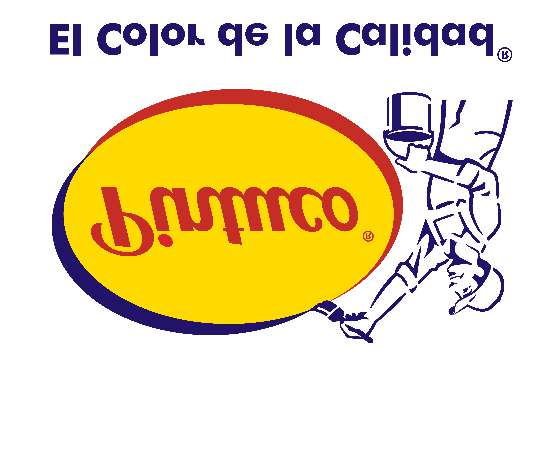

# Ficha de Datos de Seguridad - PQ CORROTEC PREMIUM 507 GRIS

## Metadatos

- Fabricante: Pintuco
- Archivo fuente: `FDS 79 - PQ CORROTEC PREMIUM 507 GRIS - PINTUCO - AKSONOBEL.pdf`
- Paginas: 17
- Secciones detectadas: 16 de 16
- Tablas extraidas: 18
- Imagenes extraidas: 18

## Tabla de secciones detectadas

| Seccion | Titulo normalizado | Paginas |
|---:|---|---:|
| 1 | Identificacion de la sustancia o la mezcla y de la sociedad o la empresa | 1-2 |
| 2 | Identificacion de los peligros | 2-3 |
| 3 | Composicion/informacion sobre los componentes | 3 |
| 4 | Primeros auxilios | 3-5 |
| 5 | Medidas de lucha contra incendios | 5 |
| 6 | Medidas en caso de vertido accidental | 5-6 |
| 7 | Manipulacion y almacenamiento | 6-7 |
| 8 | Controles de exposicion/proteccion individual | 7-8 |
| 9 | Propiedades fisicas y quimicas | 8-9 |
| 10 | Estabilidad y reactividad | 9-10 |
| 11 | Informacion toxicologica | 10-13 |
| 12 | Informacion ecologica | 13-14 |
| 13 | Consideraciones relativas a la eliminacion | 14-15 |
| 14 | Informacion relativa al transporte | 15 |
| 15 | Informacion reglamentaria | 15-16 |
| 16 | Otra informacion | 16-17 |

## Seccion 1: Identificacion de la sustancia o la mezcla y de la sociedad o la empresa

> Nota de trazabilidad: contenido extraido de la pagina 1 a la pagina 2 del PDF fuente `FDS 79 - PQ CORROTEC PREMIUM 507 GRIS - PINTUCO - AKSONOBEL.pdf`.

Usos pertinentes identificados de la sustancia o de la mezcla y usos desaconsejados
Dirección de e-mail de la persona responsable de esta FDS:PSRA.southamerica@akzonobel.com
SDS code:507 Usos identificadosUsos contraindicadosUso profesionalUso industrialUso por el consumidorTodos los demás usos
CISTEMA SURA Colombia al 018000 51 14 14, fuera de Colombia (0574) 444457824 horasTeléfono de emergencias (con horas de funcionamiento):
Uso del producto:Recubrimiento base disolvente para uso interior y exterior.
Datos sobre el proveedorCompañía Global de Pinturas S.A.S.Autopista Medellín Bogotá Km 37.Vía Belén Rionegro Km 1.054040 Rionegro - Antioquia - Colombia01 8000 111 247Medellín 604 325 2523www.pintuco.com
Fecha de emisión/Fecha de revisión:2-5-2024Fecha de la emisión anterior:No hay validación anteriorVersión:11/17

### Imagenes extraidas de esta seccion

#### Imagen `pintuco__fds-79-pq-corrotec-premium-507-gris-pintuco-aksonobel__p001_img01`



> Nota de trazabilidad: imagen `pintuco__fds-79-pq-corrotec-premium-507-gris-pintuco-aksonobel__p001_img01` extraida de la pagina 1, asociada a la Seccion 1 por proximidad espacial y metadatos de pagina. Tipo detectado: logo_encabezado. Hash SHA-256: aa67847621bf72bbec5bc0ccb89e861029dd7d8a566039a3293298d1b52d88d1.

**Texto OCR de la imagen:**

```text
El COjok qe ja Cajiqaq,
```

#### Imagen `pintuco__fds-79-pq-corrotec-premium-507-gris-pintuco-aksonobel__p001_img02`


> Nota de trazabilidad: imagen `pintuco__fds-79-pq-corrotec-premium-507-gris-pintuco-aksonobel__p001_img02` extraida de la pagina 1, asociada a la Seccion 1 por proximidad espacial y metadatos de pagina. Tipo detectado: imagen_embebida. Hash SHA-256: 76eb23532e2edf6329fab4f4ec563a9c8486cb2c32972b21a08e6d9a4d3991e2.

**Texto OCR de la imagen:**

```text
vKx0y0pe]
```


## Seccion 2: Identificacion de los peligros

> Nota de trazabilidad: contenido extraido de la pagina 2 a la pagina 3 del PDF fuente `FDS 79 - PQ CORROTEC PREMIUM 507 GRIS - PINTUCO - AKSONOBEL.pdf`.

Clasificación de la sustancia o de la mezcla:
Palabra de advertencia:PeligroIndicaciones de peligro:H226 - Líquidos y vapores inflamables.H315 - Provoca irritación cutánea.H317 - Puede provocar una reacción alérgica en la piel.H319 - Provoca irritación ocular grave.H334 - Puede provocar síntomas de alergia o asma o dificultades respiratorias en caso de inhalación.H340 - Puede provocar defectos genéticos.H350 - Puede provocar cáncer.H361 - Se sospecha que puede perjudicar la fertilidad o dañar el feto.H373 - Puede provocar daños en los órganos tras exposiciones prolongadas o repetidas. (sistema nervioso central (SNC))H412 - Nocivo para los organismos acuáticos, con efectos nocivos duraderos.
Pictogramas de peligro:
Consejos de prudenciaPrevención:P201 - Solicitar instrucciones especiales antes del uso.P280 - Usar guantes de protección, ropa de protección e equipo de protección para la cara o los ojos.P284 - Llevar equipo de protección respiratoria.P210 - Mantener alejado del calor, de superficies calientes, de chispas, de llamas abiertas y de cualquier otra fuente de ignición. No fumar.P273 - Evitar su liberación al medio ambiente.P260 - No respirar los vapores.P264 - Lavarse las manos concienzudamente tras la manipulación.Respuesta:P308 + P313 - EN CASO DE exposición manifiesta o presunta: Consultar a un médico.P304 + P340 - EN CASO DE INHALACIÓN: Transportar a la persona al aire libre y mantenerla en una posición que le facilite la respiración.P342 + P311 - En caso de síntomas respiratorios: Llamar a un CENTRO DE INFORMACIÓN TOXICOLÓGICA o a un médico.P362 + P364 - Quitar las prendas contaminadas y lavarlas antes de volver a usarlas.P302 + P352 - EN CASO DE CONTACTO CON LA PIEL: Lavar con abundante agua.P333 + P313 - En caso de irritación o erupción cutánea: Consultar a un médico.P305 + P351 + P338 - EN CASO DE CONTACTO CON LOS OJOS: Aclarar cuidadosamente con agua durante varios minutos. Quitar las lentes de contacto, si lleva y resulta fácil. Seguir aclarando.P337 + P313 - Si persiste la irritación ocular: Consultar a un médico.
Elementos de las etiquetas del SGA
General:P102 - Mantener fuera del alcance de los niños.P101 - Si se necesita consejo médico, tener a mano el envase o la etiqueta.
Fecha de emisión/Fecha de revisión:2-5-2024Fecha de la emisión anterior:No hay validación anteriorVersión:12/17

PQ CORROTEC PREMIUM 507 GRIS Sección 2. Identificación de los peligrosAlmacenamiento:P405 - Guardar bajo llave.P403 + P235 - Almacenar en un lugar bien ventilado. Mantener en lugar fresco.Eliminación:P501 - Eliminar el contenido / el recipiente en conformidad con las reglamentaciones locales y nacionales.Otros peligros que no conducen a una clasificación:No se conoce ninguno.

### Imagenes extraidas de esta seccion

#### Imagen `pintuco__fds-79-pq-corrotec-premium-507-gris-pintuco-aksonobel__p002_img01`


> Nota de trazabilidad: imagen `pintuco__fds-79-pq-corrotec-premium-507-gris-pintuco-aksonobel__p002_img01` extraida de la pagina 2, asociada a la Seccion 2 por proximidad espacial y metadatos de pagina. Tipo detectado: imagen_embebida. Hash SHA-256: 76eb23532e2edf6329fab4f4ec563a9c8486cb2c32972b21a08e6d9a4d3991e2.

**Texto OCR de la imagen:**

```text
vKx0y0pe]
```


## Seccion 3: Composicion/informacion sobre los componentes

> Nota de trazabilidad: contenido extraido de la pagina 3 del PDF fuente `FDS 79 - PQ CORROTEC PREMIUM 507 GRIS - PINTUCO - AKSONOBEL.pdf`.

Nombre del ingredienteConcentraciónNúmero de CAS
No hay ningún ingrediente adicional presente que, bajo el conocimiento actual del proveedor y en las concentraciones aplicables, sea clasificado como de riesgo para la salud o el medio ambiente y por lo tanto deban ser reportados en esta sección.
Otros medios de identificación:No disponible.Sustancia/preparado:
Los límites de exposición laboral, en caso de existir, figuran en la sección 8.
Mezcla
gasolina 86290-81-5≤5disolvente de Stoddard8052-41-3≤5ácidos grasos, aceite de resina61790-12-3≤5anhídrido ftalico85-44-9<3ligroína 8032-32-4≤1benceno 71-43-2<1bis(2-etilhexanoato) de cobalto136-52-7<0.3tetraóxido de bario y diboro13701-59-2<0.3
Enjuaguar los ojos inmediatamente con mucha agua, levantando de vez en cuando los párpados superior e inferior. Verificar si la víctima lleva lentes de contacto y en este caso, retirárselas. Continúe enjuagando por lo menos durante 10 minutos.Procurar atención médica.Transportar a la víctima al exterior y mantenerla en reposo en una posición confortable para respirar. Si se sospecha que los vapores continúan presentes, la persona encargada del rescate deberá usar una máscara adecuada o un aparato de respiración autónoma. Si no hay respiración, ésta es irregular u ocurre un paro respiratorio, el personal capacitado debe proporcionar respiración artificial u oxígeno. Puede ser peligroso para la persona que proporcione ayuda al dar respiración boca a boca. Procurar atención médica. En caso necesario, llamar a un centro de información toxicológica o a un médico. Si está inconsciente, coloque en posición de recuperación y consiga atención médica inmediatamente. Asegure una buena circulación de aire. Aflojar todo lo que pudiera estar apretado, como el cuello de una camisa, una corbata, un cinturón. En el caso de que existan molestias o síntomas, evite más exposición.

### Tablas extraidas de esta seccion

#### Tabla `pintuco__fds-79-pq-corrotec-premium-507-gris-pintuco-aksonobel__p003_tbl01`

|Nombre del ingrediente|Número de CAS|Concentración|
|---|---|---|
|gasolina<br>disolvente de Stoddard<br>ácidos grasos, aceite de resina<br>anhídrido ftalico<br>ligroína<br>benceno<br>bis(2-etilhexanoato) de cobalto<br>tetraóxido de bario y diboro|86290-81-5<br>8052-41-3<br>61790-12-3<br>85-44-9<br>8032-32-4<br>71-43-2<br>136-52-7<br>13701-59-2|≤5<br>≤5<br>≤5<br><3<br>≤1<br><1<br><0.3<br><0.3|

> Nota de trazabilidad: tabla `pintuco__fds-79-pq-corrotec-premium-507-gris-pintuco-aksonobel__p003_tbl01` extraida de la pagina 3, asociada a la Seccion 3 por proximidad espacial y metadatos de pagina.


## Seccion 4: Primeros auxilios

> Nota de trazabilidad: contenido extraido de la pagina 3 a la pagina 5 del PDF fuente `FDS 79 - PQ CORROTEC PREMIUM 507 GRIS - PINTUCO - AKSONOBEL.pdf`.

Fecha de emisión/Fecha de revisión:2-5-2024Fecha de la emisión anterior:No hay validación anteriorVersión:13/17

PQ CORROTEC PREMIUM 507 GRIS Sección 4. Primeros auxilios
Lave la boca con agua. Retirar las prótesis dentales si es posible. Si se ha ingerido material y la persona expuesta está consciente, suminístrele pequeñas cantidades de agua para beber. Deje de proporcionarle agua si la persona expuesta se encuentra mal ya que los vómitos pueden ser peligrosos. No inducir al vómito a menos que lo indique expresamente el personal médico. Si vomita, mantener la cabeza baja de manera que el vómito no entre en los pulmones. Procurar atención médica. No suministrar nada por vía oral a una persona inconsciente. Si está inconsciente, coloque en posición de recuperación y consiga atención médica inmediatamente. Asegure una buena circulación de aire. Aflojar todo lo que pudiera estar apretado, como el cuello de una camisa, una corbata, un cinturón.
Lavar con agua y jabón abundantes. Quítese la ropa y calzado contaminados.Lave bien la ropa contaminada con agua antes de quitársela, o use guantes.Continúe enjuagando por lo menos durante 10 minutos. Procurar atención médica.En el caso de que existan molestias o síntomas, evite más exposición. Lavar la ropa antes de volver a usarla. Limpiar completamente el calzado antes de volver a usarlo.Contacto con la piel
Ingestión:
:
Protección del personal de primeros auxilios:No se debe realizar ninguna acción que suponga un riesgo personal o sin formación adecuada. Si se sospecha que los vapores continúan presentes, la persona encargada del rescate deberá usar una máscara adecuada o un aparato de respiración autónoma. Puede ser peligroso para la persona que proporcione ayuda al dar respiración boca a boca. Lave bien la ropa contaminada con agua antes de quitársela, o use guantes.
Notas para el médico:Tratar sintomáticamente. Contactar un especialista en tratamientos de envenenamientos inmediatamente si se ha ingerido o inhalado una gran cantidad.Tratamientos específicos:Indicación de la necesidad de recibir atención médica inmediata y, en su caso, de tratamiento especialNo hay un tratamiento específico.
Síntomas/efectos más importantes, agudos o retardadosEfectos agudos potenciales para la saludPor inhalación:Puede provocar síntomas de alergia o asma o dificultades respiratorias en caso de inhalación.No se conocen efectos significativos o riesgos críticos.:IngestiónContacto con la piel:Provoca irritación cutánea. Puede provocar una reacción alérgica en la piel.Provoca irritación ocular grave.:Contacto con los ojos
Signos/síntomas de sobreexposición
Contacto con la piel
Ingestión
Por inhalaciónLos síntomas adversos pueden incluir los siguientes:Jadeos y dificultades para respirarasmareducción de peso fetalincremento de muertes fetalesmalformaciones esqueléticas
Los síntomas adversos pueden incluir los siguientes:reducción de peso fetalincremento de muertes fetalesmalformaciones esqueléticas
Los síntomas adversos pueden incluir los siguientes:irritaciónrojezreducción de peso fetalincremento de muertes fetalesmalformaciones esqueléticas:
:
:
Contacto con los ojos:Los síntomas adversos pueden incluir los siguientes:dolor o irritaciónlagrimeorojez
Fecha de emisión/Fecha de revisión:2-5-2024Fecha de la emisión anterior:No hay validación anteriorVersión:14/17

PQ CORROTEC PREMIUM 507 GRIS Sección 4. Primeros auxiliosVea la sección 11 para la Información Toxicológica

### Imagenes extraidas de esta seccion

#### Imagen `pintuco__fds-79-pq-corrotec-premium-507-gris-pintuco-aksonobel__p003_img01`


> Nota de trazabilidad: imagen `pintuco__fds-79-pq-corrotec-premium-507-gris-pintuco-aksonobel__p003_img01` extraida de la pagina 3, asociada a la Seccion 4 por proximidad espacial y metadatos de pagina. Tipo detectado: imagen_embebida. Hash SHA-256: 76eb23532e2edf6329fab4f4ec563a9c8486cb2c32972b21a08e6d9a4d3991e2.

**Texto OCR de la imagen:**

```text
vKx0y0pe]
```

#### Imagen `pintuco__fds-79-pq-corrotec-premium-507-gris-pintuco-aksonobel__p004_img01`


> Nota de trazabilidad: imagen `pintuco__fds-79-pq-corrotec-premium-507-gris-pintuco-aksonobel__p004_img01` extraida de la pagina 4, asociada a la Seccion 4 por proximidad espacial y metadatos de pagina. Tipo detectado: imagen_embebida. Hash SHA-256: 76eb23532e2edf6329fab4f4ec563a9c8486cb2c32972b21a08e6d9a4d3991e2.

**Texto OCR de la imagen:**

```text
vKx0y0pe]
```


## Seccion 5: Medidas de lucha contra incendios

> Nota de trazabilidad: contenido extraido de la pagina 5 del PDF fuente `FDS 79 - PQ CORROTEC PREMIUM 507 GRIS - PINTUCO - AKSONOBEL.pdf`.

En caso de incendio, aislar rápidamente la zona, evacuando a todas las personas de las proximidades del lugar del incidente. No se debe realizar ninguna acción que suponga un riesgo personal o sin formación adecuada. Desplazar los contenedores lejos del incendio si puede hacerse sin peligro. Use agua pulverizada para refrigerar los envases expuestos al fuego.
Productos de descomposición térmica peligrosos
Peligros específicos del producto químico
Los productos de descomposición pueden incluir los siguientes materiales:dióxido de carbonomonóxido de carbonocompuestos halogenadosóxido/óxidos metálico/metálicos
Líquidos y vapores inflamables. Los residuos líquidos que se filtran en el alcantarillado pueden causar un riesgo de incendio o de explosión. La presión puede aumentar y el contenedor puede explotar en caso de calentamiento o incendio, con el riesgo de producirse una explosión. Este material es nocivo para la vida acuática con efectos de larga duración. Se debe impedir que el agua de extinción de incendios contaminada con este material entre en vías de agua,drenajes o alcantarillados.
Los bomberos deben llevar equipo de protección apropiado y un equipo de respiración autónomo con una máscara facial completa que opere en modo de presión positiva.Equipo de protección especial para el personal de lucha contra incendios
Utilizar polvos químicos secos, CO₂, agua pulverizada (niebla de agua) o espuma.Medios de extinción
:
:
:
No usar chorro de agua.Medios de extinción apropiados:Medios de extinción no apropiados:
Medidas especiales que deben tomar los equipos de lucha contra incendios:

## Seccion 6: Medidas en caso de vertido accidental

> Nota de trazabilidad: contenido extraido de la pagina 5 a la pagina 6 del PDF fuente `FDS 79 - PQ CORROTEC PREMIUM 507 GRIS - PINTUCO - AKSONOBEL.pdf`.

Precauciones relativas al medio ambiente
Precauciones personales, equipo de protección y procedimientos de emergencia
:
:No se debe realizar ninguna acción que suponga un riesgo personal o sin formación adecuada. Evacuar los alrededores. No deje que entre el personal innecesario y sin protección. No toque o camine sobre el material derramado. Apagar todas las fuentes de ignición. Ni bengalas, ni humo, ni llamas en en el área de riesgo. Evite respirar vapor o neblina. Proporcione ventilación adecuada. Llevar un aparato de respiración apropiado cuando el sistema de ventilación sea inadecuado. Llevar puesto un equipo de protección individual adecuado.
Evitar la dispersión del material derramado, su contacto con el suelo, las vias fluviales, las tuberías de desagüe y las alcantarillas. Informar a las autoridades pertinentes si el producto ha causado contaminación medioambiental (alcantarillas,vias fluviales, suelo o aire). Material contaminante del agua. Puede ser dañino para el medio ambiente si es liberado en cantidades grandes.Métodos y material de contención y de limpieza
Para el personal que no forma parte de los servicios de emergenciaPara el personal de emergencia:Si se necesitan prendas especiales para gestionar el vertido, tomar en cuenta las informaciones recogidas en la Sección 8 en relación a los materiales adecuados y no adecuados. Consultar también la información mencionada en “Para el personal que no forma parte de los servicios de emergencia”.
Fecha de emisión/Fecha de revisión:2-5-2024Fecha de la emisión anterior:No hay validación anteriorVersión:15/17

PQ CORROTEC PREMIUM 507 GRIS Sección 6. Medidas en caso de vertido accidental
Detener la fuga si esto no presenta ningún riesgo. Retire los envases del área del derrame. Use herramientas a prueba de chispas y equipo a prueba de explosión.Aproximarse al vertido en el sentido del viento. Evite que se introduzca en alcantarillas, canales de agua, sótanos o áreas reducidas. Lave los vertidos hacia una planta de tratamiento de efluentes o proceda como se indica a continuación.Detener y recoger los derrames con materiales absorbentes no combustibles, como arena, tierra, vermiculita o tierra de diatomeas, y colocar el material en un envase para desecharlo de acuerdo con las normativas locales (ver Sección 13). Elimine por medio de un contratista autorizado para la eliminación. El material absorbente contaminado puede presentar el mismo riesgo que el producto derramado. Nota:Ver la Sección 1 para información sobre los contactos de emergencia y la Sección 13 para la eliminación de los residuos.
Gran derrame:
Detener la fuga si esto no presenta ningún riesgo. Retire los envases del área del derrame. Use herramientas a prueba de chispas y equipo a prueba de explosión.Diluir con agua y fregar si es soluble en agua. Alternativamente, o si es insoluble en agua, absorber con un material seco inerte y colocar en un contenedor de residuos adecuado. Elimine por medio de un contratista autorizado para la eliminación.Derrame pequeño:

## Seccion 7: Manipulacion y almacenamiento

> Nota de trazabilidad: contenido extraido de la pagina 6 a la pagina 7 del PDF fuente `FDS 79 - PQ CORROTEC PREMIUM 507 GRIS - PINTUCO - AKSONOBEL.pdf`.

Condiciones de almacenamiento seguro,incluidas posibles incompatibilidades
Deberá prohibirse comer, beber o fumar en los lugares donde se manipula,almacena o trata este producto. Los trabajadores deberan lavarse las manos y la cara antes de comer, beber o fumar. Retirar el equipo de protección y las ropas contaminadas antes de acceder a zonas donde se coma. Consultar también en la Sección 8 la información adicional sobre medidas higiénicas.Almacenar conforme a las normativas locales. Almacenar en un área separada y homologada. Almacenar en el contenedor original protegido de la luz directa del sol en un área seca, fresca y bien ventilada, separado de materiales incompatibles (ver Sección 10) y comida y bebida. Guardar bajo llave. Eliminar todas las fuentes de ignición. Manténgase alejado de los materiales oxidantes. Mantener el contenedor bien cerrado y sellado hasta el momento de usarlo. Los envases abiertos deben cerrarse perfectamente con cuidado y mantenerse en posición vertical para evitar derrames. No almacenar en contenedores sin etiquetar. Utilícese un envase de seguridad adecuado para evitar la contaminación del medio ambiente. Antes de manipularlo o utilizarlo vea en la sección 10 los materiales incompatibles.
:
:
Medidas de protección
Información relativa a higiene en el trabajo de forma general:
Usar un equipo de proteccion personal adecuado (Consultar Sección 8). Personas con un historial de problemas de sensibilización de la piel o asma, alergias o enfermedades respiratorias crónicas o recurrentes no deberían ser empleadas en cualquier proceso en el cual este producto es utilizado. Evítese la exposición -recábense instrucciones especiales antes del uso. Evite la exposición durante el embarazo. No manipular la sustancia antes de haber leído y comprendido todas las instrucciones de seguridad. No introducir en ojos en la piel o en la ropa. No respire los vapores o nieblas. No ingerir. Evitar su liberación al medio ambiente. Use sólo con ventilación adecuada. Llevar un aparato de respiración apropiado cuando el sistema de ventilación sea inadecuado. No entre en áreas de almacenamiento y espacios cerrados a menos que estén ventilados adecuadamente. Consérvese en su envase original o en uno alternativo aprobado fabricado en un material compatible, manteniéndose bien cerrado cuando no esté en uso. Mantener alejado del calor, chispas, llamas al descubierto, o de cualquier otra fuente de ignición. Use equipo eléctrico (de ventilación, iluminación y manipulación de materiales) a prueba de explosiones. Utilizar únicamente herramientas que no produzcan chispas. Tomar medidas de precaución contra la acumulación de cargas electrostáticas. Los envases vacíos retienen resíduos del producto y pueden ser peligrosos. No vuelva a usar el envase.
Fecha de emisión/Fecha de revisión:2-5-2024Fecha de la emisión anterior:No hay validación anteriorVersión:16/17

gasolinaACGIH TLV (Estados Unidos, 1/2022). TWA: 300 ppm 8 horas. TWA: 890 mg/m³ 8 horas. STEL: 500 ppm 15 minutos. STEL: 1480 mg/m³ 15 minutos.disolvente de StoddardACGIH TLV (Estados Unidos, 1/2022). TWA: 525 mg/m³ 8 horas. TWA: 100 ppm 8 horas.ácidos grasos, aceite de resinaACGIH TLV (Estados Unidos). TWA: 5 mg/m³ 8 horas. STEL: 10 mg/m³ 15 minutos.anhídrido ftalicoACGIH TLV (Estados Unidos, 1/2022).Absorbido a través de la piel.Sensibilizante por contacto con la piel.Sensibilizante si se inhala. TWA: 0.002 mg/m³ 8 horas. Forma:Inhalable fraction and vapor STEL: 0.005 mg/m³ 15 minutos. Forma:Inhalable fraction and vaporligroína ACGIH TLV (Estados Unidos). TWA: 300 ppm 8 horas.bencenoACGIH TLV (Estados Unidos, 1/2022).Absorbido a través de la piel. TWA: 0.5 ppm 8 horas. TWA: 1.6 mg/m³ 8 horas. STEL: 2.5 ppm 15 minutos. STEL: 8 mg/m³ 15 minutos.bis(2-etilhexanoato) de cobaltoACGIH TLV (Estados Unidos, 1/2022).[cobalt and inorganic compounds]Sensibilizante por contacto con la piel.Sensibilizante si se inhala. TWA: 0.02 mg/m³, (as Co) 8 horas.tetraóxido de bario y diboroACGIH TLV (Estados Unidos, 1/2022).[Barium and soluble compounds] TWA: 0.5 mg/m³, (as Ba) 8 horas.

## Seccion 8: Controles de exposicion/proteccion individual

> Nota de trazabilidad: contenido extraido de la pagina 7 a la pagina 8 del PDF fuente `FDS 79 - PQ CORROTEC PREMIUM 507 GRIS - PINTUCO - AKSONOBEL.pdf`.

Controles de exposición medioambiental:Se deben verificar las emisiones de los equipos de ventilación o de los procesos de trabajo para verificar que cumplen con los requisitos de la legislación de protección del medio ambiente. En algunos casos para reducir las emisiones hasta un nivel aceptable, será necesario usar depuradores de humo, filtros o modificar el diseño del equipo del proceso.
Controles técnicos apropiados:Use sólo con ventilación adecuada. Utilizar aislamientos de áreas de producción,sistemas de ventilación locales, u otros procedimientos de ingeniería para mantener la exposición del obrero a los contaminantes aerotransportados por debajo de todos los límites recomendados o estatutarios. Los controles de ingeniería también deben mantener el gas, vapor o polvo por debajo del menor límite de explosión.Utilizar equipo de ventilación anti-explosión.
Parámetros de control
Medidas de protección individual
Límites de exposición profesional
Fecha de emisión/Fecha de revisión:2-5-2024Fecha de la emisión anterior:No hay validación anteriorVersión:17/17

PQ CORROTEC PREMIUM 507 GRIS Sección 8. Controles de exposición/protección individual
Protección de las manos
Basándose en la evaluación de los riesgos y la exposición, seleccionar un respirador que satisfaga los estándares o certificaciones apropiados. Los respiradores deben usarse de conformidad con un programa de protección respiratoria para asegurar su adecuación, formación y otros aspectos del buen uso.Llevar un respirador conforme a la norma EN140 con filtro de tipo A/P2 o mejor. El lijado en seco, el cortado con llama y/o el soldado de películas secas de pintura producirá polvo y/o humos nocivos. Un lijado o matizado húmedos son preferibles si es posible. Si no puede evitarse la exposición por la ventilación de extracción debe usarse adecuado equipo de protección respiratoria.
Si una evaluación del riesgo indica que es necesario, se deben usar guantes químico-resistentes e impenetrables que cumplan con las normas aprobadas siempre que se manejen productos químicos. Tomando en consideración los parámetros especificados por el fabricante de los guantes, comprobar durante el uso que los guantes siguen conservando sus propiedades protectoras. Hay que observar que el tiempo de paso de cualquier material utilizado con guantes puede ser diferente para distintos fabricantes de guantes. En el caso de mezclas,consistentes en varias sustancias, no es posible estimar de manera exacta, el tiempo de protección que ofrecen los guantes.
Se debe usar un equipo protector ocular que cumpla con las normas aprobadas cuando una evaluación del riesgo indique que es necesario, a fin de evitar toda exposición a salpicaduras del líquido, lloviznas, gases o polvos. Si es posible el contacto, se debe utilizar la siguiente protección, salvo que la valoración indique un grado de protección más alto: gafas protectoras contra salpicaduras químicas.Protección de los ojos/la cara
Protección respiratoria:
:
:
Protección corporalAntes de utilizar este producto se debe seleccionar equipo protector personal para el cuerpo basándose en la tarea a ejecutar y los riesgos involucrados y debe ser aprobado por un especialista. Cuando haya riesgo de ignición a consecuencia de cargas electrostáticas, utilizar indumentaria de protección antiestática. Para ofrecer la máxima protección frente a descargas electrostáticas, la indumentaria debe incluir monos, botas y guantes con propiedades antiestáticas.:
Lave las manos, antebrazos y cara completamente después de manejar productos químicos, antes de comer, fumar y usar el lavabo y al final del período de trabajo.Usar las técnicas apropiadas para eliminar ropa contaminada. Las prendas de trabajo contaminadas no podrán sacarse del lugar de trabajo. Lavar las ropas contaminadas antes de volver a usarlas. Verifique que las estaciones de lavado de ojos y duchas de seguridad se encuentren cerca de las estaciones de trabajo.Medidas higiénicas:
Protección de la piel
Otro tipo de protección cutánea:Se deben elegir el calzado adecuado y cualquier otra medida de protección cutánea necesaria dependiendo de la tarea que se lleve a cabo y de los riesgos implicados.Tales medidas deben ser aprobadas por un especialista antes de proceder a la manipulación de este producto.

### Tablas extraidas de esta seccion

#### Tabla `pintuco__fds-79-pq-corrotec-premium-507-gris-pintuco-aksonobel__p007_tbl01`

|Límites de exposición profesional|Col2|
|---|---|
|**Nombre del ingrediente**|**Límites de exposición**|
|gasolina<br>disolvente de Stoddard<br>ácidos grasos, aceite de resina<br>anhídrido ftalico<br>ligroína<br>benceno<br>bis(2-etilhexanoato) de cobalto<br>tetraóxido de bario y diboro|**ACGIH TLV (Estados Unidos, 1/2022).**<br> TWA: 300 ppm 8 horas.<br> TWA: 890 mg/m³ 8 horas.<br> STEL: 500 ppm 15 minutos.<br> STEL: 1480 mg/m³ 15 minutos.<br>**ACGIH TLV (Estados Unidos, 1/2022).**<br> TWA: 525 mg/m³ 8 horas.<br> TWA: 100 ppm 8 horas.<br>**ACGIH TLV (Estados Unidos).**<br> TWA: 5 mg/m³ 8 horas.<br> STEL: 10 mg/m³ 15 minutos.<br>**ACGIH TLV (Estados Unidos, 1/2022).**<br>**Absorbido a través de la piel.**<br>**Sensibilizante por contacto con la piel.**<br>**Sensibilizante si se inhala.**<br> TWA: 0.002 mg/m³ 8 horas. Forma:<br>Inhalable fraction and vapor<br> STEL: 0.005 mg/m³ 15 minutos. Forma:<br>Inhalable fraction and vapor<br>**ACGIH TLV (Estados Unidos).**<br> TWA: 300 ppm 8 horas.<br>**ACGIH TLV (Estados Unidos, 1/2022).**<br>**Absorbido a través de la piel.**<br> TWA: 0.5 ppm 8 horas.<br> TWA: 1.6 mg/m³ 8 horas.<br> STEL: 2.5 ppm 15 minutos.<br> STEL: 8 mg/m³ 15 minutos.<br>**ACGIH TLV (Estados Unidos, 1/2022).**<br>**[cobalt and inorganic compounds]**<br>**Sensibilizante por contacto con la piel.**<br>**Sensibilizante si se inhala.**<br> TWA: 0.02 mg/m³, (as Co) 8 horas.<br>**ACGIH TLV (Estados Unidos, 1/2022).**<br>**[Barium and soluble compounds]**<br> TWA: 0.5 mg/m³, (as Ba) 8 horas.|

> Nota de trazabilidad: tabla `pintuco__fds-79-pq-corrotec-premium-507-gris-pintuco-aksonobel__p007_tbl01` extraida de la pagina 7, asociada a la Seccion 8 por proximidad espacial y metadatos de pagina.


### Imagenes extraidas de esta seccion

#### Imagen `pintuco__fds-79-pq-corrotec-premium-507-gris-pintuco-aksonobel__p005_img01`


> Nota de trazabilidad: imagen `pintuco__fds-79-pq-corrotec-premium-507-gris-pintuco-aksonobel__p005_img01` extraida de la pagina 5, asociada a la Seccion 8 por proximidad espacial y metadatos de pagina. Tipo detectado: imagen_embebida. Hash SHA-256: 76eb23532e2edf6329fab4f4ec563a9c8486cb2c32972b21a08e6d9a4d3991e2.

**Texto OCR de la imagen:**

```text
vKx0y0pe]
```

#### Imagen `pintuco__fds-79-pq-corrotec-premium-507-gris-pintuco-aksonobel__p007_img01`


> Nota de trazabilidad: imagen `pintuco__fds-79-pq-corrotec-premium-507-gris-pintuco-aksonobel__p007_img01` extraida de la pagina 7, asociada a la Seccion 8 por proximidad espacial y metadatos de pagina. Tipo detectado: imagen_embebida. Hash SHA-256: 76eb23532e2edf6329fab4f4ec563a9c8486cb2c32972b21a08e6d9a4d3991e2.

**Texto OCR de la imagen:**

```text
vKx0y0pe]
```


## Seccion 9: Propiedades fisicas y quimicas

> Nota de trazabilidad: contenido extraido de la pagina 8 a la pagina 9 del PDF fuente `FDS 79 - PQ CORROTEC PREMIUM 507 GRIS - PINTUCO - AKSONOBEL.pdf`.

Punto de fusión/punto de congelación
Líquido.
No disponible.Característico.OlorpH Gris.ColorNo disponible.No disponible.Umbral olfativo::::::
AspectoLas condiciones de medición de todas las propiedades son a temperatura y presión estándar a menos que se indique lo contrario.
Punto de ebullición, punto de ebullición inicial e intervalo de ebullición:100°C (212°F)Fecha de emisión/Fecha de revisión:2-5-2024Fecha de la emisión anterior:No hay validación anteriorVersión:18/17

PQ CORROTEC PREMIUM 507 GRIS Sección 9. Propiedades físicas y químicas y características de seguridad
Presión de vapor
Densidad de vapor relativaSolubilidad(es)
Tasa de evaporaciónNo disponible.
Temperatura de auto-inflamaciónNo aplicable.
ViscosidadCinemática (temperatura ambiente): 1349 mm2/s (1349 cSt)Cinemática (40°C (104°F)): 201 mm2/s (201 cSt)
Coeficiente de reparto: n-octanol/agua
:
:
::
:
:
Inflamabilidad:No disponible.
Temperatura de descomposición:No disponible.Características de las partículasTamaño de partícula medio:No aplicable.
SoporteResultadoagua fríaNo soluble [OECD (TG 105)]
Porcentaje de partículas con diámetro aerodinámico ≤ 10 μm:0
No disponible.
:Nombre del ingredientePresión de vapor a 20 ºCmm HgkPaMétodonafta disolvente (petróleo),fracción alifática intermedia1.5 a 4.50.2 a 0.6nafta disolvente (petróleo),fracción alifática intermedia1.5 a 4.50.2 a 0.6disolvente de Stoddard0.75 a 10.50.1 a 1.4
Punto de inflamación:Vaso cerrado: 46°C (114.8°F)Límite superior e inferior de explosividad:Intervalo más amplio conocido: Punto mínimo: 0.6% Punto maximo: 8% (disolvente de Stoddard)
Densidad:1.19 g/cm³
Nombre del ingrediente°C°Fdisolvente de Stoddard230 a 240446 a 464nafta disolvente (petróleo), fracción alifática intermedia>220>428nafta disolvente (petróleo), fracción alifática intermedia>220>428

### Tablas extraidas de esta seccion

#### Tabla `pintuco__fds-79-pq-corrotec-premium-507-gris-pintuco-aksonobel__p009_tbl01`

|Nombre del ingrediente|Presión de vapor a 20 ºC|Col3|Col4|
|---|---|---|---|
|**Nombre del ingrediente**|**mm Hg**|**kPa**|**Método**|
|nafta disolvente (petróleo),<br>fracción alifática intermedia<br>nafta disolvente (petróleo),<br>fracción alifática intermedia<br>disolvente de Stoddard|1.5 a 4.5<br>1.5 a 4.5<br>0.75 a 10.5|0.2 a 0.6<br>0.2 a 0.6<br>0.1 a 1.4||

> Nota de trazabilidad: tabla `pintuco__fds-79-pq-corrotec-premium-507-gris-pintuco-aksonobel__p009_tbl01` extraida de la pagina 9, asociada a la Seccion 9 por proximidad espacial y metadatos de pagina.

#### Tabla `pintuco__fds-79-pq-corrotec-premium-507-gris-pintuco-aksonobel__p009_tbl02`

|olubilidad(es) :|Col2|
|---|---|
|**Soporte**|**Resultado**|
|agua fría|No soluble [OECD (TG 105)]|

> Nota de trazabilidad: tabla `pintuco__fds-79-pq-corrotec-premium-507-gris-pintuco-aksonobel__p009_tbl02` extraida de la pagina 9, asociada a la Seccion 9 por proximidad espacial y metadatos de pagina.

#### Tabla `pintuco__fds-79-pq-corrotec-premium-507-gris-pintuco-aksonobel__p009_tbl03`

|Nombre del ingrediente<br>disolvente de Stoddard<br>nafta disolvente (petróleo), fracción alifática<br>intermedia<br>nafta disolvente (petróleo), fracción alifática<br>intermedia|°C<br>230 a 240<br>>220<br>>220|°F<br>446 a 464<br>>428<br>>428|
|---|---|---|

> Nota de trazabilidad: tabla `pintuco__fds-79-pq-corrotec-premium-507-gris-pintuco-aksonobel__p009_tbl03` extraida de la pagina 9, asociada a la Seccion 9 por proximidad espacial y metadatos de pagina.


### Imagenes extraidas de esta seccion

#### Imagen `pintuco__fds-79-pq-corrotec-premium-507-gris-pintuco-aksonobel__p008_img01`


> Nota de trazabilidad: imagen `pintuco__fds-79-pq-corrotec-premium-507-gris-pintuco-aksonobel__p008_img01` extraida de la pagina 8, asociada a la Seccion 9 por proximidad espacial y metadatos de pagina. Tipo detectado: imagen_embebida. Hash SHA-256: 76eb23532e2edf6329fab4f4ec563a9c8486cb2c32972b21a08e6d9a4d3991e2.

**Texto OCR de la imagen:**

```text
vKx0y0pe]
```


## Seccion 10: Estabilidad y reactividad

> Nota de trazabilidad: contenido extraido de la pagina 9 a la pagina 10 del PDF fuente `FDS 79 - PQ CORROTEC PREMIUM 507 GRIS - PINTUCO - AKSONOBEL.pdf`.

Reactividad:No hay datos de ensayo disponibles sobre la reactividad de este producto o sus componentes.
Fecha de emisión/Fecha de revisión:2-5-2024Fecha de la emisión anterior:No hay validación anteriorVersión:19/17

PQ CORROTEC PREMIUM 507 GRIS Sección 10. Estabilidad y reactividad
Productos de descomposición peligrosos
Condiciones que deben evitarseEvitar todas las fuentes posibles de ignición (chispa o llama). No someta a presión,corte, suelde, suelde con latón, taladre, esmerile o exponga los envases al calor o fuentes térmicas.
En condiciones normales de almacenamiento y uso, no se deberían formar productos de descomposición peligrosos.Reactivo o incompatible con los siguientes materiales:materiales oxidantes:
:Materiales incompatibles:

### Imagenes extraidas de esta seccion

#### Imagen `pintuco__fds-79-pq-corrotec-premium-507-gris-pintuco-aksonobel__p006_img01`


> Nota de trazabilidad: imagen `pintuco__fds-79-pq-corrotec-premium-507-gris-pintuco-aksonobel__p006_img01` extraida de la pagina 6, asociada a la Seccion 10 por proximidad espacial y metadatos de pagina. Tipo detectado: imagen_embebida. Hash SHA-256: 76eb23532e2edf6329fab4f4ec563a9c8486cb2c32972b21a08e6d9a4d3991e2.

**Texto OCR de la imagen:**

```text
vKx0y0pe]
```

#### Imagen `pintuco__fds-79-pq-corrotec-premium-507-gris-pintuco-aksonobel__p009_img01`


> Nota de trazabilidad: imagen `pintuco__fds-79-pq-corrotec-premium-507-gris-pintuco-aksonobel__p009_img01` extraida de la pagina 9, asociada a la Seccion 10 por proximidad espacial y metadatos de pagina. Tipo detectado: imagen_embebida. Hash SHA-256: 76eb23532e2edf6329fab4f4ec563a9c8486cb2c32972b21a08e6d9a4d3991e2.

**Texto OCR de la imagen:**

```text
vKx0y0pe]
```


## Seccion 11: Informacion toxicologica

> Nota de trazabilidad: contenido extraido de la pagina 10 a la pagina 13 del PDF fuente `FDS 79 - PQ CORROTEC PREMIUM 507 GRIS - PINTUCO - AKSONOBEL.pdf`.

Irritación/Corrosión
Información sobre los efectos toxicológicosgasolinaDL50 OralRata13.6 g/kg-ácidos grasos, aceite de resinaDL50 OralRata>10000 mg/kg-anhídrido ftalicoDL50 IntraperitonealCobaya100 mg/kg-DL50 OralRatón1500 mg/kg-DL50 OralRata1530 mg/kg-DL50 RectalRatón400 mg/kg-bis(ortofosfato) de tricincDL50 IntraperitonealRatón552 mg/kg-DL50 IntraperitonealRata551 mg/kg-ligroínaCL50 Por inhalación Gas.Rata3400 ppm4 horasDL50 IntravenosaRatón40 mg/kg-bencenoCL50 Por inhalación Gas.Rata10000 ppm7 horasDL50 CutáneaRatón48 mg/kg-DL50 IntraperitonealRatón340 mg/kg-DL50 IntraperitonealRata1100 µg/kg-DL50 OralRatón4700 mg/kg-DL50 OralRata1 mL/kg-DL50 OralRata930 mg/kg-DL50 OralRata1800 mg/kg-DL50 OralRata6400 mg/kg-bis(2-etilhexanoato) de cobaltoDL50 CutáneaConejo>5 g/kg-DL50 OralRata1.22 g/kg-tetraóxido de bario y diboroDL50 OralRatón640 mg/kg-DL50 OralRata3800 mg/kg-butanona-oximaDL50 CutáneaConejo200 uL/kg-DL50 IntraperitonealRatón200 mg/kg-DL50 OralRatón1 g/kg-DL50 OralRata930 mg/kg-DL50 SubcutáneaRatón2700 mg/kg-DL50 SubcutáneaRata2702 mg/kg-
Nombre del producto o ingredienteResultadoEspeciesDosisExposición
disolvente de StoddardOjos - Irritante moderadoConejo- 24 horas 500 mg-anhídrido ftalicoOjos - Irritante moderadoConejo- 24 horas 50 mg-bencenoOjos - Irritante moderadoConejo- 88 mg-Ojos - Muy irritanteConejo- 24 horas 2 mg-Piel - Irritante leveConejo- 24 horas 15 mg-
Nombre del producto o ingredienteResultadoPuntuaciónExposiciónObservaciónEspecies
Fecha de emisión/Fecha de revisión:2-5-2024Fecha de la emisión anterior:No hay validación anteriorVersión:110/17

PQ CORROTEC PREMIUM 507 GRIS Sección 11. Información toxicológica
CarcinogenicidadNo disponible.MutagénesisNo disponible.
TeratogenicidadNo disponible.Toxicidad para la reproducciónNo disponible.
SensibilizaciónNo disponible.
Información sobre posibles vías de exposiciónProvoca irritación ocular grave.:Contacto con los ojos
Toxicidad específica en determinados órganos (STOT) – exposición única
Toxicidad específica en determinados órganos (STOT) – exposición repetida
Peligro de aspiraciónNombreResultadonafta disolvente (petróleo), fracción alifática intermediaPELIGRO POR ASPIRACIÓN - Categoría 1nafta disolvente (petróleo), fracción alifática intermediaPELIGRO POR ASPIRACIÓN - Categoría 1gasolinaPELIGRO POR ASPIRACIÓN - Categoría 1disolvente de StoddardPELIGRO POR ASPIRACIÓN - Categoría 1ligroína PELIGRO POR ASPIRACIÓN - Categoría 1bencenoPELIGRO POR ASPIRACIÓN - Categoría 1:No disponible.Efectos agudos potenciales para la salud
Clasificaciónbenceno 1bis(2-etilhexanoato) de cobalto2BNombre del producto o ingredienteIARC
Piel - Irritante leveRata- 8 horas 60 Ul-Piel - Irritante moderadoConejo- 24 horas 20 mg-butanona-oximaOjos - Muy irritanteConejo- 100 Ul-
gasolinaCategoría 3- Efectos narcóticosanhídrido ftalicoCategoría 3- Irritación de las vías respiratoriasbutanona-oximaCategoría 1- tracto respiratorio superiorCategoría 3Efectos narcóticos
NombreCategoríaVía de exposiciónÓrganos destino
NombreCategoríanafta disolvente (petróleo), fracción alifática intermediaCategoría 1- sistema nervioso central (SNC)disolvente de StoddardCategoría 1inhalaciónsistema nervioso central (SNC)bencenoCategoría 1- -butanona-oximaCategoría 2- sistema sanguíneo
Vía de exposiciónÓrganos destino
Fecha de emisión/Fecha de revisión:2-5-2024Fecha de la emisión anterior:No hay validación anteriorVersión:111/17

PQ CORROTEC PREMIUM 507 GRIS Sección 11. Información toxicológica
No disponible.
Por inhalación:Puede provocar síntomas de alergia o asma o dificultades respiratorias en caso de inhalación.No se conocen efectos significativos o riesgos críticos.:IngestiónContacto con la piel:Provoca irritación cutánea. Puede provocar una reacción alérgica en la piel.
Puede provocar daños en los órganos tras exposiciones prolongadas o repetidas.Una vez producida la sensibilización, podría observarse una reacción alérgica grave al exponerse posteriormente a niveles muy bajos.General:Puede provocar cáncer. El riesgo de cáncer depende de la duración y el grado de exposición.Carcinogenicidad:Puede provocar defectos genéticos.Mutagénesis:
Síntomas relacionados con las características físicas, químicas y toxicológicas
Contacto con la piel
Ingestión
Por inhalaciónLos síntomas adversos pueden incluir los siguientes:Jadeos y dificultades para respirarasmareducción de peso fetalincremento de muertes fetalesmalformaciones esqueléticas
Los síntomas adversos pueden incluir los siguientes:reducción de peso fetalincremento de muertes fetalesmalformaciones esqueléticas
Los síntomas adversos pueden incluir los siguientes:irritaciónrojezreducción de peso fetalincremento de muertes fetalesmalformaciones esqueléticas:
:
:
Contacto con los ojos:Los síntomas adversos pueden incluir los siguientes:dolor o irritaciónlagrimeorojez
Efectos crónicos potenciales para la salud
Efectos retardados e inmediatos, así como efectos crónicos producidos por una exposición a corto y largo plazoPosibles efectos inmediatos:No disponible.Exposición a corto plazoPosibles efectos retardados:No disponible.Posibles efectos inmediatos:No disponible.Exposición a largo plazoPosibles efectos retardados:No disponible.
Toxicidad para la reproducción:Se sospecha que puede perjudicar la fertilidad o dañar el feto.Medidas numéricas de toxicidadEstimaciones de toxicidad agudaFecha de emisión/Fecha de revisión:2-5-2024Fecha de la emisión anterior:No hay validación anteriorVersión:112/17

PQ CORROTEC PREMIUM 507 GRIS Sección 11. Información toxicológicaNombre del producto o ingredienteProducto tal y como suministrado28990.714610.9N/A146.1N/Anafta disolvente (petróleo), fracción alifática intermediaN/A1100N/A11N/Agasolina13600N/AN/AN/AN/Aanhídrido ftalico500N/AN/AN/AN/Atetraóxido de bario y diboro100N/AN/AN/A1.5butanona-oxima1001100N/AN/AN/A
Oral (mg/kg)Cutánea (mg/kg)Inhalación (gases)(ppm)Inhalación (vapores)(mg/l)Inhalación (polvos y nieblas)(mg/l)

### Tablas extraidas de esta seccion

#### Tabla `pintuco__fds-79-pq-corrotec-premium-507-gris-pintuco-aksonobel__p010_tbl01`

|Toxicidad aguda|Col2|Col3|Col4|Col5|
|---|---|---|---|---|
|**Nombre del producto o**<br>**ingrediente**|**Resultado**|**Especies**|**Dosis**|**Exposición**|
|gasolina<br>ácidos grasos, aceite de<br>resina<br>anhídrido ftalico<br>bis(ortofosfato) de tricinc<br>ligroína<br>benceno<br>bis(2-etilhexanoato) de<br>cobalto<br>tetraóxido de bario y diboro<br>butanona-oxima|DL50 Oral<br>DL50 Oral<br>DL50 Intraperitoneal<br>DL50 Oral<br>DL50 Oral<br>DL50 Rectal<br>DL50 Intraperitoneal<br>DL50 Intraperitoneal<br>CL50 Por inhalación Gas.<br>DL50 Intravenosa<br>CL50 Por inhalación Gas.<br>DL50 Cutánea<br>DL50 Intraperitoneal<br>DL50 Intraperitoneal<br>DL50 Oral<br>DL50 Oral<br>DL50 Oral<br>DL50 Oral<br>DL50 Oral<br>DL50 Cutánea<br>DL50 Oral<br>DL50 Oral<br>DL50 Oral<br>DL50 Cutánea<br>DL50 Intraperitoneal<br>DL50 Oral<br>DL50 Oral<br>DL50 Subcutánea<br>DL50 Subcutánea|Rata<br>Rata<br>Cobaya<br>Ratón<br>Rata<br>Ratón<br>Ratón<br>Rata<br>Rata<br>Ratón<br>Rata<br>Ratón<br>Ratón<br>Rata<br>Ratón<br>Rata<br>Rata<br>Rata<br>Rata<br>Conejo<br>Rata<br>Ratón<br>Rata<br>Conejo<br>Ratón<br>Ratón<br>Rata<br>Ratón<br>Rata|13.6 g/kg<br>>10000 mg/kg<br>100 mg/kg<br>1500 mg/kg<br>1530 mg/kg<br>400 mg/kg<br>552 mg/kg<br>551 mg/kg<br>3400 ppm<br>40 mg/kg<br>10000 ppm<br>48 mg/kg<br>340 mg/kg<br>1100 µg/kg<br>4700 mg/kg<br>1 mL/kg<br>930 mg/kg<br>1800 mg/kg<br>6400 mg/kg<br>>5 g/kg<br>1.22 g/kg<br>640 mg/kg<br>3800 mg/kg<br>200 uL/kg<br>200 mg/kg<br>1 g/kg<br>930 mg/kg<br>2700 mg/kg<br>2702 mg/kg|-<br>-<br>-<br>-<br>-<br>-<br>-<br>-<br>4 horas<br>-<br>7 horas<br>-<br>-<br>-<br>-<br>-<br>-<br>-<br>-<br>-<br>-<br>-<br>-<br>-<br>-<br>-<br>-<br>-<br>-|

> Nota de trazabilidad: tabla `pintuco__fds-79-pq-corrotec-premium-507-gris-pintuco-aksonobel__p010_tbl01` extraida de la pagina 10, asociada a la Seccion 11 por proximidad espacial y metadatos de pagina.

#### Tabla `pintuco__fds-79-pq-corrotec-premium-507-gris-pintuco-aksonobel__p010_tbl02`

|Nombre del producto o Resultado Especies Puntuación Exposición Observación<br>ingrediente<br>disolvente de Stoddard Ojos - Irritante moderado Conejo - 24 horas 500 -<br>mg<br>anhídrido ftalico Ojos - Irritante moderado Conejo - 24 horas 50 -<br>mg<br>benceno Ojos - Irritante moderado Conejo - 88 mg -<br>Ojos - Muy irritante Conejo - 24 horas 2 -<br>mg<br>Piel - Irritante leve Conejo - 24 horas 15 -<br>mg|Nombre del producto o<br>ingrediente|Resultado|Especies|Puntuación|Exposición|Observación|
|---|---|---|---|---|---|---|
|**_Fecha de emisión/Fecha de revisión_**<br>**:**_ 2-5-2024_<br>**_Fecha de la emisión anterior_**<br>**_:_**_ No hay validación anterior_<br>**_Versión_**<br>**_:_**_ 1_<br>_10/17_|**_Fecha de emisión/Fecha de revisión_**<br>**:**_ 2-5-2024_<br>**_Fecha de la emisión anterior_**<br>**_:_**_ No hay validación anterior_<br>**_Versión_**<br>**_:_**_ 1_<br>_10/17_|**_Fecha de emisión/Fecha de revisión_**<br>**:**_ 2-5-2024_<br>**_Fecha de la emisión anterior_**<br>**_:_**_ No hay validación anterior_<br>**_Versión_**<br>**_:_**_ 1_<br>_10/17_|**_Fecha de emisión/Fecha de revisión_**<br>**:**_ 2-5-2024_<br>**_Fecha de la emisión anterior_**<br>**_:_**_ No hay validación anterior_<br>**_Versión_**<br>**_:_**_ 1_<br>_10/17_|**_Fecha de emisión/Fecha de revisión_**<br>**:**_ 2-5-2024_<br>**_Fecha de la emisión anterior_**<br>**_:_**_ No hay validación anterior_<br>**_Versión_**<br>**_:_**_ 1_<br>_10/17_|**_Fecha de emisión/Fecha de revisión_**<br>**:**_ 2-5-2024_<br>**_Fecha de la emisión anterior_**<br>**_:_**_ No hay validación anterior_<br>**_Versión_**<br>**_:_**_ 1_<br>_10/17_|**_Fecha de emisión/Fecha de revisión_**<br>**:**_ 2-5-2024_<br>**_Fecha de la emisión anterior_**<br>**_:_**_ No hay validación anterior_<br>**_Versión_**<br>**_:_**_ 1_<br>_10/17_|

> Nota de trazabilidad: tabla `pintuco__fds-79-pq-corrotec-premium-507-gris-pintuco-aksonobel__p010_tbl02` extraida de la pagina 10, asociada a la Seccion 11 por proximidad espacial y metadatos de pagina.

#### Tabla `pintuco__fds-79-pq-corrotec-premium-507-gris-pintuco-aksonobel__p011_tbl01`

|PQ CORROTEC PREMIUM 507 GRIS|Col2|Col3|Col4|Col5|Col6|Col7|
|---|---|---|---|---|---|---|
|**Sección 11. Información toxicológica**|**Sección 11. Información toxicológica**|**Sección 11. Información toxicológica**|**Sección 11. Información toxicológica**|**Sección 11. Información toxicológica**|**Sección 11. Información toxicológica**|**Sección 11. Información toxicológica**|
||butanona-oxima|Piel - Irritante leve<br>Piel - Irritante moderado<br>Ojos - Muy irritante|Rata<br>Conejo<br>Conejo|-<br>-<br>-|8 horas 60 Ul <br>24 horas 20<br>mg<br>100 Ul|-<br>-<br>-|

> Nota de trazabilidad: tabla `pintuco__fds-79-pq-corrotec-premium-507-gris-pintuco-aksonobel__p011_tbl01` extraida de la pagina 11, asociada a la Seccion 11 por proximidad espacial y metadatos de pagina.

#### Tabla `pintuco__fds-79-pq-corrotec-premium-507-gris-pintuco-aksonobel__p011_tbl02`

|Clasificación|Col2|
|---|---|
|**Nombre del producto o ingrediente**|**IARC**|
|benceno<br>bis(2-etilhexanoato) de cobalto|1<br>2B|

> Nota de trazabilidad: tabla `pintuco__fds-79-pq-corrotec-premium-507-gris-pintuco-aksonobel__p011_tbl02` extraida de la pagina 11, asociada a la Seccion 11 por proximidad espacial y metadatos de pagina.

#### Tabla `pintuco__fds-79-pq-corrotec-premium-507-gris-pintuco-aksonobel__p011_tbl03`

|Nombre|Categoría|Vía de<br>exposición|Órganos destino|
|---|---|---|---|
|gasolina<br>anhídrido ftalico<br>butanona-oxima|Categoría 3<br>Categoría 3<br>Categoría 1<br>Categoría 3|-<br>-<br>-|Efectos narcóticos<br>Irritación de las<br>vías respiratorias<br>tracto respiratorio<br>superior<br>Efectos narcóticos|

> Nota de trazabilidad: tabla `pintuco__fds-79-pq-corrotec-premium-507-gris-pintuco-aksonobel__p011_tbl03` extraida de la pagina 11, asociada a la Seccion 11 por proximidad espacial y metadatos de pagina.

#### Tabla `pintuco__fds-79-pq-corrotec-premium-507-gris-pintuco-aksonobel__p011_tbl04`

|Nombre|Categoría|Vía de<br>exposición|Órganos destino|
|---|---|---|---|
|nafta disolvente (petróleo), fracción alifática intermedia<br>disolvente de Stoddard<br>benceno<br>butanona-oxima|Categoría 1<br>Categoría 1<br>Categoría 1<br>Categoría 2|-<br>inhalación<br>-<br>-|sistema nervioso<br>central (SNC)<br>sistema nervioso<br>central (SNC)<br>-<br>sistema sanguíneo|

> Nota de trazabilidad: tabla `pintuco__fds-79-pq-corrotec-premium-507-gris-pintuco-aksonobel__p011_tbl04` extraida de la pagina 11, asociada a la Seccion 11 por proximidad espacial y metadatos de pagina.

#### Tabla `pintuco__fds-79-pq-corrotec-premium-507-gris-pintuco-aksonobel__p011_tbl05`

|Peligro de aspiración|Col2|
|---|---|
|**Nombre**|**Resultado**|
|nafta disolvente (petróleo), fracción alifática intermedia<br>nafta disolvente (petróleo), fracción alifática intermedia<br>gasolina<br>disolvente de Stoddard<br>ligroína<br>benceno|PELIGRO POR ASPIRACIÓN - Categoría 1<br>PELIGRO POR ASPIRACIÓN - Categoría 1<br>PELIGRO POR ASPIRACIÓN - Categoría 1<br>PELIGRO POR ASPIRACIÓN - Categoría 1<br>PELIGRO POR ASPIRACIÓN - Categoría 1<br>PELIGRO POR ASPIRACIÓN - Categoría 1|

> Nota de trazabilidad: tabla `pintuco__fds-79-pq-corrotec-premium-507-gris-pintuco-aksonobel__p011_tbl05` extraida de la pagina 11, asociada a la Seccion 11 por proximidad espacial y metadatos de pagina.

#### Tabla `pintuco__fds-79-pq-corrotec-premium-507-gris-pintuco-aksonobel__p013_tbl01`

|PQ CORROTEC PREMIUM 507 GRIS|Col2|Col3|Col4|Col5|Col6|Col7|
|---|---|---|---|---|---|---|
|**Sección 11. Información toxicológica**|**Sección 11. Información toxicológica**|**Sección 11. Información toxicológica**|**Sección 11. Información toxicológica**|**Sección 11. Información toxicológica**|**Sección 11. Información toxicológica**|**Sección 11. Información toxicológica**|
||**Nombre del producto o ingrediente**|**Oral (mg/**<br>**kg)**|**Cutánea**<br>**(mg/kg)**|**Inhalación**<br>**(gases)**<br>**(ppm)**|**Inhalación**<br>**(vapores)**<br>**(mg/l)**|**Inhalación**<br>**(polvos y**<br>**nieblas)**<br>**(mg/l)**|
||Producto tal y como suministrado<br>nafta disolvente (petróleo), fracción alifática<br>intermedia<br>gasolina<br>anhídrido ftalico<br>tetraóxido de bario y diboro<br>butanona-oxima|28990.7<br>N/A<br>13600<br>500<br>100<br>100|14610.9<br>1100<br>N/A<br>N/A<br>N/A<br>1100|N/A<br>N/A<br>N/A<br>N/A<br>N/A<br>N/A|146.1<br>11<br>N/A<br>N/A<br>N/A<br>N/A|N/A<br>N/A<br>N/A<br>N/A<br>1.5<br>N/A|

> Nota de trazabilidad: tabla `pintuco__fds-79-pq-corrotec-premium-507-gris-pintuco-aksonobel__p013_tbl01` extraida de la pagina 13, asociada a la Seccion 11 por proximidad espacial y metadatos de pagina.


### Imagenes extraidas de esta seccion

#### Imagen `pintuco__fds-79-pq-corrotec-premium-507-gris-pintuco-aksonobel__p010_img01`


> Nota de trazabilidad: imagen `pintuco__fds-79-pq-corrotec-premium-507-gris-pintuco-aksonobel__p010_img01` extraida de la pagina 10, asociada a la Seccion 11 por proximidad espacial y metadatos de pagina. Tipo detectado: imagen_embebida. Hash SHA-256: 76eb23532e2edf6329fab4f4ec563a9c8486cb2c32972b21a08e6d9a4d3991e2.

**Texto OCR de la imagen:**

```text
vKx0y0pe]
```

#### Imagen `pintuco__fds-79-pq-corrotec-premium-507-gris-pintuco-aksonobel__p011_img01`


> Nota de trazabilidad: imagen `pintuco__fds-79-pq-corrotec-premium-507-gris-pintuco-aksonobel__p011_img01` extraida de la pagina 11, asociada a la Seccion 11 por proximidad espacial y metadatos de pagina. Tipo detectado: imagen_embebida. Hash SHA-256: 76eb23532e2edf6329fab4f4ec563a9c8486cb2c32972b21a08e6d9a4d3991e2.

**Texto OCR de la imagen:**

```text
vKx0y0pe]
```

#### Imagen `pintuco__fds-79-pq-corrotec-premium-507-gris-pintuco-aksonobel__p012_img01`


> Nota de trazabilidad: imagen `pintuco__fds-79-pq-corrotec-premium-507-gris-pintuco-aksonobel__p012_img01` extraida de la pagina 12, asociada a la Seccion 11 por proximidad espacial y metadatos de pagina. Tipo detectado: imagen_embebida. Hash SHA-256: 76eb23532e2edf6329fab4f4ec563a9c8486cb2c32972b21a08e6d9a4d3991e2.

**Texto OCR de la imagen:**

```text
vKx0y0pe]
```


## Seccion 12: Informacion ecologica

> Nota de trazabilidad: contenido extraido de la pagina 13 a la pagina 14 del PDF fuente `FDS 79 - PQ CORROTEC PREMIUM 507 GRIS - PINTUCO - AKSONOBEL.pdf`.

Nombre del producto o ingredienteEspeciesResultadoExposición
Fecha de emisión/Fecha de revisión:2-5-2024Fecha de la emisión anterior:No hay validación anteriorVersión:113/17

PQ CORROTEC PREMIUM 507 GRIS Sección 12. Información ecológica
LogPow FBCPotencialPotencial de bioacumulación
Otros efectos adversos:No se conocen efectos significativos o riesgos críticos.
Nombre del producto o ingredientegasolina2 a 710 a 2500altadisolvente de Stoddard3.16 a 7.06- altaanhídrido ftalico1.6 3.4 bajobis(ortofosfato) de tricinc- 60960altaligroína- 10 a 2500altabenceno2.1311 bajobis(2-etilhexanoato) de cobalto- 15600altabutanona-oxima0.632.5 a 5.8bajo
Persistencia/degradabilidad
Coeficiente de partición tierra/agua (KOC) :No disponible.Movilidad en el suelo
No disponible.
marinaJuvenil (Nuevo, Cría, Destetado)Crónico NOEC 3.6 a 8.1 ul/L Agua marinaPescado - Morone saxatilis -Juvenil (Nuevo, Cría, Destetado)4 semanastetraóxido de bario y diboroAgudo EC50 20.3 ppm Agua frescaDafnia - Daphnia magna48 horasAgudo CL50 151 ppm Agua frescaPescado - Lepomis macrochirus96 horasAgudo CL50 62 ppm Agua frescaPescado - Oncorhynchus mykiss96 horasAgudo CL50 145 mg/l Agua frescaPescado - Rasbora heteromorpha96 horasbutanona-oximaAgudo CL50 843000 µg/l Agua frescaPescado - Pimephales promelas96 horas

### Tablas extraidas de esta seccion

#### Tabla `pintuco__fds-79-pq-corrotec-premium-507-gris-pintuco-aksonobel__p013_tbl02`

|Toxicidad|Col2|Col3|Col4|
|---|---|---|---|
|**Nombre del producto o**<br>**ingrediente**|**Resultado**|**Especies**|**Exposición**|
|anhídrido ftalico<br>Agudo EC50 4140 µg/l Agua fresca<br>Algas - Pseudokirchneriella<br>subcapitata<br>96 horas<br>Agudo EC50 78530 µg/l Agua fresca<br>Algas - Pseudokirchneriella<br>subcapitata<br>96 horas<br>Agudo EC50 147 µg/l Agua fresca<br>Algas - Pseudokirchneriella<br>subcapitata<br>96 horas<br>bis(ortofosfato) de tricinc<br>Agudo CL50 90 µg/l Agua fresca<br>Pescado - Oncorhynchus mykiss 96 horas<br>benceno<br>Agudo EC50 29000 µg/l Agua fresca<br>Algas - Pseudokirchneriella<br>subcapitata<br>72 horas<br>Agudo EC50 1600000 µg/l Agua fresca<br>Algas - Selenastrum sp.<br>96 horas<br>Agudo EC50 9.23 mg/l Agua fresca<br>Dafnia - Daphnia magna -<br>Neonato<br>48 horas<br>Agudo EC50 10 mg/l Agua fresca<br>Dafnia - Daphnia magna -<br>Neonato<br>48 horas<br>Agudo EC50 11.73 mg/l Agua fresca<br>Dafnia - Daphnia magna -<br>Neonato<br>48 horas<br>Agudo EC50 10 mg/l Agua fresca<br>Dafnia - Daphnia magna -<br>Neonato<br>48 horas<br>Agudo EC50 10000 µg/l Agua fresca<br>Dafnia - Daphnia magna -<br>Juvenil (Nuevo, Cría, Destetado)<br>48 horas<br>Agudo CL50 21 mg/l Agua marina<br>Crustáceos - Artemia salina<br>48 horas<br>Agudo CL50 42000 µg/l Agua fresca<br>Crustáceos - Gammarus pulex<br>48 horas<br>Agudo CL50 35 ppm Agua marina<br>Crustáceos - Palaemonetes<br>pugio - Adulto<br>48 horas<br>Agudo CL50 35000 µg/l Agua marina<br>Crustáceos - Palaemonetes<br>pugio<br>48 horas<br>Agudo CL50 33000 µg/l Agua marina<br>Crustáceos - Palaemonetes<br>pugio<br>48 horas<br>Agudo CL50 5.8 ul/L Agua marina<br>Pescado - Morone saxatilis -<br>Juvenil (Nuevo, Cría, Destetado)<br>96 horas<br>Agudo CL50 5.28 ul/L Agua fresca<br>Pescado - Oncorhynchus<br>gorbuscha - Alevín<br>96 horas<br>Agudo CL50 5900 µg/l Agua fresca<br>Pescado - Oncorhynchus mykiss 96 horas<br>Agudo CL50 5300 µg/l Agua fresca<br>Pescado - Oncorhynchus<br>mykiss - Juvenil (Nuevo, Cría,<br>Destetado)<br>96 horas<br>Agudo CL50 5.55 ul/L Agua marina<br>Pescado - Oncorhynchus nerka -<br>Smolt<br>96 horas<br>Crónico NOEC 98 mg/l Agua fresca<br>Dafnia - Daphnia magna<br>21 días<br>Crónico NOEC 98 mg/l Agua fresca<br>Dafnia - Daphnia magna<br>21 días<br>Crónico NOEC 1.5 a 5.4 ul/L Agua<br>Pescado - Morone saxatilis -<br>4 semanas|anhídrido ftalico<br>Agudo EC50 4140 µg/l Agua fresca<br>Algas - Pseudokirchneriella<br>subcapitata<br>96 horas<br>Agudo EC50 78530 µg/l Agua fresca<br>Algas - Pseudokirchneriella<br>subcapitata<br>96 horas<br>Agudo EC50 147 µg/l Agua fresca<br>Algas - Pseudokirchneriella<br>subcapitata<br>96 horas<br>bis(ortofosfato) de tricinc<br>Agudo CL50 90 µg/l Agua fresca<br>Pescado - Oncorhynchus mykiss 96 horas<br>benceno<br>Agudo EC50 29000 µg/l Agua fresca<br>Algas - Pseudokirchneriella<br>subcapitata<br>72 horas<br>Agudo EC50 1600000 µg/l Agua fresca<br>Algas - Selenastrum sp.<br>96 horas<br>Agudo EC50 9.23 mg/l Agua fresca<br>Dafnia - Daphnia magna -<br>Neonato<br>48 horas<br>Agudo EC50 10 mg/l Agua fresca<br>Dafnia - Daphnia magna -<br>Neonato<br>48 horas<br>Agudo EC50 11.73 mg/l Agua fresca<br>Dafnia - Daphnia magna -<br>Neonato<br>48 horas<br>Agudo EC50 10 mg/l Agua fresca<br>Dafnia - Daphnia magna -<br>Neonato<br>48 horas<br>Agudo EC50 10000 µg/l Agua fresca<br>Dafnia - Daphnia magna -<br>Juvenil (Nuevo, Cría, Destetado)<br>48 horas<br>Agudo CL50 21 mg/l Agua marina<br>Crustáceos - Artemia salina<br>48 horas<br>Agudo CL50 42000 µg/l Agua fresca<br>Crustáceos - Gammarus pulex<br>48 horas<br>Agudo CL50 35 ppm Agua marina<br>Crustáceos - Palaemonetes<br>pugio - Adulto<br>48 horas<br>Agudo CL50 35000 µg/l Agua marina<br>Crustáceos - Palaemonetes<br>pugio<br>48 horas<br>Agudo CL50 33000 µg/l Agua marina<br>Crustáceos - Palaemonetes<br>pugio<br>48 horas<br>Agudo CL50 5.8 ul/L Agua marina<br>Pescado - Morone saxatilis -<br>Juvenil (Nuevo, Cría, Destetado)<br>96 horas<br>Agudo CL50 5.28 ul/L Agua fresca<br>Pescado - Oncorhynchus<br>gorbuscha - Alevín<br>96 horas<br>Agudo CL50 5900 µg/l Agua fresca<br>Pescado - Oncorhynchus mykiss 96 horas<br>Agudo CL50 5300 µg/l Agua fresca<br>Pescado - Oncorhynchus<br>mykiss - Juvenil (Nuevo, Cría,<br>Destetado)<br>96 horas<br>Agudo CL50 5.55 ul/L Agua marina<br>Pescado - Oncorhynchus nerka -<br>Smolt<br>96 horas<br>Crónico NOEC 98 mg/l Agua fresca<br>Dafnia - Daphnia magna<br>21 días<br>Crónico NOEC 98 mg/l Agua fresca<br>Dafnia - Daphnia magna<br>21 días<br>Crónico NOEC 1.5 a 5.4 ul/L Agua<br>Pescado - Morone saxatilis -<br>4 semanas|anhídrido ftalico<br>Agudo EC50 4140 µg/l Agua fresca<br>Algas - Pseudokirchneriella<br>subcapitata<br>96 horas<br>Agudo EC50 78530 µg/l Agua fresca<br>Algas - Pseudokirchneriella<br>subcapitata<br>96 horas<br>Agudo EC50 147 µg/l Agua fresca<br>Algas - Pseudokirchneriella<br>subcapitata<br>96 horas<br>bis(ortofosfato) de tricinc<br>Agudo CL50 90 µg/l Agua fresca<br>Pescado - Oncorhynchus mykiss 96 horas<br>benceno<br>Agudo EC50 29000 µg/l Agua fresca<br>Algas - Pseudokirchneriella<br>subcapitata<br>72 horas<br>Agudo EC50 1600000 µg/l Agua fresca<br>Algas - Selenastrum sp.<br>96 horas<br>Agudo EC50 9.23 mg/l Agua fresca<br>Dafnia - Daphnia magna -<br>Neonato<br>48 horas<br>Agudo EC50 10 mg/l Agua fresca<br>Dafnia - Daphnia magna -<br>Neonato<br>48 horas<br>Agudo EC50 11.73 mg/l Agua fresca<br>Dafnia - Daphnia magna -<br>Neonato<br>48 horas<br>Agudo EC50 10 mg/l Agua fresca<br>Dafnia - Daphnia magna -<br>Neonato<br>48 horas<br>Agudo EC50 10000 µg/l Agua fresca<br>Dafnia - Daphnia magna -<br>Juvenil (Nuevo, Cría, Destetado)<br>48 horas<br>Agudo CL50 21 mg/l Agua marina<br>Crustáceos - Artemia salina<br>48 horas<br>Agudo CL50 42000 µg/l Agua fresca<br>Crustáceos - Gammarus pulex<br>48 horas<br>Agudo CL50 35 ppm Agua marina<br>Crustáceos - Palaemonetes<br>pugio - Adulto<br>48 horas<br>Agudo CL50 35000 µg/l Agua marina<br>Crustáceos - Palaemonetes<br>pugio<br>48 horas<br>Agudo CL50 33000 µg/l Agua marina<br>Crustáceos - Palaemonetes<br>pugio<br>48 horas<br>Agudo CL50 5.8 ul/L Agua marina<br>Pescado - Morone saxatilis -<br>Juvenil (Nuevo, Cría, Destetado)<br>96 horas<br>Agudo CL50 5.28 ul/L Agua fresca<br>Pescado - Oncorhynchus<br>gorbuscha - Alevín<br>96 horas<br>Agudo CL50 5900 µg/l Agua fresca<br>Pescado - Oncorhynchus mykiss 96 horas<br>Agudo CL50 5300 µg/l Agua fresca<br>Pescado - Oncorhynchus<br>mykiss - Juvenil (Nuevo, Cría,<br>Destetado)<br>96 horas<br>Agudo CL50 5.55 ul/L Agua marina<br>Pescado - Oncorhynchus nerka -<br>Smolt<br>96 horas<br>Crónico NOEC 98 mg/l Agua fresca<br>Dafnia - Daphnia magna<br>21 días<br>Crónico NOEC 98 mg/l Agua fresca<br>Dafnia - Daphnia magna<br>21 días<br>Crónico NOEC 1.5 a 5.4 ul/L Agua<br>Pescado - Morone saxatilis -<br>4 semanas|anhídrido ftalico<br>Agudo EC50 4140 µg/l Agua fresca<br>Algas - Pseudokirchneriella<br>subcapitata<br>96 horas<br>Agudo EC50 78530 µg/l Agua fresca<br>Algas - Pseudokirchneriella<br>subcapitata<br>96 horas<br>Agudo EC50 147 µg/l Agua fresca<br>Algas - Pseudokirchneriella<br>subcapitata<br>96 horas<br>bis(ortofosfato) de tricinc<br>Agudo CL50 90 µg/l Agua fresca<br>Pescado - Oncorhynchus mykiss 96 horas<br>benceno<br>Agudo EC50 29000 µg/l Agua fresca<br>Algas - Pseudokirchneriella<br>subcapitata<br>72 horas<br>Agudo EC50 1600000 µg/l Agua fresca<br>Algas - Selenastrum sp.<br>96 horas<br>Agudo EC50 9.23 mg/l Agua fresca<br>Dafnia - Daphnia magna -<br>Neonato<br>48 horas<br>Agudo EC50 10 mg/l Agua fresca<br>Dafnia - Daphnia magna -<br>Neonato<br>48 horas<br>Agudo EC50 11.73 mg/l Agua fresca<br>Dafnia - Daphnia magna -<br>Neonato<br>48 horas<br>Agudo EC50 10 mg/l Agua fresca<br>Dafnia - Daphnia magna -<br>Neonato<br>48 horas<br>Agudo EC50 10000 µg/l Agua fresca<br>Dafnia - Daphnia magna -<br>Juvenil (Nuevo, Cría, Destetado)<br>48 horas<br>Agudo CL50 21 mg/l Agua marina<br>Crustáceos - Artemia salina<br>48 horas<br>Agudo CL50 42000 µg/l Agua fresca<br>Crustáceos - Gammarus pulex<br>48 horas<br>Agudo CL50 35 ppm Agua marina<br>Crustáceos - Palaemonetes<br>pugio - Adulto<br>48 horas<br>Agudo CL50 35000 µg/l Agua marina<br>Crustáceos - Palaemonetes<br>pugio<br>48 horas<br>Agudo CL50 33000 µg/l Agua marina<br>Crustáceos - Palaemonetes<br>pugio<br>48 horas<br>Agudo CL50 5.8 ul/L Agua marina<br>Pescado - Morone saxatilis -<br>Juvenil (Nuevo, Cría, Destetado)<br>96 horas<br>Agudo CL50 5.28 ul/L Agua fresca<br>Pescado - Oncorhynchus<br>gorbuscha - Alevín<br>96 horas<br>Agudo CL50 5900 µg/l Agua fresca<br>Pescado - Oncorhynchus mykiss 96 horas<br>Agudo CL50 5300 µg/l Agua fresca<br>Pescado - Oncorhynchus<br>mykiss - Juvenil (Nuevo, Cría,<br>Destetado)<br>96 horas<br>Agudo CL50 5.55 ul/L Agua marina<br>Pescado - Oncorhynchus nerka -<br>Smolt<br>96 horas<br>Crónico NOEC 98 mg/l Agua fresca<br>Dafnia - Daphnia magna<br>21 días<br>Crónico NOEC 98 mg/l Agua fresca<br>Dafnia - Daphnia magna<br>21 días<br>Crónico NOEC 1.5 a 5.4 ul/L Agua<br>Pescado - Morone saxatilis -<br>4 semanas|
|**_Fecha de emisión/Fecha de revisión_**<br>**:**_ 2-5-2024_<br>**_Fecha de la emisión anterior_**<br>**_:_**_ No hay validación anterior_<br>**_Versión_**<br>**_:_**_ 1_<br>_13/17_|**_Fecha de emisión/Fecha de revisión_**<br>**:**_ 2-5-2024_<br>**_Fecha de la emisión anterior_**<br>**_:_**_ No hay validación anterior_<br>**_Versión_**<br>**_:_**_ 1_<br>_13/17_|**_Fecha de emisión/Fecha de revisión_**<br>**:**_ 2-5-2024_<br>**_Fecha de la emisión anterior_**<br>**_:_**_ No hay validación anterior_<br>**_Versión_**<br>**_:_**_ 1_<br>_13/17_|**_Fecha de emisión/Fecha de revisión_**<br>**:**_ 2-5-2024_<br>**_Fecha de la emisión anterior_**<br>**_:_**_ No hay validación anterior_<br>**_Versión_**<br>**_:_**_ 1_<br>_13/17_|

> Nota de trazabilidad: tabla `pintuco__fds-79-pq-corrotec-premium-507-gris-pintuco-aksonobel__p013_tbl02` extraida de la pagina 13, asociada a la Seccion 12 por proximidad espacial y metadatos de pagina.

#### Tabla `pintuco__fds-79-pq-corrotec-premium-507-gris-pintuco-aksonobel__p014_tbl01`

|PQ CORROTEC PREMIUM 507 GRIS|Col2|Col3|Col4|
|---|---|---|---|
|**Sección 12. Información ecológica**|**Sección 12. Información ecológica**|**Sección 12. Información ecológica**|**Sección 12. Información ecológica**|
|tetraóxido de bario y diboro<br>butanona-oxima|marina<br>Crónico NOEC 3.6 a 8.1 ul/L Agua<br>marina<br>Agudo EC50 20.3 ppm Agua fresca<br>Agudo CL50 151 ppm Agua fresca<br>Agudo CL50 62 ppm Agua fresca<br>Agudo CL50 145 mg/l Agua fresca<br>Agudo CL50 843000 µg/l Agua fresca|Juvenil (Nuevo, Cría, Destetado)<br>Pescado - Morone saxatilis -<br>Juvenil (Nuevo, Cría, Destetado)<br>Dafnia - Daphnia magna<br>Pescado - Lepomis macrochirus<br>Pescado - Oncorhynchus mykiss <br>Pescado - Rasbora<br>heteromorpha<br>Pescado - Pimephales promelas|4 semanas<br>48 horas<br>96 horas<br> 96 horas<br>96 horas<br> 96 horas|

> Nota de trazabilidad: tabla `pintuco__fds-79-pq-corrotec-premium-507-gris-pintuco-aksonobel__p014_tbl01` extraida de la pagina 14, asociada a la Seccion 12 por proximidad espacial y metadatos de pagina.

#### Tabla `pintuco__fds-79-pq-corrotec-premium-507-gris-pintuco-aksonobel__p014_tbl02`

|Nombre del producto o<br>ingrediente|LogP<br>ow|FBC|Potencial|
|---|---|---|---|
|gasolina<br>disolvente de Stoddard<br>anhídrido ftalico<br>bis(ortofosfato) de tricinc<br>ligroína<br>benceno<br>bis(2-etilhexanoato) de<br>cobalto<br>butanona-oxima|2 a 7<br>3.16 a 7.06<br>1.6<br>-<br>-<br>2.13<br>-<br>0.63|10 a 2500<br>-<br>3.4<br>60960<br>10 a 2500<br>11<br>15600<br>2.5 a 5.8|alta<br>alta<br>bajo<br>alta<br>alta<br>bajo<br>alta<br>bajo|

> Nota de trazabilidad: tabla `pintuco__fds-79-pq-corrotec-premium-507-gris-pintuco-aksonobel__p014_tbl02` extraida de la pagina 14, asociada a la Seccion 12 por proximidad espacial y metadatos de pagina.


### Imagenes extraidas de esta seccion

#### Imagen `pintuco__fds-79-pq-corrotec-premium-507-gris-pintuco-aksonobel__p013_img01`


> Nota de trazabilidad: imagen `pintuco__fds-79-pq-corrotec-premium-507-gris-pintuco-aksonobel__p013_img01` extraida de la pagina 13, asociada a la Seccion 12 por proximidad espacial y metadatos de pagina. Tipo detectado: imagen_embebida. Hash SHA-256: 76eb23532e2edf6329fab4f4ec563a9c8486cb2c32972b21a08e6d9a4d3991e2.

**Texto OCR de la imagen:**

```text
vKx0y0pe]
```


## Seccion 13: Consideraciones relativas a la eliminacion

> Nota de trazabilidad: contenido extraido de la pagina 14 a la pagina 15 del PDF fuente `FDS 79 - PQ CORROTEC PREMIUM 507 GRIS - PINTUCO - AKSONOBEL.pdf`.

:Métodos de eliminación
Fecha de emisión/Fecha de revisión:2-5-2024Fecha de la emisión anterior:No hay validación anteriorVersión:114/17

### Tablas extraidas de esta seccion

#### Tabla `pintuco__fds-79-pq-corrotec-premium-507-gris-pintuco-aksonobel__p015_tbl01`

|PQ CORROTEC PREMIUM 507 GRIS|Col2|Col3|Col4|
|---|---|---|---|
|**Sección 14. Información relativa al transporte**|**Sección 14. Información relativa al transporte**|**Sección 14. Información relativa al transporte**|**Sección 14. Información relativa al transporte**|
||**Carretera - UN**|**Marítimo - IMDG**|**Aéreo - IATA**|
|**Número ONU**|UN1263|UN1263|UN1263|
|**Designación**<br>**oficial de**<br>**transporte de las**<br>**Naciones Unidas**|PINTURAS|PINTURAS|PAINT|
|**Clase(s) de**<br>**peligro para el**<br>**transporte**|3|3|3|
|**Grupo de embalaje**|III|III|III|
|**Peligros para el**<br>**medio ambiente**|No.|No.|No.|

> Nota de trazabilidad: tabla `pintuco__fds-79-pq-corrotec-premium-507-gris-pintuco-aksonobel__p015_tbl01` extraida de la pagina 15, asociada a la Seccion 13 por proximidad espacial y metadatos de pagina.


### Imagenes extraidas de esta seccion

#### Imagen `pintuco__fds-79-pq-corrotec-premium-507-gris-pintuco-aksonobel__p014_img01`


> Nota de trazabilidad: imagen `pintuco__fds-79-pq-corrotec-premium-507-gris-pintuco-aksonobel__p014_img01` extraida de la pagina 14, asociada a la Seccion 13 por proximidad espacial y metadatos de pagina. Tipo detectado: imagen_embebida. Hash SHA-256: 76eb23532e2edf6329fab4f4ec563a9c8486cb2c32972b21a08e6d9a4d3991e2.

**Texto OCR de la imagen:**

```text
vKx0y0pe]
```


## Seccion 14: Informacion relativa al transporte

> Nota de trazabilidad: contenido extraido de la pagina 15 del PDF fuente `FDS 79 - PQ CORROTEC PREMIUM 507 GRIS - PINTUCO - AKSONOBEL.pdf`.

PINTURAS3III
PAINTUN1263
3III
UN1263UN1263Designación oficial de transporte de las Naciones UnidasClase(s) de peligro para el transporteGrupo de embalajePeligros para el medio ambiente
Precauciones particulares para los usuarios
No. No.
Transporte dentro de las premisas de usuarios: siempre transporte en recipientes cerrados que estén verticales y seguros. Asegurar que las personas que transportan el producto conocen qué hacer en caso de un accidente o derrame.:
No.Programas de emergencia F-E, _S-E_Excepción de líquido viscoso Este líquido viscoso de clase 3 no está sujeto a regulación en embalajes de hasta 450 l según 2.3.2.5.Información adicionalIMDG:
Transporte a granel según los instrumentos de la IMO:No disponible.
Carretera - UNMarítimo - IMDGAéreo - IATA

## Seccion 15: Informacion reglamentaria

> Nota de trazabilidad: contenido extraido de la pagina 15 a la pagina 16 del PDF fuente `FDS 79 - PQ CORROTEC PREMIUM 507 GRIS - PINTUCO - AKSONOBEL.pdf`.

Lista de inventario
Tailandia:No determinado.Vietnam:No determinado.
Unión Económica Euroasiática:Inventario de la Federación Rusa: No determinado.
Fecha de emisión/Fecha de revisión:2-5-2024Fecha de la emisión anterior:No hay validación anteriorVersión:115/17

PQ CORROTEC PREMIUM 507 GRIS Sección 15. Información reglamentariaRegulaciones Nacionales: El receptor debería verificar la posible existencia de regulaciones locales aplicables al producto químico.Decreto 1496 del 2018 Por el cual se adopta el Sistema Globalmente Armonizado de Clasificación y Etiquetado de Productos Químicos y se dictan otras disposiciones en materia de seguridad química.Decreto 0773 del 2021 Por la cual se definen las acciones que deben desarrollar los empleadores para la aplicación del Sistema Globalmente Armonizado (SGA) de Clasificación y Etiquetado de Productos Químicos en los lugares de trabajo y se dictan otras disposiciones en materia de seguridad química.

### Imagenes extraidas de esta seccion

#### Imagen `pintuco__fds-79-pq-corrotec-premium-507-gris-pintuco-aksonobel__p015_img01`


> Nota de trazabilidad: imagen `pintuco__fds-79-pq-corrotec-premium-507-gris-pintuco-aksonobel__p015_img01` extraida de la pagina 15, asociada a la Seccion 15 por proximidad espacial y metadatos de pagina. Tipo detectado: imagen_embebida. Hash SHA-256: 76eb23532e2edf6329fab4f4ec563a9c8486cb2c32972b21a08e6d9a4d3991e2.

**Texto OCR de la imagen:**

```text
vKx0y0pe]
```


## Seccion 16: Otra informacion

> Nota de trazabilidad: contenido extraido de la pagina 16 a la pagina 17 del PDF fuente `FDS 79 - PQ CORROTEC PREMIUM 507 GRIS - PINTUCO - AKSONOBEL.pdf`.

Aviso al lectorIndica la información que ha cambiado desde la edición de la versión anterior.
Clave para las abreviaciones:
Procedimiento utilizado para obtener la clasificaciónClasificaciónJustificaciónLÍQUIDOS INFLAMABLES - Categoría 3En base a datos de ensayosIRRITACIÓN CUTÁNEA - Categoría 2Método de cálculoIRRITACIÓN OCULAR - Categoría 2AMétodo de cálculoSENSIBILIZACIÓN RESPIRATORIA - Categoría 1Método de cálculoSENSIBILIZACIÓN CUTÁNEA - Categoría 1Método de cálculoMUTAGENICIDAD EN CÉLULAS GERMINALES - Categoría 1BMétodo de cálculoCARCINOGENICIDAD - Categoría 1AMétodo de cálculoTOXICIDAD PARA LA REPRODUCCIÓN - Categoría 2Método de cálculoTOXICIDAD ESPECÍFICA EN DETERMINADOS ÓRGANOS (STOT) -EXPOSICIONES REPETIDAS - Categoría 2Método de cálculoPELIGRO ACUÁTICO A CORTO PLAZO (AGUDO) - Categoría 3Método de cálculoPELIGRO ACUÁTICO A LARGO PLAZO (CRÓNICO) - Categoría 3Método de cálculo
ETA = Estimación de Toxicidad AgudaFBC = Factor de BioconcentraciónSGA - Sistema Globalmente Armonizado de clasificación y etiquetado de productos químicosIATA = Asociación de Transporte Aéreo InternacionalIBC = Contenedor Intermedio para Productos a GranelIMDG = Código Marítimo Internacional de Mercancías PeligrosasLog Kow = logaritmo del coeficiente de reparto octanol/aguaMARPOL = Convenio Internacional para Prevenir la Contaminación por los Buques,1973 con el Protocolo de 1978. ("Marpol" = polución marina)N/A = No disponibleSGG = Grupo de segregaciónONU = Organización de las Naciones Unidas
Unique ID:4E8F22E7220C1EEF828C00037AB8833F Versión:1
6-5-2024Fecha de impresiónFecha de emisión/ Fecha de revisiónFecha de la emisión anterior:::2-5-2024No hay validación anterior
PARA USO PROFESIONAL SOLAMENTENOTA IMPORTANTE: La información en esta hoja de datos no pretende ser exhaustiva y está basada en el estado actual de nuestro conocimiento y en las leyes vigentes : cualquier persona usando el producto para cualquier otro propósito que el especificamente recomendado en la hoja técnica de datos, sin primero obtener nuestra confirmación escrita de la idoneidad para el propósito pretendido, lo hará bajo su propia cuenta y riesgo. Es siempre responsabilidad del usuario seguir todos los pasos necesarios para cumplir toda la serie de demandas de las leyes locales y la legislación. Siempre lea la hoja de datos de seguridad y la hoja técnica de datos para este producto, si están disponibles. Todo consejo que demos o cualquier declaración hecha por nosotros acerca del producto (tanto en esta hoja técnica o en otro lugar distinto) es correcto según nuestro mejor conocimiento pero nosotros no tenemos control sobre la calidad o el estado del substrato ni de los muchos factores que afectan al uso y aplicación del Fecha de emisión/Fecha de revisión:2-5-2024Fecha de la emisión anterior:No hay validación anteriorVersión:116/17

PQ CORROTEC PREMIUM 507 GRIS Sección 16. Otra informaciónproducto. Por consiguiente, a menos que especificamente lo acordemos por escrito de otro modo, no aceptamos ninguna responsabilidad en todo lo que sea relacionado con las prestaciones técnicas del producto o por cualquier pérdida o daño emanado del uso del producto. Todos los productos suministrados y los consejos técnicos dados están sujetos a nuestros plazos de tiempo normales y condiciones de venta. Debería solicitar una copia de este documento y revisarlo cuidadosamente. La información contenida en esta hoja técnica está sujeta a modificación de cuando en cuando a las luces de la experencia y de nuestra política de continuo desarrollo. Es responsabilidad del usuario verificar que esta hoja técnica es la actual antes de usar el producto.Las marcas de fábrica mencionadas en esta hoja técnica son marcas registradas o licenciatarias de Akzo Nobel.
Fecha de emisión/Fecha de revisión:2-5-2024Fecha de la emisión anterior:No hay validación anteriorVersión:117/17

### Tablas extraidas de esta seccion

#### Tabla `pintuco__fds-79-pq-corrotec-premium-507-gris-pintuco-aksonobel__p016_tbl01`

|Procedimiento utilizado para obtener la clasificación|Col2|
|---|---|
|**Clasificación**|**Justificación**|
|LÍQUIDOS INFLAMABLES - Categoría 3<br>IRRITACIÓN CUTÁNEA - Categoría 2<br>IRRITACIÓN OCULAR - Categoría 2A<br>SENSIBILIZACIÓN RESPIRATORIA - Categoría 1<br>SENSIBILIZACIÓN CUTÁNEA - Categoría 1<br>MUTAGENICIDAD EN CÉLULAS GERMINALES - Categoría 1B<br>CARCINOGENICIDAD - Categoría 1A<br>TOXICIDAD PARA LA REPRODUCCIÓN - Categoría 2<br>TOXICIDAD ESPECÍFICA EN DETERMINADOS ÓRGANOS (STOT) -<br>EXPOSICIONES REPETIDAS - Categoría 2<br>PELIGRO ACUÁTICO A CORTO PLAZO (AGUDO) - Categoría 3<br>PELIGRO ACUÁTICO A LARGO PLAZO (CRÓNICO) - Categoría 3|En base a datos de ensayos<br>Método de cálculo<br>Método de cálculo<br>Método de cálculo<br>Método de cálculo<br>Método de cálculo<br>Método de cálculo<br>Método de cálculo<br>Método de cálculo<br>Método de cálculo<br>Método de cálculo|

> Nota de trazabilidad: tabla `pintuco__fds-79-pq-corrotec-premium-507-gris-pintuco-aksonobel__p016_tbl01` extraida de la pagina 16, asociada a la Seccion 16 por proximidad espacial y metadatos de pagina.


### Imagenes extraidas de esta seccion

#### Imagen `pintuco__fds-79-pq-corrotec-premium-507-gris-pintuco-aksonobel__p016_img01`


> Nota de trazabilidad: imagen `pintuco__fds-79-pq-corrotec-premium-507-gris-pintuco-aksonobel__p016_img01` extraida de la pagina 16, asociada a la Seccion 16 por proximidad espacial y metadatos de pagina. Tipo detectado: imagen_embebida. Hash SHA-256: 76eb23532e2edf6329fab4f4ec563a9c8486cb2c32972b21a08e6d9a4d3991e2.

**Texto OCR de la imagen:**

```text
vKx0y0pe]
```

#### Imagen `pintuco__fds-79-pq-corrotec-premium-507-gris-pintuco-aksonobel__p017_img01`


> Nota de trazabilidad: imagen `pintuco__fds-79-pq-corrotec-premium-507-gris-pintuco-aksonobel__p017_img01` extraida de la pagina 17, asociada a la Seccion 16 por proximidad espacial y metadatos de pagina. Tipo detectado: imagen_embebida. Hash SHA-256: 76eb23532e2edf6329fab4f4ec563a9c8486cb2c32972b21a08e6d9a4d3991e2.

**Texto OCR de la imagen:**

```text
vKx0y0pe]
```
