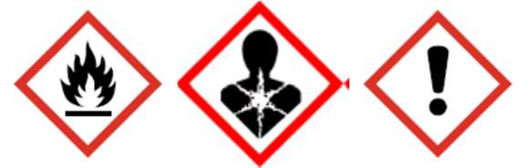
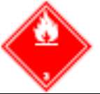

# Ficha de Datos de Seguridad - Esmalte Alquídico Serie 31

## Metadatos

- Fabricante: SIKA
- Archivo fuente: `FDS 20 - Esmalte Alquídico Serie 31.pdf`
- Paginas: 10
- Secciones detectadas: 16 de 16
- Tablas extraidas: 2
- Imagenes extraidas: 6

## Tabla de secciones detectadas

| Seccion | Titulo normalizado | Paginas |
|---:|---|---:|
| 1 | Identificacion de la sustancia o la mezcla y de la sociedad o la empresa | 1 |
| 2 | Identificacion de los peligros | 1-3 |
| 3 | Composicion/informacion sobre los componentes | 3 |
| 4 | Primeros auxilios | 3-4 |
| 5 | Medidas de lucha contra incendios | 4 |
| 6 | Medidas en caso de vertido accidental | 4-5 |
| 7 | Manipulacion y almacenamiento | 5 |
| 8 | Controles de exposicion/proteccion individual | 5-7 |
| 9 | Propiedades fisicas y quimicas | 7 |
| 10 | Estabilidad y reactividad | 7-8 |
| 11 | Informacion toxicologica | 8 |
| 12 | Informacion ecologica | 8 |
| 13 | Consideraciones relativas a la eliminacion | 8-9 |
| 14 | Informacion relativa al transporte | 9 |
| 15 | Informacion reglamentaria | 9 |
| 16 | Otra informacion | 9-10 |

## Seccion 1: Identificacion de la sustancia o la mezcla y de la sociedad o la empresa

> Nota de trazabilidad: contenido extraido de la pagina 1 del PDF fuente `FDS 20 - Esmalte Alquídico Serie 31.pdf`.

1.1 Identificación del producto

Nombre del producto: Esmalte Alquídico Serie 31
Código: 5885

1.2 Usos pertinentes identificados de la sustancia o de la mezcla y usos desaconsejados

Uso del producto:
- Recubrimiento para superficies metálicas.

1.3 Datos del proveedor de la ficha de datos de seguridad
Fabricante/ Distribuidor: Sika Colombia S.A.S.
Vereda Canavita km 20.5 Autopista Norte
Tocancipá, Cundinamarca
Colombia
col.sika.com
Número de Teléfono: (+571) 878 – 6333
Número de Fax: (+571) 878 – 6666
Dirección de email del responsable: controlcalidad.lab@co.sika.com
de esta FDS

1.4 En caso de emergencia: CISPROQUIM
Bogotá: 2886012 / 2886355
Resto del país: 01 8000 916012

### Imagenes extraidas de esta seccion

#### Imagen `sika__fds-20-esmalte-alquidico-serie-31__p001_img01`


> Nota de trazabilidad: imagen `sika__fds-20-esmalte-alquidico-serie-31__p001_img01` extraida de la pagina 1, asociada a la Seccion 1 por proximidad espacial y metadatos de pagina. Tipo detectado: logo_encabezado. Hash SHA-256: 739691a3d04128d931c2cd9f8e09de8d9fea2818f6c0898d5db4b32dbad3b1f3.

**Texto OCR de la imagen:**

```text
BUILDING TRUST
```


## Seccion 2: Identificacion de los peligros

> Nota de trazabilidad: contenido extraido de la pagina 1 a la pagina 3 del PDF fuente `FDS 20 - Esmalte Alquídico Serie 31.pdf`.

2.1 Clasificación de la sustancia o de la mezcla
Clasificación SGA
Líquidos inflamables: Categoría 2

Corrosión o irritación cutáneas: Categoría 2

Lesiones o irritación ocular
graves: Categoría 2A

Toxicidad específica en determinados
órganos – exposición única: Categoría 3 (Sistema respiratorio)

Toxicidad específica en determinados
órganos – exposiciones repetidas
(Inhalación): Categoría 1 (Sistema nervioso central)

Toxicidad específica en determinados
órganos – exposiciones repetidas
(Inhalación): Categoría 2 (órganos auditivos)

Peligro de aspiración: Categoría 1

Toxicidad acuática crónica: Categoría 3

2.2 Elementos de la etiqueta
Pictogramas de peligro:

Palabra de advertencia: Peligro

Indicaciones de peligro: H225 Líquidos y vapores muy inflamables.
H304 Puede ser mortal en caso de ingestión y penetración en las vías respiratorias.
H315 Causa irritación en la piel.
H319 Causa irritación ocular seria.
H335 Puede irritar las vías respiratorias.
H372 Perjudica a determinados órganos (Sistema nervioso central) por exposición
prolongada o repetida.
H373 Puede provocar daños en los órganos (hearing organs) tras exposiciones prolongadas
o repetidas si se inhala.
H412 Nocivo para los organismos acuáticos, con efectos nocivos duraderos.
Consejos de prudencia Prevención
P210: Mantener alejado de fuentes de calor, chispas, llama abierta o superficies calientes-
No fumar.
P233: Mantener el recipiente herméticamente cerrado.
P240: Conectar a tierra/enlace equipotencial del recipiente y del equipo de recepción.
P241: Utilizar un material eléctrico, de ventilación o de iluminación/ antideflagrante.
P242: Utilizar únicamente herramientas que no produzcan chispas.
P243: Tomar medidas de precaución contra descargas electrostáticas.
P264: Lavar la piel concienzudamente tras la manipulación.
P270 No comer, beber ni fumar durante su utilización.
P271 Utilizar únicamente en exteriores o en un lugar bien ventilado.
P273 Evitar su liberación al medio ambiente.
P280: Llevar guantes/prendas/gafas/máscara de protección.
Respuesta
P301 + P310 – EN CASO DE INGESTIÓN: Llamar inmediatamente a un CENTRO DE
INFORMACIÓN TOXICOLÓGICA o a un médico.
P303 + P361 + P353 – EN CASO DE CONTACTO CON LA PIEL (o el pelo): Quitarse
inmediatamente las prendas contaminadas. Aclararse la piel con agua o ducharse.
P304 + P340 + P312 EN CASO DE INHALACIÓN: Transportar a la persona al aire libre y
mantenerla en una posición que le facilite la respiración. Llamar a un CENTRO DE
TOXICOLOGĺA o a un médico si la persona se encuentra mal. P305 + P351 + P338 – EN CASO
DE CONTACTO CON LOS OJOS: Aclarar cuidadosamente con agua durante varios minutos.
Quitar las lentes de contacto, si lleva y resulta fácil. Seguir aclarando.
P305 + P351 + P338 EN CASO DE CONTACTO CON LOS OJOS: Aclarar cuidadosamente con
agua durante varios minutos.
Quitar las lentes de contacto, si lleva y resulta fácil. Seguir aclarando.
P314 Consultar a un médico en caso de malestar.
P331 No inducir al vómito.
P332 + P313 – Si ocurre la irritación: Consultar a un médico.
P337 + P313 – Si persiste la irritación ocular: Consultar a un médico.
P362 Retirar la ropa contaminada y lavarla antes de usarla nuevamente.
P370 + P378 – En caso de incendio: Utilizar … para apagarlo.

Almacenamiento
P403 + P233 Almacenar en un lugar bien ventilado. Mantener el recipiente cerrado
herméticamente.
P403 + P235 – Almacenar en un lugar bien ventilado. Mantener en lugar fresco.
P405 Guardar bajo llave
Eliminación
P501 Eliminar el contenido/ el recipiente en una planta de eliminación de residuos
autorizada.

2.3 Ingredientes peligrosos: No se conoce ninguno

### Imagenes extraidas de esta seccion

#### Imagen `sika__fds-20-esmalte-alquidico-serie-31__p002_img01`



> Nota de trazabilidad: imagen `sika__fds-20-esmalte-alquidico-serie-31__p002_img01` extraida de la pagina 2, asociada a la Seccion 2 por proximidad espacial y metadatos de pagina. Tipo detectado: imagen_embebida. Hash SHA-256: aab17e69fd1ee290b2b398e76e76e59dc44cc3bd2f86cac8a2022ac0f0afdd43.

**Texto OCR de la imagen:**

```text
OCR sin texto legible.
```


## Seccion 3: Composicion/informacion sobre los componentes

> Nota de trazabilidad: contenido extraido de la pagina 3 del PDF fuente `FDS 20 - Esmalte Alquídico Serie 31.pdf`.

Sustancia/preparado: Mezcla
Familia química/: Resina alquídica, con solvente.

Nombre del producto o ingrediente Identificadores %
Varsol
CAS: 8032-32-4

Xileno
CAS: 1330-20-7
10% - 20%

10% - 20%
No hay ningún ingrediente adicional presente que, bajo el conocimiento actual del proveedor y en las concentraciones aplicables, sea
clasificado como de riesgo para la salud o el medio ambiente, como PBT o mPmB o tenga asignado un límite de exposición laboral y
por lo tanto deban ser reportados en esta sección.

### Tablas extraidas de esta seccion

#### Tabla `sika__fds-20-esmalte-alquidico-serie-31__p003_tbl01`

|Nombre del producto o ingrediente Identificadores|%|
|---|---|
|Varsol<br>CAS: 8032-32-4<br>Xileno<br>CAS: 1330-20-7|10% - 20%<br>10% - 20%|

> Nota de trazabilidad: tabla `sika__fds-20-esmalte-alquidico-serie-31__p003_tbl01` extraida de la pagina 3, asociada a la Seccion 3 por proximidad espacial y metadatos de pagina.


## Seccion 4: Primeros auxilios

> Nota de trazabilidad: contenido extraido de la pagina 3 a la pagina 4 del PDF fuente `FDS 20 - Esmalte Alquídico Serie 31.pdf`.

4.1 Descripción de los primeros auxilios
Contacto con los ojos: Enjuagar los ojos inmediatamente con mucha agua, levantando de vez en cuando los
párpados superior e inferior. Verificar si la víctima lleva lentes de contacto y en este caso,
retirárselas. Continúe enjuagando por lo menos durante 10 minutos.
Procurar atención médica.

Inhalación: Transportar a la víctima al exterior y mantenerla en reposo en una posición confortable para
respirar.
Puede ser peligroso para la persona que proporcione ayuda al dar respiración boca a boca.
Consiga atención médica si persisten los efectos de salud adversos o son severos.

Contacto con la piel: Quítese la ropa y calzado contaminados. Lavar bien la ropa contaminada con agua antes de
quitársela, o usar guantes.
Procurar atención médica.
En el caso de que existan molestias o síntomas, evite más exposición. Lavar la ropa antes de
volver a usarla.
Limpiar completamente el calzado antes de volver a usarlo.

Ingestión: Lavar la boca con agua.
No inducir al vómito a menos que lo indique expresamente el personal médico.
Conseguir atención médica si persisten los efectos de salud adversos o son severos.
No suministrar nada por vía oral a una persona inconsciente.
Si está inconsciente, colocar en posición de recuperación y conseguir atención médica
inmediatamente.

4.2 Principales síntomas y efectos, Riesgo de daño serio a los pulmones (por aspiración).
agudos y retardados: Efectos irritantes
Aspiración puede causar edema pulmonar y neumonía.
Tos
Problemas respiratorios
Lacrimación excesiva
Dermatitis
Vea la Sección 11 para obtener información detallada sobre la salud y los síntomas.

4.3 Indicación de toda atención médica y de los tratamientos especiales que deban dispensarse inmediatamente
Notas para el médico: Tratar sintomáticamente. Contactar un especialista en tratamientos de envenenamientos
inmediatamente si se ha ingerido o inhalado una gran cantidad.

Tratamientos específicos: No hay un tratamiento específico.

## Seccion 5: Medidas de lucha contra incendios

> Nota de trazabilidad: contenido extraido de la pagina 4 del PDF fuente `FDS 20 - Esmalte Alquídico Serie 31.pdf`.

5.1 Medios de extinción
Medios de extinción Utilizar polvos químicos secos, CO₂, agua pulverizada (niebla de agua) o espuma.
Apropiados:

Medios de extinción no No usar chorro de agua.
Apropiados:

5.2 Peligros específicos derivados de la sustancia o la mezcla
Peligros derivados de la La presión puede aumentar y el contenedor puede explotar en caso de calentamiento o
sustancia o mezcla: incendio, con el riesgo de producirse una explosión. Los residuos líquidos que se filtran en
el alcantarillado pueden causar riesgo de incendio o explosión.

Productos de Los productos de descomposición pueden incluir los siguientes materiales
descomposición térmica dióxido de carbono
peligrosos: monóxido de carbono

5.3 Recomendaciones para el personal de lucha contra incendios
Medidas especiales que En caso de incendio, aislar rápidamente la zona, evacuando a todas las personas de las
deben tomar los equipos proximidades del lugar del incidente.
de lucha contra incendios:

Equipo de protección Los bomberos deben llevar equipo de protección apropiado y un equipo de respiración au-
especial para el personal tónomo con una máscara facial completa que opere en modo de presión positiva.
de lucha contra incendios: Las prendas para bomberos (incluidos cascos, guantes y botas de protección) conformes a
la norma europea EN 469 proporcionan un nivel básico de protección en caso de incidente
químico.

## Seccion 6: Medidas en caso de vertido accidental

> Nota de trazabilidad: contenido extraido de la pagina 4 a la pagina 5 del PDF fuente `FDS 20 - Esmalte Alquídico Serie 31.pdf`.

6.1 Precauciones personales, equipo de protección y procedimientos de emergencia
Para el personal que no No se debe realizar ninguna acción que suponga un riesgo personal o sin formación adecua-
forma parte de los da. Evacuar los alrededores. No permitir el acceso a personal innecesario y sin protección.
servicios de emergencia: No tocar o caminar sobre el material derramado. Evitar respirar vapor o neblina.

Para el personal de Si se necesitan prendas especiales para gestionar el vertido, tomar en cuenta las informa-
Emergencia: ciones recogidas en la Sección 8 en relación a los materiales adecuados y no adecuados.

6.2 Precauciones relativas Evitar la dispersión del material derramado, su contacto con el suelo, las vías fluviales, las
al medio ambiente: tuberías de desagüe y las alcantarillas. Informar a las autoridades pertinentes si el producto
ha causado contaminación medioambiental (alcantarillas, vías fluviales, suelo o aire).

6.3 Métodos y material de Detener la fuga si esto no presenta ningún riesgo. Retirar los envases del área del derrame.
contención y de limpieza Evite que se introduzca en alcantarillas, canales de agua, sótanos o áreas reducidas.
Detener y recoger los derrames con materiales absorbentes no combustibles, como arena,
tierra, vermiculita o tierra de diatomeas, y colocar el material en un envase para desecharlo
de acuerdo con las normativas locales (ver Sección 13).

6.4 Referencia a otras Consultar en la Sección 1 la información de contacto en caso de emergencia.
Secciones Consultar en la Sección 8 la información relativa a equipos de protección personal
apropiados.
Consultar en la Sección 13 la información adicional relativa al tratamiento de residuos.

## Seccion 7: Manipulacion y almacenamiento

> Nota de trazabilidad: contenido extraido de la pagina 5 del PDF fuente `FDS 20 - Esmalte Alquídico Serie 31.pdf`.

7.1 Precauciones para una manipulación segura
Medidas de protección: Usar un equipo de protección personal adecuado (Consultar Sección 8).
No introducir en ojos en la piel o en la ropa.
No respirar los vapores o nieblas.
Usar sólo con ventilación adecuada.
Llevar un aparato de respiración apropiado cuando el sistema de ventilación sea
inadecuado.
Consérvese en su envase original o en uno alternativo aprobado fabricado en un material
compatible, manteniéndose bien cerrado cuando no esté en uso.

Información relativa a Los trabajadores deberán lavarse las manos y la cara antes de comer, beber o fumar.
higiene en el trabajo de Deberá prohibirse comer, beber o fumar en los lugares donde se manipula, almacena o trata
forma general este producto.
Retirar el equipo de protección y las ropas contaminadas antes de acceder a zonas de
alimentación.
Consultar también en la Sección 8 la información adicional sobre medidas higiénicas.

7.2 Condiciones de almacenamiento seguro, incluidas posibles incompatibilidades
Conservar de acuerdo con las normativas locales. Almacenar en el contenedor original protegido de la luz directa del sol en un área
seca, fresca y bien ventilada, separado de materiales incompatibles (ver Sección 10) y comida y bebida.
Mantener el contenedor bien cerrado y sellado hasta el momento de usarlo. Los envases abiertos deben cerrarse perfectamente con
cuidado y mantenerse en posición vertical para evitar derrames. No almacenar en contenedores sin etiquetar. Utilícese un envase de
seguridad adecuado para evitar la contaminación del medio ambiente.

7.3 Usos específicos finales
Recomendaciones: No disponible.
Soluciones específicas del: No disponible.
sector industrial

## Seccion 8: Controles de exposicion/proteccion individual

> Nota de trazabilidad: contenido extraido de la pagina 5 a la pagina 7 del PDF fuente `FDS 20 - Esmalte Alquídico Serie 31.pdf`.

La información recogida en esta sección contiene consejos e indicaciones generales. La información que se proporciona está basada
en los usos habituales anticipados para el producto. Puede ser necesario tomar medidas adicionales para su manipulación a granel u
otros usos que pudieran aumentar de manera significativa la exposición de los trabajadores o la liberación al medio ambiente.

8.1 Parámetros de control
Límites de exposición profesional
Se desconoce el valor límite de exposición.

Procedimientos Si este producto contiene ingredientes con límites de exposición, puede ser necesaria la su-
recomendados de control: pervisión personal, del ambiente de trabajo o biológica para determinar la efectividad de la
ventilación o de otras medidas de control y/o la necesidad de usar un equipo de protección
respiratoria.

8.2 Controles de la exposición
Controles técnicos Utilizar aislamientos de áreas de producción, sistemas de ventilación locales u otros
procedimientos de ingeniería para mantener la exposición del obrero a los contaminantes
aerotransportados por debajo de todos los límites recomendados o estatutarios.
Los controles de ingeniería también deben mantener el gas, vapor o polvo por debajo del
menor límite de explosión.

Medidas de protección individual
Medidas higiénicas: Lavar las manos, antebrazos y cara completamente después de manejar productos
químicos, antes de comer, fumar y usar el lavabo y al final del período de trabajo.
Usar las técnicas apropiadas para eliminar ropa contaminada.
Lavar las ropas contaminadas antes de volver a usarlas.
Verificar que las estaciones de lavado de ojos y duchas de seguridad se encuentren cerca de
las estaciones de trabajo.

Protección de los ojos/la Cara: Se debe usar un equipo protector ocular que cumpla con las normas aprobadas cuando una
evaluación del riesgo indique que es necesario, a fin de evitar toda exposición a salpicaduras
del líquido, lloviznas, gases o polvos.

Protección de la piel
Protección de las manos: Si una evaluación del riesgo indica que es necesario, se deben usar guantes químico-
resistentes e impenetrables que cumplan con las normas aprobadas siempre que se
manejen productos químicos. Número de referencia EN 374.
Adecuados para periodos cortos o para protección contra salpicaduras: Guantes de goma de
butilo/nitrilo. (0,4 mm), tiempo de detección <30 min. Desechar los guantes contaminados.
Adecuado para exposición permanente: Guantes Vitón (0,4mm), tiempo de detección >30
min.

Protección corporal: Antes de utilizar este producto se debe seleccionar equipo protector personal para el
cuerpo basándose en la tarea a ejecutar y los riesgos involucrados y debe ser aprobado por
un especialista. Recomendado: Protección preventiva de la piel con pomada protectora.

Otro tipo de protección Se debe elegir el calzado adecuado y cualquier otra medida de protección cutánea necesaria
Cutánea: dependiendo de la tarea que se lleve a cabo y de los riesgos implicados.
Tales medidas deben ser aprobadas por un especialista antes de proceder a la manipulación
de este producto.

Protección respiratoria: Se debe seleccionar el respirador en base a los niveles de exposición reales o previstos, a la
peligrosidad del producto y al grado de seguridad de funcionamiento del respirador elegido.
Filtro de vapor orgánico (Tipo A)
A1: < 1000 ppm; A2: < 5000 ppm; A3: < 10000 ppm

Controles de exposición Se deben verificar las emisiones de los equipos de ventilación o de los procesos de trabajo
medioambiental: para verificar que cumplen con los requisitos de la legislación de protección del medio
ambiente. En algunos casos para reducir las emisiones hasta un nivel aceptable, será
necesario usar depuradores de humo, filtros o modificar el diseño del equipo del proceso.

## Seccion 9: Propiedades fisicas y quimicas

> Nota de trazabilidad: contenido extraido de la pagina 7 del PDF fuente `FDS 20 - Esmalte Alquídico Serie 31.pdf`.

9.1 Información sobre propiedades físicas y químicas básicas
Aspecto
Estado físico: Líquido
Color: Varios
Olor: Característico
Umbral olfativo: No disponible
pH: No disponible
Punto de fusión/punto de
Congelación: No disponible
Punto inicial de ebullición e
intervalo de ebullición: No disponible
Punto de inflamación: 37.8 °C a 61 °C vaso cerrado (ASTM D3278)
Tasa de evaporación No disponible
Inflamabilidad (sólido, gas): No disponible
Tiempo de Combustión: No aplicable
Velocidad de Combustión: No aplicable
Límites superior/inferior de No disponible
inflamabilidad o de explosividad:
Presión de vapor: Valor más alto conocido: 6 hPa (5 mm Hg) 20 °C
Densidad de vapor: No disponible
Densidad: 1.05 kg/l ± 0.04 kg/l (20°C)
Densidad relativa: No disponible
Solubilidad(es): El producto no es soluble en agua
Coeficiente de reparto noctanol/agua: No disponible
Temperatura de autoinflamación: No disponible
Temperatura de descomposición: No disponible
Viscosidad: Cinemática (40°C): > 7 mm2/s
Propiedades explosivas: No disponible
Propiedades comburentes: No disponible

9.2 Información adicional
Ninguna información adicional

## Seccion 10: Estabilidad y reactividad

> Nota de trazabilidad: contenido extraido de la pagina 7 a la pagina 8 del PDF fuente `FDS 20 - Esmalte Alquídico Serie 31.pdf`.

10.1 Reactividad: No hay datos de ensayo disponibles sobre la reactividad de este producto o sus
componentes.

10.2 Estabilidad química: El producto es estable.

10.3 Posibilidad de reacciones Los vapores pueden formar una mezcla explosiva con el aire.
peligrosas:

10.4 Condiciones que deben Evitar todas las fuentes posibles de ignición (chispa o llama).
evitarse:

10.5 Materiales incompatibles: No hay información disponible.

10.6 Productos de descomposición En condiciones normales de almacenamiento y uso, no se deberían formar productos de
peligrosos: descomposición peligrosos.

## Seccion 11: Informacion toxicologica

> Nota de trazabilidad: contenido extraido de la pagina 8 del PDF fuente `FDS 20 - Esmalte Alquídico Serie 31.pdf`.

11.1 Información sobre los efectos toxicológicos
Toxicidad aguda
Conclusión/resumen: No disponible.

## Seccion 12: Informacion ecologica

> Nota de trazabilidad: contenido extraido de la pagina 8 del PDF fuente `FDS 20 - Esmalte Alquídico Serie 31.pdf`.

12.1 Toxicidad
Conclusión/resumen: No disponible.

12.2 Persistencia y degradabilidad
Conclusión/resumen: No disponible.

12.3 Potencial de bioacumulación
Conclusión/resumen: No disponible.

12.4 Movilidad en el suelo
Coeficiente de partición: No disponible.
tierra/agua (KOC)
MOVILIDAD: No disponible.

12.5 Resultados de la valoración PBT y mPmB
PBT: No aplicable
mPmB: No aplicable.

12.6 Otros efectos adversos No se conocen efectos significativos o riesgos críticos.

## Seccion 13: Consideraciones relativas a la eliminacion

> Nota de trazabilidad: contenido extraido de la pagina 8 a la pagina 9 del PDF fuente `FDS 20 - Esmalte Alquídico Serie 31.pdf`.

13.1 Métodos para el tratamiento de residuos
Producto
Métodos de eliminación: Evitar o minimizar la generación de residuos cuando sea posible. La eliminación de este
producto, sus soluciones y cualquier derivado deben cumplir siempre con los requisitos de
la legislación de protección del medio ambiente y eliminación de desechos y todos los
requisitos de las autoridades locales. Desechar los sobrantes y productos no reciclables por
medio de un contratista autorizado a su eliminación. Los residuos no se deben tirar por la
alcantarilla sin tratar a menos que sean compatibles con los requisitos de todas las
autoridades con jurisdicción.
Incinerar en hornos o plantas de combustión aprobadas por las autoridades locales.

Empaquetado: Envases/embalajes totalmente vacíos pueden destinarse a reciclaje. Envases/ embalajes que
no pueden ser limpiados deben ser eliminados de la misma forma que la sustancia
contenida.

## Seccion 14: Informacion relativa al transporte

> Nota de trazabilidad: contenido extraido de la pagina 9 del PDF fuente `FDS 20 - Esmalte Alquídico Serie 31.pdf`.

ADR/RID-ADN IMDG IATA
14.1 Número ONU UN1263 UN1263 UN1263
14.2 Designación oficial de
transporte de las Naciones
Unidas
Pintura Pintura Pintura
14.3 Clase(s) de peligro para
el transporte
3

3

3
14.4 Grupo de embalaje III III III
14.5 Peligros para el medio
ambiente
No No No
14.6 Información adicional Provisiones especiales
640 (E)

Código para túneles
(D/E)
Emergency schedules (EmS)
F-E, S-E
-
Código de clasificación F1

14.7 Transporte a granel: No disponible
con arreglo al anexo II del
Convenio Marpol 73/78 y del
Código IBC

### Tablas extraidas de esta seccion

#### Tabla `sika__fds-20-esmalte-alquidico-serie-31__p009_tbl01`

|SECCIÓN 14: Información relativa al transporte|Col2|Col3|Col4|
|---|---|---|---|
||**ADR/RID-ADN**|**IMDG**|**IATA**|
|**14.1 Número ONU**|UN1263|UN1263|UN1263|
|**14.2 Designación oficial de**<br>**transporte de las Naciones**<br>**Unidas**|Pintura|Pintura|Pintura|
|**14.3 Clase(s) de peligro para**<br>**el transporte**|3|3|3|
|**14.4 Grupo de embalaje**|III|III|III|
|**14.5 Peligros para el medio**<br>**ambiente**|No|No|No|
|**14.6 Información adicional**|**Provisiones especiales**<br>640 (E)<br>Código para túneles<br>(D/E)|**Emergency schedules (EmS)**<br>F-E, S-E|-|
|**Código de clasificación**|F1|||

> Nota de trazabilidad: tabla `sika__fds-20-esmalte-alquidico-serie-31__p009_tbl01` extraida de la pagina 9, asociada a la Seccion 14 por proximidad espacial y metadatos de pagina.


### Imagenes extraidas de esta seccion

#### Imagen `sika__fds-20-esmalte-alquidico-serie-31__p009_img01`


> Nota de trazabilidad: imagen `sika__fds-20-esmalte-alquidico-serie-31__p009_img01` extraida de la pagina 9, asociada a la Seccion 14 por proximidad espacial y metadatos de pagina. Tipo detectado: pictograma_o_simbolo. Hash SHA-256: 386275676e020f966214f62d5a0a53aa10cca082c14c6d79a07b00eed1004f20.

**Texto OCR de la imagen:**

```text
OCR sin texto legible.
```

#### Imagen `sika__fds-20-esmalte-alquidico-serie-31__p009_img02`



> Nota de trazabilidad: imagen `sika__fds-20-esmalte-alquidico-serie-31__p009_img02` extraida de la pagina 9, asociada a la Seccion 14 por proximidad espacial y metadatos de pagina. Tipo detectado: pictograma_o_simbolo. Hash SHA-256: a032971132e7661c7943422e2ef08ee0ff3479b42680bb0276894abcf4abf08c.

**Texto OCR de la imagen:**

```text
OCR sin texto legible.
```

#### Imagen `sika__fds-20-esmalte-alquidico-serie-31__p009_img03`


> Nota de trazabilidad: imagen `sika__fds-20-esmalte-alquidico-serie-31__p009_img03` extraida de la pagina 9, asociada a la Seccion 14 por proximidad espacial y metadatos de pagina. Tipo detectado: pictograma_o_simbolo. Hash SHA-256: f5ab9d46a42057ae085bf36612083fcec63e1f87d9baa730c816a949b3b3ef4e.

**Texto OCR de la imagen:**

```text
OCR sin texto legible.
```


## Seccion 15: Informacion reglamentaria

> Nota de trazabilidad: contenido extraido de la pagina 9 del PDF fuente `FDS 20 - Esmalte Alquídico Serie 31.pdf`.

15.1 Reglamentación y legislación en materia de seguridad, salud y medio ambiente específicos para la sustancia o la mezcla
Reglamento de la UE (CE) nº. 1907/2006 (REACH)
Anexo XIV - Lista de sustancias sujetas a autorización
Anexo XIV
Ninguno de los componentes está listado.
Sustancias altamente preocupantes
Ninguno de los componentes está listado.

Contenido de COV (EU): VOC (w/w): 46%

Legislación nacional
NTC 1692:1998, Transporte de mercancías peligrosas. Clasificación, etiquetado y rotulado.
Norma técnica NTC-ISO 5500 gestión del transporte de carga terrestre

Clase de almacenamiento:
NTC 3972:1996, Transporte de mercancías peligrosas clase 9. Sustancias peligrosas varias. Transporte terrestre por carretera.
Requisitos generales para el transporte. Segregación.

15.2 Evaluación de la seguridad química No hay datos disponibles

## Seccion 16: Otra informacion

> Nota de trazabilidad: contenido extraido de la pagina 9 a la pagina 10 del PDF fuente `FDS 20 - Esmalte Alquídico Serie 31.pdf`.

Indica la información que ha cambiado desde la edición de la versión anterior.
Abreviaturas y acrónimos: ETA = Estimación de Toxicidad Aguda
CLP = Reglamento sobre Clasificación, Etiquetado y Envasado [Reglamento (CE)

No 1272/2008]
DNEL = Nivel sin efecto derivado
Indicación EUH = Indicación de Peligro específica del CLP
PNEC = Concentración Prevista Sin Efecto
RRN = Número de Registro REACH

Aviso al lector
La información contenida en esta ficha de datos de seguridad corresponde a nuestro nivel de conocimiento en el momento de su
publicación. Quedan excluidas todas las garantías. Se aplicarán nuestras condiciones generales de venta en vigor. Por favor,
consulte la Hoja de Datos del Producto antes de su uso y procesamiento.

### Imagenes extraidas de esta seccion

#### Imagen `sika__fds-20-esmalte-alquidico-serie-31__p009_img04`


> Nota de trazabilidad: imagen `sika__fds-20-esmalte-alquidico-serie-31__p009_img04` extraida de la pagina 9, asociada a la Seccion 16 por proximidad espacial y metadatos de pagina. Tipo detectado: icono_o_marca_pequena. Hash SHA-256: 09daa52e650b686576b531f3d61742eacc5272fefecf90a657f89adc315f6526.

**Texto OCR de la imagen:**

```text
OCR sin texto legible.
```
