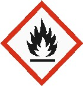
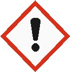
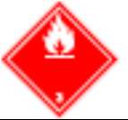

# Ficha de Datos de Seguridad - Esmalte Epóxico Aluminio

## Metadatos

- Fabricante: SIKA
- Archivo fuente: `FDS 26 - Esmalte Epóxico Aluminio 333441.pdf`
- Paginas: 9
- Secciones detectadas: 16 de 16
- Tablas extraidas: 5
- Imagenes extraidas: 7

## Tabla de secciones detectadas

| Seccion | Titulo normalizado | Paginas |
|---:|---|---:|
| 1 | Identificacion de la sustancia o la mezcla y de la sociedad o la empresa | 1 |
| 2 | Identificacion de los peligros | 1-2 |
| 3 | Composicion/informacion sobre los componentes | 2 |
| 4 | Primeros auxilios | 2-3 |
| 5 | Medidas de lucha contra incendios | 3 |
| 6 | Medidas en caso de vertido accidental | 3-4 |
| 7 | Manipulacion y almacenamiento | 4-5 |
| 8 | Controles de exposicion/proteccion individual | 5-6 |
| 9 | Propiedades fisicas y quimicas | 6-7 |
| 10 | Estabilidad y reactividad | 7 |
| 11 | Informacion toxicologica | 7 |
| 12 | Informacion ecologica | 7-8 |
| 13 | Consideraciones relativas a la eliminacion | 8 |
| 14 | Informacion relativa al transporte | 8-9 |
| 15 | Informacion reglamentaria | 9 |
| 16 | Otra informacion | 9 |

## Seccion 1: Identificacion de la sustancia o la mezcla y de la sociedad o la empresa

> Nota de trazabilidad: contenido extraido de la pagina 1 del PDF fuente `FDS 26 - Esmalte Epóxico Aluminio 333441.pdf`.

1.1 Identificación del producto

Nombre del producto: Esmalte Epóxico Aluminio
Código: 000000613416

1.2 Usos pertinentes identificados de la sustancia o de la mezcla y usos desaconsejados

Uso del producto:
- Protección de elementos metálicos.

1.3 Datos del proveedor de la ficha de datos de seguridad
Fabricante/ Distribuidor: Sika Colombia S.A.S.
Vereda Canavita km 20.5 Autopista Norte
Tocancipá, Cundinamarca
Colombia
col.sika.com
Número de Teléfono: (+571) 878 – 6333
Número de Fax: (+571) 878 – 6666
Dirección de email del responsable: controlcalidad.lab@co.sika.com
de esta FDS

1.4 En caso de emergencia: CISPROQUIM
Bogotá: 2886012 / 9191919
Resto del país: 01 8000 916012

### Imagenes extraidas de esta seccion

#### Imagen `sika__fds-26-esmalte-epoxico-aluminio-333441__p001_img01`


> Nota de trazabilidad: imagen `sika__fds-26-esmalte-epoxico-aluminio-333441__p001_img01` extraida de la pagina 1, asociada a la Seccion 1 por proximidad espacial y metadatos de pagina. Tipo detectado: logo_encabezado. Hash SHA-256: 89ace099c6c366a6620174f20b9ff1f11852a1e42307e94928689c3142493606.

**Texto OCR de la imagen:**

```text
BUILDING TRUST
```


## Seccion 2: Identificacion de los peligros

> Nota de trazabilidad: contenido extraido de la pagina 1 a la pagina 2 del PDF fuente `FDS 26 - Esmalte Epóxico Aluminio 333441.pdf`.

2.1 Clasificación de la sustancia o de la mezcla
Clasificación SGA
Líquidos inflamables: Categoría 2

Corrosión o irritación cutáneas: Categoría 2

Lesiones o irritación ocular graves: Categoría 2A

Sensibilización cutánea: Categoría 1

2.2 Elementos de etiquetado GHS
Pictogramas de peligro

Palabra de advertencia: Peligro
Indicaciones de peligro: H225 Líquido y vapores muy inflamables.
H315 Provoca irritación cutánea.

Esmalte Epoxico Aluminio

H317 Puede provocar una reacción alérgica en la piel.
H319 Provoca irritación ocular grave.

Consejos de prudencia: Prevención:
P210 Mantener alejado del calor, de superficies calientes, de chispas, de llamas abiertas y
de cualquier otra fuente de ignición. No fumar.
P233 Mantener el recipiente herméticamente cerrado.
P240 Toma de tierra y enlace equipotencial del recipiente y del equipo receptor.
P241 Utilizar un material eléctrico, de ventilación o de iluminación/ antideflagrante.
P242 No utilizar herramientas que produzcan chispas.
P243 Tomar medidas de precaución contra las descargas electrostáticas.
P261 Evitar respirar el polvo/ el humo/ el gas/ la niebla/ los vapores/ el aerosol.
P264 Lavarse la piel concienzudamente tras la manipulación.
P272 Las prendas de trabajo contaminadas no podrán sacarse del lugar de trabajo.
P280 Llevar guantes/ gafas/ máscara de protección.
Intervención:
P303 + P361 + P353 EN CASO DE CONTACTO CON LA PIEL (o el pelo): Quitar inmediatamente
toda la ropa contaminada. Enjuagar la piel con agua.
P305 + P351 + P338 EN CASO DE CONTACTO CON LOS OJOS: Aclarar cuidadosamente con
agua durante varios minutos. Quitar las lentes de contacto, si lleva y resulta fácil. Seguir
aclarando.
P333 + P313 En caso de irritación o erupción cutánea: Consultar a un médico.
P337 + P313 Si persiste la irritación ocular: Consultar a un médico.
P362 + P364 Quitar las prendas contaminadas y lavarlas antes de volver a usarlas.
P370 + P378 En caso de incendio: Utilizar arena seca, producto químico seco o espuma
resistente al alcohol para la extinción.
Almacenamiento:
P403 + P235 Almacenar en un lugar bien ventilado. Mantener en lugar fresco.
Eliminación:
P501 Eliminar el contenido/ el recipiente en una planta de eliminación de residuos
autorizada.

2.3 Ingredientes peligrosos: producto de reacción: bisfenol-A-epiclorhidrina y resinas epoxi (peso molecular medio 700 -
1100)

### Imagenes extraidas de esta seccion

#### Imagen `sika__fds-26-esmalte-epoxico-aluminio-333441__p001_img02`



> Nota de trazabilidad: imagen `sika__fds-26-esmalte-epoxico-aluminio-333441__p001_img02` extraida de la pagina 1, asociada a la Seccion 2 por proximidad espacial y metadatos de pagina. Tipo detectado: pictograma_o_simbolo. Hash SHA-256: 08bbec1f061a6705cb13a86f5e32f2d7f153354927e3a77fff4e991559383627.

**Texto OCR de la imagen:**

```text
OCR sin texto legible.
```

#### Imagen `sika__fds-26-esmalte-epoxico-aluminio-333441__p001_img03`



> Nota de trazabilidad: imagen `sika__fds-26-esmalte-epoxico-aluminio-333441__p001_img03` extraida de la pagina 1, asociada a la Seccion 2 por proximidad espacial y metadatos de pagina. Tipo detectado: pictograma_o_simbolo. Hash SHA-256: 59c16a6b564cfe6068c0c4867a2617099f3f781d2da9d69f3345e1f9e6f39728.

**Texto OCR de la imagen:**

```text
OCR sin texto legible.
```


## Seccion 3: Composicion/informacion sobre los componentes

> Nota de trazabilidad: contenido extraido de la pagina 2 del PDF fuente `FDS 26 - Esmalte Epóxico Aluminio 333441.pdf`.

Sustancia/preparado: Mezcla
Familia química/: Poliamina modificada, conteniendo solventes

Nombre del producto o ingrediente Identificadores %
Producto de reacción: Poli(Bisfenol A-co-epiclorohidrina), y resinas epoxi (peso molecular medio 700-1100)
CAS: 25068-38-6

Xileno
CAS: 1330-20-7

Acetato de n-Propilo
CAS: 109-60-4
50% - 70%

10% - 20%

5% - 10%
No hay ningún ingrediente adicional presente que, bajo el conocimiento actual del proveedor y en las concentraciones aplicables, sea
clasificado como de riesgo para la salud o el medio ambiente, como PBT o mPmB o tenga asignado un límite de exposición laboral y
por lo tanto deban ser reportados en esta sección.

### Tablas extraidas de esta seccion

#### Tabla `sika__fds-26-esmalte-epoxico-aluminio-333441__p002_tbl01`

|Nombre del producto o ingrediente Identificadores|%|
|---|---|
|Producto de reacción: Poli(Bisfenol A-_co_-epiclorohidrina), y resinas epoxi (peso molecular medio 700-1100)<br>CAS: 25068-38-6<br>Xileno<br>CAS: 1330-20-7<br>Acetato de n-Propilo<br>CAS: 109-60-4|50% - 70%<br>10% - 20%<br>5% - 10%|

> Nota de trazabilidad: tabla `sika__fds-26-esmalte-epoxico-aluminio-333441__p002_tbl01` extraida de la pagina 2, asociada a la Seccion 3 por proximidad espacial y metadatos de pagina.


## Seccion 4: Primeros auxilios

> Nota de trazabilidad: contenido extraido de la pagina 2 a la pagina 3 del PDF fuente `FDS 26 - Esmalte Epóxico Aluminio 333441.pdf`.

Esmalte Epoxico Aluminio

4.1 Descripción de los primeros auxilios
Recomendaciones generales: Retirar a la persona de la zona peligrosa.
Consultar a un médico.
Mostrar esta ficha de seguridad al doctor que esté de servicio.

Si es inhalado: Trasladarse a un espacio abierto.
Consultar a un médico después de una exposición importante.

En caso de contacto con la piel: Retirar inmediatamente la ropa y zapatos contaminados.
Eliminar lavando con jabón y mucha agua.
Si los síntomas persisten consultar a un médico.

En caso de contacto con los ojos: Enjuagar inmediatamente los ojos con abundante agua.
Retirar las lentillas.
Manténgase el ojo bien abierto mientras se lava.
Si persiste la irritación de los ojos, consultar a un especialista.

Por ingestión: Lavar la boca con agua y después beber agua abundante.
No dar leche ni bebidas alcohólicas.
Nunca debe administrarse nada por la boca a una persona inconsciente.
Consultar al médico.

Principales síntomas y efectos, Efectos irritantes
agudos y retardados: Efectos sensibilizantes
Reacciones alérgicas
Lacrimación excesiva
Dermatitis
Ver la Sección 11 para obtener información detallada sobre la salud y los síntomas.

Notas para el médico: Tratar sintomáticamente.

## Seccion 5: Medidas de lucha contra incendios

> Nota de trazabilidad: contenido extraido de la pagina 3 del PDF fuente `FDS 26 - Esmalte Epóxico Aluminio 333441.pdf`.

Características inflamables
Punto de inflamación: 12,5 °C
Método: Copa cerrada - ASTM D 56

Medios de extinción apropiados: Espuma resistente al alcohol
Dióxido de carbono (CO2)
Producto químico en polvo

Medios de extinción no apropiados: Agua

Productos de combustión peligrosos: No se conocen productos de combustión peligrosos

Métodos específicos de extinción: El agua pulverizada puede ser utilizada para enfriar los contenedores cerrados.

Equipo de protección especial para
el personal de lucha contra incendios: En caso de fuego, protéjase con un equipo respiratorio autónomo.

## Seccion 6: Medidas en caso de vertido accidental

> Nota de trazabilidad: contenido extraido de la pagina 3 a la pagina 4 del PDF fuente `FDS 26 - Esmalte Epóxico Aluminio 333441.pdf`.

6.1 Precauciones personales, equipo de protección y procedimientos de emergencia
Esmalte Epoxico Aluminio

Para el personal que no No se debe realizar ninguna acción que suponga un riesgo personal o sin formación adecua-
forma parte de los da. Evacuar los alrededores. No permitir el ingreso a personal innecesario y sin protección.
servicios de emergencia: No tocar o caminar sobre el material derramado. Evitar respirar vapor o neblina.
Proporcionar ventilación adecuada. Llevar un aparato de respiración apropiado cuando el
sistema de ventilación sea inadecuado. Llevar puesto un equipo de protección individual
adecuado.

Para el personal de Si se necesitan prendas especiales para gestionar el vertido, tomar en cuenta las informacio-
Emergencia: nes recogidas en la Sección 8 en relación a los materiales adecuados y no adecuados.
Consultar también en la Sección 8 la información adicional sobre medidas higiénicas.

6.2 Precauciones relativas Evitar la dispersión del material derramado, su contacto con el suelo, las vías fluviales, las
al medio ambiente: tuberías de desagüe y las alcantarillas. Informar a las autoridades pertinentes si el producto
ha causado contaminación medioambiental (alcantarillas, vías fluviales, suelo o aire).

6.3 Métodos y material de Detener la fuga si esto no presenta ningún riesgo. Retirar los envases del área del derrame.
contención y de limpieza Evitar que se introduzca en alcantarillas, canales de agua, sótanos o áreas reducidas.
Detener y recoger los derrames con materiales absorbentes no combustibles, como arena,
tierra, vermiculita o tierra de diatomeas, y colocar el material en un envase para desecharlo
de acuerdo con las normativas locales (ver Sección 13).

6.4 Referencia a otras Consultar en la Sección 1 la información de contacto en caso de emergencia.
Secciones Consultar en la Sección 8 la información relativa a equipos de protección personal
apropiados. Consulte en la Sección 13 la información adicional relativa al tratamiento de
residuos.

## Seccion 7: Manipulacion y almacenamiento

> Nota de trazabilidad: contenido extraido de la pagina 4 a la pagina 5 del PDF fuente `FDS 26 - Esmalte Epóxico Aluminio 333441.pdf`.

7.1 Precauciones para una manipulación segura
Medidas de protección: Usar un equipo de protección personal adecuado (Consultar Sección 8).
Los trabajadores deberán lavarse las manos y la cara antes de comer, beber o fumar.
No introducir en ojos en la piel o en la ropa.
No respirar los vapores o nieblas.
Usar sólo con ventilación adecuada.
Llevar un aparato de respiración apropiado cuando el sistema de ventilación sea
inadecuado.
Consérvese en su envase original o en uno alternativo aprobado fabricado en un material
compatible, manteniéndose bien cerrado cuando no esté en uso.
Mantener alejado del calor, chispas, llamas al descubierto o de cualquier otra fuente de
ignición.
Usar equipo eléctrico (de ventilación, iluminación y manipulación de materiales) a prueba
de explosión.
Utilizar herramientas antichispa.
Los envases vacíos retienen residuos del producto y pueden ser peligrosos.
Tomar medidas de precaución contra la acumulación de cargas electrostáticas.

Información relativa a Deberá prohibirse comer, beber o fumar en los lugares donde se manipula, almacena o trata
higiene en el trabajo de este producto.
forma general Los trabajadores deberán lavarse las manos y la cara antes de comer, beber o fumar.
Retirar el equipo de protección y las ropas contaminadas antes de acceder a zonas de
alimentación.
Consultar también en la Sección 8 la información adicional sobre medidas higiénicas.

7.2 Condiciones de almacenamiento seguro, incluidas posibles incompatibilidades
Esmalte Epoxico Aluminio

Conservar de acuerdo con las normativas locales. Almacenar en el contenedor original protegido de la luz directa del sol en un área
seca, fresca y bien ventilada, separado de materiales incompatibles (ver Sección 10) y comida y bebida.
Mantener el contenedor bien cerrado y sellado hasta el momento de usarlo. Los envases abiertos deben cerrarse perfectamente con
cuidado y mantenerse en posición vertical para evitar derrames. No almacenar en contenedores sin etiquetar. Utilícese un envase de
seguridad adecuado para evitar la contaminación del medio ambiente.

7.3 Usos específicos finales
Recomendaciones: No disponible.
Soluciones específicas del: No disponible.
sector industrial

## Seccion 8: Controles de exposicion/proteccion individual

> Nota de trazabilidad: contenido extraido de la pagina 5 a la pagina 6 del PDF fuente `FDS 26 - Esmalte Epóxico Aluminio 333441.pdf`.

La información recogida en esta sección contiene consejos e indicaciones generales. La información que se proporciona está basada
en los usos habituales anticipados para el producto. Puede ser necesario tomar medidas adicionales para su manipulación a granel u
otros usos que pudieran aumentar de manera significativa la exposición de los trabajadores o la liberación al medio ambiente.

8.1 Parámetros de control
Límites de exposición profesional
Nombre de producto o ingrediente Valores límite de la explosión
Xileno EU OEL (Europa, 12/2009). Absorbido a través de la piel.
Notas: list of indicative occupational exposure limit values
STEL: 442 mg/m3 15 minutos
STEL: 442 mg/m3 15 minutos
TWA: 221 mg/m3 8 horas
TWA: 50 ppm 8 horas

Procedimientos Si este producto contiene ingredientes con límites de exposición, puede ser necesaria la su-
recomendados de control: pervisión personal, del ambiente de trabajo o biológica para determinar la efectividad de la
ventilación o de otras medidas de control y/o la necesidad de usar un equipo de protección
respiratoria.
Se debe hacer referencia al Estándar Europeo EN 689 para los métodos de evaluación de la
exposición por inhalación a agentes químicos y a las recomendaciones nacionales sobre los
métodos de determinación de sustancias peligrosas.

Valores DNEL/DMEL
No hay valores DEL disponibles.
Valor PNEC
No hay valores PEC disponibles.

8.2 Controles de la exposición
Controles técnicos Usar solo con ventilación adecuada.
Utilizar aislamientos de áreas de producción, sistemas de ventilación locales u otros
procedimientos de ingeniería para mantener la exposición del obrero a los contaminantes
aerotransportados por debajo de todos los límites recomendados o estatutarios. Los
controles de ingeniería también deben mantener el gas, vapor o polvo por debajo del
menor límite de explosión. Utilizar equipo de ventilación anti-explosión.

Medidas de protección individual
Medidas higiénicas: Lavar las manos, antebrazos y cara completamente después de manejar productos
químicos, antes de comer, fumar y usar el lavabo y al final del período de trabajo.
Usar las técnicas apropiadas para eliminar ropa contaminada.
Lavar las ropas contaminadas antes de volver a usarlas.

Esmalte Epoxico Aluminio

Protección de los ojos/la Cara: Se debe usar un equipo protector ocular que cumpla con las normas aprobadas cuando una
evaluación del riesgo indique que es necesario, a fin de evitar toda exposición a salpicaduras
del líquido, lloviznas, gases o polvos.

Protección de la piel
Protección de las manos: Si una evaluación del riesgo indica que es necesario, se deben usar guantes químico-
resistentes e impenetrables que cumplan con las normas aprobadas siempre que se
manejen productos químicos. Número de referencia EN 374.
Adecuados para periodos cortos o para protección contra salpicaduras: Guantes de goma de
butilo/nitrilo. (0,4 mm), tiempo de detección <30 min. Desechar los guantes contaminados.
Adecuado para exposición permanente: Guantes Vitón (0,4mm), tiempo de detección >30
min.

Protección corporal: Antes de utilizar este producto se debe seleccionar equipo protector personal para el
cuerpo basándose en la tarea a ejecutar y los riesgos involucrados y debe ser aprobado por
un especialista. Recomendado: Protección preventiva de la piel con pomada protectora.

Otro tipo de protección Se debe elegir el calzado adecuado y cualquier otra medida de protección cutánea necesaria
Cutánea: dependiendo de la tarea que se lleve a cabo y de los riesgos implicados.
Tales medidas deben ser aprobadas por un especialista antes de proceder a la manipulación
de este producto.

Protección respiratoria: Se debe seleccionar el respirador en base a los niveles de exposición reales o previstos, a la
peligrosidad del producto y al grado de seguridad de funcionamiento del respirador elegido.
Filtro de vapor orgánico (Tipo A)
A1: < 1000 ppm; A2: < 5000 ppm; A3: < 10000 ppm

Controles de exposición Se deben verificar las emisiones de los equipos de ventilación o de los procesos de trabajo
Medioambiental: para verificar que cumplen con los requisitos de la legislación de protección del medio
ambiente. En algunos casos para reducir las emisiones hasta un nivel aceptable, será
necesario usar depuradores de humo, filtros o modificar el diseño del equipo del proceso.

### Tablas extraidas de esta seccion

#### Tabla `sika__fds-26-esmalte-epoxico-aluminio-333441__p005_tbl01`

|8.1 Parámetros de control Límites de exposición profesional|Col2|
|---|---|
|**Nombre deproducto o ingrediente**|**Valores límite de la explosión**|
|Xileno|**EU OEL (Europa, 12/2009).  Absorbido a través de la piel.**<br>**Notas: list of indicative occupational exposure limit values**<br>STEL: 442 mg/m3 15 minutos<br>STEL: 442 mg/m3 15 minutos<br>TWA: 221 mg/m3 8 horas<br>TWA: 50ppm 8 horas|

> Nota de trazabilidad: tabla `sika__fds-26-esmalte-epoxico-aluminio-333441__p005_tbl01` extraida de la pagina 5, asociada a la Seccion 8 por proximidad espacial y metadatos de pagina.


## Seccion 9: Propiedades fisicas y quimicas

> Nota de trazabilidad: contenido extraido de la pagina 6 a la pagina 7 del PDF fuente `FDS 26 - Esmalte Epóxico Aluminio 333441.pdf`.

9.1 Información sobre propiedades físicas y químicas básicas
Aspecto
Estado físico: Líquido
Color: Aluminio
Olor: Característico
Umbral olfativo: No disponible
pH: No disponible
Punto de fusión/punto de
Congelación: No disponible
Punto inicial de ebullición e
intervalo de ebullición: No disponible
Punto de inflamación: < 23°Cvaso cerrado (ASTM D56)
Tasa de evaporación No disponible
Inflamabilidad (sólido, gas): No disponible
Tiempo de Combustión: No aplicable
Velocidad de Combustión: No aplicable
Límites superior/inferior de Valor más bajo conocido:
inflamabilidad o de explosividad: Punto mínimo: 0.8% (xileno)
Valor más alto conocido:
Punto máximo: 8% (acetato de n-propilo)
Esmalte Epoxico Aluminio

Presión de vapor: Valor más alto conocido: 4.8 kPa (35.93 mm HG) (acetato de n-propilo)
Densidad de vapor: No disponible
Densidad: 0.9 kg/l - 1.4 kg/l (20°C)
Densidad relativa: No disponible
Solubilidad(es): El producto no es soluble en agua
Coeficiente de reparto noctanol/agua: No disponible
Temperatura de autoinflamación: 380 °C (acetato de n-propilo)
Temperatura de descomposición: No disponible
Viscosidad: No disponible
Propiedades explosivas: No disponible
Propiedades comburentes: No disponible

9.2 Información adicional
Ninguna información adicional

## Seccion 10: Estabilidad y reactividad

> Nota de trazabilidad: contenido extraido de la pagina 7 del PDF fuente `FDS 26 - Esmalte Epóxico Aluminio 333441.pdf`.

10.1 Reactividad: No hay datos de ensayo disponibles sobre la reactividad de este producto o sus
componentes.

10.2 Estabilidad química: El producto es estable.

10.3 Posibilidad de reacciones En condiciones normales de almacenamiento y uso, no se producen reacciones peligrosas.
peligrosas:

10.4 Condiciones que deben Evitar todas las fuentes posibles de ignición (chispa o llama).
evitarse: No someter a presión, corte, soldadura con latón, taladro, esmeril o exposición de los
envases al calor o fuentes térmicas.

10.5 Materiales incompatibles: Reactivo o incompatible con los siguientes materiales:
Materiales oxidantes

10.6 Productos de descomposición En condiciones normales de almacenamiento y uso, no se deberían formar productos de
peligrosos: descomposición peligrosos.

## Seccion 11: Informacion toxicologica

> Nota de trazabilidad: contenido extraido de la pagina 7 del PDF fuente `FDS 26 - Esmalte Epóxico Aluminio 333441.pdf`.

11.1 Información sobre los efectos toxicológicos
Toxicidad aguda
Nombre del producto o
ingrediente
Resultado Especies Dosis Exposición
Xileno DL50 Dérmica Rata 1100 mg/kg -
Conclusión/resumen: No disponible.

### Tablas extraidas de esta seccion

#### Tabla `sika__fds-26-esmalte-epoxico-aluminio-333441__p007_tbl01`

|Toxicidad aguda|Col2|Col3|Col4|Col5|
|---|---|---|---|---|
|**Nombre del producto o**<br>**ingrediente**|**Resultado**|**Especies**|**Dosis**|**Exposición**|
|Xileno|DL50 Dérmica|Rata|1100 mg/kg|-|

> Nota de trazabilidad: tabla `sika__fds-26-esmalte-epoxico-aluminio-333441__p007_tbl01` extraida de la pagina 7, asociada a la Seccion 11 por proximidad espacial y metadatos de pagina.


## Seccion 12: Informacion ecologica

> Nota de trazabilidad: contenido extraido de la pagina 7 a la pagina 8 del PDF fuente `FDS 26 - Esmalte Epóxico Aluminio 333441.pdf`.

12.1 Toxicidad
Conclusión/resumen: No disponible.

12.2 Persistencia y degradabilidad
Conclusión/resumen: No disponible.

Esmalte Epoxico Aluminio

12.3 Potencial de bioacumulación
Nombre del producto o
ingrediente
LogPow Especies Exposición
Xileno
Acetato de n-propilo
3.12
1.4
-
-
Alta
Bajo

12.4 Movilidad en el suelo
Coeficiente de partición: No disponible.
Tierra/agua (KOC)

MOVILIDAD: No disponible.

12.5 Resultados de la valoración PBT y mPmB
PBT: No aplicable
mPmB: No aplicable.

12.6 Otros efectos adversos No se conocen efectos significativos o riesgos críticos.

### Tablas extraidas de esta seccion

#### Tabla `sika__fds-26-esmalte-epoxico-aluminio-333441__p008_tbl01`

|Nombre del producto o<br>ingrediente|LogP<br>ow|Especies|Exposición|
|---|---|---|---|
|Xileno<br>Acetato de n-propilo|3.12<br>1.4|- <br>-|Alta<br>Bajo|

> Nota de trazabilidad: tabla `sika__fds-26-esmalte-epoxico-aluminio-333441__p008_tbl01` extraida de la pagina 8, asociada a la Seccion 12 por proximidad espacial y metadatos de pagina.


## Seccion 13: Consideraciones relativas a la eliminacion

> Nota de trazabilidad: contenido extraido de la pagina 8 del PDF fuente `FDS 26 - Esmalte Epóxico Aluminio 333441.pdf`.

13.1 Métodos para el tratamiento de residuos
Producto
Métodos de eliminación: Evitar o minimizar la generación de residuos cuando sea posible. La eliminación de este
producto, sus soluciones y cualquier derivado deben cumplir siempre con los requisitos de
la legislación de protección del medio ambiente y eliminación de desechos y todos los
requisitos de las autoridades locales. Desechar los sobrantes y productos no reciclables por
medio de un contratista autorizado a su eliminación. Los residuos no se deben tirar por la
alcantarilla sin tratar a menos que sean compatibles con los requisitos de todas las
autoridades con jurisdicción.

Empaquetado: Envases/embalajes totalmente vacíos pueden destinarse a reciclaje. Envases/ embalajes que
no pueden ser limpiados deben ser eliminados de la misma forma que la sustancia
contenida.

## Seccion 14: Informacion relativa al transporte

> Nota de trazabilidad: contenido extraido de la pagina 8 a la pagina 9 del PDF fuente `FDS 26 - Esmalte Epóxico Aluminio 333441.pdf`.

ADR/RID-ADN IMDG IATA
14.1 Número ONU UN1263 UN1263 UN1263
14.2 Designación oficial de
transporte de las Naciones
Unidas
Pintura Pintura Pintura
14.3 Clase(s) de peligro para
el transporte
3

3

3
14.4 Grupo de embalaje III III III
14.5 Peligros para el medio
ambiente
No No No
14.6 Información adicional Provisiones especiales
640 (E)

Código para túneles
(D/E)
Emergency schedules (EmS)
F-E, S-E

Código de clasificación F1

Esmalte Epoxico Aluminio

14.7 Transporte a granel: No disponible
con arreglo al anexo II del
Convenio Marpol 73/78 y del
Código IBC

### Tablas extraidas de esta seccion

#### Tabla `sika__fds-26-esmalte-epoxico-aluminio-333441__p008_tbl02`

|SECCIÓN 14: Información relativa al transporte|Col2|Col3|Col4|
|---|---|---|---|
||**ADR/RID-ADN**|**IMDG**|**IATA**|
|**14.1 Número ONU**|UN1263|UN1263|UN1263|
|**14.2 Designación oficial de**<br>**transporte de las Naciones**<br>**Unidas**|Pintura|Pintura|Pintura|
|**14.3 Clase(s) de peligro para**<br>**el transporte**|3|3|3|
|**14.4 Grupo de embalaje **|III|III|III|
|**14.5 Peligros para el medio**<br>**ambiente**|No|No|No|
|**14.6 Información adicional**|Provisiones especiales<br>640 (E)<br>Código para túneles<br>(D/E)|**Emergency schedules (EmS)**<br>F-E, S-E||
|**Código de clasificación**|F1|||

> Nota de trazabilidad: tabla `sika__fds-26-esmalte-epoxico-aluminio-333441__p008_tbl02` extraida de la pagina 8, asociada a la Seccion 14 por proximidad espacial y metadatos de pagina.


### Imagenes extraidas de esta seccion

#### Imagen `sika__fds-26-esmalte-epoxico-aluminio-333441__p008_img01`



> Nota de trazabilidad: imagen `sika__fds-26-esmalte-epoxico-aluminio-333441__p008_img01` extraida de la pagina 8, asociada a la Seccion 14 por proximidad espacial y metadatos de pagina. Tipo detectado: pictograma_o_simbolo. Hash SHA-256: ce70d03c959c16b03198e20eb2a4e5b13cfc776755795d8d4917f9d9e50480c1.

**Texto OCR de la imagen:**

```text
OCR sin texto legible.
```

#### Imagen `sika__fds-26-esmalte-epoxico-aluminio-333441__p008_img02`


> Nota de trazabilidad: imagen `sika__fds-26-esmalte-epoxico-aluminio-333441__p008_img02` extraida de la pagina 8, asociada a la Seccion 14 por proximidad espacial y metadatos de pagina. Tipo detectado: pictograma_o_simbolo. Hash SHA-256: 017fb8c3a726e83671cb0c9e8d63b058a5621994fffad575f9a758eed0f88fbf.

**Texto OCR de la imagen:**

```text
OCR sin texto legible.
```

#### Imagen `sika__fds-26-esmalte-epoxico-aluminio-333441__p008_img03`


> Nota de trazabilidad: imagen `sika__fds-26-esmalte-epoxico-aluminio-333441__p008_img03` extraida de la pagina 8, asociada a la Seccion 14 por proximidad espacial y metadatos de pagina. Tipo detectado: pictograma_o_simbolo. Hash SHA-256: d57d8f4cae824d55cc8d34a8f982d05fea4d4d600bc064bf13cbb092244031a2.

**Texto OCR de la imagen:**

```text
OCR sin texto legible.
```


## Seccion 15: Informacion reglamentaria

> Nota de trazabilidad: contenido extraido de la pagina 9 del PDF fuente `FDS 26 - Esmalte Epóxico Aluminio 333441.pdf`.

15.1 Reglamentación y legislación en materia de seguridad, salud y medio ambiente específicos para la sustancia o la mezcla
Reglamento de la UE (CE) nº. 1907/2006 (REACH)
Anexo XIV - Lista de sustancias sujetas a autorización
Anexo XIV
Ninguno de los componentes está listado.
Sustancias altamente preocupantes
Ninguno de los componentes está listado.

Contenido de COV (EU): VOC (w/w): 46.9%

Legislación nacional
NTC 1692:1998, Transporte de mercancías peligrosas. Clasificación, etiquetado y rotulado.
Norma técnica NTC-ISO 5500 gestión del transporte de carga terrestre.
Ley 55 del 2 de julio de 1993, Convenio número 170 y la Recomendación número 177 sobre la Seguridad en la Utilización de los
Productos Químicos en el Trabajo.
Decreto 1609 de 2002 Por el cual se reglamenta el manejo y transporte terrestre automotor de mercancías peligrosas por carretera.

Clase de almacenamiento:
NTC 3972:1996, Transporte de mercancías peligrosas clase 9. Sustancias peligrosas varias. Transporte terrestre por carretera.
Requisitos generales para el transporte. Segregación.

15.2 Evaluación de la seguridad química No hay datos disponibles

## Seccion 16: Otra informacion

> Nota de trazabilidad: contenido extraido de la pagina 9 del PDF fuente `FDS 26 - Esmalte Epóxico Aluminio 333441.pdf`.

Indica la información que ha cambiado desde la edición de la versión anterior.
Abreviaturas y acrónimos: ETA = Estimación de Toxicidad Aguda
CLP = Reglamento sobre Clasificación, Etiquetado y Envasado [Reglamento (CE)
No 1272/2008]
DNEL = Nivel sin efecto derivado
Indicación EUH = Indicación de Peligro específica del CLP
PNEC = Concentración Prevista Sin Efecto
RRN = Número de Registro REACH

Aviso al lector
La información contenida en esta ficha de datos de seguridad corresponde a nuestro nivel de conocimiento en el momento de su
publicación. Quedan excluidas todas las garantías. Se aplicarán nuestras condiciones generales de venta en vigor. Por favor,
consulte la Hoja de Datos del Producto antes de su uso y procesamiento.

### Imagenes extraidas de esta seccion

#### Imagen `sika__fds-26-esmalte-epoxico-aluminio-333441__p009_img01`


> Nota de trazabilidad: imagen `sika__fds-26-esmalte-epoxico-aluminio-333441__p009_img01` extraida de la pagina 9, asociada a la Seccion 16 por proximidad espacial y metadatos de pagina. Tipo detectado: icono_o_marca_pequena. Hash SHA-256: b3d04bd16f44f7222150999b3b41afe1b8baec5df8dd3a8ab2382da93a2ccfac.

**Texto OCR de la imagen:**

```text
OCR sin texto legible.
```
