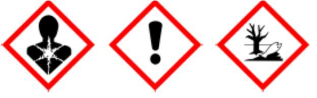

# Ficha de Datos de Seguridad - Sika® Epoxi 100HS Serie 300 Comp. A

## Metadatos

- Fabricante: SIKA
- Archivo fuente: `FDS 27 - Epoxi_100HS_S300_CA.pdf`
- Paginas: 8
- Secciones detectadas: 16 de 16
- Tablas extraidas: 2
- Imagenes extraidas: 6

## Tabla de secciones detectadas

| Seccion | Titulo normalizado | Paginas |
|---:|---|---:|
| 1 | Identificacion de la sustancia o la mezcla y de la sociedad o la empresa | 1 |
| 2 | Identificacion de los peligros | 1-2 |
| 3 | Composicion/informacion sobre los componentes | 2-3 |
| 4 | Primeros auxilios | 3 |
| 5 | Medidas de lucha contra incendios | 3-4 |
| 6 | Medidas en caso de vertido accidental | 4 |
| 7 | Manipulacion y almacenamiento | 4 |
| 8 | Controles de exposicion/proteccion individual | 4-5 |
| 9 | Propiedades fisicas y quimicas | 5 |
| 10 | Estabilidad y reactividad | 5-6 |
| 11 | Informacion toxicologica | 6 |
| 12 | Informacion ecologica | 6 |
| 13 | Consideraciones relativas a la eliminacion | 6-7 |
| 14 | Informacion relativa al transporte | 7 |
| 15 | Informacion reglamentaria | 7-8 |
| 16 | Otra informacion | 8 |

## Seccion 1: Identificacion de la sustancia o la mezcla y de la sociedad o la empresa

> Nota de trazabilidad: contenido extraido de la pagina 1 del PDF fuente `FDS 27 - Epoxi_100HS_S300_CA.pdf`.

1.1 Identificación del producto

Nombre del producto: Sika® Epoxi 100HS Serie 300 Comp. A
Código: 0995

1.2 Usos pertinente identificados de la sustancia o de la mezcla y usos desaconsejados

Uso del producto:
- Sistema epóxico multi-uso 100% sólidos para superficies metálicas y de concreto.

1.3 Datos del proveedor de la ficha de datos de seguridad
Fabricante/ Distribuidor: Sika Colombia S.A.S.
Vereda Canavita km 20.5 Autopista Norte
Tocancipá, Cundinamarca
Colombia
col.sika.com
Número de Teléfono: (+571) 878 – 6333
Número de Fax: (+571) 878 – 6666
Dirección de email de la persona: controlcalidad.lab@co.sika.com
responsable de esta FDS

1.4 En caso de emergencia: CISPROQUIM
Bogotá: 2886012 / 2886355
Resto del país: 01 8000 916012

### Imagenes extraidas de esta seccion

#### Imagen `sika__fds-27-epoxi-100hs-s300-ca__p001_img01`


> Nota de trazabilidad: imagen `sika__fds-27-epoxi-100hs-s300-ca__p001_img01` extraida de la pagina 1, asociada a la Seccion 1 por proximidad espacial y metadatos de pagina. Tipo detectado: logo_encabezado. Hash SHA-256: 739691a3d04128d931c2cd9f8e09de8d9fea2818f6c0898d5db4b32dbad3b1f3.

**Texto OCR de la imagen:**

```text
BUILDING TRUST
```


## Seccion 2: Identificacion de los peligros

> Nota de trazabilidad: contenido extraido de la pagina 1 a la pagina 2 del PDF fuente `FDS 27 - Epoxi_100HS_S300_CA.pdf`.

2.1 Clasificación de la sustancia o de la mezcla
Clasificación SGA
Corrosión o irritación cutánea: Categoría2

Lesiones o irritación ocular grave: Categoría 2A

Sensibilización cutánea: Categoría 1

Toxicidad acuática crónica: Categoría 2

2.2 Elementos de la etiqueta SGA
Pictogramas de peligro:
Palabra de advertencia: Peligro

Indicaciones de peligro: H315 Provoca irritación cutánea.
H317 Puede provocar una reacción alérgica.

H319 Provoca irritación ocular grave.
H411 Toxico para los organismos acuáticos con efectos nocivos duraderos.

Consejos de prudencia: Prevención:
P201 Pedir instrucciones especiales antes del uso.
P202 No manipular la sustancia antes de haber leído y comprendido todas las instrucciones
de seguridad.
P261 Evitar respirar el polvo/ el humo/ el gas/ la niebla/ los vapores/ el aerosol.
P264 Lavarse la piel concienzudamente tras la manipulación.
P272 Las prendas de trabajo contaminadas no podrán sacarse del lugar de trabajo.
P273 Evitar su liberación al medio ambiente.
P280 Llevar guantes/ prendas/ gafas/ máscara de protección.
Intervención:
P302 + P352 EN CASO DE CONTACTO CON LA PIEL: Lavar con abundante agua.
P305 + P351 + P338 EN CASO DE CONTACTO CON LOS OJOS: Aclarar cuidadosamente con
agua durante varios minutos. Quitar las lentes de contacto, si lleva y resulta fácil. Seguir
aclarando.
P308 + P313 EN CASO DE exposición manifiesta o presunta: Consultar a un médico.
P333 + P313 En caso de irritación o erupción cutánea: Consultar a un médico.
P337 + P313 Si persiste la irritación ocular: Consultar a un médico.
P362 + P364 Quitar las prendas contaminadas y lavarlas antes de volver a usarlas.
P391 Recoger el vertido.
Almacenamiento:
P405 Guardar bajo llave.
Eliminación:
P501 Eliminar el contenido/ el recipiente en una planta de eliminación de residuos
autorizada.

2.3 Otros peligros que no dan:
lugar a clasificación Ninguno conocido

### Imagenes extraidas de esta seccion

#### Imagen `sika__fds-27-epoxi-100hs-s300-ca__p001_img02`



> Nota de trazabilidad: imagen `sika__fds-27-epoxi-100hs-s300-ca__p001_img02` extraida de la pagina 1, asociada a la Seccion 2 por proximidad espacial y metadatos de pagina. Tipo detectado: imagen_embebida. Hash SHA-256: b74d0fc43e32155d431c0b09b5f9b438e74ff5e3566562d2fcc830701d1f6d46.

**Texto OCR de la imagen:**

```text
Y Y DS
```


## Seccion 3: Composicion/informacion sobre los componentes

> Nota de trazabilidad: contenido extraido de la pagina 2 a la pagina 3 del PDF fuente `FDS 27 - Epoxi_100HS_S300_CA.pdf`.

Sustancia/preparado: Mezcla
Familia química/: Resina epoxi modificada y con inhibidores de corrosión.

Nombre químico Concentración %
producto de reacción: bisfenol-A-epiclorhidrina y resinas epoxi (peso molecular medio <= 700)
CAS: 25068-38-6

Nafta disolvente (petróleo), fracción aromática pesada
CAS: 64742-94-5

Melanina
CAS: 108-78-1
30% - 50%

2.5% - 10%

1% - 10%
No hay ningún ingrediente adicional presente que, bajo el conocimiento actual del proveedor y en las concentraciones aplicables, sea
clasificado como de riesgo para la salud o el medio ambiente, como PBT o mPmB o tenga asignado un límite de exposición laboral y
por lo tanto deban ser reportados en esta sección.

### Tablas extraidas de esta seccion

#### Tabla `sika__fds-27-epoxi-100hs-s300-ca__p002_tbl01`

|Nombre químico|Concentración %|
|---|---|
|producto de reacción: bisfenol-A-epiclorhidrina y resinas epoxi (peso molecular medio <= 700)<br>CAS: 25068-38-6<br>Nafta disolvente (petróleo), fracción aromática pesada<br>CAS: 64742-94-5<br>Melanina<br>CAS: 108-78-1|30% - 50%<br>2.5% - 10%<br>1% - 10%|

> Nota de trazabilidad: tabla `sika__fds-27-epoxi-100hs-s300-ca__p002_tbl01` extraida de la pagina 2, asociada a la Seccion 3 por proximidad espacial y metadatos de pagina.


## Seccion 4: Primeros auxilios

> Nota de trazabilidad: contenido extraido de la pagina 3 del PDF fuente `FDS 27 - Epoxi_100HS_S300_CA.pdf`.

4.1 Descripción de los primeros auxilios
Recomendaciones generales: Retirar a la persona de la zona peligrosa.
Consultar a un médico.
Mostrar esta ficha de seguridad al doctor que esté de servicio.

Si es inhalado: Sacar al aire libre.
Consultar a un médico después de una exposición importante.

En caso de contacto con la piel: Retirar inmediatamente la ropa y zapatos contaminados.
Eliminar lavando con jabón y mucha agua.
Si los síntomas persisten consultar a un médico.

En caso de contacto con los ojos: Enjuagar inmediatamente los ojos con abundante agua.
Retirar las lentillas.
Manténgase el ojo bien abierto mientras se lava.
Si persiste la irritación de los ojos, consultar a un especialista.

Si es ingerido: Lavar la boca con agua y después beber agua abundante.
No dar a beber leche ni bebidas alcohólicas.
Nunca debe administrarse nada por la boca a una persona inconsciente.
Consultar al médico.

Principales síntomas y efectos, Efectos irritantes
agudos y retardados: Efectos sensibilizantes
Reacciones alérgicas
Lacrimación excesiva
Dermatitis
Ver la Sección 11 para obtener información detallada sobre la salud y los síntomas.

Notas para el médico: Tratar sintomáticamente.

## Seccion 5: Medidas de lucha contra incendios

> Nota de trazabilidad: contenido extraido de la pagina 3 a la pagina 4 del PDF fuente `FDS 27 - Epoxi_100HS_S300_CA.pdf`.

Características inflamables
Punto de inflamación: No Aplica.

Medios de extinción apropiados: Usar medidas de extinción que sean apropiadas a las circunstancias del local y a sus
alrededores.

Peligros específicos en la
lucha contra incendios: No permitir que las aguas de extinción entren en el alcantarillado o en los cursos de agua.

Productos de combustión
peligrosos: No se conocen productos de combustión peligrosos.

Métodos específicos de extinción: El agua de extinción debe recogerse por separado, no debe penetrar en el alcantarillado.
Los restos del incendio y el agua de extinción contaminada deben eliminarse según las
normas locales en vigor.

Equipo de protección especial
para el personal de lucha
contra incendios: En caso de fuego, protéjase con un equipo respiratorio autónomo.

## Seccion 6: Medidas en caso de vertido accidental

> Nota de trazabilidad: contenido extraido de la pagina 4 del PDF fuente `FDS 27 - Epoxi_100HS_S300_CA.pdf`.

Precauciones personales,
equipo de protección y procedimientos Utilícese equipo de protección individual.
de emergencia: Negar el acceso a personas sin protección.

Precauciones relativas al No botar al agua superficial o al sistema de alcantarillado sanitario.
medio ambiente: Si el producto contaminara ríos, lagos o alcantarillados, informar a las autoridades
respectivas.

Métodos y material de contención Recoger con un producto absorbente inerte (por ejemplo, arena, diatomita, fijador de áci-
y de limpieza: dos, fijador universal, serrín).
Guardar en contenedores apropiados y cerrados para su eliminación.

## Seccion 7: Manipulacion y almacenamiento

> Nota de trazabilidad: contenido extraido de la pagina 4 del PDF fuente `FDS 27 - Epoxi_100HS_S300_CA.pdf`.

Indicaciones para la protección
contra incendio y explosión: Disposiciones normales de protección preventivas de incendio.

Consejos para una manipulación Evitar sobrepasar los límites dados de exposición profesional (ver sección 8).
segura: Evitar el contacto con los ojos, la piel o la ropa.
Equipo de protección individual, ver sección 8.
Las personas con antecedentes de problemas de sensibilización de la piel o asma, alergias,
enfermedades respiratorias crónicas o recurrentes, no deben ser empleadas en ningún
proceso en el cual esta mezcla se esté utilizando.
No fumar, no comer ni beber durante el trabajo.
Cuando se manejen productos químicos, siga las medidas estándar de higiene.

Condiciones para el almacenaje Conservar el envase herméticamente cerrado en un lugar seco y bien ventilado.
seguro: Los contenedores que se abren deben volverse a cerrar cuidadosamente y mantener en
posición vertical para evitar pérdidas.
Almacenar de acuerdo con la reglamentación local.

## Seccion 8: Controles de exposicion/proteccion individual

> Nota de trazabilidad: contenido extraido de la pagina 4 a la pagina 5 del PDF fuente `FDS 27 - Epoxi_100HS_S300_CA.pdf`.

Componentes con valores límite ambientales de exposición profesional.
Protección personal
Protección respiratoria: Utilizar protección respiratoria a menos que exista una ventilación de escape adecuada o a
menos que la evaluación de la exposición indique que el nivel de exposición está dentro de
las pautas recomendadas.
La clase de filtro para el respirador debe ser adecuado para la concentración máxima
prevista del contaminante (gas/vapor/aerosol/particulados) que puede presentarse al
manejar el producto. Si se excede esta concentración, se debe utilizar un aparato
respiratorio autónomo.

Protección de las manos: Guantes químico-resistentes e impermeables que cumplan con estándares aprobados
deben ser utilizados cuando se manejen productos químicos y la evaluación del riesgo indica
que es necesario.

Protección de los ojos: Equipo de protección ocular que cumpla con estándares aprobados debe ser utilizado
cuando la evaluación del riesgo indica que es necesario.

Protección de la piel y del Elegir la protección para el cuerpo según sus características, la concentración y la cantidad
cuerpo: de sustancias peligrosas, y el lugar específico de trabajo.

Medidas de higiene: Manipular con las precauciones de higiene industrial adecuadas, y respetar las prácticas de
seguridad.
No comer ni beber durante su utilización.
No fumar durante su utilización.
Lávense las manos antes de los descansos y después de terminar la jornada laboral.

## Seccion 9: Propiedades fisicas y quimicas

> Nota de trazabilidad: contenido extraido de la pagina 5 del PDF fuente `FDS 27 - Epoxi_100HS_S300_CA.pdf`.

9.1 Información sobre propiedades físicas y químicas básicas
Aspecto
Estado físico: Líquido pastoso
Color: Blanco o gris
Olor: Característico
Umbral olfativo: No disponible
pH: No disponible
Punto de fusión/punto de
Congelación: No disponible
Punto inicial de ebullición e
intervalo de ebullición: No disponible
Punto de inflamación: No aplicable
Tasa de evaporación No disponible
Inflamabilidad (sólido, gas): No disponible
Tiempo de Combustión: No aplicable
Velocidad de Combustión: No aplicable
Límites superior/inferior de
inflamabilidad o de explosividad: No aplicable
Presión de vapor: 2 hPa (2 mmHg)
Densidad de vapor: No disponible
Densidad: ~1.6 g/cm³ (20°C)
Densidad relativa: No disponible
Solubilidad(es): El producto no es soluble en agua
Coeficiente de reparto noctanol/agua: No disponible
Temperatura de autoinflamación: No disponible
Temperatura de descomposición: No disponible
Viscosidad: No disponible
Propiedades explosivas: No disponible
Propiedades comburentes: No disponible

## Seccion 10: Estabilidad y reactividad

> Nota de trazabilidad: contenido extraido de la pagina 5 a la pagina 6 del PDF fuente `FDS 27 - Epoxi_100HS_S300_CA.pdf`.

10.1 Reactividad: No hay datos de ensayo disponibles sobre la reactividad de este producto o sus
componentes.
10.2 Estabilidad química: El producto es estable.

10.3 Posibilidad de reacciones En condiciones normales de almacenamiento y uso, no se producen reacciones peligrosas.
peligrosas:

10.4 Condiciones que deben Ningún dato específico.
evitarse:

10.5 Materiales incompatibles: Ningún dato específico

10.6 Productos de descomposición En condiciones normales de almacenamiento y uso, no se deberían formar productos de
peligrosos: descomposición peligrosos.

## Seccion 11: Informacion toxicologica

> Nota de trazabilidad: contenido extraido de la pagina 6 del PDF fuente `FDS 27 - Epoxi_100HS_S300_CA.pdf`.

Toxicidad aguda
Componentes:
producto de reacción: bisfenol-A-epiclorhidrina y resinas epoxi (peso molecular medio <= 700)
Toxicidad oral aguda: DL50 Oral (Rata): > 5000 mg/kg
Toxicidad cutánea aguda: DL50 cutánea (Conejo): > 20000 mg/kg

Melanina:
Toxicidad oral aguda: DL50 Oral (Rata): 3.161 mg/kg
Toxicidad aguda por inhalación: CL50 (Rata): 5,190 mg/l
Tiempo de exposición: 4 h
Prueba de atmosfera: polvo/niebla

## Seccion 12: Informacion ecologica

> Nota de trazabilidad: contenido extraido de la pagina 6 del PDF fuente `FDS 27 - Epoxi_100HS_S300_CA.pdf`.

Ecotoxicidad
Componentes:
producto de reacción: bisfenol-A-epiclorhidrina y resinas epoxi (peso molecular medio <=700):
Toxicidad para los peces: CL50 (Oncorhynchus mykiss (Trucha irisada)): 2 mg/l
Tiempo de exposición: 96 h
Toxicidad para las dafnias y
otros invertebrados acuáticos: CE50 (Daphnia magna (Pulga de mar grande)): 1,8 mg/l
Tiempo de exposición: 48 h

Persistencia y degradabilidad
Sin datos disponibles

Potencial de bioacumulación
Sin datos disponibles

Movilidad en el suelo
Sin datos disponibles

Otros efectos adversos
Producto:
Información ecológica complementaria: No se puede excluir un peligro para el medio ambiente en el caso de una manipulación o
eliminación no profesional.

## Seccion 13: Consideraciones relativas a la eliminacion

> Nota de trazabilidad: contenido extraido de la pagina 6 a la pagina 7 del PDF fuente `FDS 27 - Epoxi_100HS_S300_CA.pdf`.

13.1 Métodos para el tratamiento de residuos
Producto
Métodos de eliminación: No se debe permitir que el producto penetre en los desagües, tuberías, o la tierra (suelos).

No contaminar los estanques, ríos o acequias con producto químico o envase usado.
Envíese a una compañía autorizada para la gestión de desechos.
Producto curado con su componente B correspondiente, y en la proporción adecuada,
puede ser eliminado como escombro.

Empaquetado: Vaciar el contenido restante.
Eliminar como producto no usado.
No reutilizar los recipientes vacíos.
No queme el bidón vacío ni utilizar antorchas de corte con el.

## Seccion 14: Informacion relativa al transporte

> Nota de trazabilidad: contenido extraido de la pagina 7 del PDF fuente `FDS 27 - Epoxi_100HS_S300_CA.pdf`.

ADR/RID-ADN IMDG IATA
14.1 Número ONU UN3082 UN3082 UN3082
14.2 Designación oficial de
transporte de las Naciones
Unidas
Producto de reacción: bisfenol-
A-epiclorhidrina; resinas epoxi
(peso molecular medio <= 700)
Producto de reacción:
bisfenol-A-epiclorhidrina;
resinas epoxi (peso
molecular medio <= 700)
Producto de reacción:
bisfenol-A-epiclorhidrina;
resinas epoxi (peso
molecular medio <= 700)
14.3 Clase(s) de peligro para
el transporte
9

9

9
14.4 Grupo de embalaje III III III
14.5 Peligros para el medio
ambiente
Si Si Si
14.6 Información adicional Emergency schedurles (EmS)
F–A, S--F
-
Código de clasificación

14.7 Transporte a granel: No disponible
con arreglo al anexo II del
Convenio Marpol 73/78 y del
Código IBC

### Tablas extraidas de esta seccion

#### Tabla `sika__fds-27-epoxi-100hs-s300-ca__p007_tbl01`

|SECCIÓN 14: Información relativa al transporte|Col2|Col3|Col4|
|---|---|---|---|
||**ADR/RID-ADN**|**IMDG**|**IATA**|
|**14.1 Número ONU**|UN3082|UN3082|UN3082|
|**14.2 Designación oficial de**<br>**transporte de las Naciones**<br>**Unidas**|Producto de reacción: bisfenol-<br>A-epiclorhidrina; resinas epoxi<br>(peso molecular medio <= 700)|Producto de reacción:<br>bisfenol-A-epiclorhidrina;<br>resinas epoxi (peso<br>molecular medio <= 700)|Producto de reacción:<br>bisfenol-A-epiclorhidrina;<br>resinas epoxi (peso<br>molecular medio <= 700)|
|**14.3 Clase(s) de peligro para**<br>**el transporte**|9|9|9|
|**14.4 Grupo de embalaje**|III|III|III|
|**14.5 Peligros para el medio**<br>**ambiente**|Si|Si|Si|
|**14.6 Información adicional**||**Emergency schedurles (EmS)**<br>F–A, S--F|**- **|
|**Código de clasificación**||||

> Nota de trazabilidad: tabla `sika__fds-27-epoxi-100hs-s300-ca__p007_tbl01` extraida de la pagina 7, asociada a la Seccion 14 por proximidad espacial y metadatos de pagina.


### Imagenes extraidas de esta seccion

#### Imagen `sika__fds-27-epoxi-100hs-s300-ca__p007_img01`


> Nota de trazabilidad: imagen `sika__fds-27-epoxi-100hs-s300-ca__p007_img01` extraida de la pagina 7, asociada a la Seccion 14 por proximidad espacial y metadatos de pagina. Tipo detectado: pictograma_o_simbolo. Hash SHA-256: 8042ae5ac6308903a49836ae9eaffc6b58efdc085d4099d540f0c2d664a95902.

**Texto OCR de la imagen:**

```text
ah...
1
```

#### Imagen `sika__fds-27-epoxi-100hs-s300-ca__p007_img02`


> Nota de trazabilidad: imagen `sika__fds-27-epoxi-100hs-s300-ca__p007_img02` extraida de la pagina 7, asociada a la Seccion 14 por proximidad espacial y metadatos de pagina. Tipo detectado: pictograma_o_simbolo. Hash SHA-256: 61142902c5d08d44e105def9cd9636f53f8bc98bae16ee7016d45cfa7e9eb7a0.

**Texto OCR de la imagen:**

```text
tlh. .
:
```

#### Imagen `sika__fds-27-epoxi-100hs-s300-ca__p007_img03`


> Nota de trazabilidad: imagen `sika__fds-27-epoxi-100hs-s300-ca__p007_img03` extraida de la pagina 7, asociada a la Seccion 14 por proximidad espacial y metadatos de pagina. Tipo detectado: pictograma_o_simbolo. Hash SHA-256: e761b7cf1503a116310dc3c7dc2ca7348a29f7906e1bdadb27b9856efa7662d3.

**Texto OCR de la imagen:**

```text
aho. .
1
```


## Seccion 15: Informacion reglamentaria

> Nota de trazabilidad: contenido extraido de la pagina 7 a la pagina 8 del PDF fuente `FDS 27 - Epoxi_100HS_S300_CA.pdf`.

15.1 Reglamentación y legislación en materia de seguridad, salud y medio ambiente específicas para la sustancia o la mezcla
Reglamento de la UE (CE) nº. 1907/2006 (REACH)
Anexo XIV - Lista de sustancias sujetas a autorización
Anexo XIV
Ninguno de los componentes está listado.
Sustancias altamente preocupantes
Ninguno de los componentes está listado.

Contenido de COV(EU): VOC (w/w): < 100 g/l
Peligros OSHA
No Aplica

Legislación nacional
NTC 1692:1998, Transporte de mercancías peligrosas. Clasificación, etiquetado y rotulado.
Norma técnica NTC-ISO 5500 gestión del transporte de carga terrestre.

Ley 55 del 2 de julio de 1993, Convenio número 170 y la Recomendación número 177 sobre la Seguridad en la Utilización de los
Productos Químicos en el Trabajo.

Clase de almacenamiento:
NTC 3972:1996, Transporte de mercancías peligrosas clase 9. Sustancias peligrosas varias. Transporte terrestre por carretera.
Requisitos generales para el transporte. Segregación.

15.2 Evaluación de la seguridad química No hay datos disponibles

## Seccion 16: Otra informacion

> Nota de trazabilidad: contenido extraido de la pagina 8 del PDF fuente `FDS 27 - Epoxi_100HS_S300_CA.pdf`.

Indica la información que ha cambiado desde la edición de la versión anterior.
Abreviaturas y acrónimos: ETA = Estimación de Toxicidad Aguda
CLP = Reglamento sobre Clasificación, Etiquetado y Envasado [Reglamento (CE)
No 1272/2008]
DNEL = Nivel sin efecto derivado
Indicación EUH = Indicación de Peligro específica del CLP
PNEC = Concentración Prevista Sin Efecto
RRN = Número de Registro REACH

Aviso al lector
La información contenida en esta ficha de datos de seguridad corresponde a nuestro nivel de conocimiento en el momento de su
publicación. Quedan excluidas todas las garantías. Se aplicarán nuestras condiciones generales de venta en vigor. Por favor,
consulte la Hoja de Datos del Producto antes de su uso y procesamiento.

### Imagenes extraidas de esta seccion

#### Imagen `sika__fds-27-epoxi-100hs-s300-ca__p008_img01`


> Nota de trazabilidad: imagen `sika__fds-27-epoxi-100hs-s300-ca__p008_img01` extraida de la pagina 8, asociada a la Seccion 16 por proximidad espacial y metadatos de pagina. Tipo detectado: icono_o_marca_pequena. Hash SHA-256: e5daf8fcaa901cf874867004ae504b5330cd060f30134c86dcd468ee1890727e.

**Texto OCR de la imagen:**

```text
OCR sin texto legible.
```
