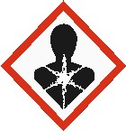
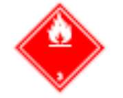

# Ficha de Datos de Seguridad - Esmalte Uretano AR Comp. A

## Metadatos

- Fabricante: SIKA
- Archivo fuente: `FDS 36 - Esmalte_Uretano_AR - SIKA.pdf`
- Paginas: 11
- Secciones detectadas: 16 de 16
- Tablas extraidas: 3
- Imagenes extraidas: 8

## Tabla de secciones detectadas

| Seccion | Titulo normalizado | Paginas |
|---:|---|---:|
| 1 | Identificacion de la sustancia o la mezcla y de la sociedad o la empresa | 1 |
| 2 | Identificacion de los peligros | 1-3 |
| 3 | Composicion/informacion sobre los componentes | 3 |
| 4 | Primeros auxilios | 3-4 |
| 5 | Medidas de lucha contra incendios | 4 |
| 6 | Medidas en caso de vertido accidental | 4-5 |
| 7 | Manipulacion y almacenamiento | 5-6 |
| 8 | Controles de exposicion/proteccion individual | 6-7 |
| 9 | Propiedades fisicas y quimicas | 7-8 |
| 10 | Estabilidad y reactividad | 8 |
| 11 | Informacion toxicologica | 8 |
| 12 | Informacion ecologica | 8-9 |
| 13 | Consideraciones relativas a la eliminacion | 9-10 |
| 14 | Informacion relativa al transporte | 10 |
| 15 | Informacion reglamentaria | 10-11 |
| 16 | Otra informacion | 11 |

## Seccion 1: Identificacion de la sustancia o la mezcla y de la sociedad o la empresa

> Nota de trazabilidad: contenido extraido de la pagina 1 del PDF fuente `FDS 36 - Esmalte_Uretano_AR - SIKA.pdf`.

1.1 Identificación del producto

Nombre del producto: Esmalte Uretano AR Comp. A
Código: 100000020025

1.2 Usos pertinentes identificados de la sustancia o de la mezcla y usos desaconsejados

Uso del producto:
- Recubrimiento para superficies metálicas.

1.3 Datos del proveedor de la ficha de datos de seguridad
Fabricante/ Distribuidor: Sika Colombia S.A.S.
Vereda Canavita km 20.5 Autopista Norte
Tocancipá, Cundinamarca
Colombia
col.sika.com
Número de Teléfono: (+571) 878 – 6333
Número de Fax: (+571) 878 – 6666
Dirección de email del responsable: controlcalidad.lab@co.sika.com
de esta FDS

1.4 En caso de emergencia: CISPROQUIM
Bogotá: 2886012 / 2886355
Resto del país: 01 8000 916012

### Imagenes extraidas de esta seccion

#### Imagen `sika__fds-36-esmalte-uretano-ar-sika__p001_img01`


> Nota de trazabilidad: imagen `sika__fds-36-esmalte-uretano-ar-sika__p001_img01` extraida de la pagina 1, asociada a la Seccion 1 por proximidad espacial y metadatos de pagina. Tipo detectado: logo_encabezado. Hash SHA-256: 7d2d3f3e8f8821cfaadaded55d9bf0bcd885c54fa14ced1f81408d96d56b6dcf.

**Texto OCR de la imagen:**

```text
BUILDING TRUST
```


## Seccion 2: Identificacion de los peligros

> Nota de trazabilidad: contenido extraido de la pagina 1 a la pagina 3 del PDF fuente `FDS 36 - Esmalte_Uretano_AR - SIKA.pdf`.

2.1 Clasificación de la sustancia o de la mezcla
Clasificación SGA
Líquidos inflamables: Categoría 3

Corrosión o irritación cutáneas: Categoría 3

Sensibilización cutánea: Categoría 1

Toxicidad específica en determinados
órganos – exposición única: Categoría 3 (Sistema nervioso central)

Peligro de aspiración: Categoría 1

Peligro a corto plazo (agudo) para el medio
ambiente acuático: Categoría 3

Peligro a largo plazo (crónico) para el medio
ambiente acuático: Categoría 3

2.2 Elementos de la etiqueta GHS
Pictogramas de peligro:

Palabra de advertencia: Peligro

Indicaciones de peligro: H226 Líquidos y vapores inflamables.
H304 Puede ser mortal en caso de ingestión y penetración en las vías respiratorias.
H316 Provoca una leve irritación cutánea.
H317 Puede provocar una reacción alérgica en la piel.
H336 Puede provocar somnolencia o vértigo.
H412 Nocivo para los organismos acuáticos, con efectos nocivos duraderos.
Consejos de prudencia: Prevención:
P201 Procurarse las instrucciones antes del uso.
P202 No manipular antes de haber leído y comprendido todas las precauciones de seguridad.
P210 Mantener alejado del calor, de superficies calientes, de chispas, de llamas abiertas y de
cualquier otra fuente de ignición. No fumar.
P233 Mantener el recipiente herméticamente cerrado.
P240 Toma de tierra y enlace equipotencial del recipiente y del equipo receptor.
P241 Utilizar material eléctrico/ de ventilación/ iluminación/antideflagrante.
P242 No utilizar herramientas que produzcan chispas.
P243 Tomar medidas de precaución contra las descargas electrostáticas.
P260 No respirar el polvo/ el humo/ el gas/ la niebla/ los vapores/ el aerosol.
P271 Utilizar únicamente en exteriores o en un lugar bien ventilado.
P272 Las prendas de trabajo contaminadas no podrán sacarse del lugar de trabajo.
P273 Evitar su liberación al medio ambiente.
P280 Llevar guantes/ prendas/ gafas/ máscara de protección.
Intervención:
P301 + P310 EN CASO DE INGESTIÓN: Llamar inmediatamente a un CENTRO DE
TOXICOLOGÍA/médico.
P303 + P361 + P353 EN CASO DE CONTACTO CON LA PIEL (o el pelo): Quitar inmediatamente
toda la ropa contaminada. Enjuagar la piel con agua.
P304 + P340 + P312 EN CASO DE INHALACIÓN: Transportar a la persona al aire libre y
mantenerla en una posición que le facilite la respiración. Llamar a un CENTRO DE
TOXICOLOGÍA/médico si la persona se encuentra mal.
P308 + P313 EN CASO DE exposición demostrada o supuesta: consultar a un médico.
P331 NO provocar el vómito.
P333 + P313 En caso de irritación o erupción cutánea: Consultar a un médico.
P362 + P364 Quitar las prendas contaminadas y lavarlas antes de volver a usarlas.
P370 + P378 En caso de incendio: Utilizar arena seca, producto químico seco o espuma
resistente al alcohol para la extinción.
Almacenamiento:
P403 + P233 Almacenar en un lugar bien ventilado. Mantener el recipiente cerrado
herméticamente.
P403 + P235 Almacenar en un lugar bien ventilado. Mantener en lugar fresco.
P405 Guardar bajo llave.
Eliminación:
P501 Eliminar el contenido/ el recipiente en una planta de eliminación de residuos autorizada.

2.3 Ingredientes peligrosos
Acetato de butilo

### Imagenes extraidas de esta seccion

#### Imagen `sika__fds-36-esmalte-uretano-ar-sika__p002_img01`


> Nota de trazabilidad: imagen `sika__fds-36-esmalte-uretano-ar-sika__p002_img01` extraida de la pagina 2, asociada a la Seccion 2 por proximidad espacial y metadatos de pagina. Tipo detectado: pictograma_o_simbolo. Hash SHA-256: 08bbec1f061a6705cb13a86f5e32f2d7f153354927e3a77fff4e991559383627.

**Texto OCR de la imagen:**

```text
OCR sin texto legible.
```

#### Imagen `sika__fds-36-esmalte-uretano-ar-sika__p002_img02`



> Nota de trazabilidad: imagen `sika__fds-36-esmalte-uretano-ar-sika__p002_img02` extraida de la pagina 2, asociada a la Seccion 2 por proximidad espacial y metadatos de pagina. Tipo detectado: pictograma_o_simbolo. Hash SHA-256: 9c1264c01db91ea958fc5ee3a07579f593ce45887660c7ab1376dcbcbe5df1a0.

**Texto OCR de la imagen:**

```text
OCR sin texto legible.
```

#### Imagen `sika__fds-36-esmalte-uretano-ar-sika__p002_img03`


> Nota de trazabilidad: imagen `sika__fds-36-esmalte-uretano-ar-sika__p002_img03` extraida de la pagina 2, asociada a la Seccion 2 por proximidad espacial y metadatos de pagina. Tipo detectado: pictograma_o_simbolo. Hash SHA-256: 59c16a6b564cfe6068c0c4867a2617099f3f781d2da9d69f3345e1f9e6f39728.

**Texto OCR de la imagen:**

```text
OCR sin texto legible.
```


## Seccion 3: Composicion/informacion sobre los componentes

> Nota de trazabilidad: contenido extraido de la pagina 3 del PDF fuente `FDS 36 - Esmalte_Uretano_AR - SIKA.pdf`.

Sustancia/preparado: Mezcla
Familia química/: Poliacrilato conteniendo solventes

Nombre del producto o ingrediente Identificadores %
Acetato de butilo
CAS: 123-86-4

Xileno
CAS: 1330-20-7

nafta disolvente (petróleo), fracción aromática ligera
CAS: 64742-95-6

Etilbenceno
CAS: 100-41-4

sebacato de metilo y 1,2,2,6,6-pentametil-4-piperidilo
CAS: 82919-37-7

Metacrilato de metilo
CAS: 80-62-6
10% - 20%

5% - 10%

2% - 5%

1% - 5%

0.25% - 1%

0.1% - 1%
No hay ningún ingrediente adicional presente que, bajo el conocimiento actual del proveedor y en las concentraciones aplicables, sea
clasificado como de riesgo para la salud o el medio ambiente, como PBT o mPmB o tenga asignado un límite de exposición laboral y por
lo tanto deban ser reportados en esta sección.

### Tablas extraidas de esta seccion

#### Tabla `sika__fds-36-esmalte-uretano-ar-sika__p003_tbl01`

|Nombre del producto o ingrediente Identificadores|%|
|---|---|
|Acetato de butilo<br>CAS: 123-86-4<br>Xileno<br>CAS: 1330-20-7<br>nafta disolvente (petróleo), fracción aromática ligera<br>CAS: 64742-95-6<br>Etilbenceno<br>CAS: 100-41-4<br>sebacato de metilo y 1,2,2,6,6-pentametil-4-piperidilo<br>CAS: 82919-37-7<br>Metacrilato de metilo<br>CAS: 80-62-6|10% - 20%<br>5% - 10%<br>2% - 5%<br>1% - 5%<br>0.25% - 1%<br>0.1% - 1%|

> Nota de trazabilidad: tabla `sika__fds-36-esmalte-uretano-ar-sika__p003_tbl01` extraida de la pagina 3, asociada a la Seccion 3 por proximidad espacial y metadatos de pagina.


## Seccion 4: Primeros auxilios

> Nota de trazabilidad: contenido extraido de la pagina 3 a la pagina 4 del PDF fuente `FDS 36 - Esmalte_Uretano_AR - SIKA.pdf`.

4.1 Descripción de los primeros auxilios
Recomendaciones generales: Retirar a la persona de la zona peligrosa.
Consultar a un médico.
Mostrar esta ficha de seguridad al doctor que esté de servicio.

Si es inhalado: Trasladarse a un espacio abierto.
Consultar a un médico después de una exposición importante.

En caso de contacto con la piel: Quítese inmediatamente la ropa y zapatos contaminados.
Eliminar lavando con jabón y mucha agua.
Si los síntomas persisten consultar a un médico.

En caso de contacto con los ojos: Retirar las lentillas.
Manténgase el ojo bien abierto mientras se lava.
Si persiste la irritación de los ojos, consultar a un especialista.

Por ingestión: Lavar la boca con agua y después beber agua abundante.
No provocar el vómito.
No dar leche ni bebidas alcohólicas.
Nunca debe administrarse nada por la boca a una persona inconsciente.

4.2 Principales síntomas y efectos, Riesgo de daño serio a los pulmones (por aspiración).
agudos y retardados: Efectos sensibilizantes
Aspiración puede causar edema pulmonar y neumonía.
Reacciones alérgicas

Pérdida de balance
Vértigo
Ver la Sección 11 para obtener información detallada sobre la salud y los síntomas.

4.3 Notas para el médico: Tratar sintomáticamente. Contactar un especialista en tratamientos de envenenamientos
inmediatamente si se ha ingerido o inhalado una gran cantidad.

Tratamientos específicos: No hay un tratamiento específico.

## Seccion 5: Medidas de lucha contra incendios

> Nota de trazabilidad: contenido extraido de la pagina 4 del PDF fuente `FDS 36 - Esmalte_Uretano_AR - SIKA.pdf`.

5.1 Medios de extinción
Características inflamables
Punto de inflamación: 23 °C
Método: Copa cerrada

Medios de extinción Utilizar polvos químicos secos, CO₂, agua pulverizada (niebla de agua) o espuma.
Apropiados:

Medios de extinción no Agua
apropiados: No use un chorro compacto de agua ya que puede dispersar y extender el fuego.

5.2 Peligros específicos derivados de la sustancia o la mezcla
Peligros derivados de la La presión puede aumentar y el contenedor puede explotar en caso de calentamiento o
sustancia o mezcla: incendio.

Productos de Los productos de descomposición pueden incluir los siguientes materiales
descomposición térmica dióxido de carbono
peligrosos: monóxido de carbono

5.3 Recomendaciones para el personal de lucha contra incendios
Medidas especiales que En caso de incendio, aislar rápidamente la zona, evacuando a todas las personas de las
deben tomar los equipos proximidades del lugar del incidente. Este material es nocivo para organismos acuáticos.
de lucha contra incendios: Se debe impedir que el agua de extinción de incendios contaminada con este material entre
en vías de agua, drenajes o alcantarillados.

Equipo de protección Los bomberos deben llevar equipo de protección apropiado y un equipo de respiración
especial para el personal autónomo con una máscara facial completa que opere en modo de presión positiva.
de lucha contra incendios: Las prendas para bomberos (incluidos cascos, guantes y botas de protección) conformes a la
norma europea EN 469 proporcionan un nivel básico de protección en caso de incidente
químico.

## Seccion 6: Medidas en caso de vertido accidental

> Nota de trazabilidad: contenido extraido de la pagina 4 a la pagina 5 del PDF fuente `FDS 36 - Esmalte_Uretano_AR - SIKA.pdf`.

6.1 Precauciones personales, equipo de protección y procedimientos de emergencia
Para el personal que no No se debe realizar ninguna acción que suponga un riesgo personal o sin formación adecuada.
forma parte de los Evacuar los alrededores. No permitir el ingreso de personal innecesario y sin protección.
servicios de emergencia: No tocar o caminar sobre el material derramado. Evitar respirar vapor o neblina.
Proporcionar ventilación adecuada. Llevar un aparato de respiración apropiado cuando el
sistema de ventilación sea inadecuado. Llevar puesto un equipo de protección individual
adecuado.

Para el personal de Si se necesitan prendas especiales para gestionar el vertido, tomar en cuenta las informacio-
emergencia: nes recogidas en la Sección 8 en relación con los materiales adecuados y no adecuados.
Consultar también en la Sección 8 la información adicional sobre medidas higiénicas.

6.2 Precauciones relativas Evitar la dispersión del material derramado, su contacto con el suelo, las vías fluviales, las
al medio ambiente: tuberías de desagüe y las alcantarillas. Informar a las autoridades pertinentes si el producto
ha causado contaminación medioambiental (alcantarillas, vías fluviales, suelo o aire).
Material contaminante del agua.

6.3 Métodos y material de Detener la fuga si esto no presenta ningún riesgo. Retirar los envases del área del derrame.
contención y de limpieza Evitar que se introduzca en alcantarillas, canales de agua, sótanos o áreas reducidas.
Detener y recoger los derrames con materiales absorbentes no combustibles, como arena,
tierra, vermiculita o tierra de diatomeas, y colocar el material en un envase para desecharlo
de acuerdo con las normativas locales (ver Sección 13).

6.4 Referencia a otras Consultar en la Sección 1 la información de contacto en caso de emergencia.
Secciones Consultar en la Sección 8 la información relativa a equipos de protección personal apropiados.
Consultar en la Sección 13 la información adicional relativa al tratamiento de residuos.

## Seccion 7: Manipulacion y almacenamiento

> Nota de trazabilidad: contenido extraido de la pagina 5 a la pagina 6 del PDF fuente `FDS 36 - Esmalte_Uretano_AR - SIKA.pdf`.

7.1 Precauciones para una manipulación segura
Medidas de protección: Utilizar un equipo a prueba de explosiones.
Mantener alejado del calor/ de chispas/ de llamas al descubierto/ de superficies calientes.
Tomar medidas de precaución contra la acumulación de cargas electrostáticas.

Información relativa a No respirar los vapores ni la niebla de la pulverización.
higiene en el trabajo de Evitar sobrepasar los límites dados de exposición profesional (ver sección 8).
forma general Evitar todo contacto con los ojos, la piel o la ropa.
Ver sección 8 para el equipo de protección personal.
Las personas que hayan tenido problemas de sensibilización de la piel, asma, alergias,
enfermedades respiratorias crónicas o recurrentes, no deben ser empleadas en ninguna parte
del proceso en la cual esté utilizada esta preparación.
Fumar, comer y beber debe prohibirse en el área de aplicación.
Tomar medidas de precaución contra las descargas electrostáticas.
Abrir el tambor con precaución, ya que el contenido puede estar presurizado.
Adoptar las acciones necesarias para evitar descargas de electricidad estática (que podrían
ocasionar la inflamación de los vapores orgánicos).
Cuando se manejen productos químicos, siga las medidas estándar de higiene.

7.2 Condiciones de almacenamiento seguro, incluidas posibles incompatibilidades
Almacenar en el envase original. Mantener en un lugar bien ventilado.
Los contenedores que se abren deben ser cuidadosamente resellados y mantenerlos en posición vertical para evitar fugas.
Observar las indicaciones de la etiqueta. Almacenar en conformidad con la reglamentación local.

7.3 Usos específicos finales
Recomendaciones: No disponible.
Soluciones específicas del: No disponible.
sector industrial

## Seccion 8: Controles de exposicion/proteccion individual

> Nota de trazabilidad: contenido extraido de la pagina 6 a la pagina 7 del PDF fuente `FDS 36 - Esmalte_Uretano_AR - SIKA.pdf`.

La información recogida en esta sección contiene consejos e indicaciones generales. La información que se proporciona está basada en
los usos habituales anticipados para el producto. Puede ser necesario tomar medidas adicionales para su manipulación a granel u otros
usos que pudieran aumentar de manera significativa la exposición de los trabajadores o la liberación al medio ambiente.

8.1 Parámetros de control
Límites de exposición profesional
Nombre del producto o ingrediente Valores límite de la exposición Bases
Acetato de n-butilo
CAS: 123-86-4

Xileno
CAS: 1330-20-7
TWA: 50 ppm
STEL: 150 ppm.

TWA: 100 ppm
STEL: 150 ppm
ACGIH
ACGIH

ACGIH
ACGIH

Procedimientos Si este producto contiene ingredientes con límites de exposición, puede ser necesaria la su-
recomendados de control: pervisión personal, del ambiente de trabajo o biológica para determinar la efectividad de la
ventilación o de otras medidas de control y/o la necesidad de usar un equipo de protección
respiratoria.
Se debe hacer referencia al Estándar Europeo EN 689 para los métodos de evaluación de la
exposición por inhalación a agentes químicos y a las recomendaciones nacionales sobre los
métodos de determinación de sustancias peligrosas.

Valores DNEL/DMEL
No hay valores DEL disponibles.
Valor PNEC
No hay valores PEC disponibles.

8.2 Controles de la exposición
Controles técnicos Si la operación genera polvo, humos, gas, vapor o llovizna, use cercamientos del proceso,
ventilación local, u otros controles de ingeniería para mantener la exposición del obrero a los
contaminantes aerotransportados por debajo de todos los límites recomendados o
estatutarios.

Medidas de protección individual
Medidas higiénicas: Lavar las manos, antebrazos y cara completamente después de manejar productos
químicos, antes de comer, fumar y usar el lavabo y al final del período de trabajo.
Usar las técnicas apropiadas para eliminar ropa contaminada.
Lavar las ropas contaminadas antes de volver a usarlas.

Protección de los ojos/la Cara: Se debe usar un equipo protector ocular que cumpla con las normas aprobadas cuando una
evaluación del riesgo indique que es necesario, a fin de evitar toda exposición a salpicaduras
del líquido, lloviznas, gases o polvos.

Protección de la piel
Protección de las manos: Si una evaluación del riesgo indica que es necesario, se deben usar guantes químico-
resistentes e impenetrables que cumplan con las normas aprobadas siempre que se manejen
productos químicos. Número de referencia EN 374.
Adecuados para periodos cortos o para protección contra salpicaduras: Guantes de goma de
butilo/nitrilo. (0,4 mm), tiempo de detección <30 min. Desechar los guantes contaminados.
Adecuado para exposición permanente: Guantes Vitón (0,4mm), tiempo de detección >30
min.

Protección corporal: Antes de utilizar este producto se debe seleccionar equipo protector personal para el cuerpo
basándose en la tarea a ejecutar y los riesgos involucrados y debe ser aprobado por un
especialista. Recomendado: Protección preventiva de la piel con pomada protectora.

Otro tipo de protección Se debe elegir el calzado adecuado y cualquier otra medida de protección cutánea necesaria
Cutánea: dependiendo de la tarea que se lleve a cabo y de los riesgos implicados.
Tales medidas deben ser aprobadas por un especialista antes de proceder a la manipulación
de este producto.

Protección respiratoria: Utilice protección respiratoria a menos que exista una ventilación de escape adecuada o que
la evaluación de la exposición indique que el nivel de exposición está dentro de las pautas
recomendadas.
Se debe seleccionar el respirador en base a los niveles de exposición reales o previstos, a la
peligrosidad del producto y al grado de seguridad de funcionamiento del respirador elegido.
Filtro de vapor orgánico (Tipo A)
A1: < 1000 ppm; A2: < 5000 ppm; A3: < 10000 ppm

Controles de exposición Se deben verificar las emisiones de los equipos de ventilación o de los procesos de trabajo
Medioambiental: para verificar que cumplen con los requisitos de la legislación de protección del
medioambiente. En algunos casos para reducir las emisiones hasta un nivel aceptable, será
necesario usar depuradores de humo, filtros o modificar el diseño del equipo del proceso.

### Tablas extraidas de esta seccion

#### Tabla `sika__fds-36-esmalte-uretano-ar-sika__p006_tbl01`

|8.1 Parámetros de control Límites de exposición profesional|Col2|Col3|
|---|---|---|
|**Nombre delproducto o ingrediente**|**Valores límite de la exposición**|**Bases**|
|Acetato de n-butilo<br>CAS: 123-86-4<br>Xileno<br>CAS: 1330-20-7|TWA: 50 ppm<br>STEL: 150 ppm.<br>TWA: 100 ppm<br>STEL: 150ppm|ACGIH<br>ACGIH<br>ACGIH<br>ACGIH|

> Nota de trazabilidad: tabla `sika__fds-36-esmalte-uretano-ar-sika__p006_tbl01` extraida de la pagina 6, asociada a la Seccion 8 por proximidad espacial y metadatos de pagina.


## Seccion 9: Propiedades fisicas y quimicas

> Nota de trazabilidad: contenido extraido de la pagina 7 a la pagina 8 del PDF fuente `FDS 36 - Esmalte_Uretano_AR - SIKA.pdf`.

9.1 Información sobre propiedades físicas y químicas básicas
Aspecto
Estado físico: Líquido viscoso
Color: Varios
Olor: A Solvente
Umbral olfativo: No disponible
pH: No disponible
Punto de fusión/punto de
Congelación: No disponible
Punto inicial de ebullición e
intervalo de ebullición: No disponible
Punto de inflamación: 23 °C - 37.8 °C copa cerrada (ASTM D3278)
Tasa de evaporación No disponible
Inflamabilidad (sólido, gas): No disponible
Tiempo de Combustión: No aplicable
Velocidad de Combustión: No aplicable
Límite superior de explosividad: 7 %(v)
Límites inferior de explosividad: 1 %(v)
Presión de vapor: 12,4989 hPa (9,375 mmHg)
Densidad de vapor: No disponible
Densidad: ~1.19 g/cm³ (20°C)
Densidad relativa: No disponible
Solubilidad(es): El producto no es soluble en agua
Coeficiente de reparto noctanol/agua: No disponible
Temperatura de autoinflamación: 333 °C
Temperatura de descomposición: No disponible
Viscosidad: No disponible
Propiedades explosivas: No disponible
Propiedades comburentes: No disponible

9.2 Información adicional
Ninguna información adicional

## Seccion 10: Estabilidad y reactividad

> Nota de trazabilidad: contenido extraido de la pagina 8 del PDF fuente `FDS 36 - Esmalte_Uretano_AR - SIKA.pdf`.

10.1 Reactividad: No hay datos de ensayo disponibles sobre la reactividad de este producto o sus
componentes.

10.2 Estabilidad química: El producto es estable.

10.3 Posibilidad de reacciones En condiciones normales de almacenamiento y uso, no se producen reacciones peligrosas.
peligrosas: Los vapores pueden formar una mezcla explosiva con el aire.

10.4 Condiciones que deben Calor, llamas y chispas.
evitarse:

10.5 Materiales incompatibles: Ningún dato específico

10.6 Productos de descomposición En condiciones normales de almacenamiento y uso, no se deberían formar productos de
peligrosos: descomposición peligrosa.

## Seccion 11: Informacion toxicologica

> Nota de trazabilidad: contenido extraido de la pagina 8 del PDF fuente `FDS 36 - Esmalte_Uretano_AR - SIKA.pdf`.

11.1 Información sobre los efectos toxicológicos
Toxicidad aguda
Acetato de n-butilo:
Toxicidad oral aguda: DL50 Oral (Rata): > 5.000 mg/kg
Toxicidad aguda por inhalación: CL50 (Rata): 23,4 mg/l
Tiempo de exposición: 4 h
Prueba de atmosfera: vapor
Toxicidad cutánea aguda: DL50 cutánea (Conejo): > 5.000 mg/kg

Xileno:
Toxicidad oral aguda: DL50 Oral (Rata): 3.523 mg/kg
Toxicidad cutánea aguda: DL50 cutánea (Conejo): 1.700 mg/kg

Nafta disolvente (petróleo), fracción aromática ligera:
Toxicidad oral aguda: DL50 Oral (Rata): > 2.000 mg/kg
Toxicidad cutánea aguda: DL50 cutánea (Conejo): > 2.000 mg/kg

Metacrilato de metilo:
Toxicidad oral aguda: DL50 Oral (Rata): > 5.000 mg/kg
Toxicidad aguda por inhalación: CL50 (Rata): 29,8 mg/l
Tiempo de exposición: 4 h

Toxicidad dérmica aguda: LD50 Dérmico (Conejo): > 5.000 mg/kg

## Seccion 12: Informacion ecologica

> Nota de trazabilidad: contenido extraido de la pagina 8 a la pagina 9 del PDF fuente `FDS 36 - Esmalte_Uretano_AR - SIKA.pdf`.

12.1 Toxicidad
Acetato de n-butilo:
Toxicidad para las algas: CE50 (Desmodesmus subspicatus (alga verde)): 647,7 mg/l
Tiempo de exposición: 72 h

Xileno:
Toxicidad para los peces: CL50 (Oncorhynchus mykiss (Trucha irisada)): 3,3 mg/l
Tiempo de exposición: 96 h

Nafta disolvente (petróleo), fracción aromática ligera:
Toxicidad para las algas: (Pseudokirchneriella subcapitata (alga verde)): 2,6 - 2,9 mg/l
Tiempo de exposición: 72 h
Metacrilato de metilo:
Toxicidad para peces: CL50 (Oncorhynchus mykiss (trucha irisada)): > 79 mg/l
Tiempo de exposición: 96 h
Método: Directrices de prueba OECD 203
NOEC (Danio rerio (pez zebra)): 9,4 mg/l

Toxicidad para la dafnia y otros
invertebrados acuáticos: CE50 (Daphnia magna (Pulga de mar grande)): 69 mg/l
Tiempo de exposición: 48 h
Método: Directriz de Prueba de la OCDE 202
NOEC: 37 mg/l
Tiempo de exposición: 21 d
Método: Directriz de Prueba de la OCDE 202

12.2 Persistencia y degradabilidad
Conclusión/resumen: No disponible.

12.3 Potencial de bioacumulación
Conclusión/resumen: No disponible.

12.4 Movilidad en el suelo
Coeficiente de partición: No disponible.
tierra/agua (KOC)

MOVILIDAD: No disponible.

12.5 Resultados de la valoración PBT y mPmB
PBT: No aplicable
mPmB: No aplicable.

12.6 Otros efectos adversos: Nocivo para los organismos acuáticos, con efectos nocivos duraderos.

## Seccion 13: Consideraciones relativas a la eliminacion

> Nota de trazabilidad: contenido extraido de la pagina 9 a la pagina 10 del PDF fuente `FDS 36 - Esmalte_Uretano_AR - SIKA.pdf`.

13.1 Métodos para el tratamiento de residuos
Producto
Métodos de eliminación: Evitar o minimizar la generación de residuos cuando sea posible. La eliminación de este
producto, sus soluciones y cualquier derivado deben cumplir siempre con los requisitos de la
legislación de protección del medio ambiente y eliminación de desechos y todos los requisitos
de las autoridades locales. Desechar los sobrantes y productos no reciclables por medio de
un contratista autorizado a su eliminación. Los residuos no se deben tirar por la alcantarilla
sin tratar a menos que sean compatibles con los requisitos de todas las autoridades con
jurisdicción. Incinerar.

Empaquetado: Envases/ embalajes que no pueden ser limpiados deben ser eliminados de la misma forma
que la sustancia contenida. No reutilizar los recipientes vacíos. No quemar, ni utilizar un
soplete de corte, en el envase vacío.

## Seccion 14: Informacion relativa al transporte

> Nota de trazabilidad: contenido extraido de la pagina 10 del PDF fuente `FDS 36 - Esmalte_Uretano_AR - SIKA.pdf`.

ADR/RID-ADN IMDG IATA
14.1 Número ONU UN1263 UN1263 UN1263
14.2 Designación oficial de
transporte de las Naciones
Unidas
Pintura Pintura Pintura
14.3 Clase(s) de peligro para
el transporte
3

3

3

14.4 Grupo de embalaje III III III
14.5 Peligros para el medio
ambiente
No No No
14.6 Información adicional Previsiones especiales
640(E)

Código para túneles
(E)
Emergency schedules (EmS)
F-E, S-E
-
Código de clasificación F1

14.7 Transporte a granel: No disponible
con arreglo al anexo II del
Convenio Marpol 73/78 y del
Código IBC

### Tablas extraidas de esta seccion

#### Tabla `sika__fds-36-esmalte-uretano-ar-sika__p010_tbl01`

|SECCIÓN 14: Información relativa al transporte|Col2|Col3|Col4|
|---|---|---|---|
||**ADR/RID-ADN**|**IMDG**|**IATA**|
|**14.1 Número ONU**|UN1263|UN1263|UN1263|
|**14.2 Designación oficial de**<br>**transporte de las Naciones**<br>**Unidas**|Pintura|Pintura|Pintura|
|**14.3 Clase(s) de peligro para**<br>**el transporte**|3|3|3|
|**14.4 Grupo de embalaje **|III|III|III|
|**14.5 Peligros para el medio**<br>**ambiente**|No|No|No|
|**14.6 Información adicional**|**Previsiones especiales**<br>640(E)<br>**Código para túneles**<br>**(E)**|**Emergency schedules (EmS)**<br>F-E, S-E|-|
|**Código de clasificación**|F1|||

> Nota de trazabilidad: tabla `sika__fds-36-esmalte-uretano-ar-sika__p010_tbl01` extraida de la pagina 10, asociada a la Seccion 14 por proximidad espacial y metadatos de pagina.


### Imagenes extraidas de esta seccion

#### Imagen `sika__fds-36-esmalte-uretano-ar-sika__p010_img01`


> Nota de trazabilidad: imagen `sika__fds-36-esmalte-uretano-ar-sika__p010_img01` extraida de la pagina 10, asociada a la Seccion 14 por proximidad espacial y metadatos de pagina. Tipo detectado: pictograma_o_simbolo. Hash SHA-256: 1ab6ff1289340b4cabb672857d2d8ffe692bd0e9a648bd8f50e71f00175d1665.

**Texto OCR de la imagen:**

```text
OCR sin texto legible.
```

#### Imagen `sika__fds-36-esmalte-uretano-ar-sika__p010_img02`



> Nota de trazabilidad: imagen `sika__fds-36-esmalte-uretano-ar-sika__p010_img02` extraida de la pagina 10, asociada a la Seccion 14 por proximidad espacial y metadatos de pagina. Tipo detectado: pictograma_o_simbolo. Hash SHA-256: a3b0c178725786f9a017757d025f6971cf506f1df2bdd466ab1e905cffb32bc6.

**Texto OCR de la imagen:**

```text
OCR sin texto legible.
```

#### Imagen `sika__fds-36-esmalte-uretano-ar-sika__p010_img03`


> Nota de trazabilidad: imagen `sika__fds-36-esmalte-uretano-ar-sika__p010_img03` extraida de la pagina 10, asociada a la Seccion 14 por proximidad espacial y metadatos de pagina. Tipo detectado: pictograma_o_simbolo. Hash SHA-256: d5436549017ae24e6a5f0d7ab427ac08b8711ce6908739f8676e1dbcdd24344d.

**Texto OCR de la imagen:**

```text
OCR sin texto legible.
```


## Seccion 15: Informacion reglamentaria

> Nota de trazabilidad: contenido extraido de la pagina 10 a la pagina 11 del PDF fuente `FDS 36 - Esmalte_Uretano_AR - SIKA.pdf`.

15.1 Reglamentación y legislación en materia de seguridad, salud y medio ambiente específicos para la sustancia o la mezcla
Reglamento de la UE (CE) nº. 1907/2006 (REACH)
Anexo XIV - Lista de sustancias sujetas a autorización
Anexo XIV
Ninguno de los componentes está listado.
Sustancias altamente preocupantes
Ninguno de los componentes está listado.

Contenido de COV (EU): VOC (w/w): 13.22%

Legislación nacional
NTC 1692:1998, Transporte de mercancías peligrosas. Clasificación, etiquetado y rotulado.
Norma técnica NTC-ISO 5500 gestión del transporte de carga terrestre.
Ley 55 del 2 de julio de 1993, Convenio número 170 y la Recomendación número 177 sobre la Seguridad en la Utilización de los
Productos Químicos en el Trabajo.
Decreto 1609 de 2002 Por el cual se reglamenta el manejo y transporte terrestre automotor de mercancías peligrosas por carretera.

Clase de almacenamiento:
NTC 3972:1996, Transporte de mercancías peligrosas clase 9. Sustancias peligrosas varias. Transporte terrestre por carretera.
Requisitos generales para el transporte. Segregación.

15.2 Evaluación de la seguridad química:
No hay datos disponibles

## Seccion 16: Otra informacion

> Nota de trazabilidad: contenido extraido de la pagina 11 del PDF fuente `FDS 36 - Esmalte_Uretano_AR - SIKA.pdf`.

Indica la información que ha cambiado desde la edición de la versión anterior.
Abreviaturas y acrónimos: ETA = Estimación de Toxicidad Aguda
CLP = Reglamento sobre Clasificación, Etiquetado y Envasado [Reglamento (CE)
No 1272/2008]
DNEL = Nivel sin efecto derivado
Indicación EUH = Indicación de Peligro específica del CLP
PNEC = Concentración Prevista Sin Efecto
RRN = Número de Registro REACH

Aviso al lector
La información contenida en esta ficha de datos de seguridad corresponde a nuestro nivel de conocimiento en el momento de su
publicación. Quedan excluidas todas las garantías. Se aplicaran nuestras condiciones generales de venta en vigor. Por favor, consulte
la Hoja de Datos del Producto antes de su uso y procesamiento.

### Imagenes extraidas de esta seccion

#### Imagen `sika__fds-36-esmalte-uretano-ar-sika__p011_img01`


> Nota de trazabilidad: imagen `sika__fds-36-esmalte-uretano-ar-sika__p011_img01` extraida de la pagina 11, asociada a la Seccion 16 por proximidad espacial y metadatos de pagina. Tipo detectado: icono_o_marca_pequena. Hash SHA-256: fed53e82549ea615da848c9516413af7cb588eafba5ba73bff75504aa1958fb3.

**Texto OCR de la imagen:**

```text
OCR sin texto legible.
```
