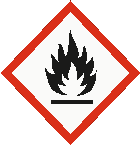

# Ficha de Datos de Seguridad - Sikafloor®-2430 Part A

## Metadatos

- Fabricante: SIKA
- Archivo fuente: `FDS 71 -  Sikafloor®-2430  Part A - SIKA.pdf`
- Paginas: 13
- Secciones detectadas: 16 de 16
- Tablas extraidas: 4
- Imagenes extraidas: 19

## Tabla de secciones detectadas

| Seccion | Titulo normalizado | Paginas |
|---:|---|---:|
| 1 | Identificacion de la sustancia o la mezcla y de la sociedad o la empresa | 1 |
| 2 | Identificacion de los peligros | 1-3 |
| 3 | Composicion/informacion sobre los componentes | 3 |
| 4 | Primeros auxilios | 3-4 |
| 5 | Medidas de lucha contra incendios | 4 |
| 6 | Medidas en caso de vertido accidental | 4-5 |
| 7 | Manipulacion y almacenamiento | 5 |
| 8 | Controles de exposicion/proteccion individual | 5-7 |
| 9 | Propiedades fisicas y quimicas | 7-8 |
| 10 | Estabilidad y reactividad | 8-9 |
| 11 | Informacion toxicologica | 9-10 |
| 12 | Informacion ecologica | 10 |
| 13 | Consideraciones relativas a la eliminacion | 10 |
| 14 | Informacion relativa al transporte | 10-11 |
| 15 | Informacion reglamentaria | 11-12 |
| 16 | Otra informacion | 12-13 |

## Seccion 1: Identificacion de la sustancia o la mezcla y de la sociedad o la empresa

> Nota de trazabilidad: contenido extraido de la pagina 1 del PDF fuente `FDS 71 -  Sikafloor®-2430  Part A - SIKA.pdf`.

PROVEEDOR O FABRICANTE
Nombre del producto

: Sikafloor®-2430 Part A

Informaciones sobre el fabricante o el proveedor
Compañía

: Sika Colombia S.A.S.
Vereda Canavita km 20,5 Autopista Norte
Tocancipá, Cundinamarca
Colombia

Teléfono

: (57-1) 8786333

Teléfono de emergencia

: CISPROQUIM
Bogotá: 2886012 / 2886355
Resto del país: 01 8000 916012

Dirección de correo electróni-
co

: controlcalidad.lab@co.sika.com

Fax

: (57-1) 8786660

Uso recomendado del producto químico y restricciones de uso
Uso del producto : Revestimiento de epoxi

### Imagenes extraidas de esta seccion

#### Imagen `sika__fds-71-sikafloor-2430-part-a-sika__p001_img01`


> Nota de trazabilidad: imagen `sika__fds-71-sikafloor-2430-part-a-sika__p001_img01` extraida de la pagina 1, asociada a la Seccion 1 por proximidad espacial y metadatos de pagina. Tipo detectado: pictograma_o_simbolo. Hash SHA-256: 4c80c7acb431e9fe61ac3587491660fe82d98b4e21fa6203580c99106a7d7be1.

**Texto OCR de la imagen:**

```text
OCR sin texto legible.
```


## Seccion 2: Identificacion de los peligros

> Nota de trazabilidad: contenido extraido de la pagina 1 a la pagina 3 del PDF fuente `FDS 71 -  Sikafloor®-2430  Part A - SIKA.pdf`.

Clasificación según SGA (GHS)
Líquidos Inflamables

: Categoría 3
Corrosión/irritación cutáneas

: Categoría 2
Lesiones oculares gra-
ves/irritación ocular

: Categoría 1
Sensibilización cutánea

: Categoría 1
Toxicidad a la reproducción

: Categoría 2
Toxicidad sistémica específi-
ca de órganos blanco - Expo-
siciones repetidas
(Inhalación)

: Categoría 2
Peligro a corto plazo (agudo)
para el medio ambiente acuá-
tico

: Categoría 3
FICHA DE DATOS DE SEGURIDAD

Versión 3.0 Número de HDS: 100000030164 Fecha de revisión: 2023/08/15

Etiqueta SGA (GHS)
Pictogramas de peligro

:

Palabra de advertencia

: Peligro

Indicaciones de peligro

: H226 Líquido y vapores inflamables.
H315 Provoca irritación cutánea.
H317 Puede provocar una reacción cutánea alérgica.
H318 Provoca lesiones oculares graves.
H361d Susceptible de dañar al feto.
H373 Puede provocar daños en los órganos tras exposiciones
prolongadas o repetidas por inhalación.
H402 Nocivo para los organismos acuáticos.

Consejos de prudencia

: Prevención:
P201 Procurarse las instrucciones antes del uso.
P202 No manipular antes de haber leído y comprendido todas
las precauciones de seguridad.
P210 Mantener alejado del calor, chispas, llamas al descubier-
to, superficies calientes y otras fuentes de ignición. No fumar.
P233 Mantener el recipiente herméticamente cerrado.
P240 Toma de tierra y enlace equipotencial del recipiente y del
equipo receptor.
P241 Utilizar material eléctrico, de ventilación o de iluminación/
antideflagrante.
P242 No utilizar herramientas que produzcan chispas.
P243 Tomar medidas de precaución contra las descargas elec-
trostáticas.
P260 No respirar nieblas o vapores.
P264 Lavarse la piel cuidadosamente después de la manipula-
ción.
P272 La ropa de trabajo contaminada no debe salir del lugar
de trabajo.
P273 No dispersar en el medio ambiente.
P280 Usar guantes/ ropa de protección/ equipo de protección
para los ojos/ la cara.
Intervención:
P303 + P361 + P353 EN CASO DE CONTACTO CON LA PIEL
(o el pelo): Quitar inmediatamente toda la ropa contaminada.
Enjuagar la piel con agua.
P305 + P351 + P338 + P310 EN CASO DE CONTACTO CON
LOS OJOS: Enjuagar con agua cuidadosamente durante varios
minutos. Quitar las lentes de contacto cuando estén presentes
y pueda hacerse con facilidad. Proseguir con el lavado. Llamar
inmediatamente a un CENTRO DE TOXICOLOGÍA o a un mé-
dico.
P308 + P313 EN CASO DE exposición demostrada o supues-
ta: consultar a un médico.
P333 + P313 En caso de irritación cutánea o sarpullido: consul-
tar a un médico.
P362 + P364 Quitar la ropa contaminada y lavarla antes de
volverla a usar.
FICHA DE DATOS DE SEGURIDAD

Versión 3.0 Número de HDS: 100000030164 Fecha de revisión: 2023/08/15

P370 + P378 En caso de incendio: Utilizar arena seca, produc-
to químico seco o espuma resistente al alcohol para la extin-
ción.
Almacenamiento:
P403 + P235 Almacenar en un lugar bien ventilado. Mantener
fresco.
P405 Guardar bajo llave.
Eliminación:
P501 Eliminar el contenido/ recipiente en una planta de elimi-
nación de residuos aprobada.

Otros peligros no clasificables
No conocidos.

### Imagenes extraidas de esta seccion

#### Imagen `sika__fds-71-sikafloor-2430-part-a-sika__p002_img01`


> Nota de trazabilidad: imagen `sika__fds-71-sikafloor-2430-part-a-sika__p002_img01` extraida de la pagina 2, asociada a la Seccion 2 por proximidad espacial y metadatos de pagina. Tipo detectado: pictograma_o_simbolo. Hash SHA-256: 4c80c7acb431e9fe61ac3587491660fe82d98b4e21fa6203580c99106a7d7be1.

**Texto OCR de la imagen:**

```text
OCR sin texto legible.
```

#### Imagen `sika__fds-71-sikafloor-2430-part-a-sika__p002_img02`



> Nota de trazabilidad: imagen `sika__fds-71-sikafloor-2430-part-a-sika__p002_img02` extraida de la pagina 2, asociada a la Seccion 2 por proximidad espacial y metadatos de pagina. Tipo detectado: pictograma_o_simbolo. Hash SHA-256: 4568647bb086cafbff551e41b1f08a34c4b79aca88093052b1a4bc02dfbfd777.

**Texto OCR de la imagen:**

```text
OCR sin texto legible.
```

#### Imagen `sika__fds-71-sikafloor-2430-part-a-sika__p002_img03`


> Nota de trazabilidad: imagen `sika__fds-71-sikafloor-2430-part-a-sika__p002_img03` extraida de la pagina 2, asociada a la Seccion 2 por proximidad espacial y metadatos de pagina. Tipo detectado: pictograma_o_simbolo. Hash SHA-256: a470af7c312005eec64988905eb729d74c2d06827510ee3bd6f9529c906298ca.

**Texto OCR de la imagen:**

```text
oy
```

#### Imagen `sika__fds-71-sikafloor-2430-part-a-sika__p002_img04`


> Nota de trazabilidad: imagen `sika__fds-71-sikafloor-2430-part-a-sika__p002_img04` extraida de la pagina 2, asociada a la Seccion 2 por proximidad espacial y metadatos de pagina. Tipo detectado: pictograma_o_simbolo. Hash SHA-256: 33706f4136c962ac6e86b7d3e8701b7b6281a393a07368bf3468ace3dbef620a.

**Texto OCR de la imagen:**

```text
OCR sin texto legible.
```

#### Imagen `sika__fds-71-sikafloor-2430-part-a-sika__p002_img05`


> Nota de trazabilidad: imagen `sika__fds-71-sikafloor-2430-part-a-sika__p002_img05` extraida de la pagina 2, asociada a la Seccion 2 por proximidad espacial y metadatos de pagina. Tipo detectado: pictograma_o_simbolo. Hash SHA-256: 99ba0d97ca0c32d267af5bdeffe4feaf504b283ae776af4602f870659961dba0.

**Texto OCR de la imagen:**

```text
OCR sin texto legible.
```

#### Imagen `sika__fds-71-sikafloor-2430-part-a-sika__p003_img01`


> Nota de trazabilidad: imagen `sika__fds-71-sikafloor-2430-part-a-sika__p003_img01` extraida de la pagina 3, asociada a la Seccion 2 por proximidad espacial y metadatos de pagina. Tipo detectado: pictograma_o_simbolo. Hash SHA-256: 4c80c7acb431e9fe61ac3587491660fe82d98b4e21fa6203580c99106a7d7be1.

**Texto OCR de la imagen:**

```text
OCR sin texto legible.
```


## Seccion 3: Composicion/informacion sobre los componentes

> Nota de trazabilidad: contenido extraido de la pagina 3 del PDF fuente `FDS 71 -  Sikafloor®-2430  Part A - SIKA.pdf`.

Sustancia / mezcla : Mezcla
Componentes
Nombre químico CAS No. Concentración (% w/w)
Epoxy resin, solid 25036-25-3 >= 30 - < 50
xileno 1330-20-7 >= 10 - < 20
acetato de propilo 109-60-4 >= 1 - < 5
2-metilpropan-1-ol 78-83-1 >= 3 - < 5
etilbenceno 100-41-4 >= 1 - < 2,5
2-butoxietanol 111-76-2 >= 1 - < 5
tolueno 108-88-3 >= 0,1 - < 1

### Tablas extraidas de esta seccion

#### Tabla `sika__fds-71-sikafloor-2430-part-a-sika__p003_tbl01`

|Nombre químico|Col2|Col3|CAS No.|Col5|Col6|Concentración (% w/w)|Col8|
|---|---|---|---|---|---|---|---|
|Epoxy resin, solid|Epoxy resin, solid|25036-25-3|25036-25-3|25036-25-3|>= 30 -< 50|>= 30 -< 50|>= 30 -< 50|
|xileno|xileno|1330-20-7|1330-20-7|1330-20-7|>= 10 -< 20|>= 10 -< 20|>= 10 -< 20|
|acetato de propilo|acetato de propilo|109-60-4|109-60-4|109-60-4|>= 1 -< 5|>= 1 -< 5|>= 1 -< 5|
|2-metilpropan-1-ol|2-metilpropan-1-ol|78-83-1|78-83-1|78-83-1|>= 3 -< 5|>= 3 -< 5|>= 3 -< 5|
|etilbenceno|etilbenceno|100-41-4|100-41-4|100-41-4|>= 1 -< 2,5|>= 1 -< 2,5|>= 1 -< 2,5|
|2-butoxietanol|2-butoxietanol|111-76-2|111-76-2|111-76-2|>= 1 -< 5|>= 1 -< 5|>= 1 -< 5|
|tolueno|tolueno|108-88-3|108-88-3|108-88-3|>= 0,1 -< 1|>= 0,1 -< 1|>= 0,1 -< 1|

> Nota de trazabilidad: tabla `sika__fds-71-sikafloor-2430-part-a-sika__p003_tbl01` extraida de la pagina 3, asociada a la Seccion 3 por proximidad espacial y metadatos de pagina.


## Seccion 4: Primeros auxilios

> Nota de trazabilidad: contenido extraido de la pagina 3 a la pagina 4 del PDF fuente `FDS 71 -  Sikafloor®-2430  Part A - SIKA.pdf`.

Consejos generales : Retire a la persona de la zona peligrosa.
Consulte a un médico.
Muéstrele esta hoja de seguridad al doctor que esté de servi-
cio.

En caso de inhalación

: Salga al aire libre.
Consultar a un médico después de una exposición importan-
te.

En caso de contacto con la
piel

: Quítese inmediatamente la ropa y zapatos contaminados.
Elimínelo lavando con jabón y mucha agua.
Si persisten los síntomas, llame a un médico.

En caso de contacto con los
ojos

: Incluso pequeñas salpicaduras en los ojos pueden causar
daños irreversibles en los tejidos y ceguera.
En caso de contacto con los ojos, lávelos inmediata y abun-
dantemente con agua y acuda a un médico.
Continúe lavando los ojos en el trayecto al hospital.
Quítese los lentes de contacto.
Manténgase el ojo bien abierto mientras se lava.

En caso de ingestión

: Lávese la boca con agua y después beba agua abundante.
No dé leche ni bebidas alcohólicas.
FICHA DE DATOS DE SEGURIDAD

Versión 3.0 Número de HDS: 100000030164 Fecha de revisión: 2023/08/15

Nunca debe administrarse nada por la boca a una persona
inconsciente.
Consulte al médico.

Síntomas y efectos más im-
portante, agudos y retarda-
dos
: Provoca irritación cutánea.
Puede provocar una reacción cutánea alérgica.
Provoca lesiones oculares graves.
Susceptible de dañar al feto.
Puede provocar daños en los órganos tras exposiciones pro-
longadas o repetidas por inhalación.
efectos irritantes
efectos sensibilizantes
Reacciones alérgicas
Lacrimación excesiva
Dermatitis
Vea la Sección 11 para obtener información detallada sobre la
salud y los síntomas.

Notas especiales para un
medico tratante

: Trate sintomáticamente.

### Imagenes extraidas de esta seccion

#### Imagen `sika__fds-71-sikafloor-2430-part-a-sika__p004_img01`


> Nota de trazabilidad: imagen `sika__fds-71-sikafloor-2430-part-a-sika__p004_img01` extraida de la pagina 4, asociada a la Seccion 4 por proximidad espacial y metadatos de pagina. Tipo detectado: pictograma_o_simbolo. Hash SHA-256: 4c80c7acb431e9fe61ac3587491660fe82d98b4e21fa6203580c99106a7d7be1.

**Texto OCR de la imagen:**

```text
OCR sin texto legible.
```


## Seccion 5: Medidas de lucha contra incendios

> Nota de trazabilidad: contenido extraido de la pagina 4 del PDF fuente `FDS 71 -  Sikafloor®-2430  Part A - SIKA.pdf`.

Medios de extinción apropia-
dos

: Espuma resistente a los alcoholes
Dióxido de carbono (CO2)
Producto químico seco

Agentes de extinción inapro-
piados

: Agua
Chorro de agua de gran volumen

Peligros específicos durante
la extincion de incendios

: No use un chorro compacto de agua ya que puede dispersar
y extender el fuego.

Productos de combustión
peligrosos

: No se conocen productos de combustión peligrosos

Métodos específicos de ex-
tinción

: Utilice rocío de agua para enfriar los recipientes cerrados.

Equipo de protección espe-
cial para los bomberos

: En caso de incendio, utilice un equipo respiratorio autónomo.

## Seccion 6: Medidas en caso de vertido accidental

> Nota de trazabilidad: contenido extraido de la pagina 4 a la pagina 5 del PDF fuente `FDS 71 -  Sikafloor®-2430  Part A - SIKA.pdf`.

ACCIDENTAL
Precauciones personales,
equipo de protección y pro-
cedimientos de emergencia

: Utilice equipo de protección personal.
Retire todas las fuentes de ignición.
Negar el acceso a personas sin protección.

Precauciones relativas al
medio ambiente

: Evite que el producto vaya al alcantarillado.
Si el producto contamina los ríos, lagos o alcantarillados, in-
formar a las autoridades respectivas.

Métodos y materiales de
contención y limpieza
: Contener y recoger el derrame con material absorbente que
no sea combustible (p. ej. arena, tierra, barro de diatomeas,
FICHA DE DATOS DE SEGURIDAD

Versión 3.0 Número de HDS: 100000030164 Fecha de revisión: 2023/08/15

vermiculita), y meterlo en un envase para su eliminación de
acuerdo con las reglamentaciones locales y nacionales (ver
sección 13).

### Imagenes extraidas de esta seccion

#### Imagen `sika__fds-71-sikafloor-2430-part-a-sika__p005_img01`


> Nota de trazabilidad: imagen `sika__fds-71-sikafloor-2430-part-a-sika__p005_img01` extraida de la pagina 5, asociada a la Seccion 6 por proximidad espacial y metadatos de pagina. Tipo detectado: pictograma_o_simbolo. Hash SHA-256: 4c80c7acb431e9fe61ac3587491660fe82d98b4e21fa6203580c99106a7d7be1.

**Texto OCR de la imagen:**

```text
OCR sin texto legible.
```


## Seccion 7: Manipulacion y almacenamiento

> Nota de trazabilidad: contenido extraido de la pagina 5 del PDF fuente `FDS 71 -  Sikafloor®-2430  Part A - SIKA.pdf`.

Sugerencias para la protec-
ción contra incendios y ex-
plosiones

: Utilice un equipo a prueba de explosiones.
Mantener alejado del calor/ de chispas/ de llamas al descu-
bierto/ de superficies calientes. No fumar.
Tomar medidas de precaución contra la acumulación de car-
gas electrostáticas.

Consejos para una manipu-
lación segura
: No respire los vapores ni la niebla de la pulverización.
Evitar sobrepasar los límites dados de exposición profesional
(ver sección 8).
Evitar todo contacto con los ojos, la piel o la ropa.
Ver sección 8 para el equipo de protección personal.
Las personas que hayan tenido problemas de sensibilisación
de la piel, asma, alergías, enfermedades respiratorias cróni-
cas o recurrentes, no deben ser empleadas en ninguna parte
del proceso en la cual esté utilizada esta preparación.
Fumar, comer y beber debe prohibirse en el área de aplica-
ción.
Tomar medidas de precaución contra las descargas electros-
táticas.
Abra el tambor con precaución, ya que el contenido puede
estar presurizado.
Adopte las acciones necesarias para evitar descargas de
electricidad estática (que podrían ocasionar la inflamación de
los vapores orgánicos).
Cuando se manejen productos químicos, siga las medidas
estándar de higiene.

Condiciones para el almace-
namiento seguro
: Almacénelo en el envase original.
Mantenga en un lugar bien ventilado.
Los contenedores que se abren deben ser cuidadosamente
resellados y mantenerlos en posición vertical para evitar fu-
gas.
Observar las indicaciones de la etiqueta.
Almacenar en conformidad con la reglamentación local.

## Seccion 8: Controles de exposicion/proteccion individual

> Nota de trazabilidad: contenido extraido de la pagina 5 a la pagina 7 del PDF fuente `FDS 71 -  Sikafloor®-2430  Part A - SIKA.pdf`.

Componentes con parámetros de control en el área de trabajo
Componentes CAS No. Tipo de valor
(Forma de
exposición)
Parámetros de
control / Concen-
tración permisible
Bases
xileno 1330-20-7 TWA 20 ppm ACGIH
acetato de propilo 109-60-4 TWA 100 ppm ACGIH
STEL 150 ppm ACGIH
2-metilpropan-1-ol 78-83-1 TWA 50 ppm ACGIH
etilbenceno 100-41-4 TWA 20 ppm ACGIH
2-butoxietanol 111-76-2 TWA 20 ppm ACGIH
tolueno 108-88-3 TWA 20 ppm ACGIH
FICHA DE DATOS DE SEGURIDAD

Versión 3.0 Número de HDS: 100000030164 Fecha de revisión: 2023/08/15

Límites biológicos de exposición ocupacional
Componentes CAS No. Parámetros
de control
Análisis
biológico
Tiempo
de toma
de mues-
tras
Concentra-
ción permisi-
ble
Bases
xileno 1330-20-7 Acidos me-
tilhipúricos
Orina Al final
del turno
(Tan
pronto
como sea
posible
después
de que
cese la
exposi-
ción)
1.5 g/g crea-
tinina
ACGIH
BEI
etilbenceno 100-41-4 Suma del
ácido man-
délico y el
ácido fenil-
glioxílico
Orina Al final
del turno
(Tan
pronto
como sea
posible
después
de que
cese la
exposi-
ción)
0.15 g/g
creatinina
ACGIH
BEI
2-butoxietanol 111-76-2 Ácido Buto-
xiacético
(BAA)
Orina Al final
del turno
(Tan
pronto
como sea
posible
después
de que
cese la
exposi-
ción)
200 mg/g
creatinina
ACGIH
BEI
tolueno 108-88-3 Tolueno en sangre Antes del
último
turno de
la sema-
na de
trabajo
0,02 mg/l ACGIH
BEI

Tolueno Orina Al final
del turno
(Tan
pronto
como sea
posible
después
de que
cese la
exposi-
ción)
0,03 mg/l ACGIH
BEI

o-Cresol Orina Al final
del turno
0.3 mg/g
creatinina
ACGIH
BEI
FICHA DE DATOS DE SEGURIDAD

Versión 3.0 Número de HDS: 100000030164 Fecha de revisión: 2023/08/15

(Tan
pronto
como sea
posible
después
de que
cese la
exposi-
ción)
Protección personal
Protección respiratoria : Utilice protección respiratoria a menos que exista una venti-
lación de escape adecuada o que la evaluación de la exposi-
ción indique que el nivel de exposición está dentro de las
pautas recomendadas.
La clase de filtro para el respirador debe ser adecuada para
la concentración máxima prevista del contaminante
(gas/vapor/aerosol/partículas) que puede presentarse al ma-
nejar el producto. Si se excede esta concentración, se debe
utilizar un aparato respiratorio autónomo.

Protección de las manos : Guantes químico-resistentes e impermeables que cumplan
con estándares aprobados deben ser utilizados cuando se
manejen productos químicos y la evaluación del riesgo indica
que es necesario.

Protección de los ojos : Equipo de protección ocular que cumpla con estándares
aprobados debe ser utilizado cuando la evaluación del riesgo
indica que es necesario.

Protección de la piel y del
cuerpo
: Elegir la protección para el cuerpo según sus caraterísticas,
la concentración y la cantidad de sustancias peligrosas, y el
lugar específico de trabajo.

Medidas de higiene : Manipúlelo con las precauciones de higiene industrial ade-
cuadas, y respete las prácticas de seguridad.
No coma ni beba durante su utilización.
No fume durante su utilización.
Lavarse las manos antes de los descansos y después de
terminar la jornada laboral.

### Tablas extraidas de esta seccion

#### Tabla `sika__fds-71-sikafloor-2430-part-a-sika__p005_tbl01`

|Componentes|CAS No.|Col3|Tipo de valor|Col5|Col6|Parámetros de|Col8|Bases|
|---|---|---|---|---|---|---|---|---|
|Componentes|CAS No.|<br> <br>|<br>(Forma de|<br>(Forma de|<br>(Forma de|control / Concen-|control / Concen-|control / Concen-|
|Componentes|CAS No.|<br> <br>|exposición)|exposición)|exposición)|tración permisible|tración permisible|tración permisible|
|xileno|1330-20-7|TWA|TWA|TWA|20 ppm|20 ppm|20 ppm|ACGIH|
|acetato de propilo|109-60-4|TWA|TWA|TWA|100 ppm|100 ppm|100 ppm|ACGIH|
|||STEL|STEL|STEL|150 ppm|150 ppm|150 ppm|ACGIH|
|2-metilpropan-1-ol|78-83-1|TWA|TWA|TWA|50 ppm|50 ppm|50 ppm|ACGIH|
|etilbenceno|100-41-4|TWA|TWA|TWA|20 ppm|20 ppm|20 ppm|ACGIH|
|2-butoxietanol|111-76-2|TWA|TWA|TWA|20 ppm|20 ppm|20 ppm|ACGIH|
|tolueno|108-88-3|TWA|TWA|TWA|20 ppm|20 ppm|20 ppm|ACGIH|

> Nota de trazabilidad: tabla `sika__fds-71-sikafloor-2430-part-a-sika__p005_tbl01` extraida de la pagina 5, asociada a la Seccion 8 por proximidad espacial y metadatos de pagina.

#### Tabla `sika__fds-71-sikafloor-2430-part-a-sika__p006_tbl01`

|Componentes|CAS No.|Parámetros<br>de control|Análisis<br>biológico|Tiempo|Concentra-<br>ción permisi-<br>ble|Concentra-|Bases|
|---|---|---|---|---|---|---|---|
|Componentes|CAS No.|Parámetros<br>de control|Análisis<br>biológico|<br>de toma|<br>de toma|ción permisi-|ción permisi-|
|Componentes|CAS No.|Parámetros<br>de control|Análisis<br>biológico|de mues-|de mues-|<br>ble|<br>ble|
|Componentes|CAS No.|Parámetros<br>de control|Análisis<br>biológico|tras|tras|tras|tras|
|xileno|1330-20-7|Acidos me-<br>tilhipúricos|Orina|Al final<br>del turno<br>(Tan<br>pronto<br>como sea<br>posible<br>después<br>de que<br>cese la<br>exposi-<br>ción)|1.5 g/g crea-<br>tinina|1.5 g/g crea-<br>tinina|ACGIH<br>BEI|
|etilbenceno|100-41-4|Suma del<br>ácido man-<br>délico y el<br>ácido fenil-<br>glioxílico|Orina|Al final<br>del turno<br>(Tan<br>pronto<br>como sea<br>posible<br>después<br>de que<br>cese la<br>exposi-<br>ción)|0.15 g/g<br>creatinina|0.15 g/g<br>creatinina|ACGIH<br>BEI|
|2-butoxietanol|111-76-2|Ácido Buto-<br>xiacético<br>(BAA)|Orina|Al final<br>del turno<br>(Tan<br>pronto<br>como sea<br>posible<br>después<br>de que<br>cese la<br>exposi-<br>ción)|200 mg/g<br>creatinina|200 mg/g<br>creatinina|ACGIH<br>BEI|
|tolueno|108-88-3|Tolueno|en sangre|Antes del<br>último<br>turno de<br>la sema-<br>na de<br>trabajo|0,02 mg/l|0,02 mg/l|ACGIH<br>BEI|
|||Tolueno|Orina|Al final<br>del turno<br>(Tan<br>pronto<br>como sea<br>posible<br>después<br>de que<br>cese la<br>exposi-<br>ción)|0,03 mg/l|0,03 mg/l|ACGIH<br>BEI|
|||o-Cresol|Orina|Al final<br>del turno|0.3 mg/g<br>creatinina|0.3 mg/g<br>creatinina|ACGIH<br>BEI|

> Nota de trazabilidad: tabla `sika__fds-71-sikafloor-2430-part-a-sika__p006_tbl01` extraida de la pagina 6, asociada a la Seccion 8 por proximidad espacial y metadatos de pagina.

#### Tabla `sika__fds-71-sikafloor-2430-part-a-sika__p007_tbl01`

|Col1|Col2|Col3|Col4|Col5|(Tan<br>pronto<br>como sea<br>posible<br>después<br>de que<br>cese la<br>exposi-<br>ción)|Col7|Col8|
|---|---|---|---|---|---|---|---|
||**Protección personal**|**Protección personal**|**Protección personal**|**Protección personal**|**Protección personal**|**Protección personal**|**Protección personal**|

> Nota de trazabilidad: tabla `sika__fds-71-sikafloor-2430-part-a-sika__p007_tbl01` extraida de la pagina 7, asociada a la Seccion 8 por proximidad espacial y metadatos de pagina.


### Imagenes extraidas de esta seccion

#### Imagen `sika__fds-71-sikafloor-2430-part-a-sika__p006_img01`


> Nota de trazabilidad: imagen `sika__fds-71-sikafloor-2430-part-a-sika__p006_img01` extraida de la pagina 6, asociada a la Seccion 8 por proximidad espacial y metadatos de pagina. Tipo detectado: pictograma_o_simbolo. Hash SHA-256: 4c80c7acb431e9fe61ac3587491660fe82d98b4e21fa6203580c99106a7d7be1.

**Texto OCR de la imagen:**

```text
OCR sin texto legible.
```

#### Imagen `sika__fds-71-sikafloor-2430-part-a-sika__p007_img01`


> Nota de trazabilidad: imagen `sika__fds-71-sikafloor-2430-part-a-sika__p007_img01` extraida de la pagina 7, asociada a la Seccion 8 por proximidad espacial y metadatos de pagina. Tipo detectado: pictograma_o_simbolo. Hash SHA-256: 4c80c7acb431e9fe61ac3587491660fe82d98b4e21fa6203580c99106a7d7be1.

**Texto OCR de la imagen:**

```text
OCR sin texto legible.
```


## Seccion 9: Propiedades fisicas y quimicas

> Nota de trazabilidad: contenido extraido de la pagina 7 a la pagina 8 del PDF fuente `FDS 71 -  Sikafloor®-2430  Part A - SIKA.pdf`.

Aspecto : líquido viscoso

Color : varios

Olor : característico

Umbral de olor : Sin datos disponibles

pH : 6

Punto de fusión/rango / Punto
de congelación
: Sin datos disponibles

Punto / intervalo de ebullición : Sin datos disponibles
FICHA DE DATOS DE SEGURIDAD

Versión 3.0 Número de HDS: 100000030164 Fecha de revisión: 2023/08/15

Punto de inflamación : aprox. 28 °C (28 °C)
(Método: copa cerrada)

Tasa de evaporación : Sin datos disponibles

Inflamabilidad (sólido, gas)

: Sin datos disponibles

Límite superior de explosivi-
dad / Límite de inflamabilidad
superior

: 7 %(V)

Límite inferior de explosividad
/ Límite de inflamabilidad infe-
rior

: 1 %(V)

Presión de vapor : 7,9993 hPa

Densidad relativa de vapor

: Sin datos disponibles

Densidad

: aprox. 1,2 g/cm3 (20 °C (20 °C))

Solubilidad
Hidrosolubilidad : insoluble

Solubilidad en otros disol-
ventes
: Sin datos disponibles

Coeficiente de reparto n-
octanol/agua
: Sin datos disponibles

Temperatura de ignición es-
pontánea
: 415 °C

Temperatura de descomposi-
ción
: Sin datos disponibles

Viscosidad
Viscosidad, dinámica : Sin datos disponibles

Viscosidad, cinemática : > 20,5 mm2/s ( 40 °C (40 °C))

Propiedades explosivas : Sin datos disponibles

Propiedades comburentes : Sin datos disponibles

### Imagenes extraidas de esta seccion

#### Imagen `sika__fds-71-sikafloor-2430-part-a-sika__p008_img01`


> Nota de trazabilidad: imagen `sika__fds-71-sikafloor-2430-part-a-sika__p008_img01` extraida de la pagina 8, asociada a la Seccion 9 por proximidad espacial y metadatos de pagina. Tipo detectado: pictograma_o_simbolo. Hash SHA-256: 4c80c7acb431e9fe61ac3587491660fe82d98b4e21fa6203580c99106a7d7be1.

**Texto OCR de la imagen:**

```text
OCR sin texto legible.
```


## Seccion 10: Estabilidad y reactividad

> Nota de trazabilidad: contenido extraido de la pagina 8 a la pagina 9 del PDF fuente `FDS 71 -  Sikafloor®-2430  Part A - SIKA.pdf`.

Reactividad

: No se conoce ninguna reacción peligrosa bajo condiciones de
uso normal.

Estabilidad química

: El producto es químicamente estable.

Posibilidad de reacciones
peligrosas

: Estable bajo las condiciones de almacenamiento recomenda-
das.
Los vapores pueden formar una mezcla explosiva con el aire.

Condiciones que deben evi-
tarse

: Calor, llamas y chispas.

FICHA DE DATOS DE SEGURIDAD

Versión 3.0 Número de HDS: 100000030164 Fecha de revisión: 2023/08/15

Materiales incompatibles

: Sin datos disponibles

### Imagenes extraidas de esta seccion

#### Imagen `sika__fds-71-sikafloor-2430-part-a-sika__p009_img01`


> Nota de trazabilidad: imagen `sika__fds-71-sikafloor-2430-part-a-sika__p009_img01` extraida de la pagina 9, asociada a la Seccion 10 por proximidad espacial y metadatos de pagina. Tipo detectado: pictograma_o_simbolo. Hash SHA-256: 4c80c7acb431e9fe61ac3587491660fe82d98b4e21fa6203580c99106a7d7be1.

**Texto OCR de la imagen:**

```text
OCR sin texto legible.
```


## Seccion 11: Informacion toxicologica

> Nota de trazabilidad: contenido extraido de la pagina 9 a la pagina 10 del PDF fuente `FDS 71 -  Sikafloor®-2430  Part A - SIKA.pdf`.

Toxicidad aguda
No se clasifica debido a la falta de datos.
Componentes:
xileno:
Toxicidad oral aguda : DL50 Oral (Rata): 3.523 mg/kg

etilbenceno:
Toxicidad oral aguda : DL50 Oral (Rata): 3.500 mg/kg

Toxicidad dérmica aguda : LD50 Dermico (Conejo): 5.510 mg/kg

2-butoxietanol:
Toxicidad oral aguda : DL50 Oral: 1.200 mg/kg

Corrosión o irritación cutáneas
Provoca irritación cutánea.
Lesiones oculares graves/irritación ocular
Provoca lesiones oculares graves.
Sensibilización respiratoria o cutánea
Sensibilización cutánea
Puede provocar una reacción cutánea alérgica.
Sensibilización respiratoria
No se clasifica debido a la falta de datos.
Mutagenicidad en células germinales
No se clasifica debido a la falta de datos.
Carcinogenicidad
No se clasifica debido a la falta de datos.
Toxicidad para la reproducción
Susceptible de dañar al feto.
Toxicidad sistémica específica de órganos blanco - exposición única
No se clasifica debido a la falta de datos.
Toxicidad sistémica específica de órganos blanco - exposiciones repetidas
Puede provocar daños en los órganos tras exposiciones prolongadas o repetidas por inhalación.
Toxicidad por aspiración
No se clasifica debido a la falta de datos.
FICHA DE DATOS DE SEGURIDAD

Versión 3.0 Número de HDS: 100000030164 Fecha de revisión: 2023/08/15

### Imagenes extraidas de esta seccion

#### Imagen `sika__fds-71-sikafloor-2430-part-a-sika__p010_img01`


> Nota de trazabilidad: imagen `sika__fds-71-sikafloor-2430-part-a-sika__p010_img01` extraida de la pagina 10, asociada a la Seccion 11 por proximidad espacial y metadatos de pagina. Tipo detectado: pictograma_o_simbolo. Hash SHA-256: 4c80c7acb431e9fe61ac3587491660fe82d98b4e21fa6203580c99106a7d7be1.

**Texto OCR de la imagen:**

```text
OCR sin texto legible.
```


## Seccion 12: Informacion ecologica

> Nota de trazabilidad: contenido extraido de la pagina 10 del PDF fuente `FDS 71 -  Sikafloor®-2430  Part A - SIKA.pdf`.

Ecotoxicidad
Componentes:
xileno:
Toxicidad para peces (Toxi-
cidad crónica)
: NOEC (Oncorhynchus mykiss (trucha irisada)): > 1,3 mg/l
Tiempo de exposición: 56 d

Toxicidad para la dafnia y
otros invertebrados acuáticos
(Toxicidad crónica)
: NOEC (Daphnia (Dafnia)): 1,17 mg/l
Tiempo de exposición: 7 d

Persistencia y degradabilidad
Sin datos disponibles
Potencial de bioacumulación
Sin datos disponibles
Movilidad en el suelo
Sin datos disponibles
Otros efectos adversos
Producto:
Información ecológica com-
plementaria
: No existe ningún dato disponible para ese producto.

## Seccion 13: Consideraciones relativas a la eliminacion

> Nota de trazabilidad: contenido extraido de la pagina 10 del PDF fuente `FDS 71 -  Sikafloor®-2430  Part A - SIKA.pdf`.

Métodos de eliminación
Residuos : Envíese a una compañía autorizada para la gestión de resi-
duos.

Evite que el producto penetre en los desagües, tuberías, o la
tierra (suelos).
No contamine los estanques, cursos de agua o zanjas con el
producto químico o el contendor utilizado.

Envases contaminados : Vacíe el contenido restante.
Eliminar como producto no usado.

No reutilice los recipientes vacíos.
No queme, ni utilice un soplete de corte, en el tambor vacío.

## Seccion 14: Informacion relativa al transporte

> Nota de trazabilidad: contenido extraido de la pagina 10 a la pagina 11 del PDF fuente `FDS 71 -  Sikafloor®-2430  Part A - SIKA.pdf`.

Regulaciones internacionales
UNRTDG

Número ONU : UN 1263
Designación oficial de trans-
porte
: PAINT
(Epoxy resin solution 75%)
Clase : 3
FICHA DE DATOS DE SEGURIDAD

Versión 3.0 Número de HDS: 100000030164 Fecha de revisión: 2023/08/15

Grupo de embalaje : III
Etiquetas : 3
IATA-DGR

No. UN/ID : UN 1263
Designación oficial de trans-
porte
: Paint
(Epoxy resin solution 75%)
Clase : 3
Grupo de embalaje : III
Etiquetas : Flammable Liquids
Instrucción de embalaje
(avión de carga)
: 366
Instrucción de embalaje
(avión de pasajeros)
: 355
Código-IMDG

Número ONU : UN 1263
Designación oficial de trans-
porte
: PAINT
(Epoxy resin solution 75%)
Clase : 3
Grupo de embalaje : III
Etiquetas : 3
Código EmS : F-E, S-E
Contaminante marino : no
Transporte a granel de acuerdo a instrumentos IMO
No aplicable para el producto tal y como se proveyó.
Precauciones especiales para los usuarios
La(s) clasificación(es) de transporte presente(s) tienen solamente propósitos informativos y se
basa(n) únicamente en las propiedades del material sin envasar/embalar, descritas dentro de es-
ta Hoja de Datos de Seguridad. Las clasificaciones de transporte pueden variar según el modo
de transporte, el tamaño del envase/embalaje y las variaciones en los reglamentos regionales o
del país.

### Imagenes extraidas de esta seccion

#### Imagen `sika__fds-71-sikafloor-2430-part-a-sika__p011_img01`


> Nota de trazabilidad: imagen `sika__fds-71-sikafloor-2430-part-a-sika__p011_img01` extraida de la pagina 11, asociada a la Seccion 14 por proximidad espacial y metadatos de pagina. Tipo detectado: pictograma_o_simbolo. Hash SHA-256: 4c80c7acb431e9fe61ac3587491660fe82d98b4e21fa6203580c99106a7d7be1.

**Texto OCR de la imagen:**

```text
OCR sin texto legible.
```


## Seccion 15: Informacion reglamentaria

> Nota de trazabilidad: contenido extraido de la pagina 11 a la pagina 12 del PDF fuente `FDS 71 -  Sikafloor®-2430  Part A - SIKA.pdf`.

Reglamentación medioambiental, seguridad y salud específica para la sustancia o mezcla
Convención Internacional sobre las Armas Químicas
(CWC) Programas sobre los Productos Químicos Tó-
xicos y los Precursores (Louisiana Administrative Co-
de, Title 33,Part V Section 10101 et. seq.)
: No aplicable

Sustancias y productos químicos controlados por el
Ministerio de Justicia

: xileno
2-metilpropan-1-ol
tolueno

Listado de Sustancias incluídas como Sustancias de
Control Especial y Sometidas a Fiscalización por el
Ministerio de Salud y Protección Social

: No aplicable

Resolución 2715 de 2014 Por la cual se establecen las
sustancias que deben ser objeto de registro de control
de venta al menudeo, con base en los criterios de
clasificación que se definen.

: No aplicable

FICHA DE DATOS DE SEGURIDAD

Versión 3.0 Número de HDS: 100000030164 Fecha de revisión: 2023/08/15

### Imagenes extraidas de esta seccion

#### Imagen `sika__fds-71-sikafloor-2430-part-a-sika__p012_img01`


> Nota de trazabilidad: imagen `sika__fds-71-sikafloor-2430-part-a-sika__p012_img01` extraida de la pagina 12, asociada a la Seccion 15 por proximidad espacial y metadatos de pagina. Tipo detectado: pictograma_o_simbolo. Hash SHA-256: 4c80c7acb431e9fe61ac3587491660fe82d98b4e21fa6203580c99106a7d7be1.

**Texto OCR de la imagen:**

```text
OCR sin texto legible.
```


## Seccion 16: Otra informacion

> Nota de trazabilidad: contenido extraido de la pagina 12 a la pagina 13 del PDF fuente `FDS 71 -  Sikafloor®-2430  Part A - SIKA.pdf`.

ACTUALIZACIÓN DE LAS HOJAS DE DATOS DE SEGURIDAD
Fecha de revisión : 2023/08/15
formato de fecha : aaaa/mm/dd
Información adicional
NFPA: HMIS® IV:

Las clasificaciones HMIS® se basan en
una escala del 0 al 4 en la que 0 significa
riesgos o peligros mínimos y 4 significa
riesgos o peligros serios. El "*" represen-
ta un peligro crónico, mientras que la "/"
representa la ausencia de un peligro
crónico.

Texto completo de otras abreviaturas
ACGIH : Valores límite (TLV) de la ACGIH,USA
ACGIH BEI : ACGIH - Índices Biológicos de Exposición (BEI)
ACGIH / TWA : Tiempo promedio ponderado
ACGIH / STEL : Límite de exposición a corto plazo
ADR : Accord européen relatif au transport international des mar-
chandises Dangereuses par Route
CAS : Chemical Abstracts Service
DNEL : Derived no-effect level
EC50 : Half maximal effective concentration
GHS : Globally Harmonized System
IATA : International Air Transport Association
IMDG : International Maritime Code for Dangerous Goods
LD50 : Median lethal dosis (the amount of a material, given all at
once, which causes the death of 50% (one half) of a group of
test animals)
LC50 : Median lethal concentration (concentrations of the chemical in
air that kills 50% of the test animals during the observation
period)
MARPOL : International Convention for the Prevention of Pollution from
Ships, 1973 as modified by the Protocol of 1978
OEL : Occupational Exposure Limit
PBT : Persistent, bioaccumulative and toxic
PNEC : Predicted no effect concentration
REACH : Regulation (EC) No 1907/2006 of the European Parliament
and of the Council of 18 December 2006 concerning the Re-
gistration, Evaluation, Authorisation and Restriction of Chemi-
cals (REACH), establishing a European Chemicals Agency
Inflamabilidad

Inestabilidad

Salud 2

0
3
Peligro especial

3
0
3
*
RIESGO FÍSICO

INFLAMABILIDAD

SALUD

FICHA DE DATOS DE SEGURIDAD

Versión 3.0 Número de HDS: 100000030164 Fecha de revisión: 2023/08/15

SVHC : Substances of Very High Concern
vPvB : Very persistent and very bioaccumulative

La informacion contenida en este ficha de datos de seguridad corresponde a nuestro nivel de
conocimiento en el momento de su publicacion. Quedan excluidas todas las garantias. Se
aplicaran nuestras condiciones generales de venta en vigor. Por favor, consulte la Hoja de
Datos del Producto antes de su uso y procesamiento.
CO / 1X

### Imagenes extraidas de esta seccion

#### Imagen `sika__fds-71-sikafloor-2430-part-a-sika__p012_img02`


> Nota de trazabilidad: imagen `sika__fds-71-sikafloor-2430-part-a-sika__p012_img02` extraida de la pagina 12, asociada a la Seccion 16 por proximidad espacial y metadatos de pagina. Tipo detectado: pictograma_o_simbolo. Hash SHA-256: a16f5b957dcfb9a905f19489df83418eac16023c8d2b5c495b29b12c29031afa.

**Texto OCR de la imagen:**

```text
OCR sin texto legible.
```

#### Imagen `sika__fds-71-sikafloor-2430-part-a-sika__p012_img03`


> Nota de trazabilidad: imagen `sika__fds-71-sikafloor-2430-part-a-sika__p012_img03` extraida de la pagina 12, asociada a la Seccion 16 por proximidad espacial y metadatos de pagina. Tipo detectado: imagen_embebida. Hash SHA-256: e43c6bd15e510195915bcdf84b04854c077ebcee8c950b5897bf58d9a2eed81e.

**Texto OCR de la imagen:**

```text
OCR sin texto legible.
```

#### Imagen `sika__fds-71-sikafloor-2430-part-a-sika__p013_img01`


> Nota de trazabilidad: imagen `sika__fds-71-sikafloor-2430-part-a-sika__p013_img01` extraida de la pagina 13, asociada a la Seccion 16 por proximidad espacial y metadatos de pagina. Tipo detectado: pictograma_o_simbolo. Hash SHA-256: 4c80c7acb431e9fe61ac3587491660fe82d98b4e21fa6203580c99106a7d7be1.

**Texto OCR de la imagen:**

```text
OCR sin texto legible.
```
